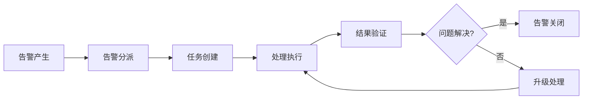

# 从报警到行动：闭环与自愈

在现代IT运维体系中，告警的最终目标不仅仅是通知相关人员，更重要的是推动问题的有效解决和系统的自我修复。从报警到行动的闭环机制，以及系统的自愈能力，是衡量一个先进告警平台成熟度的重要标志。本文将深入探讨如何构建从告警到行动的完整闭环，以及实现系统自愈的关键技术和实践。

## 从报警到行动的演进

### 1. 传统告警模式的局限

传统的告警系统往往只关注告警的产生和通知，缺乏对告警处理过程的跟踪和管理。这种模式存在以下问题：

- **告警黑洞**：告警发出后，缺乏对处理过程的跟踪，无法确认是否被有效处理
- **责任不清**：没有明确的责任分配机制，容易出现推诿现象
- **知识流失**：处理过程中的经验和知识没有被有效沉淀和复用
- **重复告警**：相同问题反复出现，缺乏根本性解决方案

### 2. 闭环管理的价值

从报警到行动的闭环管理能够带来显著价值：



闭环管理的核心价值包括：
- **确保告警得到处理**：通过任务化管理确保每个告警都有明确的处理责任人
- **提升处理效率**：标准化的处理流程和工具集成提升处理效率
- **知识积累**：处理过程中的经验和解决方案被有效记录和复用
- **持续改进**：通过数据分析发现系统性问题，推动根本性改进

## 闭环管理架构设计

### 1. 核心组件架构

```python
class AlertToActionSystem:
    def __init__(self, alert_engine, task_manager, automation_engine, knowledge_base):
        self.alert_engine = alert_engine
        self.task_manager = task_manager
        self.automation_engine = automation_engine
        self.knowledge_base = knowledge_base
        self.workflow_engine = WorkflowEngine()
    
    def process_alert(self, alert):
        """
        处理告警并启动闭环流程
        """
        # 1. 告警分类和优先级评估
        classification = self._classify_alert(alert)
        
        # 2. 自动化处理尝试
        auto_result = self._attempt_automation(alert, classification)
        if auto_result['success']:
            return self._handle_auto_success(alert, auto_result)
        
        # 3. 创建人工处理任务
        task = self._create_manual_task(alert, classification)
        
        # 4. 任务分派和通知
        self._assign_and_notify(task)
        
        # 5. 启动跟踪监控
        self._start_tracking(alert, task)
        
        return task
    
    def _classify_alert(self, alert):
        """
        告警分类和优先级评估
        """
        # 基于告警内容、历史数据、业务影响等因素进行分类
        classifier = AlertClassifier(self.knowledge_base)
        return classifier.classify(alert)
    
    def _attempt_automation(self, alert, classification):
        """
        尝试自动化处理
        """
        # 根据告警分类查找对应的自动化脚本
        automation_script = self.knowledge_base.get_automation_script(
            classification['type']
        )
        
        if automation_script:
            try:
                result = self.automation_engine.execute(
                    automation_script, 
                    alert
                )
                return {'success': True, 'result': result}
            except Exception as e:
                return {'success': False, 'error': str(e)}
        
        return {'success': False, 'reason': 'No automation script found'}
    
    def _handle_auto_success(self, alert, auto_result):
        """
        处理自动化成功的情况
        """
        # 记录自动化处理结果
        self.alert_engine.update_alert_status(
            alert['id'], 
            'resolved', 
            resolution_info=auto_result['result']
        )
        
        # 记录到知识库
        self.knowledge_base.record_automation_success(
            alert, 
            auto_result['result']
        )
        
        return {'status': 'auto_resolved', 'result': auto_result['result']}
    
    def _create_manual_task(self, alert, classification):
        """
        创建人工处理任务
        """
        task_info = {
            'title': f"处理告警: {alert['message']}",
            'description': self._generate_task_description(alert),
            'priority': classification['priority'],
            'assignee': self._determine_assignee(alert, classification),
            'due_date': self._calculate_due_date(classification['priority']),
            'related_alert': alert['id']
        }
        
        return self.task_manager.create_task(task_info)
    
    def _generate_task_description(self, alert):
        """
        生成任务描述
        """
        return f"""
告警详情:
- 服务: {alert.get('service_name', 'Unknown')}
- 内容: {alert.get('message', 'No message')}
- 时间: {alert.get('timestamp', 'Unknown')}
- 严重程度: {alert.get('severity', 'Unknown')}

建议处理步骤:
{self._get_suggested_steps(alert)}
        """.strip()
    
    def _get_suggested_steps(self, alert):
        """
        获取建议处理步骤
        """
        # 从知识库获取相关处理建议
        suggestions = self.knowledge_base.get_suggestions(alert)
        if suggestions:
            return "\n".join([f"{i+1}. {step}" for i, step in enumerate(suggestions)])
        return "请根据告警信息进行分析和处理"
    
    def _determine_assignee(self, alert, classification):
        """
        确定任务负责人
        """
        # 基于告警类型、服务负责人、值班人员等确定负责人
        if classification['type'] == 'database':
            return self._get_database_team_lead()
        elif classification['type'] == 'network':
            return self._get_network_team_lead()
        else:
            return self._get_oncall_engineer()
    
    def _calculate_due_date(self, priority):
        """
        计算任务截止时间
        """
        from datetime import datetime, timedelta
        
        if priority == 'critical':
            return datetime.now() + timedelta(hours=2)
        elif priority == 'high':
            return datetime.now() + timedelta(hours=8)
        elif priority == 'medium':
            return datetime.now() + timedelta(days=1)
        else:
            return datetime.now() + timedelta(days=3)
    
    def _assign_and_notify(self, task):
        """
        任务分派和通知
        """
        # 分派任务
        self.task_manager.assign_task(task['id'], task['assignee'])
        
        # 发送通知
        notification_system = NotificationSystem()
        notification_system.notify_user(
            task['assignee'],
            f"新任务分配: {task['title']}",
            task['description']
        )
    
    def _start_tracking(self, alert, task):
        """
        启动跟踪监控
        """
        # 设置定时检查任务状态
        tracker = TaskTracker(self.task_manager, self.alert_engine)
        tracker.start_tracking(alert['id'], task['id'])
```

### 2. 工作流引擎设计

```python
class WorkflowEngine:
    def __init__(self):
        self.workflows = {}
        self.workflow_instances = {}
    
    def register_workflow(self, workflow_name, workflow_definition):
        """
        注册工作流
        """
        self.workflows[workflow_name] = workflow_definition
    
    def start_workflow(self, workflow_name, context):
        """
        启动工作流实例
        """
        if workflow_name not in self.workflows:
            raise ValueError(f"Workflow {workflow_name} not found")
        
        workflow_def = self.workflows[workflow_name]
        instance_id = self._generate_instance_id()
        
        workflow_instance = WorkflowInstance(
            instance_id, 
            workflow_def, 
            context
        )
        
        self.workflow_instances[instance_id] = workflow_instance
        workflow_instance.start()
        
        return instance_id
    
    def execute_step(self, instance_id, step_name, input_data):
        """
        执行工作流步骤
        """
        if instance_id not in self.workflow_instances:
            raise ValueError(f"Workflow instance {instance_id} not found")
        
        instance = self.workflow_instances[instance_id]
        return instance.execute_step(step_name, input_data)
    
    def get_workflow_status(self, instance_id):
        """
        获取工作流状态
        """
        if instance_id not in self.workflow_instances:
            raise ValueError(f"Workflow instance {instance_id} not found")
        
        instance = self.workflow_instances[instance_id]
        return instance.get_status()
    
    def _generate_instance_id(self):
        """
        生成实例ID
        """
        import uuid
        return str(uuid.uuid4())

class WorkflowInstance:
    def __init__(self, instance_id, workflow_definition, context):
        self.instance_id = instance_id
        self.definition = workflow_definition
        self.context = context
        self.current_step = 0
        self.status = 'pending'
        self.step_results = {}
    
    def start(self):
        """
        启动工作流实例
        """
        self.status = 'running'
        self._execute_next_step()
    
    def execute_step(self, step_name, input_data):
        """
        执行特定步骤
        """
        # 找到对应的步骤
        step = self._find_step(step_name)
        if not step:
            raise ValueError(f"Step {step_name} not found")
        
        # 执行步骤
        try:
            result = step['action'](input_data, self.context)
            self.step_results[step_name] = {
                'status': 'success',
                'result': result,
                'timestamp': datetime.now()
            }
            return result
        except Exception as e:
            self.step_results[step_name] = {
                'status': 'failed',
                'error': str(e),
                'timestamp': datetime.now()
            }
            raise e
    
    def _execute_next_step(self):
        """
        执行下一步
        """
        if self.current_step >= len(self.definition['steps']):
            self.status = 'completed'
            return
        
        step = self.definition['steps'][self.current_step]
        try:
            result = step['action'](self.context)
            self.step_results[step['name']] = {
                'status': 'success',
                'result': result,
                'timestamp': datetime.now()
            }
            self.current_step += 1
            self._execute_next_step()
        except Exception as e:
            self.step_results[step['name']] = {
                'status': 'failed',
                'error': str(e),
                'timestamp': datetime.now()
            }
            self.status = 'failed'
    
    def get_status(self):
        """
        获取实例状态
        """
        return {
            'instance_id': self.instance_id,
            'status': self.status,
            'current_step': self.current_step,
            'step_results': self.step_results
        }
    
    def _find_step(self, step_name):
        """
        查找步骤
        """
        for step in self.definition['steps']:
            if step['name'] == step_name:
                return step
        return None
```

## 任务管理系统实现

### 1. 任务生命周期管理

```python
class TaskManager:
    def __init__(self, db_connection):
        self.db = db_connection
        self.task_lifecycle = TaskLifecycle()
    
    def create_task(self, task_info):
        """
        创建任务
        """
        task_id = self._generate_task_id()
        
        task = {
            'id': task_id,
            'title': task_info['title'],
            'description': task_info['description'],
            'priority': task_info['priority'],
            'status': 'pending',
            'created_at': datetime.now(),
            'assignee': task_info.get('assignee'),
            'due_date': task_info.get('due_date'),
            'related_alert': task_info.get('related_alert'),
            'history': []
        }
        
        # 保存到数据库
        self._save_task(task)
        
        # 记录历史
        self._record_task_history(task_id, 'created', 'Task created')
        
        return task
    
    def assign_task(self, task_id, assignee):
        """
        分派任务
        """
        task = self.get_task(task_id)
        if not task:
            raise ValueError(f"Task {task_id} not found")
        
        task['assignee'] = assignee
        task['status'] = 'assigned'
        
        # 更新数据库
        self._update_task(task)
        
        # 记录历史
        self._record_task_history(
            task_id, 
            'assigned', 
            f"Task assigned to {assignee}"
        )
    
    def update_task_status(self, task_id, status, notes=""):
        """
        更新任务状态
        """
        task = self.get_task(task_id)
        if not task:
            raise ValueError(f"Task {task_id} not found")
        
        old_status = task['status']
        task['status'] = status
        
        # 更新数据库
        self._update_task(task)
        
        # 记录历史
        history_note = f"Status changed from {old_status} to {status}"
        if notes:
            history_note += f" - {notes}"
        self._record_task_history(task_id, 'status_changed', history_note)
        
        # 触发相关事件
        self._trigger_task_events(task_id, status)
    
    def add_task_comment(self, task_id, user, comment):
        """
        添加任务评论
        """
        query = """
        INSERT INTO task_comments 
        (task_id, user_id, comment, created_at)
        VALUES (%s, %s, %s, NOW())
        """
        self.db.execute(query, (task_id, user, comment))
    
    def get_task(self, task_id):
        """
        获取任务信息
        """
        query = """
        SELECT * FROM tasks WHERE id = %s
        """
        result = self.db.execute(query, (task_id,))
        return result[0] if result else None
    
    def get_user_tasks(self, user_id, status=None):
        """
        获取用户任务
        """
        if status:
            query = """
            SELECT * FROM tasks 
            WHERE assignee = %s AND status = %s
            ORDER BY priority DESC, due_date ASC
            """
            return self.db.execute(query, (user_id, status))
        else:
            query = """
            SELECT * FROM tasks 
            WHERE assignee = %s
            ORDER BY priority DESC, due_date ASC
            """
            return self.db.execute(query, (user_id,))
    
    def _generate_task_id(self):
        """
        生成任务ID
        """
        import uuid
        return str(uuid.uuid4())[:8]
    
    def _save_task(self, task):
        """
        保存任务到数据库
        """
        query = """
        INSERT INTO tasks 
        (id, title, description, priority, status, created_at, assignee, due_date, related_alert)
        VALUES (%s, %s, %s, %s, %s, %s, %s, %s, %s)
        """
        self.db.execute(query, (
            task['id'],
            task['title'],
            task['description'],
            task['priority'],
            task['status'],
            task['created_at'],
            task['assignee'],
            task['due_date'],
            task['related_alert']
        ))
    
    def _update_task(self, task):
        """
        更新任务信息
        """
        query = """
        UPDATE tasks 
        SET title = %s, description = %s, priority = %s, status = %s, 
            assignee = %s, due_date = %s, related_alert = %s
        WHERE id = %s
        """
        self.db.execute(query, (
            task['title'],
            task['description'],
            task['priority'],
            task['status'],
            task['assignee'],
            task['due_date'],
            task['related_alert'],
            task['id']
        ))
    
    def _record_task_history(self, task_id, action, notes):
        """
        记录任务历史
        """
        query = """
        INSERT INTO task_history 
        (task_id, action, notes, created_at)
        VALUES (%s, %s, %s, NOW())
        """
        self.db.execute(query, (task_id, action, notes))
    
    def _trigger_task_events(self, task_id, status):
        """
        触发任务事件
        """
        # 根据任务状态触发相应事件
        if status == 'completed':
            self._on_task_completed(task_id)
        elif status == 'failed':
            self._on_task_failed(task_id)
    
    def _on_task_completed(self, task_id):
        """
        任务完成时的处理
        """
        task = self.get_task(task_id)
        if task and task['related_alert']:
            # 更新关联告警状态
            alert_engine = AlertEngine()
            alert_engine.update_alert_status(
                task['related_alert'], 
                'resolved',
                resolution_info=f"Task {task_id} completed"
            )
    
    def _on_task_failed(self, task_id):
        """
        任务失败时的处理
        """
        # 可以触发告警升级或其他处理
        pass

class TaskLifecycle:
    def __init__(self):
        self.valid_transitions = {
            'pending': ['assigned', 'cancelled'],
            'assigned': ['in_progress', 'cancelled'],
            'in_progress': ['completed', 'failed', 'on_hold'],
            'on_hold': ['in_progress', 'cancelled'],
            'completed': [],
            'failed': ['assigned'],
            'cancelled': []
        }
    
    def is_valid_transition(self, from_status, to_status):
        """
        验证状态转换是否有效
        """
        if from_status not in self.valid_transitions:
            return False
        return to_status in self.valid_transitions[from_status]
    
    def get_allowed_transitions(self, current_status):
        """
        获取允许的状态转换
        """
        return self.valid_transitions.get(current_status, [])
```

### 2. 任务优先级和SLA管理

```python
class TaskPriorityManager:
    def __init__(self, db_connection):
        self.db = db_connection
        self.priority_rules = self._load_priority_rules()
    
    def _load_priority_rules(self):
        """
        加载优先级规则
        """
        return {
            'critical': {
                'severity_threshold': 'critical',
                'business_impact': 'high',
                'response_time': 120,  # 2小时
                'resolution_time': 1440  # 24小时
            },
            'high': {
                'severity_threshold': 'warning',
                'business_impact': 'medium',
                'response_time': 480,  # 8小时
                'resolution_time': 2880  # 48小时
            },
            'medium': {
                'severity_threshold': 'info',
                'business_impact': 'low',
                'response_time': 1440,  # 24小时
                'resolution_time': 10080  # 7天
            },
            'low': {
                'response_time': 4320,  # 3天
                'resolution_time': 43200  # 30天
            }
        }
    
    def calculate_task_priority(self, alert):
        """
        计算任务优先级
        """
        # 基于告警严重程度、业务影响、历史数据等因素计算优先级
        severity_score = self._get_severity_score(alert['severity'])
        impact_score = self._get_business_impact_score(alert)
        history_score = self._get_history_score(alert)
        
        total_score = severity_score + impact_score + history_score
        
        if total_score >= 90:
            return 'critical'
        elif total_score >= 70:
            return 'high'
        elif total_score >= 50:
            return 'medium'
        else:
            return 'low'
    
    def _get_severity_score(self, severity):
        """
        获取严重程度分数
        """
        scores = {'critical': 50, 'warning': 30, 'info': 10}
        return scores.get(severity, 10)
    
    def _get_business_impact_score(self, alert):
        """
        获取业务影响分数
        """
        # 根据服务重要性、用户影响范围等评估
        service_importance = self._get_service_importance(alert['service_name'])
        user_impact = self._get_user_impact(alert)
        
        return service_importance * 20 + user_impact * 10
    
    def _get_history_score(self, alert):
        """
        获取历史数据分数
        """
        # 根据相同告警的历史发生频率评估
        frequency = self._get_alert_frequency(alert)
        return min(frequency * 5, 20)  # 最高20分
    
    def monitor_sla_compliance(self):
        """
        监控SLA合规性
        """
        # 获取即将超时的任务
        approaching_deadlines = self._get_approaching_deadlines()
        
        # 发送提醒
        for task in approaching_deadlines:
            self._send_sla_reminder(task)
        
        # 获取已超时的任务
        overdue_tasks = self._get_overdue_tasks()
        
        # 触发升级流程
        for task in overdue_tasks:
            self._escalate_overdue_task(task)
    
    def _get_approaching_deadlines(self):
        """
        获取即将超时的任务
        """
        query = """
        SELECT * FROM tasks 
        WHERE status IN ('pending', 'assigned', 'in_progress')
        AND due_date <= DATE_ADD(NOW(), INTERVAL 1 HOUR)
        AND due_date > NOW()
        """
        return self.db.execute(query)
    
    def _get_overdue_tasks(self):
        """
        获取已超时的任务
        """
        query = """
        SELECT * FROM tasks 
        WHERE status IN ('pending', 'assigned', 'in_progress')
        AND due_date < NOW()
        """
        return self.db.execute(query)
    
    def _send_sla_reminder(self, task):
        """
        发送SLA提醒
        """
        notification_system = NotificationSystem()
        notification_system.notify_user(
            task['assignee'],
            f"任务即将超时提醒: {task['title']}",
            f"任务截止时间: {task['due_date']}"
        )
    
    def _escalate_overdue_task(self, task):
        """
        升级超时任务
        """
        # 通知上级或值班经理
        escalation_manager = EscalationManager()
        escalation_manager.escalate_task(task)
```

## 自动化处理引擎

### 1. 自动化脚本管理

```python
class AutomationEngine:
    def __init__(self, script_repository, execution_environment):
        self.script_repository = script_repository
        self.execution_environment = execution_environment
        self.script_cache = {}
    
    def execute(self, script_name, context):
        """
        执行自动化脚本
        """
        # 获取脚本
        script = self._get_script(script_name)
        if not script:
            raise ValueError(f"Script {script_name} not found")
        
        # 验证脚本安全性
        if not self._validate_script(script):
            raise ValueError(f"Script {script_name} failed security validation")
        
        # 准备执行环境
        execution_context = self._prepare_execution_context(context)
        
        # 执行脚本
        result = self._execute_script(script, execution_context)
        
        # 记录执行结果
        self._record_execution(script_name, context, result)
        
        return result
    
    def _get_script(self, script_name):
        """
        获取脚本
        """
        if script_name in self.script_cache:
            return self.script_cache[script_name]
        
        script = self.script_repository.get_script(script_name)
        if script:
            self.script_cache[script_name] = script
        
        return script
    
    def _validate_script(self, script):
        """
        验证脚本安全性
        """
        # 检查脚本是否在白名单中
        if not self.script_repository.is_whitelisted(script['name']):
            return False
        
        # 检查脚本内容安全性
        security_checker = ScriptSecurityChecker()
        return security_checker.check(script['content'])
    
    def _prepare_execution_context(self, context):
        """
        准备执行环境
        """
        execution_context = {
            'alert': context.get('alert', {}),
            'environment': self.execution_environment,
            'credentials': self._get_required_credentials(context),
            'timeout': context.get('timeout', 300)
        }
        return execution_context
    
    def _execute_script(self, script, execution_context):
        """
        执行脚本
        """
        try:
            # 根据脚本类型选择执行器
            if script['type'] == 'python':
                executor = PythonScriptExecutor()
            elif script['type'] == 'shell':
                executor = ShellScriptExecutor()
            elif script['type'] == 'ansible':
                executor = AnsibleScriptExecutor()
            else:
                raise ValueError(f"Unsupported script type: {script['type']}")
            
            return executor.execute(script['content'], execution_context)
        except Exception as e:
            return {'success': False, 'error': str(e)}
    
    def _record_execution(self, script_name, context, result):
        """
        记录执行结果
        """
        execution_record = {
            'script_name': script_name,
            'context': context,
            'result': result,
            'executed_at': datetime.now(),
            'execution_time': result.get('execution_time', 0)
        }
        
        # 保存到数据库
        self.script_repository.record_execution(execution_record)
    
    def _get_required_credentials(self, context):
        """
        获取所需凭证
        """
        # 根据上下文确定所需凭证
        required_creds = context.get('required_credentials', [])
        credentials_manager = CredentialsManager()
        return credentials_manager.get_credentials(required_creds)

class ScriptRepository:
    def __init__(self, db_connection, file_storage):
        self.db = db_connection
        self.file_storage = file_storage
        self.whitelist = self._load_whitelist()
    
    def get_script(self, script_name):
        """
        获取脚本
        """
        query = """
        SELECT name, type, content, version, created_at, updated_at
        FROM automation_scripts
        WHERE name = %s AND enabled = 1
        """
        result = self.db.execute(query, (script_name,))
        return result[0] if result else None
    
    def save_script(self, script_info):
        """
        保存脚本
        """
        query = """
        INSERT INTO automation_scripts 
        (name, type, content, version, description, created_by, created_at)
        VALUES (%s, %s, %s, %s, %s, %s, NOW())
        ON DUPLICATE KEY UPDATE
        type = VALUES(type), content = VALUES(content), 
        version = VALUES(version), updated_at = NOW()
        """
        self.db.execute(query, (
            script_info['name'],
            script_info['type'],
            script_info['content'],
            script_info['version'],
            script_info['description'],
            script_info['created_by']
        ))
    
    def is_whitelisted(self, script_name):
        """
        检查脚本是否在白名单中
        """
        return script_name in self.whitelist
    
    def _load_whitelist(self):
        """
        加载白名单
        """
        query = """
        SELECT script_name FROM script_whitelist
        """
        results = self.db.execute(query)
        return [result[0] for result in results]

class ScriptSecurityChecker:
    def __init__(self):
        self.dangerous_patterns = [
            r'rm\s+-rf',
            r'sudo',
            r'system\(',
            r'exec\(',
            r'eval\(',
            r'os\.system',
            r'subprocess\.call'
        ]
    
    def check(self, script_content):
        """
        检查脚本安全性
        """
        import re
        
        # 检查危险模式
        for pattern in self.dangerous_patterns:
            if re.search(pattern, script_content):
                return False
        
        # 检查文件操作权限
        if self._has_unsafe_file_operations(script_content):
            return False
        
        return True
    
    def _has_unsafe_file_operations(self, script_content):
        """
        检查不安全的文件操作
        """
        import re
        
        # 检查是否尝试访问敏感目录
        sensitive_paths = [
            r'/etc/',
            r'/root/',
            r'/usr/local/',
            r'C:\\Windows\\'
        ]
        
        for path in sensitive_paths:
            if re.search(path, script_content):
                return True
        
        return False
```

### 2. 自动化执行器实现

```python
import subprocess
import threading
import time

class PythonScriptExecutor:
    def execute(self, script_content, context):
        """
        执行Python脚本
        """
        start_time = time.time()
        
        try:
            # 创建安全的执行环境
            safe_globals = {
                '__builtins__': {
                    'print': print,
                    'len': len,
                    'str': str,
                    'int': int,
                    'float': float,
                    'list': list,
                    'dict': dict,
                    'range': range,
                    'enumerate': enumerate,
                    'zip': zip,
                    'min': min,
                    'max': max,
                    'sum': sum,
                    'abs': abs,
                    'round': round
                }
            }
            
            # 添加上下文变量
            safe_globals.update(context)
            
            # 执行脚本
            exec(script_content, safe_globals)
            
            execution_time = time.time() - start_time
            return {
                'success': True,
                'result': safe_globals.get('result', 'Script executed successfully'),
                'execution_time': execution_time
            }
        except Exception as e:
            execution_time = time.time() - start_time
            return {
                'success': False,
                'error': str(e),
                'execution_time': execution_time
            }

class ShellScriptExecutor:
    def execute(self, script_content, context):
        """
        执行Shell脚本
        """
        start_time = time.time()
        
        try:
            # 创建临时脚本文件
            import tempfile
            import os
            
            with tempfile.NamedTemporaryFile(mode='w', suffix='.sh', delete=False) as f:
                f.write("#!/bin/bash\n")
                f.write("set -e\n")  # 遇到错误时退出
                f.write(script_content)
                script_path = f.name
            
            # 设置执行权限
            os.chmod(script_path, 0o755)
            
            # 执行脚本
            timeout = context.get('timeout', 300)
            result = subprocess.run(
                [script_path],
                capture_output=True,
                text=True,
                timeout=timeout,
                env=self._prepare_environment(context)
            )
            
            # 清理临时文件
            os.unlink(script_path)
            
            execution_time = time.time() - start_time
            return {
                'success': result.returncode == 0,
                'stdout': result.stdout,
                'stderr': result.stderr,
                'execution_time': execution_time
            }
        except subprocess.TimeoutExpired:
            execution_time = time.time() - start_time
            return {
                'success': False,
                'error': 'Script execution timeout',
                'execution_time': execution_time
            }
        except Exception as e:
            execution_time = time.time() - start_time
            return {
                'success': False,
                'error': str(e),
                'execution_time': execution_time
            }
    
    def _prepare_environment(self, context):
        """
        准备执行环境变量
        """
        import os
        env = os.environ.copy()
        
        # 添加上下文中的环境变量
        if 'environment' in context:
            env.update(context['environment'])
        
        return env

class AnsibleScriptExecutor:
    def execute(self, script_content, context):
        """
        执行Ansible脚本
        """
        start_time = time.time()
        
        try:
            # 创建临时playbook文件
            import tempfile
            import os
            import yaml
            
            # 解析脚本内容
            playbook_data = yaml.safe_load(script_content)
            
            with tempfile.NamedTemporaryFile(mode='w', suffix='.yml', delete=False) as f:
                yaml.dump(playbook_data, f)
                playbook_path = f.name
            
            # 构造Ansible命令
            cmd = ['ansible-playbook', playbook_path]
            
            # 添加额外参数
            if 'ansible_inventory' in context:
                cmd.extend(['-i', context['ansible_inventory']])
            
            # 执行Ansible
            timeout = context.get('timeout', 300)
            result = subprocess.run(
                cmd,
                capture_output=True,
                text=True,
                timeout=timeout
            )
            
            # 清理临时文件
            os.unlink(playbook_path)
            
            execution_time = time.time() - start_time
            return {
                'success': result.returncode == 0,
                'stdout': result.stdout,
                'stderr': result.stderr,
                'execution_time': execution_time
            }
        except Exception as e:
            execution_time = time.time() - start_time
            return {
                'success': False,
                'error': str(e),
                'execution_time': execution_time
            }
```

## 闭环验证机制

### 1. 解决方案验证

```python
class ResolutionValidator:
    def __init__(self, monitoring_system, alert_engine):
        self.monitoring_system = monitoring_system
        self.alert_engine = alert_engine
    
    def validate_resolution(self, alert_id, resolution_info):
        """
        验证解决方案
        """
        # 获取原始告警
        alert = self.alert_engine.get_alert(alert_id)
        if not alert:
            return {'valid': False, 'reason': 'Alert not found'}
        
        # 检查相关指标是否恢复正常
        metrics_check = self._check_metrics_recovery(alert)
        if not metrics_check['recovered']:
            return {
                'valid': False, 
                'reason': f"Metrics not recovered: {metrics_check['details']}"
            }
        
        # 检查是否产生新的告警
        new_alerts_check = self._check_new_alerts(alert)
        if new_alerts_check['has_new_alerts']:
            return {
                'valid': False,
                'reason': f"New alerts generated: {new_alerts_check['details']}"
            }
        
        # 检查服务可用性
        availability_check = self._check_service_availability(alert)
        if not availability_check['available']:
            return {
                'valid': False,
                'reason': f"Service not available: {availability_check['details']}"
            }
        
        return {
            'valid': True,
            'validation_time': datetime.now(),
            'details': {
                'metrics_check': metrics_check,
                'new_alerts_check': new_alerts_check,
                'availability_check': availability_check
            }
        }
    
    def _check_metrics_recovery(self, alert):
        """
        检查指标是否恢复正常
        """
        service_name = alert.get('service_name')
        if not service_name:
            return {'recovered': False, 'details': 'No service name provided'}
        
        # 获取相关指标
        metrics = self.monitoring_system.get_service_metrics(service_name)
        
        # 检查关键指标是否恢复正常
        critical_metrics = self._get_critical_metrics(alert)
        recovered_metrics = []
        failed_metrics = []
        
        for metric_name, threshold in critical_metrics.items():
            if metric_name in metrics:
                current_value = metrics[metric_name]
                if self._is_metric_recovered(current_value, threshold):
                    recovered_metrics.append(metric_name)
                else:
                    failed_metrics.append({
                        'metric': metric_name,
                        'current': current_value,
                        'threshold': threshold
                    })
        
        return {
            'recovered': len(failed_metrics) == 0,
            'recovered_metrics': recovered_metrics,
            'failed_metrics': failed_metrics,
            'details': f"Recovered: {len(recovered_metrics)}, Failed: {len(failed_metrics)}"
        }
    
    def _check_new_alerts(self, alert):
        """
        检查是否产生新的告警
        """
        service_name = alert.get('service_name')
        check_start_time = alert.get('resolved_at', datetime.now())
        
        # 查询相关服务在解决后是否产生新告警
        new_alerts = self.alert_engine.get_alerts(
            service_name=service_name,
            start_time=check_start_time,
            end_time=datetime.now()
        )
        
        # 过滤掉确认为副作用的告警
        significant_alerts = self._filter_significant_alerts(new_alerts)
        
        return {
            'has_new_alerts': len(significant_alerts) > 0,
            'alert_count': len(significant_alerts),
            'details': [f"{a['message']} ({a['severity']})" for a in significant_alerts]
        }
    
    def _check_service_availability(self, alert):
        """
        检查服务可用性
        """
        service_name = alert.get('service_name')
        if not service_name:
            return {'available': False, 'details': 'No service name provided'}
        
        # 执行服务健康检查
        health_check = self.monitoring_system.check_service_health(service_name)
        
        return {
            'available': health_check['status'] == 'healthy',
            'details': health_check['message']
        }
    
    def _get_critical_metrics(self, alert):
        """
        获取关键指标阈值
        """
        # 根据告警类型确定关键指标
        alert_type = alert.get('alert_type', 'generic')
        if alert_type == 'cpu_usage':
            return {'cpu_usage': 80}
        elif alert_type == 'memory_usage':
            return {'memory_usage': 85}
        elif alert_type == 'disk_usage':
            return {'disk_usage': 90}
        else:
            return {'generic_metric': 0}
    
    def _is_metric_recovered(self, current_value, threshold):
        """
        判断指标是否恢复正常
        """
        # 对于使用率指标，恢复正常意味着低于阈值
        if isinstance(threshold, (int, float)):
            return current_value < threshold
        return True
    
    def _filter_significant_alerts(self, alerts):
        """
        过滤重要告警
        """
        # 过滤掉低优先级或已知副作用的告警
        significant_alerts = []
        for alert in alerts:
            if alert['severity'] in ['critical', 'warning']:
                # 检查是否为已知副作用
                if not self._is_known_side_effect(alert):
                    significant_alerts.append(alert)
        return significant_alerts
    
    def _is_known_side_effect(self, alert):
        """
        判断是否为已知副作用
        """
        # 简化实现，实际应该查询副作用数据库
        known_side_effects = [
            "重启后服务暂时不可用",
            "配置更新后短暂延迟"
        ]
        
        for effect in known_side_effects:
            if effect in alert['message']:
                return True
        return False
```

### 2. 告警关闭机制

```python
class AlertClosureManager:
    def __init__(self, alert_engine, resolution_validator, knowledge_base):
        self.alert_engine = alert_engine
        self.resolution_validator = resolution_validator
        self.knowledge_base = knowledge_base
    
    def close_alert(self, alert_id, closure_info):
        """
        关闭告警
        """
        # 验证解决方案
        validation_result = self.resolution_validator.validate_resolution(
            alert_id, 
            closure_info
        )
        
        if not validation_result['valid']:
            # 验证失败，重新打开告警或创建新告警
            return self._handle_validation_failure(alert_id, validation_result)
        
        # 更新告警状态
        self.alert_engine.update_alert_status(
            alert_id,
            'resolved',
            resolution_info=closure_info,
            resolved_at=datetime.now()
        )
        
        # 记录解决信息
        self._record_resolution(alert_id, closure_info, validation_result)
        
        # 更新知识库
        self._update_knowledge_base(alert_id, closure_info)
        
        # 触发后续动作
        self._trigger_post_closure_actions(alert_id, closure_info)
        
        return {'status': 'closed', 'validation': validation_result}
    
    def auto_close_alert(self, alert_id):
        """
        自动关闭告警
        """
        # 获取告警信息
        alert = self.alert_engine.get_alert(alert_id)
        if not alert:
            return {'status': 'error', 'message': 'Alert not found'}
        
        # 检查是否满足自动关闭条件
        if not self._can_auto_close(alert):
            return {'status': 'error', 'message': 'Auto-close conditions not met'}
        
        # 自动生成关闭信息
        closure_info = self._generate_auto_closure_info(alert)
        
        # 执行关闭操作
        return self.close_alert(alert_id, closure_info)
    
    def _handle_validation_failure(self, alert_id, validation_result):
        """
        处理验证失败
        """
        # 记录验证失败
        self.alert_engine.add_alert_note(
            alert_id,
            f"Resolution validation failed: {validation_result['reason']}"
        )
        
        # 创建相关告警
        related_alert_id = self.alert_engine.create_related_alert(
            alert_id,
            f"Resolution validation failed for alert #{alert_id}",
            'warning'
        )
        
        return {
            'status': 'validation_failed',
            'related_alert_id': related_alert_id,
            'validation_result': validation_result
        }
    
    def _record_resolution(self, alert_id, closure_info, validation_result):
        """
        记录解决信息
        """
        resolution_record = {
            'alert_id': alert_id,
            'resolved_by': closure_info.get('resolved_by', 'system'),
            'resolution_method': closure_info.get('method', 'unknown'),
            'resolution_time': datetime.now(),
            'validation_result': validation_result
        }
        
        self.alert_engine.record_resolution(resolution_record)
    
    def _update_knowledge_base(self, alert_id, closure_info):
        """
        更新知识库
        """
        # 提取解决方案信息
        solution_info = {
            'alert_type': closure_info.get('alert_type'),
            'resolution_method': closure_info.get('method'),
            'resolution_steps': closure_info.get('steps', []),
            'success': closure_info.get('success', True),
            'notes': closure_info.get('notes', '')
        }
        
        # 保存到知识库
        self.knowledge_base.save_solution(alert_id, solution_info)
    
    def _trigger_post_closure_actions(self, alert_id, closure_info):
        """
        触发关闭后动作
        """
        # 发送关闭通知
        self._send_closure_notification(alert_id, closure_info)
        
        # 更新相关任务状态
        self._update_related_tasks(alert_id)
        
        # 生成报告
        self._generate_closure_report(alert_id, closure_info)
    
    def _can_auto_close(self, alert):
        """
        检查是否可以自动关闭
        """
        # 检查告警类型是否支持自动关闭
        auto_closable_types = ['self_healing', 'transient']
        if alert.get('alert_type') not in auto_closable_types:
            return False
        
        # 检查是否经过足够时间观察
        if 'triggered_at' in alert:
            time_since_trigger = datetime.now() - alert['triggered_at']
            if time_since_trigger.total_seconds() < 300:  # 5分钟
                return False
        
        # 检查指标是否稳定
        return self._are_metrics_stable(alert)
    
    def _generate_auto_closure_info(self, alert):
        """
        生成自动关闭信息
        """
        return {
            'resolved_by': 'auto_closure_system',
            'method': 'automatic_verification',
            'steps': ['System automatically verified resolution'],
            'success': True,
            'notes': f"Automatically closed after verification for alert #{alert['id']}"
        }
    
    def _send_closure_notification(self, alert_id, closure_info):
        """
        发送关闭通知
        """
        # 通知相关人员
        notification_system = NotificationSystem()
        notification_system.notify_channel(
            'alert_closure',
            f"Alert #{alert_id} has been resolved",
            f"Resolution method: {closure_info.get('method', 'unknown')}"
        )
    
    def _update_related_tasks(self, alert_id):
        """
        更新相关任务状态
        """
        task_manager = TaskManager()
        related_tasks = task_manager.get_tasks_by_alert(alert_id)
        
        for task in related_tasks:
            if task['status'] not in ['completed', 'cancelled']:
                task_manager.update_task_status(
                    task['id'],
                    'completed',
                    notes=f"Alert #{alert_id} resolved"
                )
    
    def _generate_closure_report(self, alert_id, closure_info):
        """
        生成关闭报告
        """
        # 简化实现，实际应该生成详细报告
        report = {
            'alert_id': alert_id,
            'closure_time': datetime.now(),
            'method': closure_info.get('method'),
            'success': closure_info.get('success', True)
        }
        
        # 保存报告
        self.alert_engine.save_closure_report(report)
```

## 效果度量与持续改进

### 1. 闭环效果指标

```python
class ClosureMetrics:
    def __init__(self, db_connection):
        self.db = db_connection
    
    def calculate_closure_rate(self, start_time, end_time):
        """
        计算告警关闭率
        """
        query = """
        SELECT 
            COUNT(*) as total_alerts,
            SUM(CASE WHEN status = 'resolved' THEN 1 ELSE 0 END) as resolved_alerts
        FROM alerts
        WHERE created_at BETWEEN %s AND %s
        """
        result = self.db.execute(query, (start_time, end_time))
        total, resolved = result[0] if result else (0, 0)
        return resolved / total if total > 0 else 0
    
    def calculate_mean_time_to_resolution(self, start_time, end_time):
        """
        计算平均解决时间
        """
        query = """
        SELECT AVG(TIMESTAMPDIFF(SECOND, created_at, resolved_at)) as mttr
        FROM alerts
        WHERE created_at BETWEEN %s AND %s
        AND resolved_at IS NOT NULL
        """
        result = self.db.execute(query, (start_time, end_time))
        return result[0][0] if result and result[0][0] else 0
    
    def calculate_auto_closure_rate(self, start_time, end_time):
        """
        计算自动关闭率
        """
        query = """
        SELECT 
            COUNT(*) as total_resolved,
            SUM(CASE WHEN resolved_by = 'auto_closure_system' THEN 1 ELSE 0 END) as auto_closed
        FROM alerts
        WHERE resolved_at BETWEEN %s AND %s
        """
        result = self.db.execute(query, (start_time, end_time))
        total, auto_closed = result[0] if result else (0, 0)
        return auto_closed / total if total > 0 else 0
    
    def calculate_resolution_validation_success_rate(self, start_time, end_time):
        """
        计算解决验证成功率
        """
        query = """
        SELECT 
            COUNT(*) as total_validations,
            SUM(CASE WHEN validation_result->'$.valid' = 'true' THEN 1 ELSE 0 END) as successful_validations
        FROM alert_resolutions
        WHERE resolution_time BETWEEN %s AND %s
        """
        result = self.db.execute(query, (start_time, end_time))
        total, successful = result[0] if result else (0, 0)
        return successful / total if total > 0 else 0

class ClosureDashboard:
    def __init__(self, metrics):
        self.metrics = metrics
        plt.rcParams['font.sans-serif'] = ['SimHei']
        plt.rcParams['axes.unicode_minus'] = False
    
    def plot_closure_trends(self, days=30):
        """
        绘制关闭趋势图
        """
        dates = []
        closure_rates = []
        mttr_values = []
        
        for i in range(days):
            date = f"2025-08-{i+1:02d}"
            rate = self.metrics.calculate_closure_rate(date, date)
            mttr = self.metrics.calculate_mean_time_to_resolution(date, date)
            
            dates.append(date)
            closure_rates.append(rate * 100)
            mttr_values.append(mttr / 60)  # 转换为分钟
        
        # 创建子图
        fig, (ax1, ax2) = plt.subplots(2, 1, figsize=(12, 10))
        
        # 关闭率趋势
        ax1.plot(dates, closure_rates, marker='o', linewidth=2, markersize=4)
        ax1.set_title('告警关闭率趋势')
        ax1.set_ylabel('关闭率 (%)')
        ax1.grid(True, alpha=0.3)
        ax1.set_xticklabels(dates, rotation=45)
        
        # MTTR趋势
        ax2.plot(dates, mttr_values, marker='s', color='orange', linewidth=2, markersize=4)
        ax2.set_title('平均解决时间趋势')
        ax2.set_ylabel('平均解决时间 (分钟)')
        ax2.set_xlabel('日期')
        ax2.grid(True, alpha=0.3)
        ax2.set_xticklabels(dates, rotation=45)
        
        plt.tight_layout()
        plt.savefig('closure_trends.png', dpi=300, bbox_inches='tight')
        plt.show()
```

### 2. 持续改进机制

```python
class ContinuousImprovement:
    def __init__(self, db_connection, metrics, knowledge_base):
        self.db = db_connection
        self.metrics = metrics
        self.knowledge_base = knowledge_base
    
    def conduct_closure_review(self, period="monthly"):
        """
        开展关闭回顾
        """
        # 收集数据
        closure_data = self._collect_closure_data(period)
        failure_cases = self._collect_failure_cases(period)
        
        # 分析问题
        issues = self._analyze_closure_issues(closure_data, failure_cases)
        
        # 制定改进措施
        improvements = self._generate_improvements(issues)
        
        # 生成报告
        report = self._generate_review_report(period, issues, improvements)
        
        return report
    
    def _collect_closure_data(self, period):
        """
        收集关闭数据
        """
        # 简化实现
        return {}
    
    def _collect_failure_cases(self, period):
        """
        收集失败案例
        """
        query = """
        SELECT alert_id, validation_result, resolution_method
        FROM alert_resolutions
        WHERE resolution_time >= DATE_SUB(NOW(), INTERVAL 1 MONTH)
        AND validation_result->'$.valid' = 'false'
        """
        return self.db.execute(query)
    
    def _analyze_closure_issues(self, closure_data, failure_cases):
        """
        分析关闭问题
        """
        issues = []
        
        # 基于失败案例分析
        for case in failure_cases:
            validation_result = json.loads(case[1]) if case[1] else {}
            failure_reason = validation_result.get('reason', 'Unknown')
            
            issues.append({
                'type': 'validation_failure',
                'description': f"解决验证失败: {failure_reason}",
                'evidence': case[0]  # alert_id
            })
        
        return issues
    
    def _generate_improvements(self, issues):
        """
        生成改进措施
        """
        improvements = []
        
        for issue in issues:
            if issue["type"] == "validation_failure":
                improvements.append({
                    "issue": issue["description"],
                    "improvement": "优化解决验证逻辑，增加更多检查点",
                    "responsible": "质量保证团队",
                    "timeline": "2周内"
                })
        
        return improvements
    
    def _generate_review_report(self, period, issues, improvements):
        """
        生成回顾报告
        """
        report = {
            "period": period,
            "generated_at": datetime.now().isoformat(),
            "issues_identified": issues,
            "improvement_proposals": improvements
        }
        return report
    
    def implement_improvement(self, improvement):
        """
        实施改进措施
        """
        # 根据改进类型执行相应操作
        if "优化解决验证逻辑" in improvement["improvement"]:
            self._enhance_validation_logic()
        elif "增加更多检查点" in improvement["improvement"]:
            self._add_validation_checkpoints()
    
    def _enhance_validation_logic(self):
        """
        增强验证逻辑
        """
        # 更新验证器逻辑
        pass
    
    def _add_validation_checkpoints(self):
        """
        增加验证检查点
        """
        # 添加新的验证检查点
        pass
```

## 最佳实践与注意事项

### 1. 闭环管理最佳实践

```python
class ClosureBestPractices:
    def __init__(self):
        self.practices = self._define_best_practices()
    
    def _define_best_practices(self):
        """
        定义最佳实践
        """
        return {
            "任务管理": [
                "每个告警都应关联具体任务",
                "明确任务负责人和截止时间",
                "及时更新任务状态和进展"
            ],
            "自动化处理": [
                "优先考虑安全的自动化解决方案",
                "建立自动化脚本的版本控制",
                "定期审查和测试自动化脚本"
            ],
            "验证机制": [
                "实施多层次的解决验证",
                "建立副作用检测机制",
                "设置合理的观察期"
            ],
            "知识管理": [
                "及时记录和分享解决方案",
                "建立解决方案的分类体系",
                "定期回顾和优化知识库"
            ]
        }
    
    def generate_closure_checklist(self):
        """
        生成关闭检查清单
        """
        checklist = """
# 告警关闭检查清单

## 解决方案验证
- [ ] 相关指标已恢复正常
- [ ] 未产生新的副作用告警
- [ ] 服务可用性已确认
- [ ] 用户影响已消除

## 任务管理
- [ ] 相关任务已更新状态
- [ ] 处理过程已记录
- [ ] 经验教训已总结

## 知识沉淀
- [ ] 解决方案已录入知识库
- [ ] 相关文档已更新
- [ ] 团队成员已通知

## 后续跟踪
- [ ] 设置后续观察任务
- [ ] 安排根本原因分析
- [ ] 制定预防措施
        """
        return checklist.strip()
    
    def provide_guidance_tips(self):
        """
        提供指导建议
        """
        tips = """
## 闭环管理指导建议

### 任务管理指导
1. 任务创建时应明确描述问题和期望结果
2. 合理设置任务优先级和截止时间
3. 定期跟进任务进展，提供必要支持

### 自动化处理指导
1. 自动化脚本应经过充分测试和安全审查
2. 建立脚本执行的监控和日志记录
3. 设置合理的执行超时和错误处理机制

### 验证机制指导
1. 建立多维度的验证标准
2. 设置合理的验证观察期
3. 建立验证失败的应急处理流程

### 知识管理指导
1. 及时记录和分享处理经验
2. 建立标准化的解决方案模板
3. 定期回顾和优化知识库内容
        """
        return tips.strip()
```

### 2. 风险控制与安全考虑

```python
class ClosureRiskControl:
    def __init__(self):
        self.risk_assessment = RiskAssessment()
        self.security_controls = SecurityControls()
    
    def assess_closure_risk(self, alert, proposed_resolution):
        """
        评估关闭风险
        """
        # 技术风险评估
        tech_risk = self.risk_assessment.evaluate_technical_risk(
            alert, 
            proposed_resolution
        )
        
        # 业务风险评估
        business_risk = self.risk_assessment.evaluate_business_risk(
            alert, 
            proposed_resolution
        )
        
        # 安全风险评估
        security_risk = self.security_controls.assess_security_impact(
            proposed_resolution
        )
        
        # 综合风险评估
        overall_risk = self._calculate_overall_risk(
            tech_risk, 
            business_risk, 
            security_risk
        )
        
        return {
            'technical_risk': tech_risk,
            'business_risk': business_risk,
            'security_risk': security_risk,
            'overall_risk': overall_risk,
            'recommendations': self._generate_risk_recommendations(overall_risk)
        }
    
    def implement_safety_measures(self, alert, resolution):
        """
        实施安全措施
        """
        # 实施回滚计划
        rollback_plan = self._create_rollback_plan(resolution)
        
        # 设置监控告警
        self._setup_monitoring_alerts(alert, resolution)
        
        # 安排验证检查
        self._schedule_validation_checks(alert, resolution)
        
        return {
            'rollback_plan': rollback_plan,
            'monitoring_setup': True,
            'validation_scheduled': True
        }
    
    def _calculate_overall_risk(self, tech_risk, business_risk, security_risk):
        """
        计算综合风险
        """
        # 简化的风险计算
        risk_score = (
            tech_risk['score'] * 0.4 +
            business_risk['score'] * 0.4 +
            security_risk['score'] * 0.2
        )
        
        if risk_score >= 80:
            risk_level = 'high'
        elif risk_score >= 50:
            risk_level = 'medium'
        else:
            risk_level = 'low'
        
        return {
            'score': risk_score,
            'level': risk_level
        }
    
    def _generate_risk_recommendations(self, overall_risk):
        """
        生成风险建议
        """
        recommendations = []
        
        if overall_risk['level'] == 'high':
            recommendations.extend([
                "建议进行详细的影响评估",
                "安排高级别人员参与处理",
                "准备应急响应计划",
                "增加监控频率"
            ])
        elif overall_risk['level'] == 'medium':
            recommendations.extend([
                "按标准流程执行处理",
                "保持与相关方的沟通",
                "设置适当的观察期"
            ])
        
        return recommendations

class RiskAssessment:
    def evaluate_technical_risk(self, alert, resolution):
        """
        评估技术风险
        """
        risk_factors = []
        risk_score = 0
        
        # 服务重要性
        service_importance = self._assess_service_importance(alert)
        risk_factors.append(f"服务重要性: {service_importance}")
        risk_score += service_importance * 20
        
        # 解决方案复杂度
        complexity = self._assess_complexity(resolution)
        risk_factors.append(f"解决方案复杂度: {complexity}")
        risk_score += complexity * 30
        
        # 历史成功率
        success_rate = self._get_historical_success_rate(resolution)
        risk_factors.append(f"历史成功率: {success_rate}%")
        risk_score += (100 - success_rate) * 0.5
        
        return {
            'score': min(risk_score, 100),
            'factors': risk_factors
        }
    
    def evaluate_business_risk(self, alert, resolution):
        """
        评估业务风险
        """
        risk_factors = []
        risk_score = 0
        
        # 用户影响范围
        user_impact = self._assess_user_impact(alert)
        risk_factors.append(f"用户影响范围: {user_impact}")
        risk_score += user_impact * 30
        
        # 业务关键性
        business_criticality = self._assess_business_criticality(alert)
        risk_factors.append(f"业务关键性: {business_criticality}")
        risk_score += business_criticality * 40
        
        # 时间敏感性
        time_sensitivity = self._assess_time_sensitivity(alert)
        risk_factors.append(f"时间敏感性: {time_sensitivity}")
        risk_score += time_sensitivity * 30
        
        return {
            'score': min(risk_score, 100),
            'factors': risk_factors
        }
    
    def _assess_service_importance(self, alert):
        """
        评估服务重要性
        """
        # 简化实现，实际应该查询服务目录
        important_services = ['user-service', 'payment-service', 'database']
        if alert.get('service_name') in important_services:
            return 5  # 高重要性
        return 2  # 一般重要性
    
    def _assess_complexity(self, resolution):
        """
        评估复杂度
        """
        # 基于解决方案描述评估复杂度
        steps = resolution.get('steps', [])
        if len(steps) > 10:
            return 5  # 高复杂度
        elif len(steps) > 5:
            return 3  # 中等复杂度
        return 1  # 低复杂度
    
    def _assess_user_impact(self, alert):
        """
        评估用户影响
        """
        # 简化实现
        return 3  # 中等影响
    
    def _assess_business_criticality(self, alert):
        """
        评估业务关键性
        """
        # 简化实现
        return 4  # 较高关键性
    
    def _assess_time_sensitivity(self, alert):
        """
        评估时间敏感性
        """
        # 简化实现
        return 3  # 中等敏感性
    
    def _get_historical_success_rate(self, resolution):
        """
        获取历史成功率
        """
        # 简化实现
        return 85  # 85%成功率

class SecurityControls:
    def assess_security_impact(self, resolution):
        """
        评估安全影响
        """
        security_risks = []
        risk_score = 0
        
        # 检查是否涉及敏感操作
        sensitive_operations = self._check_sensitive_operations(resolution)
        if sensitive_operations:
            security_risks.extend(sensitive_operations)
            risk_score += len(sensitive_operations) * 20
        
        # 检查权限使用
        permission_usage = self._check_permission_usage(resolution)
        if permission_usage:
            security_risks.extend(permission_usage)
            risk_score += len(permission_usage) * 15
        
        # 检查数据访问
        data_access = self._check_data_access(resolution)
        if data_access:
            security_risks.extend(data_access)
            risk_score += len(data_access) * 25
        
        return {
            'score': min(risk_score, 100),
            'risks': security_risks
        }
    
    def _check_sensitive_operations(self, resolution):
        """
        检查敏感操作
        """
        sensitive_ops = []
        steps = resolution.get('steps', [])
        
        for step in steps:
            if 'restart' in step.lower():
                sensitive_ops.append('服务重启操作')
            elif 'delete' in step.lower():
                sensitive_ops.append('数据删除操作')
            elif 'modify' in step.lower():
                sensitive_ops.append('配置修改操作')
        
        return sensitive_ops
    
    def _check_permission_usage(self, resolution):
        """
        检查权限使用
        """
        # 简化实现
        return []
    
    def _check_data_access(self, resolution):
        """
        检查数据访问
        """
        # 简化实现
        return []
```

## 总结

从报警到行动的闭环管理以及系统的自愈能力是现代告警平台的核心特征。通过建立完善的任务管理体系、实现智能化的自动化处理、构建严格的解决验证机制，以及持续优化改进流程，可以显著提升告警处理的效率和质量。

关键要点包括：

1. **闭环管理架构**：设计包含告警分类、自动化处理、任务管理、跟踪监控等核心组件的闭环系统
2. **任务生命周期管理**：实现从任务创建、分派、执行到关闭的完整生命周期管理
3. **自动化处理引擎**：构建安全可靠的自动化脚本执行平台，提升处理效率
4. **解决验证机制**：建立多维度的解决方案验证体系，确保问题真正得到解决
5. **效果度量优化**：定义关键指标，持续监控和优化闭环管理效果
6. **风险控制安全**：实施全面的风险评估和安全控制措施，确保处理过程安全可靠
7. **最佳实践指导**：提供标准化的操作流程和指导建议，提升团队执行质量

通过以上设计和实现，可以构建一个高效、智能、安全的从报警到行动的闭环管理系统，为企业的稳定运营和快速故障恢复提供有力保障。