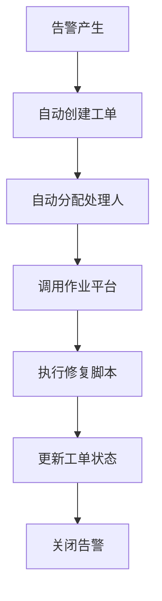

# 告警与运维工具链集成：自动创建工单、调用作业平台执行脚本

在现代IT运维体系中，告警平台不再是孤立的系统，而是与整个运维工具链深度集成的核心枢纽。通过与工单系统、作业平台、配置管理数据库等工具的无缝集成，告警平台能够实现自动化工单创建、脚本执行、状态同步等功能，大幅提升运维效率和问题解决速度。本文将深入探讨告警与运维工具链集成的关键技术和最佳实践。

## 运维工具链集成的重要性

### 1. 提升运维效率

传统的运维模式中，告警通知后需要人工登录各个系统执行操作，效率低下且容易出错。通过工具链集成，可以实现：



这种自动化流程能够将原本需要30分钟的人工操作缩短到5分钟以内。

### 2. 确保操作一致性

人工操作容易因个人经验和习惯差异导致操作不一致，而通过标准化的工具链集成可以确保：

- 操作步骤标准化
- 执行参数规范化
- 操作日志完整化
- 结果验证自动化

### 3. 促进知识沉淀

工具链集成过程中的自动化脚本、处理流程、执行结果等都成为宝贵的知识资产，有助于：

- 建立标准化处理流程
- 积累故障处理经验
- 提升团队整体技能水平
- 支持新员工快速上手

## 工单系统集成

### 1. 自动化工单创建

```python
class TicketIntegrationSystem:
    def __init__(self, ticket_client, alert_engine, user_directory):
        self.ticket_client = ticket_client
        self.alert_engine = alert_engine
        self.user_directory = user_directory
    
    def create_ticket_from_alert(self, alert):
        """
        根据告警自动创建工单
        """
        # 1. 构造工单信息
        ticket_info = self._build_ticket_info(alert)
        
        # 2. 创建工单
        ticket_id = self.ticket_client.create_ticket(ticket_info)
        
        # 3. 关联告警和工单
        self._link_alert_ticket(alert['id'], ticket_id)
        
        # 4. 通知相关人员
        self._notify_stakeholders(alert, ticket_id)
        
        # 5. 启动跟踪机制
        self._start_ticket_tracking(ticket_id, alert['id'])
        
        return ticket_id
    
    def _build_ticket_info(self, alert):
        """
        构造工单信息
        """
        # 确定工单类型
        ticket_type = self._determine_ticket_type(alert)
        
        # 确定优先级
        priority = self._determine_priority(alert)
        
        # 确定处理人
        assignee = self._determine_assignee(alert)
        
        # 构造工单标题和描述
        title = f"[{alert['severity'].upper()}] {alert['service_name']} - {alert['message']}"
        description = self._generate_ticket_description(alert)
        
        # 确定期望解决时间
        due_date = self._calculate_due_date(alert)
        
        return {
            'type': ticket_type,
            'priority': priority,
            'title': title,
            'description': description,
            'assignee': assignee,
            'reporter': 'alert_system',
            'due_date': due_date,
            'custom_fields': {
                'alert_id': alert['id'],
                'service_name': alert['service_name'],
                'severity': alert['severity'],
                'triggered_at': alert['timestamp']
            }
        }
    
    def _determine_ticket_type(self, alert):
        """
        确定工单类型
        """
        # 根据告警类型和服务确定工单类型
        alert_type = alert.get('alert_type', 'generic')
        service_name = alert.get('service_name', '')
        
        if 'database' in service_name.lower():
            return 'Database_Issue'
        elif 'network' in service_name.lower():
            return 'Network_Issue'
        elif alert_type == 'cpu_usage':
            return 'Performance_Issue'
        elif alert_type == 'disk_usage':
            return 'Storage_Issue'
        else:
            return 'Incident'
    
    def _determine_priority(self, alert):
        """
        确定工单优先级
        """
        # 基于告警严重程度、业务影响等因素确定优先级
        severity = alert.get('severity', 'info')
        business_impact = self._assess_business_impact(alert)
        
        if severity == 'critical' or business_impact == 'high':
            return 'Critical'
        elif severity == 'warning' or business_impact == 'medium':
            return 'High'
        elif severity == 'info' or business_impact == 'low':
            return 'Medium'
        else:
            return 'Low'
    
    def _determine_assignee(self, alert):
        """
        确定工单处理人
        """
        # 基于服务负责人、值班人员等确定处理人
        service_name = alert.get('service_name', '')
        service_owner = self.user_directory.get_service_owner(service_name)
        
        if service_owner:
            return service_owner
        
        # 如果没有服务负责人，分配给值班人员
        oncall_engineer = self.user_directory.get_oncall_engineer()
        return oncall_engineer if oncall_engineer else 'unassigned'
    
    def _generate_ticket_description(self, alert):
        """
        生成工单描述
        """
        description = f"""
## 告警信息

**服务名称**: {alert.get('service_name', 'Unknown')}
**告警内容**: {alert.get('message', 'No message')}
**严重程度**: {alert.get('severity', 'Unknown')}
**发生时间**: {alert.get('timestamp', 'Unknown')}

## 影响评估

**业务影响**: {self._assess_business_impact(alert)}
**用户影响**: {self._assess_user_impact(alert)}

## 建议处理步骤

{self._get_suggested_steps(alert)}

## 相关信息

**告警ID**: {alert.get('id', 'Unknown')}
**监控面板**: [查看监控](https://monitoring.example.com/dashboard/{alert.get('service_name', '')})
        """.strip()
        
        return description
    
    def _assess_business_impact(self, alert):
        """
        评估业务影响
        """
        # 简化实现，实际应该基于业务重要性评估
        critical_services = ['user-service', 'payment-service', 'database']
        service_name = alert.get('service_name', '')
        
        if service_name in critical_services:
            return 'High'
        elif 'api' in service_name.lower():
            return 'Medium'
        else:
            return 'Low'
    
    def _assess_user_impact(self, alert):
        """
        评估用户影响
        """
        # 简化实现
        return 'Medium'
    
    def _get_suggested_steps(self, alert):
        """
        获取建议处理步骤
        """
        # 从知识库获取相关处理建议
        knowledge_base = KnowledgeBase()
        suggestions = knowledge_base.get_suggestions(alert)
        
        if suggestions:
            return "\n".join([f"{i+1}. {step}" for i, step in enumerate(suggestions)])
        return "请根据告警信息进行分析和处理"
    
    def _calculate_due_date(self, alert):
        """
        计算期望解决时间
        """
        from datetime import datetime, timedelta
        
        priority = self._determine_priority(alert)
        
        if priority == 'Critical':
            return datetime.now() + timedelta(hours=2)
        elif priority == 'High':
            return datetime.now() + timedelta(hours=8)
        elif priority == 'Medium':
            return datetime.now() + timedelta(days=1)
        else:
            return datetime.now() + timedelta(days=3)
    
    def _link_alert_ticket(self, alert_id, ticket_id):
        """
        关联告警和工单
        """
        # 在数据库中建立关联关系
        query = """
        INSERT INTO alert_ticket_links (alert_id, ticket_id, created_at)
        VALUES (%s, %s, NOW())
        """
        db_connection = DatabaseConnection()
        db_connection.execute(query, (alert_id, ticket_id))
    
    def _notify_stakeholders(self, alert, ticket_id):
        """
        通知相关人员
        """
        # 获取通知列表
        stakeholders = self._get_stakeholders(alert)
        
        # 发送通知
        notification_system = NotificationSystem()
        for stakeholder in stakeholders:
            notification_system.notify_user(
                stakeholder,
                f"新工单创建: {ticket_id}",
                f"告警: {alert['message']}\n工单ID: {ticket_id}"
            )
    
    def _get_stakeholders(self, alert):
        """
        获取相关人员
        """
        stakeholders = set()
        
        # 服务负责人
        service_owner = self.user_directory.get_service_owner(alert.get('service_name', ''))
        if service_owner:
            stakeholders.add(service_owner)
        
        # 值班人员
        oncall_engineer = self.user_directory.get_oncall_engineer()
        if oncall_engineer:
            stakeholders.add(oncall_engineer)
        
        # 团队成员
        team_members = self.user_directory.get_team_members(alert.get('team', ''))
        stakeholders.update(team_members)
        
        return list(stakeholders)
    
    def _start_ticket_tracking(self, ticket_id, alert_id):
        """
        启动工单跟踪
        """
        # 设置定时检查工单状态
        tracker = TicketTracker(self.ticket_client, self.alert_engine)
        tracker.start_tracking(ticket_id, alert_id)

class TicketClient:
    def __init__(self, api_url, api_key):
        self.api_url = api_url
        self.api_key = api_key
        self.session = self._create_session()
    
    def _create_session(self):
        """
        创建HTTP会话
        """
        import requests
        session = requests.Session()
        session.headers.update({
            'Authorization': f'Bearer {self.api_key}',
            'Content-Type': 'application/json'
        })
        return session
    
    def create_ticket(self, ticket_info):
        """
        创建工单
        """
        url = f"{self.api_url}/tickets"
        
        payload = {
            'ticket': {
                'subject': ticket_info['title'],
                'description': ticket_info['description'],
                'priority': ticket_info['priority'],
                'type': ticket_info['type'],
                'requester': ticket_info['reporter'],
                'assignee': ticket_info['assignee'],
                'due_at': ticket_info['due_date'].isoformat() if ticket_info['due_date'] else None,
                'custom_fields': ticket_info['custom_fields']
            }
        }
        
        try:
            response = self.session.post(url, json=payload)
            response.raise_for_status()
            result = response.json()
            return result['ticket']['id']
        except Exception as e:
            raise Exception(f"Failed to create ticket: {str(e)}")
    
    def update_ticket(self, ticket_id, update_info):
        """
        更新工单
        """
        url = f"{self.api_url}/tickets/{ticket_id}"
        
        payload = {'ticket': update_info}
        
        try:
            response = self.session.put(url, json=payload)
            response.raise_for_status()
            return response.json()
        except Exception as e:
            raise Exception(f"Failed to update ticket {ticket_id}: {str(e)}")
    
    def get_ticket(self, ticket_id):
        """
        获取工单信息
        """
        url = f"{self.api_url}/tickets/{ticket_id}"
        
        try:
            response = self.session.get(url)
            response.raise_for_status()
            return response.json()['ticket']
        except Exception as e:
            raise Exception(f"Failed to get ticket {ticket_id}: {str(e)}")
    
    def add_comment(self, ticket_id, comment, author):
        """
        添加工单评论
        """
        url = f"{self.api_url}/tickets/{ticket_id}/comments"
        
        payload = {
            'comment': {
                'body': comment,
                'author': author
            }
        }
        
        try:
            response = self.session.post(url, json=payload)
            response.raise_for_status()
            return response.json()
        except Exception as e:
            raise Exception(f"Failed to add comment to ticket {ticket_id}: {str(e)}")
```

### 2. 工单状态同步

```python
class TicketTracker:
    def __init__(self, ticket_client, alert_engine):
        self.ticket_client = ticket_client
        self.alert_engine = alert_engine
        self.tracking_tasks = {}
    
    def start_tracking(self, ticket_id, alert_id):
        """
        开始跟踪工单状态
        """
        # 创建跟踪任务
        task = threading.Thread(
            target=self._track_ticket_status,
            args=(ticket_id, alert_id),
            daemon=True
        )
        task.start()
        
        self.tracking_tasks[ticket_id] = {
            'task': task,
            'alert_id': alert_id,
            'start_time': datetime.now()
        }
    
    def _track_ticket_status(self, ticket_id, alert_id):
        """
        跟踪工单状态
        """
        while True:
            try:
                # 获取工单状态
                ticket = self.ticket_client.get_ticket(ticket_id)
                status = ticket['status']
                
                # 更新告警状态
                if status in ['solved', 'closed']:
                    self._handle_ticket_closure(ticket_id, alert_id, ticket)
                    break
                elif status == 'pending':
                    self._handle_ticket_pending(ticket_id, alert_id, ticket)
                
                # 每5分钟检查一次状态
                time.sleep(300)
                
            except Exception as e:
                print(f"Error tracking ticket {ticket_id}: {e}")
                break
    
    def _handle_ticket_closure(self, ticket_id, alert_id, ticket):
        """
        处理工单关闭
        """
        # 更新告警状态
        resolution_info = {
            'resolved_by': 'ticket_system',
            'method': f'Ticket #{ticket_id} closed',
            'notes': ticket.get('description', ''),
            'ticket_status': ticket['status']
        }
        
        self.alert_engine.update_alert_status(
            alert_id,
            'resolved',
            resolution_info=resolution_info
        )
        
        # 在告警中添加工单关闭信息
        self.alert_engine.add_alert_note(
            alert_id,
            f"关联工单 #{ticket_id} 已关闭，状态: {ticket['status']}"
        )
    
    def _handle_ticket_pending(self, ticket_id, alert_id, ticket):
        """
        处理工单待处理状态
        """
        # 检查是否超时
        created_at = datetime.fromisoformat(ticket['created_at'])
        time_elapsed = datetime.now() - created_at
        
        if time_elapsed.total_seconds() > 7200:  # 2小时
            # 发送提醒
            self._send_ticket_reminder(ticket_id, alert_id, ticket)
    
    def _send_ticket_reminder(self, ticket_id, alert_id, ticket):
        """
        发送工单提醒
        """
        assignee = ticket.get('assignee')
        if assignee:
            notification_system = NotificationSystem()
            notification_system.notify_user(
                assignee,
                f"工单提醒: #{ticket_id}",
                f"工单已创建2小时仍未处理，请及时跟进。\n告警ID: {alert_id}"
            )

class TicketSyncManager:
    def __init__(self, ticket_client, alert_engine, db_connection):
        self.ticket_client = ticket_client
        self.alert_engine = alert_engine
        self.db = db_connection
    
    def sync_ticket_status(self, ticket_id):
        """
        同步工单状态到告警系统
        """
        try:
            # 获取工单信息
            ticket = self.ticket_client.get_ticket(ticket_id)
            
            # 获取关联的告警ID
            alert_id = self._get_linked_alert(ticket_id)
            if not alert_id:
                return
            
            # 根据工单状态更新告警
            ticket_status = ticket['status']
            if ticket_status in ['solved', 'closed']:
                self._close_linked_alert(alert_id, ticket)
            elif ticket_status == 'open':
                self._update_alert_with_ticket_info(alert_id, ticket)
            
        except Exception as e:
            print(f"Error syncing ticket {ticket_id}: {e}")
    
    def _get_linked_alert(self, ticket_id):
        """
        获取关联的告警ID
        """
        query = """
        SELECT alert_id FROM alert_ticket_links
        WHERE ticket_id = %s
        """
        result = self.db.execute(query, (ticket_id,))
        return result[0][0] if result else None
    
    def _close_linked_alert(self, alert_id, ticket):
        """
        关闭关联的告警
        """
        resolution_info = {
            'resolved_by': ticket.get('assignee', 'unknown'),
            'method': f'Manual ticket closure #{ticket["id"]}',
            'notes': f'Ticket closed with status: {ticket["status"]}',
            'ticket_id': ticket['id']
        }
        
        self.alert_engine.update_alert_status(
            alert_id,
            'resolved',
            resolution_info=resolution_info
        )
    
    def _update_alert_with_ticket_info(self, alert_id, ticket):
        """
        使用工单信息更新告警
        """
        # 添加工单信息到告警备注
        note = f"关联工单更新: #{ticket['id']}, 状态: {ticket['status']}, 处理人: {ticket.get('assignee', 'unassigned')}"
        self.alert_engine.add_alert_note(alert_id, note)
```

## 作业平台集成

### 1. 脚本执行框架

```python
class JobPlatformIntegration:
    def __init__(self, job_client, alert_engine, credential_manager):
        self.job_client = job_client
        self.alert_engine = alert_engine
        self.credential_manager = credential_manager
    
    def execute_remediation_script(self, alert, script_name, target_hosts=None):
        """
        执行修复脚本
        """
        # 1. 准备执行环境
        execution_context = self._prepare_execution_context(alert, script_name)
        
        # 2. 获取目标主机
        if target_hosts is None:
            target_hosts = self._determine_target_hosts(alert)
        
        # 3. 执行脚本
        job_id = self.job_client.execute_script(
            script_name,
            target_hosts,
            execution_context
        )
        
        # 4. 关联告警和作业
        self._link_alert_job(alert['id'], job_id)
        
        # 5. 启动作业跟踪
        self._start_job_tracking(job_id, alert['id'])
        
        return job_id
    
    def _prepare_execution_context(self, alert, script_name):
        """
        准备执行环境
        """
        # 获取脚本参数
        script_params = self._get_script_parameters(alert, script_name)
        
        # 获取执行凭证
        credentials = self.credential_manager.get_credentials_for_script(script_name)
        
        # 构造执行上下文
        context = {
            'alert_info': alert,
            'script_params': script_params,
            'credentials': credentials,
            'execution_time': datetime.now().isoformat(),
            'timeout': 300  # 5分钟超时
        }
        
        return context
    
    def _get_script_parameters(self, alert, script_name):
        """
        获取脚本参数
        """
        # 根据告警信息和脚本名称确定参数
        params = {}
        
        if 'restart' in script_name.lower():
            params['service_name'] = alert.get('service_name', '')
        elif 'cleanup' in script_name.lower():
            params['target_directory'] = '/tmp'
            params['age_threshold'] = '7d'
        elif 'health_check' in script_name.lower():
            params['service_name'] = alert.get('service_name', '')
            params['check_type'] = alert.get('alert_type', 'generic')
        
        return params
    
    def _determine_target_hosts(self, alert):
        """
        确定目标主机
        """
        service_name = alert.get('service_name', '')
        
        # 从服务发现系统获取主机列表
        service_discovery = ServiceDiscovery()
        hosts = service_discovery.get_service_hosts(service_name)
        
        return hosts if hosts else ['localhost']
    
    def _link_alert_job(self, alert_id, job_id):
        """
        关联告警和作业
        """
        query = """
        INSERT INTO alert_job_links (alert_id, job_id, created_at)
        VALUES (%s, %s, NOW())
        """
        db_connection = DatabaseConnection()
        db_connection.execute(query, (alert_id, job_id))
    
    def _start_job_tracking(self, job_id, alert_id):
        """
        启动作业跟踪
        """
        tracker = JobTracker(self.job_client, self.alert_engine)
        tracker.start_tracking(job_id, alert_id)

class JobClient:
    def __init__(self, api_url, api_key):
        self.api_url = api_url
        self.api_key = api_key
        self.session = self._create_session()
    
    def _create_session(self):
        """
        创建HTTP会话
        """
        import requests
        session = requests.Session()
        session.headers.update({
            'Authorization': f'Bearer {self.api_key}',
            'Content-Type': 'application/json'
        })
        return session
    
    def execute_script(self, script_name, target_hosts, context):
        """
        执行脚本
        """
        url = f"{self.api_url}/jobs"
        
        payload = {
            'job': {
                'name': f"Alert Remediation - {script_name}",
                'script': script_name,
                'targets': target_hosts,
                'parameters': context.get('script_params', {}),
                'credentials': context.get('credentials', {}),
                'timeout': context.get('timeout', 300),
                'description': f"Automated remediation for alert: {context.get('alert_info', {}).get('message', 'Unknown')}"
            }
        }
        
        try:
            response = self.session.post(url, json=payload)
            response.raise_for_status()
            result = response.json()
            return result['job']['id']
        except Exception as e:
            raise Exception(f"Failed to execute script {script_name}: {str(e)}")
    
    def get_job_status(self, job_id):
        """
        获取作业状态
        """
        url = f"{self.api_url}/jobs/{job_id}"
        
        try:
            response = self.session.get(url)
            response.raise_for_status()
            return response.json()['job']
        except Exception as e:
            raise Exception(f"Failed to get job {job_id}: {str(e)}")
    
    def get_job_output(self, job_id):
        """
        获取作业输出
        """
        url = f"{self.api_url}/jobs/{job_id}/output"
        
        try:
            response = self.session.get(url)
            response.raise_for_status()
            return response.json()
        except Exception as e:
            raise Exception(f"Failed to get job output for {job_id}: {str(e)}")
    
    def cancel_job(self, job_id):
        """
        取消作业
        """
        url = f"{self.api_url}/jobs/{job_id}/cancel"
        
        try:
            response = self.session.post(url)
            response.raise_for_status()
            return response.json()
        except Exception as e:
            raise Exception(f"Failed to cancel job {job_id}: {str(e)}")

class JobTracker:
    def __init__(self, job_client, alert_engine):
        self.job_client = job_client
        self.alert_engine = alert_engine
        self.tracking_tasks = {}
    
    def start_tracking(self, job_id, alert_id):
        """
        开始跟踪作业状态
        """
        task = threading.Thread(
            target=self._track_job_status,
            args=(job_id, alert_id),
            daemon=True
        )
        task.start()
        
        self.tracking_tasks[job_id] = {
            'task': task,
            'alert_id': alert_id,
            'start_time': datetime.now()
        }
    
    def _track_job_status(self, job_id, alert_id):
        """
        跟踪作业状态
        """
        while True:
            try:
                # 获取作业状态
                job = self.job_client.get_job_status(job_id)
                status = job['status']
                
                # 处理作业状态变化
                if status == 'completed':
                    self._handle_job_completion(job_id, alert_id, job)
                    break
                elif status == 'failed':
                    self._handle_job_failure(job_id, alert_id, job)
                    break
                elif status == 'running':
                    self._handle_job_running(job_id, alert_id, job)
                
                # 每30秒检查一次状态
                time.sleep(30)
                
            except Exception as e:
                print(f"Error tracking job {job_id}: {e}")
                break
    
    def _handle_job_completion(self, job_id, alert_id, job):
        """
        处理作业完成
        """
        # 获取作业输出
        try:
            output = self.job_client.get_job_output(job_id)
        except Exception as e:
            output = {'error': f"Failed to get job output: {str(e)}"}
        
        # 更新告警状态
        resolution_info = {
            'resolved_by': 'automated_remediation',
            'method': f'Job #{job_id} completed successfully',
            'notes': f"Job output: {output.get('stdout', 'No output')}",
            'job_id': job_id,
            'job_status': job['status']
        }
        
        self.alert_engine.update_alert_status(
            alert_id,
            'resolved',
            resolution_info=resolution_info
        )
        
        # 添加作业完成信息到告警备注
        self.alert_engine.add_alert_note(
            alert_id,
            f"自动化修复作业 #{job_id} 已完成，状态: {job['status']}"
        )
    
    def _handle_job_failure(self, job_id, alert_id, job):
        """
        处理作业失败
        """
        # 获取作业输出
        try:
            output = self.job_client.get_job_output(job_id)
        except Exception as e:
            output = {'error': f"Failed to get job output: {str(e)}"}
        
        # 更新告警备注
        self.alert_engine.add_alert_note(
            alert_id,
            f"自动化修复作业 #{job_id} 失败，状态: {job['status']}\n错误信息: {output.get('stderr', 'No error output')}"
        )
        
        # 创建工单进行人工处理
        self._create_manual_ticket_for_failed_job(alert_id, job_id, output)
    
    def _handle_job_running(self, job_id, alert_id, job):
        """
        处理作业运行中状态
        """
        # 检查是否超时
        start_time = datetime.fromisoformat(job['started_at'])
        time_elapsed = datetime.now() - start_time
        
        if time_elapsed.total_seconds() > job.get('timeout', 300):
            # 取消超时作业
            try:
                self.job_client.cancel_job(job_id)
                self.alert_engine.add_alert_note(
                    alert_id,
                    f"自动化修复作业 #{job_id} 超时，已取消"
                )
            except Exception as e:
                print(f"Failed to cancel job {job_id}: {e}")
    
    def _create_manual_ticket_for_failed_job(self, alert_id, job_id, output):
        """
        为失败的作业创建人工处理工单
        """
        alert = self.alert_engine.get_alert(alert_id)
        if not alert:
            return
        
        # 构造工单信息
        ticket_info = {
            'type': 'Incident',
            'priority': 'High',
            'title': f"[FAILED_AUTO] 自动化修复失败 - {alert['message']}",
            'description': f"""
## 自动化修复失败

**告警信息**:
- 服务: {alert.get('service_name', 'Unknown')}
- 内容: {alert.get('message', 'No message')}
- 时间: {alert.get('timestamp', 'Unknown')}

**作业信息**:
- 作业ID: #{job_id}
- 失败时间: {datetime.now().isoformat()}

**错误输出**:
```
{output.get('stderr', 'No error output')}
```

**标准输出**:
```
{output.get('stdout', 'No standard output')}
```

请手动处理此问题，并分析自动化修复失败的原因。
            """.strip(),
            'assignee': 'oncall_engineer',
            'reporter': 'alert_system',
            'due_date': datetime.now() + timedelta(hours=2)
        }
        
        # 创建工单
        ticket_client = TicketClient("https://ticket.example.com/api/v2", "api_key")
        try:
            ticket_id = ticket_client.create_ticket(ticket_info)
            
            # 关联告警和工单
            self._link_alert_ticket(alert_id, ticket_id)
            
        except Exception as e:
            print(f"Failed to create ticket for failed job: {e}")
    
    def _link_alert_ticket(self, alert_id, ticket_id):
        """
        关联告警和工单
        """
        query = """
        INSERT INTO alert_ticket_links (alert_id, ticket_id, created_at)
        VALUES (%s, %s, NOW())
        """
        db_connection = DatabaseConnection()
        db_connection.execute(query, (alert_id, ticket_id))
```

### 2. 智能脚本选择

```python
class IntelligentScriptSelector:
    def __init__(self, knowledge_base, script_repository):
        self.knowledge_base = knowledge_base
        self.script_repository = script_repository
        self.script_matcher = ScriptMatcher()
    
    def select_remediation_script(self, alert):
        """
        选择修复脚本
        """
        # 1. 基于告警类型匹配脚本
        type_matched_scripts = self._match_scripts_by_type(alert)
        
        # 2. 基于历史成功率排序
        ranked_scripts = self._rank_scripts_by_success_rate(type_matched_scripts)
        
        # 3. 基于环境适配性筛选
        environment_compatible_scripts = self._filter_by_environment(ranked_scripts, alert)
        
        # 4. 返回最佳匹配脚本
        if environment_compatible_scripts:
            return environment_compatible_scripts[0]
        
        return None
    
    def _match_scripts_by_type(self, alert):
        """
        基于告警类型匹配脚本
        """
        alert_type = alert.get('alert_type', 'generic')
        service_name = alert.get('service_name', '')
        
        # 构造匹配条件
        match_conditions = []
        
        # 精确匹配
        if alert_type and service_name:
            match_conditions.append(f"{alert_type}_{service_name}")
        
        # 类型匹配
        if alert_type:
            match_conditions.append(alert_type)
        
        # 服务匹配
        if service_name:
            match_conditions.append(service_name)
        
        # 通用匹配
        match_conditions.append('generic')
        
        # 查找匹配的脚本
        matched_scripts = []
        for condition in match_conditions:
            scripts = self.script_repository.find_scripts_by_tag(condition)
            matched_scripts.extend(scripts)
        
        return list(set(matched_scripts))  # 去重
    
    def _rank_scripts_by_success_rate(self, scripts):
        """
        基于历史成功率排序脚本
        """
        script_stats = []
        
        for script in scripts:
            # 获取脚本统计信息
            stats = self.knowledge_base.get_script_statistics(script)
            success_rate = stats.get('success_rate', 0)
            execution_count = stats.get('execution_count', 0)
            
            # 计算加权成功率（考虑执行次数）
            weighted_rate = success_rate * min(execution_count / 10, 1)  # 最少需要10次执行才有完整权重
            
            script_stats.append({
                'script': script,
                'success_rate': success_rate,
                'execution_count': execution_count,
                'weighted_rate': weighted_rate
            })
        
        # 按加权成功率排序
        script_stats.sort(key=lambda x: x['weighted_rate'], reverse=True)
        return [item['script'] for item in script_stats]
    
    def _filter_by_environment(self, scripts, alert):
        """
        基于环境适配性筛选脚本
        """
        compatible_scripts = []
        
        for script in scripts:
            # 检查脚本环境要求
            script_info = self.script_repository.get_script_info(script)
            required_env = script_info.get('required_environment', [])
            
            # 检查当前环境是否满足要求
            if self._is_environment_compatible(required_env, alert):
                compatible_scripts.append(script)
        
        return compatible_scripts
    
    def _is_environment_compatible(self, required_env, alert):
        """
        检查环境兼容性
        """
        if not required_env:
            return True  # 无特殊要求
        
        # 获取当前环境信息
        current_env = self._get_current_environment(alert)
        
        # 检查是否满足所有要求
        for env_requirement in required_env:
            if env_requirement not in current_env:
                return False
        
        return True
    
    def _get_current_environment(self, alert):
        """
        获取当前环境信息
        """
        service_name = alert.get('service_name', '')
        
        # 简化实现，实际应该查询配置管理系统
        env_info = set()
        
        if 'prod' in service_name.lower():
            env_info.add('production')
        elif 'staging' in service_name.lower():
            env_info.add('staging')
        elif 'test' in service_name.lower():
            env_info.add('testing')
        else:
            env_info.add('development')
        
        # 添加操作系统信息
        env_info.add('linux')  # 假设都是Linux
        
        return env_info

class ScriptRepository:
    def __init__(self, db_connection, file_storage):
        self.db = db_connection
        self.file_storage = file_storage
    
    def find_scripts_by_tag(self, tag):
        """
        根据标签查找脚本
        """
        query = """
        SELECT script_name FROM script_tags
        WHERE tag = %s
        """
        results = self.db.execute(query, (tag,))
        return [result[0] for result in results]
    
    def get_script_info(self, script_name):
        """
        获取脚本信息
        """
        query = """
        SELECT name, description, required_environment, created_at, updated_at
        FROM automation_scripts
        WHERE name = %s
        """
        result = self.db.execute(query, (script_name,))
        return result[0] if result else None
    
    def get_script_content(self, script_name):
        """
        获取脚本内容
        """
        # 从文件存储获取脚本内容
        return self.file_storage.get_file_content(f"scripts/{script_name}")

class ScriptMatcher:
    def __init__(self):
        self.patterns = self._load_matching_patterns()
    
    def _load_matching_patterns(self):
        """
        加载匹配模式
        """
        return {
            'cpu_usage': ['restart_service', 'scale_up', 'optimize_process'],
            'memory_usage': ['restart_service', 'clear_cache', 'gc_cleanup'],
            'disk_usage': ['cleanup_logs', 'archive_data', 'extend_volume'],
            'network_latency': ['restart_network', 'check_firewall', 'dns_refresh'],
            'database_connection': ['restart_db', 'check_connection_pool', 'failover']
        }
    
    def match_script_to_alert(self, alert, available_scripts):
        """
        匹配脚本到告警
        """
        alert_type = alert.get('alert_type', 'generic')
        
        # 获取推荐脚本
        recommended_scripts = self.patterns.get(alert_type, ['generic_remediation'])
        
        # 在可用脚本中查找推荐脚本
        matched_scripts = [script for script in available_scripts if script in recommended_scripts]
        
        # 如果没有匹配的推荐脚本，返回所有可用脚本
        if not matched_scripts:
            return available_scripts
        
        return matched_scripts
```

## 集成效果监控

### 1. 关键指标定义

```python
class IntegrationMetrics:
    def __init__(self, db_connection):
        self.db = db_connection
    
    def calculate_automation_rate(self, start_time, end_time):
        """
        计算自动化处理率
        """
        query = """
        SELECT 
            COUNT(*) as total_alerts,
            SUM(CASE WHEN automation_executed = 1 THEN 1 ELSE 0 END) as automated_alerts
        FROM alerts
        WHERE created_at BETWEEN %s AND %s
        """
        result = self.db.execute(query, (start_time, end_time))
        total, automated = result[0] if result else (0, 0)
        return automated / total if total > 0 else 0
    
    def calculate_ticket_creation_rate(self, start_time, end_time):
        """
        计算工单创建率
        """
        query = """
        SELECT 
            COUNT(*) as total_alerts,
            COUNT(DISTINCT atl.ticket_id) as tickets_created
        FROM alerts a
        LEFT JOIN alert_ticket_links atl ON a.id = atl.alert_id
        WHERE a.created_at BETWEEN %s AND %s
        """
        result = self.db.execute(query, (start_time, end_time))
        total, tickets = result[0] if result else (0, 0)
        return tickets / total if total > 0 else 0
    
    def calculate_mean_time_to_automation(self, start_time, end_time):
        """
        计算平均自动化响应时间
        """
        query = """
        SELECT AVG(TIMESTAMPDIFF(SECOND, a.created_at, ajl.created_at)) as mtt_automation
        FROM alerts a
        JOIN alert_job_links ajl ON a.id = ajl.alert_id
        WHERE a.created_at BETWEEN %s AND %s
        """
        result = self.db.execute(query, (start_time, end_time))
        return result[0][0] if result and result[0][0] else 0
    
    def calculate_automation_success_rate(self, start_time, end_time):
        """
        计算自动化成功率
        """
        query = """
        SELECT 
            COUNT(*) as total_automations,
            SUM(CASE WHEN ajl.status = 'success' THEN 1 ELSE 0 END) as successful_automations
        FROM alert_job_links ajl
        JOIN alerts a ON ajl.alert_id = a.id
        WHERE a.created_at BETWEEN %s AND %s
        """
        result = self.db.execute(query, (start_time, end_time))
        total, successful = result[0] if result else (0, 0)
        return successful / total if total > 0 else 0

class IntegrationDashboard:
    def __init__(self, metrics):
        self.metrics = metrics
        plt.rcParams['font.sans-serif'] = ['SimHei']
        plt.rcParams['axes.unicode_minus'] = False
    
    def plot_integration_trends(self, days=30):
        """
        绘制集成趋势图
        """
        dates = []
        automation_rates = []
        ticket_creation_rates = []
        mtt_automation = []
        
        for i in range(days):
            date = f"2025-08-{i+1:02d}"
            auto_rate = self.metrics.calculate_automation_rate(date, date)
            ticket_rate = self.metrics.calculate_ticket_creation_rate(date, date)
            mtt = self.metrics.calculate_mean_time_to_automation(date, date)
            
            dates.append(date)
            automation_rates.append(auto_rate * 100)
            ticket_creation_rates.append(ticket_rate * 100)
            mtt_automation.append(mtt / 60)  # 转换为分钟
        
        # 创建子图
        fig, (ax1, ax2) = plt.subplots(2, 1, figsize=(12, 10))
        
        # 自动化率和工单创建率趋势
        ax1.plot(dates, automation_rates, marker='o', linewidth=2, markersize=4, label='自动化处理率')
        ax1.plot(dates, ticket_creation_rates, marker='s', linewidth=2, markersize=4, label='工单创建率')
        ax1.set_title('工具链集成效果趋势')
        ax1.set_ylabel('百分比 (%)')
        ax1.legend()
        ax1.grid(True, alpha=0.3)
        ax1.set_xticklabels(dates, rotation=45)
        
        # 平均自动化响应时间趋势
        ax2.plot(dates, mtt_automation, marker='^', color='orange', linewidth=2, markersize=4)
        ax2.set_title('平均自动化响应时间趋势')
        ax2.set_ylabel('平均响应时间 (分钟)')
        ax2.set_xlabel('日期')
        ax2.grid(True, alpha=0.3)
        ax2.set_xticklabels(dates, rotation=45)
        
        plt.tight_layout()
        plt.savefig('integration_trends.png', dpi=300, bbox_inches='tight')
        plt.show()
```

### 2. 集成质量评估

```python
class IntegrationQualityAssessment:
    def __init__(self, db_connection, metrics):
        self.db = db_connection
        self.metrics = metrics
    
    def assess_integration_quality(self, period="monthly"):
        """
        评估集成质量
        """
        # 收集数据
        automation_data = self._collect_automation_data(period)
        ticket_data = self._collect_ticket_data(period)
        job_data = self._collect_job_data(period)
        
        # 计算质量指标
        quality_metrics = self._calculate_quality_metrics(
            automation_data, 
            ticket_data, 
            job_data
        )
        
        # 识别问题
        issues = self._identify_integration_issues(quality_metrics)
        
        # 生成改进建议
        recommendations = self._generate_recommendations(issues)
        
        return {
            'quality_metrics': quality_metrics,
            'issues': issues,
            'recommendations': recommendations
        }
    
    def _collect_automation_data(self, period):
        """
        收集自动化数据
        """
        # 简化实现
        return {}
    
    def _collect_ticket_data(self, period):
        """
        收集工单数据
        """
        # 简化实现
        return {}
    
    def _collect_job_data(self, period):
        """
        收集作业数据
        """
        # 简化实现
        return {}
    
    def _calculate_quality_metrics(self, automation_data, ticket_data, job_data):
        """
        计算质量指标
        """
        return {
            'automation_rate': self.metrics.calculate_automation_rate(
                datetime.now() - timedelta(days=30), 
                datetime.now()
            ),
            'automation_success_rate': self.metrics.calculate_automation_success_rate(
                datetime.now() - timedelta(days=30), 
                datetime.now()
            ),
            'ticket_creation_rate': self.metrics.calculate_ticket_creation_rate(
                datetime.now() - timedelta(days=30), 
                datetime.now()
            ),
            'mean_time_to_automation': self.metrics.calculate_mean_time_to_automation(
                datetime.now() - timedelta(days=30), 
                datetime.now()
            )
        }
    
    def _identify_integration_issues(self, quality_metrics):
        """
        识别集成问题
        """
        issues = []
        
        if quality_metrics['automation_rate'] < 0.6:
            issues.append({
                'type': 'low_automation_rate',
                'description': '自动化处理率低于60%',
                'severity': 'high'
            })
        
        if quality_metrics['automation_success_rate'] < 0.8:
            issues.append({
                'type': 'low_success_rate',
                'description': '自动化成功率低于80%',
                'severity': 'high'
            })
        
        if quality_metrics['mean_time_to_automation'] > 300:  # 5分钟
            issues.append({
                'type': 'slow_response',
                'description': '平均自动化响应时间超过5分钟',
                'severity': 'medium'
            })
        
        return issues
    
    def _generate_recommendations(self, issues):
        """
        生成改进建议
        """
        recommendations = []
        
        for issue in issues:
            if issue['type'] == 'low_automation_rate':
                recommendations.append({
                    'issue': issue['description'],
                    'recommendation': '增加自动化脚本覆盖范围，优化脚本匹配算法',
                    'responsible': '自动化团队',
                    'timeline': '2周内'
                })
            elif issue['type'] == 'low_success_rate':
                recommendations.append({
                    'issue': issue['description'],
                    'recommendation': '审查失败的自动化作业，优化脚本逻辑和错误处理',
                    'responsible': 'SRE团队',
                    'timeline': '1周内'
                })
            elif issue['type'] == 'slow_response':
                recommendations.append({
                    'issue': issue['description'],
                    'recommendation': '优化作业平台性能，减少脚本执行延迟',
                    'responsible': '平台团队',
                    'timeline': '3周内'
                })
        
        return recommendations
```

## 最佳实践与注意事项

### 1. 集成架构设计

```python
class IntegrationBestPractices:
    def __init__(self):
        self.practices = self._define_best_practices()
    
    def _define_best_practices(self):
        """
        定义最佳实践
        """
        return {
            "架构设计": [
                "采用松耦合的微服务架构",
                "实现统一的API网关",
                "建立完善的错误处理机制"
            ],
            "安全控制": [
                "实施最小权限原则",
                "建立凭证轮换机制",
                "启用审计日志记录"
            ],
            "监控告警": [
                "建立端到端的监控体系",
                "设置合理的告警阈值",
                "实现故障自愈能力"
            ],
            "文档管理": [
                "维护详细的集成文档",
                "建立变更管理流程",
                "定期进行集成测试"
            ]
        }
    
    def generate_integration_checklist(self):
        """
        生成集成检查清单
        """
        checklist = """
# 工具链集成检查清单

## 架构设计
- [ ] 采用松耦合的微服务架构
- [ ] 实现统一的API网关
- [ ] 建立完善的错误处理机制
- [ ] 设计合理的重试和超时机制

## 安全控制
- [ ] 实施最小权限原则
- [ ] 建立凭证轮换机制
- [ ] 启用审计日志记录
- [ ] 实施数据加密传输

## 监控告警
- [ ] 建立端到端的监控体系
- [ ] 设置合理的告警阈值
- [ ] 实现故障自愈能力
- [ ] 建立性能基线监控

## 文档管理
- [ ] 维护详细的集成文档
- [ ] 建立变更管理流程
- [ ] 定期进行集成测试
- [ ] 建立知识库和FAQ

## 测试验证
- [ ] 完成单元测试覆盖
- [ ] 进行集成测试验证
- [ ] 执行性能压力测试
- [ ] 开展故障恢复演练
        """
        return checklist.strip()
    
    def provide_guidance_tips(self):
        """
        提供指导建议
        """
        tips = """
## 工具链集成指导建议

### 架构设计指导
1. 采用事件驱动架构，通过消息队列解耦各系统
2. 实现标准化的RESTful API接口
3. 建立统一的错误码和响应格式
4. 设计可扩展的插件化架构

### 安全实践指导
1. 为每个集成点分配独立的API密钥
2. 实施IP白名单和访问频率限制
3. 定期轮换和审计访问凭证
4. 启用详细的审计日志记录

### 监控运维指导
1. 建立关键路径的端到端监控
2. 设置多维度的性能指标
3. 实现自动化的健康检查
4. 建立完善的告警抑制机制

### 故障处理指导
1. 建立标准化的故障处理流程
2. 实现自动化的故障恢复机制
3. 建立故障演练和复盘机制
4. 维护详细的故障处理文档
        """
        return tips.strip()
```

### 2. 故障处理与恢复

```python
class IntegrationFaultHandler:
    def __init__(self, alert_engine, notification_system):
        self.alert_engine = alert_engine
        self.notification_system = notification_system
        self.fault_history = []
    
    def handle_integration_failure(self, failure_info):
        """
        处理集成故障
        """
        # 记录故障信息
        fault_record = self._record_fault(failure_info)
        
        # 评估故障影响
        impact_assessment = self._assess_impact(failure_info)
        
        # 执行应急措施
        emergency_actions = self._execute_emergency_actions(failure_info)
        
        # 通知相关人员
        self._notify_stakeholders(failure_info, impact_assessment)
        
        # 启动恢复流程
        recovery_plan = self._create_recovery_plan(failure_info)
        
        return {
            'fault_record': fault_record,
            'impact_assessment': impact_assessment,
            'emergency_actions': emergency_actions,
            'recovery_plan': recovery_plan
        }
    
    def _record_fault(self, failure_info):
        """
        记录故障信息
        """
        fault_record = {
            'id': self._generate_fault_id(),
            'timestamp': datetime.now(),
            'component': failure_info.get('component'),
            'error': failure_info.get('error'),
            'stack_trace': failure_info.get('stack_trace'),
            'context': failure_info.get('context')
        }
        
        self.fault_history.append(fault_record)
        return fault_record
    
    def _assess_impact(self, failure_info):
        """
        评估故障影响
        """
        component = failure_info.get('component')
        error_type = failure_info.get('error_type')
        
        # 评估影响范围
        if component == 'ticket_system':
            impact_scope = '工单创建和更新功能'
            severity = 'medium'
        elif component == 'job_platform':
            impact_scope = '自动化脚本执行'
            severity = 'high'
        else:
            impact_scope = '未知组件'
            severity = 'low'
        
        # 评估业务影响
        business_impact = self._assess_business_impact(component, error_type)
        
        return {
            'scope': impact_scope,
            'severity': severity,
            'business_impact': business_impact
        }
    
    def _execute_emergency_actions(self, failure_info):
        """
        执行应急措施
        """
        component = failure_info.get('component')
        actions = []
        
        if component == 'ticket_system':
            # 切换到备用工单系统或降级处理
            actions.append('切换到备用工单系统')
            actions.append('启用邮件告警作为临时措施')
        elif component == 'job_platform':
            # 暂停自动化执行，转为人工处理
            actions.append('暂停自动化脚本执行')
            actions.append('启用人工处理流程')
        
        return actions
    
    def _notify_stakeholders(self, failure_info, impact_assessment):
        """
        通知相关人员
        """
        # 构造通知内容
        notification_content = f"""
集成系统故障告警

故障组件: {failure_info.get('component')}
故障时间: {datetime.now().isoformat()}
影响范围: {impact_assessment['scope']}
业务影响: {impact_assessment['business_impact']}

错误信息: {failure_info.get('error')}
        """.strip()
        
        # 通知运维团队
        self.notification_system.notify_channel(
            'ops_team',
            '集成系统故障',
            notification_content
        )
        
        # 根据严重程度通知管理层
        if impact_assessment['severity'] in ['high', 'critical']:
            self.notification_system.notify_channel(
                'management',
                '严重集成故障',
                notification_content
            )
    
    def _create_recovery_plan(self, failure_info):
        """
        创建恢复计划
        """
        component = failure_info.get('component')
        
        if component == 'ticket_system':
            plan = {
                'steps': [
                    '检查工单系统服务状态',
                    '验证API连接和认证',
                    '检查数据库连接',
                    '重启相关服务',
                    '验证功能恢复正常'
                ],
                'estimated_time': '30分钟',
                'responsible': 'SRE团队'
            }
        elif component == 'job_platform':
            plan = {
                'steps': [
                    '检查作业平台服务状态',
                    '验证执行节点健康状况',
                    '检查脚本存储系统',
                    '重启作业调度服务',
                    '验证脚本执行功能'
                ],
                'estimated_time': '45分钟',
                'responsible': '平台团队'
            }
        else:
            plan = {
                'steps': ['待确定'],
                'estimated_time': '待评估',
                'responsible': '待分配'
            }
        
        return plan
    
    def _generate_fault_id(self):
        """
        生成故障ID
        """
        import uuid
        return str(uuid.uuid4())[:8]
    
    def _assess_business_impact(self, component, error_type):
        """
        评估业务影响
        """
        # 简化实现
        if component == 'job_platform' and error_type == 'execution_failure':
            return '高 - 自动化修复功能中断'
        elif component == 'ticket_system' and error_type == 'creation_failure':
            return '中 - 工单创建功能受限'
        else:
            return '低 - 功能降级'
```

## 总结

告警与运维工具链的深度集成是实现智能化运维的关键环节。通过自动化工单创建、脚本执行、状态同步等机制，可以显著提升运维效率和问题解决速度。

关键要点包括：

1. **工单系统集成**：实现告警到工单的自动转换，确保问题得到跟踪和处理
2. **作业平台集成**：通过自动化脚本执行实现快速故障修复
3. **智能脚本选择**：基于告警类型和历史数据选择最优的修复方案
4. **集成效果监控**：建立关键指标体系，持续优化集成效果
5. **故障处理机制**：建立完善的故障应急处理和恢复流程
6. **最佳实践指导**：遵循标准化的集成架构和安全实践

通过以上设计和实现，可以构建一个高效、可靠、安全的告警与运维工具链集成系统，为企业的稳定运营和快速故障恢复提供有力支撑。