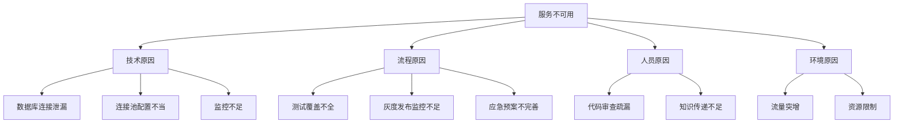

# 附录C：经典故障复盘报告模板

故障复盘（Postmortem）是现代IT运维中不可或缺的重要环节，它帮助团队从故障中学习，避免类似问题再次发生。一个结构良好的复盘报告不仅能够记录事件的详细过程，还能促进团队的知识沉淀和持续改进。本附录提供一个经典故障复盘报告模板，供读者在实际工作中参考和使用。

## 引言

故障复盘报告是组织学习和改进的重要工具。一个优秀的复盘报告应该具备以下特征：

```yaml
# 优秀复盘报告的特征
good_postmortem_characteristics:
  - factual: "基于事实，避免主观臆断"
  - comprehensive: "全面覆盖事件的各个方面"
  - actionable: "包含具体的改进行动项"
  - blameless: "无指责文化，关注学习和改进"
  - shareable: "易于分享和传播经验"
```

复盘报告不仅是对事件的记录，更是团队学习和改进的机会。通过结构化的报告模板，我们可以确保每次复盘都能覆盖关键要素，提取有价值的洞察。

## 故障复盘报告模板

### 1. 基本信息

```markdown
# 故障复盘报告

## 1. 基本信息

**事件ID**: INC-20250907-001
**事件名称**: 订单服务数据库连接池耗尽导致大面积服务不可用
**事件等级**: P0（重大故障）
**故障开始时间**: 2025-09-07 14:23:15
**故障恢复时间**: 2025-09-07 15:08:32
**故障持续时间**: 45分17秒
**影响范围**: 全国用户订单相关功能
**影响用户数**: 约50万用户
**业务影响**: 约¥250,000/hour
**报告作者**: 张三（SRE团队）
**复盘时间**: 2025-09-08 10:00
**参与人员**: 李四（技术负责人）、王五（DBA）、赵六（前端负责人）
```

### 2. 事件摘要

```markdown
## 2. 事件摘要

### 2.1 业务影响
- 订单创建功能完全不可用
- 支付功能响应时间超过30秒
- 用户投诉量激增300%
- 收入损失约¥187,000

### 2.2 技术影响
- 订单服务API错误率100%
- 数据库连接池使用率达到100%
- 相关微服务响应超时率95%
- 监控系统报警风暴（共触发报警1,234条）

### 2.3 处理过程
1. 14:23 - 监控系统首次触发数据库连接池耗尽报警
2. 14:25 - 值班工程师确认问题并开始排查
3. 14:35 - 发现订单服务异常，开始深入分析
4. 14:45 - 确认数据库连接池耗尽为根本原因
5. 14:50 - 实施临时解决方案（重启订单服务实例）
6. 14:55 - 服务逐步恢复正常
7. 15:08 - 确认所有服务恢复正常
```

### 3. 时间线梳理

```markdown
## 3. 时间线梳理

| 时间 | 事件 | 责任人 | 备注 |
|------|------|--------|------|
| 14:23:15 | 数据库连接池耗尽报警触发 | 监控系统 | 阈值：连接池使用率>95% |
| 14:23:30 | 值班工程师收到报警通知 | 值班工程师 | 通过PagerDuty通知 |
| 14:25:12 | 工程师登录系统开始排查 | 值班工程师 | 查看监控面板 |
| 14:27:45 | 发现订单服务大量错误日志 | 值班工程师 | "Connection pool timed out" |
| 14:30:22 | 通知技术负责人和DBA团队 | 值班工程师 | 通过Slack #incidents 频道 |
| 14:32:10 | DBA确认数据库连接池耗尽 | DBA团队 | 连接数达到最大限制 |
| 14:35:45 | 发现新版本代码中连接泄漏问题 | 技术负责人 | 代码审查发现 |
| 14:38:20 | 决定实施临时解决方案 | 故障指挥官 | 重启服务实例 |
| 14:40:15 | 开始重启订单服务实例 | 运维团队 | 分批重启避免雪崩 |
| 14:45:30 | 服务开始逐步恢复 | 运维团队 | 监控指标改善 |
| 14:52:18 | 用户反馈功能恢复正常 | 客服团队 | 用户投诉减少 |
| 14:55:45 | 确认所有实例正常运行 | 运维团队 | 监控系统稳定 |
| 15:08:32 | 宣布故障结束 | 故障指挥官 | 正式关闭事件 |
```

### 4. 根因分析

```markdown
## 4. 根因分析

### 4.1 直接原因
订单服务在最新版本中存在数据库连接泄漏问题，长时间运行后导致数据库连接池耗尽，进而引发服务不可用。

### 4.2 根本原因
1. **代码缺陷**: 新版本代码中数据库连接未正确关闭，导致连接泄漏
2. **测试不足**: 性能测试未覆盖长时间运行场景，未能发现连接泄漏问题
3. **监控盲点**: 缺少对数据库连接池使用情况的详细监控和预警
4. **部署流程**: 灰度发布过程中监控不够细致，未能及时发现问题

### 4.3 问题放大因素
1. **连锁反应**: 数据库连接池耗尽导致依赖该数据库的多个服务同时受影响
2. **报警风暴**: 大量相关服务报警同时触发，增加了问题排查难度
3. **沟通延迟**: 跨团队沟通存在延迟，影响了问题处理效率

### 4.4 鱼骨图分析
```



### 5. 影响评估

```markdown
## 5. 影响评估

### 5.1 业务影响
- **收入损失**: 约¥187,000（45分钟）
- **用户影响**: 约50万用户受影响
- **品牌影响**: 用户投诉增加，社交媒体负面评价
- **客户信任**: 部分重要客户表达担忧

### 5.2 技术影响
- **服务可用性**: 订单服务100%不可用45分钟
- **性能指标**: API响应时间>30秒，错误率100%
- **资源消耗**: 数据库CPU使用率95%，内存使用率85%
- **系统稳定性**: 相关服务连锁故障

### 5.3 团队影响
- **工作压力**: 值班团队高强度工作45分钟
- **沟通成本**: 跨部门协调沟通时间约2小时
- **学习机会**: 团队对连接池管理有了更深入认识
```

### 6. 处理过程回顾

```markdown
## 6. 处理过程回顾

### 6.1 做得好的方面
1. **快速响应**: 值班工程师在2分钟内响应报警
2. **有效沟通**: 通过专用频道及时同步信息
3. **果断决策**: 快速决定重启服务的临时方案
4. **团队协作**: 各团队积极配合问题排查

### 6.2 需要改进的方面
1. **问题定位**: 根因分析耗时较长（约20分钟）
2. **报警管理**: 报警风暴增加了处理难度
3. **预案执行**: 缺乏标准化的应急处理流程
4. **信息同步**: 跨团队信息同步存在延迟

### 6.3 关键时间节点
- **发现时间**: 2分钟（14:23 → 14:25）
- **定位时间**: 20分钟（14:25 → 14:45）
- **决策时间**: 5分钟（14:45 → 14:50）
- **恢复时间**: 15分钟（14:50 → 15:05）
- **验证时间**: 3分钟（15:05 → 15:08）
```

### 7. 改进行动项

```markdown
## 7. 改进行动项

| 序号 | 行动项 | 责任人 | 优先级 | 预计完成时间 | 状态 |
|------|--------|--------|--------|--------------|------|
| 1 | 修复数据库连接泄漏代码 | 技术负责人 | P0 | 2025-09-10 | 进行中 |
| 2 | 增加数据库连接池监控 | SRE团队 | P1 | 2025-09-15 | 未开始 |
| 3 | 完善性能测试覆盖 | QA团队 | P1 | 2025-09-20 | 未开始 |
| 4 | 优化报警策略减少报警风暴 | 运维团队 | P2 | 2025-09-25 | 未开始 |
| 5 | 制定数据库相关应急预案 | 技术负责人 | P1 | 2025-09-18 | 未开始 |
| 6 | 建立代码审查清单 | 架构团队 | P2 | 2025-09-30 | 未开始 |
| 7 | 组织跨团队故障处理培训 | HR团队 | P3 | 2025-10-15 | 未开始 |

### 7.1 行动项详细说明

#### 行动项1: 修复数据库连接泄漏代码
- **问题描述**: 订单服务新版本中数据库连接未正确关闭
- **解决方案**: 添加连接关闭逻辑，使用try-with-resources模式
- **验证方法**: 代码审查 + 长时间运行测试
- **风险评估**: 低风险，修复简单

#### 行动项2: 增加数据库连接池监控
- **问题描述**: 缺少对数据库连接池使用情况的详细监控
- **解决方案**: 添加连接池使用率、活跃连接数、等待连接数等指标
- **验证方法**: 监控面板展示 + 预警测试
- **风险评估**: 低风险，纯监控增强

#### 行动项3: 完善性能测试覆盖
- **问题描述**: 性能测试未覆盖长时间运行场景
- **解决方案**: 增加长时间运行的性能测试用例
- **验证方法**: 自动化测试执行
- **风险评估**: 中等风险，需要测试环境资源

#### 行动项4: 优化报警策略减少报警风暴
- **问题描述**: 相关报警同时触发导致信息过载
- **解决方案**: 实施报警分组和抑制策略
- **验证方法**: 模拟故障场景验证
- **风险评估**: 低风险，配置调整

#### 行动项5: 制定数据库相关应急预案
- **问题描述**: 缺乏标准化的数据库故障应急处理流程
- **解决方案**: 制定详细的应急预案和检查清单
- **验证方法**: 团队评审 + 桌面演练
- **风险评估**: 低风险，文档编写

#### 行动项6: 建立代码审查清单
- **问题描述**: 代码审查缺乏标准化检查项
- **解决方案**: 建立通用代码审查清单，包括资源管理检查项
- **验证方法**: 在实际代码审查中使用
- **风险评估**: 低风险，流程改进

#### 行动项7: 组织跨团队故障处理培训
- **问题描述**: 跨团队协作效率有待提升
- **解决方案**: 组织故障处理流程培训和演练
- **验证方法**: 培训效果评估
- **风险评估**: 低风险，培训活动
```

### 8. 经验教训

```markdown
## 8. 经验教训

### 8.1 技术层面
1. **资源管理重要性**: 数据库连接等资源必须正确管理，避免泄漏
2. **监控全面性**: 需要覆盖所有关键指标，包括资源使用情况
3. **测试充分性**: 性能测试应覆盖各种场景，特别是长时间运行
4. **灰度发布价值**: 逐步发布有助于及时发现问题

### 8.2 流程层面
1. **应急预案必要性**: 标准化的应急预案能显著提高处理效率
2. **跨团队协作**: 建立清晰的沟通渠道和协作机制
3. **信息同步**: 及时准确的信息同步是快速处理的关键
4. **决策流程**: 明确的决策权限和流程能加快问题解决

### 8.3 文化层面
1. **无指责文化**: 关注问题解决而非责任追究
2. **持续学习**: 将每次故障视为学习和改进的机会
3. **知识分享**: 及时分享经验和教训，避免重复犯错
4. **团队成长**: 通过故障处理提升团队整体能力
```

### 9. 后续跟踪

```markdown
## 9. 后续跟踪

### 9.1 行动项跟踪
- **跟踪频率**: 每周一次进度检查
- **跟踪负责人**: SRE团队负责人
- **跟踪方式**: 周报 + 看板展示
- **完成标准**: 所有P0、P1级别行动项在1个月内完成

### 9.2 效果验证
- **验证时间**: 行动项完成后1个月内
- **验证方法**: 
  1. 监控相关指标是否改善
  2. 进行回归测试验证修复效果
  3. 组织小型演练验证应急预案
- **验证标准**: 相同故障场景下系统表现明显改善

### 9.3 知识沉淀
- **文档更新**: 更新相关技术文档和操作手册
- **培训材料**: 制作培训材料分享经验
- **案例库**: 将本次事件加入故障案例库
- **最佳实践**: 提炼形成团队最佳实践
```

## 使用说明

### 1. 模板使用指南

```python
class PostmortemTemplateGuide:
    """复盘报告模板使用指南"""
    
    def __init__(self):
        self.sections = self._define_sections()
        self.guidelines = self._define_guidelines()
    
    def _define_sections(self):
        """定义章节说明"""
        return {
            "basic_info": {
                "name": "基本信息",
                "purpose": "记录事件的基本属性，便于后续检索和分析",
                "key_elements": ["事件ID", "事件等级", "时间信息", "影响范围"]
            },
            "executive_summary": {
                "name": "事件摘要",
                "purpose": "提供事件的概览，便于管理层快速了解情况",
                "key_elements": ["业务影响", "技术影响", "处理过程"]
            },
            "timeline": {
                "name": "时间线梳理",
                "purpose": "详细记录事件处理的完整过程",
                "key_elements": ["关键时间节点", "责任人", "重要决策"]
            },
            "root_cause": {
                "name": "根因分析",
                "purpose": "深入分析问题的根本原因",
                "key_elements": ["直接原因", "根本原因", "放大因素"]
            },
            "impact_assessment": {
                "name": "影响评估",
                "purpose": "全面评估事件的影响范围和程度",
                "key_elements": ["业务影响", "技术影响", "团队影响"]
            },
            "process_review": {
                "name": "处理过程回顾",
                "purpose": "总结处理过程中的得失",
                "key_elements": ["做得好的方面", "需要改进的方面"]
            },
            "action_items": {
                "name": "改进行动项",
                "purpose": "制定具体的改进措施和计划",
                "key_elements": ["行动项列表", "责任人", "完成时间"]
            },
            "lessons_learned": {
                "name": "经验教训",
                "purpose": "提炼事件中的经验教训",
                "key_elements": ["技术层面", "流程层面", "文化层面"]
            },
            "follow_up": {
                "name": "后续跟踪",
                "purpose": "确保改进措施得到有效执行",
                "key_elements": ["跟踪计划", "效果验证", "知识沉淀"]
            }
        }
    
    def _define_guidelines(self):
        """定义使用指南"""
        return {
            "completeness": "确保所有关键信息都得到记录，不遗漏重要细节",
            "objectivity": "基于事实进行描述，避免主观判断和情绪化表达",
            "timeliness": "在事件结束后24小时内完成复盘报告",
            "actionability": "行动项要具体、可执行、有明确的责任人和时间",
            "blameless": "关注问题解决和改进，避免指责个人"
        }
    
    def get_section_template(self, section_name):
        """获取章节模板"""
        section_info = self.sections.get(section_name)
        if not section_info:
            return None
        
        template = f"""## {section_info['name']}

<!-- {section_info['purpose']} -->
<!-- 关键要素: {', '.join(section_info['key_elements'])} -->

[在此处填写具体内容]
"""
        return template
    
    def validate_report(self, report_content):
        """验证报告完整性"""
        required_sections = list(self.sections.keys())
        missing_sections = []
        
        for section in required_sections:
            section_title = self.sections[section]["name"]
            if section_title not in report_content:
                missing_sections.append(section_title)
        
        return {
            "complete": len(missing_sections) == 0,
            "missing_sections": missing_sections,
            "recommendations": self._generate_recommendations(missing_sections)
        }
    
    def _generate_recommendations(self, missing_sections):
        """生成建议"""
        recommendations = []
        for section in missing_sections:
            recommendations.append(f"请补充'{section}'部分内容")
        return recommendations

# 使用示例
template_guide = PostmortemTemplateGuide()
print("复盘报告章节说明:")
for section_key, section_info in template_guide.sections.items():
    print(f"- {section_info['name']}: {section_info['purpose']}")

print("\n使用指南:")
for guideline_key, guideline_desc in template_guide.guidelines.items():
    print(f"- {guideline_key}: {guideline_desc}")

# 验证报告完整性
sample_report = """
# 故障复盘报告

## 1. 基本信息
...

## 2. 事件摘要
...

## 3. 时间线梳理
...
"""
validation_result = template_guide.validate_report(sample_report)
print(f"\n报告验证结果:")
print(f"完整性: {validation_result['complete']}")
print(f"缺失章节: {validation_result['missing_sections']}")
```

### 2. 复盘流程建议

```python
class PostmortemProcess:
    """复盘流程"""
    
    def __init__(self):
        self.process_steps = self._define_process()
        self.best_practices = self._define_best_practices()
    
    def _define_process(self):
        """定义流程步骤"""
        return [
            {
                "step": 1,
                "name": "事件稳定后立即启动",
                "duration": "故障结束后1小时内",
                "activities": [
                    "确定复盘负责人",
                    "收集初步信息",
                    "通知相关人员"
                ]
            },
            {
                "step": 2,
                "name": "信息收集与分析",
                "duration": "1-2天",
                "activities": [
                    "收集监控数据",
                    "整理日志信息",
                    "访谈相关人员",
                    "分析根本原因"
                ]
            },
            {
                "step": 3,
                "name": "报告撰写",
                "duration": "1-2天",
                "activities": [
                    "撰写复盘报告",
                    "制定行动项",
                    "征求团队意见"
                ]
            },
            {
                "step": 4,
                "name": "报告评审与发布",
                "duration": "1天",
                "activities": [
                    "组织评审会议",
                    "根据反馈修改",
                    "正式发布报告"
                ]
            },
            {
                "step": 5,
                "name": "行动项跟踪",
                "duration": "持续进行",
                "activities": [
                    "定期检查进度",
                    "提供必要支持",
                    "验证改进效果"
                ]
            }
        ]
    
    def _define_best_practices(self):
        """定义最佳实践"""
        return {
            "timing": "在故障完全解决后尽快启动复盘，确保信息新鲜",
            "participation": "邀请所有相关方参与，包括技术、业务、运维人员",
            "facilitation": "指定经验丰富的主持人引导讨论，避免偏离主题",
            "documentation": "详细记录讨论过程和关键洞察",
            "follow_up": "建立跟踪机制确保行动项得到有效执行",
            "sharing": "将复盘结果分享给更广泛的团队，促进知识传播"
        }
    
    def generate_process_timeline(self):
        """生成流程时间线"""
        timeline = []
        current_day = 1
        
        for step in self.process_steps:
            timeline.append({
                "step": step["step"],
                "name": step["name"],
                "start_day": current_day,
                "end_day": current_day + self._parse_duration(step["duration"]),
                "activities": step["activities"]
            })
            current_day += self._parse_duration(step["duration"]) + 1
        
        return timeline
    
    def _parse_duration(self, duration_str):
        """解析持续时间"""
        if "小时" in duration_str:
            return 0  # 同一天内
        elif "天" in duration_str:
            days = int(duration_str.split("-")[0]) if "-" in duration_str else int(duration_str.split("天")[0])
            return days
        return 1
    
    def get_facilitation_guide(self):
        """获取引导指南"""
        return {
            "preparation": [
                "提前准备议程和讨论提纲",
                "确保所有关键人员能够参加",
                "准备相关的数据和资料"
            ],
            "during_meeting": [
                "营造无指责的讨论氛围",
                "确保每个人都有发言机会",
                "控制讨论节奏，避免偏离主题",
                "记录关键观点和决策"
            ],
            "after_meeting": [
                "及时整理会议纪要",
                "明确后续行动计划",
                "设定下次检查时间"
            ]
        }

# 使用示例
postmortem_process = PostmortemProcess()
print("复盘流程步骤:")
for step in postmortem_process.process_steps:
    print(f"{step['step']}. {step['name']} ({step['duration']})")
    for activity in step['activities']:
        print(f"   - {activity}")

print("\n最佳实践:")
for practice_key, practice_desc in postmortem_process.best_practices.items():
    print(f"- {practice_key}: {practice_desc}")

print("\n流程时间线:")
timeline = postmortem_process.generate_process_timeline()
for item in timeline:
    print(f"步骤{item['step']}: {item['name']} (第{item['start_day']}-{item['end_day']}天)")

print("\n引导指南:")
facilitation_guide = postmortem_process.get_facilitation_guide()
for phase, guidelines in facilitation_guide.items():
    print(f"{phase}:")
    for guideline in guidelines:
        print(f"  - {guideline}")
```

## 总结

故障复盘是组织学习和持续改进的重要机制。通过使用结构化的复盘报告模板，团队可以：

1. **系统性地分析问题**: 确保从多个维度全面分析故障
2. **提取有价值的经验**: 将故障转化为组织的知识资产
3. **制定有效的改进措施**: 确保问题得到根本解决
4. **促进团队成长**: 提升团队的问题处理能力和协作水平

关键是要坚持无指责文化，关注学习和改进而非责任追究。只有这样，复盘才能真正发挥其价值，帮助组织不断提升系统稳定性和服务质量。

建议团队根据自身实际情况对模板进行适当调整，使其更符合具体的工作流程和文化特点。同时，要建立定期回顾和优化机制，持续改进复盘流程和模板，确保其始终能够满足组织的需要。
