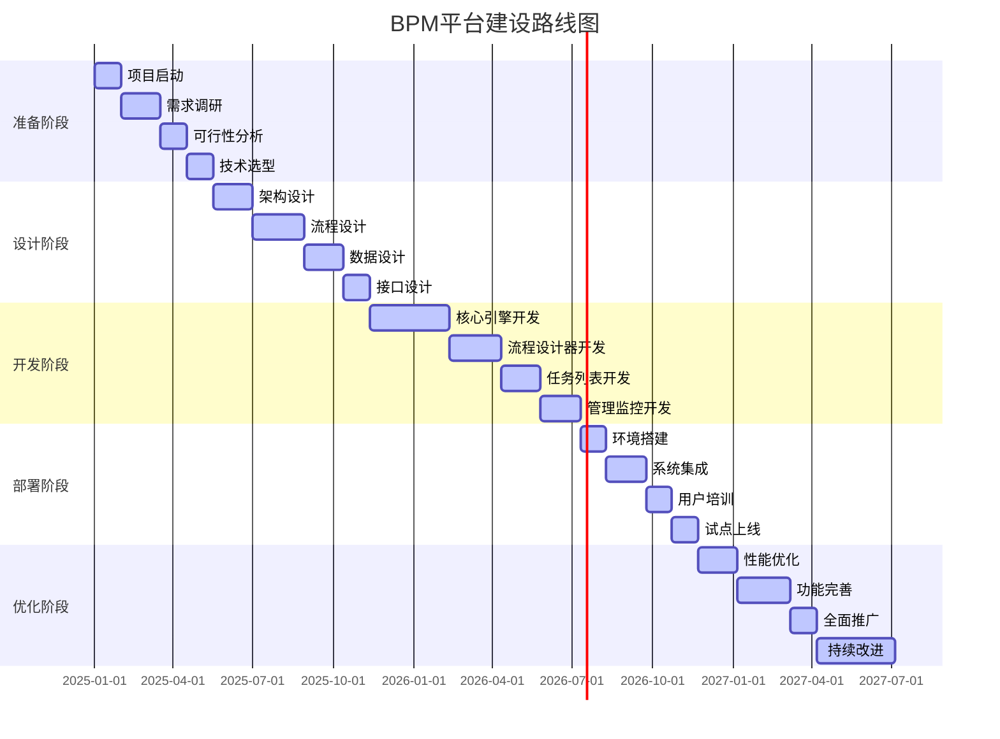

# 附录A：BPM平台建设路线图

BPM平台建设是一个复杂的系统工程，需要科学的规划和分阶段的实施。一个清晰的建设路线图不仅能够指导项目实施，还能帮助组织合理分配资源、控制风险并确保项目成功。本附录提供了一个通用的BPM平台建设路线图，组织可以根据自身实际情况进行调整和优化。

## 建设路线图的核心价值

### 指导项目实施
通过明确的阶段划分和里程碑设置，为项目实施提供清晰的指导。

### 合理分配资源
帮助组织合理规划人力、财力和时间资源，避免资源浪费。

### 控制项目风险
通过分阶段实施和持续评估，有效控制项目风险。

### 确保项目成功
科学的路线图能够提高项目成功率，确保预期目标的实现。

## BPM平台建设路线图

BPM平台建设路线图通常分为五个主要阶段：准备阶段、设计阶段、开发阶段、部署阶段和优化阶段。每个阶段都有明确的目标、关键活动和交付物。

## 第一阶段：准备阶段（1-3个月）

准备阶段是BPM平台建设的基础，主要目标是明确项目目标、范围和实施策略。

### 关键活动

1. **项目启动**
   - 成立项目组织，明确项目团队和职责分工
   - 制定项目章程，明确项目目标、范围和预期收益
   - 获得高层支持，确保项目资源投入

2. **需求调研**
   - 深入了解业务需求和痛点
   - 识别关键业务流程和优化机会
   - 分析现有系统和流程现状

3. **可行性分析**
   - 技术可行性评估
   - 经济可行性分析
   - 组织可行性评估

4. **技术选型**
   - 评估不同BPM平台的优缺点
   - 选择适合的技术架构和开发工具
   - 确定实施模式（自研、购买、混合）

### 交付物

- 项目章程
- 需求调研报告
- 可行性分析报告
- 技术选型报告

### 成功要素

- 高层支持和承诺
- 跨部门协作机制
- 明确的项目目标和范围
- 合理的资源规划

## 第二阶段：设计阶段（3-6个月）

设计阶段是BPM平台建设的核心，主要目标是完成系统架构和详细设计。

### 关键活动

1. **架构设计**
   - 设计系统整体架构和技术栈
   - 确定部署模式和扩展策略
   - 设计安全和监控机制

2. **流程设计**
   - 设计核心业务流程模型
   - 定义流程规则和决策逻辑
   - 设计流程监控和分析机制

3. **数据设计**
   - 设计数据模型和存储结构
   - 定义数据集成和同步策略
   - 设计数据安全和备份机制

4. **接口设计**
   - 设计系统内部接口
   - 设计与外部系统的集成接口
   - 定义API规范和文档

### 交付物

- 系统架构设计文档
- 流程设计文档
- 数据设计文档
- 接口设计文档

### 成功要素

- 完善的设计评审机制
- 标准化的设计规范
- 充分的技术验证
- 详细的文档记录

## 第三阶段：开发阶段（6-12个月）

开发阶段是BPM平台建设的实施过程，主要目标是完成系统开发和测试。

### 关键活动

1. **核心引擎开发**
   - 开发流程引擎核心功能
   - 实现任务管理和调度机制
   - 开发规则引擎和决策支持

2. **流程设计器开发**
   - 开发可视化流程设计工具
   - 实现流程模板和组件库
   - 开发表单设计和配置功能

3. **任务列表开发**
   - 开发任务分配和跟踪功能
   - 实现任务提醒和催办机制
   - 开发任务协作和沟通功能

4. **管理监控开发**
   - 开发流程监控和分析功能
   - 实现系统管理和配置功能
   - 开发报表和仪表板功能

### 交付物

- 核心引擎代码和文档
- 流程设计器软件
- 任务列表应用
- 管理监控平台

### 成功要素

- 敏捷开发方法
- 持续集成和测试
- 代码质量和规范
- 版本控制和管理

## 第四阶段：部署阶段（1-3个月）

部署阶段是BPM平台建设的关键节点，主要目标是完成系统部署和用户上线。

### 关键活动

1. **环境搭建**
   - 搭建开发、测试和生产环境
   - 配置服务器和网络设施
   - 部署系统软件和依赖组件

2. **系统集成**
   - 集成现有业务系统
   - 配置数据同步和接口调用
   - 进行集成测试和验证

3. **用户培训**
   - 制定培训计划和材料
   - 组织用户培训和认证
   - 提供操作手册和帮助文档

4. **试点上线**
   - 选择试点部门和流程
   - 进行系统部署和配置
   - 监控运行情况和用户反馈

### 交付物

- 部署环境和配置文档
- 系统集成方案和测试报告
- 用户培训材料和认证记录
- 试点上线报告和运行数据

### 成功要素

- 详细的部署计划
- 完善的测试验证
- 充分的用户培训
- 有效的变更管理

## 第五阶段：优化阶段（3-6个月）

优化阶段是BPM平台建设的持续改进过程，主要目标是完善系统功能和提升用户体验。

### 关键活动

1. **性能优化**
   - 分析系统性能瓶颈
   - 优化数据库查询和索引
   - 调整系统配置和参数

2. **功能完善**
   - 收集用户反馈和需求
   - 开发新增功能和改进
   - 修复已知问题和缺陷

3. **全面推广**
   - 制定推广计划和策略
   - 扩大用户范围和流程覆盖
   - 建立支持和服务体系

4. **持续改进**
   - 建立持续改进机制
   - 定期评估系统效果
   - 规划后续发展路线

### 交付物

- 性能优化报告和改进记录
- 功能完善清单和更新日志
- 全面推广方案和实施报告
- 持续改进计划和评估报告

### 成功要素

- 持续的性能监控
- 用户反馈机制
- 完善的支持体系
- 长期的发展规划

## 风险管理与应对策略

在BPM平台建设过程中，可能会遇到各种风险，需要制定相应的应对策略。

### 技术风险

- **风险描述**：技术选型不当或技术实现困难
- **应对策略**：
  - 进行充分的技术验证和原型开发
  - 建立技术专家团队和外部咨询机制
  - 制定技术备选方案和回退计划

### 组织风险

- **风险描述**：组织变革阻力或用户接受度低
- **应对策略**：
  - 加强变革管理和沟通宣传
  - 建立用户参与和反馈机制
  - 提供充分的培训和支持服务

### 进度风险

- **风险描述**：项目进度延误或里程碑无法达成
- **应对策略**：
  - 制定详细的项目计划和里程碑
  - 建立进度监控和预警机制
  - 预留适当的缓冲时间和资源

### 成本风险

- **风险描述**：项目成本超支或投资回报不达预期
- **应对策略**：
  - 制定详细的成本预算和控制机制
  - 建立成本监控和审批流程
  - 定期评估投资回报和价值实现

## 最佳实践建议

### 1. 分阶段实施
- 采用敏捷开发方法，分阶段交付价值
- 优先实现核心功能，逐步完善系统
- 及时收集反馈，持续优化改进

### 2. 用户参与
- 邀请关键用户参与设计和测试
- 建立用户反馈和建议机制
- 提供充分的培训和支持服务

### 3. 标准化管理
- 建立标准化的开发和管理规范
- 实施代码审查和质量控制机制
- 建立文档管理和知识传承体系

### 4. 持续改进
- 建立持续改进和优化机制
- 定期评估系统效果和用户满意度
- 跟踪技术发展和行业最佳实践

通过遵循这个BPM平台建设路线图，组织可以更加科学和系统地实施BPM平台项目，提高项目成功率并实现预期的业务价值。
</file_content>