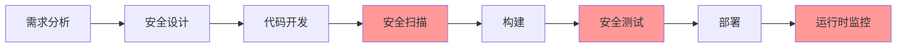

随着云原生技术的快速发展和企业数字化转型的深入推进，CI/CD平台正面临着前所未有的机遇与挑战。从最初的自动化构建部署工具，到如今的企业级交付平台，CI/CD已经发展成为一个涵盖技术、流程、文化的综合性体系。展望未来，CI/CD平台将继续演进，与内部开发者平台、安全合规、云原生等趋势深度融合，为企业提供更加智能、安全、高效的交付能力。本文将深入探讨CI/CD平台的未来演进趋势，分析前沿技术方向和发展机遇。

## CI/CD平台演进的驱动力

CI/CD平台的未来发展受到多个因素的驱动，这些因素共同塑造了平台的演进方向：

### 1. 开发者体验的持续优化

现代软件开发的复杂性不断增加，开发者需要处理更多的技术栈、工具和环境。CI/CD平台需要从单纯的自动化工具转变为开发者友好的服务平台：

#### 抽象复杂性
```yaml
# 简化的流水线定义示例
pipeline:
  name: my-app-deployment
  stages:
    - build:
        language: java
        version: 11
    - test:
        type: integration
        environment: staging
    - deploy:
        target: kubernetes
        strategy: blue-green
```

#### 个性化配置
```python
#!/usr/bin/env python3
"""
开发者个性化配置管理系统
"""

import yaml
from typing import Dict, Any
from dataclasses import dataclass

@dataclass
class DeveloperProfile:
    name: str
    team: str
    preferred_tools: Dict[str, str]
    notification_channels: list
    security_level: str

class DeveloperExperienceManager:
    def __init__(self):
        self.profiles = {}
    
    def load_profile(self, developer_id: str) -> DeveloperProfile:
        """加载开发者配置文件"""
        profile_file = f"config/profiles/{developer_id}.yaml"
        try:
            with open(profile_file, 'r') as f:
                profile_data = yaml.safe_load(f)
            
            return DeveloperProfile(
                name=profile_data['name'],
                team=profile_data['team'],
                preferred_tools=profile_data.get('preferred_tools', {}),
                notification_channels=profile_data.get('notification_channels', ['email']),
                security_level=profile_data.get('security_level', 'standard')
            )
        except FileNotFoundError:
            # 返回默认配置
            return DeveloperProfile(
                name=developer_id,
                team="default",
                preferred_tools={"ci": "github-actions", "cd": "argocd"},
                notification_channels=["email"],
                security_level="standard"
            )
    
    def customize_pipeline(self, pipeline_config: Dict[str, Any], 
                          developer_id: str) -> Dict[str, Any]:
        """根据开发者偏好自定义流水线"""
        profile = self.load_profile(developer_id)
        
        # 根据偏好调整工具
        if 'ci_tool' in profile.preferred_tools:
            pipeline_config['ci_tool'] = profile.preferred_tools['ci_tool']
        
        # 添加通知配置
        if 'notifications' not in pipeline_config:
            pipeline_config['notifications'] = {}
        
        pipeline_config['notifications']['channels'] = profile.notification_channels
        
        return pipeline_config

# 使用示例
# dx_manager = DeveloperExperienceManager()
# pipeline_config = {
#     "name": "my-app-pipeline",
#     "stages": ["build", "test", "deploy"]
# }
# customized_config = dx_manager.customize_pipeline(pipeline_config, "john_doe")
# print(customized_config)
```

### 2. 安全与合规要求的提升

随着网络安全威胁的不断增加，安全和合规已成为CI/CD流程中不可忽视的重要环节：

#### 安全左移实践


#### 合规自动化
```python
#!/usr/bin/env python3
"""
合规自动化检查系统
"""

import json
from typing import Dict, List, Any
from datetime import datetime
import hashlib

class ComplianceChecker:
    def __init__(self):
        self.compliance_rules = {}
        self.audit_log = []
    
    def add_compliance_rule(self, rule_id: str, rule_config: Dict[str, Any]):
        """添加合规规则"""
        self.compliance_rules[rule_id] = rule_config
    
    def check_compliance(self, pipeline_config: Dict[str, Any]) -> Dict[str, Any]:
        """检查流水线配置的合规性"""
        violations = []
        passed_checks = []
        
        for rule_id, rule_config in self.compliance_rules.items():
            try:
                result = self._apply_rule(rule_config, pipeline_config)
                if result['compliant']:
                    passed_checks.append(rule_id)
                else:
                    violations.append({
                        'rule_id': rule_id,
                        'violation': result['violation'],
                        'severity': rule_config.get('severity', 'medium')
                    })
            except Exception as e:
                violations.append({
                    'rule_id': rule_id,
                    'violation': f"Rule execution failed: {str(e)}",
                    'severity': 'high'
                })
        
        # 记录审计日志
        audit_entry = {
            'timestamp': datetime.now().isoformat(),
            'pipeline_hash': self._hash_pipeline(pipeline_config),
            'violations_count': len(violations),
            'passed_count': len(passed_checks)
        }
        self.audit_log.append(audit_entry)
        
        return {
            'compliant': len(violations) == 0,
            'violations': violations,
            'passed_checks': passed_checks,
            'audit_entry': audit_entry
        }
    
    def _apply_rule(self, rule_config: Dict[str, Any], 
                   pipeline_config: Dict[str, Any]) -> Dict[str, Any]:
        """应用合规规则"""
        rule_type = rule_config['type']
        
        if rule_type == 'required_field':
            field_path = rule_config['field']
            field_value = self._get_nested_value(pipeline_config, field_path)
            
            if field_value is None:
                return {
                    'compliant': False,
                    'violation': f"Required field '{field_path}' is missing"
                }
            return {'compliant': True}
        
        elif rule_type == 'allowed_values':
            field_path = rule_config['field']
            allowed_values = rule_config['values']
            field_value = self._get_nested_value(pipeline_config, field_path)
            
            if field_value is not None and field_value not in allowed_values:
                return {
                    'compliant': False,
                    'violation': f"Field '{field_path}' value '{field_value}' not in allowed values {allowed_values}"
                }
            return {'compliant': True}
        
        elif rule_type == 'regex_pattern':
            field_path = rule_config['field']
            pattern = rule_config['pattern']
            import re
            
            field_value = self._get_nested_value(pipeline_config, field_path)
            
            if field_value is not None and not re.match(pattern, str(field_value)):
                return {
                    'compliant': False,
                    'violation': f"Field '{field_path}' value '{field_value}' does not match pattern '{pattern}'"
                }
            return {'compliant': True}
        
        else:
            raise ValueError(f"Unknown rule type: {rule_type}")
    
    def _get_nested_value(self, data: Dict[str, Any], path: str) -> Any:
        """获取嵌套字段的值"""
        keys = path.split('.')
        current = data
        
        try:
            for key in keys:
                current = current[key]
            return current
        except (KeyError, TypeError):
            return None
    
    def _hash_pipeline(self, pipeline_config: Dict[str, Any]) -> str:
        """计算流水线配置的哈希值"""
        pipeline_str = json.dumps(pipeline_config, sort_keys=True)
        return hashlib.sha256(pipeline_str.encode()).hexdigest()

# 使用示例
# checker = ComplianceChecker()
# checker.add_compliance_rule('require_security_scan', {
#     'type': 'required_field',
#     'field': 'stages.security_scan',
#     'severity': 'high'
# })
# checker.add_compliance_rule('allowed_deploy_targets', {
#     'type': 'allowed_values',
#     'field': 'stages.deploy.target',
#     'values': ['kubernetes', 'ecs', 'app-engine'],
#     'severity': 'medium'
# })
# 
# pipeline_config = {
#     'name': 'my-pipeline',
#     'stages': {
#         'build': {'language': 'python'},
#         'test': {'framework': 'pytest'},
#         'security_scan': {'tool': 'sonarqube'},
#         'deploy': {'target': 'kubernetes'}
#     }
# }
# 
# result = checker.check_compliance(pipeline_config)
# print(f"Compliant: {result['compliant']}")
# if result['violations']:
#     for violation in result['violations']:
#         print(f"Violation: {violation}")
```


## 内部开发者平台的崛起

内部开发者平台（Internal Developer Platform, IDP）正在成为现代软件工程组织的重要基础设施。它通过将CI/CD能力产品化，为开发者提供简单、统一、可靠的体验，从而显著提升开发效率和交付质量。

### 平台工程的核心价值

平台工程不仅仅是技术实现，更是一种组织能力的体现，它致力于为开发者提供"自助式"的服务体验：

#### 开发者体验优化
```python
#!/usr/bin/env python3
"""
内部开发者平台体验优化系统
"""

import json
from typing import Dict, List, Any, Optional
from dataclasses import dataclass
from datetime import datetime
import logging

@dataclass
class DeveloperProfile:
    user_id: str
    team: str
    role: str  # developer, tester, ops, admin
    experience_level: str  # junior, intermediate, senior
    preferred_tools: List[str]
    recent_activities: List[Dict[str, Any]]

@dataclass
class PlatformService:
    id: str
    name: str
    category: str  # ci, cd, infrastructure, security, monitoring
    description: str
    configuration_options: Dict[str, Any]
    deployment_targets: List[str]
    security_level: str  # low, medium, high
    sla: str  # service level agreement

@dataclass
class PersonalizedRecommendation:
    service_id: str
    reason: str
    confidence: float
    setup_guide: str
    estimated_setup_time: str

class DeveloperExperienceOptimizer:
    def __init__(self):
        self.developer_profiles: Dict[str, DeveloperProfile] = {}
        self.platform_services: Dict[str, PlatformService] = {}
        self.logger = logging.getLogger(__name__)
    
    def register_developer(self, profile: DeveloperProfile):
        """注册开发者"""
        self.developer_profiles[profile.user_id] = profile
        self.logger.info(f"Registered developer: {profile.user_id}")
    
    def add_platform_service(self, service: PlatformService):
        """添加平台服务"""
        self.platform_services[service.id] = service
        self.logger.info(f"Added platform service: {service.name}")
    
    def generate_personalized_recommendations(self, user_id: str) -> List[PersonalizedRecommendation]:
        """生成个性化推荐"""
        if user_id not in self.developer_profiles:
            raise ValueError(f"Developer {user_id} not found")
        
        profile = self.developer_profiles[user_id]
        recommendations = []
        
        # 基于角色推荐
        role_based_services = self._get_role_based_services(profile.role)
        for service_id in role_based_services:
            if service_id in self.platform_services:
                service = self.platform_services[service_id]
                recommendation = PersonalizedRecommendation(
                    service_id=service_id,
                    reason=f"基于您的角色({profile.role})推荐",
                    confidence=0.8,
                    setup_guide=f"请参考 {service.name} 的快速开始指南",
                    estimated_setup_time=self._estimate_setup_time(service)
                )
                recommendations.append(recommendation)
        
        # 基于经验水平推荐
        experience_based_services = self._get_experience_based_services(profile.experience_level)
        for service_id in experience_based_services:
            if service_id in self.platform_services and service_id not in [r.service_id for r in recommendations]:
                service = self.platform_services[service_id]
                recommendation = PersonalizedRecommendation(
                    service_id=service_id,
                    reason=f"基于您的经验水平({profile.experience_level})推荐",
                    confidence=0.7,
                    setup_guide=f"请参考 {service.name} 的入门教程",
                    estimated_setup_time=self._estimate_setup_time(service)
                )
                recommendations.append(recommendation)
        
        # 基于偏好工具推荐
        preference_based_services = self._get_preference_based_services(profile.preferred_tools)
        for service_id in preference_based_services:
            if service_id in self.platform_services and service_id not in [r.service_id for r in recommendations]:
                service = self.platform_services[service_id]
                recommendation = PersonalizedRecommendation(
                    service_id=service_id,
                    reason=f"基于您偏好的工具推荐",
                    confidence=0.9,
                    setup_guide=f"请参考 {service.name} 的集成指南",
                    estimated_setup_time=self._estimate_setup_time(service)
                )
                recommendations.append(recommendation)
        
        # 基于活动历史推荐
        activity_based_services = self._get_activity_based_recommendations(profile.recent_activities)
        for service_id in activity_based_services:
            if service_id in self.platform_services and service_id not in [r.service_id for r in recommendations]:
                service = self.platform_services[service_id]
                recommendation = PersonalizedRecommendation(
                    service_id=service_id,
                    reason="基于您的近期活动推荐",
                    confidence=0.85,
                    setup_guide=f"请参考 {service.name} 的使用文档",
                    estimated_setup_time=self._estimate_setup_time(service)
                )
                recommendations.append(recommendation)
        
        return recommendations
    
    def _get_role_based_services(self, role: str) -> List[str]:
        """基于角色获取推荐服务"""
        role_service_mapping = {
            "developer": ["ci-pipeline", "code-quality", "local-dev-environment"],
            "tester": ["test-automation", "test-environment", "performance-testing"],
            "ops": ["cd-pipeline", "infrastructure-provisioning", "monitoring"],
            "admin": ["platform-admin", "security-compliance", "resource-management"]
        }
        return role_service_mapping.get(role, [])
    
    def _get_experience_based_services(self, experience_level: str) -> List[str]:
        """基于经验水平获取推荐服务"""
        experience_service_mapping = {
            "junior": ["basic-ci-cd", "code-review", "documentation"],
            "intermediate": ["advanced-pipelines", "testing-strategies", "performance-monitoring"],
            "senior": ["platform-customization", "security-automation", "observability"]
        }
        return experience_service_mapping.get(experience_level, [])
    
    def _get_preference_based_services(self, preferred_tools: List[str]) -> List[str]:
        """基于偏好工具获取推荐服务"""
        tool_service_mapping = {
            "docker": ["container-registry", "kubernetes-deployment"],
            "kubernetes": ["k8s-provisioning", "helm-charts"],
            "terraform": ["infrastructure-as-code", "multi-cloud-deployment"],
            "jenkins": ["jenkins-pipelines", "plugin-management"],
            "github": ["github-actions", "code-scanning"],
            "gitlab": ["gitlab-ci", "security-scanning"]
        }
        
        services = []
        for tool in preferred_tools:
            if tool.lower() in tool_service_mapping:
                services.extend(tool_service_mapping[tool.lower()])
        
        return list(set(services))  # 去重
    
    def _get_activity_based_recommendations(self, recent_activities: List[Dict[str, Any]]) -> List[str]:
        """基于活动历史获取推荐"""
        services = []
        
        for activity in recent_activities:
            activity_type = activity.get("type", "")
            if activity_type == "pipeline_failure":
                services.append("pipeline-debugging")
            elif activity_type == "security_alert":
                services.append("security-automation")
            elif activity_type == "performance_issue":
                services.append("performance-monitoring")
            elif activity_type == "deployment_failure":
                services.append("cd-pipeline")
        
        return list(set(services))  # 去重
    
    def _estimate_setup_time(self, service: PlatformService) -> str:
        """估算设置时间"""
        # 简化实现，实际应用中会基于服务复杂度和历史数据计算
        if service.security_level == "high":
            return "2-4 hours"
        elif service.category in ["infrastructure", "security"]:
            return "1-2 hours"
        else:
            return "30-60 minutes"
    
    def track_developer_journey(self, user_id: str, activity: Dict[str, Any]):
        """跟踪开发者旅程"""
        if user_id in self.developer_profiles:
            profile = self.developer_profiles[user_id]
            profile.recent_activities.append(activity)
            
            # 保持最近10次活动
            if len(profile.recent_activities) > 10:
                profile.recent_activities = profile.recent_activities[-10:]
            
            self.logger.info(f"Tracked activity for developer {user_id}: {activity.get('type', 'unknown')}")

# 使用示例
# optimizer = DeveloperExperienceOptimizer()
# 
# # 注册开发者
# developer = DeveloperProfile(
#     user_id="dev-001",
#     team="backend",
#     role="developer",
#     experience_level="intermediate",
#     preferred_tools=["docker", "kubernetes", "github"],
#     recent_activities=[
#         {"type": "pipeline_failure", "timestamp": "2025-09-07T10:00:00"},
#         {"type": "code_commit", "timestamp": "2025-09-07T09:30:00"}
#     ]
# )
# optimizer.register_developer(developer)
# 
# # 添加平台服务
# services = [
#     PlatformService(
#         id="ci-pipeline",
#         name="CI Pipeline Service",
#         category="ci",
#         description="持续集成流水线服务",
#         configuration_options={"language": "string", "framework": "string"},
#         deployment_targets=["kubernetes", "vm"],
#         security_level="medium",
#         sla="99.9%"
#     ),
#     PlatformService(
#         id="kubernetes-deployment",
#         name="Kubernetes Deployment Service",
#         category="cd",
#         description="Kubernetes应用部署服务",
#         configuration_options={"namespace": "string", "replicas": "int"},
#         deployment_targets=["kubernetes"],
#         security_level="high",
#         sla="99.95%"
#     )
# ]
# 
# for service in services:
#     optimizer.add_platform_service(service)
# 
# # 生成个性化推荐
# recommendations = optimizer.generate_personalized_recommendations("dev-001")
# print("个性化推荐:")
# for rec in recommendations:
#     print(f"  服务: {rec.service_id}")
#     print(f"  原因: {rec.reason}")
#     print(f"  设置指南: {rec.setup_guide}")
#     print(f"  预估时间: {rec.estimated_setup_time}")
#     print()
```

### 自助服务平台架构

内部开发者平台的核心是提供自助式服务，让开发者能够快速获取所需资源和服务：

#### 服务目录与编排
```python
#!/usr/bin/env python3
"""
自助服务平台编排系统
"""

import asyncio
import json
from typing import Dict, List, Any, Optional
from dataclasses import dataclass
from datetime import datetime
import logging

@dataclass
class ServiceTemplate:
    id: str
    name: str
    version: str
    description: str
    inputs: Dict[str, Any]  # 输入参数定义
    outputs: Dict[str, Any]  # 输出参数定义
    dependencies: List[str]  # 依赖的服务
    deployment_steps: List[Dict[str, Any]]  # 部署步骤
    rollback_steps: List[Dict[str, Any]]  # 回滚步骤
    estimated_time: int  # 预估部署时间（秒）

@dataclass
class ServiceInstance:
    id: str
    template_id: str
    name: str
    status: str  # pending, deploying, running, failed, deleting
    created_at: datetime
    updated_at: datetime
    inputs: Dict[str, Any]
    outputs: Dict[str, Any]
    owner: str
    tags: List[str]

@dataclass
class DeploymentStep:
    id: str
    name: str
    type: str  # terraform, helm, kubectl, script
    configuration: Dict[str, Any]
    timeout: int  # 超时时间（秒）
    retry_count: int  # 重试次数

class SelfServicePlatform:
    def __init__(self):
        self.service_templates: Dict[str, ServiceTemplate] = {}
        self.service_instances: Dict[str, ServiceInstance] = {}
        self.logger = logging.getLogger(__name__)
    
    def register_service_template(self, template: ServiceTemplate):
        """注册服务模板"""
        self.service_templates[template.id] = template
        self.logger.info(f"Registered service template: {template.name} (v{template.version})")
    
    async def provision_service(self, template_id: str, name: str, 
                              inputs: Dict[str, Any], owner: str,
                              tags: List[str] = None) -> str:
        """部署服务实例"""
        if template_id not in self.service_templates:
            raise ValueError(f"Service template {template_id} not found")
        
        template = self.service_templates[template_id]
        
        # 验证输入参数
        self._validate_inputs(template, inputs)
        
        # 创建服务实例记录
        instance_id = f"inst-{int(datetime.now().timestamp())}"
        instance = ServiceInstance(
            id=instance_id,
            template_id=template_id,
            name=name,
            status="pending",
            created_at=datetime.now(),
            updated_at=datetime.now(),
            inputs=inputs,
            outputs={},
            owner=owner,
            tags=tags or []
        )
        
        self.service_instances[instance_id] = instance
        
        # 异步执行部署
        asyncio.create_task(self._execute_deployment(instance_id))
        
        return instance_id
    
    async def _execute_deployment(self, instance_id: str):
        """执行部署流程"""
        if instance_id not in self.service_instances:
            return
        
        instance = self.service_instances[instance_id]
        template = self.service_templates[instance.instance_id]
        
        try:
            instance.status = "deploying"
            instance.updated_at = datetime.now()
            
            # 执行依赖服务部署
            await self._deploy_dependencies(instance, template)
            
            # 执行主服务部署步骤
            outputs = await self._execute_deployment_steps(instance, template)
            
            # 更新实例状态
            instance.outputs = outputs
            instance.status = "running"
            instance.updated_at = datetime.now()
            
            self.logger.info(f"Service {instance_id} deployed successfully")
            
        except Exception as e:
            instance.status = "failed"
            instance.updated_at = datetime.now()
            self.logger.error(f"Failed to deploy service {instance_id}: {e}")
            
            # 执行回滚
            await self._execute_rollback(instance, template)
    
    async def _deploy_dependencies(self, instance: ServiceInstance, template: ServiceTemplate):
        """部署依赖服务"""
        for dep_template_id in template.dependencies:
            if dep_template_id in self.service_templates:
                dep_template = self.service_templates[dep_template_id]
                # 简化处理，实际应用中需要更复杂的依赖管理
                self.logger.info(f"Deploying dependency: {dep_template.name}")
                await asyncio.sleep(1)  # 模拟部署时间
    
    async def _execute_deployment_steps(self, instance: ServiceInstance, 
                                      template: ServiceTemplate) -> Dict[str, Any]:
        """执行部署步骤"""
        outputs = {}
        
        for step_config in template.deployment_steps:
            step = DeploymentStep(**step_config)
            self.logger.info(f"Executing step: {step.name}")
            
            # 模拟执行步骤
            await asyncio.sleep(step.timeout / 10)  # 模拟执行时间
            
            # 模拟输出
            if step.type == "terraform":
                outputs[f"{step.name}_output"] = f"terraform-output-{step.id}"
            elif step.type == "helm":
                outputs[f"{step.name}_release"] = f"helm-release-{step.id}"
            
            self.logger.info(f"Step {step.name} completed")
        
        return outputs
    
    async def _execute_rollback(self, instance: ServiceInstance, template: ServiceTemplate):
        """执行回滚流程"""
        self.logger.info(f"Rolling back service {instance.id}")
        
        for step_config in reversed(template.rollback_steps):
            step = DeploymentStep(**step_config)
            self.logger.info(f"Executing rollback step: {step.name}")
            
            # 模拟回滚执行
            await asyncio.sleep(step.timeout / 10)
            
            self.logger.info(f"Rollback step {step.name} completed")
    
    def _validate_inputs(self, template: ServiceTemplate, inputs: Dict[str, Any]):
        """验证输入参数"""
        required_inputs = {k: v for k, v in template.inputs.items() if v.get("required", False)}
        
        for input_name, input_def in required_inputs.items():
            if input_name not in inputs:
                raise ValueError(f"Required input '{input_name}' is missing")
            
            # 类型验证
            expected_type = input_def.get("type")
            actual_value = inputs[input_name]
            if expected_type and not self._validate_type(actual_value, expected_type):
                raise ValueError(f"Input '{input_name}' has invalid type. Expected {expected_type}")
    
    def _validate_type(self, value: Any, expected_type: str) -> bool:
        """验证类型"""
        type_mapping = {
            "string": str,
            "int": int,
            "float": float,
            "bool": bool,
            "list": list,
            "dict": dict
        }
        
        if expected_type in type_mapping:
            return isinstance(value, type_mapping[expected_type])
        
        return True  # 未知类型默认通过
    
    def get_service_instance(self, instance_id: str) -> Optional[ServiceInstance]:
        """获取服务实例"""
        return self.service_instances.get(instance_id)
    
    def list_service_instances(self, owner: str = None, status: str = None) -> List[ServiceInstance]:
        """列出服务实例"""
        instances = list(self.service_instances.values())
        
        if owner:
            instances = [inst for inst in instances if inst.owner == owner]
        
        if status:
            instances = [inst for inst in instances if inst.status == status]
        
        return instances
    
    async def delete_service(self, instance_id: str):
        """删除服务实例"""
        if instance_id not in self.service_instances:
            raise ValueError(f"Service instance {instance_id} not found")
        
        instance = self.service_instances[instance_id]
        template = self.service_templates[instance.template_id]
        
        instance.status = "deleting"
        instance.updated_at = datetime.now()
        
        # 执行删除步骤（简化处理）
        await asyncio.sleep(2)  # 模拟删除时间
        
        # 删除实例记录
        del self.service_instances[instance_id]
        self.logger.info(f"Service instance {instance_id} deleted")

# 使用示例
# platform = SelfServicePlatform()
# 
# # 注册服务模板
# template = ServiceTemplate(
#     id="web-app-template",
#     name="Web Application Template",
#     version="1.0.0",
#     description="标准Web应用部署模板",
#     inputs={
#         "app_name": {"type": "string", "required": True},
#         "replicas": {"type": "int", "required": False, "default": 3},
#         "image": {"type": "string", "required": True}
#     },
#     outputs={
#         "service_url": {"type": "string"},
#         "ingress_host": {"type": "string"}
#     },
#     dependencies=[],
#     deployment_steps=[
#         {
#             "id": "step-1",
#             "name": "Deploy Kubernetes Deployment",
#             "type": "kubectl",
#             "configuration": {"manifest": "deployment.yaml"},
#             "timeout": 300,
#             "retry_count": 3
#         }
#     ],
#     rollback_steps=[
#         {
#             "id": "rollback-1",
#             "name": "Delete Kubernetes Deployment",
#             "type": "kubectl",
#             "configuration": {"delete": "deployment"},
#             "timeout": 120,
#             "retry_count": 2
#         }
#     ],
#     estimated_time=300
# )
# 
# platform.register_service_template(template)
# 
# # 部署服务
# inputs = {
#     "app_name": "my-web-app",
#     "replicas": 3,
#     "image": "nginx:latest"
# }
# 
# instance_id = asyncio.run(platform.provision_service(
#     template_id="web-app-template",
#     name="My Web App",
#     inputs=inputs,
#     owner="developer-001",
#     tags=["production", "web"]
# ))
# 
# print(f"Service provisioned with ID: {instance_id}")
# 
# # 查询服务状态
# instance = platform.get_service_instance(instance_id)
# print(f"Service status: {instance.status}")
```

## 安全与合规的进一步自动化

随着安全威胁的不断增加和合规要求的日趋严格，CI/CD平台的安全与合规自动化成为未来发展的重要方向。

### 零信任安全架构

零信任安全模型正在改变CI/CD平台的安全设计思路：

#### 动态访问控制
```python
#!/usr/bin/env python3
"""
零信任安全架构实现
"""

import jwt
import hashlib
import time
from typing import Dict, List, Any, Optional
from dataclasses import dataclass
from datetime import datetime, timedelta
import logging

@dataclass
class SecurityPolicy:
    id: str
    name: str
    description: str
    rules: List[Dict[str, Any]]  # 访问控制规则
    conditions: List[Dict[str, Any]]  # 执行条件
    actions: List[str]  # 允许的操作
    priority: int  # 优先级
    enabled: bool

@dataclass
class AccessRequest:
    user_id: str
    resource_id: str
    action: str  # read, write, execute, delete
    context: Dict[str, Any]  # 上下文信息
    timestamp: datetime

@dataclass
class AccessDecision:
    request_id: str
    allowed: bool
    policy_id: str
    reason: str
    conditions_evaluated: List[Dict[str, Any]]
    timestamp: datetime

@dataclass
class ContinuousVerification:
    user_id: str
    session_id: str
    last_verification: datetime
    risk_score: float
    verification_methods: List[str]
    next_verification_due: datetime

class ZeroTrustSecurityEngine:
    def __init__(self, jwt_secret: str):
        self.jwt_secret = jwt_secret
        self.policies: Dict[str, SecurityPolicy] = {}
        self.access_logs: List[AccessDecision] = []
        self.verification_sessions: Dict[str, ContinuousVerification] = {}
        self.logger = logging.getLogger(__name__)
    
    def add_policy(self, policy: SecurityPolicy):
        """添加安全策略"""
        self.policies[policy.id] = policy
        self.logger.info(f"Added security policy: {policy.name}")
    
    def evaluate_access_request(self, request: AccessRequest) -> AccessDecision:
        """评估访问请求"""
        request_id = f"req-{int(time.time() * 1000)}"
        
        # 按优先级排序策略
        sorted_policies = sorted(
            [p for p in self.policies.values() if p.enabled],
            key=lambda x: x.priority,
            reverse=True
        )
        
        # 评估每个策略
        for policy in sorted_policies:
            decision = self._evaluate_policy(policy, request)
            if decision.allowed or decision.policy_id:  # 找到匹配的策略
                decision.request_id = request_id
                self.access_logs.append(decision)
                return decision
        
        # 默认拒绝
        decision = AccessDecision(
            request_id=request_id,
            allowed=False,
            policy_id="",
            reason="No matching policy found",
            conditions_evaluated=[],
            timestamp=datetime.now()
        )
        
        self.access_logs.append(decision)
        return decision
    
    def _evaluate_policy(self, policy: SecurityPolicy, request: AccessRequest) -> AccessDecision:
        """评估单个策略"""
        conditions_evaluated = []
        all_conditions_met = True
        
        # 评估条件
        for condition in policy.conditions:
            condition_result = self._evaluate_condition(condition, request)
            conditions_evaluated.append(condition_result)
            
            if not condition_result.get("met", False):
                all_conditions_met = False
                break
        
        # 如果所有条件都满足，检查规则
        if all_conditions_met:
            rules_met = self._evaluate_rules(policy.rules, request)
            allowed = rules_met and request.action in policy.actions
            reason = "Policy conditions and rules met" if allowed else "Action not permitted by policy"
        else:
            allowed = False
            reason = "Policy conditions not met"
        
        return AccessDecision(
            request_id="",
            allowed=allowed,
            policy_id=policy.id if all_conditions_met else "",
            reason=reason,
            conditions_evaluated=conditions_evaluated,
            timestamp=datetime.now()
        )
    
    def _evaluate_condition(self, condition: Dict[str, Any], request: AccessRequest) -> Dict[str, Any]:
        """评估条件"""
        condition_type = condition.get("type")
        condition_value = condition.get("value")
        context_key = condition.get("context_key")
        
        if condition_type == "user_role":
            user_role = request.context.get("user_role", "")
            met = user_role == condition_value
        elif condition_type == "time_window":
            current_time = datetime.now().time()
            start_time = datetime.strptime(condition_value["start"], "%H:%M").time()
            end_time = datetime.strptime(condition_value["end"], "%H:%M").time()
            met = start_time <= current_time <= end_time
        elif condition_type == "ip_range":
            user_ip = request.context.get("ip_address", "")
            met = self._ip_in_range(user_ip, condition_value)
        elif condition_type == "resource_tag":
            resource_tags = request.context.get("resource_tags", [])
            met = condition_value in resource_tags
        else:
            met = False
        
        return {
            "type": condition_type,
            "value": condition_value,
            "met": met,
            "evaluated_at": datetime.now()
        }
    
    def _evaluate_rules(self, rules: List[Dict[str, Any]], request: AccessRequest) -> bool:
        """评估规则"""
        # 简化实现，实际应用中会更复杂
        for rule in rules:
            if rule.get("type") == "allow_all":
                return True
            elif rule.get("type") == "deny_all":
                return False
        
        return True  # 默认允许
    
    def _ip_in_range(self, ip: str, ip_range: str) -> bool:
        """检查IP是否在范围内"""
        # 简化实现
        return True
    
    def start_continuous_verification(self, user_id: str, session_id: str, 
                                    verification_methods: List[str]) -> str:
        """启动持续验证会话"""
        verification = ContinuousVerification(
            user_id=user_id,
            session_id=session_id,
            last_verification=datetime.now(),
            risk_score=0.0,
            verification_methods=verification_methods,
            next_verification_due=datetime.now() + timedelta(minutes=30)
        )
        
        self.verification_sessions[session_id] = verification
        self.logger.info(f"Started continuous verification for user {user_id}")
        
        return self._generate_verification_token(session_id)
    
    def _generate_verification_token(self, session_id: str) -> str:
        """生成验证令牌"""
        payload = {
            "session_id": session_id,
            "exp": int((datetime.now() + timedelta(hours=1)).timestamp())
        }
        return jwt.encode(payload, self.jwt_secret, algorithm="HS256")
    
    def validate_verification_token(self, token: str) -> Optional[Dict[str, Any]]:
        """验证令牌"""
        try:
            payload = jwt.decode(token, self.jwt_secret, algorithms=["HS256"])
            return payload
        except jwt.ExpiredSignatureError:
            self.logger.warning("Verification token expired")
            return None
        except jwt.InvalidTokenError:
            self.logger.warning("Invalid verification token")
            return None
    
    def update_risk_score(self, session_id: str, new_score: float):
        """更新风险评分"""
        if session_id in self.verification_sessions:
            verification = self.verification_sessions[session_id]
            verification.risk_score = new_score
            verification.last_verification = datetime.now()
            
            # 根据风险评分调整验证频率
            if new_score > 0.8:
                verification.next_verification_due = datetime.now() + timedelta(minutes=5)
            elif new_score > 0.5:
                verification.next_verification_due = datetime.now() + timedelta(minutes=15)
            else:
                verification.next_verification_due = datetime.now() + timedelta(minutes=30)
    
    def check_continuous_verification(self, session_id: str) -> bool:
        """检查持续验证状态"""
        if session_id not in self.verification_sessions:
            return False
        
        verification = self.verification_sessions[session_id]
        
        # 检查是否需要重新验证
        if datetime.now() > verification.next_verification_due:
            self.logger.info(f"Continuous verification required for session {session_id}")
            return False
        
        # 检查风险评分
        if verification.risk_score > 0.9:
            self.logger.warning(f"High risk score for session {session_id}")
            return False
        
        return True
    
    def get_access_logs(self, user_id: str = None, time_range_hours: int = 24) -> List[AccessDecision]:
        """获取访问日志"""
        cutoff_time = datetime.now() - timedelta(hours=time_range_hours)
        logs = [log for log in self.access_logs if log.timestamp > cutoff_time]
        
        if user_id:
            # 过滤特定用户的日志（需要在请求中包含用户信息）
            logs = [log for log in logs if any(
                cond.get("context", {}).get("user_id") == user_id 
                for cond in log.conditions_evaluated
            )]
        
        return logs

# 使用示例
# security_engine = ZeroTrustSecurityEngine(jwt_secret="my-secret-key")
# 
# # 添加安全策略
# policy = SecurityPolicy(
#     id="policy-001",
#     name="Developer Access Policy",
#     description="开发者的标准访问策略",
#     rules=[{"type": "allow_all"}],
#     conditions=[
#         {
#             "type": "user_role",
#             "value": "developer",
#             "context_key": "user_role"
#         }
#     ],
#     actions=["read", "write", "execute"],
#     priority=100,
#     enabled=True
# )
# 
# security_engine.add_policy(policy)
# 
# # 评估访问请求
# request = AccessRequest(
#     user_id="user-001",
#     resource_id="resource-001",
#     action="read",
#     context={
#         "user_role": "developer",
#         "ip_address": "192.168.1.100",
#         "resource_tags": ["development", "web"]
#     },
#     timestamp=datetime.now()
# )
# 
# decision = security_engine.evaluate_access_request(request)
# print(f"Access {'granted' if decision.allowed else 'denied'}")
# print(f"Reason: {decision.reason}")
# 
# # 启动持续验证
# session_id = "session-001"
# token = security_engine.start_continuous_verification(
#     user_id="user-001",
#     session_id=session_id,
#     verification_methods=["mfa", "behavioral"]
# )
# 
# print(f"Verification token: {token}")
# 
# # 验证令牌
# payload = security_engine.validate_verification_token(token)
# if payload:
#     print(f"Token valid for session: {payload['session_id']}")
```

### 合规即代码

将合规要求编码化，实现自动化的合规检查和报告：

#### 合规规则引擎
```python
#!/usr/bin/env python3
"""
合规即代码规则引擎
"""

import json
from typing import Dict, List, Any, Optional
from dataclasses import dataclass
from datetime import datetime
import logging
import re

@dataclass
class ComplianceRule:
    id: str
    name: str
    description: str
    category: str  # security, privacy, audit, data_protection
    severity: str  # low, medium, high, critical
    rule_type: str  # static, dynamic, behavioral
    expression: str  # 规则表达式
    parameters: Dict[str, Any]  # 规则参数
    remediation: str  # 修复建议
    references: List[str]  # 参考标准
    enabled: bool

@dataclass
class ComplianceCheck:
    rule_id: str
    resource_id: str
    resource_type: str
    passed: bool
    findings: List[Dict[str, Any]]
    timestamp: datetime

@dataclass
class ComplianceReport:
    id: str
    generated_at: datetime
    scope: str  # 全局、项目、环境等
    summary: Dict[str, int]  # 各严重级别的违规统计
    details: List[ComplianceCheck]
    score: float  # 合规评分 0-100
    recommendations: List[str]

class ComplianceAsCodeEngine:
    def __init__(self):
        self.rules: Dict[str, ComplianceRule] = {}
        self.check_history: List[ComplianceCheck] = []
        self.logger = logging.getLogger(__name__)
    
    def add_rule(self, rule: ComplianceRule):
        """添加合规规则"""
        self.rules[rule.id] = rule
        self.logger.info(f"Added compliance rule: {rule.name}")
    
    def load_rules_from_file(self, file_path: str):
        """从文件加载规则"""
        try:
            with open(file_path, 'r', encoding='utf-8') as f:
                rules_data = json.load(f)
            
            for rule_data in rules_data:
                rule = ComplianceRule(**rule_data)
                self.add_rule(rule)
                
        except Exception as e:
            self.logger.error(f"Failed to load rules from {file_path}: {e}")
            raise
    
    def evaluate_resource(self, resource: Dict[str, Any]) -> List[ComplianceCheck]:
        """评估资源合规性"""
        checks = []
        resource_id = resource.get("id", "unknown")
        resource_type = resource.get("type", "unknown")
        
        for rule in self.rules.values():
            if not rule.enabled:
                continue
            
            check = self._evaluate_rule(rule, resource)
            check.resource_id = resource_id
            check.resource_type = resource_type
            checks.append(check)
        
        # 记录检查历史
        self.check_history.extend(checks)
        
        return checks
    
    def _evaluate_rule(self, rule: ComplianceRule, resource: Dict[str, Any]) -> ComplianceCheck:
        """评估单个规则"""
        findings = []
        
        try:
            if rule.rule_type == "static":
                passed, finding = self._evaluate_static_rule(rule, resource)
                if not passed and finding:
                    findings.append(finding)
            elif rule.rule_type == "dynamic":
                passed, finding = self._evaluate_dynamic_rule(rule, resource)
                if not passed and finding:
                    findings.append(finding)
            elif rule.rule_type == "behavioral":
                passed, finding = self._evaluate_behavioral_rule(rule, resource)
                if not passed and finding:
                    findings.append(finding)
            else:
                passed = False
                findings.append({"error": f"Unknown rule type: {rule.rule_type}"})
        
        except Exception as e:
            passed = False
            findings.append({"error": str(e)})
        
        return ComplianceCheck(
            rule_id=rule.id,
            resource_id="",
            resource_type="",
            passed=passed,
            findings=findings,
            timestamp=datetime.now()
        )
    
    def _evaluate_static_rule(self, rule: ComplianceRule, resource: Dict[str, Any]) -> tuple:
        """评估静态规则"""
        # 静态规则基于资源的属性进行检查
        try:
            # 解析规则表达式
            # 简化实现，实际应用中会使用更复杂的表达式引擎
            if "==" in rule.expression:
                key, expected_value = rule.expression.split("==")
                key = key.strip()
                expected_value = expected_value.strip().strip('"')
                
                actual_value = self._get_nested_value(resource, key)
                passed = str(actual_value) == expected_value
                
                if not passed:
                    finding = {
                        "field": key,
                        "expected": expected_value,
                        "actual": actual_value,
                        "message": f"Value mismatch for {key}"
                    }
                    return passed, finding
            
            elif "regex" in rule.expression:
                # 正则表达式检查
                match = re.search(r'regex\(([^,]+),\s*"([^"]+)"\)', rule.expression)
                if match:
                    key, pattern = match.groups()
                    actual_value = self._get_nested_value(resource, key.strip())
                    passed = bool(re.match(pattern, str(actual_value)))
                    
                    if not passed:
                        finding = {
                            "field": key,
                            "pattern": pattern,
                            "actual": actual_value,
                            "message": f"Value does not match pattern for {key}"
                        }
                        return passed, finding
            
            return True, None
            
        except Exception as e:
            return False, {"error": f"Rule evaluation failed: {e}"}
    
    def _evaluate_dynamic_rule(self, rule: ComplianceRule, resource: Dict[str, Any]) -> tuple:
        """评估动态规则"""
        # 动态规则基于资源的行为或状态进行检查
        # 这里简化实现，实际应用中会集成监控数据
        
        # 检查资源是否包含必要的监控配置
        if "monitoring" in rule.expression:
            has_monitoring = "monitoring" in resource
            if not has_monitoring:
                finding = {
                    "missing": "monitoring",
                    "message": "Resource missing monitoring configuration"
                }
                return False, finding
        
        return True, None
    
    def _evaluate_behavioral_rule(self, rule: ComplianceRule, resource: Dict[str, Any]) -> tuple:
        """评估行为规则"""
        # 行为规则基于用户或系统的操作模式进行检查
        # 这里简化实现，实际应用中会集成行为分析
        
        # 检查是否存在不安全的操作模式
        if "suspicious_activity" in rule.expression:
            # 模拟检查
            suspicious = resource.get("suspicious_activity", False)
            if suspicious:
                finding = {
                    "issue": "suspicious_activity",
                    "message": "Suspicious activity detected"
                }
                return False, finding
        
        return True, None
    
    def _get_nested_value(self, obj: Dict[str, Any], key_path: str) -> Any:
        """获取嵌套对象的值"""
        keys = key_path.split(".")
        current = obj
        
        for key in keys:
            if isinstance(current, dict) and key in current:
                current = current[key]
            else:
                return None
        
        return current
    
    def generate_compliance_report(self, scope: str = "global", 
                                 resource_filter: Dict[str, Any] = None) -> ComplianceReport:
        """生成合规报告"""
        # 过滤检查历史
        relevant_checks = self.check_history
        
        if resource_filter:
            # 根据资源过滤器筛选检查结果
            filtered_checks = []
            for check in relevant_checks:
                match = True
                for key, value in resource_filter.items():
                    if getattr(check, key, None) != value:
                        match = False
                        break
                if match:
                    filtered_checks.append(check)
            relevant_checks = filtered_checks
        
        # 统计各严重级别的违规
        severity_counts = {"low": 0, "medium": 0, "high": 0, "critical": 0}
        passed_checks = 0
        failed_checks = 0
        
        for check in relevant_checks:
            if check.passed:
                passed_checks += 1
            else:
                failed_checks += 1
                rule = self.rules.get(check.rule_id)
                if rule:
                    severity_counts[rule.severity] += 1
        
        # 计算合规评分
        total_checks = passed_checks + failed_checks
        score = (passed_checks / total_checks * 100) if total_checks > 0 else 100
        
        # 生成建议
        recommendations = self._generate_recommendations(relevant_checks)
        
        return ComplianceReport(
            id=f"report-{int(datetime.now().timestamp())}",
            generated_at=datetime.now(),
            scope=scope,
            summary=severity_counts,
            details=relevant_checks,
            score=score,
            recommendations=recommendations
        )
    
    def _generate_recommendations(self, checks: List[ComplianceCheck]) -> List[str]:
        """生成改进建议"""
        recommendations = []
        failed_rules = set()
        
        for check in checks:
            if not check.passed and check.rule_id not in failed_rules:
                rule = self.rules.get(check.rule_id)
                if rule and rule.remediation:
                    recommendations.append(f"[{rule.severity.upper()}] {rule.remediation}")
                    failed_rules.add(check.rule_id)
        
        return recommendations
    
    def get_failed_checks(self, severity: str = None) -> List[ComplianceCheck]:
        """获取失败的检查"""
        failed_checks = [check for check in self.check_history if not check.passed]
        
        if severity:
            filtered_checks = []
            for check in failed_checks:
                rule = self.rules.get(check.rule_id)
                if rule and rule.severity == severity:
                    filtered_checks.append(check)
            failed_checks = filtered_checks
        
        return failed_checks

# 使用示例
# compliance_engine = ComplianceAsCodeEngine()
# 
# # 添加合规规则
# rules = [
#     ComplianceRule(
#         id="rule-001",
#         name="Require HTTPS",
#         description="所有Web服务必须使用HTTPS",
#         category="security",
#         severity="high",
#         rule_type="static",
#         expression='protocol == "https"',
#         parameters={},
#         remediation="配置SSL证书并启用HTTPS",
#         references=["NIST SP 800-52"],
#         enabled=True
#     ),
#     ComplianceRule(
#         id="rule-002",
#         name="Strong Password Policy",
#         description="密码必须符合复杂性要求",
#         category="security",
#         severity="medium",
#         rule_type="static",
#         expression='regex(password_policy, "^(?=.*[a-z])(?=.*[A-Z])(?=.*\\d)(?=.*[@$!%*?&])[A-Za-z\\d@$!%*?&]{8,}$")',
#         parameters={},
#         remediation="实施强密码策略",
#         references=["NIST SP 800-63"],
#         enabled=True
#     )
# ]
# 
# for rule in rules:
#     compliance_engine.add_rule(rule)
# 
# # 评估资源
# resource = {
#     "id": "web-service-001",
#     "type": "web_service",
#     "protocol": "https",
#     "password_policy": "MySecureP@ss123",
#     "monitoring": {"enabled": True}
# }
# 
# checks = compliance_engine.evaluate_resource(resource)
# print("合规检查结果:")
# for check in checks:
#     rule = compliance_engine.rules.get(check.rule_id)
#     print(f"  {rule.name}: {'通过' if check.passed else '失败'}")
#     if not check.passed:
#         for finding in check.findings:
#             print(f"    - {finding.get('message', '违规')}")
# 
# # 生成合规报告
# report = compliance_engine.generate_compliance_report(scope="production")
# print(f"\n合规评分: {report.score:.1f}/100")
# print("违规统计:", report.summary)
# print("改进建议:")
# for rec in report.recommendations:
#     print(f"  {rec}")
```

## 云原生环境下的CI/CD新范式

云原生技术的普及正在重塑CI/CD的架构和实践方式，推动着新的范式出现。

### 声明式交付流水线

声明式方法正在成为云原生CI/CD的标准实践：

#### 流水线即数据
```python
#!/usr/bin/env python3
"""
声明式交付流水线引擎
"""

import yaml
import json
from typing import Dict, List, Any, Optional, Callable
from dataclasses import dataclass
from datetime import datetime
import logging
from enum import Enum

class PipelinePhase(Enum):
    PENDING = "pending"
    RUNNING = "running"
    SUCCESS = "success"
    FAILED = "failed"
    CANCELLED = "cancelled"

@dataclass
class PipelineStep:
    id: str
    name: str
    type: str  # build, test, deploy, approval, notification
    configuration: Dict[str, Any]
    dependencies: List[str]
    timeout: int  # 超时时间（秒）
    retry_count: int
    conditions: List[Dict[str, Any]]  # 执行条件

@dataclass
class PipelineStage:
    id: str
    name: str
    steps: List[PipelineStep]
    parallel: bool  # 是否并行执行步骤
    approval_required: bool
    timeout: int

@dataclass
class PipelineDefinition:
    api_version: str
    kind: str  # Pipeline
    metadata: Dict[str, Any]
    spec: Dict[str, Any]  # 流水线规范

@dataclass
class PipelineExecution:
    id: str
    pipeline_id: str
    status: PipelinePhase
    start_time: datetime
    end_time: Optional[datetime]
    stages: Dict[str, Dict[str, Any]]  # stage_id -> execution_info
    variables: Dict[str, Any]
    trigger_info: Dict[str, Any]

@dataclass
class PipelineEvent:
    execution_id: str
    stage_id: str
    step_id: str
    event_type: str  # started, completed, failed, cancelled
    timestamp: datetime
    data: Dict[str, Any]

class DeclarativePipelineEngine:
    def __init__(self):
        self.pipeline_definitions: Dict[str, PipelineDefinition] = {}
        self.executions: Dict[str, PipelineExecution] = {}
        self.event_handlers: Dict[str, List[Callable]] = {}
        self.logger = logging.getLogger(__name__)
    
    def register_pipeline(self, definition: PipelineDefinition):
        """注册流水线定义"""
        pipeline_id = f"{definition.metadata['name']}-{definition.metadata.get('version', 'latest')}"
        self.pipeline_definitions[pipeline_id] = definition
        self.logger.info(f"Registered pipeline: {pipeline_id}")
    
    def load_pipeline_from_yaml(self, yaml_content: str) -> str:
        """从YAML加载流水线"""
        try:
            pipeline_data = yaml.safe_load(yaml_content)
            definition = PipelineDefinition(
                api_version=pipeline_data.get("apiVersion", "pipeline/v1"),
                kind=pipeline_data.get("kind", "Pipeline"),
                metadata=pipeline_data.get("metadata", {}),
                spec=pipeline_data.get("spec", {})
            )
            
            self.register_pipeline(definition)
            return f"{definition.metadata['name']}-{definition.metadata.get('version', 'latest')}"
            
        except Exception as e:
            self.logger.error(f"Failed to load pipeline from YAML: {e}")
            raise
    
    def start_execution(self, pipeline_id: str, 
                       variables: Dict[str, Any] = None,
                       trigger_info: Dict[str, Any] = None) -> str:
        """启动流水线执行"""
        if pipeline_id not in self.pipeline_definitions:
            raise ValueError(f"Pipeline {pipeline_id} not found")
        
        execution_id = f"exec-{int(datetime.now().timestamp() * 1000)}"
        
        # 初始化执行记录
        execution = PipelineExecution(
            id=execution_id,
            pipeline_id=pipeline_id,
            status=PipelinePhase.PENDING,
            start_time=datetime.now(),
            end_time=None,
            stages={},
            variables=variables or {},
            trigger_info=trigger_info or {}
        )
        
        self.executions[execution_id] = execution
        
        # 异步执行流水线
        import asyncio
        asyncio.create_task(self._execute_pipeline(execution_id))
        
        self.logger.info(f"Started pipeline execution: {execution_id}")
        return execution_id
    
    async def _execute_pipeline(self, execution_id: str):
        """执行流水线"""
        if execution_id not in self.executions:
            return
        
        execution = self.executions[execution_id]
        definition = self.pipeline_definitions[execution.pipeline_id]
        
        try:
            execution.status = PipelinePhase.RUNNING
            self._emit_event(execution_id, "", "", "pipeline_started", {})
            
            # 执行阶段
            stages = definition.spec.get("stages", [])
            for stage_data in stages:
                stage = PipelineStage(**stage_data)
                await self._execute_stage(execution_id, stage)
            
            # 流水线成功完成
            execution.status = PipelinePhase.SUCCESS
            execution.end_time = datetime.now()
            self._emit_event(execution_id, "", "", "pipeline_completed", {})
            
        except Exception as e:
            execution.status = PipelinePhase.FAILED
            execution.end_time = datetime.now()
            self._emit_event(execution_id, "", "", "pipeline_failed", {"error": str(e)})
            self.logger.error(f"Pipeline execution failed: {e}")
    
    async def _execute_stage(self, execution_id: str, stage: PipelineStage):
        """执行阶段"""
        execution = self.executions[execution_id]
        execution.stages[stage.id] = {
            "status": "pending",
            "start_time": datetime.now(),
            "end_time": None
        }
        
        self._emit_event(execution_id, stage.id, "", "stage_started", {})
        
        try:
            if stage.parallel:
                # 并行执行步骤
                await self._execute_steps_parallel(execution_id, stage)
            else:
                # 串行执行步骤
                await self._execute_steps_serial(execution_id, stage)
            
            # 阶段成功完成
            execution.stages[stage.id]["status"] = "success"
            execution.stages[stage.id]["end_time"] = datetime.now()
            self._emit_event(execution_id, stage.id, "", "stage_completed", {})
            
        except Exception as e:
            execution.stages[stage.id]["status"] = "failed"
            execution.stages[stage.id]["end_time"] = datetime.now()
            self._emit_event(execution_id, stage.id, "", "stage_failed", {"error": str(e)})
            raise
    
    async def _execute_steps_parallel(self, execution_id: str, stage: PipelineStage):
        """并行执行步骤"""
        tasks = []
        for step in stage.steps:
            task = asyncio.create_task(self._execute_step(execution_id, stage.id, step))
            tasks.append(task)
        
        # 等待所有任务完成
        results = await asyncio.gather(*tasks, return_exceptions=True)
        
        # 检查是否有失败
        for i, result in enumerate(results):
            if isinstance(result, Exception):
                step = stage.steps[i]
                self.logger.error(f"Step {step.id} failed: {result}")
                raise result
    
    async def _execute_steps_serial(self, execution_id: str, stage: PipelineStage):
        """串行执行步骤"""
        for step in stage.steps:
            await self._execute_step(execution_id, stage.id, step)
    
    async def _execute_step(self, execution_id: str, stage_id: str, step: PipelineStep):
        """执行步骤"""
        self._emit_event(execution_id, stage_id, step.id, "step_started", {})
        
        try:
            # 检查执行条件
            if not self._check_conditions(step.conditions, execution_id):
                self._emit_event(execution_id, stage_id, step.id, "step_skipped", {})
                return
            
            # 执行步骤逻辑（简化实现）
            await asyncio.sleep(1)  # 模拟执行时间
            
            # 根据步骤类型执行不同操作
            if step.type == "build":
                await self._execute_build_step(execution_id, step)
            elif step.type == "test":
                await self._execute_test_step(execution_id, step)
            elif step.type == "deploy":
                await self._execute_deploy_step(execution_id, step)
            elif step.type == "approval":
                await self._execute_approval_step(execution_id, step)
            
            self._emit_event(execution_id, stage_id, step.id, "step_completed", {})
            
        except Exception as e:
            self._emit_event(execution_id, stage_id, step.id, "step_failed", {"error": str(e)})
            raise
    
    async def _execute_build_step(self, execution_id: str, step: PipelineStep):
        """执行构建步骤"""
        config = step.configuration
        self.logger.info(f"Executing build step: {step.name}")
        # 模拟构建过程
        await asyncio.sleep(2)
    
    async def _execute_test_step(self, execution_id: str, step: PipelineStep):
        """执行测试步骤"""
        config = step.configuration
        self.logger.info(f"Executing test step: {step.name}")
        # 模拟测试过程
        await asyncio.sleep(3)
    
    async def _execute_deploy_step(self, execution_id: str, step: PipelineStep):
        """执行部署步骤"""
        config = step.configuration
        self.logger.info(f"Executing deploy step: {step.name}")
        # 模拟部署过程
        await asyncio.sleep(2)
    
    async def _execute_approval_step(self, execution_id: str, step: PipelineStep):
        """执行审批步骤"""
        config = step.configuration
        self.logger.info(f"Executing approval step: {step.name}")
        # 模拟审批过程
        await asyncio.sleep(1)
    
    def _check_conditions(self, conditions: List[Dict[str, Any]], execution_id: str) -> bool:
        """检查执行条件"""
        # 简化实现
        return True
    
    def _emit_event(self, execution_id: str, stage_id: str, step_id: str, 
                   event_type: str, data: Dict[str, Any]):
        """发出事件"""
        event = PipelineEvent(
            execution_id=execution_id,
            stage_id=stage_id,
            step_id=step_id,
            event_type=event_type,
            timestamp=datetime.now(),
            data=data
        )
        
        # 调用事件处理器
        handlers = self.event_handlers.get(event_type, [])
        for handler in handlers:
            try:
                handler(event)
            except Exception as e:
                self.logger.error(f"Event handler failed: {e}")
    
    def register_event_handler(self, event_type: str, handler: Callable):
        """注册事件处理器"""
        if event_type not in self.event_handlers:
            self.event_handlers[event_type] = []
        self.event_handlers[event_type].append(handler)
    
    def get_execution_status(self, execution_id: str) -> Optional[PipelineExecution]:
        """获取执行状态"""
        return self.executions.get(execution_id)
    
    def cancel_execution(self, execution_id: str):
        """取消执行"""
        if execution_id in self.executions:
            execution = self.executions[execution_id]
            execution.status = PipelinePhase.CANCELLED
            execution.end_time = datetime.now()
            self._emit_event(execution_id, "", "", "pipeline_cancelled", {})

# 使用示例
# pipeline_engine = DeclarativePipelineEngine()
# 
# # 定义流水线
# pipeline_yaml = """
# apiVersion: pipeline/v1
# kind: Pipeline
# metadata:
#   name: web-app-delivery
#   version: 1.0.0
# spec:
#   stages:
#     - id: build
#       name: Build Application
#       parallel: false
#       approval_required: false
#       timeout: 600
#       steps:
#         - id: checkout
#           name: Checkout Code
#           type: build
#           configuration:
#             repository: "https://github.com/example/web-app.git"
#             branch: "main"
#           dependencies: []
#           timeout: 120
#           retry_count: 3
#           conditions: []
#         - id: compile
#           name: Compile Code
#           type: build
#           configuration:
#             language: "java"
#             build_tool: "maven"
#           dependencies: ["checkout"]
#           timeout: 300
#           retry_count: 2
#           conditions: []
#     
#     - id: test
#       name: Run Tests
#       parallel: true
#       approval_required: false
#       timeout: 900
#       steps:
#         - id: unit-test
#           name: Unit Tests
#           type: test
#           configuration:
#             test_type: "unit"
#             framework: "junit"
#           dependencies: []
#           timeout: 180
#           retry_count: 1
#           conditions: []
#         - id: integration-test
#           name: Integration Tests
#           type: test
#           configuration:
#             test_type: "integration"
#             framework: "testcontainers"
#           dependencies: []
#           timeout: 600
#           retry_count: 1
#           conditions: []
#     
#     - id: deploy
#       name: Deploy to Production
#       parallel: false
#       approval_required: true
#       timeout: 300
#       steps:
#         - id: deploy-k8s
#           name: Deploy to Kubernetes
#           type: deploy
#           configuration:
#             target: "production"
#             namespace: "web-app"
#           dependencies: []
#           timeout: 300
#           retry_count: 2
#           conditions: []
# """
# 
# # 加载流水线
# pipeline_id = pipeline_engine.load_pipeline_from_yaml(pipeline_yaml)
# print(f"Loaded pipeline: {pipeline_id}")
# 
# # 注册事件处理器
# def on_pipeline_completed(event: PipelineEvent):
#     print(f"Pipeline {event.execution_id} completed successfully!")
# 
# pipeline_engine.register_event_handler("pipeline_completed", on_pipeline_completed)
# 
# # 启动执行
# execution_id = pipeline_engine.start_execution(
#     pipeline_id=pipeline_id,
#     variables={"version": "1.2.3"},
#     trigger_info={"source": "github", "branch": "main"}
# )
# 
# print(f"Started execution: {execution_id}")
# 
# # 查询执行状态
# import time
# time.sleep(2)  # 等待执行开始
# 
# status = pipeline_engine.get_execution_status(execution_id)
# if status:
#     print(f"Execution status: {status.status.value}")
```

通过对内部开发者平台、安全合规自动化以及云原生CI/CD新范式的深入探讨，我们可以看到CI/CD平台正在朝着更加智能化、平台化和安全化的方向发展。这些趋势不仅提升了开发效率和交付质量，还为组织构建更加可靠和安全的软件交付流程提供了新的可能性。随着技术的不断进步，未来的CI/CD平台将继续演进，为软件工程实践带来更多的创新和价值。