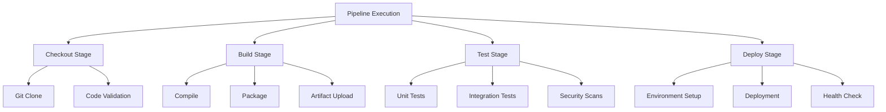

在现代CI/CD平台中，随着微服务架构的广泛应用和系统复杂性的不断增加，传统的监控和日志分析手段已难以满足对系统行为的全面理解需求。链路追踪（Distributed Tracing）作为一种重要的可观测性手段，能够提供请求在分布式系统中的完整调用路径，帮助开发者和运维人员快速定位性能瓶颈、诊断错误根源并优化系统架构。本文将深入探讨链路追踪的核心概念、技术实现、在CI/CD平台中的应用实践以及最佳实施策略。

## 链路追踪核心概念

链路追踪起源于Google的Dapper论文，是一种用于分析分布式系统中请求流转的技术。它通过在请求流经的每个服务中植入追踪信息，构建出完整的调用链路图，从而实现对系统行为的可视化和分析。

### 1. 基础术语定义

#### Trace（追踪）
Trace代表一个完整的请求调用链，从请求发起方到响应返回方的全过程。一个Trace由多个Span组成，这些Span按照调用关系组织成树状结构。

#### Span（跨度）
Span是链路追踪中的基本工作单元，代表一个操作或工作单元的执行过程。每个Span包含以下关键信息：
- **Span ID**：Span的唯一标识符
- **Trace ID**：所属Trace的唯一标识符
- **Parent Span ID**：父Span的标识符（根Span无父Span）
- **操作名称**：描述该Span执行的操作
- **时间戳**：Span的开始和结束时间
- **标签（Tags）**：键值对形式的元数据
- **日志（Logs）**：Span执行过程中的关键事件记录

#### Context（上下文）
Context用于在不同服务间传递追踪信息，确保Span之间的关联关系能够正确建立。它通常包含Trace ID、Span ID以及采样标志等信息。

### 2. 追踪数据模型

#### Span生命周期
一个Span的完整生命周期包括以下阶段：
1. **创建**：当操作开始时创建Span
2. **执行**：执行具体的业务逻辑
3. **记录**：记录关键事件和状态信息
4. **结束**：操作完成后结束Span并计算执行时间
5. **上报**：将Span数据发送到追踪系统

#### Span关系类型
Span之间存在以下几种关系：
- **ChildOf**：子Span依赖于父Span的执行结果
- **FollowsFrom**：子Span与父Span有关联但不直接依赖

#### 追踪上下文传播
追踪上下文需要在服务调用间正确传播：
- **HTTP调用**：通过HTTP头传递追踪信息
- **消息队列**：通过消息属性传递追踪信息
- **RPC调用**：通过RPC框架的元数据机制传递

## 链路追踪技术实现

### 1. OpenTelemetry架构

OpenTelemetry是云原生计算基金会（CNCF）的孵化项目，提供了一套标准化的可观测性框架，包括链路追踪、指标收集和日志处理等功能。

#### 核心组件架构
```yaml
# OpenTelemetry架构组件
components:
  # 语言特定SDK
  - name: SDK
    description: 各语言的OpenTelemetry SDK实现
    languages: [java, python, go, nodejs, dotnet, rust]
  
  # 自动化 instrumentation
  - name: Auto-Instrumentation
    description: 无需修改代码的自动追踪植入
    tools: [opentelemetry-operator, opentelemetry-auto-instrumentation]
  
  # Collector
  - name: Collector
    description: 独立的代理，负责接收、处理和转发遥测数据
    features:
      - receivers: [otlp, zipkin, jaeger, prometheus]
      - processors: [batch, memory_limiter, attributes]
      - exporters: [jaeger, zipkin, otlp, prometheus]
  
  # 协议
  - name: OTLP
    description: OpenTelemetry Protocol，标准化的数据传输协议
```

#### Java应用集成示例
```java
// pom.xml - Maven依赖配置
/*
<dependencies>
    <dependency>
        <groupId>io.opentelemetry</groupId>
        <artifactId>opentelemetry-api</artifactId>
        <version>1.31.0</version>
    </dependency>
    <dependency>
        <groupId>io.opentelemetry</groupId>
        <artifactId>opentelemetry-sdk</artifactId>
        <version>1.31.0</version>
    </dependency>
    <dependency>
        <groupId>io.opentelemetry</groupId>
        <artifactId>opentelemetry-exporter-otlp</artifactId>
        <version>1.31.0</version>
    </dependency>
    <dependency>
        <groupId>io.opentelemetry.instrumentation</groupId>
        <artifactId>opentelemetry-spring-boot-starter</artifactId>
        <version>1.31.0-alpha</version>
    </dependency>
</dependencies>
*/

// OpenTelemetry配置类
@Configuration
public class TracingConfiguration {
    
    @Bean
    public OpenTelemetry openTelemetry() {
        Resource resource = Resource.getDefault()
            .merge(Resource.create(Attributes.of(
                ResourceAttributes.SERVICE_NAME, "pipeline-engine",
                ResourceAttributes.SERVICE_VERSION, "1.0.0"
            )));
        
        SdkTracerProvider sdkTracerProvider = SdkTracerProvider.builder()
            .addSpanProcessor(BatchSpanProcessor.builder(OtlpGrpcSpanExporter.builder()
                .setEndpoint("http://otel-collector:4317")
                .setTimeout(Duration.ofSeconds(10))
                .build()).build())
            .setResource(resource)
            .build();
        
        OpenTelemetrySdk openTelemetrySdk = OpenTelemetrySdk.builder()
            .setTracerProvider(sdkTracerProvider)
            .setPropagators(ContextPropagators.create(
                TextMapPropagator.composite(
                    W3CTraceContextPropagator.getInstance(),
                    W3CBaggagePropagator.getInstance())))
            .buildAndRegisterGlobal();
        
        return openTelemetrySdk;
    }
    
    @Bean
    public Tracer tracer(OpenTelemetry openTelemetry) {
        return openTelemetry.getTracer("pipeline-engine-tracer");
    }
}

// 流水线执行服务
@Service
public class PipelineExecutionService {
    
    private final Tracer tracer;
    private final GitService gitService;
    private final BuildService buildService;
    private final TestService testService;
    private final DeployService deployService;
    
    public PipelineExecutionService(Tracer tracer, 
                                  GitService gitService,
                                  BuildService buildService,
                                  TestService testService,
                                  DeployService deployService) {
        this.tracer = tracer;
        this.gitService = gitService;
        this.buildService = buildService;
        this.testService = testService;
        this.deployService = deployService;
    }
    
    public void executePipeline(String pipelineId, PipelineConfig config) {
        // 创建流水线执行Span
        Span pipelineSpan = tracer.spanBuilder("pipeline-execution")
            .setAttribute("pipeline.id", pipelineId)
            .setAttribute("pipeline.name", config.getName())
            .setAttribute("pipeline.trigger", config.getTrigger().toString())
            .startSpan();
        
        try (Scope scope = pipelineSpan.makeCurrent()) {
            // 执行各个阶段
            executeStage("checkout", () -> gitService.checkout(config.getRepository()));
            executeStage("build", () -> buildService.build(config.getBuildConfig()));
            executeStage("test", () -> testService.runTests(config.getTestConfig()));
            executeStage("deploy", () -> deployService.deploy(config.getDeployConfig()));
            
            pipelineSpan.setStatus(StatusCode.OK);
        } catch (Exception e) {
            pipelineSpan.recordException(e);
            pipelineSpan.setStatus(StatusCode.ERROR, e.getMessage());
            throw e;
        } finally {
            pipelineSpan.end();
        }
    }
    
    private void executeStage(String stageName, Runnable stageAction) {
        Span stageSpan = tracer.spanBuilder(stageName + "-stage")
            .setAttribute("stage.name", stageName)
            .startSpan();
        
        try (Scope scope = stageSpan.makeCurrent()) {
            // 记录阶段开始
            stageSpan.addEvent("stage-started");
            
            // 执行阶段操作
            stageAction.run();
            
            // 记录阶段完成
            stageSpan.addEvent("stage-completed");
            stageSpan.setStatus(StatusCode.OK);
        } catch (Exception e) {
            stageSpan.recordException(e);
            stageSpan.setStatus(StatusCode.ERROR, e.getMessage());
            throw e;
        } finally {
            stageSpan.end();
        }
    }
}
```

### 2. Jaeger集成实践

Jaeger是Uber开源的端到端分布式追踪系统，提供了完整的追踪数据收集、存储和可视化能力。

#### Jaeger部署配置
```yaml
# docker-compose.yml - Jaeger部署配置
version: '3.7'

services:
  jaeger-collector:
    image: jaegertracing/jaeger-collector:1.52
    environment:
      - SPAN_STORAGE_TYPE=elasticsearch
      - ES_SERVER_URLS=http://elasticsearch:9200
      - COLLECTOR_OTLP_ENABLED=true
      - COLLECTOR_ZIPKIN_HOST_PORT=:9411
    ports:
      - "14269:14269"
      - "14268:14268"
      - "9411:9411"
    depends_on:
      - elasticsearch

  jaeger-query:
    image: jaegertracing/jaeger-query:1.52
    environment:
      - SPAN_STORAGE_TYPE=elasticsearch
      - ES_SERVER_URLS=http://elasticsearch:9200
    ports:
      - "16686:16686"
    depends_on:
      - elasticsearch

  jaeger-agent:
    image: jaegertracing/jaeger-agent:1.52
    environment:
      - REPORTER_GRPC_HOST_PORT=jaeger-collector:14250
    ports:
      - "5775:5775/udp"
      - "6831:6831/udp"
      - "6832:6832/udp"
      - "5778:5778"
    depends_on:
      - jaeger-collector

  elasticsearch:
    image: docker.elastic.co/elasticsearch/elasticsearch:7.17.14
    environment:
      - discovery.type=single-node
      - xpack.security.enabled=false
      - ES_JAVA_OPTS=-Xms1g -Xmx1g
    ports:
      - "9200:9200"
    volumes:
      - es-data:/usr/share/elasticsearch/data

volumes:
  es-data:
```

#### Python应用集成示例
```python
#!/usr/bin/env python3
"""
CI/CD平台Python服务链路追踪集成
使用OpenTelemetry实现分布式追踪
"""

from opentelemetry import trace
from opentelemetry.sdk.trace import TracerProvider
from opentelemetry.sdk.trace.export import BatchSpanProcessor
from opentelemetry.exporter.jaeger.thrift import JaegerExporter
from opentelemetry.trace import SpanKind
from opentelemetry.instrumentation.flask import FlaskInstrumentor
from opentelemetry.instrumentation.requests import RequestsInstrumentor
import time
import random
import logging

# 初始化追踪器
trace.set_tracer_provider(TracerProvider())
tracer = trace.get_tracer(__name__)

# 配置Jaeger导出器
jaeger_exporter = JaegerExporter(
    agent_host_name="jaeger-agent",
    agent_port=6831,
)

# 添加批处理Span处理器
span_processor = BatchSpanProcessor(jaeger_exporter)
trace.get_tracer_provider().add_span_processor(span_processor)

# 配置日志
logging.basicConfig(level=logging.INFO)
logger = logging.getLogger(__name__)

class PipelineExecutor:
    def __init__(self):
        self.tracer = trace.get_tracer("pipeline-executor")
    
    def execute_pipeline(self, pipeline_id: str, stages: list):
        """执行流水线"""
        with self.tracer.start_as_current_span(
            f"pipeline-execution-{pipeline_id}",
            kind=SpanKind.SERVER
        ) as pipeline_span:
            pipeline_span.set_attribute("pipeline.id", pipeline_id)
            pipeline_span.set_attribute("pipeline.stage_count", len(stages))
            pipeline_span.set_attribute("service.name", "pipeline-executor")
            
            logger.info(f"Starting pipeline execution: {pipeline_id}")
            
            for stage in stages:
                self.execute_stage(pipeline_span, stage)
            
            pipeline_span.set_status(trace.Status(trace.StatusCode.OK))
            logger.info(f"Pipeline execution completed: {pipeline_id}")
    
    def execute_stage(self, parent_span, stage: dict):
        """执行阶段"""
        with self.tracer.start_span(
            f"stage-{stage['name']}",
            context=trace.set_span_in_context(parent_span),
            kind=SpanKind.INTERNAL
        ) as stage_span:
            stage_span.set_attribute("stage.name", stage['name'])
            stage_span.set_attribute("stage.type", stage['type'])
            stage_span.set_attribute("stage.timeout", stage.get('timeout', 300))
            
            logger.info(f"Executing stage: {stage['name']}")
            stage_span.add_event("stage-started")
            
            try:
                # 模拟阶段执行
                self.simulate_stage_execution(stage)
                stage_span.set_status(trace.Status(trace.StatusCode.OK))
                stage_span.add_event("stage-completed")
                logger.info(f"Stage completed: {stage['name']}")
            except Exception as e:
                stage_span.record_exception(e)
                stage_span.set_status(trace.Status(trace.StatusCode.ERROR, str(e)))
                stage_span.add_event("stage-failed", {"error": str(e)})
                logger.error(f"Stage failed: {stage['name']}, error: {e}")
                raise
    
    def simulate_stage_execution(self, stage: dict):
        """模拟阶段执行"""
        # 模拟执行时间
        execution_time = stage.get('duration', random.randint(10, 60))
        time.sleep(execution_time / 10)  # 缩短时间以便演示
        
        # 模拟可能的错误
        if stage.get('should_fail', False):
            raise Exception(f"Stage {stage['name']} failed due to configuration error")
        
        # 模拟子操作
        if stage['type'] == 'build':
            self.simulate_build_operations()
        elif stage['type'] == 'test':
            self.simulate_test_operations()
        elif stage['type'] == 'deploy':
            self.simulate_deploy_operations()
    
    def simulate_build_operations(self):
        """模拟构建操作"""
        with self.tracer.start_span("build-compile") as compile_span:
            compile_span.set_attribute("operation", "compile")
            time.sleep(0.5)
            
        with self.tracer.start_span("build-package") as package_span:
            package_span.set_attribute("operation", "package")
            time.sleep(0.3)
    
    def simulate_test_operations(self):
        """模拟测试操作"""
        with self.tracer.start_span("test-unit") as unit_span:
            unit_span.set_attribute("test.type", "unit")
            time.sleep(0.4)
            
        with self.tracer.start_span("test-integration") as integration_span:
            integration_span.set_attribute("test.type", "integration")
            time.sleep(0.6)
    
    def simulate_deploy_operations(self):
        """模拟部署操作"""
        with self.tracer.start_span("deploy-validate") as validate_span:
            validate_span.set_attribute("operation", "validate")
            time.sleep(0.2)
            
        with self.tracer.start_span("deploy-apply") as apply_span:
            apply_span.set_attribute("operation", "apply")
            time.sleep(0.8)

# Flask应用集成
from flask import Flask, request, jsonify

app = Flask(__name__)

# 自动instrument Flask应用
FlaskInstrumentor().instrument_app(app)
RequestsInstrumentor().instrument()

executor = PipelineExecutor()

@app.route('/api/pipelines/<pipeline_id>/execute', methods=['POST'])
def execute_pipeline(pipeline_id):
    """执行流水线API"""
    try:
        # 获取流水线配置
        stages = request.json.get('stages', [
            {"name": "build", "type": "build", "duration": 30},
            {"name": "test", "type": "test", "duration": 45},
            {"name": "deploy", "type": "deploy", "duration": 60}
        ])
        
        # 执行流水线
        executor.execute_pipeline(pipeline_id, stages)
        
        return jsonify({"status": "success", "pipeline_id": pipeline_id})
    except Exception as e:
        logger.error(f"Pipeline execution failed: {e}")
        return jsonify({"status": "error", "message": str(e)}), 500

# 使用示例
if __name__ == "__main__":
    # 模拟流水线执行
    sample_pipeline = {
        "id": "pipeline-123",
        "stages": [
            {"name": "checkout", "type": "git", "duration": 15},
            {"name": "build", "type": "build", "duration": 30},
            {"name": "test", "type": "test", "duration": 45},
            {"name": "deploy-staging", "type": "deploy", "duration": 30},
            {"name": "deploy-production", "type": "deploy", "duration": 60}
        ]
    }
    
    # 执行示例流水线
    executor.execute_pipeline(
        sample_pipeline["id"],
        sample_pipeline["stages"]
    )
    
    # 启动Flask应用
    # app.run(host='0.0.0.0', port=5000)
```

## CI/CD平台链路追踪实践

### 1. 流水线执行追踪

在CI/CD平台中，链路追踪可以帮助我们全面了解流水线的执行过程，从代码检出到部署完成的每个环节。

#### 流水线追踪模型


#### 流水线追踪实现
```go
// pipeline_tracer.go - Go语言流水线追踪实现
package main

import (
    "context"
    "time"
    "go.opentelemetry.io/otel"
    "go.opentelemetry.io/otel/exporters/jaeger"
    "go.opentelemetry.io/otel/sdk/resource"
    "go.opentelemetry.io/otel/sdk/trace"
    semconv "go.opentelemetry.io/otel/semconv/v1.12.0"
    "go.opentelemetry.io/otel/attribute"
    "go.opentelemetry.io/otel/trace"
)

// 初始化追踪器
func initTracer() (*trace.TracerProvider, error) {
    // 创建Jaeger导出器
    exp, err := jaeger.New(jaeger.WithCollectorEndpoint(
        jaeger.WithEndpoint("http://jaeger-collector:14268/api/traces"),
    ))
    if err != nil {
        return nil, err
    }

    // 创建追踪器提供者
    tp := trace.NewTracerProvider(
        trace.WithBatcher(exp),
        trace.WithResource(resource.NewWithAttributes(
            semconv.SchemaURL,
            semconv.ServiceNameKey.String("pipeline-engine"),
            semconv.ServiceVersionKey.String("1.0.0"),
        )),
    )

    otel.SetTracerProvider(tp)
    return tp, nil
}

// 流水线执行器
type PipelineExecutor struct {
    tracer trace.Tracer
}

// 执行流水线
func (pe *PipelineExecutor) ExecutePipeline(ctx context.Context, pipelineID string, config PipelineConfig) error {
    // 创建流水线执行Span
    ctx, span := pe.tracer.Start(ctx, "pipeline-execution",
        trace.WithAttributes(
            attribute.String("pipeline.id", pipelineID),
            attribute.String("pipeline.name", config.Name),
            attribute.String("pipeline.trigger", string(config.Trigger)),
        ))
    defer span.End()

    // 执行各个阶段
    stages := []struct {
        name string
        fn   func(context.Context) error
    }{
        {"checkout", pe.executeCheckout},
        {"build", pe.executeBuild},
        {"test", pe.executeTest},
        {"deploy", pe.executeDeploy},
    }

    for _, stage := range stages {
        if err := pe.executeStage(ctx, stage.name, stage.fn); err != nil {
            span.RecordError(err)
            span.SetStatus(codes.Error, err.Error())
            return err
        }
    }

    span.SetStatus(codes.Ok, "Pipeline executed successfully")
    return nil
}

// 执行阶段
func (pe *PipelineExecutor) executeStage(ctx context.Context, stageName string, stageFunc func(context.Context) error) error {
    ctx, span := pe.tracer.Start(ctx, stageName+"-stage",
        trace.WithAttributes(
            attribute.String("stage.name", stageName),
        ))
    defer span.End()

    span.AddEvent("stage-started")
    
    // 执行阶段逻辑
    if err := stageFunc(ctx); err != nil {
        span.RecordError(err)
        span.SetStatus(codes.Error, err.Error())
        span.AddEvent("stage-failed", trace.WithAttributes(
            attribute.String("error", err.Error()),
        ))
        return err
    }

    span.AddEvent("stage-completed")
    span.SetStatus(codes.Ok, "Stage completed successfully")
    return nil
}

// 具体阶段实现
func (pe *PipelineExecutor) executeCheckout(ctx context.Context) error {
    _, span := pe.tracer.Start(ctx, "git-checkout")
    defer span.End()

    // 模拟Git操作
    time.Sleep(2 * time.Second)
    
    // 记录关键事件
    span.AddEvent("repository-cloned")
    span.AddEvent("code-validated")
    
    return nil
}

func (pe *PipelineExecutor) executeBuild(ctx context.Context) error {
    // 构建阶段包含多个子操作
    subOperations := []struct {
        name string
        duration time.Duration
    }{
        {"compile", 5 * time.Second},
        {"package", 3 * time.Second},
        {"artifact-upload", 2 * time.Second},
    }

    for _, op := range subOperations {
        _, span := pe.tracer.Start(ctx, "build-"+op.name,
            trace.WithAttributes(
                attribute.String("operation", op.name),
                attribute.Float64("duration", op.duration.Seconds()),
            ))
        span.End()
        time.Sleep(op.duration)
    }

    return nil
}

func (pe *PipelineExecutor) executeTest(ctx context.Context) error {
    testTypes := []string{"unit", "integration", "security"}
    
    for _, testType := range testTypes {
        _, span := pe.tracer.Start(ctx, "test-"+testType,
            trace.WithAttributes(
                attribute.String("test.type", testType),
            ))
        
        // 模拟测试执行
        time.Sleep(time.Duration(len(testType)) * time.Second)
        
        // 模拟测试结果
        if testType == "security" && time.Now().Unix()%10 == 0 {
            span.RecordError(fmt.Errorf("security vulnerability detected"))
            span.SetStatus(codes.Error, "Security test failed")
        } else {
            span.SetStatus(codes.Ok, "Test passed")
        }
        
        span.End()
    }

    return nil
}

func (pe *PipelineExecutor) executeDeploy(ctx context.Context) error {
    environments := []string{"staging", "production"}
    
    for _, env := range environments {
        _, span := pe.tracer.Start(ctx, "deploy-"+env,
            trace.WithAttributes(
                attribute.String("environment", env),
            ))
        defer span.End()

        // 环境设置
        setupCtx, setupSpan := pe.tracer.Start(ctx, "environment-setup")
        time.Sleep(1 * time.Second)
        setupSpan.End()

        // 部署操作
        deployCtx, deploySpan := pe.tracer.Start(ctx, "deployment")
        time.Sleep(3 * time.Second)
        deploySpan.End()

        // 健康检查
        healthCtx, healthSpan := pe.tracer.Start(ctx, "health-check")
        time.Sleep(1 * time.Second)
        healthSpan.End()
    }

    return nil
}
```

### 2. 跨服务调用追踪

在分布式CI/CD平台中，服务间的调用也需要进行追踪，确保完整的调用链路可见。

#### HTTP客户端追踪
```javascript
// http_tracing.js - Node.js HTTP客户端追踪
const opentelemetry = require('@opentelemetry/api');
const { registerInstrumentations } = require('@opentelemetry/instrumentation');
const { HttpInstrumentation } = require('@opentelemetry/instrumentation-http');
const { ExpressInstrumentation } = require('@opentelemetry/instrumentation-express');

// 注册instrumentations
registerInstrumentations({
  instrumentations: [
    new HttpInstrumentation(),
    new ExpressInstrumentation(),
  ],
});

const tracer = opentelemetry.trace.getTracer('artifact-service');

class ArtifactServiceClient {
  constructor(baseUrl) {
    this.baseUrl = baseUrl;
    this.httpClient = require('axios');
  }

  async uploadArtifact(pipelineId, artifactData) {
    const span = tracer.startSpan('upload-artifact', {
      attributes: {
        'artifact.pipeline_id': pipelineId,
        'artifact.size': artifactData.length,
      }
    });

    try {
      // 将当前span的上下文注入到HTTP请求中
      const headers = {};
      opentelemetry.propagation.inject(
        opentelemetry.trace.setSpan(opentelemetry.context.active(), span),
        headers
      );

      const response = await this.httpClient.post(
        `${this.baseUrl}/artifacts`,
        artifactData,
        { headers }
      );

      span.setAttribute('artifact.id', response.data.id);
      span.setAttribute('http.status_code', response.status);
      span.setStatus({ code: opentelemetry.SpanStatusCode.OK });
      
      return response.data;
    } catch (error) {
      span.recordException(error);
      span.setStatus({
        code: opentelemetry.SpanStatusCode.ERROR,
        message: error.message
      });
      throw error;
    } finally {
      span.end();
    }
  }

  async downloadArtifact(artifactId) {
    const span = tracer.startSpan('download-artifact', {
      attributes: {
        'artifact.id': artifactId,
      }
    });

    try {
      const headers = {};
      opentelemetry.propagation.inject(
        opentelemetry.trace.setSpan(opentelemetry.context.active(), span),
        headers
      );

      const response = await this.httpClient.get(
        `${this.baseUrl}/artifacts/${artifactId}`,
        { headers, responseType: 'stream' }
      );

      span.setAttribute('artifact.size', response.headers['content-length']);
      span.setAttribute('http.status_code', response.status);
      span.setStatus({ code: opentelemetry.SpanStatusCode.OK });
      
      return response.data;
    } catch (error) {
      span.recordException(error);
      span.setStatus({
        code: opentelemetry.SpanStatusCode.ERROR,
        message: error.message
      });
      throw error;
    } finally {
      span.end();
    }
  }
}

module.exports = ArtifactServiceClient;
```

#### 消息队列追踪
```python
#!/usr/bin/env python3
"""
消息队列链路追踪集成
在CI/CD平台中集成消息队列的追踪能力
"""

from opentelemetry import trace
from opentelemetry.trace import SpanKind
import json
import time

class TracedMessageQueue:
    def __init__(self, queue_client):
        self.queue_client = queue_client
        self.tracer = trace.get_tracer("message-queue")
    
    def send_message(self, queue_name: str, message: dict, attributes: dict = None):
        """发送消息并追踪"""
        with self.tracer.start_span(
            f"send-message-{queue_name}",
            kind=SpanKind.PRODUCER
        ) as span:
            span.set_attribute("messaging.system", "custom-queue")
            span.set_attribute("messaging.destination", queue_name)
            span.set_attribute("messaging.operation", "send")
            
            # 添加消息属性
            if attributes:
                for key, value in attributes.items():
                    span.set_attribute(f"messaging.{key}", value)
            
            # 注入追踪上下文到消息属性
            propagation_attrs = {}
            trace.propagation.inject(
                trace.set_span_in_context(span),
                propagation_attrs
            )
            
            # 发送消息
            message_body = json.dumps(message)
            message_attrs = attributes or {}
            message_attrs.update(propagation_attrs)
            
            start_time = time.time()
            result = self.queue_client.send_message(
                queue_name, 
                message_body, 
                message_attrs
            )
            end_time = time.time()
            
            span.set_attribute("messaging.message_id", result.get("message_id", ""))
            span.set_attribute("messaging.time_taken", end_time - start_time)
            
            return result
    
    def receive_message(self, queue_name: str, timeout: int = 30):
        """接收消息并追踪"""
        with self.tracer.start_span(
            f"receive-message-{queue_name}",
            kind=SpanKind.CONSUMER
        ) as span:
            span.set_attribute("messaging.system", "custom-queue")
            span.set_attribute("messaging.destination", queue_name)
            span.set_attribute("messaging.operation", "receive")
            
            # 接收消息
            start_time = time.time()
            message = self.queue_client.receive_message(queue_name, timeout)
            end_time = time.time()
            
            if message:
                span.set_attribute("messaging.message_id", message.get("message_id", ""))
                span.set_attribute("messaging.time_taken", end_time - start_time)
                
                # 从消息属性中提取追踪上下文
                message_attrs = message.get("attributes", {})
                ctx = trace.propagation.extract(message_attrs)
                
                # 创建处理Span
                with self.tracer.start_span(
                    f"process-message-{queue_name}",
                    context=ctx,
                    kind=SpanKind.CONSUMER
                ) as process_span:
                    process_span.set_attribute("messaging.system", "custom-queue")
                    process_span.set_attribute("messaging.destination", queue_name)
                    process_span.set_attribute("messaging.operation", "process")
                    process_span.set_attribute("messaging.message_id", message.get("message_id", ""))
                    
                    try:
                        # 处理消息内容
                        message_body = json.loads(message.get("body", "{}"))
                        self._process_message_content(process_span, message_body)
                        
                        process_span.set_status(trace.Status(trace.StatusCode.OK))
                    except Exception as e:
                        process_span.record_exception(e)
                        process_span.set_status(trace.Status(trace.StatusCode.ERROR, str(e)))
                        raise
            
            return message
    
    def _process_message_content(self, span, message_body: dict):
        """处理消息内容"""
        message_type = message_body.get("type", "unknown")
        span.set_attribute("messaging.message_type", message_type)
        
        # 根据消息类型进行不同处理
        if message_type == "pipeline-trigger":
            pipeline_id = message_body.get("pipeline_id")
            span.set_attribute("pipeline.id", pipeline_id)
            # 模拟流水线触发处理
            time.sleep(0.1)
        elif message_type == "build-completion":
            build_id = message_body.get("build_id")
            span.set_attribute("build.id", build_id)
            # 模拟构建完成处理
            time.sleep(0.05)
        elif message_type == "test-result":
            test_id = message_body.get("test_id")
            span.set_attribute("test.id", test_id)
            # 模拟测试结果处理
            time.sleep(0.08)

# 使用示例
if __name__ == "__main__":
    # 模拟队列客户端
    class MockQueueClient:
        def __init__(self):
            self.messages = {}
        
        def send_message(self, queue_name: str, body: str, attributes: dict):
            if queue_name not in self.messages:
                self.messages[queue_name] = []
            
            message = {
                "message_id": f"msg-{int(time.time()*1000)}",
                "body": body,
                "attributes": attributes,
                "timestamp": time.time()
            }
            self.messages[queue_name].append(message)
            
            print(f"Message sent to {queue_name}: {body[:50]}...")
            return {"message_id": message["message_id"]}
        
        def receive_message(self, queue_name: str, timeout: int):
            if queue_name in self.messages and self.messages[queue_name]:
                return self.messages[queue_name].pop(0)
            return None
    
    # 创建追踪队列客户端
    mock_client = MockQueueClient()
    traced_queue = TracedMessageQueue(mock_client)
    
    # 发送消息示例
    pipeline_trigger = {
        "type": "pipeline-trigger",
        "pipeline_id": "pipeline-123",
        "trigger_type": "git-push",
        "repository": "my-app",
        "branch": "main"
    }
    
    traced_queue.send_message("pipeline-queue", pipeline_trigger, {
        "priority": "high",
        "retry_count": "0"
    })
    
    # 接收消息示例
    received_message = traced_queue.receive_message("pipeline-queue", 5)
    if received_message:
        print(f"Received message: {received_message['body'][:50]}...")
```

## 链路追踪最佳实践

### 1. 采样策略优化

合理的采样策略能够在保证追踪效果的同时控制资源消耗。

#### 自适应采样配置
```yaml
# otel-collector-config.yaml - OpenTelemetry Collector配置
receivers:
  otlp:
    protocols:
      grpc:
      http:

processors:
  # 批处理处理器
  batch:
    timeout: 5s
    send_batch_size: 1000
  
  # 内存限制处理器
  memory_limiter:
    check_interval: 1s
    limit_mib: 4000
    spike_limit_mib: 1000
  
  # 自适应采样处理器
  probabilistic_sampler:
    sampling_percentage: 10  # 10%采样率
  
  # 基于属性的采样
  tail_sampling:
    policies:
      - name: slow-requests
        type: latency
        latency:
          threshold_ms: 1000  # 采样超过1秒的请求
      
      - name: error-requests
        type: status_code
        status_code:
          status_codes:
            - ERROR  # 采样所有错误请求
      
      - name: high-value-pipelines
        type: string_attribute
        string_attribute:
          key: pipeline.priority
          values:
            - critical
            - high

exporters:
  jaeger:
    endpoint: jaeger-collector:14250
    tls:
      insecure: true

service:
  pipelines:
    traces:
      receivers: [otlp]
      processors: [memory_limiter, batch, tail_sampling]
      exporters: [jaeger]
```

### 2. 性能优化建议

#### 追踪数据优化
```python
#!/usr/bin/env python3
"""
链路追踪性能优化工具
提供追踪数据优化和性能调优建议
"""

from opentelemetry import trace
from opentelemetry.sdk.trace import TracerProvider
from opentelemetry.sdk.trace.export import BatchSpanProcessor, ConsoleSpanExporter
from opentelemetry.trace import StatusCode
import time
import functools

class TracingOptimizer:
    def __init__(self):
        self.optimization_rules = [
            self.optimize_span_attributes,
            self.optimize_span_events,
            self.optimize_sampling
        ]
    
    def optimize_span_attributes(self, span):
        """优化Span属性"""
        # 移除敏感信息
        sensitive_attrs = ['password', 'token', 'secret', 'key']
        for attr in sensitive_attrs:
            if span.attributes.get(attr):
                span.set_attribute(attr, "***")
        
        # 限制属性数量和大小
        max_attributes = 50
        max_attr_length = 1000
        
        if len(span.attributes) > max_attributes:
            # 保留重要属性，移除次要属性
            important_attrs = ['pipeline.id', 'stage.name', 'service.name']
            attrs_to_remove = [
                attr for attr in span.attributes.keys() 
                if attr not in important_attrs
            ][max_attributes:]
            
            for attr in attrs_to_remove:
                del span.attributes[attr]
        
        # 截断过长的属性值
        for attr_name, attr_value in span.attributes.items():
            if isinstance(attr_value, str) and len(attr_value) > max_attr_length:
                span.set_attribute(attr_name, attr_value[:max_attr_length] + "...")
    
    def optimize_span_events(self, span):
        """优化Span事件"""
        # 限制事件数量
        max_events = 20
        if len(span.events) > max_events:
            # 保留开始和结束事件，以及错误事件
            important_events = [
                event for event in span.events 
                if 'error' in event.name.lower() or 
                   'start' in event.name.lower() or 
                   'end' in event.name.lower()
            ]
            
            # 补充其他事件直到达到限制
            other_events = [
                event for event in span.events 
                if event not in important_events
            ][:max_events - len(important_events)]
            
            span.events = important_events + other_events
    
    def optimize_sampling(self, span):
        """优化采样策略"""
        # 基于业务重要性调整采样率
        pipeline_priority = span.attributes.get('pipeline.priority', 'normal')
        service_name = span.attributes.get('service.name', 'unknown')
        
        # 高优先级流水线100%采样
        if pipeline_priority in ['critical', 'high']:
            span.sampled = True
        # 正常优先级流水线10%采样
        elif pipeline_priority == 'normal':
            span.sampled = hash(span.context.trace_id) % 10 == 0
        # 低优先级流水线1%采样
        else:
            span.sampled = hash(span.context.trace_id) % 100 == 0

# 追踪装饰器
def traced_operation(operation_name: str, optimizer: TracingOptimizer = None):
    """追踪操作装饰器"""
    def decorator(func):
        @functools.wraps(func)
        def wrapper(*args, **kwargs):
            tracer = trace.get_tracer(__name__)
            
            with tracer.start_span(operation_name) as span:
                try:
                    # 记录开始事件
                    span.add_event("operation-started")
                    
                    # 执行原函数
                    start_time = time.time()
                    result = func(*args, **kwargs)
                    end_time = time.time()
                    
                    # 记录完成事件
                    span.add_event("operation-completed", {
                        "duration_ms": (end_time - start_time) * 1000
                    })
                    
                    # 设置状态
                    span.set_status(StatusCode.OK)
                    
                    # 应用优化
                    if optimizer:
                        optimizer.optimize_span_attributes(span)
                        optimizer.optimize_span_events(span)
                    
                    return result
                    
                except Exception as e:
                    # 记录异常
                    span.record_exception(e)
                    span.set_status(StatusCode.ERROR, str(e))
                    
                    # 应用优化
                    if optimizer:
                        optimizer.optimize_span_attributes(span)
                        optimizer.optimize_span_events(span)
                    
                    raise
        
        return wrapper
    return decorator

# 使用示例
optimizer = TracingOptimizer()

@traced_operation("git-checkout", optimizer)
def git_checkout(repository: str, branch: str):
    """Git检出操作"""
    time.sleep(0.5)  # 模拟操作时间
    return f"Checked out {branch} from {repository}"

@traced_operation("build-artifact", optimizer)
def build_artifact(source_dir: str):
    """构建产物操作"""
    time.sleep(1.0)  # 模拟构建时间
    return f"Built artifact from {source_dir}"

@traced_operation("run-tests", optimizer)
def run_tests(test_suite: str):
    """运行测试操作"""
    time.sleep(0.8)  # 模拟测试时间
    if test_suite == "integration":
        raise Exception("Integration test failed")
    return f"Tests passed for {test_suite}"

# 测试追踪优化
if __name__ == "__main__":
    try:
        git_result = git_checkout("my-app", "main")
        print(git_result)
        
        build_result = build_artifact("/src/my-app")
        print(build_result)
        
        unit_test_result = run_tests("unit")
        print(unit_test_result)
        
        integration_test_result = run_tests("integration")
        print(integration_test_result)
        
    except Exception as e:
        print(f"Error: {e}")
```

通过在CI/CD平台中实施链路追踪，团队能够获得对系统行为的深度洞察，快速定位性能瓶颈和错误根源，优化系统架构和用户体验。关键是要根据平台特点选择合适的追踪技术栈，设计合理的追踪策略，并持续优化追踪数据的质量和价值。只有这样，才能真正发挥链路追踪在提升系统可观测性和可靠性方面的作用。