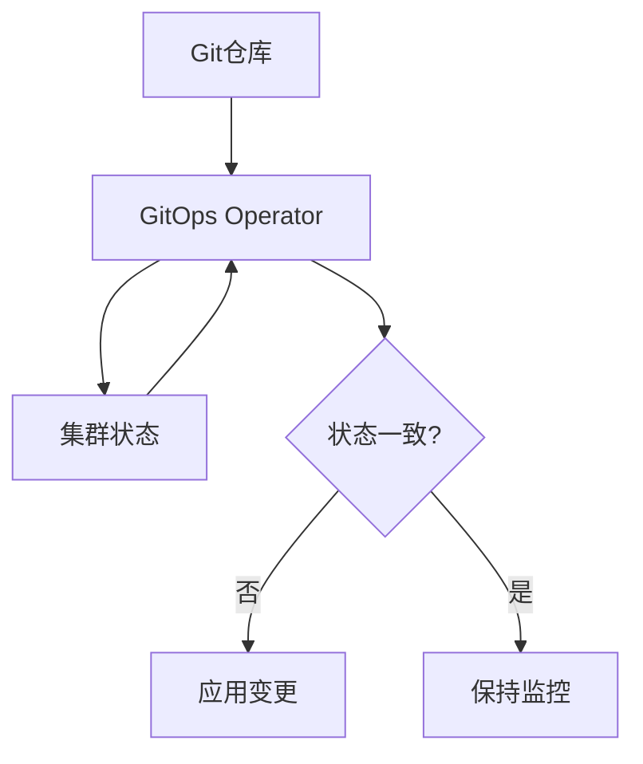

GitOps的核心思想建立在三个基本原则之上：声明式配置、版本控制和自动同步。这三个原则共同构成了GitOps方法论的基石，为现代云原生应用的部署和管理提供了全新的解决方案。理解这些核心概念对于成功实施GitOps至关重要。

## 声明式配置

声明式配置是GitOps的基础，它描述了系统应该处于什么状态，而不是如何达到该状态。这种范式转变带来了显著的优势。

### 声明式与命令式的区别

传统的命令式配置关注于执行一系列操作来达到目标状态：
```bash
# 命令式配置示例
kubectl create deployment nginx-deployment --image=nginx:1.17
kubectl scale deployment nginx-deployment --replicas=3
kubectl expose deployment nginx-deployment --port=80 --type=LoadBalancer
```

而声明式配置则描述期望的最终状态：
```yaml
# 声明式配置示例
apiVersion: apps/v1
kind: Deployment
metadata:
  name: nginx-deployment
spec:
  replicas: 3
  selector:
    matchLabels:
      app: nginx
  template:
    metadata:
      labels:
        app: nginx
    spec:
      containers:
      - name: nginx
        image: nginx:1.17
        ports:
        - containerPort: 80
---
apiVersion: v1
kind: Service
metadata:
  name: nginx-service
spec:
  selector:
    app: nginx
  ports:
    - protocol: TCP
      port: 80
      targetPort: 80
  type: LoadBalancer
```

### 声明式配置的优势

声明式配置带来了多个重要优势：

#### 幂等性
无论执行多少次，结果都是一致的：
```python
#!/usr/bin/env python3
"""
声明式配置幂等性示例
"""

class DeclarativeConfig:
    def __init__(self, desired_state):
        self.desired_state = desired_state
        self.current_state = {}
    
    def apply(self):
        """应用配置，确保系统达到期望状态"""
        # 检查当前状态与期望状态的差异
        diff = self._calculate_diff()
        
        # 只对有差异的部分进行操作
        for change in diff:
            self._apply_change(change)
        
        # 更新当前状态
        self.current_state = self.desired_state.copy()
        
        return "Configuration applied successfully"
    
    def _calculate_diff(self):
        """计算当前状态与期望状态的差异"""
        diff = []
        
        # 比较各个配置项
        for key, value in self.desired_state.items():
            if key not in self.current_state or self.current_state[key] != value:
                diff.append({
                    'key': key,
                    'expected': value,
                    'current': self.current_state.get(key, None)
                })
        
        return diff
    
    def _apply_change(self, change):
        """应用单个变更"""
        print(f"Applying change: {change['key']} = {change['expected']}")
        # 实际的变更应用逻辑
```

#### 可预测性
系统状态完全由配置文件定义，消除了不确定性：
```yaml
# 完全可预测的配置
apiVersion: apps/v1
kind: StatefulSet
metadata:
  name: postgresql
spec:
  serviceName: postgresql
  replicas: 1
  selector:
    matchLabels:
      app: postgresql
  template:
    metadata:
      labels:
        app: postgresql
    spec:
      containers:
      - name: postgresql
        image: postgres:13
        env:
        - name: POSTGRES_PASSWORD
          value: "password123"
        ports:
        - containerPort: 5432
        volumeMounts:
        - name: postgresql-data
          mountPath: /var/lib/postgresql/data
  volumeClaimTemplates:
  - metadata:
      name: postgresql-data
    spec:
      accessModes: [ "ReadWriteOnce" ]
      resources:
        requests:
          storage: 10Gi
```

#### 版本控制友好
配置文件可以被版本化管理，便于追踪变更历史：
```bash
# Git操作示例
git add postgresql-statefulset.yaml
git commit -m "Update PostgreSQL to version 13 with 10Gi storage"
git push origin main
```

### 声明式配置的实现

在实际应用中，声明式配置通过以下方式实现：

#### Kubernetes资源定义
Kubernetes原生支持声明式配置：
```yaml
# Deployment声明式定义
apiVersion: apps/v1
kind: Deployment
metadata:
  name: web-app
spec:
  replicas: 3
  selector:
    matchLabels:
      app: web-app
  template:
    metadata:
      labels:
        app: web-app
    spec:
      containers:
      - name: web-app
        image: my-web-app:1.2.3
        ports:
        - containerPort: 8080
        env:
        - name: ENV
          value: "production"
        resources:
          requests:
            memory: "64Mi"
            cpu: "250m"
          limits:
            memory: "128Mi"
            cpu: "500m"
```

#### Helm Charts
Helm通过模板化方式实现声明式配置：
```yaml
# values.yaml
replicaCount: 3
image:
  repository: my-web-app
  tag: "1.2.3"
  pullPolicy: IfNotPresent

service:
  type: ClusterIP
  port: 8080

resources:
  limits:
    cpu: 500m
    memory: 128Mi
  requests:
    cpu: 250m
    memory: 64Mi
```

```yaml
# templates/deployment.yaml
apiVersion: apps/v1
kind: Deployment
metadata:
  name: {{ include "my-app.fullname" . }}
  labels:
    {{- include "my-app.labels" . | nindent 4 }}
spec:
  replicas: {{ .Values.replicaCount }}
  selector:
    matchLabels:
      {{- include "my-app.selectorLabels" . | nindent 6 }}
  template:
    metadata:
      labels:
        {{- include "my-app.selectorLabels" . | nindent 8 }}
    spec:
      containers:
        - name: {{ .Chart.Name }}
          image: "{{ .Values.image.repository }}:{{ .Values.image.tag }}"
          imagePullPolicy: {{ .Values.image.pullPolicy }}
          ports:
            - name: http
              containerPort: {{ .Values.service.port }}
              protocol: TCP
          resources:
            {{- toYaml .Values.resources | nindent 12 }}
```

## 版本控制

Git作为版本控制系统，为GitOps提供了强大的变更管理和审计能力。在GitOps实践中，Git仓库成为系统状态的单一事实来源。

### Git作为单一事实来源

将所有基础设施和应用配置存储在Git中：
```
infrastructure-repo/
├── kubernetes/
│   ├── namespaces/
│   ├── rbac/
│   ├── monitoring/
│   └── logging/
├── terraform/
│   ├── aws/
│   ├── azure/
│   └── gcp/
├── helm-charts/
│   ├── common/
│   └── applications/
└── scripts/
    ├── deployment/
    └── maintenance/
```

### 分支策略实践

合理的分支策略是GitOps成功的关键：
```bash
# 典型的GitOps分支策略
main/master     # 生产环境配置
staging         # 预发环境配置
development     # 开发环境配置
feature/*       # 功能开发分支
hotfix/*        # 紧急修复分支
```

#### 环境分支管理
```python
#!/usr/bin/env python3
"""
环境分支管理工具
"""

import subprocess
import logging
from typing import List, Dict

class EnvironmentBranchManager:
    def __init__(self, repo_path: str):
        self.repo_path = repo_path
        self.logger = logging.getLogger(__name__)
    
    def create_environment_branch(self, environment: str, base_branch: str = "main") -> bool:
        """创建环境分支"""
        try:
            # 切换到基础分支
            subprocess.run(["git", "checkout", base_branch], cwd=self.repo_path, check=True)
            
            # 创建并切换到环境分支
            subprocess.run(["git", "checkout", "-b", environment], cwd=self.repo_path, check=True)
            
            # 推送新分支到远程仓库
            subprocess.run(["git", "push", "origin", environment], cwd=self.repo_path, check=True)
            
            self.logger.info(f"Environment branch '{environment}' created successfully")
            return True
        except subprocess.CalledProcessError as e:
            self.logger.error(f"Failed to create environment branch '{environment}': {e}")
            return False
    
    def sync_environment_branch(self, source_env: str, target_env: str) -> bool:
        """同步环境分支"""
        try:
            # 切换到源环境分支
            subprocess.run(["git", "checkout", source_env], cwd=self.repo_path, check=True)
            
            # 拉取最新代码
            subprocess.run(["git", "pull", "origin", source_env], cwd=self.repo_path, check=True)
            
            # 切换到目标环境分支
            subprocess.run(["git", "checkout", target_env], cwd=self.repo_path, check=True)
            
            # 合并源环境分支的变更
            subprocess.run(["git", "merge", source_env], cwd=self.repo_path, check=True)
            
            # 推送变更到远程仓库
            subprocess.run(["git", "push", "origin", target_env], cwd=self.repo_path, check=True)
            
            self.logger.info(f"Environment branch '{source_env}' synced to '{target_env}' successfully")
            return True
        except subprocess.CalledProcessError as e:
            self.logger.error(f"Failed to sync environment branches: {e}")
            return False

# 使用示例
# manager = EnvironmentBranchManager("/path/to/infrastructure-repo")
# manager.create_environment_branch("staging")
# manager.sync_environment_branch("development", "staging")
```

### 审计与合规

Git提供的完整历史记录满足了审计和合规要求：

#### 变更追踪
```bash
# 查看配置变更历史
git log --oneline -- kubernetes/deployments/web-app.yaml

# 查看具体变更内容
git show HEAD~3:kubernetes/deployments/web-app.yaml

# 追溯变更责任人
git blame kubernetes/deployments/web-app.yaml
```

#### 合规检查工具
```python
#!/usr/bin/env python3
"""
合规检查工具
"""

import subprocess
import json
from datetime import datetime
from typing import Dict, List

class ComplianceChecker:
    def __init__(self, repo_path: str):
        self.repo_path = repo_path
    
    def generate_compliance_report(self) -> Dict:
        """生成合规报告"""
        report = {
            "generated_at": datetime.now().isoformat(),
            "repository": self.repo_path,
            "commits_analyzed": 0,
            "policy_violations": [],
            "compliance_summary": {}
        }
        
        # 获取提交历史
        commits = self._get_commit_history()
        report["commits_analyzed"] = len(commits)
        
        # 检查每个提交是否符合合规策略
        for commit in commits:
            violations = self._check_commit_compliance(commit)
            report["policy_violations"].extend(violations)
        
        # 生成合规摘要
        report["compliance_summary"] = {
            "total_violations": len(report["policy_violations"]),
            "compliance_rate": 1.0 - (len(report["policy_violations"]) / len(commits)) if commits else 1.0
        }
        
        return report
    
    def _get_commit_history(self) -> List[Dict]:
        """获取提交历史"""
        cmd = ["git", "log", "--pretty=format:{\"commit\":\"%H\",\"author\":\"%an\",\"email\":\"%ae\",\"date\":\"%ad\",\"message\":\"%s\"}", "--date=iso"]
        result = subprocess.run(cmd, cwd=self.repo_path, capture_output=True, text=True)
        
        if result.returncode == 0:
            commits = []
            for line in result.stdout.strip().split('\n'):
                if line:
                    try:
                        commit_data = json.loads(line)
                        commits.append(commit_data)
                    except json.JSONDecodeError:
                        continue
            return commits
        else:
            raise Exception(f"Failed to get commit history: {result.stderr}")
    
    def _check_commit_compliance(self, commit: Dict) -> List[Dict]:
        """检查提交合规性"""
        violations = []
        
        # 检查提交消息是否符合规范
        if not self._is_valid_commit_message(commit["message"]):
            violations.append({
                "commit": commit["commit"],
                "violation_type": "invalid_commit_message",
                "description": "Commit message does not follow conventional format",
                "author": commit["author"],
                "date": commit["date"]
            })
        
        # 检查是否包含敏感信息
        if self._contains_sensitive_info(commit["message"]):
            violations.append({
                "commit": commit["commit"],
                "violation_type": "sensitive_info",
                "description": "Commit message contains sensitive information",
                "author": commit["author"],
                "date": commit["date"]
            })
        
        return violations
    
    def _is_valid_commit_message(self, message: str) -> bool:
        """检查提交消息是否符合规范"""
        # 简单的规范检查：消息应该以类型开头，如 feat:, fix:, chore: 等
        valid_types = ["feat:", "fix:", "chore:", "docs:", "style:", "refactor:", "test:", "perf:"]
        return any(message.startswith(t) for t in valid_types)
    
    def _contains_sensitive_info(self, message: str) -> bool:
        """检查是否包含敏感信息"""
        # 简单的敏感信息检查
        sensitive_patterns = ["password", "secret", "key", "token"]
        message_lower = message.lower()
        return any(pattern in message_lower for pattern in sensitive_patterns)
```

## 自动同步

自动同步机制确保系统状态与Git仓库中的配置保持一致，这是GitOps区别于传统部署方式的关键特性。

### 持续协调机制

GitOps工具持续监控Git仓库和系统状态，确保两者保持一致：

#### 状态监控循环


#### 同步控制器实现
```python
#!/usr/bin/env python3
"""
同步控制器示例
"""

import time
import yaml
import subprocess
import logging
from typing import Dict, Any, List
from dataclasses import dataclass

@dataclass
class ResourceState:
    name: str
    kind: str
    namespace: str
    config: Dict[Any, Any]
    last_synced: float

class SyncController:
    def __init__(self, git_repo: str, cluster_context: str):
        self.git_repo = git_repo
        self.cluster_context = cluster_context
        self.desired_state: Dict[str, ResourceState] = {}
        self.current_state: Dict[str, ResourceState] = {}
        self.logger = logging.getLogger(__name__)
    
    def start_sync_loop(self, interval: int = 30):
        """启动同步循环"""
        self.logger.info("Starting sync controller loop")
        
        while True:
            try:
                # 1. 获取期望状态（从Git仓库）
                self._refresh_desired_state()
                
                # 2. 获取当前状态（从集群）
                self._refresh_current_state()
                
                # 3. 计算差异
                diff = self._calculate_diff()
                
                # 4. 应用变更
                if diff:
                    self._apply_changes(diff)
                
                # 5. 等待下次循环
                time.sleep(interval)
                
            except Exception as e:
                self.logger.error(f"Error in sync loop: {e}")
                time.sleep(interval)
    
    def _refresh_desired_state(self):
        """刷新期望状态"""
        # 模拟从Git仓库获取配置
        # 实际实现中会克隆Git仓库并解析YAML文件
        self.logger.info("Refreshing desired state from Git repository")
        
        # 示例：解析一个Deployment配置
        sample_deployment = {
            "apiVersion": "apps/v1",
            "kind": "Deployment",
            "metadata": {
                "name": "web-app",
                "namespace": "default"
            },
            "spec": {
                "replicas": 3,
                "selector": {
                    "matchLabels": {
                        "app": "web-app"
                    }
                },
                "template": {
                    "metadata": {
                        "labels": {
                            "app": "web-app"
                        }
                    },
                    "spec": {
                        "containers": [
                            {
                                "name": "web-app",
                                "image": "my-web-app:1.2.3",
                                "ports": [
                                    {
                                        "containerPort": 8080
                                    }
                                ]
                            }
                        ]
                    }
                }
            }
        }
        
        resource_key = f"Deployment/web-app/default"
        self.desired_state[resource_key] = ResourceState(
            name="web-app",
            kind="Deployment",
            namespace="default",
            config=sample_deployment,
            last_synced=time.time()
        )
    
    def _refresh_current_state(self):
        """刷新当前状态"""
        self.logger.info("Refreshing current state from cluster")
        
        # 示例：通过kubectl获取当前Deployment状态
        try:
            cmd = ["kubectl", "get", "deployment", "web-app", "-n", "default", "-o", "yaml"]
            result = subprocess.run(cmd, capture_output=True, text=True, check=True)
            
            current_config = yaml.safe_load(result.stdout)
            
            resource_key = f"Deployment/web-app/default"
            self.current_state[resource_key] = ResourceState(
                name="web-app",
                kind="Deployment",
                namespace="default",
                config=current_config,
                last_synced=time.time()
            )
        except subprocess.CalledProcessError as e:
            self.logger.warning(f"Failed to get current state: {e}")
    
    def _calculate_diff(self) -> List[Dict[str, Any]]:
        """计算期望状态与当前状态的差异"""
        diff = []
        
        for resource_key, desired_resource in self.desired_state.items():
            if resource_key not in self.current_state:
                # 资源不存在，需要创建
                diff.append({
                    "action": "create",
                    "resource": desired_resource
                })
            else:
                # 资源存在，检查配置是否一致
                current_resource = self.current_state[resource_key]
                if not self._configs_equal(desired_resource.config, current_resource.config):
                    diff.append({
                        "action": "update",
                        "resource": desired_resource,
                        "current_config": current_resource.config
                    })
        
        # 检查是否有需要删除的资源
        for resource_key, current_resource in self.current_state.items():
            if resource_key not in self.desired_state:
                diff.append({
                    "action": "delete",
                    "resource": current_resource
                })
        
        return diff
    
    def _configs_equal(self, config1: Dict, config2: Dict) -> bool:
        """比较两个配置是否相等"""
        # 简化的配置比较实现
        # 实际应用中需要更复杂的比较逻辑，忽略元数据等字段
        
        # 忽略一些动态字段
        ignore_fields = ["metadata.resourceVersion", "metadata.uid", "metadata.creationTimestamp"]
        
        def remove_ignored_fields(config, ignore_paths):
            # 简化的实现，实际应用中需要递归处理
            if "metadata" in config:
                metadata = config["metadata"]
                for field in ["resourceVersion", "uid", "creationTimestamp"]:
                    metadata.pop(field, None)
            return config
        
        clean_config1 = remove_ignored_fields(config1.copy(), ignore_fields)
        clean_config2 = remove_ignored_fields(config2.copy(), ignore_fields)
        
        return yaml.dump(clean_config1, sort_keys=True) == yaml.dump(clean_config2, sort_keys=True)
    
    def _apply_changes(self, diff: List[Dict[str, Any]]):
        """应用变更"""
        for change in diff:
            action = change["action"]
            resource = change["resource"]
            
            if action == "create":
                self._create_resource(resource)
            elif action == "update":
                self._update_resource(resource)
            elif action == "delete":
                self._delete_resource(resource)
    
    def _create_resource(self, resource: ResourceState):
        """创建资源"""
        self.logger.info(f"Creating resource: {resource.kind}/{resource.name}")
        # 实际实现中会使用kubectl apply或其他方式创建资源
        
    def _update_resource(self, resource: ResourceState):
        """更新资源"""
        self.logger.info(f"Updating resource: {resource.kind}/{resource.name}")
        # 实际实现中会使用kubectl apply或其他方式更新资源
        
    def _delete_resource(self, resource: ResourceState):
        """删除资源"""
        self.logger.info(f"Deleting resource: {resource.kind}/{resource.name}")
        # 实际实现中会使用kubectl delete或其他方式删除资源
```

### 漂移检测与纠正

自动同步机制能够检测并纠正配置漂移：

#### 漂移检测实现
```python
#!/usr/bin/env python3
"""
配置漂移检测示例
"""

import yaml
import subprocess
from typing import Dict, Any, List
import logging

class DriftDetector:
    def __init__(self, git_repo: str, cluster_config: str):
        self.git_repo = git_repo
        self.cluster_config = cluster_config
        self.logger = logging.getLogger(__name__)
    
    def detect_drift(self) -> Dict[str, Any]:
        """检测配置漂移"""
        # 获取Git中的期望状态
        git_state = self._get_git_state()
        
        # 获取集群中的实际状态
        cluster_state = self._get_cluster_state()
        
        # 对比差异
        differences = self._compare_states(git_state, cluster_state)
        
        return {
            'drift_detected': len(differences) > 0,
            'differences': differences,
            'timestamp': self._get_current_timestamp()
        }
    
    def _get_git_state(self) -> Dict[str, Any]:
        """获取Git中的配置状态"""
        # 这里简化实现，实际应用中需要解析Git仓库中的配置文件
        return {
            'deployment_replicas': 3,
            'image_version': 'nginx:1.21',
            'resources': {
                'requests': {'cpu': '100m', 'memory': '128Mi'},
                'limits': {'cpu': '200m', 'memory': '256Mi'}
            }
        }
    
    def _get_cluster_state(self) -> Dict[str, Any]:
        """获取集群中的实际状态"""
        # 通过kubectl获取实际状态
        cmd = ['kubectl', 'get', 'deployment', 'nginx-deployment', '-o', 'yaml']
        result = subprocess.run(cmd, capture_output=True, text=True)
        
        if result.returncode == 0:
            deployment = yaml.safe_load(result.stdout)
            return {
                'deployment_replicas': deployment.get('spec', {}).get('replicas', 0),
                'image_version': deployment.get('spec', {}).get('template', {}).get('spec', {}).get('containers', [{}])[0].get('image', ''),
                'resources': deployment.get('spec', {}).get('template', {}).get('spec', {}).get('containers', [{}])[0].get('resources', {})
            }
        else:
            raise Exception(f"Failed to get cluster state: {result.stderr}")
    
    def _compare_states(self, git_state: Dict[str, Any], cluster_state: Dict[str, Any]) -> List[Dict[str, Any]]:
        """对比期望状态和实际状态"""
        differences = []
        
        # 对比副本数
        if git_state['deployment_replicas'] != cluster_state['deployment_replicas']:
            differences.append({
                'field': 'deployment_replicas',
                'expected': git_state['deployment_replicas'],
                'actual': cluster_state['deployment_replicas']
            })
        
        # 对比镜像版本
        if git_state['image_version'] != cluster_state['image_version']:
            differences.append({
                'field': 'image_version',
                'expected': git_state['image_version'],
                'actual': cluster_state['image_version']
            })
        
        # 对比资源限制
        git_resources = git_state.get('resources', {})
        cluster_resources = cluster_state.get('resources', {})
        
        for resource_type in ['requests', 'limits']:
            git_res = git_resources.get(resource_type, {})
            cluster_res = cluster_resources.get(resource_type, {})
            
            for resource_name in ['cpu', 'memory']:
                if git_res.get(resource_name) != cluster_res.get(resource_name):
                    differences.append({
                        'field': f'resources.{resource_type}.{resource_name}',
                        'expected': git_res.get(resource_name),
                        'actual': cluster_res.get(resource_name)
                    })
        
        return differences
    
    def _get_current_timestamp(self) -> str:
        """获取当前时间戳"""
        from datetime import datetime
        return datetime.now().isoformat()
```

### 自动同步的安全考虑

在实现自动同步时，需要考虑安全性：

#### 访问控制
```yaml
# Kubernetes RBAC配置示例
apiVersion: v1
kind: ServiceAccount
metadata:
  name: gitops-operator
  namespace: argocd
---
apiVersion: rbac.authorization.k8s.io/v1
kind: ClusterRole
metadata:
  name: gitops-operator-role
rules:
- apiGroups: [""]
  resources: ["pods", "services", "configmaps", "secrets"]
  verbs: ["get", "list", "watch", "create", "update", "patch", "delete"]
- apiGroups: ["apps"]
  resources: ["deployments", "statefulsets", "daemonsets"]
  verbs: ["get", "list", "watch", "create", "update", "patch", "delete"]
---
apiVersion: rbac.authorization.k8s.io/v1
kind: ClusterRoleBinding
metadata:
  name: gitops-operator-binding
subjects:
- kind: ServiceAccount
  name: gitops-operator
  namespace: argocd
roleRef:
  kind: ClusterRole
  name: gitops-operator-role
  apiGroup: rbac.authorization.k8s.io
```

通过深入理解GitOps的三个核心思想——声明式配置、版本控制和自动同步，我们可以更好地实施GitOps实践。这些原则不仅提供了技术实现的指导，更重要的是它们改变了我们对系统管理和应用部署的认知方式，使我们的系统更加可靠、可预测和可审计。