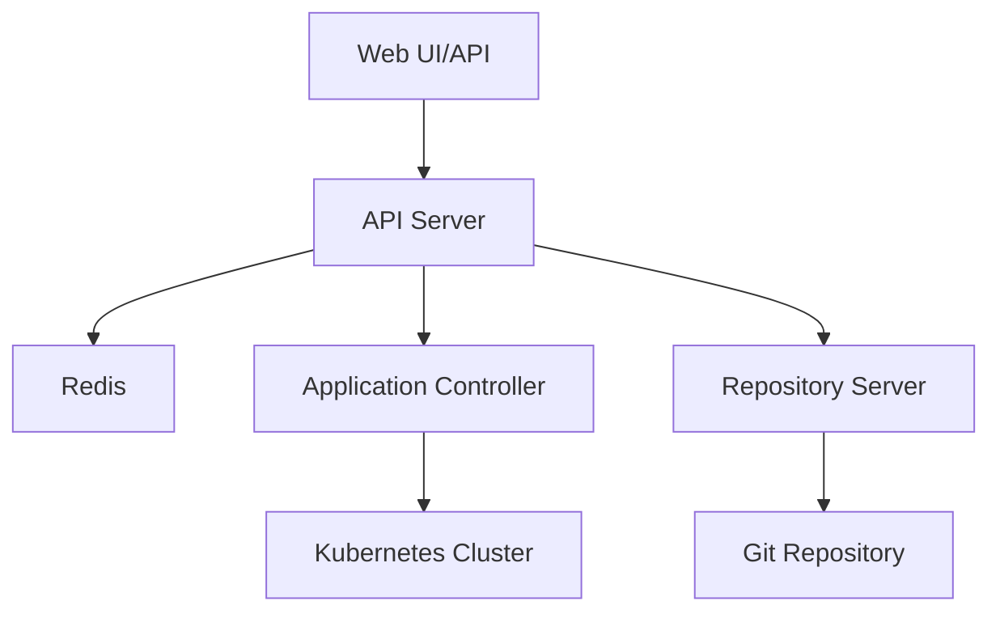
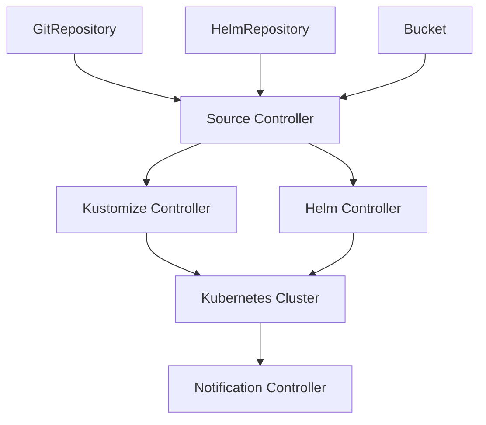

在GitOps实践中，Argo CD和Flux CD是两个最主流的实现工具。它们都提供了完整的GitOps解决方案，但在设计理念和功能特性上各有特色。本文将深入探讨这两种工具的架构、配置方式、使用场景以及在企业环境中的最佳实践，帮助读者选择合适的GitOps工具并成功实施。

## Argo CD详解

Argo CD是CNCF孵化项目，专为Kubernetes设计的GitOps持续交付工具。它通过声明式的方式管理Kubernetes应用和集群资源，确保集群状态与Git仓库中的配置保持一致。

### Argo CD架构

Argo CD采用微服务架构，由多个核心组件构成：

#### 核心组件

1. **API Server**：提供REST/gRPC API和Web UI
2. **Repository Server**：访问Git仓库并生成Kubernetes清单
3. **Application Controller**：监控应用状态并执行同步
4. **Redis**：作为缓存存储



#### 组件交互流程
```python
#!/usr/bin/env python3
"""
Argo CD组件交互模拟
"""

import asyncio
import logging
from typing import Dict, Any
from dataclasses import dataclass

@dataclass
class Application:
    name: str
    repo_url: str
    target_revision: str
    path: str
    destination_server: str
    destination_namespace: str
    sync_status: str = "Unknown"
    health_status: str = "Unknown"

class ArgoCDComponents:
    def __init__(self):
        self.logger = logging.getLogger(__name__)
        self.applications: Dict[str, Application] = {}
    
    async def api_server_handle_request(self, request: Dict[str, Any]) -> Dict[str, Any]:
        """API Server处理请求"""
        self.logger.info(f"API Server handling request: {request['type']}")
        
        if request["type"] == "get_application":
            return await self._get_application(request["name"])
        elif request["type"] == "sync_application":
            return await self._sync_application(request["name"])
        elif request["type"] == "create_application":
            return await self._create_application(request["application"])
        
        return {"status": "error", "message": "Unknown request type"}
    
    async def repository_server_fetch_manifests(self, app: Application) -> Dict[str, Any]:
        """Repository Server获取清单"""
        self.logger.info(f"Repository Server fetching manifests for {app.name}")
        
        # 模拟从Git仓库获取清单
        await asyncio.sleep(1)  # 模拟网络延迟
        
        # 返回模拟的Kubernetes清单
        return {
            "manifests": [
                {
                    "apiVersion": "apps/v1",
                    "kind": "Deployment",
                    "metadata": {
                        "name": app.name,
                        "namespace": app.destination_namespace
                    },
                    "spec": {
                        "replicas": 3,
                        "selector": {
                            "matchLabels": {"app": app.name}
                        },
                        "template": {
                            "metadata": {
                                "labels": {"app": app.name}
                            },
                            "spec": {
                                "containers": [
                                    {
                                        "name": app.name,
                                        "image": f"{app.name}:latest"
                                    }
                                ]
                            }
                        }
                    }
                }
            ]
        }
    
    async def application_controller_monitor_state(self, app: Application) -> Dict[str, Any]:
        """Application Controller监控状态"""
        self.logger.info(f"Application Controller monitoring {app.name}")
        
        # 模拟获取集群状态
        await asyncio.sleep(0.5)
        
        # 模拟状态检查结果
        return {
            "sync_status": "Synced",
            "health_status": "Healthy",
            "resources": [
                {
                    "kind": "Deployment",
                    "name": app.name,
                    "status": "Synced",
                    "health": "Healthy"
                }
            ]
        }
    
    async def _get_application(self, name: str) -> Dict[str, Any]:
        """获取应用信息"""
        if name in self.applications:
            return {"status": "success", "application": self.applications[name]}
        else:
            return {"status": "error", "message": f"Application {name} not found"}
    
    async def _sync_application(self, name: str) -> Dict[str, Any]:
        """同步应用"""
        if name not in self.applications:
            return {"status": "error", "message": f"Application {name} not found"}
        
        app = self.applications[name]
        self.logger.info(f"Syncing application {name}")
        
        # 获取清单
        manifests = await self.repository_server_fetch_manifests(app)
        
        # 模拟应用清单到集群
        await asyncio.sleep(2)
        
        # 更新应用状态
        app.sync_status = "Synced"
        app.health_status = "Healthy"
        
        return {"status": "success", "message": f"Application {name} synced successfully"}
    
    async def _create_application(self, app_config: Dict[str, Any]) -> Dict[str, Any]:
        """创建应用"""
        app = Application(
            name=app_config["name"],
            repo_url=app_config["repo_url"],
            target_revision=app_config["target_revision"],
            path=app_config["path"],
            destination_server=app_config["destination"]["server"],
            destination_namespace=app_config["destination"]["namespace"]
        )
        
        self.applications[app.name] = app
        self.logger.info(f"Application {app.name} created")
        
        return {"status": "success", "application": app}

# 使用示例
# argo_cd = ArgoCDComponents()
# app_config = {
#     "name": "guestbook",
#     "repo_url": "https://github.com/argoproj/argocd-example-apps.git",
#     "target_revision": "HEAD",
#     "path": "guestbook",
#     "destination": {
#         "server": "https://kubernetes.default.svc",
#         "namespace": "guestbook"
#     }
# }
# result = await argo_cd.api_server_handle_request({
#     "type": "create_application",
#     "application": app_config
# })
```

### Argo CD应用定义

通过Application资源定义GitOps应用：

#### 基础应用配置
```yaml
apiVersion: argoproj.io/v1alpha1
kind: Application
metadata:
  name: guestbook
  namespace: argocd
spec:
  project: default
  source:
    repoURL: https://github.com/argoproj/argocd-example-apps.git
    targetRevision: HEAD
    path: guestbook
  destination:
    server: https://kubernetes.default.svc
    namespace: guestbook
  syncPolicy:
    automated:
      prune: true
      selfHeal: true
```

#### 高级同步策略
```yaml
apiVersion: argoproj.io/v1alpha1
kind: Application
metadata:
  name: advanced-app
  namespace: argocd
spec:
  project: default
  source:
    repoURL: https://github.com/example/advanced-app.git
    targetRevision: HEAD
    path: k8s/overlays/production
    kustomize:
      namePrefix: production-
      commonLabels:
        environment: production
      images:
        - gcr.io/heptio-images/ks-guestbook-demo:0.2
  destination:
    server: https://kubernetes.default.svc
    namespace: production
  syncPolicy:
    automated:
      prune: true
      selfHeal: true
      allowEmpty: false
    syncOptions:
      - CreateNamespace=true
      - PrunePropagationPolicy=foreground
      - PruneLast=true
    retry:
      limit: 5
      backoff:
        duration: 5s
        factor: 2
        maxDuration: 3m
```

### Argo CD最佳实践

在企业环境中使用Argo CD需要遵循一系列最佳实践：

#### 项目管理
```yaml
apiVersion: argoproj.io/v1alpha1
kind: AppProject
metadata:
  name: production
  namespace: argocd
spec:
  description: Production project
  sourceRepos:
  - 'https://github.com/example/production-apps.git'
  destinations:
  - server: https://kubernetes.default.svc
    namespace: production
  clusterResourceWhitelist:
  - group: ''
    kind: Namespace
  namespaceResourceBlacklist:
  - group: ''
    kind: ResourceQuota
  roles:
  - name: app-developer
    description: Read-only access to production apps
    policies:
    - p, proj:production:app-developer, applications, get, production/*, allow
    groups:
    - production-app-developers
```

#### 多集群管理
```yaml
apiVersion: argoproj.io/v1alpha1
kind: Application
metadata:
  name: multi-cluster-app
  namespace: argocd
spec:
  project: default
  source:
    repoURL: https://github.com/example/multi-cluster-app.git
    targetRevision: HEAD
    path: k8s/base
  destination:
    name: production-cluster  # 使用集群名称而不是服务器URL
    namespace: default
  syncPolicy:
    automated:
      prune: true
      selfHeal: true
---
apiVersion: v1
kind: Secret
metadata:
  name: production-cluster
  namespace: argocd
  labels:
    argocd.argoproj.io/secret-type: cluster
type: Opaque
stringData:
  name: production-cluster
  server: https://production-cluster.example.com:6443
  config: |
    {
      "bearerToken": "<authentication token>",
      "tlsClientConfig": {
        "insecure": false,
        "caData": "<base64 encoded certificate>"
      }
    }
```

## Flux CD详解

Flux CD是另一个流行的GitOps工具，由Weaveworks开发。它采用操作符模式，通过Kubernetes原生的控制器来实现GitOps。

### Flux CD架构

Flux CD采用模块化架构，由多个专门的操作符组成：

#### 核心组件

1. **Source Controller**：获取和更新配置源
2. **Kustomize Controller**：应用Kustomize配置
3. **Helm Controller**：管理Helm发布
4. **Notification Controller**：处理事件通知
5. **Image Automation Controller**：自动化镜像更新



### Flux CD资源配置

Flux CD通过自定义资源定义(CRD)来配置GitOps流程：

#### GitRepository资源
```yaml
apiVersion: source.toolkit.fluxcd.io/v1beta1
kind: GitRepository
metadata:
  name: podinfo
  namespace: flux-system
spec:
  interval: 1m
  url: https://github.com/stefanprodan/podinfo
  ref:
    branch: master
  secretRef:
    name: https-credentials
  ignore: |
    # exclude all
    /*
    # include deploy dir
    !/deploy
```

#### Kustomization资源
```yaml
apiVersion: kustomize.toolkit.fluxcd.io/v1beta1
kind: Kustomization
metadata:
  name: podinfo
  namespace: flux-system
spec:
  interval: 10m
  path: "./deploy/webapp/"
  prune: true
  sourceRef:
    kind: GitRepository
    name: podinfo
  healthChecks:
    - apiVersion: apps/v1
      kind: Deployment
      name: podinfo
      namespace: default
  timeout: 2m
```

#### HelmRelease资源
```yaml
apiVersion: helm.toolkit.fluxcd.io/v2beta1
kind: HelmRelease
metadata:
  name: podinfo
  namespace: default
spec:
  interval: 5m
  chart:
    spec:
      chart: podinfo
      version: "6.0.x"
      sourceRef:
        kind: HelmRepository
        name: podinfo
        namespace: flux-system
  values:
    replicaCount: 2
    image:
      repository: stefanprodan/podinfo
      tag: 6.0.0
  valuesFrom:
    - kind: ConfigMap
      name: podinfo-values
  install:
    remediation:
      retries: 3
  upgrade:
    remediation:
      retries: 3
      remediateLastFailure: true
```

### Flux CD高级特性

Flux CD提供了一些高级特性来满足复杂场景需求：

#### 镜像更新自动化
```yaml
apiVersion: image.toolkit.fluxcd.io/v1beta1
kind: ImageRepository
metadata:
  name: podinfo
  namespace: flux-system
spec:
  image: stefanprodan/podinfo
  interval: 1m
---
apiVersion: image.toolkit.fluxcd.io/v1beta1
kind: ImagePolicy
metadata:
  name: podinfo
  namespace: flux-system
spec:
  imageRepositoryRef:
    name: podinfo
  policy:
    semver:
      range: 6.0.x
---
apiVersion: image.toolkit.fluxcd.io/v1beta1
kind: ImageUpdateAutomation
metadata:
  name: flux-system
  namespace: flux-system
spec:
  interval: 1m
  sourceRef:
    kind: GitRepository
    name: flux-system
  git:
    checkout:
      ref:
        branch: main
    commit:
      author:
        email: fluxcdbot@users.noreply.github.com
        name: fluxcdbot
      messageTemplate: |
        Automated image update by FluxCD
        
        Automation name: {{ .AutomationObject }}
        Image tag: {{ .Image.Tag }}
        Image digest: {{ .Image.Digest }}
        Updated manifests:
        {{ range .Updated.Files -}}
        - {{ . }}
        {{ end -}}
    push:
      branch: main
  update:
    strategy: Setters
    path: ./clusters/my-cluster
```

#### 多租户配置
```yaml
apiVersion: v1
kind: Namespace
metadata:
  name: tenant-a
---
apiVersion: v1
kind: ServiceAccount
metadata:
  name: flux-tenant-a
  namespace: tenant-a
---
apiVersion: rbac.authorization.k8s.io/v1
kind: Role
metadata:
  name: flux-tenant-a-role
  namespace: tenant-a
rules:
- apiGroups: [""]
  resources: ["*"]
  verbs: ["*"]
- apiGroups: ["apps"]
  resources: ["*"]
  verbs: ["*"]
---
apiVersion: rbac.authorization.k8s.io/v1
kind: RoleBinding
metadata:
  name: flux-tenant-a-rolebinding
  namespace: tenant-a
subjects:
- kind: ServiceAccount
  name: flux-tenant-a
  namespace: tenant-a
roleRef:
  kind: Role
  name: flux-tenant-a-role
  apiGroup: rbac.authorization.k8s.io
```

## Argo CD vs Flux CD对比

在选择GitOps工具时，需要根据具体需求进行对比：

### 功能特性对比

| 特性 | Argo CD | Flux CD |
|------|---------|---------|
| Web UI | 强大直观 | 基础功能 |
| 多集群支持 | 优秀 | 良好 |
| Helm支持 | 内置支持 | 专用控制器 |
| Kustomize支持 | 内置支持 | 专用控制器 |
| 镜像更新自动化 | 第三方集成 | 原生支持 |
| 通知系统 | 内置支持 | 专用控制器 |
| 学习曲线 | 中等 | 较陡峭 |
| 社区活跃度 | 非常活跃 | 活跃 |

### 使用场景对比

#### 选择Argo CD的场景
```python
#!/usr/bin/env python3
"""
Argo CD适用场景判断
"""

class ArgoCDUseCaseEvaluator:
    def __init__(self, requirements: dict):
        self.requirements = requirements
    
    def evaluate(self) -> dict:
        """评估是否适合使用Argo CD"""
        score = 0
        reasons = []
        
        # Web UI需求
        if self.requirements.get("web_ui", False):
            score += 20
            reasons.append("需要直观的Web界面进行操作和监控")
        
        # 多集群管理
        if self.requirements.get("multi_cluster", False):
            score += 15
            reasons.append("需要管理多个Kubernetes集群")
        
        # 团队规模
        team_size = self.requirements.get("team_size", 1)
        if team_size > 10:
            score += 10
            reasons.append("团队规模较大，需要更好的协作工具")
        
        # 现有工具栈
        existing_tools = self.requirements.get("existing_tools", [])
        if "helm" in existing_tools:
            score += 10
            reasons.append("已经在使用Helm，Argo CD对Helm支持良好")
        
        # 合规要求
        if self.requirements.get("compliance", False):
            score += 15
            reasons.append("有严格的合规和审计要求")
        
        # 运维经验
        ops_experience = self.requirements.get("ops_experience", "low")
        if ops_experience in ["low", "medium"]:
            score += 10
            reasons.append("运维经验相对较少，Argo CD学习曲线较为平缓")
        
        return {
            "recommended": score >= 50,
            "score": score,
            "reasons": reasons,
            "confidence": "high" if score >= 70 else "medium" if score >= 30 else "low"
        }

# 使用示例
# evaluator = ArgoCDUseCaseEvaluator({
#     "web_ui": True,
#     "multi_cluster": True,
#     "team_size": 15,
#     "existing_tools": ["helm", "kustomize"],
#     "compliance": True,
#     "ops_experience": "medium"
# })
# result = evaluator.evaluate()
# print(f"推荐使用Argo CD: {result['recommended']}")
```

#### 选择Flux CD的场景
```python
#!/usr/bin/env python3
"""
Flux CD适用场景判断
"""

class FluxCDUseCaseEvaluator:
    def __init__(self, requirements: dict):
        self.requirements = requirements
    
    def evaluate(self) -> dict:
        """评估是否适合使用Flux CD"""
        score = 0
        reasons = []
        
        # GitOps理念认同
        if self.requirements.get("gitops_purist", False):
            score += 20
            reasons.append("认同纯GitOps理念，希望完全基于Git和Kubernetes API")
        
        # 自动化需求
        if self.requirements.get("automation", False):
            score += 15
            reasons.append("需要强大的自动化能力，特别是镜像更新自动化")
        
        # 基础设施即代码
        if self.requirements.get("iac", False):
            score += 10
            reasons.append("重视基础设施即代码实践")
        
        # 技术栈匹配
        tech_stack = self.requirements.get("tech_stack", [])
        if "kustomize" in tech_stack:
            score += 10
            reasons.append("技术栈中包含Kustomize，Flux CD原生支持")
        
        # 平台工程
        if self.requirements.get("platform_engineering", False):
            score += 15
            reasons.append("正在进行平台工程建设，需要高度可扩展的工具")
        
        # 运维经验
        ops_experience = self.requirements.get("ops_experience", "low")
        if ops_experience in ["high", "expert"]:
            score += 10
            reasons.append("运维团队经验丰富，能够处理复杂的配置")
        
        return {
            "recommended": score >= 50,
            "score": score,
            "reasons": reasons,
            "confidence": "high" if score >= 70 else "medium" if score >= 30 else "low"
        }

# 使用示例
# evaluator = FluxCDUseCaseEvaluator({
#     "gitops_purist": True,
#     "automation": True,
#     "iac": True,
#     "tech_stack": ["kustomize", "helm"],
#     "platform_engineering": True,
#     "ops_experience": "high"
# })
# result = evaluator.evaluate()
# print(f"推荐使用Flux CD: {result['recommended']}")
```

## 企业级GitOps实施

在企业环境中实施GitOps需要考虑多个方面：

### 安全最佳实践

#### 密钥管理
```yaml
# 使用Sealed Secrets管理敏感信息
apiVersion: bitnami.com/v1alpha1
kind: SealedSecret
metadata:
  name: database-credentials
  namespace: production
spec:
  encryptedData:
    username: AgBy3i4OJSWK+PiTySYZZA9rO43cGDEq.....
    password: AgBy3i4OJSWK+PiTySYZZZZZZZZZZZZZ.....
  template:
    metadata:
      name: database-credentials
      namespace: production
    type: Opaque
```

#### 网络策略
```yaml
# 限制Argo CD的网络访问
apiVersion: networking.k8s.io/v1
kind: NetworkPolicy
metadata:
  name: argocd-server-ingress
  namespace: argocd
spec:
  podSelector:
    matchLabels:
      app.kubernetes.io/name: argocd-server
  policyTypes:
  - Ingress
  ingress:
  - from:
    - ipBlock:
        cidr: 10.0.0.0/8  # 仅允许内部网络访问
    ports:
    - protocol: TCP
      port: 8080
```

### 监控与告警

#### Prometheus监控配置
```yaml
apiVersion: monitoring.coreos.com/v1
kind: ServiceMonitor
metadata:
  name: argocd-metrics
  namespace: argocd
spec:
  selector:
    matchLabels:
      app.kubernetes.io/name: argocd-metrics
  endpoints:
  - port: metrics
```

#### 告警规则
```yaml
# Prometheus告警规则
groups:
- name: gitops.rules
  rules:
  - alert: ApplicationOutOfSync
    expr: argocd_app_info{sync_status="OutOfSync"} > 0
    for: 5m
    labels:
      severity: warning
    annotations:
      summary: "Application {{ $labels.name }} is out of sync"
      description: "Application {{ $labels.name }} in namespace {{ $labels.namespace }} is out of sync for more than 5 minutes"
  
  - alert: ApplicationUnhealthy
    expr: argocd_app_info{health_status="Degraded"} > 0
    for: 2m
    labels:
      severity: critical
    annotations:
      summary: "Application {{ $labels.name }} is unhealthy"
      description: "Application {{ $labels.name }} in namespace {{ $labels.namespace }} is in degraded state"
```

### 灾难恢复

#### 备份策略
```bash
#!/bin/bash
# GitOps配置备份脚本

BACKUP_DIR="/backup/gitops"
DATE=$(date +%Y%m%d-%H%M%S)

# 备份Argo CD配置
kubectl get applications -A -o yaml > ${BACKUP_DIR}/applications-${DATE}.yaml
kubectl get appprojects -A -o yaml > ${BACKUP_DIR}/appprojects-${DATE}.yaml
kubectl get secrets -n argocd -l argocd.argoproj.io/secret-type=cluster -o yaml > ${BACKUP_DIR}/clusters-${DATE}.yaml

# 备份Flux CD配置
kubectl get gitrepositories,kustomizations,helmreleases -A -o yaml > ${BACKUP_DIR}/flux-resources-${DATE}.yaml

# 备份Git仓库
git clone --mirror https://github.com/example/production-config.git ${BACKUP_DIR}/production-config-${DATE}.git

echo "Backup completed at ${DATE}"
```

通过深入了解Argo CD和Flux CD的架构、配置方式和最佳实践，我们可以根据具体需求选择合适的GitOps工具。两种工具各有优势，Argo CD提供了更直观的Web界面和更简单的入门体验，而Flux CD则更符合纯GitOps理念并提供了更强的自动化能力。在企业环境中实施GitOps时，还需要考虑安全、监控、备份等多方面因素，确保系统的稳定性和可靠性。