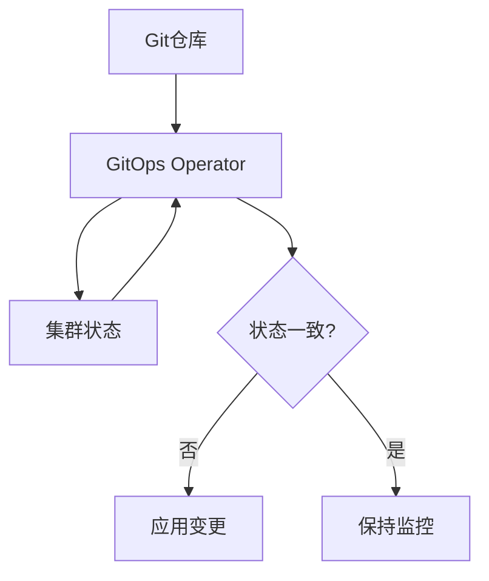

GitOps作为一种现代的DevOps实践方法，正在改变我们管理和部署应用程序的方式。它将Git作为系统状态的事实来源，通过声明式配置和自动化同步机制，实现了基础设施和应用程序部署的版本化、可追溯和可重复。GitOps不仅提升了部署的可靠性，还增强了系统的安全性和合规性。本文将深入探讨GitOps的核心思想、实现方式以及在企业环境中的应用实践。

## GitOps的核心思想

GitOps的核心思想建立在三个基础原则上：声明式、版本控制和自动同步。这些原则共同构成了GitOps方法论的基石。

### 1. 声明式配置

声明式配置是GitOps的基础，它描述了系统应该处于什么状态，而不是如何达到该状态。

#### 状态描述而非过程描述
声明式配置关注的是最终状态：
```yaml
# 声明式配置示例 - Kubernetes Deployment
apiVersion: apps/v1
kind: Deployment
metadata:
  name: nginx-deployment
spec:
  replicas: 3
  selector:
    matchLabels:
      app: nginx
  template:
    metadata:
      labels:
        app: nginx
    spec:
      containers:
      - name: nginx
        image: nginx:1.21
        ports:
        - containerPort: 80
```

这种方式与命令式配置形成鲜明对比：
```bash
# 命令式配置示例
kubectl create deployment nginx-deployment --image=nginx:1.21
kubectl scale deployment nginx-deployment --replicas=3
```

#### 声明式的优势
声明式配置带来了多个重要优势：
- **幂等性**：无论执行多少次，结果都是一致的
- **可预测性**：系统状态完全由配置文件定义
- **版本控制**：配置文件可以被版本化管理
- **可审计性**：所有变更都有明确的记录

### 2. 版本控制

Git作为版本控制系统，为GitOps提供了强大的变更管理和审计能力。

#### Git作为单一事实来源
在GitOps实践中，Git仓库成为系统状态的单一事实来源：
- 所有基础设施和应用配置都存储在Git中
- 每次变更都通过Git提交进行记录
- 可以轻松回滚到任何历史状态
- 支持分支策略和代码审查流程

#### 分支策略实践
合理的分支策略是GitOps成功的关键：
```bash
# 典型的GitOps分支策略
main/master     # 生产环境配置
staging         # 预发环境配置
development     # 开发环境配置
feature/*       # 功能开发分支
hotfix/*        # 紧急修复分支
```

#### 审计与合规
Git提供的完整历史记录满足了审计和合规要求：
```bash
# 查看配置变更历史
git log --oneline -- path/to/config.yaml

# 查看具体变更内容
git show commit-hash -- path/to/config.yaml

# 追溯变更责任人
git blame path/to/config.yaml
```

### 3. 自动同步

自动同步机制确保系统状态与Git仓库中的配置保持一致。

#### 持续协调
GitOps工具持续监控Git仓库和系统状态：


#### 漂移检测与纠正
自动同步机制能够检测并纠正配置漂移：
```python
#!/usr/bin/env python3
"""
配置漂移检测示例
"""

import yaml
import subprocess
from typing import Dict, Any

class DriftDetector:
    def __init__(self, git_repo: str, cluster_config: str):
        self.git_repo = git_repo
        self.cluster_config = cluster_config
    
    def detect_drift(self) -> Dict[str, Any]:
        """检测配置漂移"""
        # 获取Git中的期望状态
        git_state = self._get_git_state()
        
        # 获取集群中的实际状态
        cluster_state = self._get_cluster_state()
        
        # 对比差异
        differences = self._compare_states(git_state, cluster_state)
        
        return {
            'drift_detected': len(differences) > 0,
            'differences': differences,
            'timestamp': self._get_current_timestamp()
        }
    
    def _get_git_state(self) -> Dict[str, Any]:
        """获取Git中的配置状态"""
        # 这里简化实现，实际应用中需要解析Git仓库中的配置文件
        return {
            'deployment_replicas': 3,
            'image_version': 'nginx:1.21',
            'resources': {
                'requests': {'cpu': '100m', 'memory': '128Mi'},
                'limits': {'cpu': '200m', 'memory': '256Mi'}
            }
        }
    
    def _get_cluster_state(self) -> Dict[str, Any]:
        """获取集群中的实际状态"""
        # 通过kubectl获取实际状态
        cmd = ['kubectl', 'get', 'deployment', 'nginx-deployment', '-o', 'yaml']
        result = subprocess.run(cmd, capture_output=True, text=True)
        
        if result.returncode == 0:
            deployment = yaml.safe_load(result.stdout)
            return {
                'deployment_replicas': deployment.get('spec', {}).get('replicas', 0),
                'image_version': deployment.get('spec', {}).get('template', {}).get('spec', {}).get('containers', [{}])[0].get('image', ''),
                'resources': deployment.get('spec', {}).get('template', {}).get('spec', {}).get('containers', [{}])[0].get('resources', {})
            }
        else:
            raise Exception(f"Failed to get cluster state: {result.stderr}")
    
    def _compare_states(self, git_state: Dict[str, Any], cluster_state: Dict[str, Any]) -> list:
        """对比期望状态和实际状态"""
        differences = []
        
        # 对比副本数
        if git_state['deployment_replicas'] != cluster_state['deployment_replicas']:
            differences.append({
                'field': 'deployment_replicas',
                'expected': git_state['deployment_replicas'],
                'actual': cluster_state['deployment_replicas']
            })
        
        # 对比镜像版本
        if git_state['image_version'] != cluster_state['image_version']:
            differences.append({
                'field': 'image_version',
                'expected': git_state['image_version'],
                'actual': cluster_state['image_version']
            })
        
        return differences
```

## GitOps的实现工具

目前主流的GitOps工具有Argo CD和Flux CD，它们都提供了完整的GitOps实现方案。

### 1. Argo CD

Argo CD是CNCF孵化项目，专为Kubernetes设计的GitOps工具。

#### 核心组件
Argo CD由以下几个核心组件构成：
- **API Server**：提供REST/gRPC API和Web UI
- **Repository Server**：访问Git仓库并生成Kubernetes清单
- **Application Controller**：监控应用状态并执行同步
- **Redis**：作为缓存存储

#### 应用定义
通过Application资源定义GitOps应用：
```yaml
apiVersion: argoproj.io/v1alpha1
kind: Application
metadata:
  name: guestbook
  namespace: argocd
spec:
  project: default
  source:
    repoURL: https://github.com/argoproj/argocd-example-apps.git
    targetRevision: HEAD
    path: guestbook
  destination:
    server: https://kubernetes.default.svc
    namespace: guestbook
  syncPolicy:
    automated:
      prune: true
      selfHeal: true
```

### 2. Flux CD

Flux CD是另一个流行的GitOps工具，由Weaveworks开发。

#### 核心组件
Flux CD的核心组件包括：
- **Source Controller**：获取和更新配置源
- **Kustomize Controller**：应用Kustomize配置
- **Helm Controller**：管理Helm发布
- **Notification Controller**：处理事件通知

#### GitRepository资源
定义Git仓库源：
```yaml
apiVersion: source.toolkit.fluxcd.io/v1beta1
kind: GitRepository
metadata:
  name: podinfo
  namespace: flux-system
spec:
  interval: 1m
  url: https://github.com/stefanprodan/podinfo
  ref:
    branch: master
```

## GitOps在企业环境中的应用

在企业环境中实施GitOps需要考虑多个方面，包括安全、权限、多环境管理等。

### 1. 安全实践

GitOps的安全实践是确保系统安全的关键。

#### 密钥管理
通过Sealed Secrets等方式管理敏感信息：
```yaml
# SealedSecret示例
apiVersion: bitnami.com/v1alpha1
kind: SealedSecret
metadata:
  name: my-secret
  namespace: my-namespace
spec:
  encryptedData:
    username: AgBy3i4OJSWK+PiTySYZZA9rO43cGDEq.....
    password: AgBy3i4OJSWK+PiTySYZZA9rO43cGDEq.....
```

#### RBAC集成
与Kubernetes RBAC集成实现细粒度权限控制：
```yaml
# Role定义
apiVersion: rbac.authorization.k8s.io/v1
kind: Role
metadata:
  namespace: development
  name: developer-role
rules:
- apiGroups: ["apps"]
  resources: ["deployments"]
  verbs: ["get", "list", "watch", "create", "update", "patch", "delete"]

---
# RoleBinding
apiVersion: rbac.authorization.k8s.io/v1
kind: RoleBinding
metadata:
  name: developer-binding
  namespace: development
subjects:
- kind: User
  name: jane
  apiGroup: rbac.authorization.k8s.io
roleRef:
  kind: Role
  name: developer-role
  apiGroup: rbac.authorization.k8s.io
```

### 2. 多环境管理

通过Git分支和路径策略管理多环境：

#### 分支策略
```bash
# 多环境分支管理
main/master     # 生产环境
staging         # 预发环境
development     # 开发环境
```

#### 路径策略
```
├── production/
│   ├── apps/
│   └── infrastructure/
├── staging/
│   ├── apps/
│   └── infrastructure/
└── development/
    ├── apps/
    └── infrastructure/
```

### 3. 灾难恢复

GitOps天然支持灾难恢复：

#### 快速恢复
通过Git仓库快速恢复系统状态：
```bash
# 灾难恢复流程
# 1. 重建Kubernetes集群
# 2. 安装GitOps工具
# 3. 连接Git仓库
# 4. 自动同步所有应用

kubectl apply -f https://raw.githubusercontent.com/argoproj/argo-cd/stable/manifests/install.yaml
```

#### 备份策略
定期备份Git仓库和关键配置：
```bash
#!/bin/bash
# Git仓库备份脚本
backup_git_repos() {
  local repos=("https://github.com/org/production-config.git"
               "https://github.com/org/staging-config.git")
  
  for repo in "${repos[@]}"; do
    local repo_name=$(basename "$repo" .git)
    git clone "$repo" "/backup/$repo_name-$(date +%Y%m%d)"
  done
}
```

## GitOps最佳实践

实施GitOps需要遵循一系列最佳实践以确保成功。

### 1. 配置管理

合理的配置管理是GitOps成功的基础。

#### 分离配置与代码
将配置与应用程序代码分离：
```
├── app-code/              # 应用程序代码
└── app-config/            # 应用程序配置
    ├── base/              # 基础配置
    ├── overlays/          # 环境特定配置
    │   ├── development/
    │   ├── staging/
    │   └── production/
    └── kustomization.yaml
```

#### 使用Kustomize
通过Kustomize管理环境差异：
```yaml
# base/deployment.yaml
apiVersion: apps/v1
kind: Deployment
metadata:
  name: my-app
spec:
  replicas: 1
  selector:
    matchLabels:
      app: my-app
  template:
    metadata:
      labels:
        app: my-app
    spec:
      containers:
      - name: my-app
        image: my-app:latest
```

```yaml
# overlays/production/deployment.yaml
apiVersion: apps/v1
kind: Deployment
metadata:
  name: my-app
spec:
  replicas: 3
```

```yaml
# overlays/production/kustomization.yaml
resources:
- ../../base
patchesStrategicMerge:
- deployment.yaml
```

### 2. 测试策略

在GitOps流程中集成测试：

#### 预提交测试
在代码合并前执行测试：
```yaml
# .github/workflows/pre-commit-test.yaml
name: Pre-commit Tests
on:
  pull_request:
    branches: [ main, staging ]

jobs:
  test:
    runs-on: ubuntu-latest
    steps:
    - uses: actions/checkout@v2
    - name: Validate Kubernetes manifests
      run: |
        kubectl apply --dry-run=client -f k8s/ -R
    - name: Run unit tests
      run: |
        # 执行单元测试
        make test
```

#### 部署后测试
部署完成后执行验证测试：
```python
#!/usr/bin/env python3
"""
部署后验证测试
"""

import requests
import time
from typing import Dict, Any

class PostDeploymentTest:
    def __init__(self, service_url: str, expected_status: int = 200):
        self.service_url = service_url
        self.expected_status = expected_status
    
    def run_health_check(self) -> Dict[str, Any]:
        """运行健康检查"""
        try:
            response = requests.get(f"{self.service_url}/health", timeout=10)
            return {
                'success': response.status_code == self.expected_status,
                'status_code': response.status_code,
                'response_time': response.elapsed.total_seconds(),
                'timestamp': time.time()
            }
        except Exception as e:
            return {
                'success': False,
                'error': str(e),
                'timestamp': time.time()
            }
    
    def run_functional_test(self) -> Dict[str, Any]:
        """运行功能测试"""
        try:
            # 执行功能测试逻辑
            response = requests.get(f"{self.service_url}/api/version", timeout=10)
            data = response.json()
            
            return {
                'success': response.status_code == self.expected_status and 'version' in data,
                'status_code': response.status_code,
                'response_time': response.elapsed.total_seconds(),
                'timestamp': time.time()
            }
        except Exception as e:
            return {
                'success': False,
                'error': str(e),
                'timestamp': time.time()
            }
```

### 3. 监控与告警

建立完善的监控和告警机制：

#### GitOps状态监控
监控GitOps工具的健康状态：
```yaml
# Prometheus监控配置
apiVersion: monitoring.coreos.com/v1
kind: ServiceMonitor
metadata:
  name: argocd-metrics
  namespace: argocd
spec:
  selector:
    matchLabels:
      app.kubernetes.io/name: argocd-metrics
  endpoints:
  - port: metrics
```

#### 应用状态告警
对应用状态变化进行告警：
```yaml
# Prometheus告警规则
groups:
- name: gitops.rules
  rules:
  - alert: ApplicationOutOfSync
    expr: argocd_app_info{sync_status="OutOfSync"} > 0
    for: 5m
    labels:
      severity: warning
    annotations:
      summary: "Application {{ $labels.name }} is out of sync"
      description: "Application {{ $labels.name }} in namespace {{ $labels.namespace }} is out of sync for more than 5 minutes"
```

通过深入理解GitOps的核心思想、掌握实现工具、遵循最佳实践，组织能够构建更加可靠、安全和高效的持续交付流程。GitOps不仅是一种技术实践，更是一种文化和理念的转变，它将Git的强大版本控制能力扩展到整个系统运维领域，为现代云原生应用的部署和管理提供了全新的解决方案。