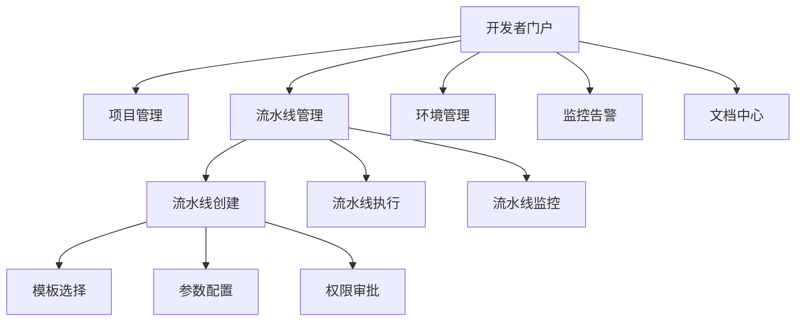

内部开发者平台（Internal Developer Platform, IDP）作为平台工程的核心实践，正在重新定义开发者与基础设施、工具链的交互方式。IDP不仅仅是工具的集合，更是一个为开发者提供自助服务能力的统一平台。CI/CD作为软件交付的核心环节，自然成为IDP的重要组成部分。通过将CI/CD能力深度集成到IDP中，组织可以为开发者提供更加一致、简化的交付体验，同时保持企业级的安全和合规要求。本文将深入探讨IDP与CI/CD的融合实践，分析如何构建一体化的开发者体验。

## IDP与CI/CD的融合架构

IDP与CI/CD的融合需要在架构层面进行深度设计，确保既能提供简化的开发者体验，又能满足企业级的安全和治理要求。

### 统一入口设计

通过统一的门户界面整合CI/CD功能，让开发者在一个地方完成所有交付相关的操作：

#### 前端门户架构


#### 后端服务架构
```python
#!/usr/bin/env python3
"""
IDP与CI/CD融合服务架构示例
"""

import asyncio
from typing import Dict, Any, List
from dataclasses import dataclass
from datetime import datetime

@dataclass
class ServiceEndpoint:
    name: str
    url: str
    auth_required: bool
    capabilities: List[str]

class IDPCICDIntegration:
    def __init__(self):
        # 定义后端服务端点
        self.services = {
            'pipeline': ServiceEndpoint(
                name='Pipeline Service',
                url='https://api.idp.example.com/pipeline',
                auth_required=True,
                capabilities=['create', 'execute', 'monitor']
            ),
            'repository': ServiceEndpoint(
                name='Repository Service',
                url='https://api.idp.example.com/repository',
                auth_required=True,
                capabilities=['clone', 'branch', 'merge']
            ),
            'artifact': ServiceEndpoint(
                name='Artifact Service',
                url='https://api.idp.example.com/artifact',
                auth_required=True,
                capabilities=['store', 'retrieve', 'promote']
            ),
            'environment': ServiceEndpoint(
                name='Environment Service',
                url='https://api.idp.example.com/environment',
                auth_required=True,
                capabilities=['provision', 'configure', 'destroy']
            )
        }
    
    async def create_pipeline(self, pipeline_config: Dict[str, Any]) -> Dict[str, Any]:
        """创建流水线"""
        # 验证配置
        validation_result = await self._validate_pipeline_config(pipeline_config)
        if not validation_result['valid']:
            return {
                'success': False,
                'error': validation_result['errors']
            }
        
        # 调用流水线服务创建流水线
        pipeline_service = self.services['pipeline']
        # 这里应该是实际的API调用
        pipeline_id = f"pipeline-{int(datetime.now().timestamp())}"
        
        return {
            'success': True,
            'pipeline_id': pipeline_id,
            'message': f"Pipeline {pipeline_id} created successfully"
        }
    
    async def execute_pipeline(self, pipeline_id: str, 
                             parameters: Dict[str, Any] = None) -> Dict[str, Any]:
        """执行流水线"""
        # 验证权限
        permission_check = await self._check_permissions(pipeline_id, 'execute')
        if not permission_check['allowed']:
            return {
                'success': False,
                'error': permission_check['reason']
            }
        
        # 调用流水线服务执行流水线
        # 这里应该是实际的API调用
        execution_id = f"exec-{int(datetime.now().timestamp())}"
        
        return {
            'success': True,
            'execution_id': execution_id,
            'status': 'started',
            'message': f"Pipeline {pipeline_id} execution {execution_id} started"
        }
    
    async def _validate_pipeline_config(self, config: Dict[str, Any]) -> Dict[str, Any]:
        """验证流水线配置"""
        errors = []
        
        # 检查必需字段
        required_fields = ['name', 'stages']
        for field in required_fields:
            if field not in config:
                errors.append(f"Missing required field: {field}")
        
        # 检查阶段配置
        if 'stages' in config:
            stages = config['stages']
            if not isinstance(stages, list) or len(stages) == 0:
                errors.append("Stages must be a non-empty list")
        
        return {
            'valid': len(errors) == 0,
            'errors': errors
        }
    
    async def _check_permissions(self, pipeline_id: str, action: str) -> Dict[str, Any]:
        """检查权限"""
        # 这里应该是实际的权限检查逻辑
        # 简化实现，假设所有用户都有权限
        return {
            'allowed': True,
            'reason': 'User has required permissions'
        }
    
    async def get_pipeline_status(self, pipeline_id: str, 
                                execution_id: str = None) -> Dict[str, Any]:
        """获取流水线状态"""
        # 这里应该是实际的API调用
        # 简化实现，返回模拟数据
        return {
            'pipeline_id': pipeline_id,
            'execution_id': execution_id or 'latest',
            'status': 'running',
            'stages': [
                {'name': 'build', 'status': 'completed', 'duration': 120},
                {'name': 'test', 'status': 'running', 'duration': 60},
                {'name': 'deploy', 'status': 'pending', 'duration': 0}
            ],
            'timestamp': datetime.now().isoformat()
        }

# 使用示例
# async def main():
#     idp_cicd = IDPCICDIntegration()
#     
#     # 创建流水线
#     pipeline_config = {
#         'name': 'my-app-pipeline',
#         'stages': ['build', 'test', 'deploy']
#     }
#     create_result = await idp_cicd.create_pipeline(pipeline_config)
#     print(create_result)
#     
#     if create_result['success']:
#         # 执行流水线
#         execute_result = await idp_cicd.execute_pipeline(
#             create_result['pipeline_id'],
#             {'branch': 'main', 'environment': 'staging'}
#         )
#         print(execute_result)
#         
#         # 获取状态
#         status = await idp_cicd.get_pipeline_status(
#             create_result['pipeline_id'],
#             execute_result.get('execution_id')
#         )
#         print(status)

# asyncio.run(main())
```

### 模板化与标准化

通过模板化和标准化降低开发者使用CI/CD的门槛，同时确保一致性和合规性：

#### 流水线模板系统
```yaml
# 流水线模板示例 - 微服务部署模板
apiVersion: idp.example.com/v1
kind: PipelineTemplate
metadata:
  name: microservice-deployment
  version: 1.0.0
  description: "Standard pipeline for microservice deployment"
spec:
  parameters:
    - name: serviceName
      type: string
      required: true
      description: "Name of the service to deploy"
    - name: imageTag
      type: string
      required: false
      default: "latest"
      description: "Docker image tag to deploy"
    - name: targetEnvironment
      type: string
      required: true
      enum: ["development", "staging", "production"]
      description: "Target deployment environment"
  
  stages:
    - name: build
      tasks:
        - name: checkout
          type: git-checkout
          config:
            repository: "{{ .serviceName }}"
            branch: "{{ .branch | default "main" }}"
        
        - name: build-image
          type: docker-build
          config:
            context: "."
            dockerfile: "Dockerfile"
            image: "{{ .serviceName }}:{{ .imageTag }}"
    
    - name: test
      tasks:
        - name: unit-test
          type: script
          config:
            script: "make test"
        
        - name: integration-test
          type: script
          config:
            script: "make integration-test"
            environment: "{{ .targetEnvironment }}"
    
    - name: deploy
      tasks:
        - name: deploy-to-k8s
          type: kubernetes-deploy
          config:
            manifest: "k8s/{{ .targetEnvironment }}/"
            namespace: "{{ .serviceName }}-{{ .targetEnvironment }}"
            strategy: "{{ .deploymentStrategy | default "rolling" }}"
```

#### 模板管理服务
```python
#!/usr/bin/env python3
"""
流水线模板管理系统
"""

import yaml
import json
from typing import Dict, List, Any, Optional
from dataclasses import dataclass
from datetime import datetime
import re

@dataclass
class PipelineTemplate:
    name: str
    version: str
    description: str
    spec: Dict[str, Any]
    created_at: str
    updated_at: str
    author: str

class TemplateManager:
    def __init__(self):
        self.templates = {}
        self.template_versions = {}
    
    def register_template(self, template_yaml: str, author: str = "system") -> Dict[str, Any]:
        """注册流水线模板"""
        try:
            template_data = yaml.safe_load(template_yaml)
            
            # 验证模板格式
            validation_result = self._validate_template(template_data)
            if not validation_result['valid']:
                return {
                    'success': False,
                    'error': validation_result['errors']
                }
            
            template_name = template_data['metadata']['name']
            template_version = template_data['metadata'].get('version', '1.0.0')
            
            template = PipelineTemplate(
                name=template_name,
                version=template_version,
                description=template_data['metadata'].get('description', ''),
                spec=template_data['spec'],
                created_at=datetime.now().isoformat(),
                updated_at=datetime.now().isoformat(),
                author=author
            )
            
            # 存储模板
            template_key = f"{template_name}:{template_version}"
            self.templates[template_key] = template
            
            # 更新版本索引
            if template_name not in self.template_versions:
                self.template_versions[template_name] = []
            self.template_versions[template_name].append(template_version)
            
            return {
                'success': True,
                'template_key': template_key,
                'message': f"Template {template_name} v{template_version} registered successfully"
            }
        except Exception as e:
            return {
                'success': False,
                'error': f"Failed to register template: {str(e)}"
            }
    
    def instantiate_template(self, template_name: str, 
                           parameters: Dict[str, Any],
                           version: str = "latest") -> Dict[str, Any]:
        """实例化模板"""
        # 获取模板
        template = self._get_template(template_name, version)
        if not template:
            return {
                'success': False,
                'error': f"Template {template_name} not found"
            }
        
        # 验证参数
        param_validation = self._validate_parameters(template.spec.get('parameters', []), parameters)
        if not param_validation['valid']:
            return {
                'success': False,
                'error': param_validation['errors']
            }
        
        # 应用参数并生成实例
        try:
            pipeline_instance = self._apply_parameters(template.spec, parameters)
            return {
                'success': True,
                'pipeline_config': pipeline_instance,
                'template': f"{template.name}:{template.version}"
            }
        except Exception as e:
            return {
                'success': False,
                'error': f"Failed to instantiate template: {str(e)}"
            }
    
    def list_templates(self) -> List[Dict[str, Any]]:
        """列出所有模板"""
        template_list = []
        for template_key, template in self.templates.items():
            template_list.append({
                'name': template.name,
                'version': template.version,
                'description': template.description,
                'author': template.author,
                'created_at': template.created_at
            })
        return template_list
    
    def _validate_template(self, template_data: Dict[str, Any]) -> Dict[str, Any]:
        """验证模板格式"""
        errors = []
        
        # 检查必需字段
        required_fields = ['apiVersion', 'kind', 'metadata', 'spec']
        for field in required_fields:
            if field not in template_data:
                errors.append(f"Missing required field: {field}")
        
        # 检查元数据
        if 'metadata' in template_data:
            metadata = template_data['metadata']
            if 'name' not in metadata:
                errors.append("Missing required metadata field: name")
        
        # 检查规格
        if 'spec' in template_data:
            spec = template_data['spec']
            if 'stages' not in spec:
                errors.append("Missing required spec field: stages")
        
        return {
            'valid': len(errors) == 0,
            'errors': errors
        }
    
    def _validate_parameters(self, template_params: List[Dict[str, Any]], 
                           provided_params: Dict[str, Any]) -> Dict[str, Any]:
        """验证参数"""
        errors = []
        validated_params = {}
        
        # 创建参数映射
        param_map = {p['name']: p for p in template_params}
        
        # 检查必需参数
        for param_name, param_config in param_map.items():
            if param_config.get('required', False):
                if param_name not in provided_params:
                    # 检查是否有默认值
                    if 'default' in param_config:
                        validated_params[param_name] = param_config['default']
                    else:
                        errors.append(f"Missing required parameter: {param_name}")
                else:
                    validated_params[param_name] = provided_params[param_name]
            else:
                # 可选参数
                if param_name in provided_params:
                    validated_params[param_name] = provided_params[param_name]
                elif 'default' in param_config:
                    validated_params[param_name] = param_config['default']
        
        # 验证参数值
        for param_name, param_value in validated_params.items():
            if param_name in param_map:
                param_config = param_map[param_name]
                validation_result = self._validate_parameter_value(param_config, param_value)
                if not validation_result['valid']:
                    errors.extend(validation_result['errors'])
        
        return {
            'valid': len(errors) == 0,
            'errors': errors,
            'validated_params': validated_params
        }
    
    def _validate_parameter_value(self, param_config: Dict[str, Any], 
                                param_value: Any) -> Dict[str, Any]:
        """验证参数值"""
        errors = []
        param_type = param_config.get('type', 'string')
        
        # 类型检查
        if param_type == 'string':
            if not isinstance(param_value, str):
                errors.append(f"Parameter {param_config['name']} must be a string")
        elif param_type == 'integer':
            if not isinstance(param_value, int):
                errors.append(f"Parameter {param_config['name']} must be an integer")
        elif param_type == 'boolean':
            if not isinstance(param_value, bool):
                errors.append(f"Parameter {param_config['name']} must be a boolean")
        
        # 枚举检查
        if 'enum' in param_config:
            if param_value not in param_config['enum']:
                errors.append(f"Parameter {param_config['name']} value '{param_value}' not in allowed values {param_config['enum']}")
        
        # 正则表达式检查
        if 'pattern' in param_config:
            pattern = param_config['pattern']
            if not re.match(pattern, str(param_value)):
                errors.append(f"Parameter {param_config['name']} value '{param_value}' does not match pattern '{pattern}'")
        
        return {
            'valid': len(errors) == 0,
            'errors': errors
        }
    
    def _get_template(self, template_name: str, version: str = "latest") -> Optional[PipelineTemplate]:
        """获取模板"""
        if version == "latest":
            if template_name in self.template_versions:
                versions = self.template_versions[template_name]
                # 简单的版本排序（实际应用中需要更复杂的版本比较逻辑）
                latest_version = sorted(versions)[-1]
                template_key = f"{template_name}:{latest_version}"
                return self.templates.get(template_key)
        else:
            template_key = f"{template_name}:{version}"
            return self.templates.get(template_key)
        
        return None
    
    def _apply_parameters(self, template_spec: Dict[str, Any], 
                         parameters: Dict[str, Any]) -> Dict[str, Any]:
        """应用参数到模板"""
        # 这是一个简化的实现，实际应用中可能需要更复杂的模板引擎
        pipeline_config = json.loads(json.dumps(template_spec))
        
        # 替换参数占位符
        def replace_placeholders(obj):
            if isinstance(obj, dict):
                return {k: replace_placeholders(v) for k, v in obj.items()}
            elif isinstance(obj, list):
                return [replace_placeholders(item) for item in obj]
            elif isinstance(obj, str):
                # 简单的占位符替换
                for param_name, param_value in parameters.items():
                    placeholder = f"{{{{ .{param_name} }}}}"
                    obj = obj.replace(placeholder, str(param_value))
                return obj
            else:
                return obj
        
        return replace_placeholders(pipeline_config)

# 使用示例
# template_manager = TemplateManager()
# 
# # 注册模板
# template_yaml = """
# apiVersion: idp.example.com/v1
# kind: PipelineTemplate
# metadata:
#   name: microservice-deployment
#   version: 1.0.0
#   description: "Standard pipeline for microservice deployment"
# spec:
#   parameters:
#     - name: serviceName
#       type: string
#       required: true
#       description: "Name of the service to deploy"
#     - name: imageTag
#       type: string
#       required: false
#       default: "latest"
#       description: "Docker image tag to deploy"
#     - name: targetEnvironment
#       type: string
#       required: true
#       enum: ["development", "staging", "production"]
#   stages:
#     - name: build
#       tasks:
#         - name: build-image
#           config:
#             image: "{{ .serviceName }}:{{ .imageTag }}"
#     - name: deploy
#       tasks:
#         - name: deploy-to-k8s
#           config:
#             namespace: "{{ .serviceName }}-{{ .targetEnvironment }}"
# """
# 
# register_result = template_manager.register_template(template_yaml)
# print(register_result)
# 
# # 实例化模板
# if register_result['success']:
#     instantiate_result = template_manager.instantiate_template(
#         "microservice-deployment",
#         {
#             "serviceName": "user-service",
#             "targetEnvironment": "staging",
#             "imageTag": "v1.2.3"
#         }
#     )
#     print(instantiate_result)