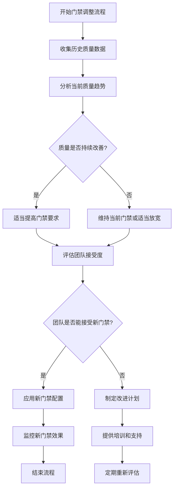

在现代软件开发实践中，质量门禁是确保代码质量和系统稳定性的关键机制。通过在CI/CD流水线中设置一系列质量指标的阈值，质量门禁能够自动阻止不符合标准的代码进入后续流程，从而防止有缺陷的代码被部署到生产环境。本文将深入探讨质量门禁的核心概念、实现方式和最佳实践，帮助团队构建可靠的质量保障体系。

## 质量门禁的核心价值

质量门禁作为CI/CD流水线中的质量控制点，为软件交付带来了多方面的重要价值。

### 风险控制保障
质量门禁通过设置明确的质量标准，能够有效控制代码变更带来的风险。当代码不满足预设的质量要求时，流水线会自动停止，防止低质量代码进入后续的测试或生产环境。

### 质量标准统一
通过在流水线中统一设置质量门禁，团队可以确保所有代码变更都遵循相同的标准，避免因个人主观判断差异导致的质量不一致问题。

### 持续改进驱动
质量门禁不仅是一个质量控制工具，更是驱动团队持续改进的机制。通过定期分析质量门禁的通过情况，团队可以发现质量瓶颈并制定改进措施。

### 自动化决策支持
质量门禁实现了质量决策的自动化，减少了人工评审的工作量，提高了交付效率，同时确保决策的一致性和客观性。

## 覆盖率门禁设置

代码覆盖率是衡量测试充分性的重要指标，合理的覆盖率门禁设置能够确保关键代码得到充分测试。

### 覆盖率指标选择

#### 行覆盖率（Line Coverage）
行覆盖率是最基本的覆盖率指标，它衡量代码中有多少行被执行过。虽然行覆盖率不能完全反映测试质量，但它是评估测试覆盖范围的基础指标。

#### 分支覆盖率（Branch Coverage）
分支覆盖率衡量代码中每个分支（if/else、switch等）是否都被执行过。相比行覆盖率，分支覆盖率更能反映测试的完整性。

#### 函数覆盖率（Function Coverage）
函数覆盖率衡量代码中每个函数是否都被调用过。对于包含大量函数的项目，函数覆盖率是评估测试覆盖的重要指标。

### 覆盖率门禁实现

#### 覆盖率收集工具集成
```xml
<!-- Maven Surefire插件配置 -->
<plugin>
    <groupId>org.apache.maven.plugins</groupId>
    <artifactId>maven-surefire-plugin</artifactId>
    <version>3.0.0-M7</version>
    <configuration>
        <argLine>@{argLine} -Xmx1024m</argLine>
    </configuration>
</plugin>

<!-- JaCoCo插件配置 -->
<plugin>
    <groupId>org.jacoco</groupId>
    <artifactId>jacoco-maven-plugin</artifactId>
    <version>0.8.8</version>
    <executions>
        <execution>
            <goals>
                <goal>prepare-agent</goal>
            </goals>
        </execution>
        <execution>
            <id>report</id>
            <phase>test</phase>
            <goals>
                <goal>report</goal>
            </goals>
        </execution>
        <!-- 覆盖率门禁检查 -->
        <execution>
            <id>check</id>
            <goals>
                <goal>check</goal>
            </goals>
            <configuration>
                <rules>
                    <rule>
                        <element>BUNDLE</element>
                        <limits>
                            <limit>
                                <counter>LINE</counter>
                                <value>COVEREDRATIO</value>
                                <minimum>0.80</minimum>
                            </limit>
                            <limit>
                                <counter>BRANCH</counter>
                                <value>COVEREDRATIO</value>
                                <minimum>0.70</minimum>
                            </limit>
                        </limits>
                    </rule>
                </rules>
            </configuration>
        </execution>
    </executions>
</plugin>
```

#### 自定义覆盖率检查脚本
```python
#!/usr/bin/env python3
"""
自定义覆盖率检查脚本
支持多种覆盖率指标和灵活的门禁配置
"""

import json
import sys
from typing import Dict, List

class CoverageGate:
    def __init__(self, config_file: str):
        with open(config_file, 'r') as f:
            self.config = json.load(f)
    
    def check_coverage(self, coverage_report: Dict) -> Dict:
        """
        检查覆盖率是否满足门禁要求
        
        Args:
            coverage_report: 覆盖率报告数据
            
        Returns:
            检查结果字典
        """
        results = {
            'passed': True,
            'violations': [],
            'details': {}
        }
        
        # 检查各项覆盖率指标
        for metric, threshold in self.config['coverage_thresholds'].items():
            if metric in coverage_report:
                actual_coverage = coverage_report[metric]
                results['details'][metric] = {
                    'actual': actual_coverage,
                    'threshold': threshold,
                    'passed': actual_coverage >= threshold
                }
                
                if actual_coverage < threshold:
                    results['passed'] = False
                    results['violations'].append({
                        'metric': metric,
                        'actual': actual_coverage,
                        'threshold': threshold,
                        'message': f'{metric}覆盖率 {actual_coverage:.2%} 低于门禁阈值 {threshold:.2%}'
                    })
        
        return results
    
    def generate_report(self, check_results: Dict) -> str:
        """
        生成检查报告
        
        Args:
            check_results: 检查结果
            
        Returns:
            报告字符串
        """
        report_lines = []
        report_lines.append("=" * 50)
        report_lines.append("覆盖率门禁检查报告")
        report_lines.append("=" * 50)
        
        if check_results['passed']:
            report_lines.append("✅ 所有覆盖率检查通过")
        else:
            report_lines.append("❌ 部分覆盖率检查未通过")
            report_lines.append("违反的门禁规则:")
            for violation in check_results['violations']:
                report_lines.append(f"  - {violation['message']}")
        
        report_lines.append("\n详细信息:")
        for metric, details in check_results['details'].items():
            status = "✅" if details['passed'] else "❌"
            report_lines.append(
                f"  {status} {metric}: {details['actual']:.2%} "
                f"(门禁: {details['threshold']:.2%})"
            )
        
        return "\n".join(report_lines)

# 使用示例
if __name__ == "__main__":
    if len(sys.argv) != 3:
        print("Usage: python coverage_gate.py <config.json> <coverage.json>")
        sys.exit(1)
    
    config_file = sys.argv[1]
    coverage_file = sys.argv[2]
    
    # 加载覆盖率数据
    with open(coverage_file, 'r') as f:
        coverage_data = json.load(f)
    
    # 执行覆盖率检查
    gate = CoverageGate(config_file)
    results = gate.check_coverage(coverage_data)
    
    # 生成并输出报告
    report = gate.generate_report(results)
    print(report)
    
    # 根据检查结果决定是否通过门禁
    sys.exit(0 if results['passed'] else 1)
```

#### 覆盖率门禁配置文件
```json
{
  "coverage_thresholds": {
    "line_coverage": 0.80,
    "branch_coverage": 0.70,
    "function_coverage": 0.85,
    "instruction_coverage": 0.80
  },
  "exclusions": [
    ".*Test.*",
    ".*Application.*",
    ".*Config.*"
  ],
  "critical_packages": [
    "com.example.business",
    "com.example.service"
  ],
  "critical_package_thresholds": {
    "line_coverage": 0.90,
    "branch_coverage": 0.80
  }
}
```

### 覆盖率门禁优化策略

#### 差异化门禁设置
```groovy
// Jenkins Pipeline中的差异化覆盖率门禁
pipeline {
    agent any
    
    stages {
        stage('Build') {
            steps {
                sh 'mvn clean compile'
            }
        }
        
        stage('Test') {
            steps {
                sh 'mvn test'
            }
            post {
                always {
                    // 生成覆盖率报告
                    jacocoReport(
                        classPattern: 'target/classes',
                        sourcePattern: 'src/main/java',
                        execPattern: 'target/jacoco.exec'
                    )
                }
            }
        }
        
        stage('Coverage Gate') {
            steps {
                script {
                    // 获取当前变更的文件
                    def changedFiles = sh(
                        script: "git diff --name-only HEAD~1 HEAD",
                        returnStdout: true
                    ).trim().split('\n')
                    
                    // 分析变更是否涉及关键业务代码
                    def isCriticalChange = false
                    for (file in changedFiles) {
                        if (file.startsWith('src/main/java/com/example/business/') ||
                            file.startsWith('src/main/java/com/example/service/')) {
                            isCriticalChange = true
                            break
                        }
                    }
                    
                    // 根据变更类型设置不同的覆盖率门禁
                    if (isCriticalChange) {
                        // 关键业务代码变更，使用更严格的门禁
                        sh 'python coverage_gate.py coverage_config_critical.json target/site/jacoco/jacoco.json'
                    } else {
                        // 一般代码变更，使用标准门禁
                        sh 'python coverage_gate.py coverage_config_standard.json target/site/jacoco/jacoco.json'
                    }
                }
            }
        }
    }
}
```

## 通过率门禁设置

测试通过率是衡量代码质量的直接指标，合理的通过率门禁能够确保只有经过充分测试的代码才能进入后续流程。

### 通过率指标定义

#### 单元测试通过率
单元测试通过率衡量单元测试的执行情况，是代码质量的基础指标。通常要求单元测试通过率达到100%。

#### 集成测试通过率
集成测试通过率衡量组件间集成测试的执行情况。由于集成测试涉及外部依赖，可以设置略低于100%的通过率要求。

#### 端到端测试通过率
端到端测试通过率衡量系统整体功能的测试情况。由于端到端测试容易受环境因素影响，可以根据实际情况设置合理的通过率阈值。

### 通过率门禁实现

#### 测试结果解析工具
```python
#!/usr/bin/env python3
"""
测试结果解析和通过率门禁检查工具
支持JUnit、TestNG等主流测试框架的结果格式
"""

import xml.etree.ElementTree as ET
import json
from typing import Dict, List

class TestResultAnalyzer:
    def __init__(self, config: Dict):
        self.config = config
    
    def parse_junit_results(self, report_files: List[str]) -> Dict:
        """
        解析JUnit测试结果
        
        Args:
            report_files: 测试报告文件列表
            
        Returns:
            测试结果统计字典
        """
        total_tests = 0
        total_failures = 0
        total_errors = 0
        total_skipped = 0
        
        for report_file in report_files:
            try:
                tree = ET.parse(report_file)
                root = tree.getroot()
                
                # 处理testsuite元素
                for testsuite in root.findall('.//testsuite'):
                    tests = int(testsuite.get('tests', 0))
                    failures = int(testsuite.get('failures', 0))
                    errors = int(testsuite.get('errors', 0))
                    skipped = int(testsuite.get('skipped', 0))
                    
                    total_tests += tests
                    total_failures += failures
                    total_errors += errors
                    total_skipped += skipped
            except ET.ParseError as e:
                print(f"Warning: Failed to parse {report_file}: {e}")
                continue
        
        passed_tests = total_tests - total_failures - total_errors - total_skipped
        
        return {
            'total': total_tests,
            'passed': passed_tests,
            'failures': total_failures,
            'errors': total_errors,
            'skipped': total_skipped,
            'pass_rate': passed_tests / total_tests if total_tests > 0 else 0
        }
    
    def check_pass_rate_gate(self, test_results: Dict) -> Dict:
        """
        检查通过率门禁
        
        Args:
            test_results: 测试结果统计
            
        Returns:
            检查结果字典
        """
        results = {
            'passed': True,
            'violations': [],
            'details': {}
        }
        
        # 检查总体通过率
        overall_pass_rate = test_results['pass_rate']
        required_pass_rate = self.config.get('overall_pass_rate', 1.0)
        
        results['details']['overall'] = {
            'actual': overall_pass_rate,
            'threshold': required_pass_rate,
            'passed': overall_pass_rate >= required_pass_rate
        }
        
        if overall_pass_rate < required_pass_rate:
            results['passed'] = False
            results['violations'].append({
                'type': 'overall',
                'actual': overall_pass_rate,
                'threshold': required_pass_rate,
                'message': f'总体通过率 {overall_pass_rate:.2%} 低于门禁阈值 {required_pass_rate:.2%}'
            })
        
        # 检查关键测试套件通过率
        critical_suites = self.config.get('critical_test_suites', [])
        # 这里简化处理，实际应该解析具体的测试套件
        
        return results

# 使用示例
if __name__ == "__main__":
    # 门禁配置
    config = {
        "overall_pass_rate": 0.95,
        "critical_test_suites": [
            "com.example.business.UserServiceTest",
            "com.example.service.PaymentServiceTest"
        ],
        "critical_suite_pass_rate": 1.0
    }
    
    # 解析测试结果
    analyzer = TestResultAnalyzer(config)
    test_results = analyzer.parse_junit_results([
        'target/surefire-reports/TEST-*.xml',
        'target/failsafe-reports/TEST-*.xml'
    ])
    
    # 检查通过率门禁
    gate_results = analyzer.check_pass_rate_gate(test_results)
    
    # 输出结果
    print(json.dumps({
        'test_results': test_results,
        'gate_results': gate_results
    }, indent=2))
    
    # 根据检查结果决定是否通过门禁
    exit(0 if gate_results['passed'] else 1)
```

#### CI/CD集成配置
```yaml
# GitLab CI中的测试通过率门禁配置
stages:
  - build
  - test
  - quality-gate
  - deploy

variables:
  MINIMUM_PASS_RATE: "0.95"
  CRITICAL_SUITE_PASS_RATE: "1.0"

test:
  stage: test
  script:
    - mvn test
    - mvn verify
  artifacts:
    reports:
      junit: 
        - target/surefire-reports/TEST-*.xml
        - target/failsafe-reports/TEST-*.xml
    paths:
      - target/site/jacoco/

quality-gate:
  stage: quality-gate
  script:
    - |
      # 检查总体通过率
      python test_result_analyzer.py \
        --config quality_gate_config.json \
        --reports target/surefire-reports/TEST-*.xml target/failsafe-reports/TEST-*.xml
  allow_failure: false
  dependencies:
    - test
```

## 动态门禁调整

随着项目的发展和团队成熟度的提升，质量门禁的要求也需要动态调整，以适应不同的发展阶段。

### 门禁成熟度模型

#### 初级阶段门禁
在项目初期或团队成熟度较低时，可以设置相对宽松的门禁要求，重点在于建立测试文化和流程。

```json
{
  "maturity_level": "beginner",
  "coverage_thresholds": {
    "line_coverage": 0.60,
    "branch_coverage": 0.50
  },
  "pass_rate_thresholds": {
    "overall": 0.90,
    "critical_suites": 0.95
  },
  "warning_only": true
}
```

#### 中级阶段门禁
在团队具备一定测试基础后，可以逐步提高门禁要求，推动质量提升。

```json
{
  "maturity_level": "intermediate",
  "coverage_thresholds": {
    "line_coverage": 0.75,
    "branch_coverage": 0.65,
    "function_coverage": 0.70
  },
  "pass_rate_thresholds": {
    "overall": 0.95,
    "critical_suites": 1.0
  },
  "warning_only": false
}
```

#### 高级阶段门禁
在团队成熟度较高时，可以设置严格的门禁要求，确保高质量交付。

```json
{
  "maturity_level": "advanced",
  "coverage_thresholds": {
    "line_coverage": 0.85,
    "branch_coverage": 0.80,
    "function_coverage": 0.85,
    "instruction_coverage": 0.85
  },
  "pass_rate_thresholds": {
    "overall": 0.98,
    "critical_suites": 1.0
  },
  "warning_only": false,
  "critical_package_thresholds": {
    "line_coverage": 0.95,
    "branch_coverage": 0.90
  }
}
```

### 门禁调整策略

#### 基于历史数据的自动调整
```python
class DynamicGateAdjuster:
    def __init__(self, metrics_store):
        self.metrics_store = metrics_store
    
    def adjust_coverage_gates(self, project_id: str, current_config: Dict) -> Dict:
        """
        基于历史数据动态调整覆盖率门禁
        
        Args:
            project_id: 项目ID
            current_config: 当前门禁配置
            
        Returns:
            调整后的门禁配置
        """
        # 获取历史覆盖率数据
        historical_data = self.metrics_store.get_historical_coverage(project_id, days=90)
        
        if not historical_data:
            return current_config
        
        # 计算平均覆盖率
        avg_line_coverage = sum(d['line_coverage'] for d in historical_data) / len(historical_data)
        avg_branch_coverage = sum(d['branch_coverage'] for d in historical_data) / len(historical_data)
        
        # 根据历史数据调整门禁阈值
        adjusted_config = current_config.copy()
        
        # 新的门禁阈值为历史平均值的90%
        new_line_threshold = avg_line_coverage * 0.9
        new_branch_threshold = avg_branch_coverage * 0.9
        
        # 确保不低于最小阈值
        min_line_threshold = current_config['coverage_thresholds']['line_coverage']
        min_branch_threshold = current_config['coverage_thresholds']['branch_coverage']
        
        adjusted_config['coverage_thresholds']['line_coverage'] = max(
            new_line_threshold, min_line_threshold
        )
        adjusted_config['coverage_thresholds']['branch_coverage'] = max(
            new_branch_threshold, min_branch_threshold
        )
        
        return adjusted_config
    
    def adjust_pass_rate_gates(self, project_id: str, current_config: Dict) -> Dict:
        """
        基于历史数据动态调整通过率门禁
        
        Args:
            project_id: 项目ID
            current_config: 当前门禁配置
            
        Returns:
            调整后的门禁配置
        """
        # 获取历史通过率数据
        historical_data = self.metrics_store.get_historical_pass_rates(project_id, days=90)
        
        if not historical_data:
            return current_config
        
        # 计算平均通过率
        avg_pass_rate = sum(d['pass_rate'] for d in historical_data) / len(historical_data)
        
        # 调整通过率门禁
        adjusted_config = current_config.copy()
        new_pass_rate_threshold = avg_pass_rate * 0.95  # 95%的平均通过率
        
        # 确保不低于最小阈值
        min_pass_rate = current_config['pass_rate_thresholds']['overall']
        adjusted_config['pass_rate_thresholds']['overall'] = max(
            new_pass_rate_threshold, min_pass_rate
        )
        
        return adjusted_config
```

#### 门禁调整决策流程


## 质量门禁最佳实践

### 门禁设置原则

#### 渐进式提升
质量门禁的设置应该遵循渐进式提升的原则，避免一次性设置过高的要求导致团队抵触。

#### 差异化管理
根据不同类型的代码和测试设置差异化的门禁要求，关键业务代码应该有更严格的门禁。

#### 可解释性
门禁规则应该具有良好的可解释性，团队成员能够理解门禁设置的 rationale。

### 门禁实施策略

#### 早期集成
在项目早期就集成质量门禁，让团队从一开始就养成良好的质量习惯。

#### 持续监控
建立持续监控机制，定期分析门禁通过情况，及时发现和解决问题。

#### 反馈机制
建立有效的反馈机制，让团队能够及时了解门禁检查结果和改进建议。

通过合理设置和实施质量门禁，团队能够建立可靠的质量保障体系，确保只有经过充分测试和验证的代码才能进入生产环境。质量门禁不仅是技术工具，更是推动团队持续改进和提升质量文化的重要手段。