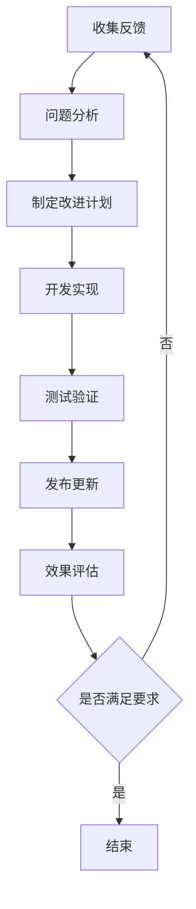

流水线模板库是CI/CD平台中促进最佳实践复用、降低使用门槛的关键组件。通过提供标准化的流水线模板，平台能够帮助用户快速创建符合组织规范和最佳实践的流水线，同时确保不同团队和项目之间的一致性。本文将深入探讨流水线模板库的设计原则、实现方式以及最佳实践。

## 流水线模板库的核心价值

流水线模板库不仅是一个代码存储库，更是组织内部最佳实践的载体和推广工具。它通过标准化和复用机制，显著提升平台的易用性和一致性。

### 1. 降低使用门槛

对于新用户或不熟悉CI/CD概念的开发者来说，从零开始创建一个完整的流水线可能是一项挑战。模板库通过提供预定义的流水线结构，大大降低了使用门槛。

#### 预定义结构
模板库提供清晰的流水线结构定义：
- **阶段划分**：预定义标准的流水线阶段（如构建、测试、部署）
- **任务编排**：提供合理的任务执行顺序和依赖关系
- **参数配置**：定义常用的配置参数和默认值
- **错误处理**：集成标准的错误处理和通知机制

#### 快速启动
用户可以通过简单的配置快速启动流水线：
```yaml
# 示例：基于模板的流水线定义
pipeline:
  template: "web-application-standard"
  parameters:
    application_name: "my-web-app"
    repository_url: "https://github.com/org/my-web-app.git"
    build_tool: "maven"
    test_framework: "junit"
```

### 2. 确保一致性

在大型组织中，确保不同团队和项目遵循相同的标准和规范是一项挑战。模板库通过提供统一的模板，确保所有流水线在结构和实现上的一致性。

#### 标准化流程
模板库强制执行标准化的流程：
- **代码检查**：集成统一的代码质量检查工具
- **安全扫描**：包含必要的安全扫描步骤
- **测试覆盖**：确保必要的测试环节
- **部署策略**：遵循统一的部署策略

#### 合规性保证
模板内置合规性检查：
- **安全规范**：遵循组织安全规范
- **审计要求**：满足审计和合规要求
- **资源限制**：控制资源使用符合预算要求

### 3. 促进最佳实践传播

模板库是传播最佳实践的有效载体，通过将最佳实践编码到模板中，确保所有用户都能受益。

#### 技术最佳实践
模板集成技术层面的最佳实践：
- **构建优化**：利用缓存和并行构建提高效率
- **测试策略**：实施测试金字塔策略
- **部署模式**：采用蓝绿部署或金丝雀发布等先进模式
- **监控集成**：自动集成监控和告警机制

#### 运营最佳实践
模板体现运营层面的最佳实践：
- **日志规范**：遵循统一的日志格式和收集策略
- **通知机制**：实现及时的状态通知和告警
- **回滚策略**：提供一键回滚能力
- **版本管理**：实施版本控制和变更管理

## 流水线模板库设计原则

设计一个高效、易用且可维护的流水线模板库需要遵循一系列核心原则。

### 1. 模块化设计

模块化设计使得模板更加灵活和可复用，用户可以根据需要选择和组合不同的模块。

#### 功能模块化
将流水线功能分解为独立的模块：
- **构建模块**：负责代码构建和打包
- **测试模块**：负责各种类型的测试执行
- **安全模块**：负责安全扫描和合规检查
- **部署模块**：负责应用部署和环境管理

#### 配置模块化
将配置参数按功能分组：
```yaml
# 模块化配置示例
pipeline:
  build:
    tool: "maven"
    goals: ["clean", "package"]
    cache: true
  
  test:
    unit_test: true
    integration_test: false
    performance_test: false
    coverage_threshold: 80
  
  security:
    sca_scan: true
    sast_scan: true
    container_scan: false
  
  deploy:
    strategy: "rolling"
    replicas: 3
    health_check: true
```

### 2. 参数化配置

通过参数化配置使得模板更加灵活，能够适应不同的应用场景。

#### 必需参数
定义模板运行所必需的参数：
```yaml
parameters:
  required:
    - application_name
    - repository_url
    - build_tool
```

#### 可选参数
提供可选参数以支持个性化配置：
```yaml
parameters:
  optional:
    build_args:
      default: []
    test_timeout:
      default: 300
    deployment_replicas:
      default: 1
```

#### 参数验证
实施参数验证确保配置的有效性：
```yaml
parameters:
  application_name:
    type: string
    pattern: "^[a-z0-9]([-a-z0-9]*[a-z0-9])?$"
    max_length: 63
  build_tool:
    type: enum
    values: ["maven", "gradle", "npm", "go"]
```

### 3. 版本管理

完善的版本管理机制确保模板的稳定性和兼容性。

#### 语义化版本
遵循语义化版本规范：
- **主版本号**：不兼容的API修改
- **次版本号**：向后兼容的功能性新增
- **修订号**：向后兼容的问题修正

#### 版本兼容性
确保版本间的兼容性：
```yaml
# 模板元数据
metadata:
  name: "web-application-standard"
  version: "1.2.3"
  compatibility: ">=1.0.0"
  deprecated: false
```

### 4. 可扩展性

设计可扩展的模板结构支持未来的功能增强。

#### 插件机制
支持通过插件扩展模板功能：
```yaml
extensions:
  - name: "custom-notification"
    config:
      webhook_url: "https://hooks.slack.com/services/..."
  - name: "advanced-monitoring"
    config:
      metrics_endpoint: "/metrics"
```

#### 自定义钩子
提供自定义钩子支持特殊需求：
```yaml
hooks:
  pre_build:
    - script: "scripts/pre-build.sh"
  post_deploy:
    - script: "scripts/post-deploy.sh"
      condition: "deployment.status == 'success'"
```

## 流水线模板库实现方式

实现一个功能完整的流水线模板库需要考虑技术选型、存储管理、版本控制等多个方面。

### 1. 技术架构

选择合适的技术架构是模板库成功的基础。

#### 存储方案
选择合适的存储方案：
- **Git仓库**：使用Git作为模板存储和版本控制工具
- **对象存储**：对于大型二进制文件使用对象存储
- **数据库**：存储模板元数据和配置信息

#### API设计
设计清晰的API接口：
```http
GET /api/v1/templates
GET /api/v1/templates/{name}
GET /api/v1/templates/{name}/versions
POST /api/v1/templates
PUT /api/v1/templates/{name}
DELETE /api/v1/templates/{name}
```

#### 用户界面
提供友好的用户界面：
- **模板浏览**：可视化浏览可用模板
- **参数配置**：图形化配置模板参数
- **预览功能**：预览生成的流水线配置
- **文档集成**：集成模板使用文档

### 2. 模板定义规范

建立统一的模板定义规范确保模板的一致性和可维护性。

#### YAML格式定义
使用YAML格式定义模板：
```yaml
# 模板定义示例
apiVersion: pipeline.template/v1
kind: PipelineTemplate
metadata:
  name: "java-microservice"
  version: "1.0.0"
  description: "Java微服务标准流水线模板"
  author: "Platform Team"
  tags: ["java", "microservice", "spring-boot"]

spec:
  parameters:
    - name: "application_name"
      type: "string"
      description: "应用名称"
      required: true
    
    - name: "java_version"
      type: "enum"
      description: "Java版本"
      default: "11"
      values: ["8", "11", "17"]
  
  stages:
    - name: "build"
      steps:
        - name: "checkout"
          type: "git-checkout"
          config:
            repository: "{{ .repository_url }}"
        
        - name: "compile"
          type: "maven-build"
          config:
            goals: ["clean", "compile"]
            java_version: "{{ .java_version }}"
  
  notifications:
    - type: "slack"
      events: ["pipeline.start", "pipeline.success", "pipeline.failure"]
      config:
        webhook_url: "{{ .slack_webhook_url }}"
```

#### 模板验证
实施模板验证机制：
```bash
#!/bin/bash
# 模板验证脚本
validate_template() {
  local template_file=$1
  
  # 语法验证
  yamllint "$template_file"
  
  # 结构验证
  python3 validate_template.py "$template_file"
  
  # 功能验证
  pipeline-cli validate --template "$template_file"
}
```

### 3. 版本控制策略

建立完善的版本控制策略确保模板的稳定性和可追溯性。

#### Git分支策略
采用合适的Git分支策略：
```bash
# 主要分支
main/master    # 稳定版本
develop        # 开发版本
feature/*      # 功能开发分支
hotfix/*       # 紧急修复分支
release/*      # 发布候选分支
```

#### 发布流程
建立标准化的发布流程：
```bash
#!/bin/bash
# 模板发布脚本
release_template() {
  local version=$1
  local template_name=$2
  
  # 创建发布分支
  git checkout -b "release/${template_name}-${version}"
  
  # 更新版本号
  sed -i "s/version: .*/version: ${version}/" "templates/${template_name}.yaml"
  
  # 运行测试
  ./test-template.sh "${template_name}"
  
  # 合并到主分支
  git checkout main
  git merge "release/${template_name}-${version}"
  
  # 创建标签
  git tag -a "${template_name}-${version}" -m "Release ${template_name} ${version}"
  
  # 推送更改
  git push origin main --tags
}
```

## 模板分类与管理

合理的模板分类和管理机制能够提升模板的可发现性和使用效率。

### 1. 模板分类体系

建立清晰的模板分类体系：
- **按技术栈分类**：Java、Go、Python、Node.js等
- **按应用类型分类**：Web应用、微服务、移动应用、数据处理等
- **按环境分类**：开发、测试、生产等
- **按复杂度分类**：基础模板、标准模板、高级模板

#### 分类标签系统
使用标签系统实现灵活的分类：
```yaml
metadata:
  name: "spring-boot-microservice"
  tags: 
    - "java"
    - "spring-boot"
    - "microservice"
    - "kubernetes"
    - "standard"
```

### 2. 模板生命周期管理

建立完整的模板生命周期管理机制：
- **创建**：模板设计和开发
- **测试**：模板功能验证
- **发布**：模板正式发布
- **维护**：模板更新和优化
- **废弃**：模板标记为废弃

#### 生命周期状态
定义模板生命周期状态：
```yaml
metadata:
  name: "legacy-template"
  status: "deprecated"
  replacement: "modern-template-v2"
  deprecation_date: "2025-12-31"
```

### 3. 模板质量保证

建立模板质量保证机制确保模板的可靠性和有效性。

#### 自动化测试
为模板编写自动化测试：
```python
#!/usr/bin/env python3
"""
模板测试脚本
验证模板功能正确性
"""

import yaml
import unittest
from pipeline_template import PipelineTemplate

class TestPipelineTemplate(unittest.TestCase):
    def setUp(self):
        with open('templates/web-application.yaml', 'r') as f:
            self.template_data = yaml.safe_load(f)
        self.template = PipelineTemplate(self.template_data)
    
    def test_required_parameters(self):
        """测试必需参数"""
        required_params = self.template.get_required_parameters()
        self.assertIn('application_name', required_params)
        self.assertIn('repository_url', required_params)
    
    def test_stage_generation(self):
        """测试阶段生成"""
        pipeline = self.template.generate_pipeline({
            'application_name': 'test-app',
            'repository_url': 'https://github.com/test/test-app.git'
        })
        
        stages = pipeline.get_stages()
        self.assertIn('build', stages)
        self.assertIn('test', stages)
        self.assertIn('deploy', stages)
    
    def test_validation(self):
        """测试参数验证"""
        # 测试有效参数
        valid_params = {
            'application_name': 'valid-app-name',
            'repository_url': 'https://github.com/test/test-app.git'
        }
        self.assertTrue(self.template.validate_parameters(valid_params))
        
        # 测试无效参数
        invalid_params = {
            'application_name': 'Invalid App Name!',  # 包含非法字符
            'repository_url': 'https://github.com/test/test-app.git'
        }
        self.assertFalse(self.template.validate_parameters(invalid_params))

if __name__ == '__main__':
    unittest.main()
```

## 最佳实践推广

通过模板库有效推广最佳实践是提升组织整体研发效能的关键。

### 1. 模板使用统计

收集和分析模板使用统计数据：
- **使用频率**：统计各模板的使用频率
- **成功率**：统计模板流水线的执行成功率
- **用户反馈**：收集用户对模板的反馈意见
- **改进建议**：基于使用数据提出改进建议

#### 统计数据收集
实现统计数据收集机制：
```python
#!/usr/bin/env python3
"""
模板使用统计
收集模板使用数据
"""

import json
from datetime import datetime

class TemplateUsageTracker:
    def __init__(self):
        self.usage_data = {}
    
    def record_template_usage(self, template_name, user_id, success=True, duration=0):
        """记录模板使用情况"""
        if template_name not in self.usage_data:
            self.usage_data[template_name] = {
                'total_uses': 0,
                'successful_uses': 0,
                'failed_uses': 0,
                'total_duration': 0,
                'users': set()
            }
        
        template_stats = self.usage_data[template_name]
        template_stats['total_uses'] += 1
        template_stats['users'].add(user_id)
        
        if success:
            template_stats['successful_uses'] += 1
        else:
            template_stats['failed_uses'] += 1
        
        template_stats['total_duration'] += duration
    
    def get_template_stats(self, template_name):
        """获取模板统计信息"""
        if template_name not in self.usage_data:
            return None
        
        stats = self.usage_data[template_name].copy()
        stats['unique_users'] = len(stats['users'])
        stats['success_rate'] = (
            stats['successful_uses'] / stats['total_uses'] 
            if stats['total_uses'] > 0 else 0
        )
        stats['avg_duration'] = (
            stats['total_duration'] / stats['total_uses'] 
            if stats['total_uses'] > 0 else 0
        )
        
        # 删除不需要返回的字段
        del stats['users']
        del stats['total_duration']
        
        return stats
    
    def generate_report(self):
        """生成使用报告"""
        report = {
            'generated_at': datetime.now().isoformat(),
            'templates': {}
        }
        
        for template_name in self.usage_data:
            report['templates'][template_name] = self.get_template_stats(template_name)
        
        return report
```

### 2. 模板优化迭代

基于使用反馈持续优化模板：
- **性能优化**：优化模板执行效率
- **功能增强**：根据用户需求增加新功能
- **问题修复**：修复发现的问题和缺陷
- **用户体验**：改进用户使用体验

#### 迭代改进流程
建立模板迭代改进流程：


通过建立完善的流水线模板库，组织能够有效降低CI/CD平台的使用门槛，确保流水线的一致性，并有效推广最佳实践。关键是要设计合理的模板结构，建立完善的版本管理机制，并持续收集用户反馈进行优化改进。