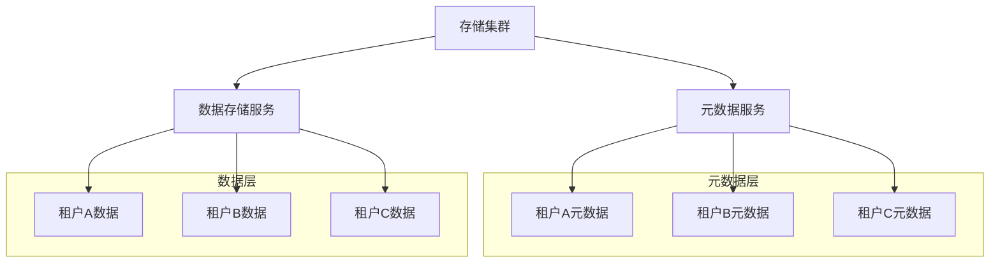

在构建企业级分布式文件存储平台时，多租户支持和资源配额管理是确保系统稳定性和安全性的关键要素。通过合理的配额管理和多租户隔离机制，可以有效防止资源滥用，保障各租户的数据安全，并实现资源的公平分配。

## 多租户架构设计

多租户架构是分布式文件存储平台支持多个独立用户或组织共享同一套基础设施的核心设计。合理的多租户架构需要在资源共享与隔离之间找到平衡点。

### 租户隔离级别

根据隔离程度的不同，多租户架构可分为以下几种模式：

1. **共享数据库，共享表结构**：通过租户ID区分数据，成本最低但隔离性最差。
2. **共享数据库，独立表结构**：为每个租户创建独立的表，提供较好的隔离性。
3. **独立数据库**：为每个租户提供独立的数据库实例，隔离性最好但成本最高。

在分布式文件存储系统中，通常采用混合模式实现租户隔离：



### 命名空间隔离

通过命名空间实现租户间的数据隔离是分布式文件系统中常用的方法：

```python
class TenantNamespaceManager:
    def __init__(self):
        self.namespaces = {}
    
    def create_namespace(self, tenant_id, namespace_config):
        """为租户创建独立命名空间"""
        namespace = Namespace(
            id=f"{tenant_id}-{uuid.uuid4()}",
            tenant_id=tenant_id,
            root_path=f"/tenants/{tenant_id}",
            config=namespace_config
        )
        self.namespaces[tenant_id] = namespace
        return namespace
    
    def validate_access(self, tenant_id, path):
        """验证租户对路径的访问权限"""
        namespace = self.namespaces.get(tenant_id)
        if not namespace:
            raise PermissionError("Tenant namespace not found")
        
        # 检查路径是否在租户命名空间内
        if not path.startswith(namespace.root_path):
            raise PermissionError("Access denied: path outside tenant namespace")
        
        return True
```

## 配额管理机制

配额管理是防止资源滥用、保障系统稳定性的关键机制。通过合理的配额设置，可以确保各租户公平使用系统资源。

### 配额类型

分布式文件存储系统中的配额通常包括以下几种类型：

1. **存储容量配额**：限制租户可使用的存储空间总量。
2. **文件数量配额**：限制租户可创建的文件总数。
3. **带宽配额**：限制租户的数据传输速率。
4. **请求频率配额**：限制租户的API请求频率。

### 配额管理实现

配额管理系统的典型实现架构：

```go
type QuotaManager struct {
    storageQuota map[string]*StorageQuota
    rateLimiter  *rate.Limiter
    mutex        sync.RWMutex
}

type StorageQuota struct {
    TenantID    string
    Limit       int64  // 配额限制（字节）
    Used        int64  // 已使用量（字节）
    LastUpdated time.Time
}

func (qm *QuotaManager) CheckStorageQuota(tenantID string, size int64) error {
    qm.mutex.RLock()
    quota, exists := qm.storageQuota[tenantID]
    qm.mutex.RUnlock()
    
    if !exists {
        return fmt.Errorf("quota not found for tenant: %s", tenantID)
    }
    
    if quota.Used+size > quota.Limit {
        return fmt.Errorf("storage quota exceeded for tenant: %s", tenantID)
    }
    
    return nil
}

func (qm *QuotaManager) UpdateUsage(tenantID string, size int64) error {
    qm.mutex.Lock()
    defer qm.mutex.Unlock()
    
    quota, exists := qm.storageQuota[tenantID]
    if !exists {
        return fmt.Errorf("quota not found for tenant: %s", tenantID)
    }
    
    quota.Used += size
    quota.LastUpdated = time.Now()
    
    return nil
}
```

### 动态配额调整

为了适应租户业务的变化，配额管理系统应支持动态调整：

```yaml
# 动态配额配置示例
quotas:
  - tenant_id: "tenant-001"
    type: "storage"
    limit: "100GB"
    auto_scale:
      enabled: true
      max_limit: "1TB"
      threshold: 0.8  # 使用率达到80%时触发扩容
      cooldown_period: "24h"  # 扩容后24小时内不重复扩容
    
  - tenant_id: "tenant-001"
    type: "bandwidth"
    limit: "100MB/s"
    auto_scale:
      enabled: false
```

## 资源监控与告警

有效的资源监控是配额管理的重要组成部分，通过实时监控可以及时发现资源使用异常并采取相应措施。

### 监控指标设计

关键的资源监控指标包括：

1. **存储使用率**：当前使用量与配额的比率。
2. **带宽使用情况**：实时带宽使用量和峰值。
3. **请求频率**：API请求的QPS（每秒查询率）。
4. **配额使用趋势**：历史使用数据和预测分析。

监控系统实现示例：

```javascript
class ResourceMonitor {
    constructor(quotaManager, alertManager) {
        this.quotaManager = quotaManager;
        this.alertManager = alertManager;
        this.metrics = new Map();
    }
    
    async collectMetrics() {
        const tenants = await this.quotaManager.listTenants();
        
        for (const tenant of tenants) {
            // 收集存储使用情况
            const storageUsage = await this.quotaManager.getStorageUsage(tenant.id);
            this.metrics.set(`${tenant.id}:storage`, storageUsage);
            
            // 收集带宽使用情况
            const bandwidthUsage = await this.collectBandwidthUsage(tenant.id);
            this.metrics.set(`${tenant.id}:bandwidth`, bandwidthUsage);
            
            // 检查配额使用率
            this.checkQuotaThreshold(tenant.id, storageUsage);
        }
    }
    
    checkQuotaThreshold(tenantId, usage) {
        const quota = this.quotaManager.getQuota(tenantId);
        const usageRate = usage.used / quota.limit;
        
        // 发送告警
        if (usageRate > 0.9) {
            this.alertManager.sendAlert({
                tenantId: tenantId,
                level: "critical",
                message: `存储配额使用率已达${(usageRate * 100).toFixed(2)}%`
            });
        } else if (usageRate > 0.8) {
            this.alertManager.sendAlert({
                tenantId: tenantId,
                level: "warning",
                message: `存储配额使用率已达${(usageRate * 100).toFixed(2)}%`
            });
        }
    }
}
```

## 多租户安全策略

在多租户环境中，安全策略的制定和实施至关重要，需要确保租户间的数据隔离和访问控制。

### 访问控制模型

采用基于角色的访问控制（RBAC）模型管理租户权限：

```json
{
  "roles": {
    "tenant-admin": {
      "permissions": [
        "read:*",
        "write:*",
        "delete:*",
        "manage_quota",
        "manage_users"
      ]
    },
    "tenant-user": {
      "permissions": [
        "read:*",
        "write:*",
        "delete:own_files"
      ]
    }
  },
  "role_bindings": {
    "tenant-001": {
      "admin": "tenant-admin",
      "users": ["user1", "user2", "user3"]
    }
  }
}
```

### 数据隔离验证

定期验证数据隔离的有效性：

```python
class IsolationValidator:
    def __init__(self, storage_client):
        self.storage_client = storage_client
    
    def validate_tenant_isolation(self, tenant_ids):
        """验证租户间的数据隔离"""
        for i, tenant_a in enumerate(tenant_ids):
            for tenant_b in tenant_ids[i+1:]:
                # 尝试访问其他租户的数据
                try:
                    self.storage_client.access_path(
                        tenant_id=tenant_a,
                        path=f"/tenants/{tenant_b}/data"
                    )
                    # 如果成功访问，说明隔离失效
                    self.report_isolation_breach(tenant_a, tenant_b)
                except PermissionError:
                    # 正常情况，隔离有效
                    pass
    
    def report_isolation_breach(self, tenant_a, tenant_b):
        """报告隔离失效事件"""
        logger.critical(f"Tenant isolation breach detected: {tenant_a} accessed {tenant_b} data")
        # 发送告警并采取修复措施
        self.send_alert(tenant_a, tenant_b)
```

## 实践建议

在实际部署和运维分布式文件存储平台时，建议遵循以下实践：

1. **渐进式实施**：从简单的配额管理开始，逐步完善多租户功能。
2. **定期审计**：定期审计配额使用情况和安全策略的有效性。
3. **用户自助服务**：提供租户自助查看配额使用情况和申请配额调整的界面。
4. **弹性扩容**：设计支持自动扩容的配额管理机制，适应业务增长。
5. **合规性检查**：确保配额管理和多租户隔离符合相关法规要求。

通过合理的配额管理和多租户隔离机制，可以构建一个安全、稳定、高效的分布式文件存储平台，为不同规模和需求的用户提供可靠的服务。