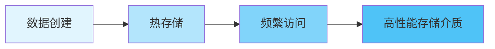
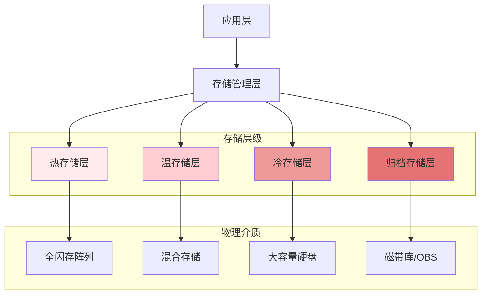

在现代分布式文件存储系统中，数据生命周期管理（Data Lifecycle Management）是实现存储资源优化、成本控制和性能提升的关键策略。随着数据量的爆炸式增长，如何智能地管理数据从创建到销毁的整个生命周期，已成为企业存储架构设计中的核心议题。

## 数据生命周期阶段

数据生命周期通常包括以下几个阶段，每个阶段都有其特定的存储需求和管理策略：

### 创建阶段

数据创建阶段是生命周期的起点，主要关注数据的初始存储和访问性能。



### 活跃阶段

在活跃阶段，数据被频繁访问，需要存储在高性能介质上以确保访问效率：

```yaml
# 活跃数据存储策略配置
storage_tier:
  hot_tier:
    media_type: "SSD"
    replication_factor: 3
    access_pattern: "frequent"
    performance_target:
      latency: "<10ms"
      throughput: ">1GB/s"
```

### 温数据阶段

随着访问频率的降低，数据进入温数据阶段，可以迁移到性价比更高的存储介质：

```python
class DataLifecycleManager:
    def __init__(self, storage_cluster):
        self.storage_cluster = storage_cluster
        self.tiering_policies = self.load_tiering_policies()
    
    def evaluate_data_tiering(self, data_object):
        """评估数据的存储层级"""
        # 分析访问模式
        access_frequency = self.analyze_access_pattern(data_object)
        
        # 根据访问频率确定存储层级
        if access_frequency > 100:  # 每天访问超过100次
            return "hot"
        elif access_frequency > 10:  # 每天访问10-100次
            return "warm"
        else:  # 每天访问少于10次
            return "cold"
    
    def migrate_data_tier(self, data_object, target_tier):
        """迁移数据到目标存储层级"""
        current_tier = data_object.storage_tier
        if current_tier == target_tier:
            return
        
        # 执行数据迁移
        migration_task = MigrationTask(
            source_tier=current_tier,
            target_tier=target_tier,
            data_id=data_object.id
        )
        
        # 提交迁移任务
        self.storage_cluster.submit_migration_task(migration_task)
```

### 冷数据阶段

冷数据访问频率极低，但仍需保留以满足合规性或历史查询需求：

```go
type ColdStorageManager struct {
    archiveBackend ArchiveBackend
    compressionAlg string
    encryptionKey  []byte
}

func (csm *ColdStorageManager) ArchiveData(data []byte, metadata map[string]interface{}) error {
    // 数据压缩
    compressedData := compress(data, csm.compressionAlg)
    
    // 数据加密
    encryptedData := encrypt(compressedData, csm.encryptionKey)
    
    // 添加归档元数据
    archiveMetadata := map[string]interface{}{
        "original_size": len(data),
        "compressed_size": len(compressedData),
        "compression_ratio": float64(len(data))/float64(len(compressedData)),
        "archive_time": time.Now(),
        "retention_policy": metadata["retention_policy"],
    }
    
    // 存储到归档后端
    return csm.archiveBackend.Store(encryptedData, archiveMetadata)
}
```

### 删除阶段

根据数据保留策略，数据最终会进入删除阶段：

```yaml
# 数据保留策略配置
retention_policies:
  - name: "business_critical"
    retention_period: "730d"  # 2年
    deletion_method: "secure_erase"
    compliance: ["GDPR", "SOX"]
  
  - name: "operational_data"
    retention_period: "365d"  # 1年
    deletion_method: "standard_delete"
    compliance: ["GDPR"]
  
  - name: "temporary_files"
    retention_period: "30d"   # 30天
    deletion_method: "immediate_delete"
    compliance: []
```

## 自动分层存储

自动分层存储（Automated Tiering）是数据生命周期管理的核心技术，通过智能算法将数据自动迁移到最适合的存储层级。

### 存储层级设计

典型的分层存储架构包括：



### 分层策略实现

分层存储策略的实现需要考虑多个因素：

```javascript
class TieringPolicyEngine {
    constructor(storageTiers) {
        this.tiers = storageTiers;
        this.accessPatterns = new Map();
        this.costModel = this.initializeCostModel();
    }
    
    evaluateTieringDecision(dataObject) {
        // 收集数据访问模式
        const accessPattern = this.analyzeAccessPattern(dataObject.id);
        
        // 计算各层级的成本效益
        const costBenefits = this.tiers.map(tier => {
            const storageCost = this.calculateStorageCost(tier, dataObject.size);
            const accessCost = this.calculateAccessCost(tier, accessPattern);
            const migrationCost = this.calculateMigrationCost(dataObject.currentTier, tier);
            
            return {
                tier: tier.name,
                totalCost: storageCost + accessCost + migrationCost,
                performance: tier.performance
            };
        });
        
        // 选择最优层级
        return this.selectOptimalTier(costBenefits, dataObject.priority);
    }
    
    analyzeAccessPattern(objectId) {
        // 分析过去30天的访问模式
        const accessLogs = this.getAccessLogs(objectId, 30);
        
        return {
            frequency: accessLogs.length,
            recentAccess: this.getRecentAccessCount(accessLogs, 7),
            accessDistribution: this.analyzeTimeDistribution(accessLogs)
        };
    }
}
```

## 生命周期策略配置

灵活的生命周期策略配置是实现精细化数据管理的基础：

### 策略定义语言

设计专门的策略定义语言来描述复杂的生命周期规则：

```json
{
  "lifecycle_policy": {
    "name": "default_policy",
    "version": "1.0",
    "rules": [
      {
        "id": "move_to_warm",
        "description": "30天未访问的数据迁移到温存储",
        "filter": {
          "prefix": "logs/",
          "tags": {
            "type": "log"
          }
        },
        "actions": [
          {
            "action": "transition",
            "storage_class": "WARM",
            "days_after_creation": 30
          }
        ]
      },
      {
        "id": "move_to_cold",
        "description": "90天未访问的数据迁移到冷存储",
        "filter": {
          "prefix": "archive/",
          "tags": {
            "type": "archive"
          }
        },
        "actions": [
          {
            "action": "transition",
            "storage_class": "COLD",
            "days_after_creation": 90
          }
        ]
      },
      {
        "id": "delete_expired",
        "description": "根据保留期限删除过期数据",
        "filter": {
          "all": true
        },
        "actions": [
          {
            "action": "delete",
            "days_after_creation": "${retention_period}"
          }
        ]
      }
    ]
  }
}
```

### 策略执行引擎

策略执行引擎负责解析和执行生命周期策略：

```python
class LifecycleExecutionEngine:
    def __init__(self, policy_store, storage_manager):
        self.policy_store = policy_store
        self.storage_manager = storage_manager
        self.scheduler = TaskScheduler()
    
    def execute_lifecycle_policies(self):
        """执行所有生命周期策略"""
        policies = self.policy_store.get_active_policies()
        
        for policy in policies:
            # 为每个策略创建执行任务
            task = LifecycleTask(
                policy_id=policy.id,
                execution_time=datetime.now(),
                status="pending"
            )
            
            # 提交任务到调度器
            self.scheduler.submit_task(task, self.execute_policy, policy)
    
    def execute_policy(self, policy):
        """执行单个生命周期策略"""
        try:
            # 获取匹配的数据对象
            objects = self.storage_manager.list_objects(policy.filter)
            
            # 对每个对象应用策略动作
            for obj in objects:
                for action in policy.actions:
                    self.apply_action(obj, action)
                    
        except Exception as e:
            logger.error(f"Failed to execute policy {policy.id}: {str(e)}")
            # 发送告警并记录错误
            self.send_alert(policy.id, str(e))
    
    def apply_action(self, obj, action):
        """应用策略动作到数据对象"""
        if action.action == "transition":
            self.storage_manager.transition_object(
                object_id=obj.id,
                target_tier=action.storage_class,
                delay=action.days_after_creation
            )
        elif action.action == "delete":
            self.storage_manager.delete_object(
                object_id=obj.id,
                delay=action.days_after_creation
            )
```

## 成本优化与监控

通过有效的生命周期管理实现存储成本优化是企业关注的重点：

### 成本分析模型

建立成本分析模型来评估不同策略的经济效益：

```go
type CostAnalyzer struct {
    storageTiers []StorageTier
    accessPatterns map[string]AccessPattern
}

type CostReport struct {
    TotalCost float64
    TierCosts map[string]float64
    Savings float64
    Recommendations []Recommendation
}

func (ca *CostAnalyzer) GenerateCostReport() *CostReport {
    report := &CostReport{
        TierCosts: make(map[string]float64),
        Recommendations: []Recommendation{},
    }
    
    // 计算各层级存储成本
    for _, tier := range ca.storageTiers {
        tierCost := ca.calculateTierCost(tier)
        report.TierCosts[tier.Name] = tierCost
        report.TotalCost += tierCost
    }
    
    // 分析潜在节省
    potentialSavings := ca.analyzeOptimizationOpportunities()
    report.Savings = potentialSavings
    
    // 生成优化建议
    recommendations := ca.generateRecommendations()
    report.Recommendations = recommendations
    
    return report
}
```

### 监控与告警

建立完善的监控体系跟踪生命周期管理效果：

```yaml
# 生命周期管理监控配置
monitoring:
  metrics:
    - name: "tier_migration_count"
      description: "存储层级迁移次数"
      type: "counter"
    
    - name: "storage_cost_savings"
      description: "通过生命周期管理节省的存储成本"
      type: "gauge"
    
    - name: "data_retention_compliance"
      description: "数据保留合规性检查通过率"
      type: "gauge"
  
  alerts:
    - name: "migration_failure_rate"
      condition: "migration_failure_rate > 0.05"
      severity: "warning"
      description: "存储层级迁移失败率超过5%"
    
    - name: "cost_savings_decrease"
      condition: "storage_cost_savings decrease > 10% in 24h"
      severity: "info"
      description: "存储成本节省下降超过10%"
```

## 实践建议

在实施数据生命周期管理时，建议遵循以下实践：

1. **分阶段实施**：从简单的自动删除策略开始，逐步引入复杂的分层存储策略。
2. **持续优化**：定期分析访问模式和成本数据，调整策略参数。
3. **用户参与**：让用户参与生命周期策略的制定，确保策略符合业务需求。
4. **合规性检查**：确保生命周期策略符合相关法规要求。
5. **性能监控**：密切监控策略执行对系统性能的影响。

通过科学的数据生命周期管理，企业可以在保证数据可用性和安全性的前提下，显著降低存储成本，提升存储资源的利用效率。