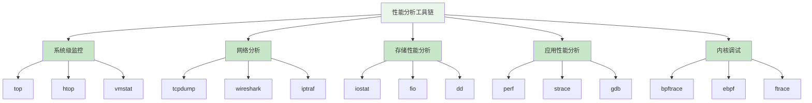

在分布式文件存储系统的开发和运维过程中，性能分析是识别瓶颈、优化系统和保障服务质量的关键环节。一个完善的性能分析工具链能够帮助工程师从多个维度深入理解系统行为，快速定位性能问题并制定有效的优化策略。

## 性能分析工具概览

分布式文件存储系统的性能分析涉及多个层面，从应用层到硬件层，每个层面都有其特定的分析工具和方法。

### 工具分类

根据分析目标和层次，性能分析工具可以分为以下几类：

1. **系统级监控工具**：用于监控整个系统的资源使用情况
2. **网络分析工具**：用于分析网络性能和通信模式
3. **存储性能工具**：专门用于分析存储I/O性能
4. **应用性能分析工具**：用于分析应用程序级别的性能
5. **内核调试工具**：用于深入分析操作系统内核行为



## 系统级监控工具

系统级监控工具提供了对整个系统资源使用情况的宏观视角，是性能分析的起点。

### top/htop

[top](file:///d:/github/blog-plateform-design/node_modules/.pnpm/neo-async@2.6.2/node_modules/neo-async/top.js) 和 htop 是最常用的系统进程监控工具，可以实时显示系统中各个进程的资源使用情况：

```bash
# 安装htop
sudo apt-get install htop

# 运行htop
htop

# 关键指标解读：
# CPU%: CPU使用率
# MEM%: 内存使用率
# VIRT: 虚拟内存大小
# RES: 物理内存使用量
# SHR: 共享内存大小
```

### vmstat

vmstat 提供了虚拟内存统计信息，对于分析系统整体性能非常有用：

```bash
# 每2秒输出一次统计信息，共输出5次
vmstat 2 5

# 输出示例解读：
# r: 运行队列中的进程数
# b: 等待I/O完成的进程数
# swpd: 使用的虚拟内存大小
# free: 空闲物理内存大小
# buff: 用作缓冲的内存大小
# cache: 用作缓存的内存大小
# si/so: 换入/换出的内存页数
# bi/bo: 从块设备接收/发送的块数
# in: 每秒中断数
# cs: 每秒上下文切换次数
# us/sy/id/wa: CPU时间分配比例
```

### iostat

iostat 是分析存储I/O性能的重要工具：

```bash
# 安装sysstat包以获取iostat
sudo apt-get install sysstat

# 显示扩展统计信息，每3秒刷新一次
iostat -x 3

# 关键指标解读：
# %util: 设备利用率（接近100%表示设备饱和）
# await: 平均I/O等待时间（毫秒）
# svctm: 平均服务时间（毫秒）
# r/s, w/s: 每秒读/写请求数
# rkB/s, wkB/s: 每秒读/写数据量（KB）
```

## 网络性能分析工具

网络是分布式文件存储系统的关键组成部分，网络性能直接影响系统的整体表现。

### tcpdump

tcpdump 是强大的命令行网络抓包工具：

```bash
# 抓取指定网卡上的所有流量
sudo tcpdump -i eth0

# 抓取特定端口的流量
sudo tcpdump -i eth0 port 8080

# 抓取特定主机的流量并保存到文件
sudo tcpdump -i eth0 host 192.168.1.100 -w capture.pcap

# 分析抓包文件
tcpdump -r capture.pcap
```

### iperf3

iperf3 用于测试网络带宽和性能：

```bash
# 服务端启动
iperf3 -s

# 客户端测试TCP带宽
iperf3 -c server_ip -t 30

# 客户端测试UDP带宽
iperf3 -c server_ip -u -b 100M

# 测试结果关键指标：
# Interval: 时间间隔
# Transfer: 传输数据量
# Bandwidth: 带宽
# Retr: TCP重传次数
# Cwnd: 拥塞窗口大小
```

## 存储性能测试工具

存储性能是分布式文件系统的核心指标，专门的测试工具可以帮助准确评估存储性能。

### fio

fio（Flexible I/O Tester）是功能强大的I/O测试工具：

```bash
# 创建fio测试配置文件
cat > fio-test.fio << EOF
[global]
ioengine=libaio
direct=1
bs=4k
size=1G
numjobs=4
runtime=60
time_based=1

[read-test]
name=read-test
rw=read
iodepth=16

[write-test]
name=write-test
rw=write
iodepth=16
EOF

# 运行测试
fio fio-test.fio

# 关键指标解读：
# IOPS: 每秒I/O操作数
# BW: 带宽
# lat (usec): 延迟（微秒）
# clat percentiles: 完成延迟百分位数
```

### dd

dd 是简单的磁盘性能测试工具：

```bash
# 测试写入性能
dd if=/dev/zero of=testfile bs=1M count=1000 oflag=direct

# 测试读取性能
dd if=testfile of=/dev/null bs=1M iflag=direct

# 同步缓存并测量时间
time dd if=/dev/zero of=testfile bs=1M count=1000 conv=fsync
```

## 应用性能分析工具

应用层性能分析工具可以直接分析应用程序的性能瓶颈。

### perf

perf 是Linux内核自带的性能分析工具：

```bash
# 安装perf
sudo apt-get install linux-tools-common linux-tools-generic

# 记录CPU性能事件
sudo perf record -g -p <pid>

# 分析记录结果
sudo perf report

# 火焰图分析
sudo perf script | stackcollapse-perf.pl | flamegraph.pl > perf.svg
```

### strace

strace 用于跟踪程序的系统调用：

```bash
# 跟踪指定进程的系统调用
strace -p <pid>

# 跟踪程序启动时的系统调用
strace -o trace.log ./my_program

# 统计系统调用次数和时间
strace -c -p <pid>

# 跟踪特定系统调用
strace -e trace=open,read,write -p <pid>
```

## 内核级分析工具

对于深入分析系统性能问题，内核级工具提供了最底层的洞察。

### bpftrace

bpftrace 是基于eBPF的高级跟踪工具：

```bash
# 安装bpftrace
sudo apt-get install bpftrace

# 跟踪文件系统操作
sudo bpftrace -e '
tracepoint:syscalls:sys_enter_open {
  printf("Opening file: %s\n", str(args->filename));
}'

# 分析I/O延迟
sudo bpftrace -e '
kprobe:vfs_read {
  @start[tid] = nsecs;
}

kretprobe:vfs_read /@start[tid]/ {
  $delta = nsecs - @start[tid];
  @read_latency = hist($delta);
  delete(@start[tid]);
}'

# 查看结果
sudo bpftrace -e 'tracepoint:block:block_rq_complete { @ = hist(args->rwbs); }'
```

### ftrace

ftrace 是Linux内核内置的跟踪工具：

```bash
# 启用ftrace
echo 1 > /sys/kernel/debug/tracing/tracing_on

# 设置跟踪函数
echo vfs_read > /sys/kernel/debug/tracing/set_ftrace_filter

# 设置跟踪器
echo function > /sys/kernel/debug/tracing/current_tracer

# 查看跟踪结果
cat /sys/kernel/debug/tracing/trace

# 禁用ftrace
echo 0 > /sys/kernel/debug/tracing/tracing_on
```

## 工具链集成与自动化

为了提高性能分析的效率，可以将多个工具集成到自动化分析流程中。

### 性能监控脚本

创建综合性能监控脚本：

```bash
#!/bin/bash
# performance_monitor.sh

# 系统信息收集
echo "=== System Information ==="
uname -a
cat /proc/cpuinfo | grep "model name" | head -1
free -h
df -h

# CPU使用情况
echo "=== CPU Usage ==="
top -bn1 | head -20

# 内存使用情况
echo "=== Memory Usage ==="
vmstat 1 5

# 网络性能
echo "=== Network Performance ==="
ifstat -i eth0 1 5

# 存储I/O
echo "=== Storage I/O ==="
iostat -x 1 5

# 应用进程
echo "=== Application Processes ==="
ps aux --sort=-%cpu | head -20
```

### 性能分析报告生成

自动生成性能分析报告：

```python
#!/usr/bin/env python3
import subprocess
import json
import datetime

class PerformanceAnalyzer:
    def __init__(self):
        self.report = {
            "timestamp": datetime.datetime.now().isoformat(),
            "system_info": {},
            "cpu_metrics": {},
            "memory_metrics": {},
            "storage_metrics": {},
            "network_metrics": {}
        }
    
    def collect_system_info(self):
        """收集系统基本信息"""
        result = subprocess.run(['uname', '-a'], capture_output=True, text=True)
        self.report["system_info"]["kernel"] = result.stdout.strip()
        
        result = subprocess.run(['lscpu'], capture_output=True, text=True)
        self.report["system_info"]["cpu"] = result.stdout
    
    def collect_cpu_metrics(self):
        """收集CPU性能指标"""
        result = subprocess.run(['top', '-bn1'], capture_output=True, text=True)
        # 解析top输出提取关键指标
        lines = result.stdout.split('\n')
        self.report["cpu_metrics"]["load_average"] = lines[0]
    
    def collect_storage_metrics(self):
        """收集存储性能指标"""
        result = subprocess.run(['iostat', '-x', '1', '2'], capture_output=True, text=True)
        self.report["storage_metrics"]["iostat"] = result.stdout
    
    def generate_report(self):
        """生成性能分析报告"""
        self.collect_system_info()
        self.collect_cpu_metrics()
        self.collect_storage_metrics()
        
        # 保存报告
        with open(f"performance_report_{datetime.datetime.now().strftime('%Y%m%d_%H%M%S')}.json", 'w') as f:
            json.dump(self.report, f, indent=2)
        
        print("Performance report generated successfully!")

if __name__ == "__main__":
    analyzer = PerformanceAnalyzer()
    analyzer.generate_report()
```

## 实践建议

在使用性能分析工具链时，建议遵循以下实践：

1. **建立基线**：在系统正常运行时建立性能基线，便于后续对比分析。
2. **多维度分析**：结合多个工具从不同维度分析性能问题。
3. **定期监控**：建立定期性能监控机制，及时发现潜在问题。
4. **自动化分析**：将常用分析流程自动化，提高效率。
5. **结果验证**：对分析结果进行验证，确保准确性。

通过合理使用性能分析工具链，可以全面了解分布式文件存储系统的性能特征，快速定位瓶颈并制定有效的优化策略。