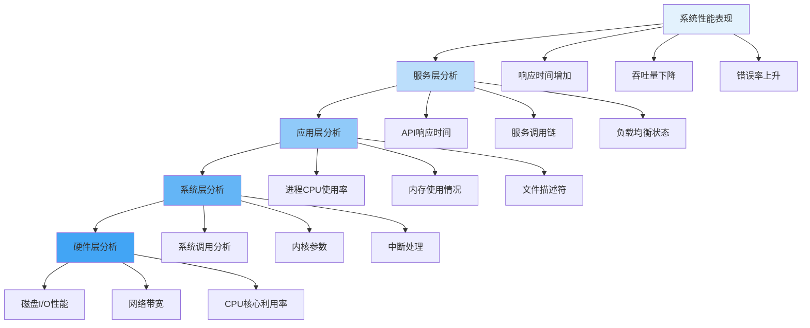
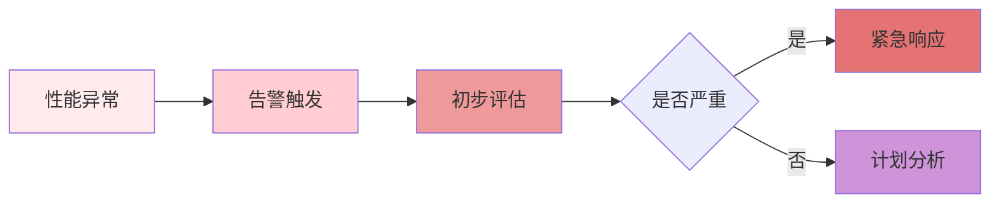

在分布式文件存储系统的运维和优化过程中，性能瓶颈的识别和定位是提升系统整体性能的关键步骤。有效的瓶颈分析需要系统化的方法论和清晰的分析路径，以确保能够快速准确地找到问题根源并制定针对性的解决方案。

## 瓶颈分析方法论

性能瓶颈分析应该遵循从宏观到微观、从整体到局部的系统化方法论。

### 自顶向下分析法

自顶向下分析法从系统整体性能表现入手，逐步深入到具体组件：



### 关键路径分析

识别系统中的关键路径，重点关注对整体性能影响最大的组件：

```python
class CriticalPathAnalyzer:
    def __init__(self, system_architecture):
        self.architecture = system_architecture
        self.performance_model = self.build_performance_model()
    
    def identify_critical_paths(self):
        """识别系统关键路径"""
        critical_paths = []
        
        # 分析数据流路径
        for data_flow in self.architecture.data_flows:
            path_latency = self.calculate_path_latency(data_flow)
            path_throughput = self.calculate_path_throughput(data_flow)
            
            # 判断是否为关键路径
            if self.is_critical_path(path_latency, path_throughput):
                critical_paths.append({
                    'path': data_flow,
                    'latency': path_latency,
                    'throughput': path_throughput,
                    'bottleneck_components': self.find_bottleneck_components(data_flow)
                })
        
        return critical_paths
    
    def calculate_path_latency(self, data_flow):
        """计算路径延迟"""
        total_latency = 0
        for component in data_flow.components:
            component_latency = self.get_component_latency(component)
            total_latency += component_latency
        
        return total_latency
    
    def find_bottleneck_components(self, data_flow):
        """找出路径中的瓶颈组件"""
        bottleneck_components = []
        max_latency = 0
        
        for component in data_flow.components:
            component_latency = self.get_component_latency(component)
            if component_latency > max_latency:
                max_latency = component_latency
                bottleneck_components = [component]
            elif component_latency == max_latency:
                bottleneck_components.append(component)
        
        return bottleneck_components
```

## 性能指标体系

建立全面的性能指标体系是进行有效瓶颈分析的基础。

### 核心性能指标

分布式文件存储系统的核心性能指标包括：

1. **延迟指标**：
   - 平均响应时间
   - P95/P99响应时间
   - 最大延迟

2. **吞吐量指标**：
   - 每秒请求数（QPS/RPS）
   - 每秒数据传输量（MB/s）
   - 并发连接数

3. **资源利用率指标**：
   - CPU使用率
   - 内存使用率
   - 磁盘I/O利用率
   - 网络带宽利用率

```yaml
# 性能指标配置示例
performance_metrics:
  latency:
    avg_response_time:
      threshold: "50ms"
      alert_level: "warning"
    p99_response_time:
      threshold: "200ms"
      alert_level: "critical"
  
  throughput:
    qps:
      threshold: "10000"
      alert_level: "info"
    bandwidth:
      threshold: "1GB/s"
      alert_level: "warning"
  
  resource_utilization:
    cpu_usage:
      threshold: "80%"
      alert_level: "warning"
    memory_usage:
      threshold: "85%"
      alert_level: "warning"
    disk_io_util:
      threshold: "90%"
      alert_level: "critical"
```

### 指标关联分析

通过关联分析不同指标之间的关系，可以更准确地定位瓶颈：

```go
type MetricCorrelationAnalyzer struct {
    metricsStore MetricsStore
    correlationThreshold float64
}

func (mca *MetricCorrelationAnalyzer) AnalyzeCorrelations() map[string][]Correlation {
    correlations := make(map[string][]Correlation)
    
    // 获取所有指标
    metrics := mca.metricsStore.GetAllMetrics()
    
    // 计算指标间的相关性
    for i, metricA := range metrics {
        for j, metricB := range metrics {
            if i >= j {
                continue
            }
            
            correlation := mca.calculateCorrelation(metricA, metricB)
            if correlation > mca.correlationThreshold {
                correlations[metricA.Name] = append(correlations[metricA.Name], Correlation{
                    Metric: metricB.Name,
                    Value: correlation,
                })
            }
        }
    }
    
    return correlations
}

func (mca *MetricCorrelationAnalyzer) calculateCorrelation(metricA, metricB Metric) float64 {
    // 计算皮尔逊相关系数
    n := len(metricA.Values)
    if n != len(metricB.Values) {
        return 0
    }
    
    sumA, sumB, sumAB := 0.0, 0.0, 0.0
    sumA2, sumB2 := 0.0, 0.0
    
    for i := 0; i < n; i++ {
        sumA += metricA.Values[i]
        sumB += metricB.Values[i]
        sumAB += metricA.Values[i] * metricB.Values[i]
        sumA2 += metricA.Values[i] * metricA.Values[i]
        sumB2 += metricB.Values[i] * metricB.Values[i]
    }
    
    numerator := float64(n)*sumAB - sumA*sumB
    denominator := math.Sqrt((float64(n)*sumA2 - sumA*sumA) * (float64(n)*sumB2 - sumB*sumB))
    
    if denominator == 0 {
        return 0
    }
    
    return numerator / denominator
}
```

## 瓶颈定位技术

针对不同类型的性能瓶颈，需要采用相应的定位技术。

### CPU瓶颈定位

CPU瓶颈通常表现为高CPU使用率和性能下降：

```bash
# 识别CPU热点
perf record -g -p <pid>
perf report

# 分析CPU使用率
top -p <pid> -H  # 按线程显示

# 检查上下文切换
vmstat 1 10
cat /proc/<pid>/status | grep ctxt

# 分析系统调用
strace -c -p <pid>
```

### 内存瓶颈定位

内存瓶颈可能导致系统性能下降甚至OOM：

```bash
# 监控内存使用情况
watch -n 1 'free -h'

# 分析进程内存使用
pmap -x <pid>
cat /proc/<pid>/smaps

# 检查内存泄漏
valgrind --tool=memcheck ./my_program

# 分析内存分配
perf record -e page-faults -g ./my_program
```

### I/O瓶颈定位

I/O瓶颈是存储系统中最常见的性能问题：

```bash
# 监控磁盘I/O
iostat -x 1
iotop -p <pid>

# 分析I/O等待
vmstat 1 10
sar -d 1 10

# 检查文件系统性能
fio --name=read_test --rw=read --bs=4k --size=1g --numjobs=4 --direct=1 --runtime=60
```

### 网络瓶颈定位

网络瓶颈会影响分布式系统的整体性能：

```bash
# 监控网络流量
iftop -i eth0
nethogs

# 分析网络延迟
ping -c 10 <target_host>
mtr <target_host>

# 检查网络连接
ss -tuln
netstat -an | grep :<port>
```

## 瓶颈分析流程

建立标准化的瓶颈分析流程可以提高问题定位的效率：

### 问题发现阶段



### 深度分析阶段

```python
class BottleneckAnalysisWorkflow:
    def __init__(self, incident_id):
        self.incident_id = incident_id
        self.analysis_steps = []
        self.findings = []
    
    def execute_analysis(self):
        """执行完整的瓶颈分析流程"""
        # 步骤1: 现象确认
        self.confirm_symptoms()
        
        # 步骤2: 数据收集
        self.collect_performance_data()
        
        # 步骤3: 初步分析
        self.preliminary_analysis()
        
        # 步骤4: 深度诊断
        self.deep_dive_diagnosis()
        
        # 步骤5: 根因定位
        self.identify_root_cause()
        
        # 步骤6: 解决方案制定
        self.propose_solutions()
        
        # 步骤7: 验证与总结
        self.verify_and_document()
    
    def confirm_symptoms(self):
        """确认性能问题现象"""
        symptoms = {
            'response_time': self.measure_response_time(),
            'throughput': self.measure_throughput(),
            'error_rate': self.measure_error_rate(),
            'resource_usage': self.measure_resource_usage()
        }
        
        self.analysis_steps.append({
            'step': 'symptom_confirmation',
            'data': symptoms,
            'timestamp': datetime.now()
        })
    
    def collect_performance_data(self):
        """收集性能数据"""
        data_collectors = [
            SystemMetricsCollector(),
            ApplicationMetricsCollector(),
            NetworkMetricsCollector(),
            StorageMetricsCollector()
        ]
        
        collected_data = {}
        for collector in data_collectors:
            collected_data[collector.name] = collector.collect()
        
        self.analysis_steps.append({
            'step': 'data_collection',
            'data': collected_data,
            'timestamp': datetime.now()
        })
```

### 解决方案验证阶段

```javascript
class SolutionValidator {
    constructor(baselineMetrics) {
        this.baseline = baselineMetrics;
    }
    
    validateSolution(solution, testDuration = 300) {
        // 应用解决方案
        this.applySolution(solution);
        
        // 等待系统稳定
        this.waitForStabilization(60);
        
        // 收集验证数据
        const validationData = this.collectMetrics(testDuration);
        
        // 对比基线数据
        const comparison = this.compareWithBaseline(validationData);
        
        // 生成验证报告
        return this.generateValidationReport(comparison);
    }
    
    compareWithBaseline(currentMetrics) {
        const comparison = {};
        
        for (const [metricName, currentValue] of Object.entries(currentMetrics)) {
            const baselineValue = this.baseline[metricName];
            const improvement = ((baselineValue - currentValue) / baselineValue) * 100;
            
            comparison[metricName] = {
                baseline: baselineValue,
                current: currentValue,
                improvement: improvement,
                status: improvement > 0 ? 'improved' : 'degraded'
            };
        }
        
        return comparison;
    }
}
```

## 实践建议

在进行瓶颈分析时，建议遵循以下实践：

1. **建立监控基线**：在系统正常运行时建立性能基线，便于对比分析。
2. **保持客观**：基于数据进行分析，避免主观臆断。
3. **系统化思考**：考虑各组件之间的相互影响，避免局部优化。
4. **记录分析过程**：详细记录分析过程和发现，便于知识传承。
5. **持续改进**：将分析结果反馈到系统设计和优化中。

通过系统化的瓶颈分析方法，可以快速准确地定位分布式文件存储系统的性能问题，为系统优化提供有力支撑。