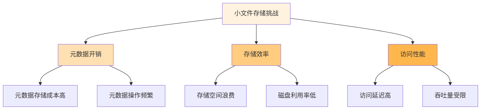

在分布式文件存储系统的实际应用中，小文件问题和大规模并发读写是两个最常见的性能挑战。这些问题不仅影响系统的整体性能，还可能导致资源浪费和用户体验下降。针对性的优化策略对于解决这些特定场景下的性能瓶颈至关重要。

## 小文件优化策略

小文件问题在分布式存储系统中普遍存在，由于元数据开销相对较大，小文件的存储和访问效率往往较低。

### 小文件问题分析

小文件问题的核心在于元数据与数据的比例失衡：



### 小文件合并策略

通过将多个小文件合并为大文件来减少元数据开销：

```python
class SmallFileMerger:
    def __init__(self, chunk_size=4*1024*1024):  # 4MB chunks
        self.chunk_size = chunk_size
        self.merged_files = {}
    
    def merge_small_files(self, small_files, target_container):
        """将小文件合并为大文件"""
        merged_data = bytearray()
        file_index = []
        current_offset = 0
        
        for file_info in small_files:
            # 读取小文件内容
            file_content = self.read_file(file_info.path)
            
            # 记录文件在合并文件中的位置信息
            file_entry = {
                'name': file_info.name,
                'offset': current_offset,
                'size': len(file_content),
                'metadata': file_info.metadata
            }
            file_index.append(file_entry)
            
            # 添加到合并数据中
            merged_data.extend(file_content)
            current_offset += len(file_content)
            
            # 如果合并数据达到chunk大小，写入存储
            if len(merged_data) >= self.chunk_size:
                self.write_merged_chunk(merged_data, file_index, target_container)
                merged_data = bytearray()
                file_index = []
                current_offset = 0
        
        # 处理剩余数据
        if len(merged_data) > 0:
            self.write_merged_chunk(merged_data, file_index, target_container)
    
    def write_merged_chunk(self, data, index, container):
        """写入合并后的数据块"""
        chunk_id = self.generate_chunk_id()
        chunk_metadata = {
            'id': chunk_id,
            'size': len(data),
            'files': index,
            'created_at': datetime.now()
        }
        
        # 写入数据
        self.storage_client.write_data(container, f"chunk_{chunk_id}", data)
        
        # 写入元数据
        self.metadata_store.save_chunk_metadata(chunk_metadata)
```

### 元数据优化

优化元数据存储和访问方式：

```go
type MetadataOptimizer struct {
    metadataCache *lru.Cache
    batchProcessor *BatchProcessor
    compressionEnabled bool
}

func (mo *MetadataOptimizer) OptimizeMetadataAccess(fileIDs []string) ([]*FileInfo, error) {
    var results []*FileInfo
    var cacheMisses []string
    
    // 首先从缓存中查找
    for _, fileID := range fileIDs {
        if cachedMetadata, ok := mo.metadataCache.Get(fileID); ok {
            results = append(results, cachedMetadata.(*FileInfo))
        } else {
            cacheMisses = append(cacheMisses, fileID)
        }
    }
    
    // 批量获取缓存未命中的元数据
    if len(cacheMisses) > 0 {
        batchMetadata, err := mo.batchGetMetadata(cacheMisses)
        if err != nil {
            return nil, err
        }
        
        // 缓存批量获取的元数据
        for _, metadata := range batchMetadata {
            mo.metadataCache.Add(metadata.ID, metadata)
            results = append(results, metadata)
        }
    }
    
    return results, nil
}

func (mo *MetadataOptimizer) batchGetMetadata(fileIDs []string) ([]*FileInfo, error) {
    // 使用批量查询减少数据库访问次数
    query := "SELECT * FROM file_metadata WHERE id IN (?)"
    rows, err := mo.db.Query(query, fileIDs)
    if err != nil {
        return nil, err
    }
    defer rows.Close()
    
    var results []*FileInfo
    for rows.Next() {
        var fileInfo FileInfo
        err := rows.Scan(&fileInfo.ID, &fileInfo.Name, &fileInfo.Size, &fileInfo.CreatedAt)
        if err != nil {
            return nil, err
        }
        
        // 压缩元数据以减少存储空间
        if mo.compressionEnabled {
            fileInfo = mo.compressMetadata(fileInfo)
        }
        
        results = append(results, &fileInfo)
    }
    
    return results, nil
}
```

### 目录结构优化

优化目录结构以提高小文件访问效率：

```yaml
# 目录结构优化配置
directory_optimization:
  # 使用哈希分布避免目录过深
  hash_based_structure:
    enabled: true
    levels: 2
    hash_length: 4
  
  # 目录分片策略
  sharding_strategy:
    type: "consistent_hashing"
    virtual_nodes: 1000
  
  # 目录缓存配置
  cache_config:
    max_entries: 100000
    ttl: "1h"
    eviction_policy: "lru"
```

## 大规模并发读写优化

大规模并发访问是分布式存储系统面临的另一个重要挑战，需要从多个维度进行优化。

### 并发控制机制

合理的并发控制机制可以提高系统吞吐量并保证数据一致性：

```java
public class ConcurrencyOptimizer {
    private final Semaphore readSemaphore;
    private final Semaphore writeSemaphore;
    private final ReadWriteLock rwLock;
    
    public ConcurrencyOptimizer(int maxReaders, int maxWriters) {
        this.readSemaphore = new Semaphore(maxReaders);
        this.writeSemaphore = new Semaphore(maxWriters);
        this.rwLock = new ReentrantReadWriteLock();
    }
    
    public <T> T executeReadOperation(Supplier<T> operation) throws Exception {
        readSemaphore.acquire();
        rwLock.readLock().lock();
        
        try {
            return operation.get();
        } finally {
            rwLock.readLock().unlock();
            readSemaphore.release();
        }
    }
    
    public <T> T executeWriteOperation(Supplier<T> operation) throws Exception {
        writeSemaphore.acquire();
        rwLock.writeLock().lock();
        
        try {
            return operation.get();
        } finally {
            rwLock.writeLock().unlock();
            writeSemaphore.release();
        }
    }
    
    // 自适应并发控制
    public void adjustConcurrency(int currentLoad) {
        int newMaxReaders = calculateOptimalReaders(currentLoad);
        int newMaxWriters = calculateOptimalWriters(currentLoad);
        
        // 动态调整信号量
        adjustSemaphorePermits(readSemaphore, newMaxReaders);
        adjustSemaphorePermits(writeSemaphore, newMaxWriters);
    }
}
```

### 缓存优化策略

多层缓存架构可以显著提升并发访问性能：

```javascript
class MultiLevelCache {
    constructor(config) {
        this.l1Cache = new LRUCache(config.l1.size);  // 内存缓存
        this.l2Cache = new RedisCache(config.l2);     // 分布式缓存
        this.l3Cache = new DiskCache(config.l3);      // 磁盘缓存
        
        this.cacheStats = {
            l1: { hits: 0, misses: 0 },
            l2: { hits: 0, misses: 0 },
            l3: { hits: 0, misses: 0 }
        };
    }
    
    async get(key) {
        // L1缓存查找
        let value = this.l1Cache.get(key);
        if (value !== undefined) {
            this.cacheStats.l1.hits++;
            return value;
        }
        this.cacheStats.l1.misses++;
        
        // L2缓存查找
        value = await this.l2Cache.get(key);
        if (value !== undefined) {
            this.cacheStats.l2.hits++;
            // 提升到L1缓存
            this.l1Cache.set(key, value);
            return value;
        }
        this.cacheStats.l2.misses++;
        
        // L3缓存查找
        value = await this.l3Cache.get(key);
        if (value !== undefined) {
            this.cacheStats.l3.hits++;
            // 提升到L1和L2缓存
            this.l1Cache.set(key, value);
            await this.l2Cache.set(key, value);
            return value;
        }
        this.cacheStats.l3.misses++;
        
        return undefined;
    }
    
    async set(key, value, ttl) {
        // 同时写入所有缓存层
        this.l1Cache.set(key, value, ttl);
        await this.l2Cache.set(key, value, ttl);
        await this.l3Cache.set(key, value, ttl);
    }
}
```

### 负载均衡优化

智能负载均衡可以有效分散并发请求压力：

```python
class LoadBalancer:
    def __init__(self, servers):
        self.servers = servers
        self.server_stats = {server: {'load': 0, 'latency': 0} for server in servers}
        self.algorithm = self.select_algorithm()
    
    def select_server(self, request):
        """根据负载情况选择服务器"""
        if self.algorithm == 'least_connection':
            return self.least_connection()
        elif self.algorithm == 'weighted_round_robin':
            return self.weighted_round_robin()
        elif self.algorithm == 'adaptive':
            return self.adaptive_load_balancing()
        else:
            return self.random_selection()
    
    def adaptive_load_balancing(self):
        """自适应负载均衡"""
        best_server = None
        best_score = float('inf')
        
        for server in self.servers:
            stats = self.server_stats[server]
            # 计算综合评分（考虑连接数和延迟）
            score = stats['load'] * 0.7 + stats['latency'] * 0.3
            
            if score < best_score:
                best_score = score
                best_server = server
        
        return best_server
    
    def update_server_stats(self, server, response_time, success=True):
        """更新服务器统计信息"""
        if server in self.server_stats:
            stats = self.server_stats[server]
            stats['latency'] = (stats['latency'] * 0.9 + response_time * 0.1)
            
            if success:
                stats['load'] = max(0, stats['load'] - 1)
            else:
                stats['load'] += 1
```

### 异步处理优化

异步处理可以提高系统的并发处理能力：

```rust
use tokio::sync::mpsc;
use std::sync::Arc;

struct AsyncProcessor {
    task_queue: mpsc::Sender<Task>,
    worker_count: usize,
}

impl AsyncProcessor {
    pub fn new(worker_count: usize) -> Self {
        let (sender, mut receiver) = mpsc::channel::<Task>(1000);
        
        // 启动工作线程
        for i in 0..worker_count {
            let receiver = receiver.clone();
            tokio::spawn(async move {
                Self::worker_loop(receiver, i).await;
            });
        }
        
        Self {
            task_queue: sender,
            worker_count,
        }
    }
    
    async fn worker_loop(mut receiver: mpsc::Receiver<Task>, worker_id: usize) {
        while let Some(task) = receiver.recv().await {
            // 异步处理任务
            match Self::process_task(task).await {
                Ok(result) => {
                    // 处理成功
                    log::info!("Worker {} processed task successfully", worker_id);
                }
                Err(e) => {
                    // 处理失败，可能需要重试
                    log::error!("Worker {} failed to process task: {}", worker_id, e);
                }
            }
        }
    }
    
    pub async fn submit_task(&self, task: Task) -> Result<(), Box<dyn std::error::Error>> {
        self.task_queue.send(task).await?;
        Ok(())
    }
    
    async fn process_task(task: Task) -> Result<TaskResult, Box<dyn std::error::Error>> {
        // 模拟异步处理
        tokio::time::sleep(tokio::time::Duration::from_millis(100)).await;
        
        // 实际的任务处理逻辑
        let result = task.execute().await?;
        Ok(result)
    }
}
```

## 性能监控与调优验证

建立完善的监控体系来验证优化效果：

### 性能指标监控

```yaml
# 小文件优化监控指标
small_file_metrics:
  - name: "small_file_merge_ratio"
    description: "小文件合并比例"
    type: "gauge"
    threshold: "> 0.8"
  
  - name: "metadata_operation_latency"
    description: "元数据操作延迟"
    type: "histogram"
    threshold: "< 10ms"
  
  - name: "small_file_access_throughput"
    description: "小文件访问吞吐量"
    type: "gauge"
    threshold: "> 10000 ops/s"

# 并发优化监控指标
concurrency_metrics:
  - name: "concurrent_request_count"
    description: "并发请求数"
    type: "gauge"
    threshold: "< max_concurrent_limit"
  
  - name: "cache_hit_ratio"
    description: "缓存命中率"
    type: "gauge"
    threshold: "> 0.9"
  
  - name: "average_response_time"
    description: "平均响应时间"
    type: "histogram"
    threshold: "< 50ms"
```

### A/B测试验证

通过A/B测试验证优化效果：

```python
class OptimizationValidator:
    def __init__(self):
        self.baseline_metrics = {}
        self.optimized_metrics = {}
    
    def run_ab_test(self, duration_hours=24):
        """运行A/B测试验证优化效果"""
        # 分割流量
        traffic_splitter = TrafficSplitter(0.5)  # 50%流量用于测试
        
        # 收集基线数据
        baseline_collector = MetricsCollector("baseline")
        optimized_collector = MetricsCollector("optimized")
        
        # 运行测试
        start_time = datetime.now()
        end_time = start_time + timedelta(hours=duration_hours)
        
        while datetime.now() < end_time:
            # 收集指标数据
            baseline_metrics = baseline_collector.collect()
            optimized_metrics = optimized_collector.collect()
            
            time.sleep(60)  # 每分钟收集一次
        
        # 分析结果
        return self.analyze_results(baseline_metrics, optimized_metrics)
    
    def analyze_results(self, baseline, optimized):
        """分析A/B测试结果"""
        improvements = {}
        
        for metric_name in baseline.keys():
            baseline_value = baseline[metric_name]
            optimized_value = optimized[metric_name]
            
            if baseline_value > 0:
                improvement = (optimized_value - baseline_value) / baseline_value * 100
                improvements[metric_name] = {
                    'baseline': baseline_value,
                    'optimized': optimized_value,
                    'improvement': improvement,
                    'significant': abs(improvement) > 5  # 5%以上的改进认为是显著的
                }
        
        return improvements
```

## 实践建议

在进行针对性优化时，建议遵循以下实践：

1. **问题优先级排序**：根据业务影响程度确定优化优先级。
2. **渐进式优化**：采用小步快跑的方式逐步优化，避免一次性大规模变更。
3. **数据驱动决策**：基于实际性能数据制定优化策略。
4. **全面测试验证**：在生产环境部署前进行充分的测试验证。
5. **持续监控改进**：建立持续监控机制，及时发现新的性能问题。

通过针对性的优化策略，可以有效解决小文件问题和大规模并发访问挑战，显著提升分布式文件存储系统的性能和用户体验。