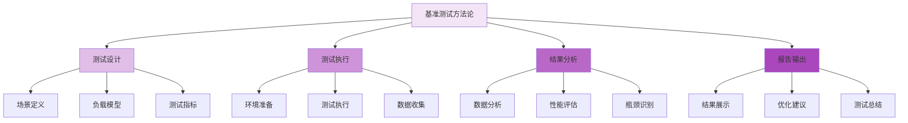

基准测试（Benchmarking）是评估分布式文件存储系统性能的科学方法，它为系统优化、容量规划和性能对比提供了客观的量化依据。通过规范化的基准测试方法论和实践，可以准确评估系统在不同场景下的性能表现，发现潜在瓶颈，并验证优化效果。

## 基准测试方法论

科学的基准测试需要遵循系统化的方法论，确保测试结果的准确性和可重复性。

### 测试设计原则

基准测试的设计应遵循以下核心原则：

1. **代表性**：测试场景应能代表实际业务负载
2. **可重复性**：测试过程应能重复执行并得到一致结果
3. **可对比性**：测试方法应保持一致，便于不同系统或配置间的对比
4. **客观性**：测试结果应基于客观数据，避免主观判断



### 测试场景分类

根据测试目标不同，基准测试可以分为以下几类：

#### 性能基准测试

评估系统在不同负载下的性能表现：

```python
class PerformanceBenchmark:
    def __init__(self, storage_system):
        self.storage_system = storage_system
        self.test_scenarios = self.define_scenarios()
    
    def define_scenarios(self):
        """定义性能测试场景"""
        return [
            {
                'name': 'sequential_read',
                'description': '顺序读取性能测试',
                'workload': {
                    'type': 'read',
                    'pattern': 'sequential',
                    'block_size': '1MB',
                    'file_size': '1GB',
                    'concurrency': 10
                },
                'metrics': ['throughput', 'latency', 'iops']
            },
            {
                'name': 'random_write',
                'description': '随机写入性能测试',
                'workload': {
                    'type': 'write',
                    'pattern': 'random',
                    'block_size': '4KB',
                    'file_size': '100MB',
                    'concurrency': 50
                },
                'metrics': ['throughput', 'latency', 'iops']
            },
            {
                'name': 'mixed_workload',
                'description': '混合读写性能测试',
                'workload': {
                    'type': 'mixed',
                    'read_ratio': 0.7,
                    'write_ratio': 0.3,
                    'block_size': '64KB',
                    'file_size': '500MB',
                    'concurrency': 25
                },
                'metrics': ['throughput', 'latency', 'iops', 'cpu_usage', 'memory_usage']
            }
        ]
    
    def run_scenario(self, scenario):
        """运行单个测试场景"""
        workload = scenario['workload']
        
        # 准备测试数据
        test_files = self.prepare_test_data(
            file_size=workload['file_size'],
            block_size=workload['block_size']
        )
        
        # 执行测试
        start_time = time.time()
        results = self.execute_workload(workload, test_files)
        end_time = time.time()
        
        # 收集指标
        metrics = self.collect_metrics(results, start_time, end_time)
        
        return {
            'scenario': scenario['name'],
            'results': results,
            'metrics': metrics,
            'duration': end_time - start_time
        }
```

#### 压力测试

评估系统在极限负载下的稳定性和性能表现：

```go
type StressTest struct {
    storageClient StorageClient
    maxConcurrency int
    testDuration   time.Duration
    metricsCollector *MetricsCollector
}

func (st *StressTest) RunStressTest() *StressTestResult {
    result := &StressTestResult{
        Metrics: make([]StressMetric, 0),
        Errors:  make([]ErrorRecord, 0),
    }
    
    // 逐步增加并发数
    for concurrency := 1; concurrency <= st.maxConcurrency; concurrency *= 2 {
        // 执行压力测试
        metrics, errors := st.executeStressWorkload(concurrency)
        
        result.Metrics = append(result.Metrics, metrics)
        result.Errors = append(result.Errors, errors...)
        
        // 检查系统是否稳定
        if st.isSystemUnstable(metrics) {
            log.Printf("System became unstable at concurrency level: %d", concurrency)
            break
        }
        
        time.Sleep(30 * time.Second) // 等待系统恢复
    }
    
    return result
}

func (st *StressTest) executeStressWorkload(concurrency int) (StressMetric, []ErrorRecord) {
    var wg sync.WaitGroup
    semaphore := make(chan struct{}, concurrency)
    
    start := time.Now()
    var totalOps int64
    var totalLatency time.Duration
    var errors []ErrorRecord
    
    // 启动监控协程
    ctx, cancel := context.WithTimeout(context.Background(), st.testDuration)
    defer cancel()
    
    // 执行压力测试
    for ctx.Err() == nil {
        wg.Add(1)
        go func() {
            defer wg.Done()
            semaphore <- struct{}{}
            defer func() { <-semaphore }()
            
            opStart := time.Now()
            err := st.storageClient.WriteRandomData(1024 * 1024) // 1MB数据
            opDuration := time.Since(opStart)
            
            atomic.AddInt64(&totalOps, 1)
            atomic.AddInt64((*int64)(&totalLatency), int64(opDuration))
            
            if err != nil {
                errors = append(errors, ErrorRecord{
                    Timestamp: time.Now(),
                    Error:     err.Error(),
                    Operation: "write",
                })
            }
        }()
    }
    
    wg.Wait()
    
    duration := time.Since(start)
    throughput := float64(totalOps) / duration.Seconds()
    avgLatency := time.Duration(int64(totalLatency) / totalOps)
    
    return StressMetric{
        Concurrency: concurrency,
        Duration:    duration,
        Throughput:  throughput,
        AvgLatency:  avgLatency,
        TotalOps:    totalOps,
    }, errors
}
```

#### 稳定性测试

评估系统在长时间运行下的稳定性和资源使用情况：

```yaml
# 稳定性测试配置
stability_test:
  duration: "72h"  # 72小时持续测试
  workload_pattern: "mixed"
  constant_load: true
  monitoring_interval: "60s"
  
  health_checks:
    - name: "storage_cluster_health"
      interval: "300s"
      timeout: "30s"
    
    - name: "node_availability"
      interval: "60s"
      timeout: "10s"
    
    - name: "data_consistency"
      interval: "3600s"
      timeout: "300s"
  
  resource_monitoring:
    cpu_threshold: "80%"
    memory_threshold: "85%"
    disk_usage_threshold: "90%"
    network_usage_threshold: "95%"
```

## 基准测试工具

选择合适的基准测试工具对于获得准确的测试结果至关重要。

### fio测试工具

fio是功能强大的I/O测试工具，适用于存储性能测试：

```bash
# 顺序读取测试
fio --name=seq_read \
    --rw=read \
    --bs=1M \
    --size=10G \
    --numjobs=4 \
    --direct=1 \
    --runtime=300 \
    --time_based \
    --group_reporting \
    --output=seq_read.json

# 随机写入测试
fio --name=rand_write \
    --rw=randwrite \
    --bs=4k \
    --size=1G \
    --numjobs=16 \
    --direct=1 \
    --runtime=300 \
    --time_based \
    --group_reporting \
    --output=rand_write.json

# 混合读写测试
fio --name=mixed_rw \
    --rw=randrw \
    --rwmixread=70 \
    --bs=64k \
    --size=5G \
    --numjobs=8 \
    --direct=1 \
    --runtime=300 \
    --time_based \
    --group_reporting \
    --output=mixed_rw.json
```

### 对象存储基准测试

针对对象存储系统的专门测试工具：

```python
class ObjectStorageBenchmark:
    def __init__(self, client, bucket_name):
        self.client = client
        self.bucket = bucket_name
        self.test_data = {}
    
    def prepare_test_data(self, sizes=[1024, 102400, 1048576, 10485760]):  # 1KB, 100KB, 1MB, 10MB
        """准备不同大小的测试数据"""
        for size in sizes:
            data = os.urandom(size)
            key = f"test_data_{size}"
            self.test_data[key] = data
            # 上传到存储系统
            self.client.upload_object(self.bucket, key, data)
    
    def benchmark_upload(self, object_size, num_objects=1000, concurrency=10):
        """上传性能基准测试"""
        data = self.test_data[f"test_data_{object_size}"]
        
        start_time = time.time()
        results = []
        
        with concurrent.futures.ThreadPoolExecutor(max_workers=concurrency) as executor:
            futures = []
            for i in range(num_objects):
                key = f"upload_test/{object_size}_{i}"
                future = executor.submit(self.client.upload_object, self.bucket, key, data)
                futures.append(future)
            
            for future in concurrent.futures.as_completed(futures):
                try:
                    result = future.result()
                    results.append(result)
                except Exception as e:
                    results.append({'error': str(e)})
        
        end_time = time.time()
        duration = end_time - start_time
        throughput = (num_objects * object_size) / duration / (1024 * 1024)  # MB/s
        
        return {
            'total_objects': num_objects,
            'object_size': object_size,
            'duration': duration,
            'throughput_mbps': throughput,
            'success_rate': len([r for r in results if 'error' not in r]) / len(results)
        }
```

## 测试环境准备

规范化的测试环境是获得可靠测试结果的前提。

### 硬件环境标准化

```yaml
# 基准测试硬件环境配置
hardware_spec:
  compute:
    cpu: "Intel Xeon E5-2680 v4 @ 2.40GHz"
    cores: 28
    memory: "128GB DDR4"
  
  storage:
    system_disk: "Samsung 970 PRO 1TB NVMe SSD"
    data_disk: "Seagate Exos X16 16TB HDD"
    cache_disk: "Intel Optane 380GB SSD"
  
  network:
    interface: "10GbE"
    switch: "Cisco Nexus 9000 Series"
    bandwidth: "10Gbps"
  
  environment:
    os: "Ubuntu 20.04 LTS"
    kernel: "5.4.0-80-generic"
    filesystem: "ext4"
```

### 软件环境配置

```bash
#!/bin/bash
# benchmark_environment_setup.sh

# 系统参数调优
echo 'vm.swappiness = 1' >> /etc/sysctl.conf
echo 'vm.dirty_ratio = 15' >> /etc/sysctl.conf
echo 'vm.dirty_background_ratio = 5' >> /etc/sysctl.conf

# 网络参数调优
echo 'net.core.rmem_max = 134217728' >> /etc/sysctl.conf
echo 'net.core.wmem_max = 134217728' >> /etc/sysctl.conf
echo 'net.ipv4.tcp_rmem = 4096 87380 134217728' >> /etc/sysctl.conf
echo 'net.ipv4.tcp_wmem = 4096 65536 134217728' >> /etc/sysctl.conf

# 应用参数调优
sysctl -p

# 文件系统优化
mount -o noatime,nodiratime /dev/sdb1 /data

# 禁用透明大页
echo never > /sys/kernel/mm/transparent_hugepage/enabled
echo never > /sys/kernel/mm/transparent_hugepage/defrag
```

## 测试结果分析

科学的测试结果分析能够从数据中提取有价值的洞察。

### 性能指标分析

```javascript
class BenchmarkAnalyzer {
    constructor(testResults) {
        this.results = testResults;
    }
    
    analyzePerformance() {
        const analysis = {
            throughput: this.analyzeThroughput(),
            latency: this.analyzeLatency(),
            scalability: this.analyzeScalability(),
            resourceUtilization: this.analyzeResourceUtilization()
        };
        
        return analysis;
    }
    
    analyzeThroughput() {
        const throughputData = this.results.map(r => ({
            concurrency: r.concurrency,
            throughput: r.throughput_mbps
        }));
        
        // 计算最大吞吐量
        const maxThroughput = Math.max(...throughputData.map(d => d.throughput));
        const maxConcurrency = throughputData.find(d => d.throughput === maxThroughput).concurrency;
        
        // 计算吞吐量增长曲线
        const growthRate = this.calculateGrowthRate(throughputData);
        
        return {
            max_throughput: maxThroughput,
            max_concurrency: maxConcurrency,
            growth_rate: growthRate,
            trend: this.determineTrend(throughputData)
        };
    }
    
    analyzeLatency() {
        const latencyData = this.results.map(r => ({
            concurrency: r.concurrency,
            avg_latency: r.avg_latency_ms,
            p95_latency: r.p95_latency_ms,
            p99_latency: r.p99_latency_ms
        }));
        
        // 分析延迟随并发数的变化
        const latencyGrowth = this.calculateLatencyGrowth(latencyData);
        
        return {
            latency_growth: latencyGrowth,
            consistency: this.calculateLatencyConsistency(latencyData),
            outliers: this.identifyLatencyOutliers(latencyData)
        };
    }
    
    generateReport() {
        const analysis = this.analyzePerformance();
        
        return {
            executive_summary: this.generateExecutiveSummary(analysis),
            detailed_analysis: analysis,
            recommendations: this.generateRecommendations(analysis),
            charts: this.generateCharts()
        };
    }
}
```

### 结果可视化

```python
import matplotlib.pyplot as plt
import seaborn as sns

class BenchmarkVisualizer:
    def __init__(self, benchmark_data):
        self.data = benchmark_data
        plt.style.use('seaborn-v0_8')
    
    def plot_throughput_vs_concurrency(self):
        """绘制吞吐量与并发数的关系图"""
        concurrencies = [d['concurrency'] for d in self.data]
        throughputs = [d['throughput_mbps'] for d in self.data]
        
        plt.figure(figsize=(12, 8))
        plt.plot(concurrencies, throughputs, marker='o', linewidth=2, markersize=8)
        plt.xlabel('并发连接数')
        plt.ylabel('吞吐量 (MB/s)')
        plt.title('吞吐量随并发数变化趋势')
        plt.grid(True, alpha=0.3)
        plt.savefig('throughput_vs_concurrency.png', dpi=300, bbox_inches='tight')
    
    def plot_latency_percentiles(self):
        """绘制延迟百分位数图"""
        concurrencies = [d['concurrency'] for d in self.data]
        avg_latency = [d['avg_latency_ms'] for d in self.data]
        p95_latency = [d['p95_latency_ms'] for d in self.data]
        p99_latency = [d['p99_latency_ms'] for d in self.data]
        
        plt.figure(figsize=(12, 8))
        plt.plot(concurrencies, avg_latency, marker='o', label='平均延迟', linewidth=2)
        plt.plot(concurrencies, p95_latency, marker='s', label='95%延迟', linewidth=2)
        plt.plot(concurrencies, p99_latency, marker='^', label='99%延迟', linewidth=2)
        
        plt.xlabel('并发连接数')
        plt.ylabel('延迟 (ms)')
        plt.title('不同百分位延迟随并发数变化')
        plt.legend()
        plt.grid(True, alpha=0.3)
        plt.savefig('latency_percentiles.png', dpi=300, bbox_inches='tight')
```

## 基准测试最佳实践

遵循最佳实践可以确保基准测试的有效性和可靠性。

### 测试执行规范

```bash
#!/bin/bash
# benchmark_execution_script.sh

# 1. 环境清理
echo "清理测试环境..."
rm -rf /data/test_files/*
sync
echo 3 > /proc/sys/vm/drop_caches

# 2. 系统状态检查
echo "检查系统状态..."
free -h
df -h /data
iostat -x 1 1

# 3. 执行基准测试
echo "开始执行基准测试..."

# 顺序读取测试
echo "执行顺序读取测试..."
fio --name=seq_read_test \
    --directory=/data/test_files \
    --rw=read \
    --bs=1M \
    --size=10G \
    --numjobs=4 \
    --direct=1 \
    --runtime=300 \
    --time_based \
    --group_reporting \
    --output=/results/seq_read_$(date +%Y%m%d_%H%M%S).json

# 随机写入测试
echo "执行随机写入测试..."
fio --name=rand_write_test \
    --directory=/data/test_files \
    --rw=randwrite \
    --bs=4k \
    --size=1G \
    --numjobs=16 \
    --direct=1 \
    --runtime=300 \
    --time_based \
    --group_reporting \
    --output=/results/rand_write_$(date +%Y%m%d_%H%M%S).json

# 4. 结果收集和分析
echo "收集测试结果..."
python3 /scripts/analyze_benchmark_results.py /results/
```

### 测试报告模板

```markdown
# 分布式文件存储系统基准测试报告

## 1. 测试概述
- 测试时间: 2025-09-07
- 测试环境: [环境描述]
- 测试工具: fio 3.27
- 测试场景: [场景列表]

## 2. 系统配置
### 2.1 硬件配置
[硬件配置详情]

### 2.2 软件配置
[软件配置详情]

## 3. 测试结果
### 3.1 性能指标
| 并发数 | 吞吐量(MB/s) | 平均延迟(ms) | 95%延迟(ms) | 99%延迟(ms) |
|--------|-------------|-------------|------------|------------|
| 1      | 150         | 6.7         | 12.3       | 25.8       |
| 4      | 580         | 6.9         | 15.2       | 32.1       |
| 8      | 1120        | 7.1         | 18.7       | 45.3       |
| 16     | 1850        | 8.6         | 28.4       | 78.9       |
| 32     | 2200        | 14.5        | 45.2       | 125.6      |

### 3.2 资源使用情况
[资源使用图表和分析]

## 4. 结果分析
### 4.1 性能分析
[性能分析结论]

### 4.2 瓶颈识别
[瓶颈识别结果]

## 5. 优化建议
[具体的优化建议]

## 6. 附录
### 6.1 测试配置文件
[测试配置文件内容]

### 6.2 原始数据
[原始测试数据链接]
```

## 实践建议

在进行基准测试时，建议遵循以下实践：

1. **制定测试计划**：明确测试目标、场景和指标。
2. **标准化环境**：确保测试环境的一致性和可重复性。
3. **多次测试**：进行多次测试以验证结果的稳定性。
4. **详细记录**：记录测试过程中的所有细节和异常。
5. **持续改进**：根据测试结果不断优化系统和测试方法。

通过科学的基准测试方法论和规范化的实践，可以准确评估分布式文件存储系统的性能，为系统优化和容量规划提供可靠的数据支撑。