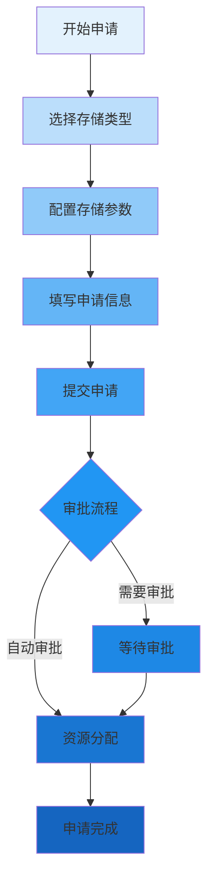

在多租户分布式文件存储平台中，为租户提供直观、高效的自助服务体验是提升用户满意度和降低运维成本的关键。从租户视角出发，平台需要提供便捷的资源申请流程、清晰的配额展示和深入的用量分析功能，让租户能够自主管理其存储资源。

## 自助申请流程设计

自助申请功能是租户获取存储资源的主要途径，需要设计简洁明了的申请流程。

### 申请向导设计



### 存储类型选择

为不同需求的租户提供多样化的存储类型选择：

```typescript
interface StorageType {
    id: string;
    name: string;
    description: string;
    performanceLevel: 'high' | 'medium' | 'low';
    durability: number; // 99.9% - 99.9999%
    cost: number; // 相对成本
    features: string[];
}

class StorageTypeSelector {
    private storageTypes: StorageType[] = [
        {
            id: 'ssd-high-performance',
            name: 'SSD高性能存储',
            description: '基于全闪存的高性能存储，适用于高IOPS需求场景',
            performanceLevel: 'high',
            durability: 99.999,
            cost: 1.0,
            features: ['低延迟', '高IOPS', 'SSD介质']
        },
        {
            id: 'hdd-standard',
            name: 'HDD标准存储',
            description: '基于机械硬盘的标准存储，适用于一般存储需求',
            performanceLevel: 'medium',
            durability: 99.99,
            cost: 0.3,
            features: ['成本优化', '大容量', 'HDD介质']
        },
        {
            id: 'archive-cold-storage',
            name: '归档冷存储',
            description: '用于长期保存的低成本存储，适用于归档数据',
            performanceLevel: 'low',
            durability: 99.9999,
            cost: 0.1,
            features: ['极低成本', '长期保存', '磁带介质']
        }
    ];
    
    renderStorageTypes() {
        const container = document.getElementById('storage-types-container');
        container.innerHTML = '';
        
        this.storageTypes.forEach(type => {
            const card = this.createStorageTypeCard(type);
            container.appendChild(card);
        });
    }
    
    private createStorageTypeCard(type: StorageType): HTMLElement {
        const card = document.createElement('div');
        card.className = 'storage-type-card';
        card.innerHTML = `
            <div class="card-header">
                <h3>${type.name}</h3>
                <span class="performance-badge ${type.performanceLevel}">${type.performanceLevel}</span>
            </div>
            <div class="card-body">
                <p>${type.description}</p>
                <div class="features">
                    ${type.features.map(feature => `<span class="feature-tag">${feature}</span>`).join('')}
                </div>
                <div class="cost-info">
                    <span>相对成本: ${type.cost.toFixed(2)}x</span>
                    <span>持久性: ${type.durability}%</span>
                </div>
            </div>
            <div class="card-footer">
                <button class="select-btn" data-type-id="${type.id}">选择此类型</button>
            </div>
        `;
        
        return card;
    }
}
```

### 申请表单设计

设计直观易用的申请表单：

```jsx
class StorageApplicationForm extends React.Component {
    constructor(props) {
        super(props);
        this.state = {
            storageType: '',
            capacity: '',
            name: '',
            description: '',
            environment: 'production',
            estimatedUsage: '100GB-1TB',
            validationErrors: {}
        };
    }
    
    validateForm() {
        const errors = {};
        
        if (!this.state.storageType) {
            errors.storageType = '请选择存储类型';
        }
        
        if (!this.state.capacity) {
            errors.capacity = '请输入存储容量';
        } else if (isNaN(this.state.capacity) || this.state.capacity <= 0) {
            errors.capacity = '请输入有效的存储容量';
        }
        
        if (!this.state.name) {
            errors.name = '请输入存储卷名称';
        } else if (this.state.name.length > 50) {
            errors.name = '名称长度不能超过50个字符';
        }
        
        this.setState({ validationErrors: errors });
        return Object.keys(errors).length === 0;
    }
    
    handleSubmit = async (e) => {
        e.preventDefault();
        
        if (!this.validateForm()) {
            return;
        }
        
        try {
            // 显示加载状态
            this.setState({ isSubmitting: true });
            
            // 提交申请
            const application = await this.props.api.submitStorageApplication({
                storageType: this.state.storageType,
                capacity: this.state.capacity,
                name: this.state.name,
                description: this.state.description,
                environment: this.state.environment,
                estimatedUsage: this.state.estimatedUsage
            });
            
            // 显示成功消息
            this.props.showNotification({
                type: 'success',
                message: '存储申请已提交，申请ID: ' + application.id
            });
            
            // 重置表单
            this.resetForm();
            
        } catch (error) {
            this.props.showNotification({
                type: 'error',
                message: '申请提交失败: ' + error.message
            });
        } finally {
            this.setState({ isSubmitting: false });
        }
    }
    
    render() {
        return (
            <form className="storage-application-form" onSubmit={this.handleSubmit}>
                <div className="form-section">
                    <h3>基本信息</h3>
                    <div className="form-group">
                        <label>存储卷名称 *</label>
                        <input
                            type="text"
                            value={this.state.name}
                            onChange={(e) => this.setState({ name: e.target.value })}
                            className={this.state.validationErrors.name ? 'error' : ''}
                        />
                        {this.state.validationErrors.name && 
                            <span className="error-message">{this.state.validationErrors.name}</span>
                        }
                    </div>
                    
                    <div className="form-group">
                        <label>描述</label>
                        <textarea
                            value={this.state.description}
                            onChange={(e) => this.setState({ description: e.target.value })}
                            rows="3"
                        />
                    </div>
                </div>
                
                <div className="form-section">
                    <h3>存储配置</h3>
                    <div className="form-group">
                        <label>存储类型 *</label>
                        <StorageTypeSelector
                            selectedType={this.state.storageType}
                            onSelect={(typeId) => this.setState({ storageType: typeId })}
                        />
                        {this.state.validationErrors.storageType && 
                            <span className="error-message">{this.state.validationErrors.storageType}</span>
                        }
                    </div>
                    
                    <div className="form-group">
                        <label>存储容量 (GB) *</label>
                        <input
                            type="number"
                            value={this.state.capacity}
                            onChange={(e) => this.setState({ capacity: e.target.value })}
                            min="1"
                            className={this.state.validationErrors.capacity ? 'error' : ''}
                        />
                        {this.state.validationErrors.capacity && 
                            <span className="error-message">{this.state.validationErrors.capacity}</span>
                        }
                    </div>
                </div>
                
                <div className="form-section">
                    <h3>使用信息</h3>
                    <div className="form-group">
                        <label>环境</label>
                        <select
                            value={this.state.environment}
                            onChange={(e) => this.setState({ environment: e.target.value })}
                        >
                            <option value="production">生产环境</option>
                            <option value="staging">预发布环境</option>
                            <option value="development">开发环境</option>
                            <option value="testing">测试环境</option>
                        </select>
                    </div>
                    
                    <div className="form-group">
                        <label>预估使用量</label>
                        <select
                            value={this.state.estimatedUsage}
                            onChange={(e) => this.setState({ estimatedUsage: e.target.value })}
                        >
                            <option value="0-100GB">&lt; 100GB</option>
                            <option value="100GB-1TB">100GB - 1TB</option>
                            <option value="1TB-10TB">1TB - 10TB</option>
                            <option value="10TB+">&gt; 10TB</option>
                        </select>
                    </div>
                </div>
                
                <div className="form-actions">
                    <button type="button" className="secondary-btn" onClick={this.resetForm}>
                        重置
                    </button>
                    <button 
                        type="submit" 
                        className="primary-btn" 
                        disabled={this.state.isSubmitting}
                    >
                        {this.state.isSubmitting ? '提交中...' : '提交申请'}
                    </button>
                </div>
            </form>
        );
    }
}
```

## 配额查看功能

清晰的配额展示帮助租户了解资源使用情况和限制。

### 配额仪表板

```python
class QuotaDashboard:
    def __init__(self, tenant_id, quota_service):
        self.tenant_id = tenant_id
        self.quota_service = quota_service
    
    def get_quota_summary(self):
        """获取配额概览"""
        quotas = self.quota_service.get_tenant_quotas(self.tenant_id)
        
        summary = {
            'storage': self.format_storage_quota(quotas.get('storage', {})),
            'bandwidth': self.format_bandwidth_quota(quotas.get('bandwidth', {})),
            'requests': self.format_request_quota(quotas.get('requests', {})),
            'files': self.format_file_quota(quotas.get('files', {}))
        }
        
        return summary
    
    def format_storage_quota(self, quota_data):
        """格式化存储配额数据"""
        used = quota_data.get('used', 0)
        limit = quota_data.get('limit', 0)
        percentage = (used / limit * 100) if limit > 0 else 0
        
        return {
            'used': self.format_bytes(used),
            'limit': self.format_bytes(limit),
            'percentage': round(percentage, 2),
            'status': self.get_quota_status(percentage),
            'unit': 'bytes'
        }
    
    def get_quota_status(self, percentage):
        """根据使用率确定配额状态"""
        if percentage >= 90:
            return 'critical'
        elif percentage >= 80:
            return 'warning'
        else:
            return 'normal'
    
    def format_bytes(self, bytes_value):
        """格式化字节单位"""
        for unit in ['B', 'KB', 'MB', 'GB', 'TB']:
            if bytes_value < 1024.0:
                return f"{bytes_value:.2f} {unit}"
            bytes_value /= 1024.0
        return f"{bytes_value:.2f} PB"
```

### 配额可视化展示

```javascript
class QuotaVisualization {
    constructor(quotaData) {
        this.quotaData = quotaData;
    }
    
    renderQuotaCards() {
        const container = document.getElementById('quota-cards-container');
        container.innerHTML = '';
        
        Object.entries(this.quotaData).forEach(([quotaType, quotaInfo]) => {
            const card = this.createQuotaCard(quotaType, quotaInfo);
            container.appendChild(card);
        });
    }
    
    createQuotaCard(type, info) {
        const card = document.createElement('div');
        card.className = `quota-card ${info.status}`;
        
        // 计算进度条样式
        const progressBarStyle = `
            width: ${info.percentage}%;
            background: ${this.getProgressColor(info.status)};
        `;
        
        card.innerHTML = `
            <div class="quota-header">
                <h3>${this.getQuotaTypeName(type)}</h3>
                <span class="quota-status ${info.status}">${this.getQuotaStatusText(info.status)}</span>
            </div>
            <div class="quota-content">
                <div class="quota-progress">
                    <div class="progress-bar" style="${progressBarStyle}"></div>
                </div>
                <div class="quota-details">
                    <span class="used">${info.used}</span>
                    <span class="separator">/</span>
                    <span class="limit">${info.limit}</span>
                    <span class="percentage">(${info.percentage}%)</span>
                </div>
            </div>
            <div class="quota-actions">
                <button class="request-increase-btn" data-quota-type="${type}">
                    申请扩容
                </button>
            </div>
        `;
        
        return card;
    }
    
    getQuotaTypeName(type) {
        const typeNames = {
            'storage': '存储空间',
            'bandwidth': '带宽',
            'requests': '请求次数',
            'files': '文件数量'
        };
        return typeNames[type] || type;
    }
    
    getQuotaStatusText(status) {
        const statusTexts = {
            'normal': '正常',
            'warning': '警告',
            'critical': '危险'
        };
        return statusTexts[status] || status;
    }
    
    getProgressColor(status) {
        const colors = {
            'normal': '#4caf50',
            'warning': '#ff9800',
            'critical': '#f44336'
        };
        return colors[status] || '#2196f3';
    }
}
```

## 用量分析功能

深入的用量分析帮助租户优化资源使用和成本控制。

### 用量统计面板

```go
type UsageAnalyzer struct {
    tenantID     string
    usageService UsageService
}

type UsageReport struct {
    Period       time.Time     `json:"period"`
    StorageUsage StorageUsage  `json:"storage_usage"`
    Bandwidth    BandwidthUsage `json:"bandwidth"`
    Requests     RequestUsage  `json:"requests"`
    Costs        CostAnalysis  `json:"costs"`
}

type StorageUsage struct {
    TotalUsed     int64            `json:"total_used"`
    DailyUsage    []DailyUsage     `json:"daily_usage"`
    FileTypes     map[string]int64 `json:"file_types"`
    TopDirectories []DirectoryUsage `json:"top_directories"`
}

func (ua *UsageAnalyzer) GenerateUsageReport(period time.Time) (*UsageReport, error) {
    // 获取存储使用情况
    storageUsage, err := ua.usageService.GetStorageUsage(ua.tenantID, period)
    if err != nil {
        return nil, err
    }
    
    // 获取带宽使用情况
    bandwidthUsage, err := ua.usageService.GetBandwidthUsage(ua.tenantID, period)
    if err != nil {
        return nil, err
    }
    
    // 获取请求使用情况
    requestUsage, err := ua.usageService.GetRequestUsage(ua.tenantID, period)
    if err != nil {
        return nil, err
    }
    
    // 计算成本分析
    costAnalysis := ua.calculateCosts(storageUsage, bandwidthUsage, requestUsage)
    
    return &UsageReport{
        Period:       period,
        StorageUsage: storageUsage,
        Bandwidth:    bandwidthUsage,
        Requests:     requestUsage,
        Costs:        costAnalysis,
    }, nil
}

func (ua *UsageAnalyzer) calculateCosts(storage StorageUsage, bandwidth BandwidthUsage, requests RequestUsage) CostAnalysis {
    // 基于使用量计算成本
    storageCost := storage.TotalUsed * 0.01 // 假设每GB 0.01元
    bandwidthCost := bandwidth.TotalEgress * 0.05 // 假设每GB 0.05元
    requestCost := requests.TotalRequests * 0.0001 // 假设每次请求 0.0001元
    
    return CostAnalysis{
        Storage:   storageCost,
        Bandwidth: bandwidthCost,
        Requests:  requestCost,
        Total:     storageCost + bandwidthCost + requestCost,
        Currency:  "CNY",
    }
}
```

### 用量趋势可视化

```javascript
class UsageTrendChart {
    constructor(chartContainerId, usageData) {
        this.containerId = chartContainerId;
        this.usageData = usageData;
        this.chart = null;
    }
    
    render() {
        const ctx = document.getElementById(this.containerId).getContext('2d');
        
        // 准备图表数据
        const labels = this.usageData.daily_usage.map(day => day.date);
        const storageData = this.usageData.daily_usage.map(day => day.storage_used);
        const bandwidthData = this.usageData.daily_usage.map(day => day.bandwidth_used);
        
        this.chart = new Chart(ctx, {
            type: 'line',
            data: {
                labels: labels,
                datasets: [
                    {
                        label: '存储使用量 (GB)',
                        data: storageData.map(bytes => bytes / (1024 * 1024 * 1024)),
                        borderColor: '#4caf50',
                        backgroundColor: 'rgba(76, 175, 80, 0.1)',
                        yAxisID: 'y-storage',
                        tension: 0.1
                    },
                    {
                        label: '带宽使用量 (GB)',
                        data: bandwidthData.map(bytes => bytes / (1024 * 1024 * 1024)),
                        borderColor: '#2196f3',
                        backgroundColor: 'rgba(33, 150, 243, 0.1)',
                        yAxisID: 'y-bandwidth',
                        tension: 0.1
                    }
                ]
            },
            options: {
                responsive: true,
                maintainAspectRatio: false,
                scales: {
                    'y-storage': {
                        type: 'linear',
                        display: true,
                        position: 'left',
                        title: {
                            display: true,
                            text: '存储使用量 (GB)'
                        }
                    },
                    'y-bandwidth': {
                        type: 'linear',
                        display: true,
                        position: 'right',
                        title: {
                            display: true,
                            text: '带宽使用量 (GB)'
                        },
                        grid: {
                            drawOnChartArea: false,
                        }
                    },
                    x: {
                        title: {
                            display: true,
                            text: '日期'
                        }
                    }
                },
                plugins: {
                    legend: {
                        display: true,
                        position: 'top'
                    },
                    tooltip: {
                        mode: 'index',
                        intersect: false
                    }
                }
            }
        });
    }
    
    updateData(newUsageData) {
        this.usageData = newUsageData;
        // 更新图表数据
        this.chart.data.labels = newUsageData.daily_usage.map(day => day.date);
        this.chart.data.datasets[0].data = newUsageData.daily_usage.map(day => day.storage_used / (1024 * 1024 * 1024));
        this.chart.data.datasets[1].data = newUsageData.daily_usage.map(day => day.bandwidth_used / (1024 * 1024 * 1024));
        this.chart.update();
    }
}
```

### 成本分析报告

```yaml
# 成本分析报告模板
cost_analysis_report:
  title: "月度用量与成本分析报告"
  period: "2025-08-01 至 2025-08-31"
  
  summary:
    total_cost: "¥12,850.00"
    storage_cost: "¥8,200.00"
    bandwidth_cost: "¥3,600.00"
    request_cost: "¥1,050.00"
    cost_trend: "↑ 15% (相比上月)"
  
  cost_breakdown:
    by_service:
      - service: "高性能存储"
        cost: "¥6,500.00"
        percentage: "50.6%"
      
      - service: "标准存储"
        cost: "¥1,700.00"
        percentage: "13.2%"
      
      - service: "带宽费用"
        cost: "¥3,600.00"
        percentage: "28.0%"
      
      - service: "API请求"
        cost: "¥1,050.00"
        percentage: "8.2%"
  
  optimization_suggestions:
    - suggestion: "考虑将不常访问的数据迁移到低成本存储层"
      potential_savings: "¥1,200.00/月"
      implementation_effort: "中等"
    
    - suggestion: "启用数据压缩功能减少存储和带宽使用"
      potential_savings: "¥800.00/月"
      implementation_effort: "低"
    
    - suggestion: "优化应用减少不必要的API请求"
      potential_savings: "¥300.00/月"
      implementation_effort: "高"
```

## 用户体验优化

为租户提供优质的用户体验是平台成功的关键。

### 个性化仪表板

```typescript
interface UserPreference {
    defaultTimeRange: '7d' | '30d' | '90d';
    preferredMetrics: string[];
    notificationSettings: {
        email: boolean;
        sms: boolean;
        slack: boolean;
    };
    theme: 'light' | 'dark';
}

class PersonalizedDashboard {
    private userPreferences: UserPreference;
    
    constructor(private apiClient: ApiClient) {
        this.loadUserPreferences();
    }
    
    async loadUserPreferences() {
        try {
            this.userPreferences = await this.apiClient.getUserPreferences();
        } catch (error) {
            // 使用默认设置
            this.userPreferences = this.getDefaultPreferences();
        }
    }
    
    private getDefaultPreferences(): UserPreference {
        return {
            defaultTimeRange: '30d',
            preferredMetrics: ['storage_usage', 'bandwidth', 'requests'],
            notificationSettings: {
                email: true,
                sms: false,
                slack: true
            },
            theme: 'light'
        };
    }
    
    async savePreferences(preferences: UserPreference) {
        try {
            await this.apiClient.saveUserPreferences(preferences);
            this.userPreferences = preferences;
            // 应用新设置
            this.applyPreferences();
        } catch (error) {
            console.error('Failed to save preferences:', error);
        }
    }
    
    private applyPreferences() {
        // 应用主题设置
        document.body.className = this.userPreferences.theme;
        
        // 应用通知设置
        this.setupNotifications();
        
        // 应用默认时间范围
        this.setDefaultTimeRange();
    }
}
```

### 快捷操作面板

```javascript
class QuickActionsPanel {
    constructor(actions) {
        this.actions = actions;
        this.render();
    }
    
    render() {
        const container = document.getElementById('quick-actions-container');
        container.innerHTML = '';
        
        this.actions.forEach(action => {
            const button = this.createActionButton(action);
            container.appendChild(button);
        });
    }
    
    createActionButton(action) {
        const button = document.createElement('button');
        button.className = `quick-action-btn ${action.category}`;
        button.innerHTML = `
            <div class="action-icon">
                <i class="${action.icon}"></i>
            </div>
            <div class="action-label">${action.label}</div>
        `;
        
        button.addEventListener('click', () => {
            this.executeAction(action);
        });
        
        return button;
    }
    
    executeAction(action) {
        switch (action.type) {
            case 'modal':
                this.openModal(action.modalComponent);
                break;
            case 'navigation':
                this.navigateTo(action.path);
                break;
            case 'api':
                this.callApi(action.apiEndpoint);
                break;
            default:
                console.warn('Unknown action type:', action.type);
        }
    }
}

// 快捷操作配置
const quickActions = [
    {
        type: 'modal',
        label: '申请存储',
        icon: 'fas fa-plus-circle',
        category: 'storage',
        modalComponent: 'StorageApplicationModal'
    },
    {
        type: 'navigation',
        label: '查看配额',
        icon: 'fas fa-chart-pie',
        category: 'monitoring',
        path: '/tenant/quota'
    },
    {
        type: 'navigation',
        label: '用量报告',
        icon: 'fas fa-file-alt',
        category: 'analytics',
        path: '/tenant/usage-report'
    },
    {
        type: 'api',
        label: '刷新数据',
        icon: 'fas fa-sync',
        category: 'utility',
        apiEndpoint: '/api/tenant/refresh-usage'
    }
];
```

## 实践建议

在为租户设计自助服务功能时，建议遵循以下实践：

1. **简化操作流程**：尽量减少用户操作步骤，提供清晰的指引。
2. **实时反馈机制**：及时向用户提供操作状态和结果反馈。
3. **个性化体验**：根据用户偏好提供定制化的界面和功能。
4. **移动端适配**：确保在移动设备上也能良好使用。
5. **帮助文档集成**：在关键功能旁提供帮助文档链接。

通过精心设计的租户视角功能，可以显著提升用户满意度，降低支持成本，并促进平台的健康发展。