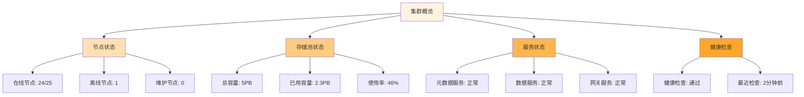

对于分布式文件存储平台的运维人员而言，管理控制台不仅是监控系统状态的窗口，更是执行运维操作、处理故障和保障系统稳定性的核心工具。一个优秀的运维视角控制台需要提供全局视图、便捷的运维操作和智能的故障自愈能力，以提高运维效率并降低人为错误风险。

## 全局视图设计

全局视图是运维人员了解系统整体状态的第一窗口，需要提供全面、实时的系统信息。

### 集群状态概览



### 拓扑视图展示

```python
class ClusterTopologyView:
    def __init__(self, cluster_manager):
        self.cluster_manager = cluster_manager
        self.nodes = []
        self.connections = []
    
    def render_topology(self):
        """渲染集群拓扑图"""
        cluster_info = self.cluster_manager.get_cluster_info()
        
        # 构建节点信息
        for node in cluster_info['nodes']:
            node_info = {
                'id': node['id'],
                'name': node['name'],
                'status': node['status'],
                'role': node['role'],
                'ip': node['ip'],
                'capacity': node['capacity'],
                'used': node['used'],
                'health': node['health_score']
            }
            self.nodes.append(node_info)
        
        # 构建连接关系
        for connection in cluster_info['connections']:
            self.connections.append({
                'source': connection['source_node'],
                'target': connection['target_node'],
                'bandwidth': connection['bandwidth'],
                'latency': connection['latency'],
                'status': connection['status']
            })
        
        return self.generate_topology_html()
    
    def generate_topology_html(self):
        """生成拓扑图HTML"""
        html = """
        <div id="cluster-topology" style="width: 100%; height: 600px;">
            <svg width="100%" height="100%">
        """
        
        # 绘制节点
        for i, node in enumerate(self.nodes):
            x = 100 + (i % 5) * 200
            y = 100 + (i // 5) * 150
            
            color = self.get_node_color(node['status'])
            html += f"""
                <circle cx="{x}" cy="{y}" r="30" fill="{color}" stroke="#333" stroke-width="2"/>
                <text x="{x}" y="{y+5}" text-anchor="middle" font-size="12">{node['name']}</text>
                <text x="{x}" y="{y+20}" text-anchor="middle" font-size="10">{node['status']}</text>
            """
        
        # 绘制连接线
        for conn in self.connections:
            source_node = next(n for n in self.nodes if n['id'] == conn['source'])
            target_node = next(n for n in self.nodes if n['id'] == conn['target'])
            
            line_color = "#4caf50" if conn['status'] == 'healthy' else "#f44336"
            html += f"""
                <line x1="{source_node['x']}" y1="{source_node['y']}" 
                      x2="{target_node['x']}" y2="{target_node['y']}" 
                      stroke="{line_color}" stroke-width="2"/>
            """
        
        html += """
            </svg>
        </div>
        """
        return html
    
    def get_node_color(self, status):
        """根据节点状态返回颜色"""
        color_map = {
            'online': '#4caf50',    # 绿色
            'offline': '#f44336',   # 红色
            'maintenance': '#ff9800' # 橙色
        }
        return color_map.get(status, '#9e9e9e')  # 灰色默认
```

### 实时指标监控

```go
type RealtimeMetricsDashboard struct {
    metricsCollector MetricsCollector
    alertManager     AlertManager
    updateInterval   time.Duration
}

type ClusterMetrics struct {
    CPUUsage        float64   `json:"cpu_usage"`
    MemoryUsage     float64   `json:"memory_usage"`
    DiskIO          DiskIO    `json:"disk_io"`
    NetworkTraffic  Network   `json:"network_traffic"`
    StorageMetrics  Storage   `json:"storage_metrics"`
    RequestLatency  Latency   `json:"request_latency"`
}

func (rmd *RealtimeMetricsDashboard) StartMonitoring() {
    ticker := time.NewTicker(rmd.updateInterval)
    defer ticker.Stop()
    
    for {
        select {
        case <-ticker.C:
            metrics := rmd.collectMetrics()
            rmd.updateDashboard(metrics)
            rmd.checkAlerts(metrics)
        }
    }
}

func (rmd *RealtimeMetricsDashboard) collectMetrics() *ClusterMetrics {
    var wg sync.WaitGroup
    result := &ClusterMetrics{}
    
    // 并行收集各项指标
    metricCollectors := map[string]func(){
        "cpu": func() {
            defer wg.Done()
            result.CPUUsage = rmd.metricsCollector.GetCPUUsage()
        },
        "memory": func() {
            defer wg.Done()
            result.MemoryUsage = rmd.metricsCollector.GetMemoryUsage()
        },
        "disk": func() {
            defer wg.Done()
            result.DiskIO = rmd.metricsCollector.GetDiskIO()
        },
        "network": func() {
            defer wg.Done()
            result.NetworkTraffic = rmd.metricsCollector.GetNetworkTraffic()
        },
        "storage": func() {
            defer wg.Done()
            result.StorageMetrics = rmd.metricsCollector.GetStorageMetrics()
        },
        "latency": func() {
            defer wg.Done()
            result.RequestLatency = rmd.metricsCollector.GetRequestLatency()
        },
    }
    
    // 启动所有收集器
    for _, collector := range metricCollectors {
        wg.Add(1)
        go collector()
    }
    
    // 等待所有收集完成
    wg.Wait()
    
    return result
}
```

## 一键运维操作

为运维人员提供便捷的一键操作功能，可以显著提高运维效率并减少人为错误。

### 运维操作面板

```typescript
interface OperationsPanel {
    operations: Operation[];
    executeOperation(operationId: string, params?: any): Promise<OperationResult>;
    getOperationStatus(operationId: string): Promise<OperationStatus>;
}

class OperationsDashboard implements OperationsPanel {
    private operations: Map<string, Operation> = new Map();
    private operationHistory: OperationHistory[] = [];
    
    constructor(private apiClient: ApiClient) {
        this.initializeOperations();
    }
    
    private initializeOperations() {
        // 定义常用运维操作
        const ops: Operation[] = [
            {
                id: 'cluster-health-check',
                name: '集群健康检查',
                description: '执行全面的集群健康检查',
                category: 'monitoring',
                icon: 'fas fa-heartbeat',
                confirmRequired: false,
                parameters: []
            },
            {
                id: 'node-restart',
                name: '节点重启',
                description: '重启指定存储节点',
                category: 'maintenance',
                icon: 'fas fa-redo',
                confirmRequired: true,
                parameters: [
                    { name: 'node_id', type: 'string', required: true, description: '节点ID' }
                ]
            },
            {
                id: 'storage-rebalance',
                name: '存储重平衡',
                description: '重新平衡集群中的数据分布',
                category: 'storage',
                icon: 'fas fa-balance-scale',
                confirmRequired: true,
                parameters: [
                    { name: 'target_utilization', type: 'number', required: false, description: '目标利用率%' }
                ]
            },
            {
                id: 'backup-create',
                name: '创建备份',
                description: '创建系统配置和元数据备份',
                category: 'backup',
                icon: 'fas fa-save',
                confirmRequired: false,
                parameters: [
                    { name: 'backup_name', type: 'string', required: true, description: '备份名称' }
                ]
            }
        ];
        
        ops.forEach(op => this.operations.set(op.id, op));
    }
    
    async executeOperation(operationId: string, params: any = {}): Promise<OperationResult> {
        const operation = this.operations.get(operationId);
        if (!operation) {
            throw new Error(`Operation ${operationId} not found`);
        }
        
        // 记录操作历史
        const historyEntry: OperationHistory = {
            id: generateId(),
            operationId: operationId,
            startTime: new Date(),
            status: 'pending',
            parameters: params
        };
        this.operationHistory.push(historyEntry);
        
        try {
            // 执行操作
            const result = await this.apiClient.post(`/api/operations/${operationId}/execute`, params);
            
            // 更新历史记录
            historyEntry.endTime = new Date();
            historyEntry.status = 'completed';
            historyEntry.result = result;
            
            return result;
        } catch (error) {
            historyEntry.endTime = new Date();
            historyEntry.status = 'failed';
            historyEntry.error = error.message;
            
            throw error;
        }
    }
}
```

### 批量操作支持

```javascript
class BatchOperationsManager {
    constructor(apiClient) {
        this.apiClient = apiClient;
        this.batchQueue = [];
    }
    
    async executeBatchOperation(operationType, targets, parameters = {}) {
        // 创建批量操作任务
        const batchTask = {
            id: this.generateBatchId(),
            operationType: operationType,
            targets: targets,
            parameters: parameters,
            status: 'pending',
            progress: 0,
            results: []
        };
        
        // 显示进度指示器
        this.showProgressIndicator(batchTask);
        
        // 分批执行操作（避免同时操作过多节点）
        const batchSize = 10;
        for (let i = 0; i < targets.length; i += batchSize) {
            const batch = targets.slice(i, i + batchSize);
            await this.executeBatch(batchTask, batch, parameters);
            
            // 更新进度
            batchTask.progress = Math.min(100, (i + batchSize) / targets.length * 100);
            this.updateProgressIndicator(batchTask);
        }
        
        batchTask.status = 'completed';
        this.hideProgressIndicator(batchTask);
        
        return batchTask.results;
    }
    
    async executeBatch(batchTask, targets, parameters) {
        const promises = targets.map(target => 
            this.executeSingleOperation(batchTask.operationType, target, parameters)
                .catch(error => ({ target, error: error.message, success: false }))
        );
        
        const results = await Promise.all(promises);
        batchTask.results.push(...results);
    }
    
    async executeSingleOperation(operationType, target, parameters) {
        try {
            const result = await this.apiClient.post(`/api/operations/${operationType}/execute`, {
                target: target,
                ...parameters
            });
            
            return { target, result, success: true };
        } catch (error) {
            return { target, error: error.message, success: false };
        }
    }
    
    showProgressIndicator(batchTask) {
        const indicator = document.createElement('div');
        indicator.id = `batch-progress-${batchTask.id}`;
        indicator.className = 'batch-progress-indicator';
        indicator.innerHTML = `
            <div class="progress-header">
                <span>批量操作: ${batchTask.operationType}</span>
                <span class="progress-text">0%</span>
            </div>
            <div class="progress-bar">
                <div class="progress-fill" style="width: 0%"></div>
            </div>
        `;
        document.body.appendChild(indicator);
    }
    
    updateProgressIndicator(batchTask) {
        const indicator = document.getElementById(`batch-progress-${batchTask.id}`);
        if (indicator) {
            indicator.querySelector('.progress-text').textContent = `${Math.round(batchTask.progress)}%`;
            indicator.querySelector('.progress-fill').style.width = `${batchTask.progress}%`;
        }
    }
}
```

## 故障自愈机制

智能的故障自愈机制可以自动检测和修复常见问题，减少人工干预。

### 故障检测与诊断

```python
class FaultDetector:
    def __init__(self, monitoring_client, alert_manager):
        self.monitoring_client = monitoring_client
        self.alert_manager = alert_manager
        self.fault_handlers = self.initialize_fault_handlers()
    
    def initialize_fault_handlers(self):
        """初始化故障处理器"""
        return {
            'node_offline': NodeOfflineHandler(),
            'disk_failure': DiskFailureHandler(),
            'network_partition': NetworkPartitionHandler(),
            'performance_degradation': PerformanceDegradationHandler()
        }
    
    def start_monitoring(self):
        """启动故障监控"""
        while True:
            # 检查系统状态
            system_status = self.monitoring_client.get_system_status()
            
            # 检测故障
            faults = self.detect_faults(system_status)
            
            # 处理故障
            for fault in faults:
                self.handle_fault(fault)
            
            time.sleep(30)  # 30秒检查一次
    
    def detect_faults(self, system_status):
        """检测系统故障"""
        faults = []
        
        # 检查节点状态
        for node in system_status['nodes']:
            if node['status'] == 'offline':
                faults.append({
                    'type': 'node_offline',
                    'node_id': node['id'],
                    'severity': 'critical',
                    'detected_at': datetime.now()
                })
        
        # 检查磁盘健康
        for disk in system_status['disks']:
            if disk['health'] < 0.8:  # 健康度低于80%
                faults.append({
                    'type': 'disk_failure',
                    'disk_id': disk['id'],
                    'node_id': disk['node_id'],
                    'severity': 'warning',
                    'detected_at': datetime.now()
                })
        
        # 检查性能指标
        if system_status['avg_latency'] > 100:  # 平均延迟超过100ms
            faults.append({
                'type': 'performance_degradation',
                'severity': 'warning',
                'detected_at': datetime.now(),
                'details': {
                    'current_latency': system_status['avg_latency'],
                    'threshold': 100
                }
            })
        
        return faults
    
    def handle_fault(self, fault):
        """处理检测到的故障"""
        handler = self.fault_handlers.get(fault['type'])
        if handler:
            # 执行故障处理
            resolution = handler.handle(fault)
            
            # 发送告警
            self.alert_manager.send_alert({
                'type': fault['type'],
                'severity': fault['severity'],
                'message': f"检测到故障: {fault['type']}",
                'details': fault,
                'resolution': resolution
            })
```

### 自动恢复策略

```go
type AutoRecoveryManager struct {
    clusterManager ClusterManager
    recoveryPolicies map[string]RecoveryPolicy
    recoveryHistory []RecoveryRecord
}

type RecoveryPolicy struct {
    FaultType string `json:"fault_type"`
    AutoRecover bool `json:"auto_recover"`
    MaxRetries int `json:"max_retries"`
    Timeout time.Duration `json:"timeout"`
    Actions []RecoveryAction `json:"actions"`
}

type RecoveryAction struct {
    Type string `json:"type"`
    Parameters map[string]interface{} `json:"parameters"`
    Condition string `json:"condition,omitempty"`
}

func (arm *AutoRecoveryManager) InitializePolicies() {
    arm.recoveryPolicies = map[string]RecoveryPolicy{
        "node_offline": {
            FaultType: "node_offline",
            AutoRecover: true,
            MaxRetries: 3,
            Timeout: 5 * time.Minute,
            Actions: []RecoveryAction{
                {
                    Type: "health_check",
                    Parameters: map[string]interface{}{
                        "timeout": "30s",
                    },
                },
                {
                    Type: "node_restart",
                    Parameters: map[string]interface{}{
                        "force": false,
                    },
                    Condition: "health_check_failed",
                },
                {
                    Type: "failover",
                    Parameters: map[string]interface{}{
                        "target_pool": "backup_pool",
                    },
                    Condition: "node_restart_failed",
                },
            },
        },
        "disk_failure": {
            FaultType: "disk_failure",
            AutoRecover: true,
            MaxRetries: 2,
            Timeout: 10 * time.Minute,
            Actions: []RecoveryAction{
                {
                    Type: "data_migrate",
                    Parameters: map[string]interface{}{
                        "source_disk": "{fault.disk_id}",
                        "target_pool": "healthy_pool",
                    },
                },
                {
                    Type: "disk_replace",
                    Parameters: map[string]interface{}{
                        "disk_id": "{fault.disk_id}",
                    },
                },
            },
        },
    }
}

func (arm *AutoRecoveryManager) ExecuteRecovery(fault Fault) (*RecoveryResult, error) {
    policy, exists := arm.recoveryPolicies[fault.Type]
    if !exists || !policy.AutoRecover {
        return nil, fmt.Errorf("no auto recovery policy for fault type: %s", fault.Type)
    }
    
    recoveryRecord := &RecoveryRecord{
        ID: generateID(),
        Fault: fault,
        StartTime: time.Now(),
        Status: "running",
        Actions: make([]ActionRecord, 0),
    }
    
    arm.recoveryHistory = append(arm.recoveryHistory, *recoveryRecord)
    
    // 执行恢复动作
    for i, action := range policy.Actions {
        if !arm.shouldExecuteAction(action, recoveryRecord) {
            continue
        }
        
        actionRecord := ActionRecord{
            Index: i,
            Type: action.Type,
            StartTime: time.Now(),
            Status: "pending",
        }
        
        recoveryRecord.Actions = append(recoveryRecord.Actions, actionRecord)
        
        // 执行动作
        result, err := arm.executeRecoveryAction(action, fault)
        actionRecord.EndTime = time.Now()
        
        if err != nil {
            actionRecord.Status = "failed"
            actionRecord.Error = err.Error()
            recoveryRecord.Actions[i] = actionRecord
            
            // 检查是否需要重试
            if len(recoveryRecord.Actions) < policy.MaxRetries {
                time.Sleep(30 * time.Second)
                continue
            }
            
            recoveryRecord.Status = "failed"
            recoveryRecord.EndTime = time.Now()
            return nil, err
        }
        
        actionRecord.Status = "completed"
        actionRecord.Result = result
        recoveryRecord.Actions[i] = actionRecord
    }
    
    recoveryRecord.Status = "completed"
    recoveryRecord.EndTime = time.Now()
    
    return &RecoveryResult{
        RecoveryID: recoveryRecord.ID,
        Success: true,
        Actions: recoveryRecord.Actions,
    }, nil
}
```

### 故障处理历史与审计

```yaml
# 故障处理历史记录模板
recovery_history:
  - recovery_id: "rec_20250907_001"
    fault_type: "node_offline"
    node_id: "node-001"
    start_time: "2025-09-07T10:30:00Z"
    end_time: "2025-09-07T10:35:30Z"
    duration: "5m30s"
    status: "completed"
    actions:
      - index: 0
        type: "health_check"
        start_time: "2025-09-07T10:30:00Z"
        end_time: "2025-09-07T10:30:30Z"
        status: "completed"
        result: "node_unreachable"
      
      - index: 1
        type: "node_restart"
        start_time: "2025-09-07T10:30:30Z"
        end_time: "2025-09-07T10:35:30Z"
        status: "completed"
        result: "node_restarted_successfully"
    
    audit_log:
      - timestamp: "2025-09-07T10:30:00Z"
        user: "system"
        action: "fault_detected"
        details: "Node node-001 marked as offline"
      
      - timestamp: "2025-09-07T10:30:01Z"
        user: "system"
        action: "auto_recovery_initiated"
        details: "Starting auto recovery for node_offline fault"
      
      - timestamp: "2025-09-07T10:35:30Z"
        user: "system"
        action: "recovery_completed"
        details: "Node node-001 successfully restarted"
```

## 运维工具集成

将常用运维工具集成到管理控制台中，提高运维效率。

### 命令行工具集成

```javascript
class CommandLineIntegration {
    constructor(terminalElementId) {
        this.terminal = document.getElementById(terminalElementId);
        this.history = [];
        this.historyIndex = -1;
    }
    
    initialize() {
        this.terminal.addEventListener('keydown', (e) => this.handleKeyDown(e));
        this.terminal.addEventListener('input', (e) => this.handleInput(e));
        
        // 显示欢迎信息
        this.appendOutput('Welcome to Storage Platform CLI\n');
        this.appendOutput('Type "help" for available commands\n');
        this.showPrompt();
    }
    
    handleKeyDown(e) {
        if (e.key === 'Enter') {
            e.preventDefault();
            this.executeCommand();
        } else if (e.key === 'ArrowUp') {
            e.preventDefault();
            this.navigateHistory(-1);
        } else if (e.key === 'ArrowDown') {
            e.preventDefault();
            this.navigateHistory(1);
        }
    }
    
    async executeCommand() {
        const command = this.terminal.value.trim();
        if (!command) {
            this.showPrompt();
            return;
        }
        
        // 添加到历史记录
        this.history.push(command);
        this.historyIndex = this.history.length;
        
        // 显示命令执行
        this.appendOutput(`$ ${command}\n`);
        
        try {
            // 执行命令
            const result = await this.apiClient.post('/api/cli/execute', { command });
            this.appendOutput(result.output);
            
            if (result.error) {
                this.appendOutput(`Error: ${result.error}\n`, 'error');
            }
        } catch (error) {
            this.appendOutput(`Error: ${error.message}\n`, 'error');
        }
        
        this.showPrompt();
    }
    
    appendOutput(text, className = '') {
        const output = document.createElement('div');
        output.className = `terminal-output ${className}`;
        output.textContent = text;
        this.terminal.parentNode.insertBefore(output, this.terminal);
        this.terminal.value = '';
        
        // 滚动到底部
        this.terminal.parentNode.scrollTop = this.terminal.parentNode.scrollHeight;
    }
    
    showPrompt() {
        this.terminal.value = '';
    }
}
```

### 日志查看器

```typescript
class LogViewer {
    private logs: LogEntry[] = [];
    private filters: LogFilters = {};
    private autoRefresh: boolean = true;
    private refreshInterval: number = 5000;
    
    constructor(private apiClient: ApiClient, private containerId: string) {
        this.initialize();
    }
    
    private initialize() {
        this.setupUI();
        this.startAutoRefresh();
    }
    
    private setupUI() {
        const container = document.getElementById(this.containerId);
        container.innerHTML = `
            <div class="log-viewer">
                <div class="log-controls">
                    <div class="filter-controls">
                        <select id="log-level-filter">
                            <option value="all">全部级别</option>
                            <option value="error">错误</option>
                            <option value="warning">警告</option>
                            <option value="info">信息</option>
                            <option value="debug">调试</option>
                        </select>
                        <input type="text" id="log-search" placeholder="搜索日志...">
                        <button id="refresh-logs">刷新</button>
                    </div>
                    <div class="time-controls">
                        <input type="datetime-local" id="start-time">
                        <input type="datetime-local" id="end-time">
                    </div>
                </div>
                <div class="log-content" id="log-content"></div>
                <div class="log-footer">
                    <span id="log-count">显示 0 条日志</span>
                    <button id="clear-logs">清空</button>
                </div>
            </div>
        `;
        
        this.bindEvents();
    }
    
    private bindEvents() {
        document.getElementById('refresh-logs').addEventListener('click', () => this.refreshLogs());
        document.getElementById('clear-logs').addEventListener('click', () => this.clearLogs());
        document.getElementById('log-level-filter').addEventListener('change', () => this.applyFilters());
        document.getElementById('log-search').addEventListener('input', () => this.applyFilters());
    }
    
    async refreshLogs() {
        try {
            const logs = await this.apiClient.get('/api/logs', {
                params: {
                    level: this.filters.level,
                    search: this.filters.search,
                    startTime: this.filters.startTime,
                    endTime: this.filters.endTime,
                    limit: 1000
                }
            });
            
            this.logs = logs;
            this.renderLogs();
        } catch (error) {
            console.error('Failed to fetch logs:', error);
        }
    }
    
    private renderLogs() {
        const content = document.getElementById('log-content');
        content.innerHTML = '';
        
        this.logs.forEach(log => {
            const logElement = this.createLogElement(log);
            content.appendChild(logElement);
        });
        
        // 更新日志计数
        document.getElementById('log-count').textContent = `显示 ${this.logs.length} 条日志`;
        
        // 滚动到底部
        content.scrollTop = content.scrollHeight;
    }
    
    private createLogElement(log: LogEntry): HTMLElement {
        const element = document.createElement('div');
        element.className = `log-entry level-${log.level.toLowerCase()}`;
        element.innerHTML = `
            <span class="timestamp">${log.timestamp}</span>
            <span class="level">${log.level}</span>
            <span class="source">${log.source}</span>
            <span class="message">${log.message}</span>
        `;
        
        return element;
    }
}
```

## 实践建议

在设计运维视角的管理控制台时，建议遵循以下实践：

1. **信息分层展示**：按照重要性分层展示信息，避免信息过载。
2. **操作安全确认**：对危险操作进行二次确认，防止误操作。
3. **审计日志记录**：详细记录所有运维操作，便于问题追溯。
4. **权限分级控制**：根据不同角色提供相应的操作权限。
5. **移动端适配**：确保关键功能在移动设备上也能正常使用。

通过精心设计的运维视角功能，可以显著提升分布式文件存储平台的可维护性和稳定性，为运维人员提供强大的工具支持。