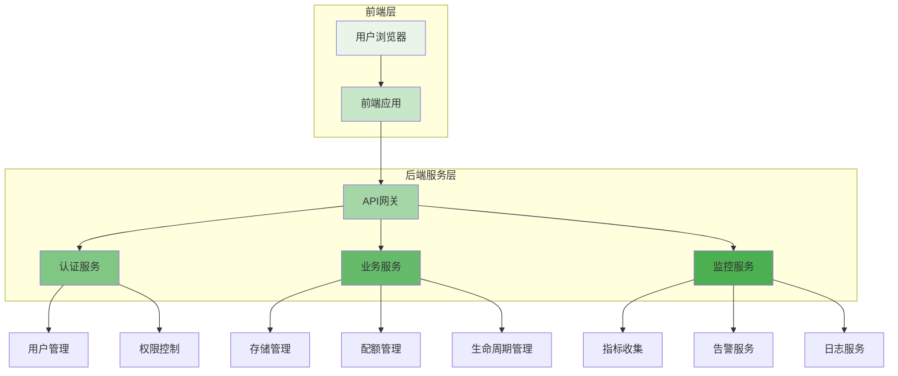

在分布式文件存储系统的实际应用中，一个直观易用的管理控制台是确保系统高效运维和良好用户体验的关键。管理控制台不仅需要提供全面的系统监控和管理功能，还要考虑不同用户角色的需求，从租户到运维人员，都需要能够便捷地使用平台功能。

## 管理控制台架构设计

一个优秀的管理控制台需要具备清晰的架构设计，以支持可扩展性和易维护性。

### 前端架构

现代管理控制台通常采用前后端分离的架构设计：



### 组件化设计

采用组件化设计提高代码复用性和维护性：

```javascript
// 管理控制台核心组件结构
class StorageManagementConsole {
    constructor(config) {
        this.config = config;
        this.components = {
            navigation: new NavigationComponent(),
            dashboard: new DashboardComponent(),
            storageManager: new StorageManagerComponent(),
            userManager: new UserManagerComponent(),
            monitoring: new MonitoringComponent(),
            settings: new SettingsComponent()
        };
    }
    
    initialize() {
        // 初始化各组件
        Object.values(this.components).forEach(component => {
            component.initialize();
        });
        
        // 绑定事件
        this.bindEvents();
        
        // 加载用户数据
        this.loadUserData();
    }
    
    bindEvents() {
        // 导航事件
        this.components.navigation.on('menu-selected', (menu) => {
            this.handleMenuSelection(menu);
        });
        
        // 数据刷新事件
        this.components.dashboard.on('refresh-requested', () => {
            this.refreshDashboardData();
        });
    }
}
```

## 核心功能模块

管理控制台需要提供一系列核心功能模块来满足不同用户的需求。

### 仪表板设计

仪表板是用户进入系统后的第一界面，需要提供关键指标的概览：

```yaml
# 仪表板配置
dashboard:
  layout: "grid"
  widgets:
    - id: "cluster_status"
      type: "status_indicator"
      title: "集群状态"
      position: [0, 0]
      size: [2, 1]
    
    - id: "storage_usage"
      type: "progress_chart"
      title: "存储使用情况"
      position: [2, 0]
      size: [2, 1]
    
    - id: "performance_metrics"
      type: "line_chart"
      title: "性能指标"
      position: [0, 1]
      size: [4, 2]
    
    - id: "recent_alerts"
      type: "alert_list"
      title: "最近告警"
      position: [0, 3]
      size: [2, 2]
    
    - id: "quick_actions"
      type: "action_buttons"
      title: "快捷操作"
      position: [2, 3]
      size: [2, 2]
```

### 存储资源管理

存储资源管理功能允许用户查看和管理存储资源：

```python
class StorageResourceManager:
    def __init__(self, storage_client):
        self.storage_client = storage_client
        self.cache = LRUCache(maxsize=1000)
    
    def list_storage_pools(self):
        """列出所有存储池"""
        if 'storage_pools' in self.cache:
            return self.cache['storage_pools']
        
        pools = self.storage_client.list_pools()
        self.cache['storage_pools'] = pools
        return pools
    
    def get_pool_details(self, pool_id):
        """获取存储池详细信息"""
        cache_key = f"pool_{pool_id}"
        if cache_key in self.cache:
            return self.cache[cache_key]
        
        details = self.storage_client.get_pool_details(pool_id)
        self.cache[cache_key] = details
        return details
    
    def create_storage_volume(self, volume_config):
        """创建存储卷"""
        try:
            volume = self.storage_client.create_volume(volume_config)
            # 清除相关缓存
            self.cache.pop('storage_pools', None)
            return volume
        except Exception as e:
            logger.error(f"Failed to create volume: {e}")
            raise
    
    def resize_volume(self, volume_id, new_size):
        """调整存储卷大小"""
        try:
            result = self.storage_client.resize_volume(volume_id, new_size)
            # 清除相关缓存
            self.cache.pop(f"volume_{volume_id}", None)
            return result
        except Exception as e:
            logger.error(f"Failed to resize volume {volume_id}: {e}")
            raise
```

### 用户与权限管理

用户和权限管理是多租户系统的核心功能：

```go
type UserManager struct {
    dbClient DatabaseClient
    authClient AuthClient
}

type User struct {
    ID          string    `json:"id"`
    Username    string    `json:"username"`
    Email       string    `json:"email"`
    TenantID    string    `json:"tenant_id"`
    Roles       []string  `json:"roles"`
    CreatedAt   time.Time `json:"created_at"`
    LastLogin   time.Time `json:"last_login"`
}

func (um *UserManager) CreateUser(userConfig UserConfig) (*User, error) {
    // 验证用户配置
    if err := um.validateUserConfig(userConfig); err != nil {
        return nil, err
    }
    
    // 创建用户记录
    user := &User{
        ID:        generateUserID(),
        Username:  userConfig.Username,
        Email:     userConfig.Email,
        TenantID:  userConfig.TenantID,
        Roles:     userConfig.Roles,
        CreatedAt: time.Now(),
    }
    
    // 保存到数据库
    if err := um.dbClient.SaveUser(user); err != nil {
        return nil, err
    }
    
    // 创建认证凭证
    if err := um.authClient.CreateCredentials(user.ID, userConfig.Password); err != nil {
        // 回滚用户创建
        um.dbClient.DeleteUser(user.ID)
        return nil, err
    }
    
    return user, nil
}

func (um *UserManager) AssignRole(userID string, role string) error {
    // 验证角色是否存在
    if !um.isValidRole(role) {
        return fmt.Errorf("invalid role: %s", role)
    }
    
    // 更新用户角色
    user, err := um.dbClient.GetUser(userID)
    if err != nil {
        return err
    }
    
    // 检查是否已分配该角色
    for _, r := range user.Roles {
        if r == role {
            return nil // 角色已存在
        }
    }
    
    user.Roles = append(user.Roles, role)
    return um.dbClient.UpdateUser(user)
}
```

## 监控与告警功能

实时监控和告警功能是保障系统稳定运行的重要手段。

### 指标监控面板

```javascript
class MetricsDashboard {
    constructor(metricsClient) {
        this.metricsClient = metricsClient;
        this.charts = new Map();
        this.refreshInterval = 30000; // 30秒刷新一次
    }
    
    async initialize() {
        // 初始化图表
        this.charts.set('storage_usage', new StorageUsageChart());
        this.charts.set('performance_metrics', new PerformanceMetricsChart());
        this.charts.set('cluster_health', new ClusterHealthChart());
        
        // 启动定时刷新
        this.startAutoRefresh();
    }
    
    async refreshMetrics() {
        try {
            // 并行获取各项指标
            const [storageMetrics, performanceMetrics, healthMetrics] = await Promise.all([
                this.metricsClient.getStorageMetrics(),
                this.metricsClient.getPerformanceMetrics(),
                this.metricsClient.getHealthMetrics()
            ]);
            
            // 更新图表
            this.charts.get('storage_usage').update(storageMetrics);
            this.charts.get('performance_metrics').update(performanceMetrics);
            this.charts.get('cluster_health').update(healthMetrics);
            
        } catch (error) {
            console.error('Failed to refresh metrics:', error);
        }
    }
    
    startAutoRefresh() {
        setInterval(() => {
            this.refreshMetrics();
        }, this.refreshInterval);
    }
}
```

### 告警管理

```yaml
# 告警规则配置
alert_rules:
  - name: "high_disk_usage"
    description: "磁盘使用率过高"
    metric: "disk_usage_percent"
    threshold: 90
    severity: "critical"
    duration: "5m"
    notification_channels: ["email", "slack"]
  
  - name: "low_performance"
    description: "存储性能下降"
    metric: "average_latency_ms"
    threshold: 100
    severity: "warning"
    duration: "10m"
    notification_channels: ["email"]
  
  - name: "node_unavailable"
    description: "存储节点不可用"
    metric: "node_status"
    threshold: "down"
    severity: "critical"
    duration: "1m"
    notification_channels: ["sms", "email", "slack"]
```

## 配置管理功能

灵活的配置管理功能允许用户根据需求调整系统行为。

### 配置管理界面

```typescript
interface ConfigManager {
    getConfigSections(): Promise<ConfigSection[]>;
    getConfigValue(section: string, key: string): Promise<any>;
    updateConfigValue(section: string, key: string, value: any): Promise<void>;
    resetToDefault(section: string, key: string): Promise<void>;
}

class WebConfigManager implements ConfigManager {
    private apiClient: ApiClient;
    
    async getConfigSections(): Promise<ConfigSection[]> {
        const response = await this.apiClient.get('/api/config/sections');
        return response.data;
    }
    
    async getConfigValue(section: string, key: string): Promise<any> {
        const response = await this.apiClient.get(`/api/config/${section}/${key}`);
        return response.data.value;
    }
    
    async updateConfigValue(section: string, key: string, value: any): Promise<void> {
        await this.apiClient.put(`/api/config/${section}/${key}`, { value });
    }
    
    async resetToDefault(section: string, key: string): Promise<void> {
        await this.apiClient.delete(`/api/config/${section}/${key}`);
    }
}
```

## 用户体验优化

良好的用户体验是管理控制台成功的关键因素。

### 响应式设计

```css
/* 响应式布局设计 */
.console-container {
    display: grid;
    grid-template-columns: 250px 1fr;
    grid-template-rows: 60px 1fr;
    grid-template-areas:
        "sidebar header"
        "sidebar main";
    height: 100vh;
}

@media (max-width: 768px) {
    .console-container {
        grid-template-columns: 1fr;
        grid-template-rows: 60px auto 1fr;
        grid-template-areas:
            "header"
            "sidebar"
            "main";
    }
    
    .sidebar {
        position: fixed;
        top: 60px;
        left: -250px;
        width: 250px;
        height: calc(100vh - 60px);
        transition: left 0.3s ease;
        z-index: 1000;
    }
    
    .sidebar.open {
        left: 0;
    }
}
```

### 交互反馈机制

```javascript
class UserFeedbackManager {
    showSuccess(message, duration = 3000) {
        this.showNotification({
            type: 'success',
            message: message,
            duration: duration
        });
    }
    
    showError(message, duration = 5000) {
        this.showNotification({
            type: 'error',
            message: message,
            duration: duration
        });
    }
    
    showLoading(message = '处理中...') {
        return this.showNotification({
            type: 'loading',
            message: message,
            persistent: true
        });
    }
    
    showNotification(config) {
        const notification = document.createElement('div');
        notification.className = `notification notification-${config.type}`;
        notification.innerHTML = `
            <div class="notification-content">
                <i class="icon-${config.type}"></i>
                <span>${config.message}</span>
            </div>
        `;
        
        document.body.appendChild(notification);
        
        // 自动关闭
        if (!config.persistent && config.duration) {
            setTimeout(() => {
                notification.remove();
            }, config.duration);
        }
        
        return notification;
    }
}
```

## 安全性设计

管理控制台的安全性设计至关重要，需要保护系统免受未授权访问。

### 认证与授权

```python
class SecurityManager:
    def __init__(self, auth_backend, policy_engine):
        self.auth_backend = auth_backend
        self.policy_engine = policy_engine
        self.session_manager = SessionManager()
    
    def authenticate_user(self, credentials):
        """用户认证"""
        try:
            user = self.auth_backend.verify_credentials(credentials)
            if user:
                session = self.session_manager.create_session(user)
                return session
            return None
        except AuthenticationError as e:
            logger.warning(f"Authentication failed: {e}")
            return None
    
    def authorize_request(self, session, resource, action):
        """请求授权"""
        # 检查会话有效性
        if not self.session_manager.is_valid(session):
            return False
        
        # 获取用户权限
        user_permissions = self.auth_backend.get_user_permissions(session.user_id)
        
        # 评估权限策略
        return self.policy_engine.evaluate(
            user=session.user_id,
            resource=resource,
            action=action,
            permissions=user_permissions
        )
    
    def enforce_mfa(self, user_id, action):
        """强制多因素认证"""
        user = self.auth_backend.get_user(user_id)
        if user.mfa_enabled and action in user.mfa_required_actions:
            return self.mfa_challenge(user)
        return True
```

## 实践建议

在设计和实现管理控制台时，建议遵循以下实践：

1. **用户为中心**：始终以用户需求为导向设计功能和界面。
2. **渐进式披露**：复杂功能采用渐进式披露，避免界面过于复杂。
3. **一致性设计**：保持界面风格和交互方式的一致性。
4. **性能优化**：优化前端性能，确保流畅的用户体验。
5. **可访问性**：考虑不同用户的需求，提供良好的可访问性支持。

通过精心设计的管理控制台，可以显著提升分布式文件存储系统的易用性和运维效率，为用户提供更好的使用体验。