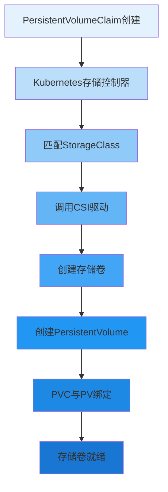

在现代云原生应用架构中，存储资源的动态供给是实现应用自动化部署和弹性伸缩的关键能力。Kubernetes通过Dynamic Provisioning机制，使得存储资源能够像计算资源一样实现自动化管理，极大地简化了存储资源的申请和使用流程。对于分布式文件存储系统而言，深入理解并正确实现动态存储供给机制，是与Kubernetes生态深度集成的重要基础。

## 动态存储供给原理

动态存储供给是Kubernetes存储管理的核心机制，它通过StorageClass和CSI驱动实现存储资源的自动化创建和管理。

### 动态供给工作流程



### 核心组件解析

动态存储供给涉及多个核心组件的协同工作：

```yaml
# 动态存储供给核心组件关系
components:
  - name: "PersistentVolumeClaim (PVC)"
    description: "用户申请存储资源的声明"
    role: "存储资源申请接口"
  
  - name: "StorageClass"
    description: "存储类定义，指定存储供给方式和参数"
    role: "存储资源配置模板"
  
  - name: "PersistentVolumeController"
    description: "Kubernetes控制器，负责PV和PVC的绑定"
    role: "资源调度与绑定"
  
  - name: "External Provisioner"
    description: "CSI外部供给器，调用CSI驱动创建存储卷"
    role: "存储卷创建执行器"
  
  - name: "CSI Driver"
    description: "存储系统CSI驱动实现"
    role: "存储系统接口"
```

## StorageClass配置详解

StorageClass是动态存储供给的核心配置对象，定义了存储卷的创建参数和策略。

### 基础配置参数

```yaml
# 标准StorageClass配置示例
apiVersion: storage.k8s.io/v1
kind: StorageClass
metadata:
  name: distributed-file-standard
  annotations:
    storageclass.kubernetes.io/is-default-class: "false"
provisioner: distributed-file-csi  # CSI驱动名称
parameters:
  # 存储类型参数
  type: "standard"
  replication: "3"
  encryption: "true"
  
  # 性能相关参数
  cache: "true"
  compression: "true"
  
  # 策略参数
  reclaimPolicy: "Delete"
  allowVolumeExpansion: "true"
  mountOptions:
    - "soft"
    - "timeo=30"
    - "retrans=3"
  
# 回收策略
reclaimPolicy: Delete  # Delete/Retain/Recycle
# 卷扩展支持
allowVolumeExpansion: true
# 卷绑定模式
volumeBindingMode: WaitForFirstConsumer  # Immediate/WaitForFirstConsumer
# 允许的卷绑定拓扑
allowedTopologies:
  - matchLabelExpressions:
      - key: topology.distributed-file/zone
        values:
          - "zone-1"
          - "zone-2"
```

### 高级配置选项

```yaml
# 高级StorageClass配置示例
apiVersion: storage.k8s.io/v1
kind: StorageClass
metadata:
  name: distributed-file-performance
provisioner: distributed-file-csi
parameters:
  # 存储池配置
  pool: "ssd-pool"
  tier: "high-performance"
  
  # QoS参数
  iops: "10000"
  bandwidth: "1000MB/s"
  
  # 数据保护
  snapshot: "true"
  backup: "daily"
  
  # 安全配置
  encryption: "AES-256"
  authentication: "mutual-tls"
  
  # 生命周期管理
  lifecycle: "30d"
  tiering: "auto"
  
# 挂载选项
mountOptions:
  - "nfsvers=4.1"
  - "rsize=1048576"
  - "wsize=1048576"
  - "hard"
  - "timeo=600"
  - "retrans=2"
  - "noresvport"

# 回收策略
reclaimPolicy: Retain
# 卷扩展支持
allowVolumeExpansion: true
# 卷绑定模式
volumeBindingMode: WaitForFirstConsumer
# 允许的拓扑约束
allowedTopologies:
  - matchLabelExpressions:
      - key: topology.kubernetes.io/zone
        values:
          - "us-west-1a"
          - "us-west-1b"
```

## 动态供给实现机制

深入理解动态供给的实现机制有助于更好地设计和优化存储系统。

### PVC处理流程

```python
class PersistentVolumeController:
    def __init__(self, provisioner_client):
        self.provisioner_client = provisioner_client
        self.workqueue = WorkQueue()
    
    def sync_pvc(self, pvc):
        """同步PVC状态"""
        # 检查PVC是否已绑定
        if pvc.status.phase == 'Bound':
            return
        
        # 检查是否需要动态供给
        if not self.needs_dynamic_provisioning(pvc):
            return
        
        # 加入工作队列
        self.workqueue.add(pvc.metadata.name)
    
    def process_provisioning(self, pvc_name):
        """处理存储卷供给"""
        pvc = self.get_pvc(pvc_name)
        
        # 获取StorageClass
        storage_class = self.get_storage_class(pvc.spec.storage_class_name)
        
        # 验证StorageClass配置
        if not self.validate_storage_class(storage_class):
            self.update_pvc_status(pvc, 'Failed', 'Invalid StorageClass')
            return
        
        # 准备卷创建参数
        volume_parameters = self.prepare_volume_parameters(pvc, storage_class)
        
        try:
            # 调用外部供给器创建卷
            volume = self.provisioner_client.create_volume(volume_parameters)
            
            # 创建PV对象
            pv = self.create_pv_object(volume, pvc)
            
            # 创建PV
            self.create_persistent_volume(pv)
            
            # 绑定PVC到PV
            self.bind_pvc_to_pv(pvc, pv)
            
            logger.info(f"Successfully provisioned volume {volume.id} for PVC {pvc_name}")
            
        except Exception as e:
            logger.error(f"Failed to provision volume for PVC {pvc_name}: {e}")
            self.update_pvc_status(pvc, 'Pending', f'Provisioning failed: {str(e)}')
    
    def prepare_volume_parameters(self, pvc, storage_class):
        """准备卷创建参数"""
        parameters = {
            'name': f"pvc-{pvc.metadata.namespace}-{pvc.metadata.name}",
            'capacity': pvc.spec.resources.requests['storage'],
            'storage_class': storage_class.metadata.name,
            'parameters': storage_class.parameters,
            'access_modes': pvc.spec.access_modes,
            'selector': pvc.spec.selector,
            'volume_mode': pvc.spec.volume_mode
        }
        
        # 添加拓扑约束
        if storage_class.allowed_topologies:
            parameters['topology_requirements'] = self.process_topology_requirements(
                storage_class.allowed_topologies, pvc.metadata.namespace)
        
        return parameters
```

### CSI外部供给器工作原理

```go
type ExternalProvisioner struct {
    csiClient     CSIClient
    k8sClient     kubernetes.Interface
    provisionerName string
}

func (ep *ExternalProvisioner) Provision(options controller.ProvisionOptions) (*v1.PersistentVolume, error) {
    // 验证参数
    if options.StorageClass == nil {
        return nil, fmt.Errorf("storage class is nil")
    }
    
    // 准备CreateVolume请求
    req := &csi.CreateVolumeRequest{
        Name:               ep.generateVolumeName(options),
        CapacityRange:      ep.getCapacityRange(options),
        VolumeCapabilities: ep.getVolumeCapabilities(options),
        Parameters:         options.StorageClass.Parameters,
        AccessibilityRequirements: ep.getAccessibilityRequirements(options),
    }
    
    // 调用CSI驱动创建卷
    resp, err := ep.csiClient.CreateVolume(context.Background(), req)
    if err != nil {
        return nil, fmt.Errorf("failed to create volume: %v", err)
    }
    
    // 构建PV对象
    pv := ep.buildPersistentVolume(resp.Volume, options)
    
    return pv, nil
}

func (ep *ExternalProvisioner) generateVolumeName(options controller.ProvisionOptions) string {
    // 生成唯一的卷名称
    return fmt.Sprintf("pvc-%s-%s-%s", 
        options.PVC.Namespace, 
        options.PVC.Name, 
        uuid.New().String()[:8])
}

func (ep *ExternalProvisioner) buildPersistentVolume(volume *csi.Volume, options controller.ProvisionOptions) *v1.PersistentVolume {
    pv := &v1.PersistentVolume{
        ObjectMeta: metav1.ObjectMeta{
            Name: volume.VolumeId,
            Annotations: map[string]string{
                "pv.kubernetes.io/provisioned-by": ep.provisionerName,
            },
        },
        Spec: v1.PersistentVolumeSpec{
            PersistentVolumeReclaimPolicy: *options.StorageClass.ReclaimPolicy,
            AccessModes:                   options.PVC.Spec.AccessModes,
            VolumeMode:                    options.PVC.Spec.VolumeMode,
            Capacity: v1.ResourceList{
                v1.ResourceStorage: options.PVC.Spec.Resources.Requests[v1.ResourceStorage],
            },
            PersistentVolumeSource: v1.PersistentVolumeSource{
                CSI: &v1.CSIPersistentVolumeSource{
                    Driver:       ep.provisionerName,
                    VolumeHandle: volume.VolumeId,
                    VolumeAttributes: map[string]string{
                        "storage.kubernetes.io/csiProvisionerIdentity": ep.provisionerName,
                    },
                    ControllerPublishSecretRef: options.StorageClass.Parameters["controllerPublishSecretRef"],
                },
            },
        },
    }
    
    // 添加节点亲和性
    if volume.AccessibleTopology != nil {
        pv.Spec.NodeAffinity = ep.buildNodeAffinity(volume.AccessibleTopology)
    }
    
    return pv
}
```

## 拓扑感知供给

在多区域、多可用区的云环境中，拓扑感知供给能够确保存储卷在正确的地理位置创建。

### 拓扑约束配置

```yaml
# 拓扑感知StorageClass配置
apiVersion: storage.k8s.io/v1
kind: StorageClass
metadata:
  name: distributed-file-regional
provisioner: distributed-file-csi
parameters:
  replication: "3"
  encryption: "true"
volumeBindingMode: WaitForFirstConsumer
allowedTopologies:
  - matchLabelExpressions:
      - key: topology.kubernetes.io/region
        values:
          - "us-west"
          - "us-east"
      - key: topology.kubernetes.io/zone
        values:
          - "us-west-1a"
          - "us-west-1b"
          - "us-east-1a"
          - "us-east-1b"
```

### 拓扑感知实现

```typescript
interface TopologyAwareProvisioner {
    getAccessibilityRequirements(options: ProvisionOptions): AccessibilityRequirements;
    buildNodeAffinity(topology: Topology[]): NodeAffinity;
}

class DistributedFileTopologyProvisioner implements TopologyAwareProvisioner {
    getAccessibilityRequirements(options: ProvisionOptions): AccessibilityRequirements {
        // 如果指定了拓扑约束，使用指定的约束
        if (options.StorageClass.allowedTopologies) {
            return this.convertToCSITopology(options.StorageClass.allowedTopologies);
        }
        
        // 如果使用WaitForFirstConsumer模式，根据Pod调度约束确定拓扑
        if (options.StorageClass.volumeBindingMode === 'WaitForFirstConsumer') {
            return this.getTopologyFromPodConstraints(options.PVC);
        }
        
        // 默认情况下，不指定拓扑约束
        return null;
    }
    
    private convertToCSITopology(k8sTopologies: TopologySelectorTerm[]): AccessibilityRequirements {
        const requisite: Topology[] = [];
        const preferred: Topology[] = [];
        
        k8sTopologies.forEach(term => {
            term.matchLabelExpressions.forEach(expression => {
                // 将Kubernetes拓扑标签转换为CSI拓扑
                const csiTopology = this.convertK8sToCSITopology(expression);
                requisite.push(csiTopology);
                preferred.push(csiTopology);
            });
        });
        
        return {
            requisite: requisite,
            preferred: preferred
        };
    }
    
    private getTopologyFromPodConstraints(pvc: PersistentVolumeClaim): AccessibilityRequirements {
        // 获取与PVC关联的Pod
        const pods = this.getPodsForPVC(pvc);
        
        // 收集Pod的节点亲和性约束
        const nodeSelectors = pods.map(pod => pod.spec.nodeSelector);
        const nodeAffinity = pods.map(pod => pod.spec.affinity?.nodeAffinity);
        
        // 根据Pod约束确定存储卷的拓扑要求
        return this.deriveTopologyRequirements(nodeSelectors, nodeAffinity);
    }
}
```

## 存储卷扩展支持

动态存储供给还支持存储卷的在线扩展，满足应用运行时的存储需求变化。

### 扩展机制实现

```javascript
class VolumeExpansionController {
    constructor(csiClient, k8sClient) {
        this.csiClient = csiClient;
        this.k8sClient = k8sClient;
    }
    
    async expandVolume(pvName, newSize) {
        // 获取PV对象
        const pv = await this.k8sClient.readPersistentVolume(pvName);
        
        // 验证CSI驱动是否支持扩展
        const capabilities = await this.csiClient.getControllerCapabilities();
        if (!capabilities.includes('EXPAND_VOLUME')) {
            throw new Error('CSI driver does not support volume expansion');
        }
        
        // 调用CSI驱动扩展卷
        const expandRequest = {
            volume_id: pv.spec.csi.volumeHandle,
            capacity_range: {
                required_bytes: newSize
            }
        };
        
        const response = await this.csiClient.controllerExpandVolume(expandRequest);
        
        // 更新PV容量
        pv.spec.capacity.storage = response.capacity_bytes;
        await this.k8sClient.updatePersistentVolume(pv);
        
        // 如果是文件系统卷，还需要扩展文件系统
        if (response.node_expansion_required) {
            await this.expandFileSystemOnNode(pv);
        }
        
        return response;
    }
    
    async expandFileSystemOnNode(pv) {
        // 获取使用该PV的Pod
        const pods = await this.getPodsUsingPV(pv.metadata.name);
        
        // 在每个节点上扩展文件系统
        for (const pod of pods) {
            const nodeName = pod.spec.nodeName;
            await this.expandFileSystemOnSpecificNode(nodeName, pv);
        }
    }
}
```

## 监控与故障处理

完善的监控和故障处理机制是确保动态存储供给稳定运行的关键。

### 状态监控

```python
class ProvisioningMonitor:
    def __init__(self, metrics_collector):
        self.metrics_collector = metrics_collector
        self.provisioning_stats = {
            'total_attempts': 0,
            'success_count': 0,
            'failure_count': 0,
            'average_duration': 0
        }
    
    def record_provisioning_attempt(self, success, duration, error=None):
        """记录供给尝试"""
        self.provisioning_stats['total_attempts'] += 1
        
        if success:
            self.provisioning_stats['success_count'] += 1
        else:
            self.provisioning_stats['failure_count'] += 1
            if error:
                self.record_error(error)
        
        # 更新平均耗时
        total_duration = self.provisioning_stats['average_duration'] * \
                        (self.provisioning_stats['total_attempts'] - 1) + duration
        self.provisioning_stats['average_duration'] = total_duration / \
                                                     self.provisioning_stats['total_attempts']
        
        # 上报指标
        self.metrics_collector.gauge('provisioning_success_rate',
                                   self.provisioning_stats['success_count'] /
                                   self.provisioning_stats['total_attempts'])
        self.metrics_collector.histogram('provisioning_duration', duration)
    
    def get_provisioning_report(self):
        """获取供给报告"""
        success_rate = (self.provisioning_stats['success_count'] /
                       self.provisioning_stats['total_attempts']) if self.provisioning_stats['total_attempts'] > 0 else 0
        
        return {
            'total_attempts': self.provisioning_stats['total_attempts'],
            'success_count': self.provisioning_stats['success_count'],
            'failure_count': self.provisioning_stats['failure_count'],
            'success_rate': success_rate,
            'average_duration': self.provisioning_stats['average_duration']
        }
```

### 故障恢复机制

```yaml
# 故障恢复配置
failure_recovery:
  retry_policy:
    max_retries: 3
    backoff_base: "1s"
    backoff_factor: 2
    
  timeout_settings:
    provision_timeout: "5m"
    delete_timeout: "2m"
    expand_timeout: "3m"
  
  cleanup_policy:
    orphaned_pv: "delete"
    failed_pvc: "retain_with_annotation"
    
  alerting:
    failure_threshold: 5
    alert_channels: ["slack", "email"]
```

## 最佳实践建议

在实现和使用动态存储供给时，建议遵循以下最佳实践：

### StorageClass设计

1. **分层存储策略**：为不同性能要求的应用创建不同的StorageClass
2. **参数验证**：在CSI驱动中验证StorageClass参数的有效性
3. **文档完善**：为每个StorageClass提供详细的使用说明

### 性能优化

1. **连接复用**：在CSI驱动中实现连接池，避免频繁建立连接
2. **缓存机制**：缓存卷信息和节点信息，减少API调用
3. **并发控制**：合理设置并发处理能力，避免资源竞争

### 安全性考虑

1. **权限最小化**：为CSI组件分配最小必要权限
2. **凭证管理**：使用Kubernetes Secret安全存储敏感信息
3. **网络隔离**：确保CSI组件间的通信安全

通过深入理解和正确实现动态存储供给机制，分布式文件存储系统能够更好地融入Kubernetes生态，为云原生应用提供高效、可靠的存储服务。