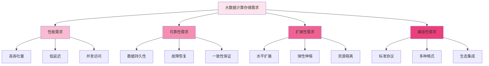

在大数据生态系统中，分布式文件存储系统作为底层存储基础设施，为Spark、Flink、Presto等计算引擎提供了海量数据的存储和访问能力。随着数据量的爆炸式增长和实时计算需求的不断提升，存储系统与计算引擎的深度集成变得至关重要。通过优化的数据访问接口、高效的缓存机制和智能的调度策略，分布式文件存储系统能够显著提升大数据计算的性能和效率。

## 大数据计算存储需求

大数据计算场景对底层存储系统提出了独特的要求，这些需求直接影响存储系统的设计和优化方向。

### 性能需求分析



### 访问模式特征

大数据计算引擎的访问模式具有明显的特征：

```yaml
# 大数据计算访问模式
access_patterns:
  batch_processing:
    description: "批处理作业，顺序读取大文件"
    characteristics:
      - sequential_reads: true
      - file_size: "GB-TB"
      - concurrency: "low-medium"
      - latency_requirement: "seconds-minutes"
  
  interactive_query:
    description: "交互式查询，随机读取小文件"
    characteristics:
      - random_reads: true
      - file_size: "KB-MB"
      - concurrency: "high"
      - latency_requirement: "milliseconds-seconds"
  
  streaming_processing:
    description: "流处理作业，持续读写小文件"
    characteristics:
      - continuous_reads_writes: true
      - file_size: "KB-MB"
      - concurrency: "high"
      - latency_requirement: "milliseconds"
  
  machine_learning:
    description: "机器学习训练，迭代读取大文件"
    characteristics:
      - iterative_reads: true
      - file_size: "GB-TB"
      - concurrency: "medium"
      - latency_requirement: "seconds"
```

## 与Spark的集成实践

Apache Spark作为主流的大数据处理引擎，对底层存储系统的性能和兼容性有较高要求。

### Spark存储集成架构

```python
class SparkDistributedFileIntegration:
    def __init__(self, spark_conf):
        self.spark_conf = spark_conf
        self.storage_client = self.initialize_storage_client()
    
    def initialize_storage_client(self):
        """初始化存储客户端"""
        client_config = {
            'endpoint': self.spark_conf.get('spark.distributedfile.endpoint'),
            'access_key': self.spark_conf.get('spark.distributedfile.access.key'),
            'secret_key': self.spark_conf.get('spark.distributedfile.secret.key'),
            'buffer_size': self.spark_conf.get('spark.distributedfile.buffer.size', '64MB'),
            'max_connections': self.spark_conf.get('spark.distributedfile.max.connections', '100')
        }
        
        return DistributedFileClient(client_config)
    
    def create_rdd_from_distributed_file(self, file_paths, min_partitions=None):
        """从分布式文件系统创建RDD"""
        # 解析文件路径
        resolved_paths = self.resolve_file_paths(file_paths)
        
        # 获取文件分片信息
        file_blocks = self.get_file_blocks(resolved_paths)
        
        # 创建RDD
        rdd = self.spark_context.parallelize(file_blocks, min_partitions)
        
        # 映射到实际数据读取函数
        return rdd.mapPartitions(lambda blocks: self.read_file_blocks(blocks))
    
    def read_file_blocks(self, blocks):
        """读取文件块数据"""
        for block in blocks:
            # 从分布式文件系统读取数据
            data_stream = self.storage_client.read_object_stream(
                bucket=block['bucket'],
                key=block['key'],
                offset=block['offset'],
                length=block['length']
            )
            
            # 处理数据流
            for record in self.parse_data_stream(data_stream):
                yield record
    
    def optimize_spark_io(self, df):
        """优化Spark I/O性能"""
        # 设置合适的分区数
        optimal_partitions = self.calculate_optimal_partitions(df)
        df = df.repartition(optimal_partitions)
        
        # 启用文件合并
        self.spark_conf.set("spark.sql.adaptive.coalescePartitions.enabled", "true")
        
        # 启用数据本地性优化
        self.spark_conf.set("spark.locality.wait", "3s")
        
        # 启用缓存
        df.cache()
        
        return df
```

### Spark配置优化

```xml
<!-- Spark配置优化 -->
<configuration>
    <!-- 分布式文件系统相关配置 -->
    <property>
        <name>spark.distributedfile.endpoint</name>
        <value>https://storage-api.example.com</value>
    </property>
    
    <property>
        <name>spark.distributedfile.access.key</name>
        <value>${ACCESS_KEY}</value>
    </property>
    
    <property>
        <name>spark.distributedfile.secret.key</name>
        <value>${SECRET_KEY}</value>
    </property>
    
    <!-- I/O性能优化 -->
    <property>
        <name>spark.sql.adaptive.enabled</name>
        <value>true</value>
    </property>
    
    <property>
        <name>spark.sql.adaptive.coalescePartitions.enabled</name>
        <value>true</value>
    </property>
    
    <property>
        <name>spark.sql.adaptive.skewJoin.enabled</name>
        <value>true</value>
    </property>
    
    <!-- 内存管理优化 -->
    <property>
        <name>spark.executor.memory</name>
        <value>8g</value>
    </property>
    
    <property>
        <name>spark.executor.memoryFraction</name>
        <value>0.8</value>
    </property>
    
    <!-- 并行度优化 -->
    <property>
        <name>spark.sql.adaptive.advisoryPartitionSizeInBytes</name>
        <value>128MB</value>
    </property>
    
    <property>
        <name>spark.sql.files.maxPartitionBytes</name>
        <value>512MB</value>
    </property>
</configuration>
```

## 与Flink的集成实践

Apache Flink作为流处理引擎，对存储系统的实时性和一致性有特殊要求。

### Flink存储连接器实现

```java
public class DistributedFileFlinkConnector {
    private final DistributedFileClient storageClient;
    private final Configuration config;
    
    public DistributedFileFlinkConnector(Configuration config) {
        this.config = config;
        this.storageClient = initializeStorageClient();
    }
    
    private DistributedFileClient initializeStorageClient() {
        DistributedFileClient.Builder builder = DistributedFileClient.builder()
            .endpoint(config.getString("distributedfile.endpoint", "https://storage-api.example.com"))
            .accessKey(config.getString("distributedfile.access.key"))
            .secretKey(config.getString("distributedfile.secret.key"))
            .maxConnections(config.getInteger("distributedfile.max.connections", 50))
            .bufferSize(config.getBytes("distributedfile.buffer.size", MemorySize.ofMebiBytes(64)));
        
        return builder.build();
    }
    
    public DistributedFileSourceFunction<T> createSource(
            String bucket,
            String prefix,
            DeserializationSchema<T> deserializer) {
        return new DistributedFileSourceFunction<>(
            storageClient,
            bucket,
            prefix,
            deserializer,
            config
        );
    }
    
    public DistributedFileSinkFunction<T> createSink(
            String bucket,
            String prefix,
            SerializationSchema<T> serializer) {
        return new DistributedFileSinkFunction<>(
            storageClient,
            bucket,
            prefix,
            serializer,
            config
        );
    }
}

// 流式数据源实现
public class DistributedFileSourceFunction<T> extends RichSourceFunction<T> {
    private final DistributedFileClient storageClient;
    private final String bucket;
    private final String prefix;
    private final DeserializationSchema<T> deserializer;
    private final Configuration config;
    
    private volatile boolean isRunning = true;
    private CheckpointListener checkpointListener;
    
    @Override
    public void run(SourceContext<T> ctx) throws Exception {
        // 列出需要处理的文件
        List<FileObject> files = storageClient.listFiles(bucket, prefix);
        
        // 按时间顺序处理文件
        files.sort(Comparator.comparing(FileObject::getModificationTime));
        
        for (FileObject file : files) {
            if (!isRunning) {
                break;
            }
            
            // 读取文件内容
            try (InputStream inputStream = storageClient.getObjectStream(bucket, file.getKey())) {
                // 按记录处理数据
                processRecords(inputStream, ctx);
            }
            
            // 更新检查点
            if (checkpointListener != null) {
                checkpointListener.notifyCheckpointComplete(file.getKey());
            }
        }
    }
    
    private void processRecords(InputStream inputStream, SourceContext<T> ctx) throws Exception {
        BufferedReader reader = new BufferedReader(new InputStreamReader(inputStream));
        String line;
        
        while (isRunning && (line = reader.readLine()) != null) {
            T record = deserializer.deserialize(line.getBytes());
            ctx.collect(record);
        }
    }
}
```

### Flink状态后端配置

```yaml
# Flink状态后端配置
state:
  backend: "rocksdb"
  checkpoints:
    dir: "distributed-file://checkpoint-bucket/flink-checkpoints"
    interval: 60000  # 1分钟
    timeout: 600000  # 10分钟
    min_pause: 1000  # 1秒
    max_concurrent: 1
  
  savepoints:
    dir: "distributed-file://savepoint-bucket/flink-savepoints"
    cleanup: "retain_on_cancellation"
  
  rocksdb:
    local_directories: "/tmp/flink-rocksdb"
    options:
      write_buffer_size: "64MB"
      max_write_buffer_number: 4
      level0_file_num_compaction_trigger: 4

# 高可用配置
high-availability:
  mode: "zookeeper"
  storageDir: "distributed-file://ha-bucket/flink-ha"
  zookeeper:
    quorum: "zk1:2181,zk2:2181,zk3:2181"
    path: "/flink"
    session_timeout: 60000
    connection_timeout: 15000
```

## 与Presto的集成实践

Presto作为交互式查询引擎，对存储系统的随机访问性能和元数据管理有较高要求。

### Presto连接器实现

```go
type DistributedFilePrestoConnector struct {
    client      *DistributedFileClient
    metadata    *MetadataManager
    splitManager *SplitManager
}

func NewDistributedFilePrestoConnector(config map[string]interface{}) *DistributedFilePrestoConnector {
    client := NewDistributedFileClient(config)
    metadata := NewMetadataManager(client)
    splitManager := NewSplitManager(client)
    
    return &DistributedFilePrestoConnector{
        client:      client,
        metadata:    metadata,
        splitManager: splitManager,
    }
}

func (c *DistributedFilePrestoConnector) ListSchemaNames(session *Session) []string {
    // 列出所有存储桶作为schema
    buckets, err := c.client.ListBuckets()
    if err != nil {
        return []string{}
    }
    
    schemaNames := make([]string, len(buckets))
    for i, bucket := range buckets {
        schemaNames[i] = bucket.Name
    }
    
    return schemaNames
}

func (c *DistributedFilePrestoConnector) GetTableHandle(session *Session, schema, table string) *TableHandle {
    // 获取表的元数据
    tableMetadata, err := c.metadata.GetTableMetadata(schema, table)
    if err != nil {
        return nil
    }
    
    return &TableHandle{
        Schema: schema,
        Table:  table,
        Metadata: tableMetadata,
    }
}

func (c *DistributedFilePrestoConnector) GetSplits(session *Session, tableHandle *TableHandle, 
    desiredColumns []ColumnHandle, constraints Constraint) ([]Split, error) {
    
    // 根据表的存储布局生成数据分片
    splits, err := c.splitManager.GenerateSplits(tableHandle.Schema, tableHandle.Table)
    if err != nil {
        return nil, err
    }
    
    return splits, nil
}

// 数据分片管理器
type SplitManager struct {
    client *DistributedFileClient
}

func (sm *SplitManager) GenerateSplits(bucket, prefix string) ([]Split, error) {
    // 列出表对应的所有文件
    objects, err := sm.client.ListObjects(bucket, prefix)
    if err != nil {
        return nil, err
    }
    
    var splits []Split
    for _, obj := range objects {
        // 根据文件大小生成合适的分片
        objectSplits := sm.generateSplitsForObject(obj)
        splits = append(splits, objectSplits...)
    }
    
    return splits, nil
}

func (sm *SplitManager) generateSplitsForObject(obj *ObjectInfo) []Split {
    const maxSplitSize = 64 * 1024 * 1024 // 64MB
    
    if obj.Size <= maxSplitSize {
        // 小文件作为一个分片
        return []Split{{
            ObjectKey: obj.Key,
            Start:     0,
            Length:    obj.Size,
            Hosts:     obj.StorageNodes,
        }}
    }
    
    // 大文件分片处理
    var splits []Split
    numSplits := int(obj.Size/maxSplitSize) + 1
    
    for i := 0; i < numSplits; i++ {
        start := int64(i) * maxSplitSize
        length := maxSplitSize
        if i == numSplits-1 {
            length = obj.Size - start
        }
        
        splits = append(splits, Split{
            ObjectKey: obj.Key,
            Start:     start,
            Length:    length,
            Hosts:     obj.StorageNodes,
        })
    }
    
    return splits
}
```

### Presto查询优化

```sql
-- Presto查询优化配置
-- 在catalog配置文件中
connector.name=distributed-file
distributed-file.endpoint=https://storage-api.example.com
distributed-file.access-key=your-access-key
distributed-file.secret-key=your-secret-key

-- 性能优化参数
distributed-file.max-connections=100
distributed-file.buffer-size=64MB
distributed-file.read-ahead=2
distributed-file.metadata-cache-ttl=1h
distributed-file.data-cache-enabled=true
distributed-file.data-cache-size=10GB
```

## 性能优化策略

针对大数据计算场景，存储系统需要采用多种优化策略来提升性能。

### 数据本地性优化

```python
class DataLocalityOptimizer:
    def __init__(self, cluster_manager, storage_client):
        self.cluster_manager = cluster_manager
        self.storage_client = storage_client
    
    def optimize_data_placement(self, computation_graph):
        """优化数据放置以提高本地性"""
        # 获取计算节点信息
        compute_nodes = self.cluster_manager.get_compute_nodes()
        
        # 获取数据块位置信息
        data_blocks = self.storage_client.get_data_block_locations()
        
        # 计算最优数据放置策略
        placement_plan = self.calculate_optimal_placement(compute_nodes, data_blocks, computation_graph)
        
        # 执行数据重平衡
        self.execute_data_rebalancing(placement_plan)
        
        return placement_plan
    
    def calculate_optimal_placement(self, compute_nodes, data_blocks, computation_graph):
        """计算最优数据放置策略"""
        placement_plan = {}
        
        # 为每个计算任务找到最近的数据副本
        for task in computation_graph.tasks:
            task_data = task.required_data
            task_node = task.assigned_node
            
            for data_block in task_data:
                # 查找最近的数据副本
                nearest_replica = self.find_nearest_replica(data_block, task_node)
                
                if nearest_replica:
                    placement_plan[data_block.id] = {
                        'preferred_node': task_node,
                        'current_location': nearest_replica.node,
                        'needs_move': nearest_replica.node != task_node
                    }
        
        return placement_plan
    
    def find_nearest_replica(self, data_block, target_node):
        """查找最近的数据副本"""
        replicas = data_block.replicas
        min_distance = float('inf')
        nearest_replica = None
        
        for replica in replicas:
            distance = self.calculate_network_distance(replica.node, target_node)
            if distance < min_distance:
                min_distance = distance
                nearest_replica = replica
        
        return nearest_replica
```

### 缓存策略优化

```typescript
interface CacheManager {
    getData(key: string): Promise<Buffer | null>;
    putData(key: string, data: Buffer, ttl?: number): Promise<void>;
    invalidateCache(key: string): Promise<void>;
}

class MultiTierCacheManager implements CacheManager {
    private memoryCache: LRUCache<string, Buffer>;
    private diskCache: DiskCache;
    private distributedCache: DistributedCache;
    
    constructor(config: CacheConfig) {
        this.memoryCache = new LRUCache({
            max: config.memoryCacheSize,
            ttl: config.memoryCacheTTL
        });
        
        this.diskCache = new DiskCache({
            path: config.diskCachePath,
            maxSize: config.diskCacheSize
        });
        
        this.distributedCache = new DistributedCache({
            nodes: config.distributedCacheNodes,
            replication: config.distributedCacheReplication
        });
    }
    
    async getData(key: string): Promise<Buffer | null> {
        // 1. 检查内存缓存
        let data = this.memoryCache.get(key);
        if (data) {
            return data;
        }
        
        // 2. 检查磁盘缓存
        data = await this.diskCache.get(key);
        if (data) {
            // 提升到内存缓存
            this.memoryCache.set(key, data);
            return data;
        }
        
        // 3. 检查分布式缓存
        data = await this.distributedCache.get(key);
        if (data) {
            // 提升到内存和磁盘缓存
            this.memoryCache.set(key, data);
            await this.diskCache.set(key, data);
            return data;
        }
        
        return null;
    }
    
    async putData(key: string, data: Buffer, ttl?: number): Promise<void> {
        // 同时写入所有缓存层
        this.memoryCache.set(key, data, ttl);
        await this.diskCache.set(key, data, ttl);
        await this.distributedCache.set(key, data, ttl);
    }
}
```

## 监控与诊断

完善的监控和诊断机制是确保大数据计算场景下存储系统稳定运行的关键。

### 性能指标监控

```yaml
# 大数据计算场景监控指标
metrics:
  io_performance:
    - name: "read_throughput"
      description: "数据读取吞吐量"
      unit: "MB/s"
      thresholds:
        warning: "< 100"
        critical: "< 50"
    
    - name: "write_throughput"
      description: "数据写入吞吐量"
      unit: "MB/s"
      thresholds:
        warning: "< 100"
        critical: "< 50"
    
    - name: "average_latency"
      description: "平均访问延迟"
      unit: "ms"
      thresholds:
        warning: "> 100"
        critical: "> 500"
  
  resource_utilization:
    - name: "cpu_usage"
      description: "CPU使用率"
      unit: "%"
      thresholds:
        warning: "> 80"
        critical: "> 90"
    
    - name: "memory_usage"
      description: "内存使用率"
      unit: "%"
      thresholds:
        warning: "> 85"
        critical: "> 95"
    
    - name: "network_io"
      description: "网络I/O"
      unit: "MB/s"
      thresholds:
        warning: "> 1000"
        critical: "> 2000"
  
  cache_efficiency:
    - name: "cache_hit_ratio"
      description: "缓存命中率"
      unit: "%"
      thresholds:
        warning: "< 80"
        critical: "< 60"
    
    - name: "cache_eviction_rate"
      description: "缓存淘汰率"
      unit: "ops/s"
      thresholds:
        warning: "> 1000"
        critical: "> 5000"
```

### 故障诊断工具

```bash
#!/bin/bash
# 大数据计算存储诊断脚本

# 检查存储系统连接
echo "Checking storage system connectivity..."
distributed-file-cli ping --endpoint $STORAGE_ENDPOINT

# 检查网络延迟
echo "Checking network latency..."
for node in $COMPUTE_NODES; do
    echo "Latency to $node:"
    ping -c 5 $node | tail -1
done

# 检查I/O性能
echo "Checking I/O performance..."
fio --name=storage-test \
    --rw=randread \
    --bs=4k \
    --size=1G \
    --numjobs=4 \
    --direct=1 \
    --runtime=60 \
    --time_based \
    --group_reporting

# 检查缓存状态
echo "Checking cache status..."
distributed-file-cli cache stats

# 检查数据分布
echo "Checking data distribution..."
distributed-file-cli cluster status --detailed

# 生成诊断报告
echo "Generating diagnostic report..."
distributed-file-cli diagnostics generate --output /tmp/diagnostic-report-$(date +%Y%m%d-%H%M%S).json
```

## 最佳实践建议

在将分布式文件存储系统作为大数据计算的底层存储时，建议遵循以下最佳实践：

### 架构设计

1. **分层存储**：根据数据访问频率设计热、温、冷存储层
2. **副本策略**：合理设置数据副本数，平衡可靠性和成本
3. **数据分区**：采用合适的数据分区策略提高并行处理能力

### 性能优化

1. **预取机制**：实现智能预取减少等待时间
2. **压缩编码**：使用合适的压缩算法减少存储和传输开销
3. **并发控制**：优化并发访问控制提高系统吞吐量

### 运维管理

1. **监控告警**：建立完善的监控告警体系
2. **容量规划**：定期进行容量评估和规划
3. **故障演练**：定期进行故障恢复演练

通过深度集成和持续优化，分布式文件存储系统能够为大数据计算提供高性能、高可靠的存储服务，支撑各种复杂的数据处理场景。