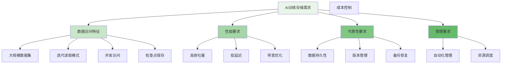

随着人工智能技术的快速发展，AI训练作业对存储系统提出了更高的要求。大规模机器学习模型的训练需要处理海量数据集，同时要求存储系统具备高吞吐量、低延迟和良好的并发访问能力。与Kubeflow、Volcano等AI训练平台的深度集成，使得分布式文件存储系统能够更好地支持AI训练场景，提供高效、可靠的数据存储和访问服务。

## AI训练存储需求分析

AI训练作业对存储系统的需求与传统大数据处理有所不同，具有独特的特点和挑战。

### 访问模式特征



### 典型AI训练场景

```yaml
# AI训练典型场景
training_scenarios:
  computer_vision:
    data_types: ["图像数据", "标注文件"]
    access_pattern: "顺序读取大文件"
    performance_requirements:
      throughput: "GB/s级别"
      latency: "毫秒级"
    storage_features: ["数据增强支持", "格式转换", "缓存优化"]
  
  natural_language_processing:
    data_types: ["文本语料", "词向量", "预训练模型"]
    access_pattern: "随机读取小文件"
    performance_requirements:
      throughput: "MB/s级别"
      latency: "微秒级"
    storage_features: ["索引优化", "内存映射", "压缩支持"]
  
  recommendation_systems:
    data_types: ["用户行为日志", "特征向量", "模型参数"]
    access_pattern: "混合读写模式"
    performance_requirements:
      throughput: "GB/s级别"
      latency: "毫秒级"
    storage_features: ["实时写入", "增量更新", "版本控制"]
  
  deep_learning:
    data_types: ["训练数据", "模型检查点", "训练日志"]
    access_pattern: "周期性大文件读写"
    performance_requirements:
      throughput: "GB/s级别"
      latency: "毫秒级"
    storage_features: ["原子操作", "一致性保证", "快照支持"]
```

## 与Kubeflow集成实践

Kubeflow是Kubernetes原生的机器学习平台，通过CSI集成可以为AI训练作业提供高效的存储支持。

### Kubeflow存储架构

```python
class KubeflowDistributedFileIntegration:
    def __init__(self, k8s_client, storage_client):
        self.k8s_client = k8s_client
        self.storage_client = storage_client
    
    def create_training_volume(self, training_job, volume_config):
        """为训练作业创建存储卷"""
        # 创建PersistentVolumeClaim
        pvc = self.create_pvc_for_training(training_job, volume_config)
        
        # 配置训练作业使用PVC
        self.configure_training_job_volume(training_job, pvc)
        
        return pvc
    
    def create_pvc_for_training(self, training_job, volume_config):
        """为训练作业创建PVC"""
        pvc_spec = {
            'apiVersion': 'v1',
            'kind': 'PersistentVolumeClaim',
            'metadata': {
                'name': f"{training_job.name}-data",
                'namespace': training_job.namespace,
                'labels': {
                    'app': 'kubeflow-training',
                    'training-job': training_job.name
                }
            },
            'spec': {
                'accessModes': ['ReadWriteMany'],
                'storageClassName': volume_config.get('storage_class', 'distributed-file-ai'),
                'resources': {
                    'requests': {
                        'storage': volume_config.get('size', '100Gi')
                    }
                }
            }
        }
        
        return self.k8s_client.create_namespaced_persistent_volume_claim(
            namespace=training_job.namespace,
            body=pvc_spec
        )
    
    def optimize_for_ml_workloads(self, pvc, training_config):
        """为机器学习工作负载优化存储配置"""
        # 设置AI优化的存储类参数
        storage_class_params = {
            'type': 'ssd',
            'replication': '3',
            'cache': 'true',
            'prefetch': 'true',
            'compression': 'false',  # AI训练数据通常不需要压缩
            'encryption': 'true'
        }
        
        # 创建AI专用的StorageClass
        storage_class = self.create_ai_storage_class(storage_class_params)
        
        # 更新PVC使用AI优化的StorageClass
        pvc.spec.storage_class_name = storage_class.metadata.name
        
        return self.k8s_client.patch_namespaced_persistent_volume_claim(
            name=pvc.metadata.name,
            namespace=pvc.metadata.namespace,
            body=pvc
        )
```

### TFJob集成配置

```yaml
# TFJob配置示例
apiVersion: kubeflow.org/v1
kind: TFJob
metadata:
  name: mnist-training
  namespace: kubeflow
spec:
  tfReplicaSpecs:
    Chief:
      replicas: 1
      template:
        spec:
          containers:
            - name: tensorflow
              image: tensorflow/tensorflow:2.8.0
              command:
                - python
                - /opt/model/train.py
              volumeMounts:
                - name: training-data
                  mountPath: /data
                - name: model-checkpoints
                  mountPath: /checkpoints
              resources:
                limits:
                  nvidia.com/gpu: 1
          volumes:
            - name: training-data
              persistentVolumeClaim:
                claimName: mnist-training-data
            - name: model-checkpoints
              persistentVolumeClaim:
                claimName: mnist-checkpoints
          restartPolicy: OnFailure
---
# 数据卷PVC配置
apiVersion: v1
kind: PersistentVolumeClaim
metadata:
  name: mnist-training-data
  namespace: kubeflow
spec:
  accessModes:
    - ReadWriteMany
  storageClassName: distributed-file-ai-high-performance
  resources:
    requests:
      storage: 50Gi
---
# 检查点PVC配置
apiVersion: v1
kind: PersistentVolumeClaim
metadata:
  name: mnist-checkpoints
  namespace: kubeflow
spec:
  accessModes:
    - ReadWriteMany
  storageClassName: distributed-file-ai-standard
  resources:
    requests:
      storage: 10Gi
```

### PyTorchJob集成

```go
type PyTorchJobIntegration struct {
    k8sClient     kubernetes.Interface
    storageClient *DistributedFileClient
}

func (pji *PyTorchJobIntegration) ConfigurePyTorchJobStorage(job *pytorchv1.PyTorchJob) error {
    // 为PyTorch作业配置数据卷
    dataPVC, err := pji.createDataVolume(job)
    if err != nil {
        return fmt.Errorf("failed to create data volume: %v", err)
    }
    
    // 为PyTorch作业配置模型检查点卷
    checkpointPVC, err := pji.createCheckpointVolume(job)
    if err != nil {
        return fmt.Errorf("failed to create checkpoint volume: %v", err)
    }
    
    // 配置作业使用存储卷
    err = pji.configureJobVolumes(job, dataPVC, checkpointPVC)
    if err != nil {
        return fmt.Errorf("failed to configure job volumes: %v", err)
    }
    
    return nil
}

func (pji *PyTorchJobIntegration) createDataVolume(job *pytorchv1.PyTorchJob) (*v1.PersistentVolumeClaim, error) {
    pvc := &v1.PersistentVolumeClaim{
        ObjectMeta: metav1.ObjectMeta{
            Name:      fmt.Sprintf("%s-data", job.Name),
            Namespace: job.Namespace,
            Labels: map[string]string{
                "app":           "pytorch-training",
                "training-job":  job.Name,
                "volume-type":   "training-data",
            },
        },
        Spec: v1.PersistentVolumeClaimSpec{
            AccessModes: []v1.PersistentVolumeAccessMode{
                v1.ReadWriteMany,
            },
            StorageClassName: stringPtr("distributed-file-ai-high-performance"),
            Resources: v1.ResourceRequirements{
                Requests: v1.ResourceList{
                    v1.ResourceStorage: resource.MustParse("100Gi"),
                },
            },
        },
    }
    
    return pji.k8sClient.CoreV1().PersistentVolumeClaims(job.Namespace).Create(
        context.Background(), pvc, metav1.CreateOptions{})
}

func (pji *PyTorchJobIntegration) optimizeDataAccess(job *pytorchv1.PyTorchJob) error {
    // 配置数据预取
    err := pji.configureDataPrefetch(job)
    if err != nil {
        return err
    }
    
    // 配置缓存策略
    err = pji.configureCachePolicy(job)
    if err != nil {
        return err
    }
    
    // 配置并行读取
    return pji.configureParallelReads(job)
}
```

## 与Volcano集成实践

Volcano是专为AI、大数据和HPC工作负载设计的Kubernetes批处理系统，提供了丰富的调度和资源管理功能。

### Volcano作业配置

```yaml
# Volcano Job配置示例
apiVersion: batch.volcano.sh/v1alpha1
kind: Job
metadata:
  name: ai-training-job
  namespace: volcano
spec:
  minAvailable: 3
  schedulerName: volcano
  policies:
    - event: PodEvicted
      action: RestartJob
    - event: PodFailed
      action: RestartJob
  plugins:
    ssh: []
    svc: []
  tasks:
    - name: master
      replicas: 1
      template:
        spec:
          containers:
            - name: tensorflow
              image: tensorflow/tensorflow:2.8.0
              command:
                - python
                - /opt/model/train.py
                - --data-path=/data
                - --checkpoint-path=/checkpoints
              volumeMounts:
                - name: training-data
                  mountPath: /data
                - name: model-checkpoints
                  mountPath: /checkpoints
              resources:
                requests:
                  cpu: 4
                  memory: 16Gi
                  nvidia.com/gpu: 1
                limits:
                  nvidia.com/gpu: 1
          volumes:
            - name: training-data
              persistentVolumeClaim:
                claimName: ai-training-data
            - name: model-checkpoints
              persistentVolumeClaim:
                claimName: ai-checkpoints
          restartPolicy: OnFailure
    - name: worker
      replicas: 2
      template:
        spec:
          containers:
            - name: tensorflow
              image: tensorflow/tensorflow:2.8.0
              command:
                - python
                - /opt/model/worker.py
              volumeMounts:
                - name: training-data
                  mountPath: /data
              resources:
                requests:
                  cpu: 4
                  memory: 16Gi
                  nvidia.com/gpu: 1
                limits:
                  nvidia.com/gpu: 1
          volumes:
            - name: training-data
              persistentVolumeClaim:
                claimName: ai-training-data
          restartPolicy: OnFailure
---
# Volcano Queue配置
apiVersion: scheduling.volcano.sh/v1beta1
kind: Queue
metadata:
  name: ai-training
spec:
  weight: 1
  reclaimable: true
  extendClusters:
    - name: default
  capability:
    cpu: 100
    memory: 512Gi
    nvidia.com/gpu: 20
```

### 资源调度优化

```typescript
interface VolcanoSchedulerIntegration {
    optimizeResourceAllocation(job: VolcanoJob): Promise<SchedulingPlan>;
    configureGangScheduling(job: VolcanoJob): Promise<void>;
    setupResourceQuotas(namespace: string, quotas: ResourceQuotas): Promise<void>;
}

class DistributedFileVolcanoIntegration implements VolcanoSchedulerIntegration {
    private k8sClient: KubernetesClient;
    private volcanoClient: VolcanoClient;
    
    async optimizeResourceAllocation(job: VolcanoJob): Promise<SchedulingPlan> {
        // 分析作业的资源需求
        const resourceRequirements = await this.analyzeResourceRequirements(job);
        
        // 获取集群资源状态
        const clusterResources = await this.getClusterResources();
        
        // 生成调度计划
        const schedulingPlan = this.generateSchedulingPlan(
            resourceRequirements, 
            clusterResources
        );
        
        // 应用调度优化策略
        await this.applySchedulingOptimizations(job, schedulingPlan);
        
        return schedulingPlan;
    }
    
    private async analyzeResourceRequirements(job: VolcanoJob): Promise<ResourceRequirements> {
        const requirements: ResourceRequirements = {
            cpu: 0,
            memory: 0,
            gpu: 0,
            storage: 0,
            bandwidth: 0
        };
        
        // 分析各任务的资源需求
        for (const task of job.spec.tasks) {
            const taskResources = task.template.spec.containers[0].resources;
            
            // 累加CPU需求
            requirements.cpu += this.parseResourceQuantity(
                taskResources.requests?.cpu || taskResources.limits?.cpu
            ) * task.replicas;
            
            // 累加内存需求
            requirements.memory += this.parseResourceQuantity(
                taskResources.requests?.memory || taskResources.limits?.memory
            ) * task.replicas;
            
            // 累加GPU需求
            requirements.gpu += this.parseResourceQuantity(
                taskResources.requests?.['nvidia.com/gpu'] || 
                taskResources.limits?.['nvidia.com/gpu']
            ) * task.replicas;
            
            // 分析存储需求
            const storageRequirements = await this.analyzeStorageRequirements(task);
            requirements.storage += storageRequirements.totalSize;
            requirements.bandwidth += storageRequirements.bandwidth;
        }
        
        return requirements;
    }
    
    private async analyzeStorageRequirements(task: TaskSpec): Promise<StorageRequirements> {
        let totalSize = 0;
        let bandwidth = 0;
        
        // 分析卷挂载
        for (const volume of task.template.spec.volumes) {
            if (volume.persistentVolumeClaim) {
                const pvc = await this.k8sClient.readNamespacedPersistentVolumeClaim(
                    volume.persistentVolumeClaim.claimName,
                    task.template.metadata.namespace
                );
                
                const size = this.parseResourceQuantity(pvc.spec.resources.requests.storage);
                totalSize += size;
                
                // 根据存储类估算带宽需求
                const storageClass = await this.k8sClient.readStorageClass(
                    pvc.spec.storageClassName
                );
                
                bandwidth += this.estimateBandwidthRequirement(storageClass, size);
            }
        }
        
        return {
            totalSize,
            bandwidth
        };
    }
}
```

## AI训练优化特性

针对AI训练场景的特殊需求，存储系统需要提供专门的优化特性。

### 数据预取与缓存

```python
class AIOptimizedStorageClient:
    def __init__(self, config):
        self.config = config
        self.prefetch_manager = PrefetchManager()
        self.cache_manager = CacheManager()
        self.data_loader = DataLoader()
    
    def enable_ai_optimizations(self, training_job):
        """启用AI训练优化特性"""
        # 启用数据预取
        self.prefetch_manager.enable_for_job(training_job)
        
        # 配置智能缓存
        self.cache_manager.configure_for_training(training_job)
        
        # 优化数据加载
        self.data_loader.optimize_for_job(training_job)
    
    def prefetch_training_data(self, data_paths, prefetch_config):
        """预取训练数据"""
        # 分析数据访问模式
        access_patterns = self.analyze_access_patterns(data_paths)
        
        # 根据访问模式制定预取策略
        prefetch_strategy = self.generate_prefetch_strategy(access_patterns, prefetch_config)
        
        # 执行数据预取
        for path in data_paths:
            self.prefetch_manager.prefetch_path(path, prefetch_strategy)
    
    def setup_training_cache(self, cache_config):
        """设置训练缓存"""
        # 配置内存缓存
        self.cache_manager.configure_memory_cache(
            size=cache_config.get('memory_cache_size', '10GB'),
            ttl=cache_config.get('memory_cache_ttl', '1h')
        )
        
        # 配置SSD缓存
        self.cache_manager.configure_ssd_cache(
            path=cache_config.get('ssd_cache_path', '/cache/ssd'),
            size=cache_config.get('ssd_cache_size', '100GB')
        )
        
        # 启用智能缓存策略
        self.cache_manager.enable_adaptive_caching()

class PrefetchManager:
    def __init__(self):
        self.prefetch_queue = asyncio.Queue()
        self.prefetch_workers = []
        self.access_history = {}
    
    def enable_for_job(self, job):
        """为作业启用预取"""
        # 启动预取工作线程
        for i in range(job.config.prefetch_workers or 4):
            worker = PrefetchWorker(f"worker-{i}", self.prefetch_queue)
            self.prefetch_workers.append(worker)
            worker.start()
        
        # 监控数据访问模式
        self.monitor_access_patterns(job)
    
    def prefetch_path(self, path, strategy):
        """预取指定路径的数据"""
        prefetch_task = PrefetchTask(
            path=path,
            strategy=strategy,
            priority=self.calculate_priority(path)
        )
        
        self.prefetch_queue.put_nowait(prefetch_task)
    
    def analyze_access_patterns(self, data_paths):
        """分析数据访问模式"""
        patterns = {}
        
        for path in data_paths:
            # 获取历史访问记录
            history = self.access_history.get(path, [])
            
            # 分析访问频率
            access_frequency = len(history) / (time.time() - history[0].timestamp) if history else 0
            
            # 分析访问顺序性
            sequentiality = self.calculate_sequentiality(history)
            
            # 分析数据大小分布
            size_distribution = self.analyze_size_distribution(path)
            
            patterns[path] = {
                'frequency': access_frequency,
                'sequentiality': sequentiality,
                'size_distribution': size_distribution
            }
        
        return patterns
```

### 检查点管理

```go
type CheckpointManager struct {
    storageClient *DistributedFileClient
    checkpointConfig CheckpointConfig
    checkpointHistory map[string][]CheckpointInfo
}

type CheckpointInfo struct {
    ID string `json:"id"`
    Path string `json:"path"`
    Timestamp time.Time `json:"timestamp"`
    Size int64 `json:"size"`
    Metrics map[string]float64 `json:"metrics"`
}

func (cm *CheckpointManager) SaveCheckpoint(jobID string, checkpointData []byte, metrics map[string]float64) (*CheckpointInfo, error) {
    // 生成检查点路径
    checkpointPath := cm.generateCheckpointPath(jobID)
    
    // 保存检查点数据
    err := cm.storageClient.WriteObject(checkpointPath, checkpointData)
    if err != nil {
        return nil, fmt.Errorf("failed to save checkpoint: %v", err)
    }
    
    // 创建检查点信息
    checkpointInfo := &CheckpointInfo{
        ID: uuid.New().String(),
        Path: checkpointPath,
        Timestamp: time.Now(),
        Size: int64(len(checkpointData)),
        Metrics: metrics,
    }
    
    // 更新检查点历史
    cm.updateCheckpointHistory(jobID, checkpointInfo)
    
    // 清理旧检查点
    cm.cleanupOldCheckpoints(jobID)
    
    return checkpointInfo, nil
}

func (cm *CheckpointManager) LoadLatestCheckpoint(jobID string) ([]byte, *CheckpointInfo, error) {
    // 获取最新的检查点信息
    latestCheckpoint := cm.getLatestCheckpoint(jobID)
    if latestCheckpoint == nil {
        return nil, nil, fmt.Errorf("no checkpoint found for job %s", jobID)
    }
    
    // 读取检查点数据
    checkpointData, err := cm.storageClient.ReadObject(latestCheckpoint.Path)
    if err != nil {
        return nil, nil, fmt.Errorf("failed to load checkpoint: %v", err)
    }
    
    return checkpointData, latestCheckpoint, nil
}

func (cm *CheckpointManager) cleanupOldCheckpoints(jobID string) {
    // 获取检查点历史
    history := cm.checkpointHistory[jobID]
    
    // 根据保留策略清理旧检查点
    keepCount := cm.checkpointConfig.MaxCheckpoints
    if len(history) > keepCount {
        // 按时间排序，保留最新的检查点
        sort.Slice(history, func(i, j int) bool {
            return history[i].Timestamp.After(history[j].Timestamp)
        })
        
        // 删除旧的检查点
        for i := keepCount; i < len(history); i++ {
            cm.storageClient.DeleteObject(history[i].Path)
        }
        
        // 更新历史记录
        cm.checkpointHistory[jobID] = history[:keepCount]
    }
}
```

## 监控与诊断

AI训练场景需要专门的监控和诊断工具来确保训练作业的顺利进行。

### AI训练监控指标

```yaml
# AI训练监控指标配置
ai_training_metrics:
  data_access:
    - name: "data_read_throughput"
      description: "训练数据读取吞吐量"
      unit: "MB/s"
      thresholds:
        warning: "< 100"
        critical: "< 50"
    
    - name: "data_read_latency"
      description: "训练数据读取延迟"
      unit: "ms"
      thresholds:
        warning: "> 100"
        critical: "> 500"
    
    - name: "prefetch_hit_ratio"
      description: "数据预取命中率"
      unit: "%"
      thresholds:
        warning: "< 80"
        critical: "< 60"
  
  checkpoint_operations:
    - name: "checkpoint_save_time"
      description: "检查点保存时间"
      unit: "seconds"
      thresholds:
        warning: "> 30"
        critical: "> 60"
    
    - name: "checkpoint_restore_time"
      description: "检查点恢复时间"
      unit: "seconds"
      thresholds:
        warning: "> 30"
        critical: "> 60"
    
    - name: "checkpoint_failure_rate"
      description: "检查点失败率"
      unit: "%"
      thresholds:
        warning: "> 5"
        critical: "> 10"
  
  cache_performance:
    - name: "cache_hit_ratio"
      description: "缓存命中率"
      unit: "%"
      thresholds:
        warning: "< 85"
        critical: "< 70"
    
    - name: "cache_eviction_rate"
      description: "缓存淘汰率"
      unit: "ops/s"
      thresholds:
        warning: "> 1000"
        critical: "> 5000"
```

### 训练诊断工具

```bash
#!/bin/bash
# AI训练存储诊断工具

# 检查训练数据访问性能
function check_data_access_performance() {
    echo "Checking data access performance..."
    
    # 测试顺序读取性能
    echo "Testing sequential read performance..."
    fio --name=seq-read-test \
        --directory=/data/training \
        --rw=read \
        --bs=1M \
        --size=1G \
        --numjobs=4 \
        --direct=1 \
        --runtime=60 \
        --time_based \
        --group_reporting
    
    # 测试随机读取性能
    echo "Testing random read performance..."
    fio --name=rand-read-test \
        --directory=/data/training \
        --rw=randread \
        --bs=4k \
        --size=100M \
        --numjobs=16 \
        --direct=1 \
        --runtime=60 \
        --time_based \
        --group_reporting
}

# 检查检查点性能
function check_checkpoint_performance() {
    echo "Checking checkpoint performance..."
    
    # 测试检查点保存性能
    local checkpoint_file="/tmp/checkpoint-test-$(date +%s)"
    local checkpoint_size="1G"
    
    echo "Testing checkpoint save performance..."
    time dd if=/dev/zero of="$checkpoint_file" bs=1M count=1024
    
    # 测试检查点恢复性能
    echo "Testing checkpoint restore performance..."
    time dd if="$checkpoint_file" of=/dev/null bs=1M
    
    # 清理测试文件
    rm -f "$checkpoint_file"
}

# 检查缓存状态
function check_cache_status() {
    echo "Checking cache status..."
    
    # 检查内存缓存
    echo "Memory cache status:"
    distributed-file-cli cache stats --type=memory
    
    # 检查SSD缓存
    echo "SSD cache status:"
    distributed-file-cli cache stats --type=ssd
    
    # 检查分布式缓存
    echo "Distributed cache status:"
    distributed-file-cli cache stats --type=distributed
}

# 生成AI训练诊断报告
function generate_ai_diagnostic_report() {
    local report_file="/tmp/ai-diagnostic-report-$(date +%Y%m%d-%H%M%S).json"
    
    echo "Generating AI training diagnostic report..."
    
    local report_data=$(cat <<EOF
{
    "timestamp": "$(date -Iseconds)",
    "system_info": {
        "hostname": "$(hostname)",
        "kernel": "$(uname -r)",
        "cpu_count": $(nproc),
        "memory_total": "$(free -h | awk '/^Mem:/{print $2}')"
    },
    "storage_metrics": {
        "data_access_performance": "$(check_data_access_performance)",
        "checkpoint_performance": "$(check_checkpoint_performance)",
        "cache_status": "$(check_cache_status)"
    }
}
EOF
)
    
    echo "$report_data" > "$report_file"
    echo "Diagnostic report saved to: $report_file"
}

# 主诊断流程
function main() {
    echo "Starting AI training storage diagnostics..."
    
    check_data_access_performance
    check_checkpoint_performance
    check_cache_status
    generate_ai_diagnostic_report
    
    echo "AI training storage diagnostics completed."
}

# 执行主流程
main
```

## 最佳实践建议

在将分布式文件存储系统与AI训练平台集成时，建议遵循以下最佳实践：

### 性能优化

1. **数据布局优化**：根据训练数据的访问模式优化数据在存储系统中的布局
2. **预取策略**：实现智能的数据预取机制，减少训练过程中的等待时间
3. **缓存策略**：配置多层缓存体系，提高热点数据的访问速度

### 可靠性保障

1. **检查点管理**：实现高效的检查点保存和恢复机制
2. **数据备份**：定期备份重要的训练数据和模型
3. **故障恢复**：建立完善的故障检测和自动恢复机制

### 资源管理

1. **存储类配置**：为不同类型的AI训练作业配置专门的StorageClass
2. **资源配额**：合理设置存储资源配额，防止资源滥用
3. **成本控制**：通过生命周期管理控制存储成本

通过与Kubeflow、Volcano等AI训练平台的深度集成，分布式文件存储系统能够为AI训练作业提供高性能、高可靠的存储服务，支撑各种复杂的机器学习应用场景。