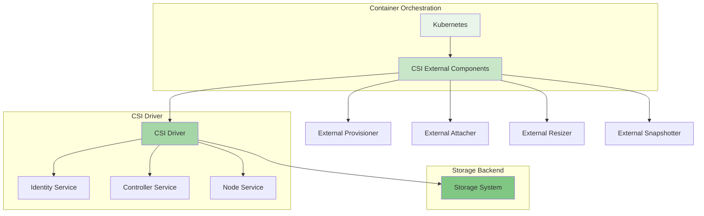

随着云原生技术的快速发展，容器化应用对持久化存储的需求日益增长。Container Storage Interface (CSI) 作为云原生存储的标准接口，为分布式文件存储系统与Kubernetes等容器编排平台的集成提供了标准化的解决方案。开发高质量的CSI驱动不仅能够提升存储系统的易用性，还能确保与云原生生态的无缝集成。

## CSI架构概述

CSI规范定义了存储提供商与容器编排系统之间的标准接口，通过标准化的API实现存储系统的即插即用。

### CSI核心组件



### CSI服务接口

CSI驱动需要实现三个核心服务接口：

```go
// CSI接口定义
type IdentityServer interface {
    GetPluginInfo(context.Context, *GetPluginInfoRequest) (*GetPluginInfoResponse, error)
    GetPluginCapabilities(context.Context, *GetPluginCapabilitiesRequest) (*GetPluginCapabilitiesResponse, error)
    Probe(context.Context, *ProbeRequest) (*ProbeResponse, error)
}

type ControllerServer interface {
    CreateVolume(context.Context, *CreateVolumeRequest) (*CreateVolumeResponse, error)
    DeleteVolume(context.Context, *DeleteVolumeRequest) (*DeleteVolumeResponse, error)
    ControllerPublishVolume(context.Context, *ControllerPublishVolumeRequest) (*ControllerPublishVolumeResponse, error)
    ControllerUnpublishVolume(context.Context, *ControllerUnpublishVolumeRequest) (*ControllerUnpublishVolumeResponse, error)
    ValidateVolumeCapabilities(context.Context, *ValidateVolumeCapabilitiesRequest) (*ValidateVolumeCapabilitiesResponse, error)
    ListVolumes(context.Context, *ListVolumesRequest) (*ListVolumesResponse, error)
    GetCapacity(context.Context, *GetCapacityRequest) (*GetCapacityResponse, error)
    ControllerGetCapabilities(context.Context, *ControllerGetCapabilitiesRequest) (*ControllerGetCapabilitiesResponse, error)
    CreateSnapshot(context.Context, *CreateSnapshotRequest) (*CreateSnapshotResponse, error)
    DeleteSnapshot(context.Context, *DeleteSnapshotRequest) (*DeleteSnapshotResponse, error)
    ListSnapshots(context.Context, *ListSnapshotsRequest) (*ListSnapshotsResponse, error)
    ControllerExpandVolume(context.Context, *ControllerExpandVolumeRequest) (*ControllerExpandVolumeResponse, error)
}

type NodeServer interface {
    NodeStageVolume(context.Context, *NodeStageVolumeRequest) (*NodeStageVolumeResponse, error)
    NodeUnstageVolume(context.Context, *NodeUnstageVolumeRequest) (*NodeUnstageVolumeResponse, error)
    NodePublishVolume(context.Context, *NodePublishVolumeRequest) (*NodePublishVolumeResponse, error)
    NodeUnpublishVolume(context.Context, *NodeUnpublishVolumeRequest) (*NodeUnpublishVolumeResponse, error)
    NodeGetVolumeStats(context.Context, *NodeGetVolumeStatsRequest) (*NodeGetVolumeStatsResponse, error)
    NodeExpandVolume(context.Context, *NodeExpandVolumeRequest) (*NodeExpandVolumeResponse, error)
    NodeGetCapabilities(context.Context, *NodeGetCapabilitiesRequest) (*NodeGetCapabilitiesResponse, error)
    NodeGetInfo(context.Context, *NodeGetInfoRequest) (*NodeGetInfoResponse, error)
}
```

## CSI驱动开发实践

开发一个完整的CSI驱动需要深入理解存储系统的特性和CSI规范的要求。

### 驱动初始化与配置

```python
class CSIDriver:
    def __init__(self, config):
        self.config = config
        self.driver_name = config.get('driver_name', 'distributed-file-csi')
        self.version = config.get('version', '1.0.0')
        self.endpoint = config.get('endpoint', 'unix:///csi/csi.sock')
        
        # 初始化存储客户端
        self.storage_client = self.initialize_storage_client()
        
        # 初始化gRPC服务器
        self.grpc_server = grpc.server(futures.ThreadPoolExecutor(max_workers=10))
        
        # 注册CSI服务
        self.register_csi_services()
    
    def initialize_storage_client(self):
        """初始化存储系统客户端"""
        client_config = {
            'endpoint': self.config.get('storage_endpoint'),
            'access_key': self.config.get('access_key'),
            'secret_key': self.config.get('secret_key'),
            'timeout': self.config.get('storage_timeout', 30)
        }
        
        return StorageClient(client_config)
    
    def register_csi_services(self):
        """注册CSI服务"""
        # 注册Identity服务
        identity_pb2_grpc.add_IdentityServicer_to_server(
            IdentityService(self), self.grpc_server)
        
        # 注册Controller服务
        controller_pb2_grpc.add_ControllerServicer_to_server(
            ControllerService(self), self.grpc_server)
        
        # 注册Node服务
        node_pb2_grpc.add_NodeServicer_to_server(
            NodeService(self), self.grpc_server)
    
    def start(self):
        """启动CSI驱动"""
        # 绑定端点
        self.grpc_server.add_insecure_port(self.endpoint)
        
        # 启动服务器
        self.grpc_server.start()
        
        # 记录启动日志
        logger.info(f"CSI Driver {self.driver_name} v{self.version} started on {self.endpoint}")
        
        try:
            # 等待终止信号
            while True:
                time.sleep(86400)  # 24小时
        except KeyboardInterrupt:
            self.stop()
    
    def stop(self):
        """停止CSI驱动"""
        logger.info("Shutting down CSI Driver...")
        self.grpc_server.stop(0)
```

### Identity服务实现

```javascript
class IdentityService {
    constructor(driver) {
        this.driver = driver;
    }
    
    async GetPluginInfo(call, callback) {
        try {
            const response = {
                name: this.driver.driverName,
                vendor_version: this.driver.version,
                manifest: {
                    'commit': this.driver.commitId,
                    'build_time': this.driver.buildTime
                }
            };
            
            callback(null, response);
        } catch (error) {
            logger.error('GetPluginInfo failed:', error);
            callback({
                code: grpc.status.INTERNAL,
                message: `Failed to get plugin info: ${error.message}`
            });
        }
    }
    
    async GetPluginCapabilities(call, callback) {
        try {
            const response = {
                capabilities: [
                    {
                        service: {
                            type: 'CONTROLLER_SERVICE'
                        }
                    },
                    {
                        service: {
                            type: 'VOLUME_ACCESSIBILITY_CONSTRAINTS'
                        }
                    }
                ]
            };
            
            callback(null, response);
        } catch (error) {
            logger.error('GetPluginCapabilities failed:', error);
            callback({
                code: grpc.status.INTERNAL,
                message: `Failed to get plugin capabilities: ${error.message}`
            });
        }
    }
    
    async Probe(call, callback) {
        try {
            // 检查存储系统连接状态
            const isReady = await this.driver.storageClient.ping();
            
            const response = {
                ready: {
                    value: isReady
                }
            };
            
            callback(null, response);
        } catch (error) {
            logger.error('Probe failed:', error);
            callback({
                code: grpc.status.INTERNAL,
                message: `Failed to probe storage system: ${error.message}`
            });
        }
    }
}
```

### Controller服务实现

```typescript
interface ControllerService {
    CreateVolume(request: CreateVolumeRequest): Promise<CreateVolumeResponse>;
    DeleteVolume(request: DeleteVolumeRequest): Promise<DeleteVolumeResponse>;
    ControllerPublishVolume(request: ControllerPublishVolumeRequest): Promise<ControllerPublishVolumeResponse>;
    ControllerUnpublishVolume(request: ControllerUnpublishVolumeRequest): Promise<ControllerUnpublishVolumeResponse>;
}

class DistributedFileControllerService implements ControllerService {
    constructor(private driver: CSIDriver) {}
    
    async CreateVolume(request: CreateVolumeRequest): Promise<CreateVolumeResponse> {
        // 验证请求参数
        if (!request.name) {
            throw new Error('Volume name is required');
        }
        
        if (!request.capacity_range?.required_bytes) {
            throw new Error('Required capacity is required');
        }
        
        // 检查卷是否已存在
        const existingVolume = await this.driver.storageClient.getVolumeByName(request.name);
        if (existingVolume) {
            // 验证容量是否匹配
            if (existingVolume.capacity !== request.capacity_range.required_bytes) {
                throw new Error('Volume already exists with different capacity');
            }
            
            return {
                volume: this.convertToCSIVolume(existingVolume)
            };
        }
        
        // 创建新卷
        const volumeConfig = {
            name: request.name,
            capacity: request.capacity_range.required_bytes,
            parameters: request.parameters || {},
            accessibility_requirements: request.accessibility_requirements
        };
        
        try {
            const newVolume = await this.driver.storageClient.createVolume(volumeConfig);
            
            return {
                volume: this.convertToCSIVolume(newVolume)
            };
        } catch (error) {
            logger.error('Failed to create volume:', error);
            throw new Error(`Failed to create volume: ${error.message}`);
        }
    }
    
    async DeleteVolume(request: DeleteVolumeRequest): Promise<DeleteVolumeResponse> {
        if (!request.volume_id) {
            throw new Error('Volume ID is required');
        }
        
        try {
            await this.driver.storageClient.deleteVolume(request.volume_id);
            return {};
        } catch (error) {
            // 如果卷不存在，返回成功（幂等性）
            if (error.code === 'VOLUME_NOT_FOUND') {
                return {};
            }
            
            logger.error('Failed to delete volume:', error);
            throw new Error(`Failed to delete volume: ${error.message}`);
        }
    }
    
    private convertToCSIVolume(volume: StorageVolume): CSIVolume {
        return {
            volume_id: volume.id,
            capacity_bytes: volume.capacity,
            volume_context: volume.metadata,
            content_source: volume.content_source,
            accessible_topology: volume.accessible_topology
        };
    }
}
```

## Node服务实现

Node服务负责在节点上挂载和卸载卷，是CSI驱动的关键组件。

### Node服务核心实现

```rust
use tonic::{Request, Response, Status};
use crate::csi::{
    NodeStageVolumeRequest, NodeStageVolumeResponse,
    NodeUnstageVolumeRequest, NodeUnstageVolumeResponse,
    NodePublishVolumeRequest, NodePublishVolumeResponse,
    NodeUnpublishVolumeRequest, NodeUnpublishVolumeResponse,
    NodeGetCapabilitiesRequest, NodeGetCapabilitiesResponse,
    NodeGetInfoRequest, NodeGetInfoResponse,
};

pub struct NodeService {
    node_id: String,
    max_volumes_per_node: i32,
    mounter: Mounter,
}

impl NodeService {
    pub fn new(node_id: String, max_volumes: i32) -> Self {
        Self {
            node_id,
            max_volumes_per_node: max_volumes,
            mounter: Mounter::new(),
        }
    }
    
    pub async fn node_stage_volume(
        &self,
        request: Request<NodeStageVolumeRequest>,
    ) -> Result<Response<NodeStageVolumeResponse>, Status> {
        let req = request.into_inner();
        
        // 验证参数
        if req.volume_id.is_empty() {
            return Err(Status::invalid_argument("Volume ID is required"));
        }
        
        if req.staging_target_path.is_empty() {
            return Err(Status::invalid_argument("Staging target path is required"));
        }
        
        if req.volume_capability.is_none() {
            return Err(Status::invalid_argument("Volume capability is required"));
        }
        
        // 检查卷是否已暂存
        if self.is_volume_staged(&req.volume_id, &req.staging_target_path).await {
            return Ok(Response::new(NodeStageVolumeResponse {}));
        }
        
        // 执行卷暂存操作
        self.stage_volume(&req).await?;
        
        Ok(Response::new(NodeStageVolumeResponse {}))
    }
    
    async fn stage_volume(&self, req: &NodeStageVolumeRequest) -> Result<(), Status> {
        // 获取卷信息
        let volume_info = self.get_volume_info(&req.volume_id).await?;
        
        // 准备暂存目录
        self.prepare_staging_path(&req.staging_target_path).await?;
        
        // 格式化卷（如果需要）
        if req.volume_capability.as_ref().unwrap().access_type.is_some() {
            self.format_volume_if_needed(&volume_info, &req).await?;
        }
        
        // 挂载卷到暂存路径
        self.mounter.mount(
            &volume_info.device_path,
            &req.staging_target_path,
            &req.volume_capability.as_ref().unwrap().mount.as_ref().unwrap().fs_type,
            &req.volume_capability.as_ref().unwrap().mount.as_ref().unwrap().mount_flags,
        ).await?;
        
        // 记录暂存信息
        self.record_staging_info(&req.volume_id, &req.staging_target_path).await?;
        
        Ok(())
    }
    
    pub async fn node_publish_volume(
        &self,
        request: Request<NodePublishVolumeRequest>,
    ) -> Result<Response<NodePublishVolumeResponse>, Status> {
        let req = request.into_inner();
        
        // 验证参数
        if req.volume_id.is_empty() {
            return Err(Status::invalid_argument("Volume ID is required"));
        }
        
        if req.target_path.is_empty() {
            return Err(Status::invalid_argument("Target path is required"));
        }
        
        if req.volume_capability.is_none() {
            return Err(Status::invalid_argument("Volume capability is required"));
        }
        
        // 检查卷是否已发布
        if self.is_volume_published(&req.volume_id, &req.target_path).await {
            return Ok(Response::new(NodePublishVolumeResponse {}));
        }
        
        // 执行卷发布操作
        self.publish_volume(&req).await?;
        
        Ok(Response::new(NodePublishVolumeResponse {}))
    }
    
    async fn publish_volume(&self, req: &NodePublishVolumeRequest) -> Result<(), Status> {
        // 准备目标路径
        self.prepare_target_path(&req.target_path).await?;
        
        // 根据访问类型执行不同的发布操作
        match &req.volume_capability.as_ref().unwrap().access_type {
            Some(access_type) => match access_type {
                csi::volume_capability::AccessType::Mount(mount) => {
                    // 绑定挂载
                    self.mounter.bind_mount(
                        &req.staging_target_path,
                        &req.target_path,
                        &mount.mount_flags,
                    ).await?;
                }
                csi::volume_capability::AccessType::Block(_) => {
                    // 块设备发布
                    self.publish_block_device(&req).await?;
                }
            },
            None => {
                return Err(Status::invalid_argument("Access type is required"));
            }
        }
        
        // 记录发布信息
        self.record_publish_info(&req.volume_id, &req.target_path).await?;
        
        Ok(())
    }
}
```

## CSI驱动部署与配置

正确的部署和配置是CSI驱动稳定运行的基础。

### 部署清单示例

```yaml
# CSI Driver Deployment
apiVersion: apps/v1
kind: Deployment
metadata:
  name: distributed-file-csi-controller
  namespace: kube-system
spec:
  replicas: 2
  selector:
    matchLabels:
      app: distributed-file-csi-controller
  template:
    metadata:
      labels:
        app: distributed-file-csi-controller
    spec:
      serviceAccountName: distributed-file-csi-controller-sa
      containers:
        - name: csi-provisioner
          image: k8s.gcr.io/sig-storage/csi-provisioner:v3.1.0
          args:
            - "--csi-address=$(ADDRESS)"
            - "--leader-election"
          env:
            - name: ADDRESS
              value: /csi/csi.sock
          volumeMounts:
            - name: socket-dir
              mountPath: /csi
          
        - name: csi-attacher
          image: k8s.gcr.io/sig-storage/csi-attacher:v3.4.0
          args:
            - "--csi-address=$(ADDRESS)"
            - "--leader-election"
          env:
            - name: ADDRESS
              value: /csi/csi.sock
          volumeMounts:
            - name: socket-dir
              mountPath: /csi
          
        - name: distributed-file-csi-driver
          image: your-registry/distributed-file-csi-driver:v1.0.0
          args:
            - "--endpoint=unix:///csi/csi.sock"
            - "--storage-endpoint=https://storage-api.example.com"
            - "--log-level=info"
          env:
            - name: ACCESS_KEY
              valueFrom:
                secretKeyRef:
                  name: distributed-file-secret
                  key: access-key
            - name: SECRET_KEY
              valueFrom:
                secretKeyRef:
                  name: distributed-file-secret
                  key: secret-key
          volumeMounts:
            - name: socket-dir
              mountPath: /csi
          ports:
            - name: healthz
              containerPort: 9808
              protocol: TCP
          livenessProbe:
            httpGet:
              path: /healthz
              port: healthz
            initialDelaySeconds: 10
            timeoutSeconds: 3
            periodSeconds: 10
            failureThreshold: 5
      volumes:
        - name: socket-dir
          emptyDir: {}
---
# Node DaemonSet
apiVersion: apps/v1
kind: DaemonSet
metadata:
  name: distributed-file-csi-node
  namespace: kube-system
spec:
  selector:
    matchLabels:
      app: distributed-file-csi-node
  template:
    metadata:
      labels:
        app: distributed-file-csi-node
    spec:
      hostNetwork: true
      dnsPolicy: ClusterFirstWithHostNet
      containers:
        - name: csi-driver-registrar
          image: k8s.gcr.io/sig-storage/csi-node-driver-registrar:v2.5.0
          args:
            - "--csi-address=$(ADDRESS)"
            - "--kubelet-registration-path=/var/lib/kubelet/plugins/distributed-file-csi/csi.sock"
          env:
            - name: ADDRESS
              value: /csi/csi.sock
            - name: KUBE_NODE_NAME
              valueFrom:
                fieldRef:
                  fieldPath: spec.nodeName
          volumeMounts:
            - name: plugin-dir
              mountPath: /csi
            - name: registration-dir
              mountPath: /registration
          
        - name: distributed-file-csi-driver
          image: your-registry/distributed-file-csi-driver:v1.0.0
          args:
            - "--endpoint=unix:///csi/csi.sock"
            - "--nodeid=$(KUBE_NODE_NAME)"
            - "--storage-endpoint=https://storage-api.example.com"
          env:
            - name: KUBE_NODE_NAME
              valueFrom:
                fieldRef:
                  fieldPath: spec.nodeName
            - name: ACCESS_KEY
              valueFrom:
                secretKeyRef:
                  name: distributed-file-secret
                  key: access-key
            - name: SECRET_KEY
              valueFrom:
                secretKeyRef:
                  name: distributed-file-secret
                  key: secret-key
          volumeMounts:
            - name: plugin-dir
              mountPath: /csi
            - name: pods-mount-dir
              mountPath: /var/lib/kubelet/pods
              mountPropagation: "Bidirectional"
            - name: device-dir
              mountPath: /dev
          securityContext:
            privileged: true
      volumes:
        - name: plugin-dir
          hostPath:
            path: /var/lib/kubelet/plugins/distributed-file-csi
            type: DirectoryOrCreate
        - name: registration-dir
          hostPath:
            path: /var/lib/kubelet/plugins_registry
            type: Directory
        - name: pods-mount-dir
          hostPath:
            path: /var/lib/kubelet/pods
            type: Directory
        - name: device-dir
          hostPath:
            path: /dev
            type: Directory
```

### 存储类配置

```yaml
# StorageClass配置
apiVersion: storage.k8s.io/v1
kind: StorageClass
metadata:
  name: distributed-file-standard
provisioner: distributed-file-csi
parameters:
  type: "standard"
  replication: "3"
  encryption: "true"
reclaimPolicy: Delete
allowVolumeExpansion: true
volumeBindingMode: WaitForFirstConsumer
---
apiVersion: storage.k8s.io/v1
kind: StorageClass
metadata:
  name: distributed-file-high-performance
provisioner: distributed-file-csi
parameters:
  type: "ssd"
  replication: "3"
  encryption: "true"
  cache: "true"
reclaimPolicy: Delete
allowVolumeExpansion: true
volumeBindingMode: WaitForFirstConsumer
```

## 测试与验证

完善的测试是确保CSI驱动质量的关键。

### 单元测试

```go
package csi

import (
    "context"
    "testing"
    
    "github.com/container-storage-interface/spec/lib/go/csi"
    "github.com/stretchr/testify/assert"
    "github.com/stretchr/testify/mock"
)

// Mock存储客户端
type MockStorageClient struct {
    mock.Mock
}

func (m *MockStorageClient) CreateVolume(name string, capacity int64) (*Volume, error) {
    args := m.Called(name, capacity)
    return args.Get(0).(*Volume), args.Error(1)
}

func (m *MockStorageClient) DeleteVolume(volumeID string) error {
    args := m.Called(volumeID)
    return args.Error(0)
}

// 测试Identity服务
func TestIdentityService_GetPluginInfo(t *testing.T) {
    driver := &CSIDriver{
        name:    "test-driver",
        version: "1.0.0",
    }
    
    service := &IdentityService{driver: driver}
    
    req := &csi.GetPluginInfoRequest{}
    resp, err := service.GetPluginInfo(context.Background(), req)
    
    assert.NoError(t, err)
    assert.Equal(t, "test-driver", resp.GetName())
    assert.Equal(t, "1.0.0", resp.GetVendorVersion())
}

// 测试Controller服务
func TestControllerService_CreateVolume(t *testing.T) {
    mockClient := new(MockStorageClient)
    driver := &CSIDriver{
        storageClient: mockClient,
    }
    
    service := &ControllerService{driver: driver}
    
    // 设置期望
    mockClient.On("GetVolumeByName", "test-volume").Return(nil, nil)
    mockClient.On("CreateVolume", "test-volume", int64(1073741824)).Return(
        &Volume{
            ID:       "vol-12345",
            Name:     "test-volume",
            Capacity: 1073741824,
        }, nil)
    
    req := &csi.CreateVolumeRequest{
        Name: "test-volume",
        CapacityRange: &csi.CapacityRange{
            RequiredBytes: 1073741824, // 1GB
        },
    }
    
    resp, err := service.CreateVolume(context.Background(), req)
    
    assert.NoError(t, err)
    assert.Equal(t, "vol-12345", resp.GetVolume().GetVolumeId())
    assert.Equal(t, int64(1073741824), resp.GetVolume().GetCapacityBytes())
    
    mockClient.AssertExpectations(t)
}
```

### 集成测试

```python
import pytest
import kubernetes
from kubernetes import client, config

class TestCSIDriver:
    def setup_class(self):
        """测试环境初始化"""
        config.load_kube_config()
        self.core_v1 = client.CoreV1Api()
        self.storage_v1 = client.StorageV1Api()
    
    def test_storage_class_creation(self):
        """测试存储类创建"""
        storage_class = {
            "apiVersion": "storage.k8s.io/v1",
            "kind": "StorageClass",
            "metadata": {
                "name": "test-distributed-file"
            },
            "provisioner": "distributed-file-csi",
            "parameters": {
                "type": "standard"
            }
        }
        
        try:
            self.storage_v1.create_storage_class(body=storage_class)
            # 验证存储类创建成功
            created_sc = self.storage_v1.read_storage_class(name="test-distributed-file")
            assert created_sc.provisioner == "distributed-file-csi"
        finally:
            # 清理资源
            self.storage_v1.delete_storage_class(name="test-distributed-file")
    
    def test_persistent_volume_claim(self):
        """测试持久化卷声明"""
        pvc = {
            "apiVersion": "v1",
            "kind": "PersistentVolumeClaim",
            "metadata": {
                "name": "test-pvc"
            },
            "spec": {
                "accessModes": ["ReadWriteOnce"],
                "resources": {
                    "requests": {
                        "storage": "1Gi"
                    }
                },
                "storageClassName": "test-distributed-file"
            }
        }
        
        try:
            # 创建PVC
            self.core_v1.create_namespaced_persistent_volume_claim(
                namespace="default",
                body=pvc
            )
            
            # 等待PVC绑定
            import time
            for i in range(30):
                pvc_status = self.core_v1.read_namespaced_persistent_volume_claim(
                    name="test-pvc",
                    namespace="default"
                )
                if pvc_status.status.phase == "Bound":
                    break
                time.sleep(2)
            
            # 验证PVC状态
            assert pvc_status.status.phase == "Bound"
            
        finally:
            # 清理资源
            self.core_v1.delete_namespaced_persistent_volume_claim(
                name="test-pvc",
                namespace="default"
            )
```

## 最佳实践与注意事项

开发和部署CSI驱动时需要遵循一系列最佳实践。

### 安全性考虑

```yaml
# 安全配置示例
apiVersion: v1
kind: Secret
metadata:
  name: distributed-file-secret
  namespace: kube-system
type: Opaque
data:
  # 使用base64编码的凭证
  access-key: <base64-encoded-access-key>
  secret-key: <base64-encoded-secret-key>
---
# RBAC配置
apiVersion: v1
kind: ServiceAccount
metadata:
  name: distributed-file-csi-controller-sa
  namespace: kube-system
---
apiVersion: rbac.authorization.k8s.io/v1
kind: ClusterRole
metadata:
  name: distributed-file-csi-controller-role
rules:
  - apiGroups: [""]
    resources: ["persistentvolumes"]
    verbs: ["get", "list", "watch", "create", "delete"]
  - apiGroups: [""]
    resources: ["persistentvolumeclaims"]
    verbs: ["get", "list", "watch", "update"]
  - apiGroups: ["storage.k8s.io"]
    resources: ["storageclasses"]
    verbs: ["get", "list", "watch"]
  - apiGroups: [""]
    resources: ["events"]
    verbs: ["list", "watch", "create", "update", "patch"]
---
apiVersion: rbac.authorization.k8s.io/v1
kind: ClusterRoleBinding
metadata:
  name: distributed-file-csi-controller-binding
roleRef:
  apiGroup: rbac.authorization.k8s.io
  kind: ClusterRole
  name: distributed-file-csi-controller-role
subjects:
  - kind: ServiceAccount
    name: distributed-file-csi-controller-sa
    namespace: kube-system
```

### 性能优化建议

1. **连接池管理**：为存储系统客户端实现连接池，避免频繁建立和关闭连接。
2. **缓存机制**：缓存卷信息和节点信息，减少对存储系统的查询压力。
3. **并发控制**：合理设置gRPC服务器的并发处理能力，避免资源耗尽。
4. **日志级别**：生产环境中使用适当的日志级别，避免过多的日志输出影响性能。

通过遵循CSI规范和最佳实践，开发人员可以构建出高质量、稳定可靠的分布式文件存储CSI驱动，为云原生应用提供强大的存储支持。