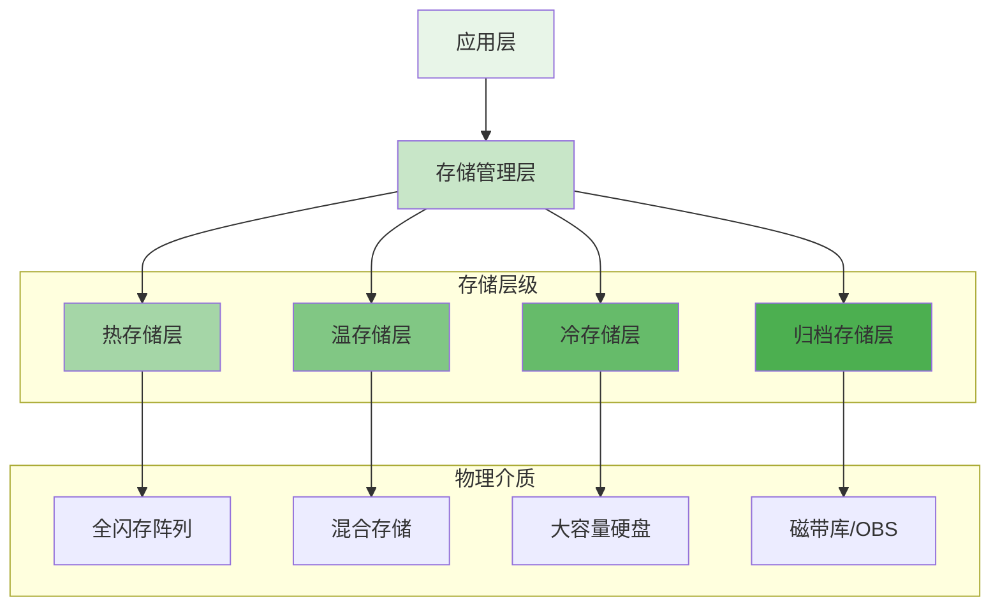

在分布式文件存储系统中，数据的访问模式往往呈现出明显的冷热分布特征。热数据需要高性能存储介质以保证访问速度，而冷数据则可以存储在成本更低的介质上。通过实施多级存储架构和自动降冷策略，存储系统能够在满足性能要求的同时显著降低存储成本，实现资源的最优配置。这一策略已成为现代存储平台成本优化的核心手段之一。

## 多级存储架构设计

多级存储架构通过将数据分布在不同性能和成本特性的存储介质上，实现性能与成本的平衡。

### 存储层级划分



### 层级特性对比

```yaml
# 存储层级特性对比
storage_tiers:
  hot_tier:
    description: "热存储层 - 高性能SSD存储"
    media_type: "NVMe SSD/高性能SSD"
    iops: "100,000+"
    latency: "< 1ms"
    cost_per_tb: "¥15,000-25,000"
    use_case: "频繁访问的活跃数据"
    data_characteristics:
      - "数据库事务日志"
      - "实时分析数据"
      - "高频访问的用户文件"
  
  warm_tier:
    description: "温存储层 - 混合存储"
    media_type: "SSD + HDD混合"
    iops: "10,000-50,000"
    latency: "1-10ms"
    cost_per_tb: "¥5,000-10,000"
    use_case: "定期访问的数据"
    data_characteristics:
      - "周报月报"
      - "备份数据"
      - "中等频率访问的文件"
  
  cold_tier:
    description: "冷存储层 - 大容量HDD"
    media_type: "企业级HDD"
    iops: "100-1,000"
    latency: "10-100ms"
    cost_per_tb: "¥1,000-2,000"
    use_case: "偶尔访问的历史数据"
    data_characteristics:
      - "年度报表"
      - "合规性存档"
      - "低频访问的文档"
  
  archive_tier:
    description: "归档存储层 - 磁带/对象存储"
    media_type: "磁带库/云归档存储"
    iops: "1-100"
    latency: "分钟级"
    cost_per_tb: "¥100-500"
    use_case: "极少访问的长期保存数据"
    data_characteristics:
      - "法律合规文档"
      - "历史记录"
      - "备份归档"
```

### 分层存储实现架构

```python
class MultiTierStorageManager:
    def __init__(self, config):
        self.config = config
        self.tiers = self.initialize_storage_tiers()
        self.tiering_policies = self.load_tiering_policies()
        self.data_classifier = DataClassifier()
    
    def initialize_storage_tiers(self):
        """初始化存储层级"""
        tiers = {}
        
        # 热存储层
        tiers['hot'] = StorageTier(
            name='hot',
            media_type='nvme_ssd',
            performance_target={
                'iops': 100000,
                'latency': 0.1  # ms
            },
            cost_per_tb=20000,
            client=DistributedFileClient(endpoint='hot-storage.example.com')
        )
        
        # 温存储层
        tiers['warm'] = StorageTier(
            name='warm',
            media_type='ssd_hdd_hybrid',
            performance_target={
                'iops': 30000,
                'latency': 5  # ms
            },
            cost_per_tb=7500,
            client=DistributedFileClient(endpoint='warm-storage.example.com')
        )
        
        # 冷存储层
        tiers['cold'] = StorageTier(
            name='cold',
            media_type='enterprise_hdd',
            performance_target={
                'iops': 500,
                'latency': 50  # ms
            },
            cost_per_tb=1500,
            client=DistributedFileClient(endpoint='cold-storage.example.com')
        )
        
        # 归档存储层
        tiers['archive'] = StorageTier(
            name='archive',
            media_type='tape_cloud',
            performance_target={
                'iops': 10,
                'latency': 60000  # ms (1分钟)
            },
            cost_per_tb=300,
            client=DistributedFileClient(endpoint='archive-storage.example.com')
        )
        
        return tiers
    
    def classify_data(self, data_object):
        """数据分类"""
        # 分析数据访问模式
        access_pattern = self.analyze_access_pattern(data_object)
        
        # 根据访问模式确定存储层级
        if access_pattern.frequency > 100:  # 每天访问超过100次
            return 'hot'
        elif access_pattern.frequency > 10:  # 每天访问10-100次
            return 'warm'
        elif access_pattern.frequency > 1:   # 每天访问1-10次
            return 'cold'
        else:  # 每天访问少于1次
            return 'archive'
    
    def store_data(self, data_object, preferred_tier=None):
        """存储数据到合适的层级"""
        if preferred_tier:
            target_tier = preferred_tier
        else:
            target_tier = self.classify_data(data_object)
        
        # 存储数据
        tier = self.tiers[target_tier]
        storage_result = tier.client.store_object(data_object)
        
        # 记录存储元数据
        self.record_storage_metadata(data_object.id, {
            'tier': target_tier,
            'location': storage_result.location,
            'stored_at': datetime.now(),
            'access_count': 0
        })
        
        return storage_result
```

## 自动降冷策略

自动降冷策略通过智能算法将不常访问的数据自动迁移到成本更低的存储层级。

### 降冷触发机制

```go
type AutoTieringManager struct {
    storageTiers map[string]*StorageTier
    tieringPolicies map[string]*TieringPolicy
    accessAnalyzer *AccessAnalyzer
    migrationScheduler *MigrationScheduler
}

type TieringPolicy struct {
    Name string `json:"name"`
    SourceTier string `json:"source_tier"`
    TargetTier string `json:"target_tier"`
    TriggerCondition TriggerCondition `json:"trigger_condition"`
    MigrationStrategy MigrationStrategy `json:"migration_strategy"`
}

type TriggerCondition struct {
    AccessFrequency int `json:"access_frequency"`  // 访问频率阈值
    TimeSinceLastAccess string `json:"time_since_last_access"`  // 最后访问时间
    DataAge string `json:"data_age"`  // 数据创建时间
    StoragePressure float64 `json:"storage_pressure"`  // 存储压力阈值
}

func (atm *AutoTieringManager) EvaluateTieringCandidates() ([]*TieringCandidate, error) {
    var candidates []*TieringCandidate
    
    // 遍历所有存储层级
    for tierName, tier := range atm.storageTiers {
        // 获取该层级中的对象列表
        objects, err := tier.ListObjects()
        if err != nil {
            continue
        }
        
        // 评估每个对象是否满足降冷条件
        for _, obj := range objects {
            candidate, err := atm.evaluateObjectForTiering(obj, tierName)
            if err != nil {
                continue
            }
            
            if candidate != nil {
                candidates = append(candidates, candidate)
            }
        }
    }
    
    return candidates, nil
}

func (atm *AutoTieringManager) evaluateObjectForTiering(obj *StorageObject, currentTier string) (*TieringCandidate, error) {
    // 获取对象的访问统计信息
    accessStats, err := atm.accessAnalyzer.GetObjectAccessStats(obj.ID)
    if err != nil {
        return nil, err
    }
    
    // 获取对象的存储元数据
    metadata, err := atm.GetObjectMetadata(obj.ID)
    if err != nil {
        return nil, err
    }
    
    // 检查适用的降冷策略
    for _, policy := range atm.tieringPolicies {
        if policy.SourceTier != currentTier {
            continue
        }
        
        // 检查触发条件
        if atm.checkTriggerCondition(policy.TriggerCondition, accessStats, metadata) {
            return &TieringCandidate{
                ObjectID: obj.ID,
                SourceTier: currentTier,
                TargetTier: policy.TargetTier,
                Policy: policy.Name,
                Priority: atm.calculateMigrationPriority(accessStats, metadata),
            }, nil
        }
    }
    
    return nil, nil
}

func (atm *AutoTieringManager) checkTriggerCondition(condition TriggerCondition, 
    accessStats *AccessStats, metadata *ObjectMetadata) bool {
    
    // 检查访问频率条件
    if condition.AccessFrequency > 0 && 
       accessStats.AverageDailyAccesses > condition.AccessFrequency {
        return false
    }
    
    // 检查最后访问时间条件
    if condition.TimeSinceLastAccess != "" {
        lastAccessTime, err := time.ParseDuration(condition.TimeSinceLastAccess)
        if err == nil {
            if time.Since(accessStats.LastAccessTime) < lastAccessTime {
                return false
            }
        }
    }
    
    // 检查数据年龄条件
    if condition.DataAge != "" {
        dataAge, err := time.ParseDuration(condition.DataAge)
        if err == nil {
            if time.Since(metadata.CreatedAt) < dataAge {
                return false
            }
        }
    }
    
    return true
}
```

### 数据迁移实现

```typescript
interface DataMigrationService {
    migrateData(objectId: string, sourceTier: string, targetTier: string): Promise<MigrationResult>;
    scheduleMigration(migration: MigrationTask): Promise<void>;
    monitorMigrationProgress(migrationId: string): Promise<MigrationProgress>;
}

class TieredStorageMigrationService implements DataMigrationService {
    private migrationQueue: AsyncQueue<MigrationTask>;
    private activeMigrations: Map<string, MigrationTask>;
    
    constructor(private storageTiers: Map<string, StorageTier>) {
        this.migrationQueue = new AsyncQueue();
        this.activeMigrations = new Map();
    }
    
    async migrateData(objectId: string, sourceTier: string, targetTier: string): Promise<MigrationResult> {
        // 创建迁移任务
        const migrationTask: MigrationTask = {
            id: this.generateMigrationId(),
            objectId: objectId,
            sourceTier: sourceTier,
            targetTier: targetTier,
            status: 'pending',
            createdAt: new Date(),
            progress: 0
        };
        
        // 将任务加入队列
        await this.migrationQueue.enqueue(migrationTask);
        
        // 执行迁移
        return this.executeMigration(migrationTask);
    }
    
    private async executeMigration(task: MigrationTask): Promise<MigrationResult> {
        try {
            // 更新任务状态
            task.status = 'in_progress';
            this.activeMigrations.set(task.id, task);
            
            // 获取源层级客户端
            const sourceTier = this.storageTiers.get(task.sourceTier);
            if (!sourceTier) {
                throw new Error(`Source tier ${task.sourceTier} not found`);
            }
            
            // 获取目标层级客户端
            const targetTier = this.storageTiers.get(task.targetTier);
            if (!targetTier) {
                throw new Error(`Target tier ${task.targetTier} not found`);
            }
            
            // 读取源数据
            const dataStream = await sourceTier.client.readObjectStream(task.objectId);
            
            // 写入目标层级
            const writeResult = await targetTier.client.writeObjectStream(
                task.objectId, 
                dataStream
            );
            
            // 验证数据完整性
            const verificationResult = await this.verifyDataIntegrity(
                task.objectId, 
                sourceTier, 
                targetTier
            );
            
            if (!verificationResult.success) {
                throw new Error(`Data integrity verification failed: ${verificationResult.error}`);
            }
            
            // 删除源数据
            await sourceTier.client.deleteObject(task.objectId);
            
            // 更新元数据
            await this.updateObjectMetadata(task.objectId, {
                tier: task.targetTier,
                location: writeResult.location,
                migratedAt: new Date()
            });
            
            // 更新任务状态
            task.status = 'completed';
            task.progress = 100;
            task.completedAt = new Date();
            
            return {
                success: true,
                migrationId: task.id,
                sourceTier: task.sourceTier,
                targetTier: task.targetTier,
                duration: task.completedAt.getTime() - task.createdAt.getTime()
            };
            
        } catch (error) {
            task.status = 'failed';
            task.error = error.message;
            task.completedAt = new Date();
            
            return {
                success: false,
                migrationId: task.id,
                error: error.message
            };
        } finally {
            this.activeMigrations.delete(task.id);
        }
    }
    
    private async verifyDataIntegrity(objectId: string, sourceTier: StorageTier, targetTier: StorageTier): Promise<VerificationResult> {
        // 计算源数据校验和
        const sourceChecksum = await sourceTier.client.getObjectChecksum(objectId);
        
        // 计算目标数据校验和
        const targetChecksum = await targetTier.client.getObjectChecksum(objectId);
        
        // 比较校验和
        if (sourceChecksum === targetChecksum) {
            return { success: true };
        } else {
            return { 
                success: false, 
                error: `Checksum mismatch: source=${sourceChecksum}, target=${targetChecksum}` 
            };
        }
    }
}
```

## 成本优化效果分析

通过多级存储和自动降冷策略，可以显著降低存储成本。

### 成本节约模型

```python
class CostOptimizationAnalyzer:
    def __init__(self, storage_manager):
        self.storage_manager = storage_manager
        self.cost_model = StorageCostModel()
    
    def analyze_cost_savings(self, period_days=30):
        """分析成本节约效果"""
        # 获取期初和期末的存储分布
        initial_distribution = self.get_storage_distribution(
            datetime.now() - timedelta(days=period_days)
        )
        current_distribution = self.get_storage_distribution(datetime.now())
        
        # 计算成本节约
        savings = self.calculate_tiering_savings(
            initial_distribution, 
            current_distribution
        )
        
        # 分析降冷效果
        tiering_effectiveness = self.analyze_tiering_effectiveness(
            initial_distribution, 
            current_distribution
        )
        
        return {
            'cost_savings': savings,
            'tiering_effectiveness': tiering_effectiveness,
            'recommendations': self.generate_optimization_recommendations(
                current_distribution
            )
        }
    
    def calculate_tiering_savings(self, initial_dist, current_dist):
        """计算分层存储节约的成本"""
        total_savings = 0
        
        # 计算每层的节约
        for tier_name in ['hot', 'warm', 'cold', 'archive']:
            initial_size = initial_dist.get(tier_name, 0)
            current_size = current_dist.get(tier_name, 0)
            
            # 获取每层的单位成本
            cost_per_tb = self.cost_model.get_cost_per_tb(tier_name)
            
            # 计算节约（假设数据从热层迁移到冷层）
            if tier_name in ['warm', 'cold', 'archive']:
                # 估算如果这些数据仍在热层的成本
                hot_cost = initial_size * self.cost_model.get_cost_per_tb('hot')
                current_cost = current_size * cost_per_tb
                savings = hot_cost - current_cost
                total_savings += savings
        
        return total_savings
    
    def analyze_tiering_effectiveness(self, initial_dist, current_dist):
        """分析分层存储效果"""
        effectiveness_metrics = {}
        
        # 计算数据迁移量
        total_migrated = 0
        tier_migration = {}
        
        for tier_name in ['hot', 'warm', 'cold', 'archive']:
            initial_size = initial_dist.get(tier_name, 0)
            current_size = current_dist.get(tier_name, 0)
            
            # 简化计算，实际需要考虑数据的流入流出
            migrated_to_tier = max(0, current_size - initial_size)
            tier_migration[tier_name] = migrated_to_tier
            total_migrated += migrated_to_tier
        
        # 计算各层迁移占比
        for tier_name, migrated_size in tier_migration.items():
            if total_migrated > 0:
                effectiveness_metrics[f'{tier_name}_migration_ratio'] = (
                    migrated_size / total_migrated
                )
            else:
                effectiveness_metrics[f'{tier_name}_migration_ratio'] = 0
        
        return effectiveness_metrics
```

### 性能影响评估

```yaml
# 分层存储性能影响评估
performance_impact_assessment:
  metrics:
    - name: "average_access_latency"
      description: "平均访问延迟"
      baseline: "5ms"
      after_tiering: "8ms"
      impact: "+60%"
    
    - name: "hot_data_access_performance"
      description: "热数据访问性能"
      baseline: "95% < 10ms"
      after_tiering: "95% < 10ms"
      impact: "无明显影响"
    
    - name: "cold_data_access_performance"
      description: "冷数据访问性能"
      baseline: "95% < 100ms"
      after_tiering: "95% < 150ms"
      impact: "+50%"
    
    - name: "overall_system_performance"
      description: "整体系统性能"
      baseline: "100%"
      after_tiering: "98%"
      impact: "-2%"
  
  cost_benefit_analysis:
    storage_cost_reduction:
      before_tiering: "¥100,000/月"
      after_tiering: "¥60,000/月"
      monthly_savings: "¥40,000"
      annual_savings: "¥480,000"
    
    performance_overhead:
      additional_latency_cost: "¥5,000/月"
      migration_processing_cost: "¥3,000/月"
      total_overhead: "¥8,000/月"
    
    net_benefit:
      monthly_net_benefit: "¥32,000"
      annual_net_benefit: "¥384,000"
      roi: "384%"
```

## 策略配置与管理

灵活的策略配置是实现有效分层存储管理的关键。

### 策略定义语言

```json
{
  "tiering_policy": {
    "name": "default_data_lifecycle_policy",
    "version": "1.0",
    "description": "默认数据生命周期管理策略",
    "rules": [
      {
        "id": "hot_to_warm",
        "description": "热数据降为温数据",
        "conditions": {
          "access_frequency": {
            "operator": "<=",
            "value": 50,
            "time_window": "24h"
          },
          "last_access_time": {
            "operator": ">",
            "value": "7d"
          }
        },
        "actions": [
          {
            "type": "migrate",
            "target_tier": "warm",
            "priority": "normal"
          }
        ]
      },
      {
        "id": "warm_to_cold",
        "description": "温数据降为冷数据",
        "conditions": {
          "access_frequency": {
            "operator": "<=",
            "value": 5,
            "time_window": "168h"
          },
          "last_access_time": {
            "operator": ">",
            "value": "30d"
          }
        },
        "actions": [
          {
            "type": "migrate",
            "target_tier": "cold",
            "priority": "low"
          }
        ]
      },
      {
        "id": "cold_to_archive",
        "description": "冷数据归档",
        "conditions": {
          "data_age": {
            "operator": ">",
            "value": "365d"
          },
          "access_frequency": {
            "operator": "<=",
            "value": 1,
            "time_window": "720h"
          }
        },
        "actions": [
          {
            "type": "migrate",
            "target_tier": "archive",
            "priority": "lowest"
          }
        ]
      }
    ],
    "exceptions": [
      {
        "criteria": {
          "tags": ["critical", "compliance"],
          "min_retention_tier": "warm"
        },
        "description": "关键和合规数据至少保留在温存储层"
      }
    ]
  }
}
```

### 策略执行引擎

```javascript
class TieringPolicyEngine {
    constructor(storageManager, policyStore) {
        this.storageManager = storageManager;
        this.policyStore = policyStore;
        this.evaluationScheduler = new Scheduler();
        this.migrationExecutor = new MigrationExecutor(storageManager);
    }
    
    async startPolicyEvaluation() {
        // 定期执行策略评估
        this.evaluationScheduler.schedule(
            'tiering-policy-evaluation',
            async () => {
                await this.evaluateAndExecutePolicies();
            },
            { interval: '1h' }  // 每小时执行一次
        );
    }
    
    async evaluateAndExecutePolicies() {
        // 获取所有激活的策略
        const policies = await this.policyStore.getActivePolicies();
        
        for (const policy of policies) {
            // 评估策略规则
            const actions = await this.evaluatePolicy(policy);
            
            // 执行策略动作
            for (const action of actions) {
                await this.executePolicyAction(action);
            }
        }
    }
    
    async evaluatePolicy(policy) {
        const actions = [];
        
        // 评估每条规则
        for (const rule of policy.rules) {
            // 获取符合条件的对象
            const matchingObjects = await this.findMatchingObjects(rule.conditions);
            
            // 为每个对象生成动作
            for (const obj of matchingObjects) {
                // 检查例外情况
                if (await this.checkPolicyExceptions(policy, obj)) {
                    continue;
                }
                
                // 生成动作
                for (const action of rule.actions) {
                    actions.push({
                        objectId: obj.id,
                        action: action,
                        priority: action.priority,
                        policyId: policy.id,
                        ruleId: rule.id
                    });
                }
            }
        }
        
        // 按优先级排序
        return actions.sort((a, b) => this.getPriorityValue(a.priority) - this.getPriorityValue(b.priority));
    }
    
    async executePolicyAction(action) {
        try {
            switch (action.action.type) {
                case 'migrate':
                    await this.migrationExecutor.scheduleMigration({
                        objectId: action.objectId,
                        targetTier: action.action.target_tier,
                        priority: action.priority,
                        policyId: action.policyId
                    });
                    break;
                
                case 'notify':
                    await this.sendNotification({
                        type: 'tiering_action',
                        objectId: action.objectId,
                        action: action.action,
                        policyId: action.policyId
                    });
                    break;
                
                default:
                    console.warn(`Unknown action type: ${action.action.type}`);
            }
        } catch (error) {
            console.error(`Failed to execute policy action: ${error.message}`);
            // 记录错误并继续执行其他动作
        }
    }
}
```

## 监控与告警

完善的监控和告警机制确保分层存储策略的有效执行。

### 监控指标体系

```yaml
# 分层存储监控指标
tiering_monitoring_metrics:
  migration_metrics:
    - name: "migration_success_rate"
      description: "数据迁移成功率"
      unit: "%"
      monitoring_frequency: "hourly"
      alert_threshold: "< 95%"
    
    - name: "average_migration_time"
      description: "平均迁移时间"
      unit: "seconds"
      monitoring_frequency: "hourly"
      alert_threshold: "> 3600"
    
    - name: "migration_failure_count"
      description: "迁移失败次数"
      unit: "count"
      monitoring_frequency: "hourly"
      alert_threshold: "> 10"
  
  tier_utilization:
    - name: "hot_tier_utilization"
      description: "热存储层利用率"
      unit: "%"
      monitoring_frequency: "hourly"
      alert_threshold: "> 85%"
    
    - name: "cold_tier_utilization"
      description: "冷存储层利用率"
      unit: "%"
      monitoring_frequency: "hourly"
      alert_threshold: "> 90%"
    
    - name: "tier_balance_ratio"
      description: "存储层级平衡比率"
      unit: "ratio"
      monitoring_frequency: "daily"
      alert_threshold: "< 0.5"
  
  cost_metrics:
    - name: "monthly_storage_cost"
      description: "月度存储成本"
      unit: "CNY"
      monitoring_frequency: "daily"
      alert_threshold: "> budget * 1.1"
    
    - name: "cost_savings_rate"
      description: "成本节约率"
      unit: "%"
      monitoring_frequency: "daily"
      alert_threshold: "< 30%"
```

### 告警管理

```python
class TieringAlertManager:
    def __init__(self, notification_service):
        self.notification_service = notification_service
        self.alert_rules = self.load_alert_rules()
        self.alert_history = []
    
    def check_and_send_alerts(self, metrics):
        """检查指标并发送告警"""
        for metric_name, metric_value in metrics.items():
            # 查找匹配的告警规则
            alert_rule = self.find_alert_rule(metric_name)
            if not alert_rule:
                continue
            
            # 检查是否触发告警
            if self.should_trigger_alert(alert_rule, metric_value):
                # 发送告警
                self.send_alert({
                    'metric': metric_name,
                    'value': metric_value,
                    'threshold': alert_rule.threshold,
                    'severity': alert_rule.severity,
                    'message': alert_rule.message_template.format(
                        metric=metric_name,
                        value=metric_value,
                        threshold=alert_rule.threshold
                    )
                })
    
    def should_trigger_alert(self, rule, value):
        """判断是否应该触发告警"""
        if rule.operator == '>':
            return value > rule.threshold
        elif rule.operator == '<':
            return value < rule.threshold
        elif rule.operator == '>=':
            return value >= rule.threshold
        elif rule.operator == '<=':
            return value <= rule.threshold
        elif rule.operator == '==':
            return value == rule.threshold
        elif rule.operator == '!=':
            return value != rule.threshold
        else:
            return False
    
    def send_alert(self, alert_data):
        """发送告警"""
        # 记录告警历史
        alert_record = {
            'id': str(uuid.uuid4()),
            'timestamp': datetime.now(),
            'metric': alert_data['metric'],
            'value': alert_data['value'],
            'severity': alert_data['severity'],
            'message': alert_data['message'],
            'status': 'sent'
        }
        
        self.alert_history.append(alert_record)
        
        # 发送通知
        self.notification_service.send_notification(
            channel=alert_data['severity'],
            message=alert_data['message'],
            data=alert_data
        )
```

## 最佳实践建议

在实施多级存储和自动降冷策略时，建议遵循以下最佳实践：

### 策略制定

1. **数据分类**：根据业务特点对数据进行合理分类
2. **层级设计**：设计符合业务需求的存储层级
3. **策略配置**：制定灵活可调的降冷策略
4. **例外处理**：为关键数据设置例外规则

### 实施要点

1. **渐进实施**：从简单策略开始，逐步完善
2. **性能监控**：密切监控策略对性能的影响
3. **成本跟踪**：持续跟踪成本节约效果
4. **定期优化**：根据实际效果调整策略参数

### 风险控制

1. **数据安全**：确保迁移过程中数据完整性
2. **访问透明**：对应用层屏蔽存储层级差异
3. **故障恢复**：建立完善的故障恢复机制
4. **合规性**：确保策略符合数据合规要求

通过科学设计的多级存储架构和智能的自动降冷策略，分布式文件存储系统能够在保证服务质量的前提下，显著降低存储成本，实现资源的最优利用。