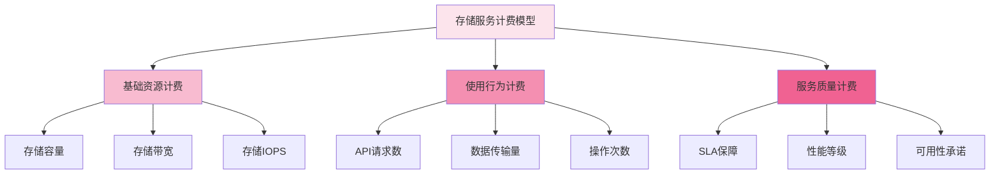

在多租户分布式文件存储服务平台中，建立一套科学、透明、准确的用量计费和账单系统是实现商业化运营的关键环节。通过精细化的计费模型和完善的账单系统，不仅可以实现成本的合理分摊，还能为用户提供透明的消费信息，增强用户信任度，促进平台的可持续发展。一个优秀的计费系统需要综合考虑技术实现、业务需求和用户体验等多个方面。

## 计费模型设计

科学的计费模型是用量计费系统的核心，需要根据存储服务的特点设计合理的计费维度和费率结构。

### 计费维度分析



### 计费项详细设计

```yaml
# 存储服务计费项设计
billing_items:
  storage_capacity:
    description: "存储容量费用"
    unit: "GB/小时"
    billing_cycle: "小时"
    tiered_pricing:
      - threshold: "100GB"
        price: "¥0.001/GB/小时"
      
      - threshold: "1TB"
        price: "¥0.0008/GB/小时"
      
      - threshold: "10TB"
        price: "¥0.0006/GB/小时"
      
      - threshold: "100TB+"
        price: "¥0.0005/GB/小时"
  
  data_transfer:
    description: "数据传输费用"
    unit: "GB"
    billing_cycle: "月"
    directions:
      ingress: "免费"
      egress_internal: "免费"
      egress_external: "¥0.50/GB"
  
  api_requests:
    description: "API请求费用"
    unit: "万次"
    billing_cycle: "月"
    request_types:
      read_requests: "¥10/万次"
      write_requests: "¥20/万次"
      delete_requests: "¥5/万次"
      metadata_requests: "¥15/万次"
  
  performance_tiers:
    description: "性能等级费用"
    unit: "实例/小时"
    billing_cycle: "小时"
    tiers:
      standard: "¥0.10/小时"
      high_performance: "¥0.50/小时"
      ultra_high_performance: "¥1.00/小时"
  
  additional_services:
    description: "附加服务费用"
    services:
      backup: "存储容量费用 × 50%"
      snapshot: "存储容量费用 × 30%"
      cross_region_replication: "数据传输费用 × 200%"
      encryption: "免费"
```

### 计费算法实现

```python
class BillingCalculator:
    def __init__(self, pricing_config):
        self.pricing_config = pricing_config
        self.billing_items = self.initialize_billing_items()
    
    def initialize_billing_items(self):
        """初始化计费项"""
        return {
            'storage_capacity': StorageCapacityBilling(),
            'data_transfer': DataTransferBilling(),
            'api_requests': APIRequestBilling(),
            'performance_tiers': PerformanceTierBilling(),
            'additional_services': AdditionalServiceBilling()
        }
    
    def calculate_tenant_bill(self, tenant_id, billing_period):
        """计算租户账单"""
        # 获取租户用量数据
        usage_data = self.collect_tenant_usage(tenant_id, billing_period)
        
        # 计算各项费用
        bill_items = []
        total_amount = 0
        
        for item_name, billing_item in self.billing_items.items():
            if item_name in usage_data:
                amount = billing_item.calculate_cost(usage_data[item_name])
                bill_items.append({
                    'item_name': item_name,
                    'usage': usage_data[item_name],
                    'amount': amount,
                    'currency': 'CNY'
                })
                total_amount += amount
        
        # 应用折扣和优惠
        discount_amount = self.calculate_discounts(tenant_id, total_amount)
        final_amount = total_amount - discount_amount
        
        return {
            'tenant_id': tenant_id,
            'billing_period': billing_period,
            'bill_items': bill_items,
            'subtotal': total_amount,
            'discount': discount_amount,
            'total': final_amount,
            'currency': 'CNY'
        }
    
    def collect_tenant_usage(self, tenant_id, billing_period):
        """收集租户用量数据"""
        usage_data = {}
        
        # 收集存储容量使用情况
        usage_data['storage_capacity'] = self.collect_storage_usage(tenant_id, billing_period)
        
        # 收集数据传输量
        usage_data['data_transfer'] = self.collect_data_transfer_usage(tenant_id, billing_period)
        
        # 收集API请求数
        usage_data['api_requests'] = self.collect_api_request_usage(tenant_id, billing_period)
        
        # 收集性能等级使用情况
        usage_data['performance_tiers'] = self.collect_performance_tier_usage(tenant_id, billing_period)
        
        return usage_data

class StorageCapacityBilling:
    def __init__(self):
        self.tiered_pricing = [
            {'threshold': 100 * 1024 * 1024 * 1024, 'price': 0.001},  # 100GB
            {'threshold': 1024 * 1024 * 1024 * 1024, 'price': 0.0008},  # 1TB
            {'threshold': 10 * 1024 * 1024 * 1024 * 1024, 'price': 0.0006},  # 10TB
            {'threshold': float('inf'), 'price': 0.0005}  # 100TB+
        ]
    
    def calculate_cost(self, usage_data):
        """计算存储容量费用"""
        total_cost = 0
        remaining_usage = usage_data['total_bytes']
        
        for tier in self.tiered_pricing:
            if remaining_usage <= 0:
                break
            
            tier_usage = min(remaining_usage, tier['threshold'])
            tier_cost = tier_usage * tier['price'] / (1024 * 1024 * 1024)  # 转换为GB
            total_cost += tier_cost
            remaining_usage -= tier_usage
        
        # 按小时计费
        hours_in_billing_period = usage_data['billing_hours']
        return total_cost * hours_in_billing_period
```

## 用量数据采集

准确的用量数据是计费系统的基础，需要建立完善的用量采集和统计机制。

### 数据采集架构

```go
type UsageCollector struct {
    metricsClient    MetricsClient
    storageClient    StorageClient
    database         Database
    collectorConfig  CollectorConfig
}

type UsageData struct {
    TenantID     string    `json:"tenant_id"`
    ResourceType string    `json:"resource_type"`
    UsageType    string    `json:"usage_type"`
    Quantity     float64   `json:"quantity"`
    Unit         string    `json:"unit"`
    Timestamp    time.Time `json:"timestamp"`
    Metadata     map[string]interface{} `json:"metadata"`
}

func (uc *UsageCollector) StartCollection() {
    ticker := time.NewTicker(uc.collectorConfig.CollectionInterval)
    defer ticker.Stop()
    
    for {
        select {
        case <-ticker.C:
            uc.collectAndStoreUsageData()
        }
    }
}

func (uc *UsageCollector) collectAndStoreUsageData() {
    // 并发收集各种用量数据
    var wg sync.WaitGroup
    
    // 收集存储容量使用情况
    wg.Add(1)
    go func() {
        defer wg.Done()
        uc.collectStorageCapacityUsage()
    }()
    
    // 收集数据传输量
    wg.Add(1)
    go func() {
        defer wg.Done()
        uc.collectDataTransferUsage()
    }()
    
    // 收集API请求数
    wg.Add(1)
    go func() {
        defer wg.Done()
        uc.collectAPIRequestUsage()
    }()
    
    wg.Wait()
}

func (uc *UsageCollector) collectStorageCapacityUsage() error {
    // 获取所有租户的存储使用情况
    tenants, err := uc.storageClient.ListTenants()
    if err != nil {
        return err
    }
    
    for _, tenant := range tenants {
        usage, err := uc.storageClient.GetTenantStorageUsage(tenant.ID)
        if err != nil {
            log.Printf("Failed to get storage usage for tenant %s: %v", tenant.ID, err)
            continue
        }
        
        usageData := &UsageData{
            TenantID:     tenant.ID,
            ResourceType: "storage",
            UsageType:    "capacity",
            Quantity:     float64(usage.TotalBytes),
            Unit:         "bytes",
            Timestamp:    time.Now(),
            Metadata: map[string]interface{}{
                "used_bytes": usage.UsedBytes,
                "available_bytes": usage.AvailableBytes,
                "utilization": usage.Utilization,
            },
        }
        
        // 存储用量数据
        err = uc.database.StoreUsageData(usageData)
        if err != nil {
            log.Printf("Failed to store usage data for tenant %s: %v", tenant.ID, err)
        }
    }
    
    return nil
}
```

### 实时计量实现

```typescript
interface RealtimeMeteringService {
    recordUsage(tenantId: string, resourceType: string, usage: UsageRecord): Promise<void>;
    getRealtimeUsage(tenantId: string, resourceType: string): Promise<UsageSummary>;
    generateUsageReport(tenantId: string, period: BillingPeriod): Promise<UsageReport>;
}

class DistributedFileMeteringService implements RealtimeMeteringService {
    private usageCache: LRUCache<string, UsageData>;
    private metricsCollector: MetricsCollector;
    private usageRepository: UsageRepository;
    
    constructor(config: MeteringConfig) {
        this.usageCache = new LRUCache({ max: config.cacheSize });
        this.metricsCollector = new MetricsCollector(config.metricsEndpoint);
        this.usageRepository = new UsageRepository(config.databaseConfig);
    }
    
    async recordUsage(tenantId: string, resourceType: string, usage: UsageRecord): Promise<void> {
        // 验证用量记录
        if (!this.validateUsageRecord(usage)) {
            throw new Error('Invalid usage record');
        }
        
        // 记录实时用量
        const cacheKey = `${tenantId}:${resourceType}:${this.getCacheKeyTime()}`;
        const cachedUsage = this.usageCache.get(cacheKey) || {
            tenantId,
            resourceType,
            quantity: 0,
            timestamp: new Date()
        };
        
        // 累加用量
        cachedUsage.quantity += usage.quantity;
        cachedUsage.timestamp = new Date();
        
        // 更新缓存
        this.usageCache.set(cacheKey, cachedUsage);
        
        // 异步持久化用量数据
        this.persistUsageData({
            ...cachedUsage,
            usageType: usage.usageType,
            unit: usage.unit,
            metadata: usage.metadata
        }).catch(error => {
            console.error('Failed to persist usage data:', error);
        });
        
        // 发送实时指标
        this.metricsCollector.gauge(`usage_${resourceType}`, cachedUsage.quantity, {
            tenant_id: tenantId
        });
    }
    
    async getRealtimeUsage(tenantId: string, resourceType: string): Promise<UsageSummary> {
        // 从缓存获取实时用量
        const cachePattern = `${tenantId}:${resourceType}:*`;
        const cachedEntries = this.usageCache.find(cachePattern);
        
        let totalQuantity = 0;
        let lastUpdate = new Date(0);
        
        for (const entry of cachedEntries) {
            totalQuantity += entry.quantity;
            if (entry.timestamp > lastUpdate) {
                lastUpdate = entry.timestamp;
            }
        }
        
        return {
            tenantId,
            resourceType,
            totalQuantity,
            unit: this.getUnitForResourceType(resourceType),
            lastUpdate,
            timeWindow: 'realtime'
        };
    }
    
    private async persistUsageData(usageData: UsageData): Promise<void> {
        // 批量插入优化
        await this.usageRepository.batchInsert([usageData], {
            batchSize: 100,
            flushInterval: 5000  // 5秒刷新一次
        });
    }
    
    private getCacheKeyTime(): string {
        // 按小时分片缓存键
        const now = new Date();
        return `${now.getFullYear()}-${now.getMonth() + 1}-${now.getDate()}-${now.getHours()}`;
    }
}
```

## 账单生成与管理

完善的账单生成和管理系统为用户提供清晰的消费明细和便捷的查询功能。

### 账单生成流程

```python
class BillingEngine:
    def __init__(self, billing_calculator, invoice_generator, notification_service):
        self.billing_calculator = billing_calculator
        self.invoice_generator = invoice_generator
        self.notification_service = notification_service
        self.billing_scheduler = BillingScheduler()
    
    def start_billing_cycle(self):
        """启动计费周期"""
        self.billing_scheduler.schedule_monthly(
            'billing_cycle',
            self.generate_monthly_bills,
            day_of_month=1  # 每月1日生成账单
        )
    
    def generate_monthly_bills(self):
        """生成月度账单"""
        billing_period = self.get_current_billing_period()
        
        # 获取所有活跃租户
        active_tenants = self.get_active_tenants()
        
        # 并发生成账单
        with ThreadPoolExecutor(max_workers=10) as executor:
            futures = []
            for tenant in active_tenants:
                future = executor.submit(
                    self.generate_tenant_bill, 
                    tenant, 
                    billing_period
                )
                futures.append(future)
            
            # 等待所有账单生成完成
            for future in as_completed(futures):
                try:
                    bill = future.result()
                    self.process_generated_bill(bill)
                except Exception as e:
                    logger.error(f"Failed to generate bill: {e}")
    
    def generate_tenant_bill(self, tenant, billing_period):
        """生成租户账单"""
        # 计算账单金额
        bill_details = self.billing_calculator.calculate_tenant_bill(
            tenant.id, 
            billing_period
        )
        
        # 生成发票
        invoice = self.invoice_generator.create_invoice(bill_details)
        
        # 存储账单
        self.store_bill(bill_details, invoice)
        
        return {
            'tenant': tenant,
            'billing_period': billing_period,
            'bill_details': bill_details,
            'invoice': invoice
        }
    
    def process_generated_bill(self, bill):
        """处理生成的账单"""
        # 发送账单通知
        self.notification_service.send_billing_notification(
            bill['tenant'].id,
            bill['invoice']
        )
        
        # 更新租户账户余额
        self.update_tenant_account(bill)
        
        # 记录账单日志
        self.log_billing_activity(bill)

class InvoiceGenerator:
    def __init__(self, template_engine):
        self.template_engine = template_engine
        self.invoice_config = self.load_invoice_config()
    
    def create_invoice(self, bill_details):
        """创建发票"""
        invoice_data = {
            'invoice_number': self.generate_invoice_number(),
            'issue_date': datetime.now(),
            'due_date': datetime.now() + timedelta(days=30),
            'billing_period': bill_details['billing_period'],
            'tenant_info': self.get_tenant_info(bill_details['tenant_id']),
            'line_items': self.format_line_items(bill_details['bill_items']),
            'subtotal': bill_details['subtotal'],
            'discount': bill_details['discount'],
            'total_amount': bill_details['total'],
            'currency': bill_details['currency'],
            'tax_info': self.calculate_tax(bill_details['total'])
        }
        
        # 生成发票PDF
        invoice_pdf = self.template_engine.render(
            'invoice_template.html', 
            invoice_data
        )
        
        return {
            'invoice_data': invoice_data,
            'pdf_content': invoice_pdf,
            'status': 'generated'
        }
```

### 账单查询接口

```yaml
# 账单查询API设计
billing_apis:
  get_invoice_list:
    method: "GET"
    path: "/api/v1/billing/invoices"
    description: "获取发票列表"
    parameters:
      - name: "tenant_id"
        in: "query"
        required: true
        type: "string"
      
      - name: "period_start"
        in: "query"
        required: false
        type: "string"
        format: "date-time"
      
      - name: "period_end"
        in: "query"
        required: false
        type: "string"
        format: "date-time"
      
      - name: "status"
        in: "query"
        required: false
        type: "string"
        enum: ["generated", "paid", "overdue"]
    
    responses:
      "200":
        description: "成功获取发票列表"
        schema:
          type: "array"
          items:
            $ref: "#/definitions/Invoice"
  
  get_invoice_detail:
    method: "GET"
    path: "/api/v1/billing/invoices/{invoice_id}"
    description: "获取发票详情"
    parameters:
      - name: "invoice_id"
        in: "path"
        required: true
        type: "string"
    
    responses:
      "200":
        description: "成功获取发票详情"
        schema:
          $ref: "#/definitions/InvoiceDetail"
  
  download_invoice:
    method: "GET"
    path: "/api/v1/billing/invoices/{invoice_id}/download"
    description: "下载发票PDF"
    parameters:
      - name: "invoice_id"
        in: "path"
        required: true
        type: "string"
    
    responses:
      "200":
        description: "成功下载发票PDF"
        content:
          "application/pdf":
            schema:
              type: "string"
              format: "binary"
```

## 支付与结算

安全便捷的支付和结算系统是计费体系的重要组成部分。

### 支付集成架构

```javascript
class PaymentProcessor {
    constructor(paymentGateways) {
        this.paymentGateways = paymentGateways;
        this.paymentRepository = new PaymentRepository();
        this.notificationService = new NotificationService();
    }
    
    async processPayment(paymentRequest) {
        // 验证支付请求
        const validation = this.validatePaymentRequest(paymentRequest);
        if (!validation.isValid) {
            throw new Error(`Invalid payment request: ${validation.errors.join(', ')}`);
        }
        
        // 选择合适的支付网关
        const gateway = this.selectPaymentGateway(paymentRequest);
        
        try {
            // 创建支付交易
            const transaction = await this.createTransaction(paymentRequest);
            
            // 执行支付
            const paymentResult = await gateway.processPayment({
                amount: paymentRequest.amount,
                currency: paymentRequest.currency,
                tenantId: paymentRequest.tenantId,
                invoiceId: paymentRequest.invoiceId,
                paymentMethod: paymentRequest.paymentMethod
            });
            
            // 更新交易状态
            await this.updateTransactionStatus(transaction.id, {
                status: paymentResult.status,
                gatewayTransactionId: paymentResult.transactionId,
                processedAt: new Date(),
                response: paymentResult.response
            });
            
            // 如果支付成功，更新发票状态
            if (paymentResult.status === 'success') {
                await this.updateInvoiceStatus(paymentRequest.invoiceId, 'paid');
                await this.notificationService.sendPaymentConfirmation(
                    paymentRequest.tenantId,
                    paymentRequest.invoiceId
                );
            }
            
            return {
                transactionId: transaction.id,
                status: paymentResult.status,
                amount: paymentRequest.amount,
                currency: paymentRequest.currency
            };
            
        } catch (error) {
            // 记录支付失败
            await this.logPaymentFailure(paymentRequest, error);
            throw error;
        }
    }
    
    async createTransaction(paymentRequest) {
        const transaction = {
            id: this.generateTransactionId(),
            tenantId: paymentRequest.tenantId,
            invoiceId: paymentRequest.invoiceId,
            amount: paymentRequest.amount,
            currency: paymentRequest.currency,
            paymentMethod: paymentRequest.paymentMethod,
            status: 'pending',
            createdAt: new Date(),
            metadata: paymentRequest.metadata
        };
        
        await this.paymentRepository.saveTransaction(transaction);
        return transaction;
    }
    
    selectPaymentGateway(paymentRequest) {
        // 根据支付方式、金额、币种等条件选择最合适的支付网关
        const availableGateways = this.paymentGateways.filter(gateway => 
            gateway.supportsCurrency(paymentRequest.currency) &&
            gateway.supportsAmount(paymentRequest.amount) &&
            gateway.supportsPaymentMethod(paymentRequest.paymentMethod)
        );
        
        // 选择费率最优或优先级最高的网关
        return availableGateways.sort((a, b) => 
            a.getFee(paymentRequest.amount) - b.getFee(paymentRequest.amount)
        )[0];
    }
}
```

### 结算管理

```go
type SettlementManager struct {
    paymentRepository PaymentRepository
    settlementConfig  SettlementConfig
    accountingSystem  AccountingSystem
}

type SettlementReport struct {
    Period        time.Time     `json:"period"`
    TotalAmount   float64       `json:"total_amount"`
    Transactions  []Transaction `json:"transactions"`
    Fees          float64       `json:"fees"`
    NetAmount     float64       `json:"net_amount"`
    Currency      string        `json:"currency"`
    Status        string        `json:"status"`
}

func (sm *SettlementManager) GenerateSettlementReport(period time.Time) (*SettlementReport, error) {
    // 获取指定周期内的所有交易
    transactions, err := sm.paymentRepository.GetTransactionsByPeriod(period)
    if err != nil {
        return nil, fmt.Errorf("failed to get transactions: %v", err)
    }
    
    // 计算总金额
    var totalAmount float64
    var totalFees float64
    
    for _, tx := range transactions {
        if tx.Status == "success" {
            totalAmount += tx.Amount
            totalFees += tx.Fee
        }
    }
    
    // 生成结算报告
    report := &SettlementReport{
        Period:       period,
        TotalAmount:  totalAmount,
        Transactions: transactions,
        Fees:         totalFees,
        NetAmount:    totalAmount - totalFees,
        Currency:     "CNY",
        Status:       "generated",
    }
    
    // 保存结算报告
    err = sm.saveSettlementReport(report)
    if err != nil {
        return nil, fmt.Errorf("failed to save settlement report: %v", err)
    }
    
    // 发送结算通知
    sm.sendSettlementNotification(report)
    
    return report, nil
}

func (sm *SettlementManager) ProcessSettlement(report *SettlementReport) error {
    // 验证结算报告
    if err := sm.validateSettlementReport(report); err != nil {
        return fmt.Errorf("invalid settlement report: %v", err)
    }
    
    // 更新交易结算状态
    for _, tx := range report.Transactions {
        if tx.Status == "success" {
            err := sm.paymentRepository.UpdateTransactionSettlementStatus(tx.ID, "settled")
            if err != nil {
                log.Printf("Failed to update transaction %s settlement status: %v", tx.ID, err)
            }
        }
    }
    
    // 记录会计凭证
    err := sm.accountingSystem.RecordSettlementVoucher(&AccountingVoucher{
        Date:        report.Period,
        Debit:       report.NetAmount,
        Credit:      0,
        Description: fmt.Sprintf("Period settlement for %s", report.Period.Format("2006-01")),
        Reference:   report.Period.Format("2006-01"),
    })
    if err != nil {
        return fmt.Errorf("failed to record accounting voucher: %v", err)
    }
    
    // 更新结算报告状态
    report.Status = "processed"
    err = sm.saveSettlementReport(report)
    if err != nil {
        return fmt.Errorf("failed to update settlement report: %v", err)
    }
    
    return nil
}
```

## 监控与审计

完善的监控和审计机制确保计费系统的准确性和安全性。

### 计费监控指标

```yaml
# 计费系统监控指标
billing_monitoring_metrics:
  accuracy_metrics:
    - name: "billing_accuracy_rate"
      description: "计费准确率"
      unit: "%"
      monitoring_frequency: "daily"
      alert_threshold: "< 99.9%"
    
    - name: "invoice_generation_success_rate"
      description: "发票生成成功率"
      unit: "%"
      monitoring_frequency: "hourly"
      alert_threshold: "< 99%"
    
    - name: "payment_processing_success_rate"
      description: "支付处理成功率"
      unit: "%"
      monitoring_frequency: "hourly"
      alert_threshold: "< 99%"
  
  performance_metrics:
    - name: "invoice_generation_latency"
      description: "发票生成延迟"
      unit: "ms"
      monitoring_frequency: "hourly"
      alert_threshold: "> 5000"
    
    - name: "usage_data_collection_latency"
      description: "用量数据收集延迟"
      unit: "ms"
      monitoring_frequency: "hourly"
      alert_threshold: "> 10000"
    
    - name: "billing_calculation_time"
      description: "计费计算耗时"
      unit: "seconds"
      monitoring_frequency: "daily"
      alert_threshold: "> 3600"
  
  financial_metrics:
    - name: "monthly_revenue"
      description: "月度收入"
      unit: "CNY"
      monitoring_frequency: "daily"
      alert_threshold: "±20%"
    
    - name: "outstanding_receivables"
      description: "应收账款"
      unit: "CNY"
      monitoring_frequency: "daily"
      alert_threshold: "> revenue * 0.1"
```

### 审计日志系统

```python
class BillingAuditLogger:
    def __init__(self, audit_config):
        self.audit_config = audit_config
        self.audit_repository = AuditRepository()
        self.alert_manager = AlertManager()
    
    def log_billing_operation(self, operation, details, user_id=None):
        """记录计费操作审计日志"""
        audit_log = {
            'id': str(uuid.uuid4()),
            'timestamp': datetime.now(),
            'operation': operation,
            'details': details,
            'user_id': user_id,
            'ip_address': self.get_client_ip(),
            'user_agent': self.get_user_agent(),
            'session_id': self.get_session_id()
        }
        
        # 存储审计日志
        self.audit_repository.save_audit_log(audit_log)
        
        # 检查是否需要告警
        self.check_audit_alerts(audit_log)
        
        return audit_log['id']
    
    def check_audit_alerts(self, audit_log):
        """检查审计告警"""
        operation = audit_log['operation']
        
        # 检查敏感操作
        if operation in self.audit_config.sensitive_operations:
            self.alert_manager.send_alert({
                'type': 'sensitive_operation',
                'operation': operation,
                'user_id': audit_log['user_id'],
                'timestamp': audit_log['timestamp'],
                'details': audit_log['details']
            })
        
        # 检查异常模式
        if self.detect_anomalous_pattern(audit_log):
            self.alert_manager.send_alert({
                'type': 'anomalous_pattern',
                'operation': operation,
                'user_id': audit_log['user_id'],
                'timestamp': audit_log['timestamp'],
                'confidence': self.get_anomaly_confidence(audit_log)
            })
    
    def generate_audit_report(self, period, filters=None):
        """生成审计报告"""
        audit_logs = self.audit_repository.get_audit_logs(period, filters)
        
        report = {
            'period': period,
            'total_operations': len(audit_logs),
            'operation_summary': self.summarize_operations(audit_logs),
            'sensitive_operations': self.filter_sensitive_operations(audit_logs),
            'anomalies_detected': self.detect_anomalies(audit_logs),
            'generated_at': datetime.now()
        }
        
        return report
    
    def detect_anomalous_pattern(self, audit_log):
        """检测异常模式"""
        # 基于历史行为分析检测异常
        user_history = self.audit_repository.get_user_history(
            audit_log['user_id'], 
            timedelta(hours=24)
        )
        
        # 检查操作频率异常
        if len(user_history) > self.audit_config.max_operations_per_hour:
            return True
        
        # 检查时间模式异常
        if self.is_suspicious_time(audit_log['timestamp']):
            return True
        
        # 检查操作序列异常
        if self.is_suspicious_sequence(user_history, audit_log['operation']):
            return True
        
        return False
```

## 最佳实践建议

在设计和实现用量计费与账单系统时，建议遵循以下最佳实践：

### 系统设计

1. **高可用性**：确保计费系统的高可用性，避免因系统故障影响计费准确性
2. **数据一致性**：采用事务机制保证计费数据的一致性
3. **可扩展性**：设计可水平扩展的架构以支持业务增长
4. **安全性**：实施严格的安全措施保护计费数据和交易安全

### 业务实践

1. **透明计费**：向用户提供清晰、透明的计费说明
2. **灵活定价**：设计灵活的定价策略适应不同用户需求
3. **及时通知**：及时向用户发送账单和支付提醒
4. **争议处理**：建立完善的账单争议处理机制

### 运营管理

1. **定期对账**：定期进行财务对账确保账实相符
2. **性能监控**：持续监控系统性能及时发现和解决问题
3. **合规审计**：定期进行合规性审计确保符合相关法规
4. **持续优化**：根据业务发展和用户反馈持续优化计费系统

通过科学设计的用量计费和账单系统，分布式文件存储服务平台能够实现商业化的可持续运营，为用户提供透明、准确的计费服务，同时确保平台的财务健康和业务发展。