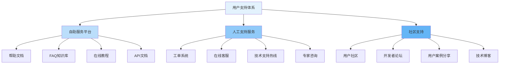

在分布式文件存储平台的全生命周期管理中，平台运营是确保系统持续稳定运行、用户满意度提升和生态健康发展的重要环节。通过建立完善的用户支持体系、系统化的文档建设和积极的社区培育机制，平台运营团队能够有效降低用户使用门槛，提高用户粘性，促进平台的可持续发展。一个成功的平台运营策略需要从用户需求出发，构建全方位的服务支持体系。

## 用户支持体系

完善的用户支持体系是平台运营的基础，需要提供多层次、多渠道的支持服务。

### 支持渠道设计



### 工单管理系统

```python
class TicketManagementSystem:
    def __init__(self, config):
        self.config = config
        self.ticket_repository = TicketRepository()
        self.notification_service = NotificationService()
        self.sla_manager = SLAManager()
    
    def create_ticket(self, user_id, subject, description, priority='normal', category='general'):
        """创建工单"""
        ticket = {
            'id': self.generate_ticket_id(),
            'user_id': user_id,
            'subject': subject,
            'description': description,
            'priority': priority,
            'category': category,
            'status': 'open',
            'created_at': datetime.now(),
            'updated_at': datetime.now(),
            'assigned_to': None,
            'sla_deadline': self.sla_manager.calculate_deadline(priority),
            'tags': [],
            'attachments': []
        }
        
        # 保存工单
        self.ticket_repository.save(ticket)
        
        # 发送通知
        self.notification_service.send_notification(
            user_id=user_id,
            type='ticket_created',
            data={'ticket_id': ticket['id'], 'subject': subject}
        )
        
        # 分配工单
        self.assign_ticket(ticket)
        
        return ticket['id']
    
    def assign_ticket(self, ticket):
        """自动分配工单"""
        # 根据类别和优先级选择合适的处理人员
        assignee = self.select_assignee(ticket['category'], ticket['priority'])
        
        if assignee:
            ticket['assigned_to'] = assignee
            ticket['status'] = 'assigned'
            ticket['updated_at'] = datetime.now()
            
            self.ticket_repository.update(ticket)
            
            # 通知处理人员
            self.notification_service.send_notification(
                user_id=assignee,
                type='ticket_assigned',
                data={'ticket_id': ticket['id'], 'subject': ticket['subject']}
            )
    
    def process_ticket(self, ticket_id, action, processor_id, notes=None):
        """处理工单"""
        ticket = self.ticket_repository.get(ticket_id)
        if not ticket:
            raise ValueError(f"Ticket {ticket_id} not found")
        
        # 更新工单状态
        old_status = ticket['status']
        ticket['status'] = self.determine_new_status(action)
        ticket['updated_at'] = datetime.now()
        ticket['processor_id'] = processor_id
        
        if notes:
            ticket.setdefault('comments', []).append({
                'user_id': processor_id,
                'content': notes,
                'timestamp': datetime.now()
            })
        
        self.ticket_repository.update(ticket)
        
        # 检查SLA
        if self.sla_manager.is_violated(ticket):
            self.handle_sla_violation(ticket)
        
        # 发送状态更新通知
        self.notification_service.send_notification(
            user_id=ticket['user_id'],
            type='ticket_status_updated',
            data={
                'ticket_id': ticket_id,
                'old_status': old_status,
                'new_status': ticket['status'],
                'processor': processor_id
            }
        )
    
    def get_ticket_statistics(self, period=None, filters=None):
        """获取工单统计信息"""
        tickets = self.ticket_repository.get_tickets(period, filters)
        
        stats = {
            'total_tickets': len(tickets),
            'by_status': self.count_by_field(tickets, 'status'),
            'by_priority': self.count_by_field(tickets, 'priority'),
            'by_category': self.count_by_field(tickets, 'category'),
            'resolution_time': self.calculate_average_resolution_time(tickets),
            'satisfaction_rate': self.calculate_satisfaction_rate(tickets)
        }
        
        return stats

class SLAManager:
    def __init__(self):
        self.sla_rules = {
            'critical': {'response_time': 30, 'resolution_time': 240},  # 分钟
            'high': {'response_time': 120, 'resolution_time': 1440},
            'normal': {'response_time': 240, 'resolution_time': 2880},
            'low': {'response_time': 480, 'resolution_time': 4320}
        }
    
    def calculate_deadline(self, priority):
        """计算SLA截止时间"""
        rule = self.sla_rules.get(priority, self.sla_rules['normal'])
        return datetime.now() + timedelta(minutes=rule['resolution_time'])
    
    def is_violated(self, ticket):
        """检查是否违反SLA"""
        if ticket['status'] in ['resolved', 'closed']:
            return ticket['updated_at'] > ticket['sla_deadline']
        else:
            return datetime.now() > ticket['sla_deadline']
```

### 智能客服系统

```go
type IntelligentSupportSystem struct {
    knowledgeBase    *KnowledgeBase
    nlpEngine        *NLPEngine
    ticketSystem     *TicketManagementSystem
    userContext      *UserContextManager
}

type SupportRequest struct {
    UserID      string            `json:"user_id"`
    Question    string            `json:"question"`
    Context     map[string]string `json:"context"`
    Priority    string            `json:"priority"`
    Channel     string            `json:"channel"`
}

type SupportResponse struct {
    Type        string      `json:"type"`  // "answer", "redirect", "ticket"
    Content     string      `json:"content"`
    Confidence  float64     `json:"confidence"`
    RelatedDocs []string    `json:"related_docs"`
    TicketID    *string     `json:"ticket_id,omitempty"`
}

func (iss *IntelligentSupportSystem) ProcessSupportRequest(request *SupportRequest) (*SupportResponse, error) {
    // 分析用户问题
    intent, entities := iss.nlpEngine.Analyze(request.Question)
    
    // 获取用户上下文
    userContext := iss.userContext.GetUserContext(request.UserID)
    
    // 尝试从知识库找到答案
    answer, confidence, relatedDocs := iss.knowledgeBase.Search(
        request.Question,
        intent,
        entities,
        userContext,
    )
    
    // 如果置信度足够高，直接返回答案
    if confidence > 0.8 {
        return &SupportResponse{
            Type:        "answer",
            Content:     answer,
            Confidence:  confidence,
            RelatedDocs: relatedDocs,
        }, nil
    }
    
    // 如果置信度中等，提供可能的答案并建议人工支持
    if confidence > 0.5 {
        return &SupportResponse{
            Type:        "suggestion",
            Content:     answer,
            Confidence:  confidence,
            RelatedDocs: relatedDocs,
        }, nil
    }
    
    // 如果置信度低，创建工单
    ticketID := iss.createTicketFromRequest(request, intent, entities)
    
    return &SupportResponse{
        Type:     "ticket",
        Content:  "您的问题已提交，技术支持人员将尽快与您联系。",
        TicketID: &ticketID,
    }, nil
}

func (iss *IntelligentSupportSystem) createTicketFromRequest(request *SupportRequest, 
    intent string, entities []Entity) string {
    
    // 构造工单描述
    description := fmt.Sprintf("问题: %s\n意图: %s\n实体: %v\n上下文: %v",
        request.Question, intent, entities, request.Context)
    
    // 创建工单
    ticketID := iss.ticketSystem.CreateTicket(TicketCreateRequest{
        UserID:      request.UserID,
        Subject:     fmt.Sprintf("智能客服转接: %s", request.Question[:50]),
        Description: description,
        Priority:    request.Priority,
        Category:    iss.categorizeFromIntent(intent),
        Source:      fmt.Sprintf("chatbot_%s", request.Channel),
    })
    
    return ticketID
}
```

## 文档体系建设

系统化的文档体系是用户学习和使用平台的重要资源，需要覆盖从入门到精通的各个阶段。

### 文档分类架构

```yaml
# 文档体系架构
documentation_framework:
  getting_started:
    description: "入门指南"
    documents:
      - name: "快速开始"
        level: "beginner"
        estimated_time: "30分钟"
        prerequisites: "无"
      
      - name: "核心概念"
        level: "beginner"
        estimated_time: "45分钟"
        prerequisites: "快速开始"
      
      - name: "基础操作"
        level: "beginner"
        estimated_time: "60分钟"
        prerequisites: "核心概念"
  
  user_guides:
    description: "用户指南"
    documents:
      - name: "存储管理"
        level: "intermediate"
        estimated_time: "90分钟"
        prerequisites: "基础操作"
      
      - name: "权限控制"
        level: "intermediate"
        estimated_time: "60分钟"
        prerequisites: "基础操作"
      
      - name: "数据备份"
        level: "intermediate"
        estimated_time: "75分钟"
        prerequisites: "存储管理"
  
  advanced_guides:
    description: "高级指南"
    documents:
      - name: "性能优化"
        level: "advanced"
        estimated_time: "120分钟"
        prerequisites: "用户指南"
      
      - name: "故障排查"
        level: "advanced"
        estimated_time: "90分钟"
        prerequisites: "用户指南"
      
      - name: "最佳实践"
        level: "advanced"
        estimated_time: "150分钟"
        prerequisites: "性能优化"
  
  api_reference:
    description: "API参考"
    documents:
      - name: "REST API"
        level: "developer"
        endpoints: "100+"
      
      - name: "SDK指南"
        level: "developer"
        languages: ["Python", "Java", "Go", "JavaScript"]
      
      - name: "CLI工具"
        level: "administrator"
        commands: "50+"
  
  troubleshooting:
    description: "故障排除"
    documents:
      - name: "常见问题"
        level: "all"
        questions: "100+"
      
      - name: "错误码参考"
        level: "all"
        codes: "200+"
      
      - name: "日志分析"
        level: "advanced"
        tools: ["ELK", "Prometheus", "Grafana"]
```

### 文档管理系统

```typescript
interface DocumentationManager {
    createDocument(document: Document): Promise<string>;
    updateDocument(documentId: string, updates: Partial<Document>): Promise<void>;
    searchDocuments(query: string, filters?: DocumentFilters): Promise<Document[]>;
    getVersionHistory(documentId: string): Promise<DocumentVersion[]>;
    publishDocument(documentId: string, version: string): Promise<void>;
}

class PlatformDocumentationManager implements DocumentationManager {
    private documentRepository: DocumentRepository;
    private searchEngine: SearchEngine;
    private versionControl: VersionControlSystem;
    private notificationService: NotificationService;
    
    constructor(config: DocumentationConfig) {
        this.documentRepository = new DocumentRepository(config.database);
        this.searchEngine = new SearchEngine(config.search);
        this.versionControl = new VersionControlSystem(config.versioning);
        this.notificationService = new NotificationService();
    }
    
    async createDocument(document: Document): Promise<string> {
        // 验证文档内容
        this.validateDocument(document);
        
        // 生成文档ID
        const documentId = this.generateDocumentId();
        
        // 创建初始版本
        const version = await this.versionControl.createVersion({
            documentId,
            content: document.content,
            author: document.author,
            changelog: "Initial version"
        });
        
        // 保存文档元数据
        await this.documentRepository.save({
            id: documentId,
            ...document,
            currentVersion: version.id,
            createdAt: new Date(),
            updatedAt: new Date(),
            status: 'draft'
        });
        
        // 索引文档内容用于搜索
        await this.searchEngine.indexDocument({
            id: documentId,
            title: document.title,
            content: document.content,
            tags: document.tags,
            category: document.category
        });
        
        return documentId;
    }
    
    async updateDocument(documentId: string, updates: Partial<Document>): Promise<void> {
        // 获取当前文档
        const currentDocument = await this.documentRepository.findById(documentId);
        if (!currentDocument) {
            throw new Error(`Document ${documentId} not found`);
        }
        
        // 创建新版本
        if (updates.content) {
            const newVersion = await this.versionControl.createVersion({
                documentId,
                content: updates.content,
                author: updates.author || currentDocument.author,
                changelog: updates.changelog || "Content update"
            });
            
            updates.currentVersion = newVersion.id;
        }
        
        // 更新文档元数据
        const updatedDocument = {
            ...currentDocument,
            ...updates,
            updatedAt: new Date()
        };
        
        await this.documentRepository.update(documentId, updatedDocument);
        
        // 更新搜索索引
        if (updates.content || updates.title || updates.tags) {
            await this.searchEngine.updateDocumentIndex({
                id: documentId,
                title: updates.title || currentDocument.title,
                content: updates.content || currentDocument.content,
                tags: updates.tags || currentDocument.tags,
                category: updates.category || currentDocument.category
            });
        }
        
        // 发送更新通知
        if (updates.status === 'published') {
            await this.notificationService.sendNotification({
                type: 'document_published',
                recipients: 'all_users',
                data: {
                    documentId,
                    title: updatedDocument.title,
                    category: updatedDocument.category
                }
            });
        }
    }
    
    async searchDocuments(query: string, filters?: DocumentFilters): Promise<Document[]> {
        // 执行搜索
        const searchResults = await this.searchEngine.search(query, filters);
        
        // 获取完整文档信息
        const documents = await Promise.all(
            searchResults.map(async (result) => {
                const doc = await this.documentRepository.findById(result.id);
                return {
                    ...doc,
                    relevanceScore: result.score
                };
            })
        );
        
        // 按相关性排序
        return documents.sort((a, b) => b.relevanceScore - a.relevanceScore);
    }
    
    private validateDocument(document: Document): void {
        if (!document.title) {
            throw new Error("Document title is required");
        }
        
        if (!document.content) {
            throw new Error("Document content is required");
        }
        
        if (!document.category) {
            throw new Error("Document category is required");
        }
        
        if (!document.author) {
            throw new Error("Document author is required");
        }
    }
}
```

## 社区培育机制

活跃的社区生态是平台长期发展的重要保障，需要建立完善的社区培育和激励机制。

### 社区平台架构

```python
class CommunityPlatform:
    def __init__(self, config):
        self.config = config
        self.forum_manager = ForumManager()
        self.user_manager = UserManager()
        self.content_moderator = ContentModerator()
        self.reputation_system = ReputationSystem()
        self.event_manager = EventManager()
    
    def create_community_space(self, space_name, description, category):
        """创建社区空间"""
        space = {
            'id': self.generate_space_id(),
            'name': space_name,
            'description': description,
            'category': category,
            'created_at': datetime.now(),
            'moderators': [],
            'members': [],
            'rules': [],
            'settings': {
                'public': True,
                'moderation_required': True,
                'allow_attachments': True
            }
        }
        
        self.forum_manager.create_space(space)
        return space['id']
    
    def post_discussion(self, user_id, space_id, title, content, tags=None):
        """发布讨论帖"""
        # 检查用户权限
        if not self.user_manager.can_post(user_id, space_id):
            raise PermissionError("User cannot post in this space")
        
        # 创建帖子
        post = {
            'id': self.generate_post_id(),
            'space_id': space_id,
            'author_id': user_id,
            'title': title,
            'content': content,
            'tags': tags or [],
            'created_at': datetime.now(),
            'updated_at': datetime.now(),
            'status': 'pending_moderation' if self.requires_moderation(space_id) else 'published',
            'views': 0,
            'likes': 0,
            'comments': 0,
            'reputation_points': 0
        }
        
        post_id = self.forum_manager.create_post(post)
        
        # 更新用户声誉
        self.reputation_system.award_points(user_id, 'post_created', 10)
        
        # 发送通知
        self.notify_followers(space_id, 'new_post', {
            'post_id': post_id,
            'title': title,
            'author': self.user_manager.get_user_display_name(user_id)
        })
        
        return post_id
    
    def add_comment(self, user_id, post_id, content):
        """添加评论"""
        # 检查用户权限
        if not self.user_manager.can_comment(user_id):
            raise PermissionError("User cannot comment")
        
        # 创建评论
        comment = {
            'id': self.generate_comment_id(),
            'post_id': post_id,
            'author_id': user_id,
            'content': content,
            'created_at': datetime.now(),
            'likes': 0
        }
        
        comment_id = self.forum_manager.add_comment(comment)
        
        # 更新帖子统计
        self.forum_manager.increment_post_statistic(post_id, 'comments')
        
        # 更新用户声誉
        self.reputation_system.award_points(user_id, 'comment_added', 2)
        
        # 通知帖子作者
        post_author = self.forum_manager.get_post_author(post_id)
        if post_author != user_id:
            self.notify_user(post_author, 'new_comment', {
                'comment_id': comment_id,
                'post_id': post_id,
                'commenter': self.user_manager.get_user_display_name(user_id)
            })
        
        return comment_id

class ReputationSystem:
    def __init__(self):
        self.reputation_rules = {
            'post_created': 10,
            'post_liked': 5,
            'comment_added': 2,
            'comment_liked': 1,
            'accepted_answer': 15,
            'helpful_content': 20,
            'community_event_participation': 30
        }
        self.user_reputation = {}
    
    def award_points(self, user_id, action, points=None):
        """奖励声誉点数"""
        if points is None:
            points = self.reputation_rules.get(action, 0)
        
        if points > 0:
            current_points = self.user_reputation.get(user_id, 0)
            self.user_reputation[user_id] = current_points + points
            
            # 检查是否达到新等级
            self.check_level_up(user_id, current_points, current_points + points)
    
    def check_level_up(self, user_id, old_points, new_points):
        """检查等级提升"""
        old_level = self.get_user_level(old_points)
        new_level = self.get_user_level(new_points)
        
        if new_level > old_level:
            self.notify_level_up(user_id, new_level)
    
    def get_user_level(self, points):
        """根据点数获取用户等级"""
        if points >= 10000:
            return 'expert'
        elif points >= 5000:
            return 'advanced'
        elif points >= 1000:
            return 'intermediate'
        elif points >= 100:
            return 'beginner'
        else:
            return 'newbie'
    
    def get_leaderboard(self, limit=50):
        """获取声誉排行榜"""
        sorted_users = sorted(
            self.user_reputation.items(), 
            key=lambda x: x[1], 
            reverse=True
        )
        return sorted_users[:limit]
```

### 用户激励机制

```go
type UserIncentiveProgram struct {
    rewardSystem     *RewardSystem
    achievementSystem *AchievementSystem
    contestManager   *ContestManager
    badgeManager     *BadgeManager
}

type Reward struct {
    ID          string    `json:"id"`
    UserID      string    `json:"user_id"`
    Type        string    `json:"type"`  // "points", "badge", "prize"
    Value       interface{} `json:"value"`
    Description string    `json:"description"`
    AwardedAt   time.Time `json:"awarded_at"`
    ExpiryDate  *time.Time `json:"expiry_date,omitempty"`
}

type Achievement struct {
    ID          string    `json:"id"`
    Name        string    `json:"name"`
    Description string    `json:"description"`
    Criteria    []Criterion `json:"criteria"`
    Reward      Reward    `json:"reward"`
    Badge       string    `json:"badge,omitempty"`
}

func (uip *UserIncentiveProgram) CheckAndAwardAchievements(userID string) ([]Reward, error) {
    var awardedRewards []Reward
    
    // 获取用户当前状态
    userStats := uip.getUserStatistics(userID)
    
    // 检查可获得的成就
    availableAchievements := uip.achievementSystem.GetAvailableAchievements()
    
    for _, achievement := range availableAchievements {
        // 检查用户是否满足成就条件
        if uip.meetsAchievementCriteria(userStats, achievement.Criteria) {
            // 检查用户是否已获得该成就
            if !uip.achievementSystem.HasAchievement(userID, achievement.ID) {
                // 授予成就和奖励
                reward := uip.awardAchievement(userID, achievement)
                awardedRewards = append(awardedRewards, reward)
            }
        }
    }
    
    return awardedRewards, nil
}

func (uip *UserIncentiveProgram) awardAchievement(userID string, achievement Achievement) Reward {
    // 记录成就获得
    uip.achievementSystem.AwardAchievement(userID, achievement.ID)
    
    // 发放奖励
    reward := uip.rewardSystem.AwardReward(userID, achievement.Reward)
    
    // 发送通知
    uip.sendAchievementNotification(userID, achievement, reward)
    
    return reward
}

func (uip *UserIncentiveProgram) participateInContest(userID string, contestID string, submission interface{}) error {
    // 检查竞赛状态
    contest := uip.contestManager.GetContest(contestID)
    if contest.Status != "active" {
        return fmt.Errorf("contest is not active")
    }
    
    // 记录用户参与
    err := uip.contestManager.RecordParticipation(userID, contestID, submission)
    if err != nil {
        return fmt.Errorf("failed to record participation: %v", err)
    }
    
    // 更新用户声誉
    uip.rewardSystem.AwardReputationPoints(userID, "contest_participation", 50)
    
    return nil
}
```

## 运营数据分析

通过数据分析优化运营策略，提升用户满意度和平台效益。

### 运营指标体系

```yaml
# 平台运营指标体系
operational_metrics:
  user_engagement:
    - name: "月活跃用户数(MAU)"
      description: "每月活跃用户数量"
      target: "> 10000"
      monitoring_frequency: "daily"
    
    - name: "用户留存率"
      description: "用户持续使用平台的比例"
      target: "> 70%"
      monitoring_frequency: "weekly"
    
    - name: "平均会话时长"
      description: "用户每次使用平台的平均时间"
      target: "> 15分钟"
      monitoring_frequency: "daily"
  
  support_efficiency:
    - name: "首次响应时间"
      description: "工单首次响应的平均时间"
      target: "< 2小时"
      monitoring_frequency: "hourly"
    
    - name: "问题解决时间"
      description: "工单从创建到解决的平均时间"
      target: "< 24小时"
      monitoring_frequency: "daily"
    
    - name: "用户满意度"
      description: "用户对支持服务的满意度评分"
      target: "> 4.5/5"
      monitoring_frequency: "weekly"
  
  content_effectiveness:
    - name: "文档浏览量"
      description: "文档的总浏览次数"
      target: "> 100000/月"
      monitoring_frequency: "daily"
    
    - name: "文档有用性评分"
      description: "用户对文档有用性的评分"
      target: "> 4.0/5"
      monitoring_frequency: "weekly"
    
    - name: "搜索成功率"
      description: "用户通过搜索找到答案的比例"
      target: "> 80%"
      monitoring_frequency: "daily"
  
  community_health:
    - name: "社区活跃度"
      description: "社区讨论和互动的频率"
      target: "> 1000/天"
      monitoring_frequency: "daily"
    
    - name: "用户贡献度"
      description: "用户贡献内容的数量和质量"
      target: "> 50%/月活跃用户"
      monitoring_frequency: "weekly"
    
    - name: "社区满意度"
      description: "用户对社区环境的满意度"
      target: "> 4.2/5"
      monitoring_frequency: "monthly"
```

### 运营仪表板

```javascript
class OperationsDashboard {
    constructor(analyticsService, visualizationService) {
        this.analyticsService = analyticsService;
        this.visualizationService = visualizationService;
        this.widgets = new Map();
    }
    
    async initializeDashboard() {
        // 初始化各类运营指标小部件
        await this.initializeUserEngagementWidgets();
        await this.initializeSupportWidgets();
        await this.initializeContentWidgets();
        await this.initializeCommunityWidgets();
        
        // 启动自动刷新
        this.startAutoRefresh();
    }
    
    async initializeUserEngagementWidgets() {
        // 用户活跃度趋势图
        const mauTrend = await this.analyticsService.getUserEngagementTrend('mau');
        this.widgets.set('mau-trend', this.visualizationService.createLineChart({
            title: '月活跃用户趋势',
            data: mauTrend,
            xAxis: 'date',
            yAxis: 'user_count'
        }));
        
        // 用户留存率矩阵
        const retentionData = await this.analyticsService.getUserRetentionRate();
        this.widgets.set('retention-matrix', this.visualizationService.createHeatmap({
            title: '用户留存率矩阵',
            data: retentionData,
            xAxis: 'cohort_month',
            yAxis: 'periods',
            valueField: 'retention_rate'
        }));
    }
    
    async initializeSupportWidgets() {
        // 支持工单处理时效
        const ticketMetrics = await this.analyticsService.getSupportMetrics();
        this.widgets.set('support-metrics', this.visualizationService.createMultiMetricCard({
            title: '支持服务指标',
            metrics: [
                {
                    name: '平均响应时间',
                    value: ticketMetrics.avgResponseTime,
                    unit: '分钟',
                    target: 120
                },
                {
                    name: '解决率',
                    value: ticketMetrics.resolutionRate,
                    unit: '%',
                    target: 95
                },
                {
                    name: '满意度',
                    value: ticketMetrics.satisfactionScore,
                    unit: '分',
                    target: 4.5
                }
            ]
        }));
    }
    
    async refreshAllWidgets() {
        for (const [widgetId, widget] of this.widgets.entries()) {
            try {
                const freshData = await this.analyticsService.getWidgetData(widgetId);
                widget.updateData(freshData);
            } catch (error) {
                console.error(`Failed to refresh widget ${widgetId}:`, error);
            }
        }
    }
}
```

## 最佳实践建议

在进行平台运营时，建议遵循以下最佳实践：

### 用户体验优化

1. **响应式支持**：建立7x24小时的多渠道支持体系
2. **个性化服务**：根据用户特征提供个性化的支持和内容
3. **预防性维护**：通过监控和预警减少用户遇到问题的概率
4. **持续改进**：基于用户反馈持续优化产品和服务

### 内容策略

1. **内容质量**：确保文档和社区内容的准确性和实用性
2. **更新频率**：定期更新内容以反映产品最新变化
3. **多媒体化**：结合视频、图文等多种形式提升内容吸引力
4. **SEO优化**：优化内容搜索引擎可见性

### 社区管理

1. **积极引导**：鼓励高质量的讨论和内容贡献
2. **及时响应**：快速响应社区用户的问题和建议
3. **公平治理**：建立公平透明的社区规则和治理机制
4. **激励机制**：设计合理的激励机制促进用户参与

### 数据驱动运营

1. **指标监控**：建立全面的运营指标监控体系
2. **定期分析**：定期分析运营数据识别改进机会
3. **A/B测试**：通过A/B测试验证运营策略效果
4. **反馈循环**：建立从数据到行动的快速反馈循环

通过系统化的平台运营策略，分布式文件存储平台能够建立良好的用户生态，提升用户满意度和忠诚度，为平台的长期发展奠定坚实基础。