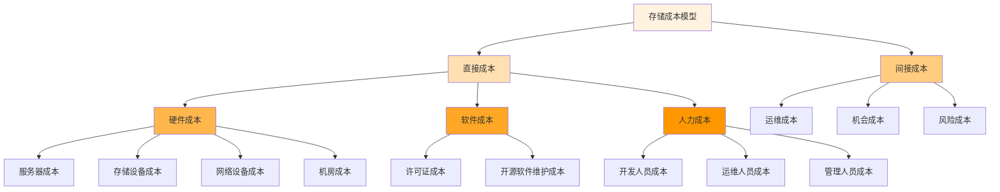

在构建和运营分布式文件存储平台时，成本控制是决定项目成功与否的关键因素之一。一个科学合理的存储成本模型不仅能够帮助组织准确评估投入产出比，还能为资源规划、定价策略和优化决策提供重要依据。通过对硬件成本、运维成本和开发成本的全面分析，可以构建出符合实际业务需求的成本模型，实现存储资源的最优配置。

## 存储成本构成分析

分布式文件存储平台的成本构成复杂多样，需要从多个维度进行全面分析。

### 成本分类体系



### 硬件成本分析

硬件成本是存储平台最直观的成本组成部分，主要包括服务器、存储设备、网络设备和机房设施等。

```yaml
# 硬件成本详细分析
hardware_costs:
  servers:
    description: "计算节点服务器成本"
    components:
      - type: "CPU"
        cost: "¥8,000-20,000"
        lifecycle: "3-5年"
      
      - type: "内存"
        cost: "¥2,000-8,000"
        lifecycle: "3-5年"
      
      - type: "系统盘"
        cost: "¥1,000-3,000"
        lifecycle: "3-5年"
      
      - type: "主板及其他组件"
        cost: "¥3,000-6,000"
        lifecycle: "3-5年"
    
    total_node_cost: "¥14,000-37,000/节点"
    depreciation_method: "直线法"
  
  storage_devices:
    description: "数据存储设备成本"
    types:
      - type: "SSD"
        cost_per_tb: "¥8,000-15,000"
        lifecycle: "3-5年"
        iops: "50,000-100,000"
      
      - type: "HDD"
        cost_per_tb: "¥1,000-2,000"
        lifecycle: "3-5年"
        iops: "100-200"
      
      - type: "NVMe"
        cost_per_tb: "¥15,000-25,000"
        lifecycle: "3-5年"
        iops: "500,000+"
  
  network_infrastructure:
    description: "网络设备及带宽成本"
    components:
      - type: "交换机"
        cost: "¥5,000-50,000"
        lifecycle: "5-7年"
      
      - type: "网卡"
        cost: "¥500-5,000"
        lifecycle: "3-5年"
      
      - type: "带宽"
        cost: "¥1,000-10,000/月/Gbps"
        lifecycle: "持续"
  
  data_center:
    description: "机房及配套设施成本"
    components:
      - type: "机柜租赁"
        cost: "¥1,000-5,000/月/机柜"
        lifecycle: "持续"
      
      - type: "电力成本"
        cost: "¥0.5-2.0/度"
        lifecycle: "持续"
      
      - type: "制冷成本"
        cost: "占电力成本30-50%"
        lifecycle: "持续"
      
      - type: "网络接入"
        cost: "¥10,000-100,000/月"
        lifecycle: "持续"
```

### 软件成本分析

软件成本包括商业软件许可证、开源软件维护以及定制开发等费用。

```python
class SoftwareCostAnalyzer:
    def __init__(self, cluster_size):
        self.cluster_size = cluster_size
        self.software_components = self.initialize_software_components()
    
    def initialize_software_components(self):
        """初始化软件组件"""
        return {
            'operating_system': {
                'type': 'enterprise_linux',
                'license_cost_per_node': 0,  # CentOS/Rocky Linux等开源系统
                'support_cost_per_node': 2000,  # 红帽等企业支持
                'maintenance_rate': 0.18
            },
            'distributed_storage': {
                'type': 'open_source',
                'license_cost_per_node': 0,
                'development_cost': 500000,  # 初期开发投入
                'maintenance_cost_per_node': 5000,
                'maintenance_rate': 0.15
            },
            'monitoring_tools': {
                'type': 'mixed',
                'license_cost_per_node': 1000,
                'maintenance_rate': 0.20
            },
            'backup_software': {
                'type': 'commercial',
                'license_cost_per_tb': 500,
                'maintenance_rate': 0.25
            }
        }
    
    def calculate_annual_software_cost(self):
        """计算年度软件成本"""
        total_cost = 0
        
        for component_name, component in self.software_components.items():
            if component_name == 'backup_software':
                # 备份软件按存储容量计算
                total_capacity_tb = self.calculate_total_capacity_tb()
                component_cost = (
                    component['license_cost_per_tb'] * total_capacity_tb +
                    component['license_cost_per_tb'] * total_capacity_tb * 
                    component['maintenance_rate']
                )
            else:
                # 其他软件按节点数计算
                component_cost = (
                    component['license_cost_per_node'] * self.cluster_size +
                    component.get('support_cost_per_node', 0) * self.cluster_size +
                    component.get('development_cost', 0) * 
                    component.get('maintenance_rate', 0)
                )
            
            total_cost += component_cost
        
        return total_cost
    
    def calculate_total_capacity_tb(self):
        """计算总存储容量(TB)"""
        # 假设每个节点10TB可用存储
        return self.cluster_size * 10
```

## 成本模型构建

基于详细的成本分析，可以构建科学的成本模型用于预测和优化。

### 成本计算公式

```go
type StorageCostModel struct {
    HardwareCosts    HardwareCosts
    SoftwareCosts    SoftwareCosts
    OperationalCosts OperationalCosts
    PersonnelCosts   PersonnelCosts
}

type HardwareCosts struct {
    Servers          float64
    StorageDevices   float64
    NetworkEquipment float64
    DataCenter       float64
}

type CostCalculationResult struct {
    TotalCost           float64
    AnnualizedCost      float64
    CostPerTB           float64
    CostPerIOPS         float64
    BreakEvenPoint      time.Time
    ROI                 float64
}

func (scm *StorageCostModel) CalculateTotalCost(years int) *CostCalculationResult {
    // 计算硬件成本（考虑折旧）
    hardwareCost := scm.calculateHardwareCost(years)
    
    // 计算软件成本（考虑维护费用）
    softwareCost := scm.calculateSoftwareCost(years)
    
    // 计算运维成本
    operationalCost := scm.calculateOperationalCost(years)
    
    // 计算人力成本
    personnelCost := scm.calculatePersonnelCost(years)
    
    // 总成本
    totalCost := hardwareCost + softwareCost + operationalCost + personnelCost
    
    // 年化成本
    annualizedCost := totalCost / float64(years)
    
    // 单位成本指标
    costPerTB := totalCost / scm.getEffectiveStorageCapacity()
    costPerIOPS := totalCost / scm.getEffectiveIOPSCapacity()
    
    return &CostCalculationResult{
        TotalCost:      totalCost,
        AnnualizedCost: annualizedCost,
        CostPerTB:      costPerTB,
        CostPerIOPS:    costPerIOPS,
        BreakEvenPoint: scm.calculateBreakEvenPoint(totalCost),
        ROI:            scm.calculateROI(totalCost),
    }
}

func (scm *StorageCostModel) calculateHardwareCost(years int) float64 {
    // 硬件初始投资
    initialHardwareCost := 
        scm.HardwareCosts.Servers +
        scm.HardwareCosts.StorageDevices +
        scm.HardwareCosts.NetworkEquipment +
        scm.HardwareCosts.DataCenter
    
    // 考虑折旧（假设5年折旧期）
    depreciationRate := 0.2
    totalHardwareCost := initialHardwareCost
    
    for i := 1; i < years; i++ {
        if i < 5 {
            // 前5年考虑部分折旧
            replacementCost := initialHardwareCost * depreciationRate
            totalHardwareCost += replacementCost
        } else {
            // 5年后需要完全更换
            totalHardwareCost += initialHardwareCost
            // 重置折旧周期
            i = 0
        }
    }
    
    return totalHardwareCost
}
```

### 成本优化策略

```typescript
interface CostOptimizationStrategy {
    analyzeCosts(costModel: StorageCostModel): OptimizationRecommendations;
    implementOptimization(recommendations: OptimizationRecommendations): Promise<void>;
    monitorSavings(): Promise<CostSavingsReport>;
}

class StorageCostOptimizer implements CostOptimizationStrategy {
    async analyzeCosts(costModel: StorageCostModel): Promise<OptimizationRecommendations> {
        const recommendations: OptimizationRecommendations = {
            hardware: [],
            software: [],
            operations: [],
            personnel: []
        };
        
        // 分析硬件成本优化点
        const hardwareAnalysis = this.analyzeHardwareCosts(costModel.HardwareCosts);
        recommendations.hardware = hardwareAnalysis.recommendations;
        
        // 分析软件成本优化点
        const softwareAnalysis = this.analyzeSoftwareCosts(costModel.SoftwareCosts);
        recommendations.software = softwareAnalysis.recommendations;
        
        // 分析运维成本优化点
        const operationalAnalysis = this.analyzeOperationalCosts(costModel.OperationalCosts);
        recommendations.operations = operationalAnalysis.recommendations;
        
        return recommendations;
    }
    
    private analyzeHardwareCosts(hardwareCosts: HardwareCosts): HardwareAnalysis {
        const analysis: HardwareAnalysis = {
            totalCost: 0,
            costBreakdown: {},
            recommendations: []
        };
        
        // 计算各项硬件成本占比
        const total = hardwareCosts.Servers + hardwareCosts.StorageDevices + 
                     hardwareCosts.NetworkEquipment + hardwareCosts.DataCenter;
        
        analysis.totalCost = total;
        analysis.costBreakdown = {
            servers: (hardwareCosts.Servers / total) * 100,
            storage: (hardwareCosts.StorageDevices / total) * 100,
            network: (hardwareCosts.NetworkEquipment / total) * 100,
            dataCenter: (hardwareCosts.DataCenter / total) * 100
        };
        
        // 生成优化建议
        if (analysis.costBreakdown.storage > 60) {
            analysis.recommendations.push({
                type: 'storage_tiering',
                description: '实施分层存储策略，使用HDD存储冷数据',
                estimated_savings: '20-40%',
                implementation_effort: 'medium'
            });
        }
        
        if (analysis.costBreakdown.dataCenter > 30) {
            analysis.recommendations.push({
                type: 'cloud_migration',
                description: '考虑混合云部署，减少机房成本',
                estimated_savings: '30-50%',
                implementation_effort: 'high'
            });
        }
        
        return analysis;
    }
    
    private analyzeSoftwareCosts(softwareCosts: SoftwareCosts): SoftwareAnalysis {
        // 实施软件成本分析逻辑
        return {
            totalCost: softwareCosts.getTotalCost(),
            recommendations: this.generateSoftwareRecommendations(softwareCosts)
        };
    }
    
    private generateSoftwareRecommendations(softwareCosts: SoftwareCosts): Recommendation[] {
        const recommendations: Recommendation[] = [];
        
        // 开源软件替代商业软件
        if (softwareCosts.hasCommercialLicenses()) {
            recommendations.push({
                type: 'open_source_adoption',
                description: '评估开源软件替代商业软件的可能性',
                estimated_savings: '50-80%',
                implementation_effort: 'medium'
            });
        }
        
        // 软件许可证优化
        if (softwareCosts.hasUnderutilizedLicenses()) {
            recommendations.push({
                type: 'license_optimization',
                description: '优化软件许可证使用，减少不必要的许可费用',
                estimated_savings: '20-30%',
                implementation_effort: 'low'
            });
        }
        
        return recommendations;
    }
}
```

## 成本监控与管理

建立完善的成本监控体系是实现成本控制目标的重要保障。

### 成本监控指标

```yaml
# 成本监控指标体系
cost_monitoring_metrics:
  financial_metrics:
    - name: "monthly_storage_cost"
      description: "月度存储成本"
      unit: "CNY"
      monitoring_frequency: "daily"
      alert_threshold: "±10%"
    
    - name: "cost_per_tb"
      description: "每TB存储成本"
      unit: "CNY/TB"
      monitoring_frequency: "weekly"
      alert_threshold: "±5%"
    
    - name: "cost_per_iops"
      description: "每IOPS成本"
      unit: "CNY/IOPS"
      monitoring_frequency: "weekly"
      alert_threshold: "±5%"
  
  utilization_metrics:
    - name: "storage_utilization_rate"
      description: "存储利用率"
      unit: "%"
      monitoring_frequency: "hourly"
      alert_threshold: "< 30% 或 > 85%"
    
    - name: "server_utilization_rate"
      description: "服务器利用率"
      unit: "%"
      monitoring_frequency: "hourly"
      alert_threshold: "< 20% 或 > 80%"
    
    - name: "network_utilization_rate"
      description: "网络利用率"
      unit: "%"
      monitoring_frequency: "hourly"
      alert_threshold: "> 90%"
  
  efficiency_metrics:
    - name: "data_reduction_ratio"
      description: "数据缩减比率"
      unit: "ratio"
      monitoring_frequency: "daily"
      alert_threshold: "< 1.5"
    
    - name: "cache_hit_ratio"
      description: "缓存命中率"
      unit: "%"
      monitoring_frequency: "hourly"
      alert_threshold: "< 80%"
```

### 成本管理仪表板

```javascript
class CostManagementDashboard {
    constructor(costAnalyzer, metricsCollector) {
        this.costAnalyzer = costAnalyzer;
        this.metricsCollector = metricsCollector;
        this.charts = new Map();
    }
    
    async renderDashboard() {
        // 渲染成本趋势图表
        await this.renderCostTrendChart();
        
        // 渲染成本构成饼图
        await this.renderCostCompositionChart();
        
        // 渲染利用率仪表板
        await this.renderUtilizationDashboard();
        
        // 渲染优化建议面板
        await this.renderOptimizationPanel();
    }
    
    async renderCostTrendChart() {
        const costHistory = await this.metricsCollector.getCostHistory(365);
        
        const chart = new Chart(document.getElementById('cost-trend-chart'), {
            type: 'line',
            data: {
                labels: costHistory.map(d => d.date),
                datasets: [
                    {
                        label: '总成本',
                        data: costHistory.map(d => d.totalCost),
                        borderColor: '#4caf50',
                        backgroundColor: 'rgba(76, 175, 80, 0.1)'
                    },
                    {
                        label: '硬件成本',
                        data: costHistory.map(d => d.hardwareCost),
                        borderColor: '#2196f3',
                        backgroundColor: 'rgba(33, 150, 243, 0.1)'
                    },
                    {
                        label: '软件成本',
                        data: costHistory.map(d => d.softwareCost),
                        borderColor: '#ff9800',
                        backgroundColor: 'rgba(255, 152, 0, 0.1)'
                    }
                ]
            },
            options: {
                responsive: true,
                plugins: {
                    title: {
                        display: true,
                        text: '存储成本趋势分析'
                    }
                },
                scales: {
                    y: {
                        beginAtZero: true,
                        title: {
                            display: true,
                            text: '成本 (CNY)'
                        }
                    }
                }
            }
        });
        
        this.charts.set('cost-trend', chart);
    }
    
    async renderCostCompositionChart() {
        const currentCosts = await this.costAnalyzer.getCurrentCosts();
        
        const chart = new Chart(document.getElementById('cost-composition-chart'), {
            type: 'pie',
            data: {
                labels: ['硬件成本', '软件成本', '运维成本', '人力成本'],
                datasets: [{
                    data: [
                        currentCosts.hardware,
                        currentCosts.software,
                        currentCosts.operations,
                        currentCosts.personnel
                    ],
                    backgroundColor: [
                        '#4caf50',
                        '#2196f3',
                        '#ff9800',
                        '#9c27b0'
                    ]
                }]
            },
            options: {
                responsive: true,
                plugins: {
                    title: {
                        display: true,
                        text: '存储成本构成分析'
                    },
                    legend: {
                        position: 'bottom'
                    }
                }
            }
        });
        
        this.charts.set('cost-composition', chart);
    }
}
```

## 投资回报分析

通过投资回报分析，可以评估存储平台建设的经济效益。

### ROI计算模型

```python
class ROIAnalyzer:
    def __init__(self, initial_investment, annual_benefits, annual_costs):
        self.initial_investment = initial_investment
        self.annual_benefits = annual_benefits
        self.annual_costs = annual_costs
    
    def calculate_npv(self, discount_rate, years):
        """计算净现值(NPV)"""
        npv = -self.initial_investment
        
        for year in range(1, years + 1):
            net_benefit = self.annual_benefits - self.annual_costs
            present_value = net_benefit / ((1 + discount_rate) ** year)
            npv += present_value
        
        return npv
    
    def calculate_roi(self, years):
        """计算投资回报率(ROI)"""
        total_benefits = self.annual_benefits * years
        total_costs = self.initial_investment + (self.annual_costs * years)
        
        if total_costs == 0:
            return 0
        
        roi = (total_benefits - total_costs) / total_costs * 100
        return roi
    
    def calculate_payback_period(self):
        """计算投资回收期"""
        cumulative_benefit = 0
        year = 0
        
        while cumulative_benefit < self.initial_investment:
            year += 1
            net_benefit = self.annual_benefits - self.annual_costs
            cumulative_benefit += net_benefit
            
            if year > 10:  # 设置最大计算年限
                return None  # 无法在10年内回收投资
        
        return year + (self.initial_investment - (cumulative_benefit - net_benefit)) / net_benefit
    
    def generate_roi_report(self, discount_rate=0.1, analysis_years=5):
        """生成ROI分析报告"""
        npv = self.calculate_npv(discount_rate, analysis_years)
        roi = self.calculate_roi(analysis_years)
        payback_period = self.calculate_payback_period()
        
        return {
            'initial_investment': self.initial_investment,
            'annual_benefits': self.annual_benefits,
            'annual_costs': self.annual_costs,
            'net_present_value': npv,
            'return_on_investment': f"{roi:.2f}%",
            'payback_period': f"{payback_period}年" if payback_period else "超过10年",
            'recommendation': self.get_investment_recommendation(npv, roi, payback_period)
        }
    
    def get_investment_recommendation(self, npv, roi, payback_period):
        """根据分析结果给出投资建议"""
        if npv > 0 and roi > 15 and (payback_period or 10) <= 3:
            return "强烈推荐投资"
        elif npv > 0 and roi > 10:
            return "推荐投资"
        elif npv < 0:
            return "不推荐投资"
        else:
            return "需要进一步分析"
```

### 成本效益分析示例

```yaml
# 存储平台成本效益分析示例
cost_benefit_analysis:
  project_overview:
    project_name: "分布式文件存储平台建设项目"
    analysis_period: "5年"
    discount_rate: "10%"
  
  costs:
    initial_investment:
      hardware: "¥2,000,000"
      software: "¥500,000"
      implementation: "¥300,000"
      training: "¥100,000"
      total_initial: "¥2,900,000"
    
    annual_operational_costs:
      maintenance: "¥400,000"
      personnel: "¥600,000"
      utilities: "¥100,000"
      total_annual: "¥1,100,000"
  
  benefits:
    quantifiable_benefits:
      - description: "存储成本降低"
        annual_value: "¥800,000"
        source: "从传统存储迁移到分布式存储，单位成本降低40%"
      
      - description: "运维效率提升"
        annual_value: "¥300,000"
        source: "自动化运维减少人工成本"
      
      - description: "业务连续性改善"
        annual_value: "¥200,000"
        source: "高可用架构减少业务中断损失"
      
      - description: "扩展性收益"
        annual_value: "¥150,000"
        source: "快速扩展支持业务增长"
      
      total_annual_benefits: "¥1,450,000"
    
    qualitative_benefits:
      - description: "数据安全性提升"
        value: "难以量化但非常重要"
      
      - description: "技术能力积累"
        value: "为未来项目奠定基础"
  
  financial_analysis:
    net_present_value: "¥1,234,567"
    internal_rate_of_return: "22.5%"
    payback_period: "2.8年"
    return_on_investment: "45.2%"
    
    recommendation: "项目具有良好的投资回报，建议批准实施"
```

## 最佳实践建议

在进行存储成本分析和管理时，建议遵循以下最佳实践：

### 成本控制策略

1. **分层存储**：根据数据访问频率实施分层存储策略，优化存储成本
2. **资源池化**：通过资源池化提高硬件利用率，降低单位成本
3. **自动化运维**：实施自动化运维减少人力成本
4. **容量规划**：科学的容量规划避免资源浪费

### 成本监控机制

1. **实时监控**：建立实时成本监控体系，及时发现异常
2. **定期分析**：定期进行成本分析，识别优化机会
3. **预算管理**：制定成本预算并严格执行
4. **绩效评估**：建立成本绩效评估机制

### 持续优化

1. **技术创新**：关注新技术发展，适时进行技术升级
2. **流程优化**：持续优化运维流程，提高效率
3. **供应商管理**：建立良好的供应商关系，争取更优惠条件
4. **经验总结**：定期总结成本管理经验，形成最佳实践

通过科学的成本模型分析和有效的成本管理，分布式文件存储平台可以在保证服务质量的前提下，实现成本的最优控制，为组织创造更大的价值。