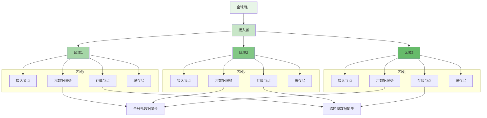
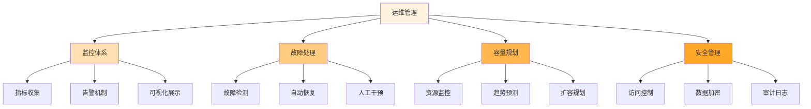

在全球化业务背景下，分布式文件存储系统需要跨越地理边界，为不同区域的用户提供一致的服务体验。多区域部署和联邦集群架构成为支撑全球业务的关键技术方案。通过合理的区域划分、数据同步策略和一致性保障机制，可以构建高可用、低延迟、可扩展的全球分布式存储基础设施。

## 多区域部署架构设计

多区域部署通过在不同地理位置建立独立的存储集群，实现数据的地理冗余和服务的就近访问，从而提升系统的可用性和用户体验。

### 区域架构模式



### 区域部署策略

```yaml
# 多区域部署策略
multi_region_strategy:
  region_selection:
    criteria:
      - "用户分布密度"
      - "网络基础设施"
      - "法律法规要求"
      - "成本考虑"
    process:
      - "用户访问模式分析"
      - "网络延迟测试"
      - "合规性评估"
      - "成本效益分析"
  
  data_distribution:
    strategies:
      - name: "就近存储"
        description: "根据用户地理位置将数据存储在最近的区域"
        benefits:
          - "降低访问延迟"
          - "减少跨区域流量"
        implementation:
          - "基于IP地理位置识别"
          - "智能路由策略"
      
      - name: "多副本存储"
        description: "在多个区域存储数据副本以提高可用性"
        benefits:
          - "灾难恢复能力"
          - "数据持久性保障"
        implementation:
          - "副本放置策略"
          - "一致性协议"
      
      - name: "冷热数据分离"
        description: "根据数据访问频率在不同区域存储"
        benefits:
          - "成本优化"
          - "性能优化"
        implementation:
          - "数据生命周期管理"
          - "自动迁移策略"
```

## 联邦集群架构实现

联邦集群通过将多个独立的存储集群联合起来，形成一个逻辑上的统一存储系统，既保持了各集群的独立性，又实现了全局资源的统一管理。

### 联邦架构组件

```go
type FederationCluster struct {
    ClusterID      string
    Region         string
    Nodes          []Node
    MetadataService *MetadataService
    StorageService  *StorageService
    FederationManager *FederationManager
}

type FederationManager struct {
    Clusters       map[string]*FederationCluster
    GlobalMetadata *GlobalMetadataService
    SyncController *DataSyncController
    LoadBalancer   *GlobalLoadBalancer
}

func (fm *FederationManager) InitializeFederation(clusters []*FederationCluster) error {
    // 1. 注册所有集群
    for _, cluster := range clusters {
        if err := fm.registerCluster(cluster); err != nil {
            return err
        }
    }
    
    // 2. 初始化全局元数据服务
    if err := fm.initializeGlobalMetadata(); err != nil {
        return err
    }
    
    // 3. 启动数据同步控制器
    fm.startDataSyncController()
    
    // 4. 配置全局负载均衡
    fm.configureGlobalLoadBalancer()
    
    return nil
}

func (fm *FederationManager) registerCluster(cluster *FederationCluster) error {
    // 验证集群信息
    if cluster.ClusterID == "" || cluster.Region == "" {
        return fmt.Errorf("invalid cluster configuration")
    }
    
    // 检查集群连通性
    if !fm.checkClusterConnectivity(cluster) {
        return fmt.Errorf("cluster %s is not reachable", cluster.ClusterID)
    }
    
    // 注册到联邦管理器
    fm.Clusters[cluster.ClusterID] = cluster
    
    // 通知其他集群新成员加入
    fm.notifyClusterJoin(cluster)
    
    return nil
}
```

### 全局元数据管理

```typescript
interface GlobalMetadataService {
    // 全局命名空间管理
    createGlobalNamespace(name: string): Promise<NamespaceInfo>;
    
    // 跨区域元数据同步
    syncMetadata(metadata: Metadata, sourceRegion: string): Promise<void>;
    
    // 全局一致性保证
    ensureGlobalConsistency(key: string): Promise<boolean>;
    
    // 元数据查询路由
    routeMetadataQuery(query: MetadataQuery): Promise<Metadata[]>;
}

class FederatedMetadataService implements GlobalMetadataService {
    private regionMetadata: Map<string, RegionalMetadataService>;
    private globalConsistency: GlobalConsistencyProtocol;
    private metadataRouter: MetadataRouter;
    
    async createGlobalNamespace(name: string): Promise<NamespaceInfo> {
        // 创建全局命名空间
        const namespaceInfo = await this.globalConsistency.createNamespace(name);
        
        // 在所有区域初始化命名空间
        const regionPromises = Array.from(this.regionMetadata.values()).map(
            regionalService => regionalService.initializeNamespace(name)
        );
        
        await Promise.all(regionPromises);
        
        return namespaceInfo;
    }
    
    async syncMetadata(metadata: Metadata, sourceRegion: string): Promise<void> {
        // 记录元数据变更
        await this.globalConsistency.recordChange(metadata, sourceRegion);
        
        // 向其他区域同步变更
        const targetRegions = Array.from(this.regionMetadata.keys())
            .filter(region => region !== sourceRegion);
        
        const syncPromises = targetRegions.map(region => 
            this.regionMetadata.get(region)!.applyChange(metadata)
        );
        
        await Promise.all(syncPromises);
    }
    
    async ensureGlobalConsistency(key: string): Promise<boolean> {
        // 使用全局一致性协议保证跨区域一致性
        return await this.globalConsistency.ensureConsistency(key);
    }
    
    async routeMetadataQuery(query: MetadataQuery): Promise<Metadata[]> {
        // 根据查询条件路由到合适的区域
        const targetRegions = this.metadataRouter.routeQuery(query);
        
        // 并行查询多个区域
        const queryPromises = targetRegions.map(region => 
            this.regionMetadata.get(region)!.queryMetadata(query)
        );
        
        const results = await Promise.all(queryPromises);
        return results.flat();
    }
}
```

## 数据同步与一致性保障

跨区域数据同步和一致性保障是联邦集群架构的核心挑战，需要在性能、一致性和可用性之间找到平衡点。

### 数据同步策略

```python
class DataSynchronizationManager:
    def __init__(self, config):
        self.config = config
        self.sync_strategies = {
            'realtime': RealtimeSyncStrategy(),
            'batch': BatchSyncStrategy(),
            'eventual': EventualSyncStrategy()
        }
        self.conflict_resolver = ConflictResolver()
    
    def sync_data_between_regions(self, source_region, target_region, data_objects):
        """在区域间同步数据"""
        # 1. 选择同步策略
        strategy = self.select_sync_strategy(source_region, target_region)
        
        # 2. 执行数据同步
        sync_results = strategy.sync(data_objects)
        
        # 3. 处理冲突
        resolved_results = self.resolve_conflicts(sync_results)
        
        # 4. 验证同步结果
        validation_results = self.validate_sync_results(resolved_results)
        
        return validation_results
    
    def select_sync_strategy(self, source_region, target_region):
        """根据区域特性和数据特征选择同步策略"""
        # 考虑网络延迟、带宽、数据重要性等因素
        network_conditions = self.get_network_conditions(source_region, target_region)
        data_priority = self.get_data_priority()
        
        if network_conditions.bandwidth > 1000 and data_priority == 'high':
            return self.sync_strategies['realtime']
        elif network_conditions.latency < 100:
            return self.sync_strategies['batch']
        else:
            return self.sync_strategies['eventual']
    
    def resolve_conflicts(self, sync_results):
        """解决数据同步冲突"""
        resolved_results = []
        
        for result in sync_results:
            if result.has_conflict:
                # 使用冲突解决策略
                resolved_data = self.conflict_resolver.resolve(
                    result.local_data, 
                    result.remote_data,
                    result.conflict_type
                )
                resolved_results.append(resolved_data)
            else:
                resolved_results.append(result.data)
        
        return resolved_results
```

### 一致性保障机制

```javascript
class ConsistencyGuaranteeMechanism {
    constructor(config) {
        this.config = config;
        this.consistencyProtocols = {
            'strong': new StrongConsistencyProtocol(),
            'eventual': new EventualConsistencyProtocol(),
            'causal': new CausalConsistencyProtocol()
        };
    }
    
    /**
     * 保证跨区域数据一致性
     * @param {string} key - 数据键
     * @param {string} region - 区域标识
     * @returns {Promise<boolean>} 一致性保障结果
     */
    async ensureGlobalConsistency(key, region) {
        // 1. 获取全局一致性要求
        const consistencyLevel = this.getConsistencyRequirement(key);
        
        // 2. 选择合适的协议
        const protocol = this.consistencyProtocols[consistencyLevel];
        
        // 3. 执行一致性保障
        const result = await protocol.ensureConsistency(key, region);
        
        // 4. 记录一致性状态
        await this.recordConsistencyState(key, region, result);
        
        return result;
    }
    
    /**
     * 处理网络分区情况下的数据一致性
     * @param {string} partitionInfo - 分区信息
     * @returns {Promise<object>} 处理结果
     */
    async handleNetworkPartition(partitionInfo) {
        // 1. 检测网络分区
        const partitions = this.detectNetworkPartitions(partitionInfo);
        
        // 2. 分区隔离处理
        const isolationResults = await this.isolatePartitions(partitions);
        
        // 3. 数据冲突检测
        const conflicts = await this.detectDataConflicts(partitions);
        
        // 4. 冲突解决
        const resolutionResults = await this.resolveConflicts(conflicts);
        
        // 5. 网络恢复后的数据合并
        const mergeResults = await this.mergePartitionData(partitions);
        
        return {
            partitions: isolationResults,
            conflicts: resolutionResults,
            merged: mergeResults
        };
    }
}
```

## 负载均衡与流量调度

全球分布式部署需要智能的负载均衡和流量调度机制，以优化资源利用和用户体验。

### 全局负载均衡

```yaml
# 全局负载均衡配置
global_load_balancing:
  algorithms:
    - name: "地理位置路由"
      description: "根据用户地理位置路由到最近的区域"
      configuration:
        geo_ip_database: "maxmind_geoip"
        fallback_strategy: "least_connection"
    
    - name: "延迟感知路由"
      description: "根据网络延迟选择最优区域"
      configuration:
        latency_threshold: "50ms"
        probe_frequency: "30s"
    
    - name: "容量感知路由"
      description: "根据各区域容量情况分配流量"
      configuration:
        capacity_threshold: "80%"
        rebalance_interval: "5m"
  
  health_check:
    probe_types:
      - "tcp_connectivity"
      - "http_endpoint"
      - "storage_availability"
    check_interval: "10s"
    failure_threshold: 3
    recovery_threshold: 2
  
  failover:
    strategies:
      - "active_active"
      - "active_standby"
      - "geo_redundant"
    failover_time: "< 30s"
```

### 智能流量调度

```go
type TrafficScheduler struct {
    RegionManager    *RegionManager
    LoadBalancer     *GlobalLoadBalancer
    HealthChecker    *HealthChecker
    MetricsCollector *MetricsCollector
}

type SchedulingDecision struct {
    TargetRegion string
    Reason       string
    Priority     int
    Metadata     map[string]interface{}
}

func (ts *TrafficScheduler) ScheduleRequest(request *UserRequest) *SchedulingDecision {
    // 1. 获取用户位置信息
    userLocation := ts.getUserLocation(request)
    
    // 2. 收集各区域状态信息
    regionStates := ts.collectRegionStates()
    
    // 3. 应用调度策略
    decision := ts.applySchedulingPolicies(request, userLocation, regionStates)
    
    // 4. 执行健康检查
    if !ts.HealthChecker.IsRegionHealthy(decision.TargetRegion) {
        // 选择备选区域
        decision = ts.selectFallbackRegion(request, userLocation, regionStates)
    }
    
    // 5. 记录调度决策
    ts.recordSchedulingDecision(request, decision)
    
    return decision
}

func (ts *TrafficScheduler) applySchedulingPolicies(request *UserRequest, 
    userLocation *Location, regionStates []*RegionState) *SchedulingDecision {
    
    // 地理位置优先策略
    if nearestRegion := ts.findNearestRegion(userLocation, regionStates); nearestRegion != nil {
        return &SchedulingDecision{
            TargetRegion: nearestRegion.ID,
            Reason:       "nearest_region",
            Priority:     1,
        }
    }
    
    // 负载均衡策略
    if leastLoadedRegion := ts.findLeastLoadedRegion(regionStates); leastLoadedRegion != nil {
        return &SchedulingDecision{
            TargetRegion: leastLoadedRegion.ID,
            Reason:       "load_balancing",
            Priority:     2,
        }
    }
    
    // 性能优先策略
    if bestPerformanceRegion := ts.findBestPerformanceRegion(regionStates); bestPerformanceRegion != nil {
        return &SchedulingDecision{
            TargetRegion: bestPerformanceRegion.ID,
            Reason:       "performance_optimization",
            Priority:     3,
        }
    }
    
    // 默认策略
    return &SchedulingDecision{
        TargetRegion: regionStates[0].ID,
        Reason:       "default",
        Priority:     10,
    }
}
```

## 监控与运维管理

多区域部署增加了系统的复杂性，需要建立完善的监控和运维管理体系。

### 全局监控架构

```python
class GlobalMonitoringSystem:
    def __init__(self, config):
        self.config = config
        self.region_monitors = {}
        self.global_dashboard = GlobalDashboard()
        self.alert_manager = GlobalAlertManager()
    
    def initialize_region_monitoring(self, regions):
        """初始化各区域监控"""
        for region in regions:
            # 创建区域监控实例
            monitor = RegionMonitor(region)
            self.region_monitors[region.id] = monitor
            
            # 配置监控指标
            monitor.configure_metrics(self.config.metrics)
            
            # 启动数据收集
            monitor.start_collecting()
    
    def collect_global_metrics(self):
        """收集全局监控指标"""
        global_metrics = {}
        
        # 并行收集各区域指标
        region_metrics = {}
        with ThreadPoolExecutor(max_workers=len(self.region_monitors)) as executor:
            future_to_region = {
                executor.submit(monitor.collect_metrics): region_id
                for region_id, monitor in self.region_monitors.items()
            }
            
            for future in as_completed(future_to_region):
                region_id = future_to_region[future]
                try:
                    metrics = future.result()
                    region_metrics[region_id] = metrics
                except Exception as e:
                    logger.error(f"Failed to collect metrics from region {region_id}: {e}")
        
        # 聚合全局指标
        global_metrics['region_metrics'] = region_metrics
        global_metrics['cross_region_latency'] = self.calculate_cross_region_latency(region_metrics)
        global_metrics['global_availability'] = self.calculate_global_availability(region_metrics)
        
        return global_metrics
    
    def generate_global_dashboard(self):
        """生成全局监控仪表板"""
        metrics = self.collect_global_metrics()
        
        # 更新全局仪表板
        self.global_dashboard.update(metrics)
        
        # 生成区域对比视图
        self.global_dashboard.generate_region_comparison_view(metrics['region_metrics'])
        
        # 生成趋势分析
        self.global_dashboard.generate_trend_analysis(metrics)
        
        return self.global_dashboard.get_view()
```

### 跨区域故障处理

```typescript
interface CrossRegionFailureHandler {
    detectRegionFailure(regionId: string): Promise<boolean>;
    handleRegionFailure(failedRegion: string): Promise<FailureHandlingResult>;
    recoverFromFailure(failedRegion: string): Promise<RecoveryResult>;
}

class GlobalFailureHandler implements CrossRegionFailureHandler {
    private regionManager: RegionManager;
    private dataReplicator: DataReplicator;
    private trafficScheduler: TrafficScheduler;
    
    async detectRegionFailure(regionId: string): Promise<boolean> {
        // 检查区域健康状态
        const healthStatus = await this.regionManager.checkRegionHealth(regionId);
        
        // 检查关键服务可用性
        const serviceStatus = await this.checkCriticalServices(regionId);
        
        // 检查数据一致性
        const consistencyStatus = await this.checkDataConsistency(regionId);
        
        // 综合判断区域是否故障
        return !healthStatus.healthy || 
               !serviceStatus.available || 
               !consistencyStatus.consistent;
    }
    
    async handleRegionFailure(failedRegion: string): Promise<FailureHandlingResult> {
        // 1. 隔离故障区域
        await this.isolateFailedRegion(failedRegion);
        
        // 2. 重定向流量
        const redirectResult = await this.redirectTraffic(failedRegion);
        
        // 3. 数据保护
        const protectionResult = await this.protectData(failedRegion);
        
        // 4. 通知相关方
        await this.notifyStakeholders(failedRegion, redirectResult, protectionResult);
        
        return {
            region: failedRegion,
            isolated: true,
            trafficRedirected: redirectResult.success,
            dataProtected: protectionResult.success,
            timestamp: new Date()
        };
    }
    
    async recoverFromFailure(failedRegion: string): Promise<RecoveryResult> {
        // 1. 检查区域恢复状态
        const recoveryStatus = await this.checkRegionRecovery(failedRegion);
        
        if (!recoveryStatus.recovered) {
            return {
                success: false,
                message: "Region not fully recovered"
            };
        }
        
        // 2. 数据同步
        const syncResult = await this.synchronizeData(failedRegion);
        
        // 3. 服务恢复
        const serviceResult = await this.restoreServices(failedRegion);
        
        // 4. 流量回切
        const trafficResult = await this.switchTrafficBack(failedRegion);
        
        // 5. 验证恢复结果
        const validation = await this.validateRecovery(failedRegion);
        
        return {
            success: validation.valid,
            region: failedRegion,
            dataSynced: syncResult.success,
            servicesRestored: serviceResult.success,
            trafficRestored: trafficResult.success,
            validation: validation
        };
    }
}
```

## 最佳实践与经验总结

在实施多区域和联邦集群部署时，需要遵循一系列最佳实践来确保成功。

### 部署规划建议

1. **区域选择策略**：根据用户分布、网络条件和成本因素合理选择部署区域
2. **数据分布策略**：结合业务特点和访问模式制定合适的数据分布策略
3. **一致性模型选择**：根据不同数据的重要性和访问要求选择合适的一致性模型
4. **容灾备份策略**：建立完善的跨区域容灾和备份机制

### 运维管理要点



### 性能优化技巧

1. **网络优化**：使用专线连接、CDN加速等技术优化跨区域网络通信
2. **缓存策略**：实施多级缓存和边缘计算，减少跨区域数据访问
3. **数据预取**：根据访问模式预测性地预取数据到就近区域
4. **压缩传输**：对跨区域传输的数据进行压缩以减少带宽消耗

通过科学的架构设计和精心的实施规划，多区域部署和联邦集群架构可以有效支撑全球业务需求，提供高可用、低延迟的分布式文件存储服务。这一架构不仅提升了用户体验，也为业务的全球化发展奠定了坚实的技术基础。