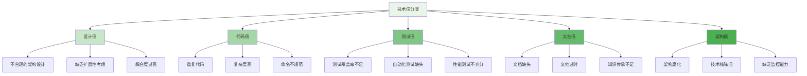
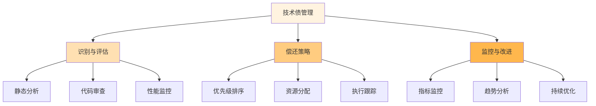

在分布式文件存储系统的长期演进过程中，技术债的积累是不可避免的现象。随着业务需求的变化、技术栈的更新和系统规模的扩张，原有的架构和实现可能逐渐变得不适应新的要求。有效的技术债管理和科学的平台重构策略成为确保系统可持续发展的关键。通过建立完善的技术债识别、评估和偿还机制，以及制定合理的重构计划，可以保持系统的健康度和竞争力。

## 技术债的识别与分类

技术债是指在软件开发过程中为了快速交付而采取的捷径，这些捷径在短期内可能有效，但长期来看会增加系统的复杂性和维护成本。在分布式文件存储系统中，技术债的表现形式多种多样。

### 技术债的常见类型



### 技术债识别方法

```yaml
# 技术债识别方法
technical_debt_identification:
  static_analysis:
    tools:
      - "SonarQube"
      - "CodeClimate"
      - "ESLint"
    metrics:
      - "代码复杂度"
      - "重复代码率"
      - "代码规范性"
  
  code_review:
    process:
      - "定期代码审查"
      - "结对编程"
      - "架构评审"
    focus_areas:
      - "设计模式应用"
      - "代码可读性"
      - "性能优化"
  
  performance_monitoring:
    indicators:
      - "系统响应时间"
      - "资源利用率"
      - "错误率"
    tools:
      - "Prometheus"
      - "Grafana"
      - "APM工具"
  
  incident_analysis:
    approach:
      - "根本原因分析"
      - "故障复盘"
      - "改进建议跟踪"
    outcomes:
      - "问题模式识别"
      - "系统薄弱点发现"
      - "预防措施制定"
```

## 技术债评估与量化

对技术债进行准确的评估和量化是制定偿还策略的基础。通过建立科学的评估体系，可以优先处理影响最大的技术债。

### 技术债评估模型

```python
class TechnicalDebtAssessment:
    def __init__(self):
        self.assessment_criteria = {
            'impact': self.calculate_impact,
            'effort': self.calculate_effort,
            'urgency': self.calculate_urgency,
            'risk': self.calculate_risk
        }
    
    def assess_technical_debt(self, debt_item):
        """评估技术债项"""
        # 计算各项指标
        impact_score = self.calculate_impact(debt_item)
        effort_score = self.calculate_effort(debt_item)
        urgency_score = self.calculate_urgency(debt_item)
        risk_score = self.calculate_risk(debt_item)
        
        # 综合评分
        overall_score = (
            impact_score * 0.4 +
            effort_score * 0.2 +
            urgency_score * 0.2 +
            risk_score * 0.2
        )
        
        return {
            'debt_id': debt_item.id,
            'impact': impact_score,
            'effort': effort_score,
            'urgency': urgency_score,
            'risk': risk_score,
            'overall_score': overall_score,
            'priority': self.determine_priority(overall_score)
        }
    
    def calculate_impact(self, debt_item):
        """计算技术债影响度"""
        impact_factors = {
            'user_experience': debt_item.affects_user_experience,
            'system_performance': debt_item.affects_performance,
            'maintenance_cost': debt_item.increases_maintenance_cost,
            'extensibility': debt_item.hurts_extensibility
        }
        
        impact_score = sum(impact_factors.values()) / len(impact_factors)
        return impact_score
    
    def calculate_effort(self, debt_item):
        """计算偿还技术债所需努力"""
        effort_factors = {
            'complexity': debt_item.complexity,
            'dependencies': len(debt_item.dependencies),
            'required_resources': debt_item.required_resources,
            'time_estimate': debt_item.estimated_time
        }
        
        # 归一化处理
        normalized_effort = (
            effort_factors['complexity'] * 0.3 +
            min(effort_factors['dependencies'] / 10, 1) * 0.2 +
            min(effort_factors['required_resources'] / 5, 1) * 0.3 +
            min(effort_factors['time_estimate'] / 100, 1) * 0.2
        )
        
        return normalized_effort
    
    def calculate_urgency(self, debt_item):
        """计算技术债紧急程度"""
        urgency_factors = {
            'business_criticality': debt_item.business_criticality,
            'regulatory_requirements': debt_item.regulatory_impact,
            'security_risks': debt_item.security_risks,
            'stakeholder_pressure': debt_item.stakeholder_concerns
        }
        
        urgency_score = sum(urgency_factors.values()) / len(urgency_factors)
        return urgency_score
    
    def calculate_risk(self, debt_item):
        """计算技术债风险"""
        risk_factors = {
            'failure_probability': debt_item.failure_probability,
            'data_loss_risk': debt_item.data_loss_risk,
            'downtime_risk': debt_item.downtime_risk,
            'reputation_risk': debt_item.reputation_risk
        }
        
        risk_score = sum(risk_factors.values()) / len(risk_factors)
        return risk_score
```

### 技术债量化指标

```go
type TechnicalDebtMetrics struct {
    DebtRatio          float64 `json:"debt_ratio"`           // 技术债比率
    DebtCoverage       float64 `json:"debt_coverage"`        // 技术债覆盖率
    RemediationTime    int     `json:"remediation_time"`     // 修复时间(小时)
    AnnualInterest     float64 `json:"annual_interest"`      // 年度利息成本
    CodeQualityScore   float64 `json:"code_quality_score"`   // 代码质量评分
}

type DebtCalculator struct {
    StaticAnalyzer    *StaticAnalyzer
    PerformanceMonitor *PerformanceMonitor
    CostTracker       *CostTracker
}

func (dc *DebtCalculator) CalculateMetrics(codebase *Codebase) *TechnicalDebtMetrics {
    // 1. 计算技术债比率
    debtRatio := dc.calculateDebtRatio(codebase)
    
    // 2. 计算技术债覆盖率
    debtCoverage := dc.calculateDebtCoverage(codebase)
    
    // 3. 估算修复时间
    remediationTime := dc.estimateRemediationTime(codebase)
    
    // 4. 计算年度利息成本
    annualInterest := dc.calculateAnnualInterest(codebase)
    
    // 5. 计算代码质量评分
    codeQualityScore := dc.calculateCodeQualityScore(codebase)
    
    return &TechnicalDebtMetrics{
        DebtRatio:        debtRatio,
        DebtCoverage:     debtCoverage,
        RemediationTime:  remediationTime,
        AnnualInterest:   annualInterest,
        CodeQualityScore: codeQualityScore,
    }
}

func (dc *DebtCalculator) calculateDebtRatio(codebase *Codebase) float64 {
    // 技术债比率 = 技术债成本 / 开发成本
    debtCost := dc.StaticAnalyzer.GetTechnicalDebtCost(codebase)
    developmentCost := dc.CostTracker.GetDevelopmentCost(codebase)
    
    if developmentCost == 0 {
        return 0
    }
    
    return debtCost / developmentCost
}

func (dc *DebtCalculator) calculateAnnualInterest(codebase *Codebase) float64 {
    // 年度利息 = 技术债成本 × 利率
    debtCost := dc.StaticAnalyzer.GetTechnicalDebtCost(codebase)
    interestRate := 0.15 // 假设年利率15%
    
    return debtCost * interestRate
}
```

## 技术债偿还策略

制定科学的技术债偿还策略是确保系统健康发展的关键。需要平衡业务需求和技术债务，合理安排偿还计划。

### 偿还策略框架

```typescript
interface DebtRepaymentStrategy {
    prioritizeDebts(debts: TechnicalDebt[]): Promise<TechnicalDebt[]>;
    planRepayment(debts: TechnicalDebt[]): Promise<RepaymentPlan>;
    trackProgress(plan: RepaymentPlan): Promise<ProgressReport>;
}

class StrategicDebtRepayment implements DebtRepaymentStrategy {
    private priorityCalculator: PriorityCalculator;
    private resourceAllocator: ResourceAllocator;
    private progressTracker: ProgressTracker;
    
    async prioritizeDebts(debts: TechnicalDebt[]): Promise<TechnicalDebt[]> {
        // 1. 计算每个技术债的优先级
        const prioritizedDebts = debts.map(debt => ({
            ...debt,
            priority: this.calculatePriority(debt)
        }));
        
        // 2. 按优先级排序
        return prioritizedDebts.sort((a, b) => b.priority - a.priority);
    }
    
    async planRepayment(debts: TechnicalDebt[]): Promise<RepaymentPlan> {
        // 1. 分组技术债
        const debtGroups = this.groupDebtsByType(debts);
        
        // 2. 制定偿还计划
        const repaymentTasks = [];
        
        for (const [group, groupDebts] of Object.entries(debtGroups)) {
            const tasks = await this.createRepaymentTasks(group, groupDebts);
            repaymentTasks.push(...tasks);
        }
        
        // 3. 安排时间表
        const schedule = this.scheduleRepaymentTasks(repaymentTasks);
        
        return {
            tasks: repaymentTasks,
            schedule: schedule,
            estimatedCompletion: this.estimateCompletion(schedule)
        };
    }
    
    private calculatePriority(debt: TechnicalDebt): number {
        // 综合考虑影响度、紧急程度和偿还成本
        return (
            debt.impact * 0.4 +
            debt.urgency * 0.3 +
            (1 - debt.effort) * 0.2 +
            debt.risk * 0.1
        );
    }
    
    private groupDebtsByType(debts: TechnicalDebt[]): Record<string, TechnicalDebt[]> {
        const groups: Record<string, TechnicalDebt[]> = {};
        
        debts.forEach(debt => {
            if (!groups[debt.type]) {
                groups[debt.type] = [];
            }
            groups[debt.type].push(debt);
        });
        
        return groups;
    }
}
```

### 偿还实施方法

```javascript
class DebtRepaymentExecutor {
    constructor(config) {
        this.config = config;
        this.repaymentMethods = {
            'refactor': this.refactorCode.bind(this),
            'rewrite': this.rewriteComponent.bind(this),
            'replace': this.replaceTechnology.bind(this),
            'remove': this.removeUnusedCode.bind(this)
        };
    }
    
    /**
     * 执行技术债偿还
     * @param {Object} debtItem - 技术债项
     * @returns {Promise<Object>} 偿还结果
     */
    async repayDebt(debtItem) {
        try {
            // 1. 准备偿还环境
            await this.prepareRepaymentEnvironment(debtItem);
            
            // 2. 选择偿还方法
            const method = this.selectRepaymentMethod(debtItem);
            
            // 3. 执行偿还
            const result = await this.repaymentMethods[method](debtItem);
            
            // 4. 验证偿还效果
            const validation = await this.validateRepayment(debtItem, result);
            
            // 5. 记录偿还过程
            await this.recordRepaymentProcess(debtItem, result, validation);
            
            return {
                success: validation.passed,
                method: method,
                result: result,
                validation: validation
            };
        } catch (error) {
            return {
                success: false,
                error: error.message,
                timestamp: new Date()
            };
        }
    }
    
    /**
     * 重构代码偿还技术债
     * @param {Object} debtItem - 技术债项
     * @returns {Promise<Object>} 重构结果
     */
    async refactorCode(debtItem) {
        // 1. 创建重构计划
        const refactorPlan = this.createRefactorPlan(debtItem);
        
        // 2. 执行代码重构
        const refactorResult = await this.executeRefactoring(refactorPlan);
        
        // 3. 更新相关文档
        await this.updateDocumentation(debtItem, refactorResult);
        
        // 4. 运行测试验证
        const testResults = await this.runTests(refactorResult.modifiedFiles);
        
        return {
            plan: refactorPlan,
            result: refactorResult,
            tests: testResults,
            timestamp: new Date()
        };
    }
}
```

## 平台重构策略与实施

当技术债积累到一定程度时，可能需要进行平台级的重构来彻底解决问题。平台重构是一个复杂的过程，需要精心规划和执行。

### 重构规划方法

```yaml
# 平台重构规划
platform_refactoring_plan:
  assessment_phase:
    activities:
      - "现状分析"
      - "问题识别"
      - "目标设定"
      - "风险评估"
    deliverables:
      - "现状评估报告"
      - "问题清单"
      - "重构目标文档"
      - "风险评估报告"
  
  design_phase:
    activities:
      - "架构设计"
      - "技术选型"
      - "迁移策略制定"
      - "接口设计"
    deliverables:
      - "新架构设计文档"
      - "技术栈选型报告"
      - "迁移策略文档"
      - "API设计文档"
  
  implementation_phase:
    activities:
      - "原型开发"
      - "核心功能实现"
      - "集成测试"
      - "性能优化"
    deliverables:
      - "原型系统"
      - "核心功能模块"
      - "测试报告"
      - "性能优化报告"
  
  deployment_phase:
    activities:
      - "部署准备"
      - "数据迁移"
      - "系统切换"
      - "回滚计划"
    deliverables:
      - "部署方案"
      - "数据迁移报告"
      - "切换执行报告"
      - "回滚方案"
```

### 渐进式重构实施

```python
class IncrementalRefactoring:
    def __init__(self, config):
        self.config = config
        self.refactoring_steps = []
        self.rollback_points = []
    
    def plan_incremental_refactoring(self, legacy_system):
        """规划渐进式重构"""
        # 1. 分析遗留系统
        system_analysis = self.analyze_legacy_system(legacy_system)
        
        # 2. 识别重构边界
        boundaries = self.identify_refactoring_boundaries(system_analysis)
        
        # 3. 制定重构步骤
        steps = self.create_refactoring_steps(boundaries)
        
        # 4. 设置回滚点
        rollback_points = self.setup_rollback_points(steps)
        
        return {
            'analysis': system_analysis,
            'boundaries': boundaries,
            'steps': steps,
            'rollback_points': rollback_points
        }
    
    def execute_refactoring_step(self, step):
        """执行重构步骤"""
        try:
            # 1. 创建回滚点
            rollback_point = self.create_rollback_point(step)
            self.rollback_points.append(rollback_point)
            
            # 2. 执行重构
            result = self.perform_refactoring(step)
            
            # 3. 验证结果
            validation = self.validate_refactoring(result)
            
            # 4. 更新系统状态
            self.update_system_state(step, result, validation)
            
            return {
                'success': validation.passed,
                'result': result,
                'validation': validation,
                'rollback_point': rollback_point
            }
        except Exception as e:
            # 执行回滚
            self.rollback_to_last_point()
            raise e
    
    def create_strangler_fig_pattern(self, legacy_component, new_component):
        """创建绞杀者模式"""
        # 1. 在新系统中实现相同功能
        strangler = StranglerComponent(new_component)
        
        # 2. 逐步将流量从旧组件切换到新组件
        traffic_controller = TrafficController(legacy_component, strangler)
        
        # 3. 监控和验证
        monitor = ComponentMonitor(legacy_component, strangler)
        
        return {
            'strangler': strangler,
            'traffic_controller': traffic_controller,
            'monitor': monitor
        }
```

## 监控与持续改进

建立完善的监控机制和持续改进流程，确保技术债管理和平台重构的有效性。

### 技术债监控体系

```go
type DebtMonitoringSystem struct {
    MetricsCollector   *MetricsCollector
    AlertManager       *AlertManager
    ReportingEngine    *ReportingEngine
    ImprovementTracker *ImprovementTracker
}

type DebtMetrics struct {
    TotalDebt          float64   `json:"total_debt"`
    DebtTrend          string    `json:"debt_trend"`      // increasing, decreasing, stable
    HighPriorityDebt   int       `json:"high_priority_debt"`
    RepaymentRate      float64   `json:"repayment_rate"`
    InterestCost       float64   `json:"interest_cost"`
    LastUpdated        time.Time `json:"last_updated"`
}

func (dms *DebtMonitoringSystem) MonitorTechnicalDebt() *DebtMetrics {
    // 1. 收集技术债指标
    currentMetrics := dms.MetricsCollector.CollectDebtMetrics()
    
    // 2. 分析趋势
    trend := dms.analyzeDebtTrend(currentMetrics)
    
    // 3. 评估风险
    riskLevel := dms.assessDebtRisk(currentMetrics)
    
    // 4. 生成告警
    if riskLevel == "HIGH" {
        dms.AlertManager.SendAlert("High technical debt risk detected")
    }
    
    // 5. 生成报告
    report := dms.ReportingEngine.GenerateDebtReport(currentMetrics)
    
    return &DebtMetrics{
        TotalDebt:        currentMetrics.TotalCost,
        DebtTrend:        trend,
        HighPriorityDebt: currentMetrics.HighPriorityCount,
        RepaymentRate:    dms.calculateRepaymentRate(),
        InterestCost:     currentMetrics.AnnualInterest,
        LastUpdated:      time.Now(),
    }
}

func (dms *DebtMonitoringSystem) analyzeDebtTrend(currentMetrics *DebtMetrics) string {
    // 获取历史数据
    historicalData := dms.MetricsCollector.GetHistoricalData(30) // 最近30天
    
    // 计算趋势
    trend := "stable"
    if len(historicalData) > 1 {
        latest := historicalData[len(historicalData)-1]
        previous := historicalData[len(historicalData)-2]
        
        if latest.TotalDebt > previous.TotalDebt*1.1 {
            trend = "increasing"
        } else if latest.TotalDebt < previous.TotalDebt*0.9 {
            trend = "decreasing"
        }
    }
    
    return trend
}
```

### 持续改进机制

```typescript
interface ContinuousImprovementSystem {
    collectFeedback(): Promise<ImprovementFeedback[]>;
    analyzeImprovementOpportunities(feedback: ImprovementFeedback[]): Promise<ImprovementOpportunity[]>;
    implementImprovements(opportunities: ImprovementOpportunity[]): Promise<ImplementationResult[]>;
    measureImprovementEffectiveness(results: ImplementationResult[]): Promise<EffectivenessReport>;
}

class TechnicalDebtImprovementSystem implements ContinuousImprovementSystem {
    private feedbackCollectors: FeedbackCollector[];
    private analysisEngine: AnalysisEngine;
    private implementationTracker: ImplementationTracker;
    
    async collectFeedback(): Promise<ImprovementFeedback[]> {
        // 从多个渠道收集反馈
        const feedbackSources = [
            'developer_surveys',
            'code_reviews',
            'incident_reports',
            'performance_metrics',
            'customer_complaints'
        ];
        
        const allFeedback = [];
        for (const source of feedbackSources) {
            const feedback = await this.collectFeedbackFromSource(source);
            allFeedback.push(...feedback);
        }
        
        return allFeedback;
    }
    
    async analyzeImprovementOpportunities(feedback: ImprovementFeedback[]): Promise<ImprovementOpportunity[]> {
        // 使用分析引擎识别改进机会
        const opportunities = await this.analysisEngine.analyze(feedback);
        
        // 优先级排序
        return opportunities.sort((a, b) => b.priority - a.priority);
    }
    
    async implementImprovements(opportunities: ImprovementOpportunity[]): Promise<ImplementationResult[]> {
        const results = [];
        
        for (const opportunity of opportunities) {
            try {
                // 制定实施计划
                const plan = await this.createImplementationPlan(opportunity);
                
                // 执行改进
                const result = await this.executeImprovement(plan);
                
                // 验证效果
                const validation = await this.validateImprovement(result);
                
                results.push({
                    opportunity: opportunity,
                    plan: plan,
                    result: result,
                    validation: validation,
                    success: validation.success
                });
            } catch (error) {
                results.push({
                    opportunity: opportunity,
                    error: error.message,
                    success: false
                });
            }
        }
        
        return results;
    }
}
```

## 最佳实践总结

在技术债管理和平台重构过程中，需要遵循一系列最佳实践来确保成功。

### 管理原则

1. **预防为主**：在开发过程中就注重代码质量和设计合理性，预防技术债的产生
2. **量化管理**：建立技术债的量化指标体系，使管理更加科学化
3. **优先级驱动**：根据影响度和紧急程度合理安排技术债的偿还顺序
4. **持续监控**：建立持续的技术债监控机制，及时发现问题

### 实施要点



### 风险控制

1. **业务影响控制**：确保技术债偿还和平台重构不影响核心业务
2. **回滚机制**：为每个重构步骤准备完善的回滚方案
3. **渐进实施**：采用小步快跑的方式，降低重构风险
4. **充分测试**：在每个阶段都进行充分的测试验证

通过科学的技术债管理和合理的平台重构策略，可以有效控制系统的复杂性，保持代码质量和系统性能，为分布式文件存储平台的长期可持续发展奠定坚实基础。这不仅有助于提升开发效率和系统稳定性，也为业务的持续创新提供了强有力的技术支撑。