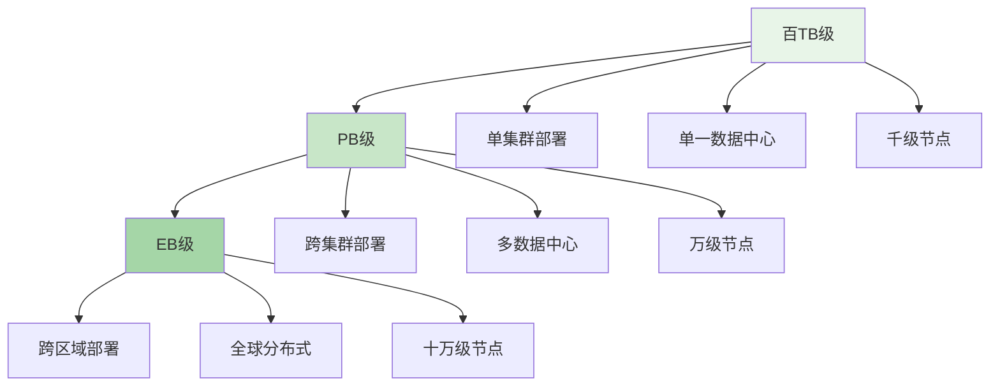
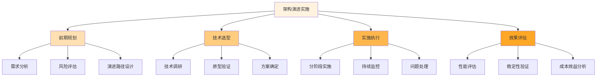

在分布式文件存储系统的生命周期中，规模扩展是一个不可避免的挑战。从最初的百TB级小规模集群，到支撑企业级EB级数据存储的超大规模平台，架构的平滑演进不仅是技术能力的体现，更是平台可持续发展的关键。这一演进过程需要在保持业务连续性的同时，逐步解决性能瓶颈、扩展性限制和运维复杂性等问题。

## 规模扩展的挑战与需求

随着业务的快速发展，存储系统面临的压力呈指数级增长。从百TB到PB级，再到EB级，每个数量级的跨越都伴随着架构和实现上的重大挑战。

### 数据规模增长的特征



### 架构演进的核心挑战

```yaml
# 规模扩展的核心挑战
scale_challenges:
  technical_challenges:
    - name: "元数据管理"
      description: "随着节点和数据量增加，元数据的管理复杂度急剧上升"
      impact: "影响系统性能和扩展性"
      solutions:
        - "分布式元数据服务"
        - "元数据分片和缓存策略"
        - "元数据一致性协议优化"
    
    - name: "数据分布与均衡"
      description: "大规模集群中的数据分布和负载均衡变得更加复杂"
      impact: "影响存储效率和访问性能"
      solutions:
        - "智能数据分布算法"
        - "动态负载均衡机制"
        - "热点数据识别与调度"
    
    - name: "网络通信"
      description: "节点间通信开销随规模增长而显著增加"
      impact: "影响系统整体性能和响应时间"
      solutions:
        - "分层网络架构"
        - "数据本地性优化"
        - "异步通信机制"
  
  operational_challenges:
    - name: "运维复杂性"
      description: "大规模系统的监控、故障排查和维护变得更加困难"
      impact: "增加运维成本和风险"
      solutions:
        - "自动化运维工具链"
        - "智能监控和告警系统"
        - "故障自愈机制"
    
    - name: "升级与维护"
      description: "大规模系统的平滑升级和维护需要更精细的策略"
      impact: "影响业务连续性和系统可用性"
      solutions:
        - "滚动升级机制"
        - "灰度发布策略"
        - "兼容性设计"
```

## 架构演进路径设计

成功的架构演进需要遵循渐进式、可回滚、业务无感知的原则，确保在扩展过程中不影响现有业务。

### 演进阶段划分

```python
class ScaleEvolutionPath:
    def __init__(self):
        self.stages = [
            ScaleStage(
                name="small_scale",
                size_range="0-100TB",
                node_count="10-100",
                characteristics=[
                    "单集群部署",
                    "单一数据中心",
                    "传统网络架构"
                ],
                architecture=[
                    "集中式元数据管理",
                    "简单数据分布策略",
                    "基础监控系统"
                ]
            ),
            ScaleStage(
                name="medium_scale",
                size_range="100TB-10PB",
                node_count="100-1000",
                characteristics=[
                    "跨机架部署",
                    "多机房容灾",
                    "分层网络架构"
                ],
                architecture=[
                    "分布式元数据服务",
                    "智能数据分布算法",
                    "增强监控和告警"
                ]
            ),
            ScaleStage(
                name="large_scale",
                size_range="10PB-100PB",
                node_count="1000-10000",
                characteristics=[
                    "跨机房部署",
                    "多活架构",
                    "智能运维"
                ],
                architecture=[
                    "元数据分片和缓存",
                    "动态负载均衡",
                    "自动化运维平台"
                ]
            ),
            ScaleStage(
                name="enterprise_scale",
                size_range="100PB-1EB",
                node_count="10000-100000",
                characteristics=[
                    "跨区域部署",
                    "全球分布式",
                    "AI驱动运维"
                ],
                architecture=[
                    "多级元数据架构",
                    "自适应数据分布",
                    "智能预测和优化"
                ]
            )
        ]
```

### 关键演进策略

```go
type EvolutionStrategy struct {
    Name        string
    Description string
    Principles  []string
    Techniques  []string
    Benefits    []string
}

var scaleEvolutionStrategies = []EvolutionStrategy{
    {
        Name:        "渐进式扩展",
        Description: "通过小步快跑的方式逐步扩展系统能力",
        Principles: []string{
            "保持业务连续性",
            "可回滚的设计",
            "分阶段验证",
        },
        Techniques: []string{
            "蓝绿部署",
            "金丝雀发布",
            "A/B测试",
        },
        Benefits: []string{
            "降低风险",
            "快速验证",
            "持续优化",
        },
    },
    {
        Name:        "架构解耦",
        Description: "通过服务化和模块化解耦降低系统复杂性",
        Principles: []string{
            "单一职责原则",
            "松耦合设计",
            "接口标准化",
        },
        Techniques: []string{
            "微服务架构",
            "事件驱动设计",
            "API网关",
        },
        Benefits: []string{
            "独立扩展",
            "易于维护",
            "技术栈灵活",
        },
    },
    {
        Name:        "自动化运维",
        Description: "通过自动化减少人工干预，提高运维效率",
        Principles: []string{
            "基础设施即代码",
            "声明式配置",
            "自我修复",
        },
        Techniques: []string{
            "容器化部署",
            "配置管理",
            "智能监控",
        },
        Benefits: []string{
            "降低运维成本",
            "提高系统稳定性",
            "快速响应故障",
        },
    },
}
```

## 核心技术实现

在架构演进过程中，需要采用一系列核心技术来支撑系统的扩展性和稳定性。

### 分布式元数据管理

```typescript
interface DistributedMetadataService {
    // 元数据分片管理
    shardMetadata(key: string, data: Metadata): Promise<ShardInfo>;
    
    // 元数据一致性保证
    ensureConsistency(shardId: string): Promise<boolean>;
    
    // 元数据缓存策略
    cacheMetadata(key: string, data: Metadata, ttl: number): Promise<void>;
    
    // 元数据查询优化
    queryMetadata(query: MetadataQuery): Promise<Metadata[]>;
}

class ScalableMetadataService implements DistributedMetadataService {
    private shardManager: ShardManager;
    private consistencyProtocol: ConsistencyProtocol;
    private cacheLayer: CacheLayer;
    
    async shardMetadata(key: string, data: Metadata): Promise<ShardInfo> {
        // 根据key计算分片位置
        const shardId = this.calculateShard(key);
        
        // 将元数据存储到对应分片
        await this.shardManager.store(shardId, key, data);
        
        // 更新分片元信息
        const shardInfo = await this.shardManager.getShardInfo(shardId);
        return shardInfo;
    }
    
    async ensureConsistency(shardId: string): Promise<boolean> {
        // 使用一致性协议保证分片数据一致性
        return await this.consistencyProtocol.ensureConsistency(shardId);
    }
    
    async cacheMetadata(key: string, data: Metadata, ttl: number): Promise<void> {
        // 将热点元数据缓存到多级缓存中
        await this.cacheLayer.set(key, data, ttl);
    }
    
    async queryMetadata(query: MetadataQuery): Promise<Metadata[]> {
        // 优化查询路径，利用索引和缓存
        if (this.cacheLayer.has(query.key)) {
            return [await this.cacheLayer.get(query.key)];
        }
        
        // 分布式查询
        const shardIds = this.shardManager.locateShards(query.conditions);
        const results = await Promise.all(
            shardIds.map(shardId => this.shardManager.query(shardId, query))
        );
        
        return results.flat();
    }
}
```

### 智能数据分布算法

```javascript
class IntelligentDataDistribution {
    constructor(config) {
        this.config = config;
        this.distributionStrategy = new AdaptiveDistributionStrategy();
        this.loadBalancer = new DynamicLoadBalancer();
    }
    
    /**
     * 智能数据分布算法
     * @param {Object} dataObject - 数据对象
     * @param {Object} clusterState - 集群状态信息
     * @returns {string} 目标存储节点
     */
    distributeData(dataObject, clusterState) {
        // 1. 分析数据特征
        const dataProfile = this.analyzeDataCharacteristics(dataObject);
        
        // 2. 评估集群状态
        const nodeScores = this.evaluateNodes(clusterState.nodes, dataProfile);
        
        // 3. 应用分布策略
        const targetNode = this.distributionStrategy.selectNode(
            nodeScores, 
            dataProfile, 
            clusterState
        );
        
        // 4. 负载均衡调整
        this.loadBalancer.adjustDistribution(targetNode, dataObject.size);
        
        return targetNode;
    }
    
    /**
     * 动态负载均衡
     * @param {Array} nodes - 节点列表
     * @returns {Object} 负载均衡结果
     */
    balanceLoad(nodes) {
        const loadMetrics = nodes.map(node => ({
            id: node.id,
            load: this.calculateNodeLoad(node),
            capacity: node.capacity
        }));
        
        // 识别过载和空闲节点
        const overloadedNodes = loadMetrics.filter(m => m.load > 0.8 * m.capacity);
        const underloadedNodes = loadMetrics.filter(m => m.load < 0.3 * m.capacity);
        
        // 生成迁移计划
        const migrationPlan = this.generateMigrationPlan(overloadedNodes, underloadedNodes);
        
        return {
            metrics: loadMetrics,
            plan: migrationPlan
        };
    }
}
```

## 演进实践案例

通过实际案例来展示架构演进的具体实施过程和效果。

### 案例一：从PB级到EB级的演进

```yaml
# 从PB级到EB级演进案例
evolution_case_study:
  background:
    company: "某大型互联网公司"
    initial_scale: "50PB数据，5000节点"
    target_scale: "500PB数据，50000节点"
    timeline: "18个月"
  
  challenges:
    - "元数据服务成为瓶颈"
    - "网络通信开销激增"
    - "运维复杂度大幅提升"
    - "数据分布不均导致热点"
  
  solutions:
    - phase_1:
        duration: "6个月"
        objectives:
          - "重构元数据服务架构"
          - "优化网络通信"
        actions:
          - "实施元数据分片"
          - "引入多级缓存"
          - "部署RDMA网络"
        results:
          - "元数据服务性能提升300%"
          - "网络延迟降低50%"
    
    - phase_2:
        duration: "6个月"
        objectives:
          - "实现智能数据分布"
          - "增强监控能力"
        actions:
          - "开发自适应分布算法"
          - "构建智能监控平台"
        results:
          - "数据分布均匀性提升80%"
          - "故障定位时间减少70%"
    
    - phase_3:
        duration: "6个月"
        objectives:
          - "完善自动化运维"
          - "支持全球部署"
        actions:
          - "实现全自动扩容"
          - "部署多区域架构"
        results:
          - "运维效率提升500%"
          - "成功支撑EB级规模"
  
  key_lessons:
    - "渐进式演进降低风险"
    - "自动化是扩展的关键"
    - "监控和度量不可或缺"
    - "架构设计需前瞻性强"
```

### 案例二：多区域部署实践

```python
class MultiRegionDeployment:
    def __init__(self, regions):
        self.regions = regions
        self.federation_manager = FederationManager()
        self.consistency_controller = GlobalConsistencyController()
    
    def deploy_globally(self):
        """全球部署实施"""
        # 1. 区域基础设施准备
        for region in self.regions:
            self.prepare_region_infrastructure(region)
        
        # 2. 联邦集群建立
        federation = self.federation_manager.create_federation(self.regions)
        
        # 3. 数据同步策略
        self.setup_data_synchronization(federation)
        
        # 4. 一致性保障
        self.consistency_controller.initialize(federation)
        
        return federation
    
    def handle_region_failure(self, failed_region):
        """区域故障处理"""
        # 1. 故障检测
        self.detect_region_failure(failed_region)
        
        # 2. 流量切换
        self.redirect_traffic_from_region(failed_region)
        
        # 3. 数据恢复
        self.recover_data_from_replicas(failed_region)
        
        # 4. 容量调整
        self.adjust_capacity_in_other_regions()
        
        return {
            "status": "failure_handled",
            "redirected_traffic": True,
            "data_recovered": True
        }
```

## 最佳实践总结

在实施架构演进过程中，需要遵循一系列最佳实践来确保成功。

### 设计原则

1. **可扩展性优先**：在设计初期就考虑未来的扩展需求
2. **渐进式演进**：采用小步快跑的方式，降低风险
3. **业务无感知**：确保演进过程不影响现有业务
4. **自动化驱动**：通过自动化减少人工干预，提高效率

### 实施要点



### 风险控制

1. **数据安全**：确保演进过程中数据的完整性和安全性
2. **业务连续性**：制定详细的回滚计划，确保业务不受影响
3. **性能保障**：通过充分的测试验证演进后的性能表现
4. **团队能力**：确保团队具备实施演进所需的技术能力

通过科学的架构设计和精心的实施规划，分布式文件存储系统可以从百TB级平滑演进到EB级，支撑企业业务的持续发展。这一过程不仅是技术能力的体现，更是平台工程化水平的重要标志。