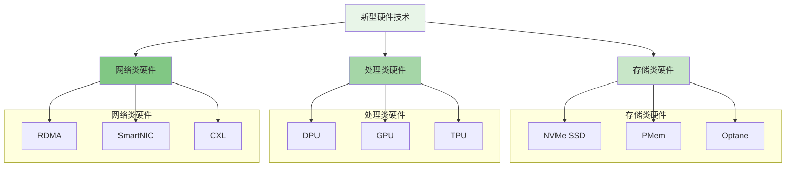
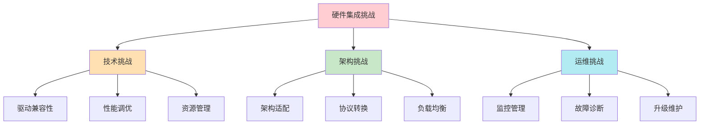

随着摩尔定律逐渐放缓，传统的CPU性能提升遇到瓶颈，新型硬件技术成为推动分布式文件存储系统性能突破的关键力量。DPU（Data Processing Unit）、NVMe（Non-Volatile Memory Express）和PMem（Persistent Memory）等新兴硬件技术正在重塑存储系统的架构和性能边界。这些技术不仅带来了前所未有的性能提升，也引入了新的设计复杂性和挑战。

## 新型硬件技术概览

新型硬件技术通过在存储层次结构的不同位置提供更高的性能和更低的延迟，为分布式文件存储系统带来了革命性的变化。

### 硬件技术分类



### 技术特性对比

```yaml
# 新型硬件技术特性对比
new_hardware_comparison:
  nvme_ssd:
    type: "存储"
    latency: "10-100μs"
    bandwidth: "3.5GB/s"
    iops: "500K-1M"
    persistence: "高"
    use_cases:
      - "高性能缓存"
      - "热数据存储"
      - "数据库加速"
  
  persistent_memory:
    type: "存储"
    latency: "250-300ns"
    bandwidth: "5-6GB/s"
    iops: "10M+"
    persistence: "高"
    use_cases:
      - "内存数据库"
      - "实时分析"
      - "缓存加速"
  
  dpu:
    type: "处理"
    cores: "8-16 ARM cores"
    network_throughput: "100Gbps"
    storage_throughput: "64GB/s"
    power_efficiency: "高"
    use_cases:
      - "网络卸载"
      - "存储加速"
      - "安全处理"
```

## DPU技术深度解析

DPU作为新一代数据中心处理器，专门用于处理数据中心基础设施任务，为CPU释放更多计算资源。

### DPU架构与功能

```python
class DPUArchitecture:
    def __init__(self):
        self.components = {
            'processing_cores': ProcessingCores(
                count=16,
                architecture='ARM',
                frequency='2.0GHz'
            ),
            'network_interface': NetworkInterface(
                speed='100Gbps',
                protocols=['RDMA', 'TCP/IP', 'RoCE'],
                offload_capabilities=['encryption', 'compression', 'packet_processing']
            ),
            'storage_interface': StorageInterface(
                protocols=['NVMe-oF', 'SCSI', 'SATA'],
                offload_capabilities=['erasure_coding', 'compression', 'encryption']
            ),
            'memory_subsystem': MemorySubsystem(
                local_memory='16GB',
                memory_type='DDR4',
                bandwidth='128GB/s'
            ),
            'acceleration_engines': AccelerationEngines([
                'crypto_engine',
                'compression_engine',
                'erasure_coding_engine',
                'regular_expression_engine'
            ])
        }
    
    def offload_storage_tasks(self, tasks):
        """卸载存储任务到DPU"""
        offloaded_tasks = []
        
        for task in tasks:
            if task.type in ['erasure_coding', 'compression', 'encryption']:
                # 将任务分配给专用加速引擎
                engine = self.get_appropriate_engine(task.type)
                result = engine.process(task)
                offloaded_tasks.append(result)
            else:
                # 其他任务由处理核心处理
                core = self.get_available_core()
                result = core.execute(task)
                offloaded_tasks.append(result)
        
        return offloaded_tasks
    
    def optimize_network_traffic(self, traffic_patterns):
        """优化网络流量"""
        # 分析流量模式
        analysis = self.analyze_traffic_patterns(traffic_patterns)
        
        # 应用网络优化策略
        optimizations = self.apply_network_optimizations(analysis)
        
        # 执行流量调度
        scheduling_result = self.schedule_network_traffic(optimizations)
        
        return scheduling_result
```

### DPU在存储系统中的应用

```go
type DPUStorageAccelerator struct {
    DPUInterface    *DPUInterface
    TaskScheduler   *TaskScheduler
    PerformanceMonitor *PerformanceMonitor
}

type StorageAccelerationTask struct {
    TaskID      string
    TaskType    string  // "erasure_coding", "compression", "encryption"
    Data        []byte
    Parameters  map[string]interface{}
    Priority    int
}

func (dsa *DPUStorageAccelerator) ProcessStorageTask(task *StorageAccelerationTask) (*ProcessingResult, error) {
    // 1. 验证任务参数
    if err := dsa.validateTask(task); err != nil {
        return nil, err
    }
    
    // 2. 任务调度
    scheduledTask, err := dsa.TaskScheduler.Schedule(task)
    if err != nil {
        return nil, err
    }
    
    // 3. 发送到DPU处理
    result, err := dsa.DPUInterface.SubmitTask(scheduledTask)
    if err != nil {
        return nil, err
    }
    
    // 4. 监控性能指标
    dsa.PerformanceMonitor.RecordTaskMetrics(task, result)
    
    // 5. 返回处理结果
    return result, nil
}

func (dsa *DPUStorageAccelerator) enableErasureCodingAcceleration() error {
    // 1. 配置DPU上的纠删码引擎
    if err := dsa.DPUInterface.ConfigureErasureCodingEngine(); err != nil {
        return err
    }
    
    // 2. 设置任务路由规则
    dsa.TaskScheduler.SetRoutingRule("erasure_coding", "dpu_acceleration")
    
    // 3. 启动性能监控
    dsa.PerformanceMonitor.EnableErasureCodingMetrics()
    
    return nil
}
```

## NVMe技术革新

NVMe作为新一代存储接口协议，通过减少协议开销和优化命令队列，显著提升了存储设备的性能。

### NVMe技术优势

```typescript
interface NVMeStorageInterface {
    // 高并发I/O处理
    submitIOCommands(commands: IOCommand[]): Promise<IOCompletion[]>;
    
    // 低延迟访问
    readData(address: number, length: number): Promise<Buffer>;
    
    // 高带宽传输
    writeData(address: number, data: Buffer): Promise<void>;
    
    // 高效队列管理
    manageSubmissionQueues(queueCount: number, depth: number): Promise<void>;
}

class NVMeController implements NVMeStorageInterface {
    private submissionQueues: SubmissionQueue[];
    private completionQueues: CompletionQueue[];
    private adminQueue: AdminQueue;
    
    async submitIOCommands(commands: IOCommand[]): Promise<IOCompletion[]> {
        // 1. 批量提交命令到提交队列
        const queue = this.getAvailableSubmissionQueue();
        const commandIds = await queue.submitBatch(commands);
        
        // 2. 等待完成队列通知
        const completions = await this.waitForCompletions(commandIds);
        
        // 3. 处理完成结果
        return this.processCompletions(completions);
    }
    
    async readData(address: number, length: number): Promise<Buffer> {
        // 1. 创建读取命令
        const readCommand = new IOCommand({
            opcode: 'READ',
            address: address,
            length: length,
            flags: {
                priority: 'HIGH',
                streaming: true
            }
        });
        
        // 2. 提交命令并等待完成
        const completion = await this.submitIOCommands([readCommand]);
        
        // 3. 返回读取数据
        return completion[0].data;
    }
    
    async manageSubmissionQueues(queueCount: number, depth: number): Promise<void> {
        // 1. 创建提交队列
        for (let i = 0; i < queueCount; i++) {
            const queue = new SubmissionQueue({
                id: i,
                depth: depth,
                priority: this.calculateQueuePriority(i)
            });
            this.submissionQueues.push(queue);
        }
        
        // 2. 配置队列参数
        await this.configureQueueParameters();
        
        // 3. 启动队列处理
        this.startQueueProcessing();
    }
}
```

### NVMe over Fabrics

```javascript
class NVMeOverFabrics {
    constructor(config) {
        this.config = config;
        this.transportLayer = this.initializeTransportLayer(config.transport);
        this.discoveryService = new DiscoveryService();
        this.connectionManager = new ConnectionManager();
    }
    
    /**
     * 初始化传输层
     * @param {string} transport - 传输类型 (RDMA, TCP, FC)
     * @returns {Object} 传输层实例
     */
    initializeTransportLayer(transport) {
        switch (transport) {
            case 'rdma':
                return new RDMATransport({
                    provider: this.config.rdma.provider,
                    device: this.config.rdma.device
                });
            case 'tcp':
                return new TCPTransport({
                    port: this.config.tcp.port,
                    tls: this.config.tcp.tls
                });
            case 'fc':
                return new FCTransport({
                    fabric: this.config.fc.fabric
                });
            default:
                throw new Error(`Unsupported transport: ${transport}`);
        }
    }
    
    /**
     * 发现远程NVMe存储
     * @returns {Promise<Array>} 存储设备列表
     */
    async discoverRemoteStorage() {
        // 1. 发送发现请求
        const discoveryRequest = this.createDiscoveryRequest();
        const responses = await this.transportLayer.sendDiscovery(discoveryRequest);
        
        // 2. 解析发现响应
        const storageDevices = this.parseDiscoveryResponses(responses);
        
        // 3. 更新本地设备列表
        this.updateLocalDeviceList(storageDevices);
        
        return storageDevices;
    }
    
    /**
     * 建立NVMe连接
     * @param {Object} device - 存储设备信息
     * @returns {Promise<Object>} 连接对象
     */
    async connectToDevice(device) {
        try {
            // 1. 建立传输层连接
            const transportConnection = await this.transportLayer.connect(device.address);
            
            // 2. 初始化NVMe协议
            const nvmeConnection = await this.initializeNVMeProtocol(transportConnection);
            
            // 3. 配置连接参数
            await this.configureConnection(nvmeConnection, device);
            
            // 4. 注册连接管理
            this.connectionManager.registerConnection(nvmeConnection);
            
            return nvmeConnection;
        } catch (error) {
            console.error('Failed to connect to NVMe device:', error);
            throw error;
        }
    }
}
```

## 持久化内存技术

PMem作为介于DRAM和SSD之间的新型存储介质，提供了内存级别的访问速度和持久化的数据保护。

### PMem架构特性

```yaml
# PMem架构特性
persistent_memory_characteristics:
  performance:
    latency: "250-300ns"
    bandwidth: "5-6GB/s"
    concurrency: "高"
  
  persistence:
    data_persistence: "断电保护"
    byte_addressable: "是"
    durability: "高"
  
  programming_models:
    - name: "应用直接访问 (AD)"
      description: "应用程序直接访问PMem，像使用内存一样"
      advantages:
        - "最低延迟"
        - "最高性能"
      disadvantages:
        - "编程复杂"
        - "需要特殊处理"
    
    - name: "块设备模拟 (BLK)"
      description: "将PMem作为块设备使用，兼容传统存储接口"
      advantages:
        - "编程简单"
        - "兼容性好"
      disadvantages:
        - "性能较低"
        - "延迟较高"
```

### PMem编程模型

```python
class PersistentMemoryManager:
    def __init__(self, config):
        self.config = config
        self.pmem_pool = self.initialize_pmem_pool(config.pool_size)
        self.allocation_tracker = AllocationTracker()
        self.consistency_manager = ConsistencyManager()
    
    def initialize_pmem_pool(self, size):
        """初始化PMem池"""
        # 1. 映射PMem设备到内存空间
        pmem_addr = self.map_pmem_device(size)
        
        # 2. 初始化内存池管理器
        pool = PersistentMemoryPool(
            base_address=pmem_addr,
            size=size,
            block_size=self.config.block_size
        )
        
        # 3. 初始化元数据结构
        pool.initialize_metadata()
        
        return pool
    
    def allocate_persistent_object(self, size, alignment=64):
        """分配持久化对象"""
        # 1. 在PMem池中分配空间
        block = self.pmem_pool.allocate(size, alignment)
        
        # 2. 记录分配信息
        self.allocation_tracker.record_allocation(block)
        
        # 3. 初始化对象头
        self.initialize_object_header(block)
        
        # 4. 返回持久化指针
        return PersistentPointer(block.address)
    
    def ensure_consistency(self, operation):
        """确保操作一致性"""
        # 1. 开始事务
        transaction = self.consistency_manager.begin_transaction()
        
        try:
            # 2. 执行操作
            result = operation()
            
            # 3. 提交事务
            self.consistency_manager.commit_transaction(transaction)
            
            return result
        except Exception as e:
            # 4. 回滚事务
            self.consistency_manager.rollback_transaction(transaction)
            raise e
```

### PMem在存储系统中的应用

```go
type PMemStorageEngine struct {
    MemoryManager    *PersistentMemoryManager
    CacheManager     *CacheManager
    LogManager       *PersistentLogManager
    SnapshotManager  *SnapshotManager
}

type PersistentDataStructure struct {
    Header    PersistentHeader
    Data      []byte
    Metadata  map[string]interface{}
    Timestamp time.Time
}

func (pse *PMemStorageEngine) StoreData(key string, data []byte) error {
    // 1. 创建持久化数据结构
    pData := &PersistentDataStructure{
        Header: PersistentHeader{
            Magic:    0x12345678,
            Version:  1,
            Checksum: calculateChecksum(data),
        },
        Data:      data,
        Metadata:  make(map[string]interface{}),
        Timestamp: time.Now(),
    }
    
    // 2. 分配持久化内存
    pPtr, err := pse.MemoryManager.AllocatePersistentObject(len(data))
    if err != nil {
        return err
    }
    
    // 3. 写入数据到PMem
    if err := pse.MemoryManager.WriteToPersistentMemory(pPtr, pData); err != nil {
        return err
    }
    
    // 4. 更新索引
    if err := pse.updateIndex(key, pPtr); err != nil {
        return err
    }
    
    // 5. 记录操作日志
    pse.LogManager.RecordOperation(&LogEntry{
        Operation: "STORE",
        Key:       key,
        Address:   pPtr.Address,
        Timestamp: time.Now(),
    })
    
    return nil
}

func (pse *PMemStorageEngine) RetrieveData(key string) ([]byte, error) {
    // 1. 查找数据地址
    pPtr, err := pse.lookupIndex(key)
    if err != nil {
        return nil, err
    }
    
    // 2. 从PMem读取数据
    pData, err := pse.MemoryManager.ReadFromPersistentMemory(pPtr)
    if err != nil {
        return nil, err
    }
    
    // 3. 验证数据完整性
    if !pse.verifyDataIntegrity(pData) {
        return nil, fmt.Errorf("data integrity check failed")
    }
    
    // 4. 更新访问统计
    pse.CacheManager.UpdateAccessStats(key)
    
    return pData.Data, nil
}
```

## 硬件集成挑战与解决方案

新型硬件技术的集成带来了诸多挑战，需要在架构设计、系统优化和运维管理等方面进行综合考虑。

### 集成挑战分析



### 解决方案框架

```typescript
interface HardwareIntegrationFramework {
    // 硬件抽象层
    createHardwareAbstractionLayer(): Promise<HardwareAbstraction>;
    
    // 驱动管理
    manageHardwareDrivers(drivers: HardwareDriver[]): Promise<DriverManagementResult>;
    
    // 性能优化
    optimizeHardwarePerformance(metrics: HardwareMetrics): Promise<OptimizationPlan>;
    
    // 故障处理
    handleHardwareFailure(failure: HardwareFailure): Promise<RecoveryAction>;
}

class ComprehensiveHardwareIntegration implements HardwareIntegrationFramework {
    private hardwareManager: HardwareManager;
    private performanceOptimizer: PerformanceOptimizer;
    private failureHandler: FailureHandler;
    
    async createHardwareAbstractionLayer(): Promise<HardwareAbstraction> {
        // 1. 扫描系统硬件
        const hardwareInventory = await this.hardwareManager.scanHardware();
        
        // 2. 创建抽象层
        const abstractionLayer = new HardwareAbstraction({
            storageDevices: this.createStorageAbstraction(hardwareInventory.storage),
            networkDevices: this.createNetworkAbstraction(hardwareInventory.network),
            processingUnits: this.createProcessingAbstraction(hardwareInventory.processing)
        });
        
        // 3. 初始化抽象层
        await abstractionLayer.initialize();
        
        return abstractionLayer;
    }
    
    async optimizeHardwarePerformance(metrics: HardwareMetrics): Promise<OptimizationPlan> {
        // 1. 分析硬件性能指标
        const analysis = this.performanceOptimizer.analyzeMetrics(metrics);
        
        // 2. 识别性能瓶颈
        const bottlenecks = this.performanceOptimizer.identifyBottlenecks(analysis);
        
        // 3. 生成优化建议
        const recommendations = await this.performanceOptimizer.generateRecommendations(
            bottlenecks,
            hardwareInventory
        );
        
        // 4. 制定优化计划
        const optimizationPlan = this.createOptimizationPlan(recommendations);
        
        // 5. 执行优化
        await this.executeOptimization(optimizationPlan);
        
        return optimizationPlan;
    }
    
    private createStorageAbstraction(storageDevices: StorageDevice[]): StorageAbstraction {
        const abstraction = new StorageAbstraction();
        
        for (const device of storageDevices) {
            switch (device.type) {
                case 'NVMe':
                    abstraction.addDevice(new NVMeDeviceAdapter(device));
                    break;
                case 'PMem':
                    abstraction.addDevice(new PMemDeviceAdapter(device));
                    break;
                case 'DPU':
                    abstraction.addDevice(new DPUDeviceAdapter(device));
                    break;
                default:
                    abstraction.addDevice(new GenericStorageDevice(device));
            }
        }
        
        return abstraction;
    }
}
```

## 性能优化实践

通过合理的硬件配置和软件优化，可以充分发挥新型硬件的性能优势。

### 性能调优策略

```python
class HardwarePerformanceOptimizer:
    def __init__(self, config):
        self.config = config
        self.tuning_strategies = {
            'nvme': self.optimize_nvme_performance,
            'pmem': self.optimize_pmem_performance,
            'dpu': self.optimize_dpu_performance
        }
    
    def optimize_nvme_performance(self, nvme_devices):
        """优化NVMe性能"""
        optimizations = []
        
        for device in nvme_devices:
            # 1. 调整队列深度
            if device.queue_depth < 1024:
                optimizations.append({
                    'device': device.id,
                    'optimization': 'increase_queue_depth',
                    'value': 1024
                })
            
            # 2. 启用多路径I/O
            if not device.multipath_enabled:
                optimizations.append({
                    'device': device.id,
                    'optimization': 'enable_multipath',
                    'value': True
                })
            
            # 3. 优化中断处理
            optimizations.append({
                'device': device.id,
                'optimization': 'tune_interrupts',
                'value': {
                    'coalescing': 'adaptive',
                    'affinity': 'cpu_local'
                }
            })
        
        return optimizations
    
    def optimize_pmem_performance(self, pmem_devices):
        """优化PMem性能"""
        optimizations = []
        
        for device in pmem_devices:
            # 1. 调整内存页面策略
            optimizations.append({
                'device': device.id,
                'optimization': 'set_page_policy',
                'value': 'bind'
            })
            
            # 2. 启用大页内存
            optimizations.append({
                'device': device.id,
                'optimization': 'enable_huge_pages',
                'value': True
            })
            
            # 3. 优化NUMA绑定
            optimizations.append({
                'device': device.id,
                'optimization': 'numa_binding',
                'value': self.calculate_optimal_numa_binding(device)
            })
        
        return optimizations
```

### 基准测试与验证

```javascript
class HardwareBenchmarkSuite {
    constructor(config) {
        this.config = config;
        this.testSuites = {
            'latency': new LatencyBenchmark(),
            'throughput': new ThroughputBenchmark(),
            'iops': new IOPSBenchmark(),
            'consistency': new ConsistencyBenchmark()
        };
    }
    
    /**
     * 运行硬件基准测试
     * @param {Object} hardware - 硬件配置
     * @returns {Promise<Object>} 测试结果
     */
    async runBenchmark(hardware) {
        const results = {};
        
        // 1. 并行运行各项测试
        const testPromises = Object.entries(this.testSuites).map(
            async ([testName, testSuite]) => {
                const result = await testSuite.run(hardware);
                return [testName, result];
            }
        );
        
        const testResults = await Promise.all(testPromises);
        
        // 2. 整合测试结果
        for (const [testName, result] of testResults) {
            results[testName] = result;
        }
        
        // 3. 生成综合报告
        results.summary = this.generateSummaryReport(results);
        
        return results;
    }
    
    /**
     * 生成测试摘要报告
     * @param {Object} results - 测试结果
     * @returns {Object} 摘要报告
     */
    generateSummaryReport(results) {
        return {
            overall_score: this.calculateOverallScore(results),
            performance_improvement: this.calculatePerformanceImprovement(results),
            recommendations: this.generateRecommendations(results),
            timestamp: new Date()
        };
    }
}
```

## 未来发展趋势

新型硬件技术仍在快速发展中，未来将带来更多创新和突破。

### 技术发展路线图

```yaml
# 硬件技术发展路线图
hardware_roadmap:
  near_term: # 1-2年
    - "CXL 2.0/3.0普及"
    - "DPU功能增强"
    - "PMem容量提升"
    - "NVMe 2.0标准成熟"
  
  mid_term: # 3-5年
    - "存算一体芯片"
    - "光互连技术"
    - "量子存储接口"
    - "生物存储技术"
  
  long_term: # 5-10年
    - "神经形态存储"
    - "DNA存储商业化"
    - "跨维度存储"
    - "认知存储系统"
```

通过深入理解和合理利用DPU、NVMe、PMem等新型硬件技术，分布式文件存储系统可以实现性能的显著提升和成本的有效控制。然而，这也要求我们在架构设计、系统优化和运维管理等方面不断创新，以充分发挥这些硬件技术的潜力。