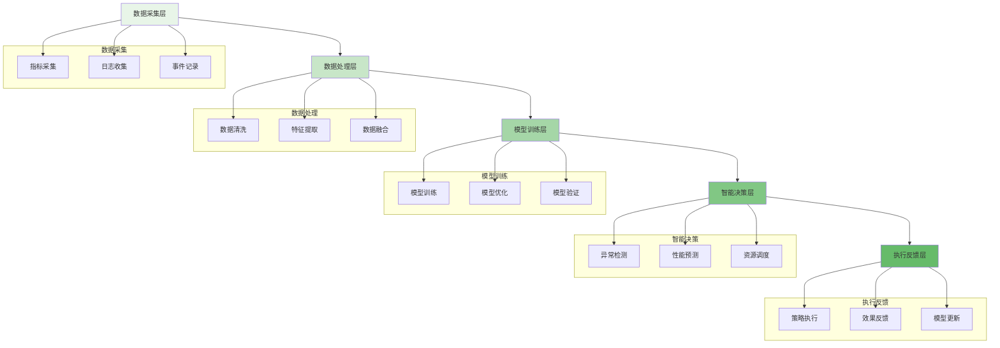

人工智能技术正在深刻改变分布式文件存储系统的运维模式和性能优化方式。通过将机器学习、深度学习和数据分析技术应用于存储系统的各个方面，AI for Storage正在实现从被动响应到主动预测的转变，显著提升了系统的可靠性、性能和资源利用效率。智能运维、性能预测和资源调度成为AI在存储领域应用的三大核心方向。

## AI在存储系统中的应用架构

AI技术在分布式文件存储系统中的应用形成了一个完整的智能化体系，涵盖了从数据采集到智能决策的全流程。

### AI应用架构层次



### AI技术栈构成

```yaml
# AI for Storage技术栈
ai_storage_stack:
  data_layer:
    technologies:
      - "Prometheus"
      - "ELK Stack"
      - "Kafka"
      - "InfluxDB"
    functions:
      - "实时指标收集"
      - "日志数据聚合"
      - "事件流处理"
      - "历史数据存储"
  
  analytics_layer:
    technologies:
      - "Spark"
      - "Flink"
      - "TensorFlow"
      - "PyTorch"
    functions:
      - "大数据分析"
      - "特征工程"
      - "模型训练"
      - "在线学习"
  
  decision_layer:
    technologies:
      - "Kubernetes"
      - "OpenPolicyAgent"
      - "Istio"
      - "Custom Controllers"
    functions:
      - "智能调度"
      - "自动修复"
      - "策略执行"
      - "资源分配"
  
  interface_layer:
    technologies:
      - "Grafana"
      - "AlertManager"
      - "Custom Dashboards"
      - "API Gateway"
    functions:
      - "可视化展示"
      - "告警通知"
      - "人机交互"
      - "系统集成"
```

## 智能运维系统

智能运维通过AI技术实现故障预测、自动修复和运维优化，显著降低人工干预需求，提升系统稳定性。

### 异常检测与故障预测

```python
class IntelligentOperationsSystem:
    def __init__(self, config):
        self.config = config
        self.anomaly_detectors = {
            'statistical': StatisticalAnomalyDetector(),
            'ml_based': MLAnomalyDetector(),
            'deep_learning': DeepLearningAnomalyDetector()
        }
        self.failure_predictors = FailurePredictor()
        self.auto_healing_engine = AutoHealingEngine()
    
    def detect_anomalies(self, metrics_data):
        """检测系统异常"""
        anomalies = []
        
        # 1. 统计方法检测
        statistical_anomalies = self.anomaly_detectors['statistical'].detect(metrics_data)
        anomalies.extend(statistical_anomalies)
        
        # 2. 机器学习方法检测
        ml_anomalies = self.anomaly_detectors['ml_based'].detect(metrics_data)
        anomalies.extend(ml_anomalies)
        
        # 3. 深度学习方法检测
        dl_anomalies = self.anomaly_detectors['deep_learning'].detect(metrics_data)
        anomalies.extend(dl_anomalies)
        
        # 4. 异常融合与去重
        unique_anomalies = self.merge_and_deduplicate_anomalies(anomalies)
        
        # 5. 异常评分与优先级排序
        scored_anomalies = self.score_anomalies(unique_anomalies)
        prioritized_anomalies = self.prioritize_anomalies(scored_anomalies)
        
        return prioritized_anomalies
    
    def predict_failures(self, system_state):
        """预测系统故障"""
        # 1. 特征提取
        features = self.extract_failure_features(system_state)
        
        # 2. 故障概率预测
        failure_probabilities = self.failure_predictors.predict_failure_probability(features)
        
        # 3. 风险评估
        risk_assessment = self.assess_failure_risk(failure_probabilities)
        
        # 4. 预防措施建议
        preventive_actions = self.generate_preventive_actions(risk_assessment)
        
        return {
            'predictions': failure_probabilities,
            'risk_assessment': risk_assessment,
            'preventive_actions': preventive_actions
        }
```

### 自动修复与优化

```go
type AutoHealingEngine struct {
    KnowledgeBase    *HealingKnowledgeBase
    DecisionEngine   *HealingDecisionEngine
    ExecutionEngine  *HealingExecutionEngine
    LearningEngine   *HealingLearningEngine
}

type HealingAction struct {
    ActionType     string
    Target         string
    Parameters     map[string]interface{}
    Priority       int
    ExpectedImpact string
}

func (ahe *AutoHealingEngine) ExecuteAutoHealing(anomaly *DetectedAnomaly) ([]*HealingAction, error) {
    // 1. 查询知识库获取修复方案
    potentialActions := ahe.KnowledgeBase.GetHealingActions(anomaly.Type)
    
    // 2. 评估修复方案
    evaluatedActions := ahe.DecisionEngine.EvaluateActions(
        potentialActions, 
        anomaly.Severity, 
        anomaly.Impact,
    )
    
    // 3. 选择最优修复方案
    selectedActions := ahe.DecisionEngine.SelectOptimalActions(evaluatedActions)
    
    // 4. 执行修复动作
    executionResults := make([]*HealingAction, 0)
    for _, action := range selectedActions {
        result, err := ahe.ExecutionEngine.ExecuteAction(action)
        if err != nil {
            // 记录执行失败
            ahe.LearningEngine.RecordFailure(action, err)
            continue
        }
        
        executionResults = append(executionResults, result)
        
        // 记录执行成功
        ahe.LearningEngine.RecordSuccess(action, result)
    }
    
    // 5. 验证修复效果
    if err := ahe.verifyHealingEffect(executionResults, anomaly); err != nil {
        return executionResults, err
    }
    
    return executionResults, nil
}

func (ahe *AutoHealingEngine) verifyHealingEffect(actions []*HealingAction, anomaly *DetectedAnomaly) error {
    // 1. 监控相关指标变化
    metricsChange := ahe.monitorMetricsChange(actions, anomaly)
    
    // 2. 验证异常是否消除
    if !ahe.checkAnomalyResolved(anomaly, metricsChange) {
        return fmt.Errorf("anomaly not resolved after healing actions")
    }
    
    // 3. 评估系统稳定性
    stability := ahe.assessSystemStability(actions)
    if !stability.Stable {
        return fmt.Errorf("system instability detected after healing: %s", stability.Reason)
    }
    
    return nil
}
```

## 性能预测与优化

通过机器学习模型对存储系统性能进行预测，可以提前发现性能瓶颈并采取优化措施。

### 性能预测模型

```typescript
interface PerformancePredictor {
    // 性能指标预测
    predictMetrics(workload: WorkloadProfile, timeHorizon: number): Promise<PredictedMetrics>;
    
    // 容量需求预测
    predictCapacity(trendData: CapacityTrend): Promise<CapacityPrediction>;
    
    // 性能瓶颈识别
    identifyBottlenecks(systemState: SystemState): Promise<BottleneckAnalysis>;
    
    // 优化建议生成
    generateOptimizationSuggestions(analysis: PerformanceAnalysis): Promise<OptimizationSuggestion[]>;
}

class MLPerformancePredictor implements PerformancePredictor {
    private timeSeriesModel: TimeSeriesModel;
    private regressionModel: RegressionModel;
    private clusteringModel: ClusteringModel;
    
    async predictMetrics(workload: WorkloadProfile, timeHorizon: number): Promise<PredictedMetrics> {
        // 1. 分析工作负载特征
        const workloadFeatures = this.extractWorkloadFeatures(workload);
        
        // 2. 时间序列预测
        const timeSeriesPrediction = await this.timeSeriesModel.predict(
            workloadFeatures, 
            timeHorizon
        );
        
        // 3. 回归分析预测
        const regressionPrediction = await this.regressionModel.predict(
            workloadFeatures
        );
        
        // 4. 融合预测结果
        const fusedPrediction = this.fusePredictions(
            timeSeriesPrediction, 
            regressionPrediction
        );
        
        // 5. 置信度评估
        const confidence = this.assessPredictionConfidence(fusedPrediction);
        
        return {
            metrics: fusedPrediction,
            confidence: confidence,
            timeHorizon: timeHorizon
        };
    }
    
    async identifyBottlenecks(systemState: SystemState): Promise<BottleneckAnalysis> {
        // 1. 收集系统状态数据
        const stateData = this.collectSystemStateData(systemState);
        
        // 2. 特征工程
        const features = this.engineerBottleneckFeatures(stateData);
        
        // 3. 聚类分析识别瓶颈模式
        const clusters = await this.clusteringModel.cluster(features);
        
        // 4. 瓶颈根因分析
        const rootCauses = this.analyzeRootCauses(clusters, stateData);
        
        // 5. 影响评估
        const impactAssessment = this.assessBottleneckImpact(rootCauses);
        
        return {
            clusters: clusters,
            rootCauses: rootCauses,
            impact: impactAssessment
        };
    }
}
```

### 性能优化引擎

```javascript
class PerformanceOptimizationEngine {
    constructor(config) {
        this.config = config;
        this.optimizationStrategies = new Map();
        this.performanceMonitor = new PerformanceMonitor();
        this.mlOptimizer = new MLOptimizer();
    }
    
    /**
     * 实时性能优化
     * @param {Object} currentMetrics - 当前性能指标
     * @returns {Promise<Object>} 优化结果
     */
    async optimizePerformance(currentMetrics) {
        try {
            // 1. 分析当前性能状态
            const performanceAnalysis = this.analyzePerformance(currentMetrics);
            
            // 2. 识别优化机会
            const optimizationOpportunities = this.identifyOptimizationOpportunities(
                performanceAnalysis
            );
            
            // 3. 选择优化策略
            const selectedStrategies = this.selectOptimizationStrategies(
                optimizationOpportunities
            );
            
            // 4. 执行优化
            const optimizationResults = await this.executeOptimizations(
                selectedStrategies
            );
            
            // 5. 验证优化效果
            const validationResults = await this.validateOptimizations(
                optimizationResults,
                currentMetrics
            );
            
            // 6. 学习优化经验
            this.learnFromOptimization(validationResults);
            
            return {
                analysis: performanceAnalysis,
                opportunities: optimizationOpportunities,
                strategies: selectedStrategies,
                results: optimizationResults,
                validation: validationResults
            };
        } catch (error) {
            console.error('Performance optimization failed:', error);
            return { success: false, error: error.message };
        }
    }
    
    /**
     * 机器学习驱动的参数调优
     * @param {Object} systemConfig - 系统配置
     * @param {Array} metricsHistory - 历史指标数据
     * @returns {Promise<Object>} 调优建议
     */
    async tuneSystemParameters(systemConfig, metricsHistory) {
        // 1. 构建参数-性能映射模型
        const paramPerformanceModel = await this.mlOptimizer.buildParamPerformanceModel(
            systemConfig,
            metricsHistory
        );
        
        // 2. 寻找最优参数组合
        const optimalParams = await this.mlOptimizer.findOptimalParameters(
            paramPerformanceModel
        );
        
        // 3. 评估调优风险
        const riskAssessment = this.assessTuningRisk(optimalParams, systemConfig);
        
        // 4. 生成调优计划
        const tuningPlan = this.generateTuningPlan(optimalParams, riskAssessment);
        
        return {
            model: paramPerformanceModel,
            optimal: optimalParams,
            risk: riskAssessment,
            plan: tuningPlan
        };
    }
}
```

## 智能资源调度

AI技术可以实现存储资源的智能调度，根据工作负载特征和系统状态动态分配资源。

### 资源需求预测

```yaml
# 资源需求预测模型
resource_prediction_model:
  input_features:
    - "历史资源使用率"
    - "工作负载模式"
    - "业务流量趋势"
    - "季节性因素"
    - "突发事件历史"
  
  prediction_targets:
    - "CPU需求预测"
    - "内存需求预测"
    - "存储容量预测"
    - "网络带宽预测"
    - "IOPS需求预测"
  
  model_architecture:
    - name: "LSTM网络"
      purpose: "时间序列预测"
      advantages:
        - "捕捉时间依赖性"
        - "处理序列数据"
        - "长期依赖建模"
    
    - name: "随机森林"
      purpose: "特征重要性分析"
      advantages:
        - "处理混合数据类型"
        - "特征选择"
        - "抗过拟合"
    
    - name: "集成学习"
      purpose: "多模型融合"
      advantages:
        - "提高预测准确性"
        - "降低单一模型风险"
        - "增强鲁棒性"
```

### 智能调度算法

```python
class IntelligentResourceScheduler:
    def __init__(self, config):
        self.config = config
        self.resource_pools = {}
        self.prediction_engine = ResourcePredictionEngine()
        self.scheduling_algorithms = {
            'bin_packing': BinPackingScheduler(),
            'load_balancing': LoadBalancingScheduler(),
            'priority_based': PriorityBasedScheduler()
        }
        self.ml_scheduler = MLScheduler()
    
    def schedule_resources(self, workload_requests):
        """智能资源调度"""
        # 1. 预测资源需求
        demand_forecast = self.prediction_engine.predict_demand(workload_requests)
        
        # 2. 评估资源可用性
        resource_availability = self.assess_resource_availability()
        
        # 3. 选择调度算法
        scheduler = self.select_scheduler(workload_requests, demand_forecast)
        
        # 4. 执行资源调度
        allocation_plan = scheduler.schedule(
            workload_requests, 
            resource_availability, 
            demand_forecast
        )
        
        # 5. 机器学习优化
        optimized_plan = self.ml_scheduler.optimize_allocation(allocation_plan)
        
        # 6. 执行资源分配
        self.execute_allocation(optimized_plan)
        
        return optimized_plan
    
    def select_scheduler(self, workloads, forecast):
        """根据工作负载特征选择调度算法"""
        # 分析工作负载特征
        workload_characteristics = self.analyze_workload_characteristics(workloads)
        
        # 根据特征选择合适的调度器
        if workload_characteristics.is_batch_processing:
            return self.scheduling_algorithms['bin_packing']
        elif workload_characteristics.is_real_time:
            return self.scheduling_algorithms['priority_based']
        else:
            return self.scheduling_algorithms['load_balancing']
```

### 动态资源调整

```go
type DynamicResourceManager struct {
    ResourceMonitor   *ResourceMonitor
    ScalingEngine     *AutoScalingEngine
    MigrationEngine   *LiveMigrationEngine
    CostOptimizer     *CostOptimizationEngine
}

type ResourceAdjustment struct {
    ResourceType    string
    Action          string  // scale_up, scale_down, migrate
    Target          string
    AdjustmentValue interface{}
    Priority        int
    CostImpact      float64
}

func (drm *DynamicResourceManager) AdjustResources(systemMetrics *SystemMetrics) ([]*ResourceAdjustment, error) {
    // 1. 分析系统资源使用情况
    resourceAnalysis := drm.ResourceMonitor.AnalyzeUsage(systemMetrics)
    
    // 2. 识别资源调整需求
    adjustmentNeeds := drm.identifyAdjustmentNeeds(resourceAnalysis)
    
    // 3. 评估调整影响
    impactAssessment := drm.assessAdjustmentImpact(adjustmentNeeds)
    
    // 4. 优化调整方案
    optimizedAdjustments := drm.optimizeAdjustments(impactAssessment)
    
    // 5. 执行资源调整
    executedAdjustments := make([]*ResourceAdjustment, 0)
    for _, adjustment := range optimizedAdjustments {
        if err := drm.executeAdjustment(adjustment); err != nil {
            // 记录执行失败
            log.Printf("Failed to execute adjustment: %v, error: %v", adjustment, err)
            continue
        }
        executedAdjustments = append(executedAdjustments, adjustment)
    }
    
    // 6. 验证调整效果
    drm.verifyAdjustmentEffect(executedAdjustments, systemMetrics)
    
    return executedAdjustments, nil
}

func (drm *DynamicResourceManager) optimizeAdjustments(assessments []*ImpactAssessment) []*ResourceAdjustment {
    // 1. 多目标优化
    optimizer := NewMultiObjectiveOptimizer()
    
    // 2. 定义优化目标
    objectives := []OptimizationObjective{
        {Name: "performance", Weight: 0.4},
        {Name: "cost", Weight: 0.3},
        {Name: "reliability", Weight: 0.3},
    }
    
    // 3. 约束条件
    constraints := []OptimizationConstraint{
        {Type: "budget", Limit: drm.config.BudgetLimit},
        {Type: "performance", Min: drm.config.MinPerformance},
        {Type: "availability", Min: 0.999},
    }
    
    // 4. 执行优化
    optimizedPlan := optimizer.Optimize(assessments, objectives, constraints)
    
    return optimizedPlan.Adjustments
}
```

## AI模型训练与管理

构建和维护高质量的AI模型是实现智能存储系统的关键。

### 模型训练流程

```typescript
interface ModelTrainingPipeline {
    // 数据准备
    prepareTrainingData(dataSource: DataSource): Promise<TrainingData>;
    
    // 特征工程
    engineerFeatures(rawData: RawData): Promise<FeatureSet>;
    
    // 模型训练
    trainModel(features: FeatureSet, config: TrainingConfig): Promise<TrainedModel>;
    
    // 模型验证
    validateModel(model: TrainedModel, testData: TestData): Promise<ValidationResult>;
    
    // 模型部署
    deployModel(model: TrainedModel, target: DeploymentTarget): Promise<DeploymentResult>;
}

class AIOpsModelTrainer implements ModelTrainingPipeline {
    private dataPipeline: DataPipeline;
    private featureEngineer: FeatureEngineer;
    private modelFactory: ModelFactory;
    private validationEngine: ValidationEngine;
    
    async prepareTrainingData(dataSource: DataSource): Promise<TrainingData> {
        // 1. 数据抽取
        const rawData = await this.dataPipeline.extract(dataSource);
        
        // 2. 数据清洗
        const cleanedData = await this.dataPipeline.clean(rawData);
        
        // 3. 数据转换
        const transformedData = await this.dataPipeline.transform(cleanedData);
        
        // 4. 数据标注
        const labeledData = await this.dataPipeline.label(transformedData);
        
        return labeledData;
    }
    
    async engineerFeatures(rawData: RawData): Promise<FeatureSet> {
        // 1. 特征提取
        const basicFeatures = this.featureEngineer.extractBasicFeatures(rawData);
        
        // 2. 特征构造
        const derivedFeatures = this.featureEngineer.constructFeatures(basicFeatures);
        
        // 3. 特征选择
        const selectedFeatures = this.featureEngineer.selectFeatures(derivedFeatures);
        
        // 4. 特征缩放
        const scaledFeatures = this.featureEngineer.scaleFeatures(selectedFeatures);
        
        return scaledFeatures;
    }
    
    async trainModel(features: FeatureSet, config: TrainingConfig): Promise<TrainedModel> {
        // 1. 选择模型架构
        const model = this.modelFactory.createModel(config.architecture);
        
        // 2. 模型训练
        const trainedModel = await model.train(features.trainingData, config);
        
        // 3. 超参数调优
        const optimizedModel = await this.optimizeHyperparameters(trainedModel, config);
        
        return optimizedModel;
    }
}
```

### 模型监控与更新

```javascript
class ModelLifecycleManager {
    constructor(config) {
        this.config = config;
        this.modelRegistry = new ModelRegistry();
        this.performanceMonitor = new ModelPerformanceMonitor();
        this.updateScheduler = new ModelUpdateScheduler();
    }
    
    /**
     * 监控模型性能
     * @param {string} modelId - 模型ID
     * @param {Object} metrics - 性能指标
     * @returns {Promise<Object>} 监控结果
     */
    async monitorModelPerformance(modelId, metrics) {
        // 1. 记录性能指标
        await this.performanceMonitor.recordMetrics(modelId, metrics);
        
        // 2. 性能趋势分析
        const trendAnalysis = await this.performanceMonitor.analyzeTrends(modelId);
        
        // 3. 性能退化检测
        const degradation = this.detectPerformanceDegradation(trendAnalysis);
        
        // 4. 触发更新检查
        if (degradation.needUpdate) {
            await this.triggerModelUpdate(modelId, degradation);
        }
        
        return {
            modelId: modelId,
            metrics: metrics,
            trend: trendAnalysis,
            degradation: degradation
        };
    }
    
    /**
     * 自动模型更新
     * @param {string} modelId - 模型ID
     * @param {Object} degradation - 退化信息
     * @returns {Promise<Object>} 更新结果
     */
    async triggerModelUpdate(modelId, degradation) {
        try {
            // 1. 获取最新数据
            const latestData = await this.getLatestTrainingData(modelId);
            
            // 2. 重新训练模型
            const updatedModel = await this.retrainModel(modelId, latestData);
            
            // 3. 模型验证
            const validation = await this.validateModel(updatedModel, latestData);
            
            // 4. A/B测试
            const abTestResult = await this.conductABTest(modelId, updatedModel);
            
            // 5. 决策是否部署
            if (abTestResult.better && validation.passed) {
                await this.deployUpdatedModel(modelId, updatedModel);
                return { success: true, model: updatedModel };
            } else {
                return { success: false, reason: 'Model update not qualified' };
            }
        } catch (error) {
            console.error('Model update failed:', error);
            return { success: false, error: error.message };
        }
    }
}
```

## 实践案例与效果评估

通过实际案例来展示AI for Storage的应用效果和价值。

### 案例一：智能故障预测与预防

```yaml
# 智能故障预测案例
failure_prediction_case:
  background:
    system: "大型分布式文件存储集群"
    nodes: "10000+"
    data_volume: "500PB"
    uptime_target: "99.99%"
  
  implementation:
    data_sources:
      - "系统指标监控数据"
      - "硬件健康日志"
      - "历史故障记录"
      - "环境传感器数据"
    
    ml_models:
      - "随机森林故障分类器"
      - "LSTM时间序列预测器"
      - "集成学习风险评估模型"
    
    deployment:
      - "实时数据流处理"
      - "每5分钟模型更新"
      - "多级告警机制"
  
  results:
    failure_prediction_accuracy: "92.5%"
    mean_time_to_failure_prediction: "4.2小时"
    false_positive_rate: "8.3%"
    maintenance_cost_reduction: "35%"
    unplanned_downtime_reduction: "68%"
```

### 案例二：性能优化与资源调度

```python
class PerformanceOptimizationCase:
    def __init__(self):
        self.system_info = {
            'nodes': 5000,
            'storage_capacity': '200PB',
            'peak_iops': '10M',
            'avg_latency': '5ms'
        }
        
        self.ai_components = {
            'predictor': MLPerformancePredictor(),
            'optimizer': PerformanceOptimizationEngine(),
            'scheduler': IntelligentResourceScheduler()
        }
    
    def implement_ai_optimization(self):
        """实施AI性能优化"""
        results = {}
        
        # 1. 性能预测
        workload_profile = self.collect_workload_data()
        predictions = self.ai_components['predictor'].predict_metrics(
            workload_profile, 
            time_horizon=24  # 24小时预测
        )
        results['predictions'] = predictions
        
        # 2. 瓶颈识别
        system_state = self.collect_system_state()
        bottlenecks = self.ai_components['predictor'].identifyBottlenecks(system_state)
        results['bottlenecks'] = bottlenecks
        
        # 3. 资源调度
        workload_requests = self.collect_workload_requests()
        resource_allocation = self.ai_components['scheduler'].schedule_resources(
            workload_requests
        )
        results['allocation'] = resource_allocation
        
        # 4. 性能优化
        current_metrics = self.collect_current_metrics()
        optimization = self.ai_components['optimizer'].optimizePerformance(
            current_metrics
        )
        results['optimization'] = optimization
        
        return results
    
    def evaluate_results(self, results):
        """评估优化效果"""
        # 对比优化前后的性能指标
        before_metrics = self.get_baseline_metrics()
        after_metrics = self.get_current_metrics()
        
        improvement = {
            'latency_improvement': (before_metrics['avg_latency'] - after_metrics['avg_latency']) / before_metrics['avg_latency'] * 100,
            'iops_improvement': (after_metrics['peak_iops'] - before_metrics['peak_iops']) / before_metrics['peak_iops'] * 100,
            'resource_utilization': (after_metrics['resource_efficiency'] - before_metrics['resource_efficiency']) * 100,
            'cost_savings': self.calculate_cost_savings(results)
        }
        
        return improvement
```

通过AI技术在分布式文件存储系统中的深度应用，我们可以实现从被动运维到主动预测的转变，显著提升系统的可靠性、性能和资源利用效率。这不仅降低了运维成本，也为业务的稳定运行提供了更强有力的保障。