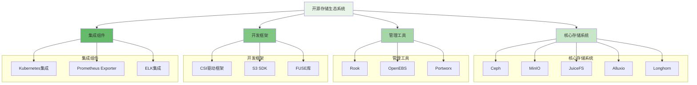
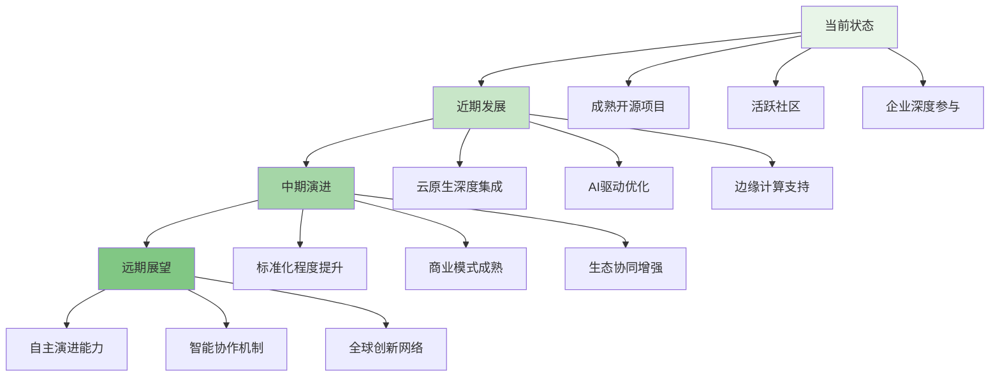

开源软件已经成为分布式文件存储系统发展的重要推动力。通过开放源代码、共享知识和协作创新，开源社区不仅加速了技术进步，还降低了技术门槛，促进了整个行业的健康发展。随着云原生、边缘计算和AI技术的快速发展，分布式文件存储领域的开源趋势也在不断演进，社区参与模式日益成熟，为技术创新和产业应用提供了强大的支撑。

## 开源存储生态系统

开源分布式文件存储系统已经形成了丰富的生态系统，涵盖了从核心存储引擎到管理工具的完整技术栈。

### 主要开源存储项目



### 项目对比分析

```yaml
# 主要开源存储项目对比
open_source_storage_comparison:
  ceph:
    type: "对象/块/文件存储"
    architecture: "分布式"
    scalability: "极佳"
    consistency: "强一致性"
    use_cases:
      - "私有云存储"
      - "超融合基础设施"
      - "大规模存储集群"
    community_size: "大型"
    release_cycle: "稳定"
  
  minio:
    type: "对象存储"
    architecture: "云原生"
    scalability: "优秀"
    consistency: "最终一致性"
    use_cases:
      - "S3兼容存储"
      - "边缘存储"
      - "备份和归档"
    community_size: "大型"
    release_cycle: "快速"
  
  juicefs:
    type: "文件存储"
    architecture: "共享存储"
    scalability: "优秀"
    consistency: "强一致性"
    use_cases:
      - "AI/ML数据集"
      - "大数据分析"
      - "协作文件共享"
    community_size: "中型"
    release_cycle: "稳定"
  
  alluxio:
    type: "数据编排"
    architecture: "缓存加速"
    scalability: "优秀"
    consistency: "最终一致性"
    use_cases:
      - "大数据加速"
      - "多云数据访问"
      - "数据湖加速"
    community_size: "中型"
    release_cycle: "稳定"
```

## 开源发展趋势

随着技术的不断发展，开源分布式存储领域呈现出新的发展趋势和特点。

### 技术演进方向

```python
class OpenSourceTrendsAnalyzer:
    def __init__(self):
        self.trends = {
            'cloud_native': CloudNativeTrend(),
            'edge_computing': EdgeComputingTrend(),
            'ai_integration': AIIntegrationTrend(),
            'security_enhancement': SecurityEnhancementTrend()
        }
    
    def analyze_current_trends(self):
        """分析当前开源趋势"""
        trend_analysis = {}
        
        for trend_name, trend_analyzer in self.trends.items():
            trend_analysis[trend_name] = trend_analyzer.analyze()
        
        return trend_analysis
    
    def predict_future_trends(self):
        """预测未来趋势"""
        predictions = {}
        
        # 基于历史数据分析
        historical_data = self.collect_historical_data()
        
        # 使用机器学习模型预测
        ml_model = TrendPredictionModel()
        predictions = ml_model.predict(historical_data)
        
        return predictions

class CloudNativeTrend:
    def analyze(self):
        return {
            'drivers': [
                '容器化部署需求',
                'Kubernetes生态成熟',
                '微服务架构普及',
                'DevOps流程优化'
            ],
            'manifestations': [
                'Operator模式普及',
                'CSI驱动标准化',
                '声明式API设计',
                'Sidecar架构应用'
            ],
            'impact': {
                'development': '提升开发效率',
                'deployment': '简化部署流程',
                'operations': '增强运维能力'
            }
        }

class EdgeComputingTrend:
    def analyze(self):
        return {
            'drivers': [
                '5G网络部署',
                'IoT设备增长',
                '低延迟应用需求',
                '数据本地化要求'
            ],
            'manifestations': [
                '轻量级存储节点',
                '边缘缓存策略',
                '断网容错机制',
                '分布式数据同步'
            ],
            'impact': {
                'performance': '降低访问延迟',
                'bandwidth': '减少网络传输',
                'reliability': '提升系统容错'
            }
        }
```

### 开源项目成熟度评估

```go
type ProjectMaturityAssessment struct {
    ProjectName     string
    Stars           int
    Contributors    int
    ReleaseFrequency float64
    IssueResolutionTime int
    DocumentationQuality float64
    CommunityActivity float64
    ProductionAdoption int
}

type MaturityScore struct {
    OverallScore    float64
    TechnicalScore  float64
    CommunityScore  float64
    AdoptionScore   float64
    MaturityLevel   string  // "Emerging", "Growing", "Mature", "Established"
}

func (pma *ProjectMaturityAssessment) CalculateMaturityScore() *MaturityScore {
    // 1. 技术成熟度评分
    technicalScore := pma.calculateTechnicalScore()
    
    // 2. 社区活跃度评分
    communityScore := pma.calculateCommunityScore()
    
    // 3. 采用度评分
    adoptionScore := pma.calculateAdoptionScore()
    
    // 4. 综合评分
    overallScore := (technicalScore*0.5 + communityScore*0.3 + adoptionScore*0.2)
    
    // 5. 确定成熟度等级
    maturityLevel := pma.determineMaturityLevel(overallScore)
    
    return &MaturityScore{
        OverallScore:   overallScore,
        TechnicalScore: technicalScore,
        CommunityScore: communityScore,
        AdoptionScore:  adoptionScore,
        MaturityLevel:  maturityLevel,
    }
}

func (pma *ProjectMaturityAssessment) calculateTechnicalScore() float64 {
    // 基于技术指标计算得分
    score := 0.0
    
    // 星标数贡献 (最高30分)
    starScore := math.Min(float64(pma.Stars)/10000.0, 1.0) * 30
    score += starScore
    
    // 贡献者数贡献 (最高25分)
    contributorScore := math.Min(float64(pma.Contributors)/100.0, 1.0) * 25
    score += contributorScore
    
    // 发布频率贡献 (最高20分)
    releaseScore := math.Min(pma.ReleaseFrequency/12.0, 1.0) * 20
    score += releaseScore
    
    // 问题解决时间贡献 (最高15分)
    resolutionScore := math.Max(0, (30-float64(pma.IssueResolutionTime))/30.0) * 15
    score += resolutionScore
    
    // 文档质量贡献 (最高10分)
    score += pma.DocumentationQuality * 10
    
    return score
}
```

## 社区参与模式

开源社区的成功离不开积极参与的开发者、用户和企业。现代开源项目的社区参与模式日趋多样化和专业化。

### 社区治理结构

```typescript
interface CommunityGovernance {
    // 治理委员会
    governanceBoard: GovernanceBoard;
    
    // 技术委员会
    technicalCommittee: TechnicalCommittee;
    
    // 工作组
    workingGroups: WorkingGroup[];
    
    // 贡献者等级
    contributorLevels: ContributorLevel[];
    
    // 决策流程
    decisionProcess: DecisionProcess;
}

class OpenSourceCommunity implements CommunityGovernance {
    private governanceBoard: GovernanceBoard;
    private technicalCommittee: TechnicalCommittee;
    private workingGroups: Map<string, WorkingGroup>;
    private contributorFramework: ContributorFramework;
    
    constructor(projectName: string) {
        this.initializeGovernanceStructure(projectName);
        this.setupWorkingGroups();
        this.establishContributionFramework();
    }
    
    private initializeGovernanceStructure(projectName: string): void {
        // 创建治理委员会
        this.governanceBoard = new GovernanceBoard({
            members: this.selectBoardMembers(),
            responsibilities: [
                '战略规划',
                '财务监督',
                '知识产权管理',
                '社区治理'
            ]
        });
        
        // 创建技术委员会
        this.technicalCommittee = new TechnicalCommittee({
            members: this.selectTechCommitteeMembers(),
            responsibilities: [
                '技术路线规划',
                '架构设计审查',
                '代码质量标准',
                '版本发布管理'
            ]
        });
    }
    
    private setupWorkingGroups(): void {
        // 根据项目需求设立工作组
        const wgConfigs = [
            { name: 'Documentation', focus: '文档维护和改进' },
            { name: 'Security', focus: '安全漏洞修复和防护' },
            { name: 'Performance', focus: '性能优化和基准测试' },
            { name: 'User Experience', focus: '用户体验改进' },
            { name: 'Community', focus: '社区建设和活动组织' }
        ];
        
        for (const config of wgConfigs) {
            const workingGroup = new WorkingGroup(config);
            this.workingGroups.set(config.name, workingGroup);
        }
    }
    
    async onboardNewContributor(contributor: Contributor): Promise<OnboardingResult> {
        try {
            // 1. 欢迎新贡献者
            await this.welcomeNewContributor(contributor);
            
            // 2. 提供入门指导
            const onboardingGuide = await this.provideOnboardingGuide(contributor);
            
            // 3. 分配导师
            const mentor = await this.assignMentor(contributor);
            
            // 4. 设置沟通渠道
            await this.setupCommunicationChannels(contributor);
            
            // 5. 跟踪进展
            const progressTracker = new ContributorProgressTracker(contributor);
            
            return {
                success: true,
                contributor: contributor,
                guide: onboardingGuide,
                mentor: mentor,
                tracker: progressTracker
            };
        } catch (error) {
            return {
                success: false,
                error: error.message
            };
        }
    }
}
```

### 贡献者激励机制

```javascript
class CommunityIncentiveSystem {
    constructor(config) {
        this.config = config;
        this.contributionTracker = new ContributionTracker();
        this.recognitionSystem = new RecognitionSystem();
        this.rewardProgram = new RewardProgram();
    }
    
    /**
     * 贡献评估与激励
     * @param {Object} contributor - 贡献者信息
     * @param {Array} contributions - 贡献记录
     * @returns {Promise<Object>} 激励结果
     */
    async evaluateAndIncentivize(contributor, contributions) {
        try {
            // 1. 评估贡献价值
            const contributionValue = await this.assessContributionValue(
                contributor, 
                contributions
            );
            
            // 2. 计算激励等级
            const incentiveLevel = this.calculateIncentiveLevel(contributionValue);
            
            // 3. 生成认可和奖励
            const recognition = await this.generateRecognition(contributor, incentiveLevel);
            const rewards = await this.distributeRewards(contributor, incentiveLevel);
            
            // 4. 记录激励历史
            await this.recordIncentiveHistory(contributor, {
                value: contributionValue,
                level: incentiveLevel,
                recognition: recognition,
                rewards: rewards
            });
            
            return {
                contributor: contributor,
                value: contributionValue,
                level: incentiveLevel,
                recognition: recognition,
                rewards: rewards
            };
        } catch (error) {
            console.error('Incentive evaluation failed:', error);
            return { success: false, error: error.message };
        }
    }
    
    /**
     * 贡献价值评估
     * @param {Object} contributor - 贡献者
     * @param {Array} contributions - 贡献列表
     * @returns {Promise<Object>} 评估结果
     */
    async assessContributionValue(contributor, contributions) {
        const assessment = {
            quantity: 0,
            quality: 0,
            impact: 0,
            sustainability: 0
        };
        
        // 1. 数量评估
        assessment.quantity = this.evaluateContributionQuantity(contributions);
        
        // 2. 质量评估
        assessment.quality = await this.evaluateContributionQuality(contributions);
        
        // 3. 影响力评估
        assessment.impact = await this.evaluateContributionImpact(contributions);
        
        // 4. 可持续性评估
        assessment.sustainability = this.evaluateContributionSustainability(
            contributor, 
            contributions
        );
        
        // 5. 综合评分
        const overallScore = (
            assessment.quantity * 0.2 +
            assessment.quality * 0.3 +
            assessment.impact * 0.4 +
            assessment.sustainability * 0.1
        );
        
        return {
            ...assessment,
            overallScore: overallScore,
            level: this.determineContributionLevel(overallScore)
        };
    }
}
```

## 企业参与模式

企业参与开源社区的方式日益多样化，从单纯的使用者转变为积极的贡献者和领导者。

### 企业参与策略

```yaml
# 企业开源参与策略
enterprise_participation_strategies:
  contribution_approach:
    code_contributions:
      - "功能开发"
      - "Bug修复"
      - "性能优化"
      - "文档完善"
    
    financial_support:
      - "基金会赞助"
      - "开发者资助"
      - "会议赞助"
      - "基础设施支持"
    
    governance_participation:
      - "技术委员会成员"
      - "董事会席位"
      - "工作组领导"
      - "标准制定参与"
  
  benefit_realization:
    direct_benefits:
      - "技术能力提升"
      - "人才吸引培养"
      - "品牌价值提升"
      - "市场影响力扩大"
    
    indirect_benefits:
      - "生态系统建设"
      - "行业标准制定"
      - "合作伙伴关系"
      - "创新机会发现"
  
  risk_management:
    ip_risks:
      - "许可证合规"
      - "专利风险"
      - "商业秘密保护"
      - "竞争信息泄露"
    
    operational_risks:
      - "资源投入控制"
      - "技术路线分歧"
      - "社区关系维护"
      - "内部协调复杂"
```

### 开源商业化模式

```python
class OpenSourceBusinessModel:
    def __init__(self, project_name):
        self.project_name = project_name
        self.business_models = {
            'support_services': SupportServicesModel(),
            'training_certification': TrainingCertificationModel(),
            'consulting': ConsultingModel(),
            'hosted_services': HostedServicesModel(),
            'enterprise_edition': EnterpriseEditionModel()
        }
    
    def evaluate_business_models(self):
        """评估商业模式可行性"""
        model_evaluation = {}
        
        for model_name, model in self.business_models.items():
            model_evaluation[model_name] = model.evaluate_feasibility()
        
        return model_evaluation
    
    def develop_monetization_strategy(self):
        """制定商业化策略"""
        # 1. 市场分析
        market_analysis = self.analyze_market()
        
        # 2. 竞争分析
        competition_analysis = self.analyze_competition()
        
        # 3. 客户需求分析
        customer_needs = self.analyze_customer_needs()
        
        # 4. 商业模式组合
        business_model_mix = self.design_business_model_mix(
            market_analysis,
            competition_analysis,
            customer_needs
        )
        
        # 5. 实施计划
        implementation_plan = self.create_implementation_plan(business_model_mix)
        
        return {
            'market_analysis': market_analysis,
            'competition_analysis': competition_analysis,
            'customer_needs': customer_needs,
            'business_model_mix': business_model_mix,
            'implementation_plan': implementation_plan
        }

class SupportServicesModel:
    def __init__(self):
        self.services = {
            'premium_support': {
                'response_time': '1小时',
                'availability': '24/7',
                'channels': ['电话', '邮件', '在线聊天'],
                'pricing_model': '按节点数订阅'
            },
            'consulting_services': {
                'services': ['架构设计', '性能优化', '迁移支持'],
                'delivery_model': '现场+远程',
                'pricing_model': '按项目收费'
            }
        }
    
    def evaluate_feasibility(self):
        return {
            'market_demand': self.assess_market_demand(),
            'competitive_advantage': self.analyze_competitive_advantage(),
            'resource_requirement': self.estimate_resource_requirement(),
            'revenue_potential': self.project_revenue_potential()
        }
```

## 社区建设实践

成功的开源社区需要系统性的建设策略和持续的投入。

### 社区运营策略

```go
type CommunityOperations struct {
    CommunicationChannels []*CommunicationChannel
    EventProgram          *EventProgram
    Documentation         *DocumentationSystem
    OnboardingProcess     *OnboardingProcess
}

type CommunicationStrategy struct {
    Channels []string
    Frequency map[string]int
    ContentTypes []string
    EngagementMetrics []string
}

func (co *CommunityOperations) ImplementCommunicationStrategy() *CommunicationStrategy {
    strategy := &CommunicationStrategy{
        Channels: []string{
            "邮件列表",
            "Slack/Discord",
            "GitHub Discussions",
            "论坛",
            "博客",
        },
        Frequency: map[string]int{
            "邮件列表": 5,      // 每周5次
            "即时通讯": 50,     // 每天50条消息
            "论坛": 10,        // 每周10个帖子
            "博客": 2,         // 每月2篇
        },
        ContentTypes: []string{
            "技术分享",
            "使用案例",
            "版本发布",
            "社区活动",
            "教程指南",
        },
        EngagementMetrics: []string{
            "活跃用户数",
            "内容互动率",
            "问题解决时间",
            "贡献者增长",
        },
    }
    
    return strategy
}

func (co *CommunityOperations) OrganizeCommunityEvents() []*CommunityEvent {
    events := []*CommunityEvent{
        {
            Name: "年度开发者大会",
            Type: "Conference",
            Frequency: "Annual",
            Participants: "500-1000",
            Goals: []string{
                "技术分享",
                "社区建设",
                "项目规划",
                "合作伙伴交流",
            },
        },
        {
            Name: "月度技术分享会",
            Type: "Webinar",
            Frequency: "Monthly",
            Participants: "50-100",
            Goals: []string{
                "技术交流",
                "最佳实践",
                "问题解答",
            },
        },
        {
            Name: "黑客松活动",
            Type: "Hackathon",
            Frequency: "Quarterly",
            Participants: "100-200",
            Goals: []string{
                "创新激发",
                "人才发现",
                "功能开发",
            },
        },
    }
    
    return events
}
```

### 贡献者发展计划

```typescript
interface ContributorDevelopmentProgram {
    // 新手引导
    onboardingProgram: OnboardingProgram;
    
    // 技能提升
    skillDevelopment: SkillDevelopmentProgram;
    
    // 领导力培养
    leadershipDevelopment: LeadershipDevelopmentProgram;
    
    // 职业发展
    careerDevelopment: CareerDevelopmentProgram;
}

class ContributorGrowthPath {
    private contributor: Contributor;
    private developmentPlan: DevelopmentPlan;
    private mentor: Mentor;
    
    constructor(contributor: Contributor) {
        this.contributor = contributor;
        this.developmentPlan = this.createDevelopmentPlan(contributor);
        this.mentor = this.assignMentor(contributor);
    }
    
    async advanceContributorLevel(): Promise<LevelAdvancement> {
        try {
            // 1. 评估当前水平
            const currentLevel = await this.assessCurrentLevel();
            
            // 2. 确定下一等级要求
            const nextLevelRequirements = this.getNextLevelRequirements(currentLevel);
            
            // 3. 制定提升计划
            const advancementPlan = await this.createAdvancementPlan(
                currentLevel,
                nextLevelRequirements
            );
            
            // 4. 执行提升计划
            const planExecution = await this.executeAdvancementPlan(advancementPlan);
            
            // 5. 验证提升结果
            const advancementResult = await this.verifyAdvancement(planExecution);
            
            // 6. 更新贡献者等级
            if (advancementResult.qualified) {
                await this.updateContributorLevel(advancementResult.newLevel);
            }
            
            return {
                currentLevel: currentLevel,
                nextLevel: nextLevelRequirements.level,
                plan: advancementPlan,
                execution: planExecution,
                result: advancementResult
            };
        } catch (error) {
            return {
                success: false,
                error: error.message
            };
        }
    }
    
    private async createAdvancementPlan(
        currentLevel: ContributorLevel, 
        requirements: LevelRequirements
    ): Promise<AdvancementPlan> {
        // 1. 技能差距分析
        const skillGaps = this.analyzeSkillGaps(currentLevel, requirements);
        
        // 2. 学习路径规划
        const learningPath = this.planLearningPath(skillGaps);
        
        // 3. 实践项目安排
        const practiceProjects = this.assignPracticeProjects(requirements);
        
        // 4. 导师指导计划
        const mentoringPlan = this.createMentoringPlan(requirements);
        
        // 5. 时间规划
        const timeline = this.createTimeline(learningPath, practiceProjects);
        
        return {
            skillGaps: skillGaps,
            learningPath: learningPath,
            practiceProjects: practiceProjects,
            mentoringPlan: mentoringPlan,
            timeline: timeline
        };
    }
}
```

## 未来展望

开源分布式存储领域将继续保持快速发展态势，社区参与模式将更加成熟和完善。

### 发展趋势预测



### 挑战与机遇

```yaml
# 开源社区发展挑战与机遇
community_development_challenges_opportunities:
  challenges:
    - name: "可持续发展"
      description: "如何确保开源项目的长期可持续发展"
      solutions:
        - "多元化资金来源"
        - "商业化模式创新"
        - "社区治理优化"
    
    - name: "贡献者留存"
      description: "如何提高新贡献者的留存率"
      solutions:
        - "完善新手引导"
        - "及时反馈机制"
        - "成长路径清晰"
    
    - name: "质量控制"
      description: "如何在快速发展中保证代码质量"
      solutions:
        - "自动化测试完善"
        - "代码审查机制"
        - "质量标准建立"
  
  opportunities:
    - name: "技术创新"
      description: "开源社区是技术创新的重要源泉"
      benefits:
        - "前沿技术探索"
        - "跨领域融合"
        - "快速原型验证"
    
    - name: "人才培养"
      description: "开源社区是技术人才培养的重要平台"
      benefits:
        - "实践经验积累"
        - "技术视野拓展"
        - "职业发展机会"
    
    - name: "生态协同"
      description: "开源项目间的协同创造更大价值"
      benefits:
        - "技术互补"
        - "标准统一"
        - "成本降低"
```

通过积极参与开源社区，企业和个人不仅能够获得技术成长和商业价值，还能为整个行业的发展做出贡献。开源分布式存储系统的未来发展将更加依赖于社区的协作创新和生态建设，这为所有参与者提供了广阔的发展空间和机遇。