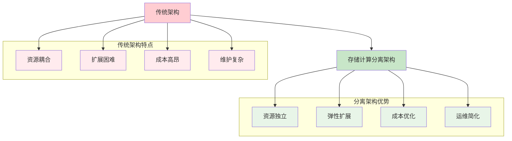
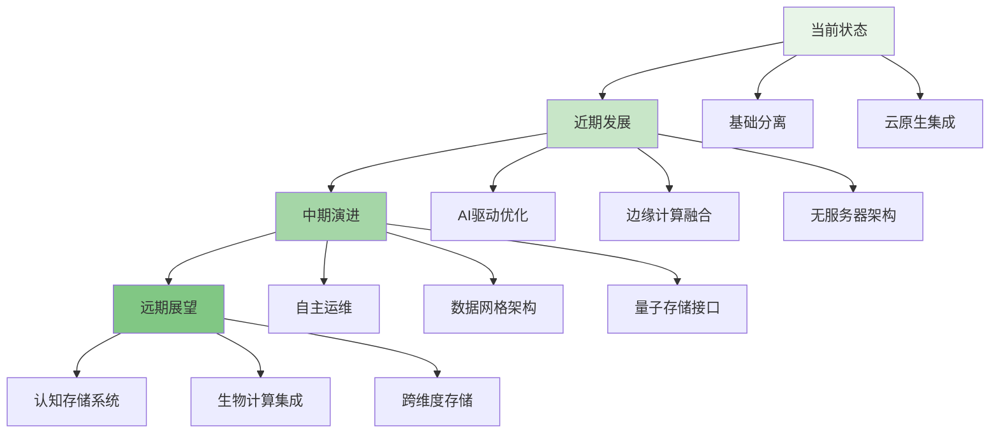

存储与计算分离架构作为现代分布式系统的重要设计理念，正在深刻改变着文件存储系统的构建方式。通过将存储和计算资源解耦，这种架构不仅提升了系统的灵活性和可扩展性，还为资源优化、成本控制和性能提升提供了新的可能性。随着技术的不断发展，存储与计算分离架构正在向更深层次演进，呈现出新的特征和优势。

## 存储计算分离的核心价值

存储与计算分离架构通过将数据存储和数据处理功能分别部署在独立的资源池中，实现了资源的独立扩展和优化配置。

### 架构优势分析



### 分离架构的关键组件

```yaml
# 存储计算分离架构组件
separation_architecture:
  storage_layer:
    characteristics:
      - "持久化数据存储"
      - "高可用性保障"
      - "数据冗余机制"
      - "存储资源池化"
    technologies:
      - "分布式文件系统"
      - "对象存储"
      - "块存储"
      - "软件定义存储"
  
  compute_layer:
    characteristics:
      - "无状态计算处理"
      - "弹性伸缩能力"
      - "高性能计算"
      - "计算资源池化"
    technologies:
      - "容器化平台"
      - "服务网格"
      - "函数计算"
      - "微服务架构"
  
  coordination_layer:
    characteristics:
      - "服务发现"
      - "负载均衡"
      - "配置管理"
      - "监控告警"
    technologies:
      - "Kubernetes"
      - "etcd"
      - "Consul"
      - "Prometheus"
  
  data_access_layer:
    characteristics:
      - "统一数据接口"
      - "缓存机制"
      - "数据预取"
      - "访问控制"
    technologies:
      - "存储网关"
      - "缓存代理"
      - "API网关"
      - "数据虚拟化"
```

## 深化分离架构的技术演进

随着技术的不断发展，存储与计算分离架构正在向更深层次演进，呈现出新的技术特征和发展趋势。

### 架构演进路径

```python
class StorageComputeSeparationEvolution:
    def __init__(self):
        self.evolution_phases = [
            EvolutionPhase(
                name="basic_separation",
                characteristics=[
                    "存储和计算物理分离",
                    "通过网络访问存储",
                    "简单的负载均衡"
                ],
                technologies=[
                    "NAS/SAN存储",
                    "虚拟化平台",
                    "传统负载均衡"
                ]
            ),
            EvolutionPhase(
                name="cloud_native_separation",
                characteristics=[
                    "容器化部署",
                    "微服务架构",
                    "API驱动访问"
                ],
                technologies=[
                    "Kubernetes",
                    "容器存储接口(CSI)",
                    "服务网格"
                ]
            ),
            EvolutionPhase(
                name="intelligent_separation",
                characteristics=[
                    "AI驱动优化",
                    "自动资源调度",
                    "智能数据预取"
                ],
                technologies=[
                    "机器学习平台",
                    "智能调度器",
                    "边缘计算"
                ]
            ),
            EvolutionPhase(
                name="hyper_separation",
                characteristics=[
                    "无服务器架构",
                    "数据网格",
                    "自主运维"
                ],
                technologies=[
                    "Serverless平台",
                    "数据网格架构",
                    "AIOps"
                ]
            )
        ]
```

### 关键技术突破

```go
type AdvancedSeparationArchitecture struct {
    StorageLayer    *IntelligentStorageLayer
    ComputeLayer    *ElasticComputeLayer
    Coordination    *SmartCoordinationLayer
    DataAccess      *OptimizedDataAccessLayer
}

type IntelligentStorageLayer struct {
    DataPlacement   *AIPlacementEngine
    TieringManager  *AutoTieringManager
    Consistency     *GlobalConsistencyProtocol
}

type ElasticComputeLayer struct {
    Scheduler       *IntelligentScheduler
    Autoscaler      *DynamicAutoscaler
    ResourcePool    *UnifiedResourcePool
}

func (asa *AdvancedSeparationArchitecture) OptimizeResourceAllocation() error {
    // 1. 分析存储层资源使用情况
    storageMetrics := asa.StorageLayer.CollectMetrics()
    
    // 2. 分析计算层资源需求
    computeRequirements := asa.ComputeLayer.AnalyzeRequirements()
    
    // 3. 智能资源调度
    allocationPlan := asa.Coordination.OptimizeAllocation(
        storageMetrics, 
        computeRequirements,
    )
    
    // 4. 执行资源分配
    if err := asa.StorageLayer.ApplyAllocation(allocationPlan.Storage); err != nil {
        return err
    }
    
    if err := asa.ComputeLayer.ApplyAllocation(allocationPlan.Compute); err != nil {
        return err
    }
    
    return nil
}

func (asa *AdvancedSeparationArchitecture) EnableAutonomousOperations() error {
    // 1. 启动智能监控
    asa.Coordination.Monitoring.EnableAIAnalytics()
    
    // 2. 配置自动故障恢复
    asa.Coordination.FailureRecovery.EnableAutoRecovery()
    
    // 3. 启动预测性维护
    asa.StorageLayer.Maintenance.EnablePredictiveMaintenance()
    
    // 4. 激活自适应优化
    asa.DataAccess.Optimization.EnableAdaptiveOptimization()
    
    return nil
}
```

## 存储层智能化发展

存储层作为分离架构的重要组成部分，正在向智能化方向发展，通过引入AI和机器学习技术提升存储效率和性能。

### 智能数据管理

```typescript
interface IntelligentStorageManager {
    // 智能数据放置
    optimizeDataPlacement(dataProfile: DataProfile): Promise<PlacementDecision>;
    
    // 自动分层存储
    manageStorageTiers(dataAccessPattern: AccessPattern): Promise<TieringAction[]>;
    
    // 预测性维护
    predictAndPreventFailures(): Promise<MaintenancePlan[]>;
    
    // 性能优化
    optimizeStoragePerformance(metrics: PerformanceMetrics): Promise<OptimizationActions>;
}

class AIStorageManager implements IntelligentStorageManager {
    private mlEngine: MachineLearningEngine;
    private dataAnalyzer: DataAnalyzer;
    private performanceOptimizer: PerformanceOptimizer;
    
    async optimizeDataPlacement(dataProfile: DataProfile): Promise<PlacementDecision> {
        // 1. 分析数据特征
        const analysis = await this.dataAnalyzer.analyze(dataProfile);
        
        // 2. 预测访问模式
        const accessPrediction = await this.mlEngine.predictAccessPattern(analysis);
        
        // 3. 优化放置策略
        const placement = await this.mlEngine.optimizePlacement(
            analysis, 
            accessPrediction
        );
        
        // 4. 执行放置决策
        await this.executePlacement(placement);
        
        return placement;
    }
    
    async manageStorageTiers(dataAccessPattern: AccessPattern): Promise<TieringAction[]> {
        // 1. 分析访问模式
        const patternAnalysis = this.analyzeAccessPattern(dataAccessPattern);
        
        // 2. 预测数据热度变化
        const heatPrediction = await this.mlEngine.predictDataHeat(patternAnalysis);
        
        // 3. 制定分层策略
        const tieringActions = this.generateTieringActions(heatPrediction);
        
        // 4. 执行分层操作
        await this.executeTieringActions(tieringActions);
        
        return tieringActions;
    }
    
    async predictAndPreventFailures(): Promise<MaintenancePlan[]> {
        // 1. 收集硬件健康数据
        const healthData = await this.collectHealthMetrics();
        
        // 2. 预测故障风险
        const failurePredictions = await this.mlEngine.predictFailures(healthData);
        
        // 3. 制定维护计划
        const maintenancePlans = this.generateMaintenancePlans(failurePredictions);
        
        // 4. 执行预防性维护
        await this.executeMaintenancePlans(maintenancePlans);
        
        return maintenancePlans;
    }
}
```

### 缓存与预取优化

```javascript
class IntelligentCachingSystem {
    constructor(config) {
        this.config = config;
        this.cacheLayers = new Map();
        this.predictionEngine = new AccessPredictionEngine();
        this.prefetcher = new DataPrefetcher();
    }
    
    /**
     * 智能缓存管理
     * @param {string} key - 数据键
     * @param {Object} data - 数据对象
     * @returns {Promise<Object>} 缓存结果
     */
    async manageCache(key, data) {
        try {
            // 1. 分析数据访问模式
            const accessPattern = await this.analyzeAccessPattern(key);
            
            // 2. 预测未来访问
            const prediction = await this.predictionEngine.predict(key, accessPattern);
            
            // 3. 优化缓存策略
            const cacheStrategy = this.optimizeCacheStrategy(key, data, prediction);
            
            // 4. 执行缓存操作
            const cacheResult = await this.executeCacheOperation(key, data, cacheStrategy);
            
            // 5. 触发预取
            if (prediction.shouldPrefetch) {
                this.prefetcher.prefetch(prediction.nextAccesses);
            }
            
            return cacheResult;
        } catch (error) {
            console.error('Cache management failed:', error);
            return { success: false, error: error.message };
        }
    }
    
    /**
     * 多级缓存优化
     * @param {string} key - 数据键
     * @param {Object} data - 数据对象
     * @param {Object} prediction - 访问预测
     * @returns {Object} 缓存策略
     */
    optimizeCacheStrategy(key, data, prediction) {
        // 根据数据大小和访问频率选择合适的缓存层
        if (data.size < this.config.l1Cache.maxSize && prediction.frequency > 0.8) {
            return {
                level: 'L1',
                ttl: this.config.l1Cache.ttl,
                evictionPolicy: 'LRU'
            };
        } else if (data.size < this.config.l2Cache.maxSize) {
            return {
                level: 'L2',
                ttl: this.config.l2Cache.ttl,
                evictionPolicy: 'LFU'
            };
        } else {
            return {
                level: 'L3',
                ttl: this.config.l3Cache.ttl,
                evictionPolicy: 'FIFO'
            };
        }
    }
}
```

## 计算层弹性化增强

计算层通过容器化、微服务和无服务器等技术实现更高的弹性和灵活性，能够根据负载动态调整资源。

### 弹性计算调度

```yaml
# 弹性计算调度配置
elastic_compute_scheduling:
  scaling_policies:
    - name: "cpu_based_scaling"
      metric: "cpu_utilization"
      threshold: "70%"
      action: "scale_out"
      cooldown: "5m"
    
    - name: "memory_based_scaling"
      metric: "memory_utilization"
      threshold: "80%"
      action: "scale_out"
      cooldown: "3m"
    
    - name: "request_based_scaling"
      metric: "request_rate"
      threshold: "1000_req/s"
      action: "scale_out"
      cooldown: "2m"
  
  resource_allocation:
    strategies:
      - name: "bin_packing"
        description: "最大化资源利用率"
        suitable_for: "cost_sensitive_workloads"
      
      - name: "spread"
        description: "最大化高可用性"
        suitable_for: "mission_critical_workloads"
      
      - name: "priority"
        description: "基于优先级分配资源"
        suitable_for: "mixed_priority_workloads"
  
  autoscaling_triggers:
    - type: "metrics_based"
      sources: ["prometheus", "datadog", "cloudwatch"]
    
    - type: "event_based"
      sources: ["message_queue", "webhook", "cron"]
    
    - type: "predictive"
      sources: ["ml_models", "historical_data"]
```

### 无服务器计算集成

```python
class ServerlessStorageComputeIntegration:
    def __init__(self, config):
        self.config = config
        self.function_runtime = FunctionRuntime()
        self.event_gateway = EventGateway()
        self.resource_orchestrator = ResourceOrchestrator()
    
    def deploy_storage_function(self, function_spec):
        """部署存储相关函数"""
        # 1. 创建函数环境
        function_env = self.function_runtime.create_environment(function_spec)
        
        # 2. 配置存储访问权限
        storage_access = self.configure_storage_access(function_spec.storage_permissions)
        
        # 3. 设置事件触发器
        triggers = self.setup_event_triggers(function_spec.triggers)
        
        # 4. 部署函数
        deployed_function = self.function_runtime.deploy(
            function_spec, 
            function_env, 
            storage_access, 
            triggers
        )
        
        return deployed_function
    
    def handle_storage_event(self, event):
        """处理存储事件"""
        # 1. 解析事件
        event_data = self.parse_storage_event(event)
        
        # 2. 路由到相应函数
        target_functions = self.route_event_to_functions(event_data)
        
        # 3. 并行执行函数
        execution_results = []
        with ThreadPoolExecutor(max_workers=10) as executor:
            future_to_function = {
                executor.submit(self.execute_function, func, event_data): func
                for func in target_functions
            }
            
            for future in as_completed(future_to_function):
                function = future_to_function[future]
                try:
                    result = future.result()
                    execution_results.append({
                        'function': function.name,
                        'result': result,
                        'success': True
                    })
                except Exception as e:
                    execution_results.append({
                        'function': function.name,
                        'error': str(e),
                        'success': False
                    })
        
        return execution_results
```

## 协调层智能化升级

协调层作为连接存储和计算的桥梁，正在通过引入智能调度和自适应优化技术提升整体系统效率。

### 智能协调机制

```go
type IntelligentCoordinationLayer struct {
    ServiceDiscovery *SmartServiceDiscovery
    LoadBalancer     *AdaptiveLoadBalancer
    Configuration    *DynamicConfiguration
    Monitoring       *AIOpsMonitoring
}

type CoordinationDecision struct {
    StorageNode    string
    ComputeNode    string
    RoutingPath    []string
    Optimization   OptimizationStrategy
    Timestamp      time.Time
}

func (icl *IntelligentCoordinationLayer) MakeCoordinationDecision(
    request *StorageRequest) *CoordinationDecision {
    
    // 1. 分析请求特征
    requestAnalysis := icl.analyzeRequest(request)
    
    // 2. 评估存储节点状态
    storageNodes := icl.ServiceDiscovery.GetAvailableStorageNodes()
    storageScores := icl.evaluateStorageNodes(storageNodes, requestAnalysis)
    
    // 3. 评估计算节点状态
    computeNodes := icl.ServiceDiscovery.GetAvailableComputeNodes()
    computeScores := icl.evaluateComputeNodes(computeNodes, requestAnalysis)
    
    // 4. 智能路由决策
    routingPath := icl.LoadBalancer.CalculateOptimalPath(
        storageScores, 
        computeScores, 
        requestAnalysis,
    )
    
    // 5. 优化策略选择
    optimization := icl.selectOptimizationStrategy(requestAnalysis)
    
    return &CoordinationDecision{
        StorageNode:  routingPath.StorageNode,
        ComputeNode:  routingPath.ComputeNode,
        RoutingPath:  routingPath.Path,
        Optimization: optimization,
        Timestamp:    time.Now(),
    }
}

func (icl *IntelligentCoordinationLayer) evaluateStorageNodes(
    nodes []*StorageNode, 
    requestAnalysis *RequestAnalysis) map[string]float64 {
    
    scores := make(map[string]float64)
    
    for _, node := range nodes {
        // 综合评估节点性能、负载、距离等因素
        performanceScore := icl.Monitoring.GetNodePerformance(node.ID)
        loadScore := 1.0 - icl.Monitoring.GetNodeLoad(node.ID)
        distanceScore := icl.calculateDistanceScore(node, requestAnalysis.ClientIP)
        healthScore := icl.Monitoring.GetNodeHealth(node.ID)
        
        // 加权计算总分
        totalScore := (
            performanceScore * 0.4 +
            loadScore * 0.3 +
            distanceScore * 0.2 +
            healthScore * 0.1
        )
        
        scores[node.ID] = totalScore
    }
    
    return scores
}
```

### 自适应优化引擎

```typescript
interface AdaptiveOptimizationEngine {
    // 性能自适应优化
    optimizePerformance(metrics: SystemMetrics): Promise<OptimizationPlan>;
    
    // 成本自适应优化
    optimizeCost(metrics: CostMetrics): Promise<CostOptimizationPlan>;
    
    // 资源自适应调度
    scheduleResources(workload: WorkloadProfile): Promise<SchedulingDecision>;
    
    // 故障自适应恢复
    recoverFromFailure(failure: FailureEvent): Promise<RecoveryAction>;
}

class SelfOptimizingCoordinationEngine implements AdaptiveOptimizationEngine {
    private mlOptimizer: MachineLearningOptimizer;
    private feedbackController: FeedbackController;
    private optimizationHistory: OptimizationHistory;
    
    async optimizePerformance(metrics: SystemMetrics): Promise<OptimizationPlan> {
        // 1. 分析系统性能指标
        const performanceAnalysis = this.analyzePerformanceMetrics(metrics);
        
        // 2. 识别性能瓶颈
        const bottlenecks = this.identifyBottlenecks(performanceAnalysis);
        
        // 3. 生成优化建议
        const optimizationSuggestions = await this.mlOptimizer.generateOptimizations(
            performanceAnalysis,
            bottlenecks
        );
        
        // 4. 评估优化效果
        const impactAssessment = await this.assessOptimizationImpact(
            optimizationSuggestions
        );
        
        // 5. 制定优化计划
        const optimizationPlan = this.createOptimizationPlan(
            optimizationSuggestions,
            impactAssessment
        );
        
        // 6. 执行优化并监控效果
        await this.executeOptimization(optimizationPlan);
        this.feedbackController.monitorOptimizationEffect(optimizationPlan);
        
        return optimizationPlan;
    }
    
    async scheduleResources(workload: WorkloadProfile): Promise<SchedulingDecision> {
        // 1. 分析工作负载特征
        const workloadAnalysis = this.analyzeWorkload(workload);
        
        // 2. 预测资源需求
        const resourcePrediction = await this.mlOptimizer.predictResourceNeeds(
            workloadAnalysis
        );
        
        // 3. 评估可用资源
        const availableResources = await this.getAvailableResources();
        
        // 4. 制定调度决策
        const schedulingDecision = this.makeSchedulingDecision(
            resourcePrediction,
            availableResources
        );
        
        // 5. 执行调度
        await this.executeScheduling(schedulingDecision);
        
        return schedulingDecision;
    }
}
```

## 未来发展趋势展望

存储与计算分离架构的未来发展将更加注重智能化、自动化和生态化，为分布式文件存储系统带来新的变革。

### 技术发展趋势



### 发展挑战与机遇

```yaml
# 发展挑战与机遇
future_challenges_opportunities:
  challenges:
    - name: "复杂性管理"
      description: "架构复杂性增加带来的管理挑战"
      mitigation:
        - "智能化管理工具"
        - "标准化接口"
        - "简化运维流程"
    
    - name: "数据一致性"
      description: "分布式环境下数据一致性保障"
      mitigation:
        - "先进一致性协议"
        - "事务处理机制"
        - "冲突解决策略"
    
    - name: "安全隐私"
      description: "数据安全和隐私保护"
      mitigation:
        - "端到端加密"
        - "访问控制"
        - "合规性保障"
  
  opportunities:
    - name: "AI赋能"
      description: "人工智能技术为存储系统带来新能力"
      benefits:
        - "智能优化"
        - "预测性维护"
        - "自主运维"
    
    - name: "边缘计算"
      description: "边缘计算与存储的深度融合"
      benefits:
        - "低延迟访问"
        - "本地化处理"
        - "带宽优化"
    
    - name: "生态协同"
      description: "与云原生生态的深度集成"
      benefits:
        - "标准化接口"
        - "工具链集成"
        - "社区支持"
```

通过不断深化存储与计算分离架构，分布式文件存储系统将能够更好地适应未来的技术发展和业务需求，提供更高效、更智能、更可靠的存储服务。这一架构演进不仅推动了存储技术的进步，也为整个分布式系统领域的发展提供了重要参考。