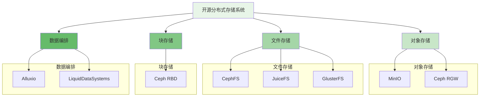
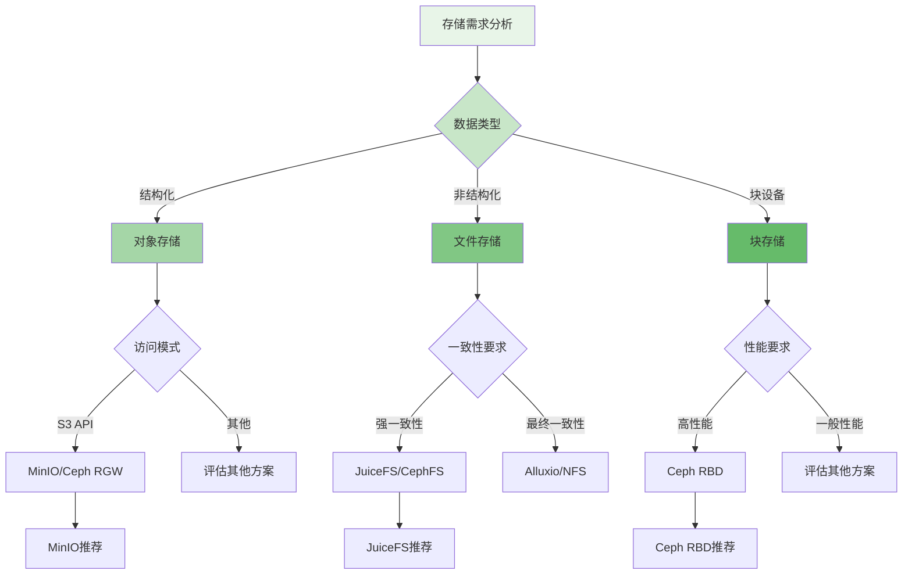

在分布式文件存储领域，有众多优秀的开源解决方案可供选择。每个系统都有其独特的设计理念、技术特点和适用场景。本附录将对主流的开源分布式存储系统进行详细对比分析，帮助读者根据具体需求选择最适合的解决方案。

## 主要开源存储系统概览

目前市场上主流的开源分布式存储系统包括Ceph、MinIO、JuiceFS、Alluxio等，它们在架构设计、功能特性、性能表现等方面各有特色。

### 系统分类与定位



## 详细对比分析

以下从多个维度对主要开源分布式存储系统进行详细对比分析。

### 架构设计对比

```yaml
# 架构设计对比
architecture_comparison:
  ceph:
    architecture: "统一存储架构"
    components:
      - "MON (Monitor)"
      - "OSD (Object Storage Daemon)"
      - "MDS (Metadata Server)"
      - "RGW (RADOS Gateway)"
      - "MGR (Manager)"
    deployment_complexity: "高"
    scalability: "极佳"
    fault_tolerance: "强"
  
  minio:
    architecture: "云原生对象存储"
    components:
      - "MinIO Server"
      - "Erasure Code Sets"
      - "Load Balancer"
    deployment_complexity: "低"
    scalability: "优秀"
    fault_tolerance: "中等"
  
  juicefs:
    architecture: "共享文件系统"
    components:
      - "JuiceFS Client"
      - "Metadata Engine"
      - "Object Storage"
    deployment_complexity: "中等"
    scalability: "优秀"
    fault_tolerance: "强"
  
  alluxio:
    architecture: "数据编排层"
    components:
      - "Master"
      - "Worker"
      - "Client"
    deployment_complexity: "中等"
    scalability: "优秀"
    fault_tolerance: "中等"
```

### 功能特性对比

```python
class StorageSystemFeatureComparison:
    def __init__(self):
        self.systems = {
            'ceph': self.get_ceph_features(),
            'minio': self.get_minio_features(),
            'juicefs': self.get_juicefs_features(),
            'alluxio': self.get_alluxio_features()
        }
    
    def get_ceph_features(self):
        return {
            'protocols': ['S3', 'Swift', 'POSIX', 'Block'],
            'data_redundancy': ['Replication', 'Erasure Coding'],
            'consistency': 'Strong',
            'snapshots': True,
            'cloning': True,
            'compression': True,
            'encryption': True,
            'multi_tenancy': True,
            'tiering': True,
            'caching': 'OSD-level'
        }
    
    def get_minio_features(self):
        return {
            'protocols': ['S3', 'STS'],
            'data_redundancy': ['Erasure Coding'],
            'consistency': 'Eventual',
            'snapshots': False,
            'cloning': False,
            'compression': True,
            'encryption': True,
            'multi_tenancy': True,
            'tiering': 'Lifecycle',
            'caching': 'Gateway-level'
        }
    
    def get_juicefs_features(self):
        return {
            'protocols': ['POSIX', 'HDFS', 'S3'],
            'data_redundancy': ['Depends on backend'],
            'consistency': 'Strong',
            'snapshots': True,
            'cloning': True,
            'compression': True,
            'encryption': True,
            'multi_tenancy': True,
            'tiering': True,
            'caching': 'Client-level + Metadata'
        }
    
    def get_alluxio_features(self):
        return {
            'protocols': ['POSIX', 'HDFS', 'S3', 'GCS'],
            'data_redundancy': ['Caching'],
            'consistency': 'Eventual',
            'snapshots': False,
            'cloning': False,
            'compression': False,
            'encryption': 'Depends on backend',
            'multi_tenancy': True,
            'tiering': True,
            'caching': 'Worker-level + Client-level'
        }
```

### 性能表现对比

```go
type PerformanceBenchmark struct {
    SystemName string
    Metrics    PerformanceMetrics
    TestEnv    TestEnvironment
}

type PerformanceMetrics struct {
    IOPS          int64
    Throughput    float64  // MB/s
    Latency       float64  // ms
    Consistency   string   // Strong/Eventual
    Scalability   string   // Linear/Sub-linear
}

type PerformanceComparison struct {
    Benchmarks map[string]*PerformanceBenchmark
}

func (pc *PerformanceComparison) CompareSystems() map[string]PerformanceRanking {
    rankings := make(map[string]PerformanceRanking)
    
    // 按不同指标进行排名
    iopsRanking := pc.rankByIOPS()
    throughputRanking := pc.rankByThroughput()
    latencyRanking := pc.rankByLatency()
    
    // 综合评分
    for systemName := range pc.Benchmarks {
        compositeScore := (
            iopsRanking[systemName].Score*0.3 +
            throughputRanking[systemName].Score*0.4 +
            (1.0/latencyRanking[systemName].Score)*0.3
        )
        
        rankings[systemName] = PerformanceRanking{
            SystemName: systemName,
            IOPSRank: iopsRanking[systemName].Rank,
            ThroughputRank: throughputRanking[systemName].Rank,
            LatencyRank: latencyRanking[systemName].Rank,
            CompositeScore: compositeScore,
        }
    }
    
    return rankings
}

func (pc *PerformanceComparison) rankByIOPS() map[string]MetricRanking {
    // 按IOPS排序
    sortedBenchmarks := pc.sortBenchmarksByMetric("iops")
    return pc.generateRankings(sortedBenchmarks)
}
```

### 使用场景匹配度

```typescript
interface UseCaseMatching {
    // AI/机器学习场景
    ai_ml: SystemRecommendation[];
    
    // 大数据处理场景
    big_data: SystemRecommendation[];
    
    // 云原生应用场景
    cloud_native: SystemRecommendation[];
    
    // 企业存储场景
    enterprise_storage: SystemRecommendation[];
}

class StorageSystemAdvisor implements UseCaseMatching {
    private systemProfiles: Map<string, SystemProfile>;
    
    constructor() {
        this.systemProfiles = this.loadSystemProfiles();
    }
    
    ai_ml: SystemRecommendation[] = [
        {
            system: "JuiceFS",
            reason: "强一致性、POSIX兼容、高性能小文件处理",
            score: 9.5
        },
        {
            system: "Alluxio",
            reason: "数据编排、缓存加速、多源数据访问",
            score: 9.0
        },
        {
            system: "CephFS",
            reason: "统一存储、强一致性、可扩展性好",
            score: 8.5
        }
    ];
    
    big_data: SystemRecommendation[] = [
        {
            system: "Alluxio",
            reason: "数据编排、缓存加速、与大数据生态集成好",
            score: 9.5
        },
        {
            system: "CephFS",
            reason: "POSIX兼容、可扩展性好、生态成熟",
            score: 9.0
        },
        {
            system: "JuiceFS",
            reason: "强一致性、多协议支持、易于部署",
            score: 8.5
        }
    ];
    
    cloud_native: SystemRecommendation[] = [
        {
            system: "MinIO",
            reason: "云原生设计、S3兼容、易于部署和扩展",
            score: 9.5
        },
        {
            system: "Ceph RGW",
            reason: "S3兼容、功能丰富、生产环境验证",
            score: 9.0
        },
        {
            system: "JuiceFS",
            reason: "轻量级、云原生集成、多协议支持",
            score: 8.5
        }
    ];
    
    enterprise_storage: SystemRecommendation[] = [
        {
            system: "Ceph",
            reason: "统一存储、功能全面、生产环境验证",
            score: 9.5
        },
        {
            system: "MinIO",
            reason: "对象存储、易于管理、云原生友好",
            score: 9.0
        },
        {
            system: "JuiceFS",
            reason: "文件存储、强一致性、易于扩展",
            score: 8.5
        }
    ];
}
```

## 系统详细分析

### Ceph深度分析

```javascript
class CephAnalysis {
    constructor() {
        this.architecture = "Unified Storage Architecture";
        this.strengths = [
            "统一存储平台，支持对象、块、文件存储",
            "高度可扩展，支持数千节点集群",
            "强一致性和数据持久性保障",
            "成熟的生态系统和企业级支持"
        ];
        this.weaknesses = [
            "部署和运维复杂度高",
            "资源消耗较大",
            "学习曲线陡峭",
            "小文件性能相对较弱"
        ];
    }
    
    /**
     * Ceph架构组件详解
     * @returns {Object} 架构组件说明
     */
    getArchitectureDetails() {
        return {
            monitor: {
                role: "集群状态管理",
                function: [
                    "维护集群映射",
                    "协调集群成员",
                    "选举主MON"
                ],
                deployment: "奇数个节点(3, 5, 7...)"
            },
            osd: {
                role: "对象存储守护进程",
                function: [
                    "数据存储",
                    "数据复制",
                    "故障检测",
                    "数据恢复"
                ],
                deployment: "每个存储节点运行多个OSD"
            },
            mds: {
                role: "元数据服务器",
                function: [
                    "文件系统元数据管理",
                    "目录结构维护",
                    "文件锁管理"
                ],
                deployment: "活跃-备用模式"
            }
        };
    }
    
    /**
     * Ceph适用场景分析
     * @returns {Object} 场景适用性分析
     */
    getUseCaseAnalysis() {
        return {
            private_cloud: {
                suitability: "高",
                reasons: [
                    "统一存储平台减少复杂性",
                    "企业级功能完善",
                    "成熟的管理工具"
                ]
            },
            hybrid_cloud: {
                suitability: "中高",
                reasons: [
                    "支持多种存储协议",
                    "可与公有云集成",
                    "数据迁移能力"
                ]
            },
            edge_computing: {
                suitability: "中",
                reasons: [
                    "资源消耗较大",
                    "部署复杂度高",
                    "但在大规模边缘场景下有价值"
                ]
            }
        };
    }
}
```

### MinIO深度分析

```yaml
# MinIO深度分析
minio_analysis:
  overview:
    architecture: "云原生对象存储"
    design_principle: "简单、高性能、可扩展"
    container_ready: true
    kubernetes_native: true
  
  key_features:
    erasure_coding:
      algorithm: "Reed-Solomon"
      configuration: "4-16个驱动器组"
      fault_tolerance: "每个组可容忍n/2个驱动器故障"
    
    s3_compatibility:
      api_coverage: "99%"
      performance: "优于AWS S3"
      extensions: ["Bucket Notification", "Batch Operations"]
    
    security:
      encryption: ["TLS", "SSE-S3", "SSE-KMS", "SSE-C"]
      authentication: ["Access Key", "STS", "LDAP", "OpenID"]
      compliance: ["FIPS 140-2", "HIPAA", "GDPR"]
  
  deployment_models:
    single_node:
      description: "单节点部署，适用于开发测试"
      drive_count: "1-4"
      use_case: ["开发测试", "小型应用"]
    
    distributed:
      description: "分布式部署，生产环境推荐"
      minimum_nodes: 4
      drive_per_node: "1-32"
      use_case: ["生产环境", "高性能需求"]
    
    multi_tier:
      description: "多层存储，自动分层"
      tiers: ["Hot Storage", "Warm Storage", "Cold Storage"]
      use_case: ["成本优化", "生命周期管理"]
```

### JuiceFS深度分析

```python
class JuiceFSAnalysis:
    def __init__(self):
        self.architecture = "Shared File System"
        self.core_components = {
            "client": "挂载点，提供POSIX接口",
            "metadata_engine": "元数据存储，支持多种数据库",
            "object_storage": "数据存储，支持多种云存储"
        }
    
    def get_technical_advantages(self):
        return {
            "posix_compliance": "完全兼容POSIX，无缝对接现有应用",
            "metadata_separation": "元数据和数据分离，提升性能",
            "multi_cloud_support": "支持多种云存储作为后端",
            "strong_consistency": "强一致性保证，适合关键业务",
            "elastic_scaling": "弹性扩展，按需增减容量"
        }
    
    def get_performance_characteristics(self):
        return {
            "small_file_performance": "优秀，元数据缓存优化",
            "large_file_performance": "良好，顺序读写优化",
            "concurrent_access": "支持数千客户端并发访问",
            "latency": "毫秒级响应延迟"
        }
    
    def get_deployment_scenarios(self):
        scenarios = {
            "ai_ml_training": {
                "advantages": [
                    "POSIX兼容，无需修改训练代码",
                    "高性能小文件处理",
                    "多节点共享访问"
                ],
                "considerations": [
                    "需要足够的元数据引擎性能",
                    "网络带宽要求较高"
                ]
            },
            "data_lake": {
                "advantages": [
                    "统一命名空间",
                    "多协议访问支持",
                    "成本优化的存储分层"
                ],
                "considerations": [
                    "需要合理规划元数据存储",
                    "要考虑冷热数据分层策略"
                ]
            }
        }
        return scenarios
```

### Alluxio深度分析

```go
type AlluxioAnalysis struct {
    Architecture     string
    CoreConcepts     []string
    PerformanceBoost map[string]float64
}

type AlluxioUseCase struct {
    Scenario       string
    Benefits       []string
    Implementation string
    Performance    PerformanceMetrics
}

func NewAlluxioAnalysis() *AlluxioAnalysis {
    return &AlluxioAnalysis{
        Architecture: "Data Orchestration Layer",
        CoreConcepts: []string{
            "Memory-Centric Architecture",
            "Hierarchical Storage",
            "Data Locality Optimization",
            "Unified Namespace",
        },
        PerformanceBoost: map[string]float64{
            "HDFS_Read":     10.0,  // 10x性能提升
            "S3_Read":       5.0,   // 5x性能提升
            "Database_Read": 15.0,  // 15x性能提升
        },
    }
}

func (aa *AlluxioAnalysis) GetUseCases() []*AlluxioUseCase {
    return []*AlluxioUseCase{
        {
            Scenario: "Big Data Analytics",
            Benefits: []string{
                "缓存热点数据",
                "减少远程数据访问",
                "统一数据访问接口",
            },
            Implementation: "部署Alluxio集群，配置HDFS和S3挂载点",
            Performance: PerformanceMetrics{
                IOPS:       100000,
                Throughput: 2000.0,
                Latency:    1.5,
            },
        },
        {
            Scenario: "Machine Learning Training",
            Benefits: []string{
                "加速数据加载",
                "本地缓存训练数据",
                "支持多框架访问",
            },
            Implementation: "在训练集群旁部署Alluxio，挂载数据源",
            Performance: PerformanceMetrics{
                IOPS:       50000,
                Throughput: 1500.0,
                Latency:    2.0,
            },
        },
    }
}
```

## 选型建议与最佳实践

### 选型决策框架



### 最佳实践总结

```yaml
# 存储系统选型最佳实践
best_practices:
  requirement_analysis:
    data_characteristics:
      - "数据量大小和增长趋势"
      - "数据访问模式（随机/顺序）"
      - "数据一致性要求"
      - "数据生命周期管理需求"
    
    performance_requirements:
      - "IOPS需求"
      - "吞吐量需求"
      - "延迟要求"
      - "并发访问量"
    
    operational_requirements:
      - "部署复杂度接受度"
      - "运维能力评估"
      - "成本预算"
      - "扩展性要求"
  
  evaluation_process:
    poc_testing:
      scope: "关键功能和性能测试"
      duration: "2-4周"
      participants: ["架构师", "运维", "开发"]
    
    vendor_assessment:
      criteria:
        - "社区活跃度"
        - "文档完善度"
        - "商业支持"
        - "生态系统"
    
    risk_mitigation:
      strategies:
        - "渐进式部署"
        - "数据备份策略"
        - "回滚计划"
        - "监控告警"
```

通过对主流开源分布式存储系统的详细对比分析，我们可以看出每个系统都有其独特的优势和适用场景。在实际选型过程中，需要根据具体的业务需求、技术要求和资源约束来做出最适合的选择。无论选择哪种系统，都需要充分考虑系统的长期维护、扩展性和生态支持能力。