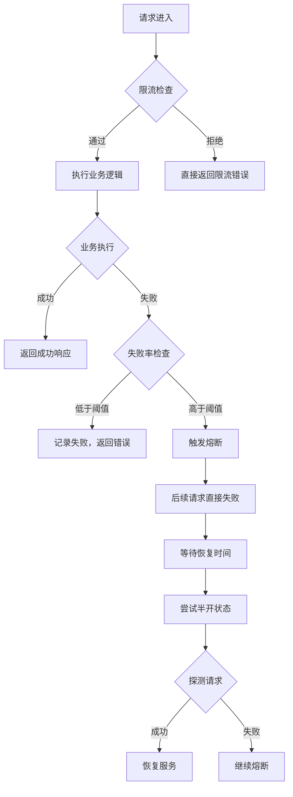

在分布式系统中，限流和熔断是保障系统稳定性的重要手段。限流通过控制流量来保护系统不被过载，而熔断则通过快速失败来防止故障扩散。两者的协同工作能够构建更加健壮的系统防护体系。本章将深入探讨如何实现限流与熔断器（如Hystrix、Resilience4j）的协同工作，特别是在异常比例触发熔断后再恢复的机制。

## 限流与熔断的关系

### 协同作用

限流和熔断在系统稳定性保障中发挥着不同的作用，但它们可以协同工作以提供更全面的保护：

1. **限流**：预防性措施，控制进入系统的流量，防止系统过载
2. **熔断**：应急性措施，当检测到故障时快速失败，防止故障扩散
3. **协同**：限流作为第一道防线，熔断作为第二道防线

### 工作流程



## 熔断器实现原理

### 状态机模型

熔断器通常采用三状态机模型来管理服务的健康状态：

```java
public enum CircuitBreakerState {
    CLOSED,     // 关闭状态，正常处理请求
    OPEN,       // 打开状态，拒绝所有请求
    HALF_OPEN   // 半开状态，允许部分请求通过
}
```

### 核心组件

```java
public class CircuitBreaker {
    private final String name;
    private volatile CircuitBreakerState state = CircuitBreakerState.CLOSED;
    private final AtomicInteger failureCount = new AtomicInteger(0);
    private final AtomicInteger successCount = new AtomicInteger(0);
    private volatile long lastFailureTime = 0;
    private final CircuitBreakerConfig config;
    
    // 熔断器配置
    public static class CircuitBreakerConfig {
        private final int failureThreshold;      // 失败阈值
        private final int successThreshold;      // 成功阈值
        private final long timeout;              // 超时时间（毫秒）
        
        // 构造函数和getter方法
        public CircuitBreakerConfig(int failureThreshold, int successThreshold, long timeout) {
            this.failureThreshold = failureThreshold;
            this.successThreshold = successThreshold;
            this.timeout = timeout;
        }
        
        // getter方法
        public int getFailureThreshold() { return failureThreshold; }
        public int getSuccessThreshold() { return successThreshold; }
        public long getTimeout() { return timeout; }
    }
    
    public CircuitBreaker(String name, CircuitBreakerConfig config) {
        this.name = name;
        this.config = config;
    }
    
    public boolean canExecute() {
        switch (state) {
            case CLOSED:
                return true;
            case OPEN:
                // 检查是否可以进入半开状态
                if (System.currentTimeMillis() - lastFailureTime >= config.getTimeout()) {
                    attemptHalfOpen();
                    return state == CircuitBreakerState.HALF_OPEN;
                }
                return false;
            case HALF_OPEN:
                return true;
            default:
                return true;
        }
    }
    
    public void onSuccess() {
        switch (state) {
            case CLOSED:
                failureCount.set(0);
                break;
            case OPEN:
                // 不应该在OPEN状态下收到成功响应
                break;
            case HALF_OPEN:
                int success = successCount.incrementAndGet();
                if (success >= config.getSuccessThreshold()) {
                    // 恢复到关闭状态
                    reset();
                }
                break;
        }
    }
    
    public void onFailure() {
        long now = System.currentTimeMillis();
        lastFailureTime = now;
        
        switch (state) {
            case CLOSED:
                int failures = failureCount.incrementAndGet();
                if (failures >= config.getFailureThreshold()) {
                    // 触发熔断
                    state = CircuitBreakerState.OPEN;
                }
                break;
            case OPEN:
                // 已经是打开状态，重置失败计数
                failureCount.set(1);
                break;
            case HALF_OPEN:
                // 在半开状态下失败，重新打开熔断器
                state = CircuitBreakerState.OPEN;
                failureCount.set(1);
                successCount.set(0);
                break;
        }
    }
    
    private void attemptHalfOpen() {
        if (state == CircuitBreakerState.OPEN && 
            System.currentTimeMillis() - lastFailureTime >= config.getTimeout()) {
            state = CircuitBreakerState.HALF_OPEN;
            successCount.set(0);
        }
    }
    
    private void reset() {
        state = CircuitBreakerState.CLOSED;
        failureCount.set(0);
        successCount.set(0);
        lastFailureTime = 0;
    }
    
    public CircuitBreakerState getState() {
        return state;
    }
}
```

## 与Hystrix的集成

### Hystrix熔断机制

Hystrix是Netflix开源的容错库，提供了强大的熔断功能：

```java
// Hystrix命令实现
public class UserOrderCommand extends HystrixCommand<UserOrder> {
    private final UserService userService;
    private final OrderService orderService;
    private final String userId;
    
    public UserOrderCommand(String userId) {
        super(Setter.withGroupKey(HystrixCommandGroupKey.Factory.asKey("UserOrderGroup"))
                .andCommandKey(HystrixCommandKey.Factory.asKey("UserOrderCommand"))
                .andThreadPoolKey(HystrixThreadPoolKey.Factory.asKey("UserOrderPool"))
                .andCommandPropertiesDefaults(HystrixCommandProperties.Setter()
                        .withCircuitBreakerEnabled(true)
                        .withCircuitBreakerRequestVolumeThreshold(20)
                        .withCircuitBreakerSleepWindowInMilliseconds(5000)
                        .withCircuitBreakerErrorThresholdPercentage(50)
                        .withExecutionTimeoutInMilliseconds(3000)));
        this.userService = new UserService();
        this.orderService = new OrderService();
        this.userId = userId;
    }
    
    @Override
    protected UserOrder run() throws Exception {
        // 正常业务逻辑
        User user = userService.getUserById(userId);
        List<Order> orders = orderService.getOrdersByUserId(userId);
        return new UserOrder(user, orders);
    }
    
    @Override
    protected UserOrder getFallback() {
        // 降级处理
        log.warn("UserOrderCommand fallback executed for user: " + userId);
        return new UserOrder(null, Collections.emptyList());
    }
}
```

### 限流与Hystrix协同

```java
// 限流与Hystrix协同实现
@Service
public class RateLimitHystrixService {
    private final RateLimiter rateLimiter;
    private final HystrixCommand.Setter commandSetter;
    
    public RateLimitHystrixService() {
        this.rateLimiter = RateLimiter.create(100); // 100 QPS
        
        this.commandSetter = HystrixCommand.Setter
            .withGroupKey(HystrixCommandGroupKey.Factory.asKey("RateLimitGroup"))
            .andCommandKey(HystrixCommandKey.Factory.asKey("RateLimitCommand"))
            .andThreadPoolKey(HystrixThreadPoolKey.Factory.asKey("RateLimitPool"))
            .andCommandPropertiesDefaults(HystrixCommandProperties.Setter()
                .withCircuitBreakerEnabled(true)
                .withCircuitBreakerRequestVolumeThreshold(10)
                .withCircuitBreakerSleepWindowInMilliseconds(10000)
                .withCircuitBreakerErrorThresholdPercentage(50));
    }
    
    public ResponseEntity<?> processRequest(String userId, RequestData data) {
        // 首先进行限流检查
        if (!rateLimiter.tryAcquire()) {
            return ResponseEntity.status(HttpStatus.TOO_MANY_REQUESTS)
                .body(new ErrorResponse("Rate limit exceeded"));
        }
        
        // 然后执行Hystrix命令
        return new RateLimitHystrixCommand(commandSetter, userId, data).execute();
    }
    
    // Hystrix命令类
    private static class RateLimitHystrixCommand extends HystrixCommand<ResponseEntity<?>> {
        private final String userId;
        private final RequestData data;
        
        public RateLimitHystrixCommand(HystrixCommand.Setter setter, String userId, RequestData data) {
            super(setter);
            this.userId = userId;
            this.data = data;
        }
        
        @Override
        protected ResponseEntity<?> run() throws Exception {
            // 实际业务逻辑
            BusinessService service = new BusinessService();
            Object result = service.process(userId, data);
            return ResponseEntity.ok(result);
        }
        
        @Override
        protected ResponseEntity<?> getFallback() {
            // 熔断降级处理
            log.warn("RateLimitHystrixCommand fallback executed for user: " + userId);
            return ResponseEntity.status(HttpStatus.SERVICE_UNAVAILABLE)
                .body(new ErrorResponse("Service temporarily unavailable"));
        }
    }
}
```

## 与Resilience4j的集成

### Resilience4j熔断机制

Resilience4j是新一代的容错库，提供了更轻量级的实现：

```java
// Resilience4j熔断器配置
@Configuration
public class Resilience4jConfig {
    
    @Bean
    public CircuitBreakerRegistry circuitBreakerRegistry() {
        CircuitBreakerConfig config = CircuitBreakerConfig.custom()
            .failureRateThreshold(50) // 失败率阈值50%
            .waitDurationInOpenState(Duration.ofSeconds(10)) // 打开状态持续时间
            .permittedNumberOfCallsInHalfOpenState(5) // 半开状态允许请求数
            .slidingWindowType(CircuitBreakerConfig.SlidingWindowType.TIME_BASED)
            .slidingWindowSize(100) // 滑动窗口大小
            .minimumNumberOfCalls(20) // 最小请求数
            .build();
            
        return CircuitBreakerRegistry.of(config);
    }
    
    @Bean
    public RateLimiterRegistry rateLimiterRegistry() {
        RateLimiterConfig config = RateLimiterConfig.custom()
            .limitForPeriod(100) // 每个周期的限制数
            .limitRefreshPeriod(Duration.ofSeconds(1)) // 刷新周期
            .timeoutDuration(Duration.ofMillis(500)) // 超时时间
            .build();
            
        return RateLimiterRegistry.of(config);
    }
}
```

### 限流与Resilience4j协同

```java
// 限流与Resilience4j协同实现
@Service
public class Resilience4jRateLimitService {
    private final CircuitBreaker circuitBreaker;
    private final RateLimiter rateLimiter;
    private final BusinessService businessService;
    
    public Resilience4jRateLimitService(
            CircuitBreakerRegistry circuitBreakerRegistry,
            RateLimiterRegistry rateLimiterRegistry,
            BusinessService businessService) {
        this.circuitBreaker = circuitBreakerRegistry.circuitBreaker("businessService");
        this.rateLimiter = rateLimiterRegistry.rateLimiter("businessService");
        this.businessService = businessService;
    }
    
    public Object processRequest(String userId, RequestData data) {
        // 创建装饰器链
        Supplier<Object> decoratedSupplier = RateLimiter.decorateSupplier(
            rateLimiter, 
            () -> businessService.process(userId, data)
        );
        
        decoratedSupplier = CircuitBreaker.decorateSupplier(
            circuitBreaker, 
            decoratedSupplier
        );
        
        // 执行装饰器链
        try {
            return decoratedSupplier.get();
        } catch (RequestNotPermitted e) {
            // 限流异常
            throw new RateLimitExceededException("Rate limit exceeded", e);
        } catch (CallNotPermittedException e) {
            // 熔断异常
            throw new ServiceUnavailableException("Service is temporarily unavailable", e);
        }
    }
    
    // 监听熔断器事件
    @PostConstruct
    public void registerEventListeners() {
        circuitBreaker.getEventPublisher()
            .onStateTransition(event -> {
                log.info("Circuit breaker {} state changed from {} to {}", 
                    circuitBreaker.getName(),
                    event.getStateTransition().getFromState(),
                    event.getStateTransition().getToState());
            })
            .onCallNotPermitted(event -> {
                log.warn("Call not permitted by circuit breaker: {}", circuitBreaker.getName());
            })
            .onError(event -> {
                log.error("Error occurred in circuit breaker: {}", circuitBreaker.getName(), 
                    event.getThrowable());
            });
    }
}
```

## 异常比例触发机制

### 动态阈值调整

```java
// 动态异常比例计算
public class DynamicFailureRateCalculator {
    private final SlidingTimeWindow slidingWindow;
    private final double baseFailureRateThreshold;
    private final double maxFailureRateThreshold;
    
    public DynamicFailureRateCalculator(double baseThreshold, double maxThreshold) {
        this.slidingWindow = new SlidingTimeWindow(60000); // 1分钟窗口
        this.baseFailureRateThreshold = baseThreshold;
        this.maxFailureRateThreshold = maxThreshold;
    }
    
    public double calculateCurrentThreshold() {
        long totalCalls = slidingWindow.getTotalCalls();
        long failedCalls = slidingWindow.getFailedCalls();
        
        if (totalCalls == 0) {
            return baseFailureRateThreshold;
        }
        
        double currentFailureRate = (double) failedCalls / totalCalls;
        
        // 根据当前失败率动态调整阈值
        if (currentFailureRate > 0.7) {
            // 高失败率时降低阈值，更快触发熔断
            return Math.max(baseFailureRateThreshold * 0.7, 0.3);
        } else if (currentFailureRate < 0.2) {
            // 低失败率时提高阈值，避免过度敏感
            return Math.min(baseFailureRateThreshold * 1.3, maxFailureRateThreshold);
        } else {
            return baseFailureRateThreshold;
        }
    }
    
    public void recordCall(boolean success) {
        slidingWindow.recordCall(success);
    }
    
    // 滑动时间窗口实现
    private static class SlidingTimeWindow {
        private final long windowSizeInMillis;
        private final Queue<CallRecord> callRecords;
        
        public SlidingTimeWindow(long windowSizeInMillis) {
            this.windowSizeInMillis = windowSizeInMillis;
            this.callRecords = new ConcurrentLinkedQueue<>();
        }
        
        public void recordCall(boolean success) {
            long now = System.currentTimeMillis();
            callRecords.offer(new CallRecord(now, success));
            cleanupExpiredRecords(now);
        }
        
        private void cleanupExpiredRecords(long currentTime) {
            long expiredTime = currentTime - windowSizeInMillis;
            while (!callRecords.isEmpty() && callRecords.peek().timestamp < expiredTime) {
                callRecords.poll();
            }
        }
        
        public long getTotalCalls() {
            return callRecords.size();
        }
        
        public long getFailedCalls() {
            return callRecords.stream().filter(record -> !record.success).count();
        }
        
        private static class CallRecord {
            final long timestamp;
            final boolean success;
            
            CallRecord(long timestamp, boolean success) {
                this.timestamp = timestamp;
                this.success = success;
            }
        }
    }
}
```

### 智能恢复机制

```java
// 智能恢复机制
public class SmartRecoveryMechanism {
    private final CircuitBreaker circuitBreaker;
    private final HealthCheckService healthCheckService;
    private final ScheduledExecutorService scheduler;
    private final long baseRecoveryDelay;
    private final int maxRecoveryAttempts;
    private volatile int recoveryAttempts = 0;
    
    public SmartRecoveryMechanism(CircuitBreaker circuitBreaker, 
                                 HealthCheckService healthCheckService,
                                 long baseRecoveryDelay,
                                 int maxRecoveryAttempts) {
        this.circuitBreaker = circuitBreaker;
        this.healthCheckService = healthCheckService;
        this.baseRecoveryDelay = baseRecoveryDelay;
        this.maxRecoveryAttempts = maxRecoveryAttempts;
        this.scheduler = Executors.newScheduledThreadPool(1);
    }
    
    public void startRecoveryProcess() {
        if (circuitBreaker.getState() != CircuitBreakerState.OPEN) {
            return;
        }
        
        recoveryAttempts = 0;
        scheduleRecoveryAttempt();
    }
    
    private void scheduleRecoveryAttempt() {
        if (recoveryAttempts >= maxRecoveryAttempts) {
            log.warn("Max recovery attempts reached, keeping circuit breaker open");
            return;
        }
        
        // 指数退避延迟
        long delay = baseRecoveryDelay * (1L << recoveryAttempts);
        
        scheduler.schedule(() -> {
            attemptRecovery();
        }, delay, TimeUnit.MILLISECONDS);
    }
    
    private void attemptRecovery() {
        if (circuitBreaker.getState() != CircuitBreakerState.OPEN) {
            return;
        }
        
        recoveryAttempts++;
        
        // 执行健康检查
        HealthCheckResult healthCheckResult = healthCheckService.performHealthCheck();
        
        if (healthCheckResult.isHealthy()) {
            // 健康检查通过，进入半开状态
            circuitBreaker.transitionToHalfOpenState();
            log.info("Health check passed, transitioning to half-open state");
        } else {
            // 健康检查失败，继续等待
            log.warn("Health check failed, remaining in open state. Reason: {}", 
                healthCheckResult.getReason());
            scheduleRecoveryAttempt();
        }
    }
    
    // 健康检查服务
    public static class HealthCheckService {
        private final List<HealthIndicator> healthIndicators;
        
        public HealthCheckService(List<HealthIndicator> healthIndicators) {
            this.healthIndicators = healthIndicators;
        }
        
        public HealthCheckResult performHealthCheck() {
            List<HealthIndicatorResult> results = healthIndicators.parallelStream()
                .map(HealthIndicator::check)
                .collect(Collectors.toList());
            
            // 检查是否有关键指标失败
            boolean criticalFailure = results.stream()
                .anyMatch(result -> result.isCritical() && !result.isHealthy());
            
            if (criticalFailure) {
                String reason = results.stream()
                    .filter(result -> result.isCritical() && !result.isHealthy())
                    .map(HealthIndicatorResult::getMessage)
                    .collect(Collectors.joining(", "));
                return new HealthCheckResult(false, "Critical health check failed: " + reason);
            }
            
            // 检查失败率
            long totalChecks = results.size();
            long failedChecks = results.stream().filter(r -> !r.isHealthy()).count();
            
            if (failedChecks > totalChecks * 0.5) {
                return new HealthCheckResult(false, 
                    String.format("Too many health checks failed: %d/%d", failedChecks, totalChecks));
            }
            
            return new HealthCheckResult(true, "All health checks passed");
        }
    }
}
```

## 监控与告警

### 熔断器指标收集

```java
// 熔断器指标收集
@Component
public class CircuitBreakerMetricsCollector {
    private final MeterRegistry meterRegistry;
    private final Map<String, CircuitBreaker> circuitBreakers;
    private final ScheduledExecutorService scheduler;
    
    public CircuitBreakerMetricsCollector(MeterRegistry meterRegistry) {
        this.meterRegistry = meterRegistry;
        this.circuitBreakers = new ConcurrentHashMap<>();
        this.scheduler = Executors.newScheduledThreadPool(1);
        
        // 定期收集指标
        scheduler.scheduleAtFixedRate(this::collectMetrics, 0, 10, TimeUnit.SECONDS);
    }
    
    public void registerCircuitBreaker(String name, CircuitBreaker circuitBreaker) {
        circuitBreakers.put(name, circuitBreaker);
    }
    
    private void collectMetrics() {
        for (Map.Entry<String, CircuitBreaker> entry : circuitBreakers.entrySet()) {
            String name = entry.getKey();
            CircuitBreaker circuitBreaker = entry.getValue();
            
            // 收集状态指标
            Gauge.builder("circuit.breaker.state")
                .tag("name", name)
                .register(meterRegistry, circuitBreaker, cb -> getStateValue(cb.getState()));
            
            // 收集失败率指标
            Gauge.builder("circuit.breaker.failure.rate")
                .tag("name", name)
                .register(meterRegistry, circuitBreaker, this::calculateFailureRate);
        }
    }
    
    private double getStateValue(CircuitBreakerState state) {
        switch (state) {
            case CLOSED: return 0.0;
            case OPEN: return 1.0;
            case HALF_OPEN: return 0.5;
            default: return -1.0;
        }
    }
    
    private double calculateFailureRate(CircuitBreaker circuitBreaker) {
        // 实现失败率计算逻辑
        return 0.0; // 简化示例
    }
}
```

### 告警规则配置

```yaml
# 熔断器告警规则配置
alerting:
  rules:
    - name: "Circuit Breaker Open"
      metric: "circuit.breaker.state"
      condition: "value == 1.0"
      duration: "30s"
      severity: "critical"
      message: "Circuit breaker {{name}} is open"
      
    - name: "High Failure Rate"
      metric: "circuit.breaker.failure.rate"
      condition: "value > 0.7"
      duration: "1m"
      severity: "warning"
      message: "Circuit breaker {{name}} failure rate is high: {{value}}"
      
    - name: "Frequent State Changes"
      metric: "circuit.breaker.state.changes"
      condition: "rate(value[5m]) > 10"
      severity: "warning"
      message: "Circuit breaker {{name}} is changing state frequently"
```

通过以上实现，我们构建了一个完整的限流与熔断协同工作机制。这个机制能够根据异常比例动态触发熔断，并在适当的时候尝试恢复服务，从而在保障系统稳定性的同时最大化服务可用性。在实际应用中，需要根据具体业务场景调整参数和策略，以达到最佳的防护效果。