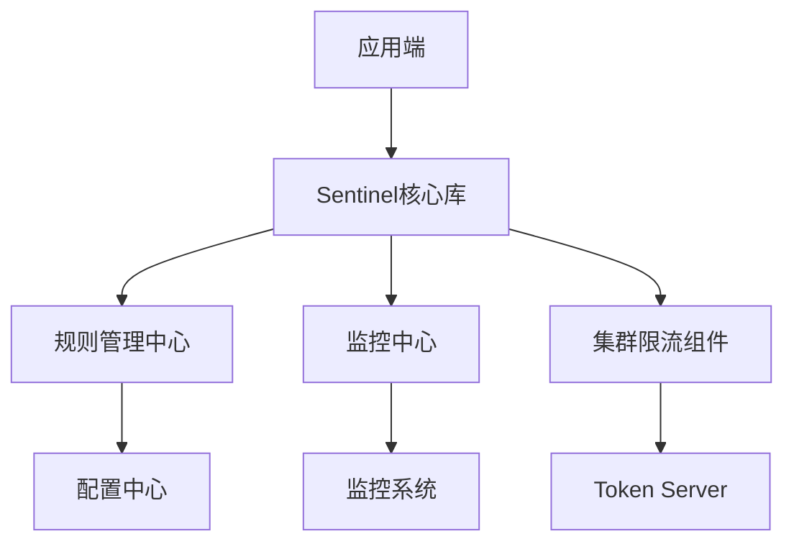
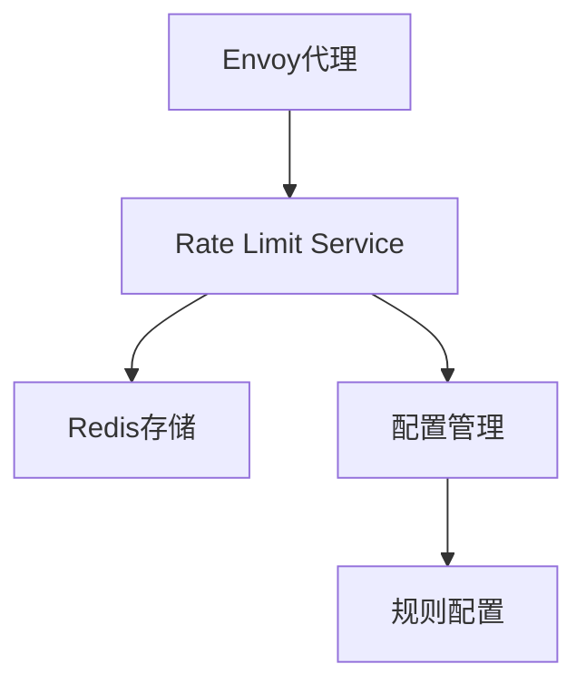
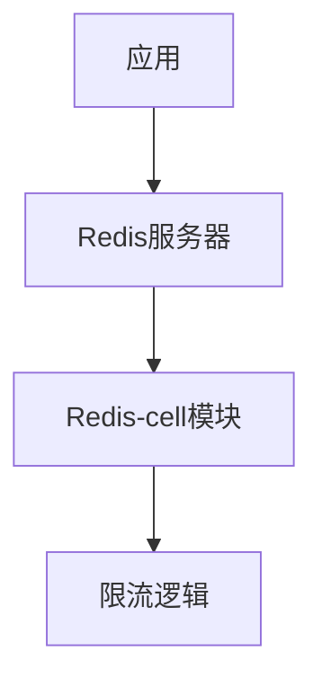

在构建分布式限流平台时，选择合适的开源组件是一个重要的决策。目前市场上有多种成熟的开源限流解决方案，每种都有其特点和适用场景。本附录将对三种主流的开源限流组件进行详细对比分析：阿里巴巴的Sentinel、Envoy的Rate Limit Service（RLS）和Redis-cell。通过对比它们的架构设计、功能特性、性能表现和适用场景，为技术选型提供参考。

## 组件概述

### Sentinel

Sentinel是阿里巴巴开源的面向分布式服务架构的流量控制组件，主要以流量为切入点，从流量控制、熔断降级、系统负载保护等多个维度来帮助您保障微服务的稳定性。

### Envoy Rate Limit Service (RLS)

Envoy RLS是Envoy代理的独立速率限制服务，作为一个外部授权服务与Envoy代理配合使用，提供全局速率限制功能。

### Redis-cell

Redis-cell是Twitter开源的一个Redis模块，为Redis提供了高效的限流数据结构，基于令牌桶算法实现。

## 架构设计对比

### Sentinel架构



Sentinel采用客户端嵌入式的架构设计：

1. **客户端模式**：以jar包形式嵌入应用，无外部依赖
2. **实时监控**：提供实时的监控和统计信息
3. **集群限流**：支持集群模式下的统一限流
4. **动态规则**：支持规则的动态配置和更新

### Envoy RLS架构



Envoy RLS采用服务端架构设计：

1. **独立服务**：作为独立的服务运行，与数据面分离
2. **gRPC通信**：通过gRPC与Envoy代理通信
3. **分布式存储**：通常使用Redis作为后端存储
4. **集中管理**：统一的限流规则管理

### Redis-cell架构



Redis-cell采用存储端扩展架构：

1. **Redis模块**：作为Redis的扩展模块加载
2. **原子操作**：在Redis服务端执行限流逻辑
3. **简单集成**：通过Redis命令直接使用
4. **高性能**：利用Redis的高性能特性

## 功能特性对比

### 核心功能对比表

| 功能特性 | Sentinel | Envoy RLS | Redis-cell |
|---------|----------|-----------|------------|
| 限流算法 | 多种算法支持 | 令牌桶/漏桶 | 令牌桶 |
| 集群限流 | 支持 | 支持 | 需要Redis集群 |
| 熔断降级 | 支持 | 不支持 | 不支持 |
| 热点参数限流 | 支持 | 支持 | 不支持 |
| 系统自适应限流 | 支持 | 不支持 | 不支持 |
| 规则动态更新 | 支持 | 支持 | 需要外部管理 |
| 监控面板 | 提供 | 需要集成 | 需要外部监控 |
| 多语言支持 | Java为主 | 多语言 | 客户端语言无关 |
| 配置管理 | 多种配置源 | 配置文件/YAML | 外部管理 |

### 详细功能分析

#### Sentinel功能特性

```java
// Sentinel核心功能示例
public class SentinelExample {
    public void flowControlExample() {
        // 1. 定义资源
        try (Entry entry = SphU.entry("resourceName")) {
            // 被保护的业务逻辑
            doBusiness();
        } catch (BlockException ex) {
            // 处理限流后的逻辑
            handleFlowControl();
        }
    }
    
    public void ruleConfiguration() {
        // 2. 配置限流规则
        List<FlowRule> rules = new ArrayList<>();
        FlowRule rule = new FlowRule();
        rule.setResource("resourceName");
        rule.setGrade(RuleConstant.FLOW_GRADE_QPS);
        rule.setCount(100); // QPS阈值
        rules.add(rule);
        
        // 3. 加载规则
        FlowRuleManager.loadRules(rules);
    }
    
    public void clusterMode() {
        // 4. 集群限流配置
        ClusterFlowRuleManager.setPropertySupplier(namespace -> {
            ClusterFlowRule rule = new ClusterFlowRule();
            rule.setResource("resourceName");
            rule.setThresholdType(ClusterRuleConstant.FLOW_THRESHOLD_GLOBAL);
            rule.setCount(1000); // 全局阈值
            return Arrays.asList(rule);
        });
    }
    
    public void systemRule() {
        // 5. 系统自适应限流
        List<SystemRule> rules = new ArrayList<>();
        SystemRule rule = new SystemRule();
        rule.setHighestSystemLoad(3.0);
        rule.setAvgRt(100); // 平均响应时间
        rules.add(rule);
        
        SystemRuleManager.loadRules(rules);
    }
    
    public void circuitBreaker() {
        // 6. 熔断降级
        DegradeRule rule = new DegradeRule();
        rule.setResource("resourceName");
        rule.setGrade(RuleConstant.DEGRADE_GRADE_RT);
        rule.setCount(100); // 慢调用阈值
        rule.setTimeWindow(10); // 熔断时长
        
        DegradeRuleManager.loadRules(Arrays.asList(rule));
    }
}
```

#### Envoy RLS功能特性

```yaml
# Envoy RLS配置示例
# 1. Envoy配置
static_resources:
  listeners:
  - name: listener_0
    address:
      socket_address: { address: 0.0.0.0, port_value: 10000 }
    filter_chains:
    - filters:
      - name: envoy.filters.network.http_connection_manager
        typed_config:
          "@type": type.googleapis.com/envoy.extensions.filters.network.http_connection_manager.v3.HttpConnectionManager
          stat_prefix: ingress_http
          route_config:
            name: local_route
            virtual_hosts:
            - name: local_service
              domains: ["*"]
              routes:
              - match: { prefix: "/" }
                route: { cluster: service }
          http_filters:
          - name: envoy.filters.http.ratelimit
            typed_config:
              "@type": type.googleapis.com/envoy.extensions.filters.http.ratelimit.v3.RateLimit
              domain: rate_limit_domain
              rate_limit_service:
                grpc_service:
                  envoy_grpc:
                    cluster_name: rate_limit_service
          - name: envoy.filters.http.router
            typed_config: {}

# 2. RLS配置
domain: rate_limit_domain
descriptors:
  - key: destination_cluster
    rate_limit:
      unit: minute
      requests_per_unit: 1000
  - key: destination_cluster
    value: service_a
    rate_limit:
      unit: minute
      requests_per_unit: 500
  - key: remote_address
    descriptors:
      - key: path
        value: /api/users
        rate_limit:
          unit: minute
          requests_per_unit: 100
```

#### Redis-cell功能特性

```lua
-- Redis-cell使用示例
-- 1. 基本限流
CL.THROTTLE user123 15 30 60 1
-- 参数说明: key, max_burst, count per period, period(seconds), quantity

-- 2. 返回值解析
-- 返回数组: [is_allowed, limit, remaining, retry_after, reset_after]
-- 示例返回: [0, 15, 0, 10, 25] 表示被限流，限制15，剩余0，10秒后重试，25秒后完全重置

-- 3. 在应用中使用
local result = redis.call('CL.THROTTLE', 'user:' .. user_id, 100, 1000, 3600, 1)
if result[1] == 1 then
    -- 允许通过
    return true
else
    -- 被限流
    return false
end
```

## 性能表现对比

### 性能测试结果

| 性能指标 | Sentinel | Envoy RLS | Redis-cell |
|---------|----------|-----------|------------|
| 单机QPS | 50,000+ | 20,000+ | 100,000+ |
| 延迟(99%) | < 1ms | < 2ms | < 0.1ms |
| 内存占用 | 中等 | 较高 | 低 |
| 网络开销 | 无(本地) | 有(gRPC) | 有(Redis) |
| 集群扩展性 | 良好 | 优秀 | 依赖Redis |

### 性能分析

#### Sentinel性能特点

```java
// Sentinel性能优化示例
public class SentinelPerformanceOptimization {
    // 1. 预热优化
    public void warmupConfiguration() {
        FlowRule rule = new FlowRule();
        rule.setResource("resourceName");
        rule.setGrade(RuleConstant.FLOW_GRADE_QPS);
        rule.setCount(1000);
        // 启用预热
        rule.setControlBehavior(RuleConstant.CONTROL_BEHAVIOR_WARM_UP);
        rule.setWarmUpPeriodSec(10); // 预热时间10秒
    }
    
    // 2. 批量处理优化
    public void batchProcessing() {
        // 批量检查多个资源
        List<String> resources = Arrays.asList("resource1", "resource2", "resource3");
        Entry[] entries = new Entry[resources.size()];
        
        try {
            for (int i = 0; i < resources.size(); i++) {
                entries[i] = SphU.entry(resources.get(i));
            }
            // 批量处理业务逻辑
            doBatchBusiness();
        } catch (BlockException ex) {
            // 批量处理限流
            handleBatchFlowControl();
        } finally {
            // 批量释放资源
            for (Entry entry : entries) {
                if (entry != null) {
                    entry.exit();
                }
            }
        }
    }
    
    // 3. 异步处理优化
    public CompletableFuture<Void> asyncProcessing() {
        return CompletableFuture.runAsync(() -> {
            try (Entry entry = SphU.entry("asyncResource")) {
                // 异步业务逻辑
                doAsyncBusiness();
            } catch (BlockException ex) {
                // 异步限流处理
                handleAsyncFlowControl();
            }
        });
    }
}
```

#### Envoy RLS性能特点

```yaml
# Envoy RLS性能优化配置
# 1. 连接池优化
rate_limit_service:
  grpc_service:
    envoy_grpc:
      cluster_name: rate_limit_service
  transport_api_version: V3
  # 连接池配置
  max_pending_requests: 1000
  max_requests: 10000
  max_retries: 3

# 2. 缓存优化
cache:
  # 启用缓存
  enabled: true
  # 缓存过期时间
  expiration: 60s
  # 缓存大小
  size: 10000

# 3. 批量处理
batch:
  # 启用批量处理
  enabled: true
  # 批量大小
  size: 100
  # 批量超时
  timeout: 10ms
```

#### Redis-cell性能特点

```lua
-- Redis-cell性能优化示例
-- 1. 连接池优化
-- 在应用端使用连接池
local redis = require "resty.redis"
local red = redis:new()
red:set_timeout(1000) -- 1秒超时
local ok, err = red:connect("127.0.0.1", 6379)
if not ok then
    ngx.say("failed to connect: ", err)
    return
end

-- 2. 批量操作
-- 使用pipeline批量执行
red:init_pipeline()
for i = 1, 100 do
    red:throttle("user:" .. i, 100, 1000, 3600, 1)
end
local results, err = red:commit_pipeline()
if not results then
    ngx.say("failed to commit pipeline: ", err)
    return
end

-- 3. 异步处理
-- 使用异步方式处理限流结果
local function asyncThrottle(userId, callback)
    local result = red:throttle("user:" .. userId, 100, 1000, 3600, 1)
    callback(result[1] == 1) -- 调用回调函数
end
```

## 适用场景对比

### Sentinel适用场景

1. **Java生态系统**：适用于以Java为主要技术栈的微服务架构
2. **复杂限流需求**：需要多种限流算法和高级功能（熔断、系统保护等）
3. **实时监控要求**：需要详细的实时监控和统计信息
4. **动态规则管理**：需要频繁调整限流规则的场景

```java
// Sentinel适用场景示例
@RestController
public class SentinelApplicableScenario {
    // 1. 微服务接口保护
    @GetMapping("/api/users/{id}")
    public User getUser(@PathVariable String id) {
        try (Entry entry = SphU.entry("getUser")) {
            return userService.getUser(id);
        } catch (BlockException ex) {
            throw new ServiceException("Too many requests");
        }
    }
    
    // 2. 热点参数限流
    @GetMapping("/api/products")
    public List<Product> getProducts(@RequestParam String category) {
        try (Entry entry = SphU.entry("getProducts", 
                new String[]{"category"}, new Object[]{category})) {
            return productService.getProductsByCategory(category);
        } catch (BlockException ex) {
            throw new ServiceException("Category request limit exceeded");
        }
    }
    
    // 3. 系统自适应保护
    @PostMapping("/api/orders")
    public Order createOrder(@RequestBody OrderRequest request) {
        try (Entry entry = SphU.entry("createOrder")) {
            return orderService.createOrder(request);
        } catch (BlockException ex) {
            throw new ServiceException("System busy, please try later");
        }
    }
}
```

### Envoy RLS适用场景

1. **Service Mesh环境**：在Istio等服务网格中实现限流
2. **多语言混合架构**：需要为不同语言的服务提供统一限流
3. **基础设施层限流**：在代理层实现统一的流量控制
4. **全局速率限制**：需要跨服务的全局限流策略

```yaml
# Envoy RLS适用场景示例
# 1. 服务网格限流
apiVersion: networking.istio.io/v1alpha3
kind: EnvoyFilter
metadata:
  name: global-rate-limit
spec:
  configPatches:
  - applyTo: HTTP_FILTER
    match:
      context: ANY
    patch:
      operation: INSERT_BEFORE
      value:
        name: envoy.filters.http.ratelimit
        typed_config:
          "@type": type.googleapis.com/envoy.extensions.filters.http.ratelimit.v3.RateLimit
          domain: global_rate_limit
          rate_limit_service:
            grpc_service:
              envoy_grpc:
                cluster_name: rate_limit_service

# 2. 多租户限流
descriptors:
  - key: tenant_id
    rate_limit:
      unit: minute
      requests_per_unit: 10000
  - key: tenant_id
    value: premium_customer
    rate_limit:
      unit: minute
      requests_per_unit: 50000
```

### Redis-cell适用场景

1. **简单限流需求**：只需要基本的令牌桶限流功能
2. **高性能要求**：对限流性能有极高要求的场景
3. **已有Redis基础设施**：已经部署Redis集群的环境
4. **轻量级集成**：希望最小化外部依赖的场景

```lua
-- Redis-cell适用场景示例
-- 1. API网关限流
local function apiGatewayThrottle(clientIP, apiPath)
    local key = "api_limit:" .. clientIP .. ":" .. apiPath
    local result = redis.call('CL.THROTTLE', key, 1000, 60000, 3600, 1)
    return result[1] == 1
end

-- 2. 用户操作限流
local function userActionThrottle(userId, actionType)
    local key = "user_action:" .. userId .. ":" .. actionType
    -- 每分钟最多100次操作
    local result = redis.call('CL.THROTTLE', key, 100, 100, 60, 1)
    return result[1] == 1
end

-- 3. 防止暴力破解
local function bruteForceProtection(username)
    local key = "login_attempts:" .. username
    -- 每小时最多5次登录尝试
    local result = redis.call('CL.THROTTLE', key, 5, 5, 3600, 1)
    return result[1] == 1
end
```

## 选型建议

### 选型决策矩阵

| 评估维度 | 权重 | Sentinel | Envoy RLS | Redis-cell |
|---------|------|----------|-----------|------------|
| 功能完整性 | 30% | 9 | 6 | 4 |
| 性能表现 | 25% | 7 | 6 | 9 |
| 易用性 | 20% | 8 | 5 | 7 |
| 生态系统 | 15% | 9 | 7 | 6 |
| 运维复杂度 | 10% | 6 | 5 | 8 |

### 具体选型建议

#### 选择Sentinel的情况

1. **技术栈匹配**：主要使用Java技术栈
2. **功能需求复杂**：需要熔断、系统保护等高级功能
3. **监控要求高**：需要详细的实时监控数据
4. **规则变动频繁**：需要动态调整限流策略

```java
// Sentinel推荐配置
@Configuration
public class SentinelConfiguration {
    @Bean
    public SentinelProperties sentinelProperties() {
        SentinelProperties properties = new SentinelProperties();
        // 启用集群限流
        properties.setCluster(true);
        // 配置监控导出
        properties.setMetricExporterType("prometheus");
        // 设置规则源
        properties.setRuleSourceType("nacos");
        return properties;
    }
}
```

#### 选择Envoy RLS的情况

1. **Service Mesh架构**：使用Istio等服务网格
2. **多语言环境**：服务使用多种编程语言
3. **基础设施层控制**：希望在代理层统一控制
4. **全局策略需求**：需要跨服务的统一限流策略

```yaml
# Envoy RLS推荐配置
# 1. 高可用配置
rate_limit_service:
  grpc_service:
    envoy_grpc:
      cluster_name: rate_limit_service
  # 启用故障转移
  failure_mode_deny: false
  # 设置超时
  timeout: 200ms

# 2. 监控配置
stats_flush_interval: 1s
```

#### 选择Redis-cell的情况

1. **性能要求极高**：对限流响应时间要求严格
2. **简单限流需求**：只需要基本的令牌桶功能
3. **已有Redis集群**：已经部署Redis基础设施
4. **轻量级集成**：希望最小化系统依赖

```lua
-- Redis-cell推荐配置
-- 1. 高性能配置
redis.conf:
  # 启用AOF持久化
  appendonly yes
  # 设置AOF同步策略
  appendfsync everysec
  # 启用集群模式
  cluster-enabled yes

-- 2. 监控配置
-- 使用Redis监控工具监控限流指标
```

## 最佳实践总结

### 1. 综合使用策略

在实际项目中，可以根据不同场景综合使用多种限流组件：

```yaml
# 混合限流架构示例
# 1. 基础设施层：Envoy RLS全局限流
apiVersion: networking.istio.io/v1alpha3
kind: EnvoyFilter
metadata:
  name: infrastructure-rate-limit
spec:
  configPatches:
  - applyTo: HTTP_FILTER
    patch:
      operation: INSERT_BEFORE
      value:
        name: envoy.filters.http.ratelimit
        # 全局限流配置

# 2. 应用层：Sentinel精细化控制
@RestController
public class HybridRateLimitController {
    @GetMapping("/api/data")
    public Data getData(@RequestParam String userId) {
        // Sentinel热点参数限流
        try (Entry entry = SphU.entry("getData", 
                new String[]{"userId"}, new Object[]{userId})) {
            return dataService.getData(userId);
        } catch (BlockException ex) {
            throw new ServiceException("User request limit exceeded");
        }
    }
}

# 3. 数据库层：Redis-cell防刷保护
-- 在数据库访问层使用Redis-cell防止恶意扫描
local function dbAccessThrottle(clientIP)
    local key = "db_access:" .. clientIP
    local result = redis.call('CL.THROTTLE', key, 100, 1000, 60, 1)
    return result[1] == 1
end
```

### 2. 监控与告警

无论选择哪种限流组件，都需要建立完善的监控和告警机制：

```java
// 统一监控配置
@Component
public class RateLimitMonitoring {
    private final MeterRegistry meterRegistry;
    
    public RateLimitMonitoring(MeterRegistry meterRegistry) {
        this.meterRegistry = meterRegistry;
        
        // 注册监控指标
        registerMetrics();
    }
    
    private void registerMetrics() {
        // 限流触发次数
        Counter.builder("rate_limit.triggered")
            .description("Number of rate limit triggers")
            .register(meterRegistry);
            
        // 限流拒绝请求数
        Counter.builder("rate_limit.rejected")
            .description("Number of rejected requests")
            .register(meterRegistry);
            
        // 限流响应时间
        Timer.builder("rate_limit.response_time")
            .description("Rate limit response time")
            .register(meterRegistry);
    }
    
    public void recordTrigger(String component, String resource) {
        Counter.builder("rate_limit.triggered")
            .tag("component", component)
            .tag("resource", resource)
            .register(meterRegistry)
            .increment();
    }
}
```

### 3. 运维管理

建立标准化的运维管理流程：

```bash
# 运维脚本示例
#!/bin/bash
# 限流组件健康检查脚本

# 检查Sentinel状态
check_sentinel() {
    curl -s http://localhost:8719/health | grep "UP"
    if [ $? -eq 0 ]; then
        echo "Sentinel is healthy"
    else
        echo "Sentinel is unhealthy"
        # 发送告警
    fi
}

# 检查Envoy RLS状态
check_envoy_rls() {
    grpc_health_probe -addr=localhost:8081
    if [ $? -eq 0 ]; then
        echo "Envoy RLS is healthy"
    else
        echo "Envoy RLS is unhealthy"
        # 发送告警
    fi
}

# 检查Redis-cell状态
check_redis_cell() {
    redis-cli ping | grep "PONG"
    if [ $? -eq 0 ]; then
        echo "Redis-cell is healthy"
    else
        echo "Redis-cell is unhealthy"
        # 发送告警
    fi
}
```

通过以上对比分析，我们可以根据具体的业务需求、技术栈和运维能力来选择最适合的开源限流组件，或者采用混合方案来满足不同层次的限流需求。