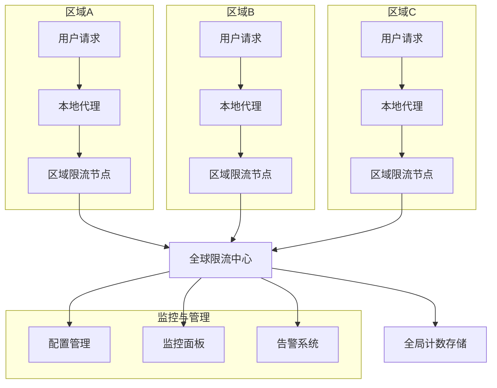
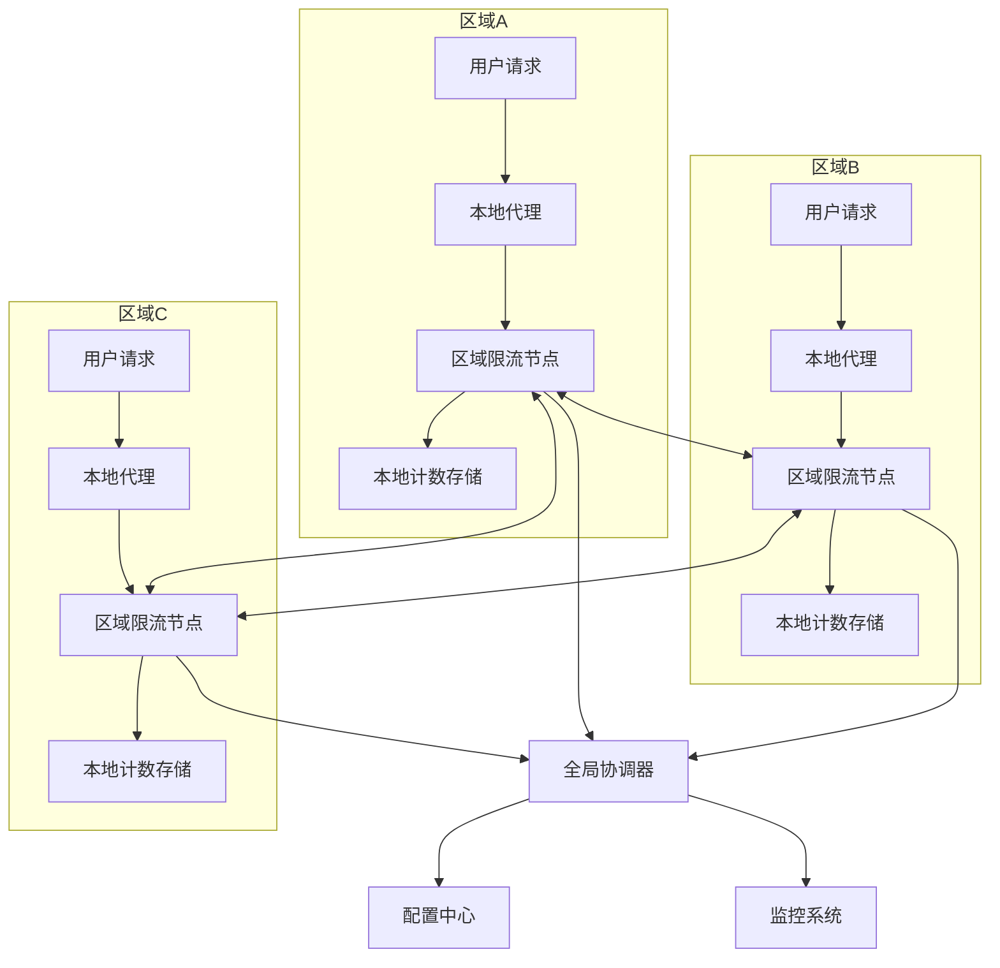

在全球化业务日益普及的今天，许多企业都需要在全球多个地区部署服务，为不同地区的用户提供就近访问。这种全球分布式架构在带来用户体验提升的同时，也给限流系统带来了新的挑战。如何在全球范围内实现统一、高效、可靠的限流控制，成为了一个重要的技术课题。本附录将深入探讨全球分布式限流架构的设计思路、技术挑战和实现方案。

## 全球分布式架构概述

### 全球部署的特点

全球分布式架构具有以下特点：

1. **多地域部署**：服务部署在全球多个地理区域
2. **用户就近访问**：通过CDN、DNS解析等技术引导用户访问最近的节点
3. **数据同步需求**：需要在不同区域间同步关键数据
4. **网络延迟差异**：不同区域间的网络延迟存在显著差异
5. **法规合规要求**：需要满足不同国家和地区的数据保护法规

### 全球限流的挑战

在全球分布式环境中实现限流面临以下挑战：

1. **数据一致性**：如何保证全球范围内的限流计数一致性
2. **网络延迟**：跨区域网络延迟影响限流决策的实时性
3. **故障容错**：单个区域故障不应影响全局服务
4. **配置同步**：全球范围内的限流规则需要统一管理
5. **性能要求**：全球限流不应显著增加请求处理延迟

## 架构设计模式

### 集中式全球限流架构



集中式全球限流架构的特点：

1. **统一决策**：所有限流决策由全球中心节点统一处理
2. **数据一致性**：全局计数存储保证数据一致性
3. **配置统一**：限流规则在全球范围内统一管理
4. **延迟较高**：跨区域网络延迟影响性能

### 分布式协同限流架构



分布式协同限流架构的特点：

1. **本地决策**：各区域节点可独立进行限流决策
2. **协同同步**：区域间定期同步计数信息
3. **故障隔离**：单区域故障不影响其他区域
4. **性能优化**：本地处理减少网络延迟

## 核心组件设计

### 全局协调器

```java
// 全局协调器实现
@Component
public class GlobalCoordinator {
    private final RedisTemplate<String, String> redisTemplate;
    private final RegionManager regionManager;
    private final ScheduledExecutorService syncScheduler = Executors.newScheduledThreadPool(2);
    
    public GlobalCoordinator(RedisTemplate<String, String> redisTemplate,
                           RegionManager regionManager) {
        this.redisTemplate = redisTemplate;
        this.regionManager = regionManager;
        
        // 启动定期同步任务
        startPeriodicSync();
    }
    
    /**
     * 全局限流决策
     */
    public GlobalRateLimitDecision makeGlobalDecision(RateLimitRequest request) {
        try {
            String resource = request.getResource();
            Map<String, String> dimensions = request.getDimensions();
            int permits = request.getPermits();
            
            // 1. 获取全局计数
            GlobalCounter globalCounter = getGlobalCounter(resource, dimensions);
            
            // 2. 获取限流规则
            RateLimitRule rule = getGlobalRateLimitRule(resource);
            
            // 3. 检查是否超过全局限制
            if (globalCounter.getCount() + permits > rule.getGlobalLimit()) {
                return GlobalRateLimitDecision.denied("Global limit exceeded");
            }
            
            // 4. 检查区域配额
            String currentRegion = regionManager.getCurrentRegion();
            RegionQuota regionQuota = globalCounter.getRegionQuota(currentRegion);
            
            if (regionQuota.getUsed() + permits > regionQuota.getLimit()) {
                return GlobalRateLimitDecision.denied("Region quota exceeded");
            }
            
            // 5. 允许通过，更新计数
            updateGlobalCounter(resource, dimensions, permits, currentRegion);
            
            return GlobalRateLimitDecision.allowed()
                .remaining(rule.getGlobalLimit() - globalCounter.getCount() - permits)
                .resetTime(calculateResetTime(rule.getWindow()));
        } catch (Exception e) {
            log.error("Failed to make global rate limit decision", e);
            // 出错时保守处理，允许通过
            return GlobalRateLimitDecision.allowed();
        }
    }
    
    /**
     * 区域间计数同步
     */
    public void syncRegionCounters() {
        try {
            List<String> regions = regionManager.getAllRegions();
            String currentRegion = regionManager.getCurrentRegion();
            
            for (String region : regions) {
                if (!region.equals(currentRegion)) {
                    syncWithRegion(region);
                }
            }
        } catch (Exception e) {
            log.error("Failed to sync region counters", e);
        }
    }
    
    private void syncWithRegion(String region) {
        try {
            // 1. 获取本地计数快照
            Map<String, RegionCounterSnapshot> localSnapshot = getLocalCounterSnapshot();
            
            // 2. 发送到目标区域
            RegionSyncRequest syncRequest = RegionSyncRequest.builder()
                .sourceRegion(regionManager.getCurrentRegion())
                .targetRegion(region)
                .snapshots(localSnapshot)
                .timestamp(System.currentTimeMillis())
                .build();
                
            regionManager.sendSyncRequest(region, syncRequest);
            
            // 3. 接收目标区域的计数快照
            RegionSyncResponse syncResponse = regionManager.receiveSyncResponse(region);
            
            // 4. 合并计数信息
            mergeCounterSnapshots(syncResponse.getSnapshots());
            
        } catch (Exception e) {
            log.warn("Failed to sync with region: " + region, e);
        }
    }
    
    /**
     * 获取全局计数器
     */
    private GlobalCounter getGlobalCounter(String resource, Map<String, String> dimensions) {
        try {
            String key = buildGlobalCounterKey(resource, dimensions);
            String json = redisTemplate.opsForValue().get(key);
            
            if (json != null && !json.isEmpty()) {
                ObjectMapper mapper = new ObjectMapper();
                return mapper.readValue(json, GlobalCounter.class);
            }
        } catch (Exception e) {
            log.warn("Failed to get global counter for resource: " + resource, e);
        }
        
        return GlobalCounter.empty();
    }
    
    /**
     * 更新全局计数器
     */
    private void updateGlobalCounter(String resource, Map<String, String> dimensions, 
                                   int permits, String region) {
        try {
            String key = buildGlobalCounterKey(resource, dimensions);
            GlobalCounter counter = getGlobalCounter(resource, dimensions);
            
            // 更新全局计数
            counter.incrementCount(permits);
            
            // 更新区域配额使用
            counter.updateRegionQuota(region, permits);
            
            // 设置过期时间
            counter.setExpireTime(System.currentTimeMillis() + getWindowMillis(resource));
            
            // 保存到Redis
            ObjectMapper mapper = new ObjectMapper();
            String json = mapper.writeValueAsString(counter);
            redisTemplate.opsForValue().set(key, json, Duration.ofSeconds(getWindowSeconds(resource)));
        } catch (Exception e) {
            log.error("Failed to update global counter", e);
        }
    }
    
    private String buildGlobalCounterKey(String resource, Map<String, String> dimensions) {
        StringBuilder keyBuilder = new StringBuilder("global_rate_limit:");
        keyBuilder.append(resource);
        
        dimensions.entrySet().stream()
            .sorted(Map.Entry.comparingByKey())
            .forEach(entry -> keyBuilder.append(":").append(entry.getKey())
                .append("=").append(entry.getValue()));
                
        return keyBuilder.toString();
    }
    
    private void startPeriodicSync() {
        // 每30秒进行一次区域间同步
        syncScheduler.scheduleAtFixedRate(this::syncRegionCounters, 
            30, 30, TimeUnit.SECONDS);
    }
    
    // 数据类定义
    @Data
    @Builder
    public static class GlobalRateLimitDecision {
        private boolean allowed;
        private String reason;
        private long remaining;
        private long resetTime;
        
        public static GlobalRateLimitDecision allowed() {
            return GlobalRateLimitDecision.builder()
                .allowed(true)
                .reason("OK")
                .build();
        }
        
        public static GlobalRateLimitDecision denied(String reason) {
            return GlobalRateLimitDecision.builder()
                .allowed(false)
                .reason(reason)
                .build();
        }
    }
    
    @Data
    public static class GlobalCounter {
        private long count;
        private long expireTime;
        private Map<String, RegionQuota> regionQuotas;
        
        public static GlobalCounter empty() {
            GlobalCounter counter = new GlobalCounter();
            counter.count = 0;
            counter.expireTime = 0;
            counter.regionQuotas = new HashMap<>();
            return counter;
        }
        
        public void incrementCount(int permits) {
            this.count += permits;
        }
        
        public void updateRegionQuota(String region, int permits) {
            regionQuotas.computeIfAbsent(region, k -> new RegionQuota())
                .incrementUsed(permits);
        }
        
        public RegionQuota getRegionQuota(String region) {
            return regionQuotas.getOrDefault(region, new RegionQuota());
        }
    }
    
    @Data
    public static class RegionQuota {
        private long limit;
        private long used;
        
        public void incrementUsed(int permits) {
            this.used += permits;
        }
    }
}
```

### 区域限流节点

```java
// 区域限流节点实现
@Component
public class RegionalRateLimiter {
    private final RedisTemplate<String, String> redisTemplate;
    private final GlobalCoordinator globalCoordinator;
    private final RegionManager regionManager;
    private final LocalCounterCache localCache;
    
    public RegionalRateLimiter(RedisTemplate<String, String> redisTemplate,
                             GlobalCoordinator globalCoordinator,
                             RegionManager regionManager,
                             LocalCounterCache localCache) {
        this.redisTemplate = redisTemplate;
        this.globalCoordinator = globalCoordinator;
        this.regionManager = regionManager;
        this.localCache = localCache;
    }
    
    /**
     * 区域限流检查
     */
    public RateLimitResult checkRateLimit(RateLimitRequest request) {
        long startTime = System.currentTimeMillis();
        
        try {
            String resource = request.getResource();
            Map<String, String> dimensions = request.getDimensions();
            int permits = request.getPermits();
            
            // 1. 检查本地缓存
            LocalCounter localCounter = localCache.getCounter(resource, dimensions);
            RateLimitRule rule = getRateLimitRule(resource);
            
            if (localCounter != null) {
                // 检查本地计数
                if (localCounter.getCount() + permits > rule.getLocalLimit()) {
                    recordLocalLimitEvent(request, localCounter.getCount());
                    return RateLimitResult.denied(calculateResetTime(rule.getWindow()));
                }
            }
            
            // 2. 检查全局限制
            GlobalCoordinator.GlobalRateLimitDecision globalDecision = 
                globalCoordinator.makeGlobalDecision(request);
                
            if (!globalDecision.isAllowed()) {
                recordGlobalLimitEvent(request, globalDecision.getReason());
                return RateLimitResult.denied(globalDecision.getResetTime());
            }
            
            // 3. 允许通过，更新本地计数
            updateLocalCounter(resource, dimensions, permits);
            
            // 4. 记录成功事件
            recordSuccessEvent(request, System.currentTimeMillis() - startTime);
            
            return RateLimitResult.allowed(globalDecision.getRemaining(), globalDecision.getResetTime());
            
        } catch (Exception e) {
            log.error("Failed to check rate limit", e);
            // 出错时保守处理，允许通过
            return RateLimitResult.allowed(Long.MAX_VALUE, System.currentTimeMillis() + 60000);
        }
    }
    
    /**
     * 处理区域间同步请求
     */
    public RegionSyncResponse handleSyncRequest(RegionSyncRequest request) {
        try {
            // 1. 获取本地计数快照
            Map<String, RegionCounterSnapshot> localSnapshot = getLocalCounterSnapshot();
            
            // 2. 合并接收到的快照
            mergeRemoteSnapshots(request.getSnapshots());
            
            // 3. 返回本地快照
            return RegionSyncResponse.builder()
                .sourceRegion(regionManager.getCurrentRegion())
                .targetRegion(request.getSourceRegion())
                .snapshots(localSnapshot)
                .timestamp(System.currentTimeMillis())
                .build();
                
        } catch (Exception e) {
            log.error("Failed to handle sync request", e);
            return RegionSyncResponse.builder()
                .error("Failed to process sync request")
                .build();
        }
    }
    
    private void updateLocalCounter(String resource, Map<String, String> dimensions, int permits) {
        try {
            String key = buildLocalCounterKey(resource, dimensions);
            LocalCounter counter = localCache.getCounter(resource, dimensions);
            
            if (counter == null) {
                counter = LocalCounter.builder()
                    .count(permits)
                    .lastUpdate(System.currentTimeMillis())
                    .build();
            } else {
                counter.setCount(counter.getCount() + permits);
                counter.setLastUpdate(System.currentTimeMillis());
            }
            
            localCache.putCounter(resource, dimensions, counter);
            
            // 同步到Redis
            redisTemplate.opsForValue().set(key, String.valueOf(counter.getCount()), 
                Duration.ofSeconds(getWindowSeconds(resource)));
                
        } catch (Exception e) {
            log.error("Failed to update local counter", e);
        }
    }
    
    private Map<String, RegionCounterSnapshot> getLocalCounterSnapshot() {
        Map<String, RegionCounterSnapshot> snapshot = new HashMap<>();
        
        try {
            // 获取本地所有计数器
            Set<String> keys = redisTemplate.keys("local_rate_limit:*");
            if (keys != null) {
                for (String key : keys) {
                    try {
                        String value = redisTemplate.opsForValue().get(key);
                        if (value != null) {
                            long count = Long.parseLong(value);
                            String resource = extractResourceFromKey(key);
                            
                            RegionCounterSnapshot counterSnapshot = RegionCounterSnapshot.builder()
                                .region(regionManager.getCurrentRegion())
                                .resource(resource)
                                .count(count)
                                .timestamp(System.currentTimeMillis())
                                .build();
                                
                            snapshot.put(resource, counterSnapshot);
                        }
                    } catch (Exception e) {
                        log.warn("Failed to process key: " + key, e);
                    }
                }
            }
        } catch (Exception e) {
            log.error("Failed to get local counter snapshot", e);
        }
        
        return snapshot;
    }
    
    private void mergeRemoteSnapshots(Map<String, RegionCounterSnapshot> remoteSnapshots) {
        try {
            for (Map.Entry<String, RegionCounterSnapshot> entry : remoteSnapshots.entrySet()) {
                String resource = entry.getKey();
                RegionCounterSnapshot snapshot = entry.getValue();
                
                // 更新全局协调器中的计数
                // 这里简化处理，实际实现中需要更复杂的合并逻辑
                log.debug("Merged remote snapshot for resource: {} from region: {} with count: {}", 
                    resource, snapshot.getRegion(), snapshot.getCount());
            }
        } catch (Exception e) {
            log.error("Failed to merge remote snapshots", e);
        }
    }
    
    private String buildLocalCounterKey(String resource, Map<String, String> dimensions) {
        StringBuilder keyBuilder = new StringBuilder("local_rate_limit:");
        keyBuilder.append(regionManager.getCurrentRegion()).append(":");
        keyBuilder.append(resource);
        
        dimensions.entrySet().stream()
            .sorted(Map.Entry.comparingByKey())
            .forEach(entry -> keyBuilder.append(":").append(entry.getKey())
                .append("=").append(entry.getValue()));
                
        return keyBuilder.toString();
    }
    
    private String extractResourceFromKey(String key) {
        // 从键名中提取资源标识
        String[] parts = key.split(":", 3);
        return parts.length > 2 ? parts[2] : key;
    }
    
    private void recordLocalLimitEvent(RateLimitRequest request, long currentCount) {
        log.info("Local rate limit triggered - Resource: {}, Current count: {}", 
            request.getResource(), currentCount);
        // 发送到监控系统
    }
    
    private void recordGlobalLimitEvent(RateLimitRequest request, String reason) {
        log.info("Global rate limit triggered - Resource: {}, Reason: {}", 
            request.getResource(), reason);
        // 发送到监控系统
    }
    
    private void recordSuccessEvent(RateLimitRequest request, long duration) {
        log.debug("Rate limit check succeeded - Resource: {}, Duration: {}ms", 
            request.getResource(), duration);
        // 发送到监控系统
    }
    
    // 数据类定义
    @Data
    @Builder
    public static class RegionSyncRequest {
        private String sourceRegion;
        private String targetRegion;
        private Map<String, RegionCounterSnapshot> snapshots;
        private long timestamp;
    }
    
    @Data
    @Builder
    public static class RegionSyncResponse {
        private String sourceRegion;
        private String targetRegion;
        private Map<String, RegionCounterSnapshot> snapshots;
        private long timestamp;
        private String error;
    }
    
    @Data
    @Builder
    public static class RegionCounterSnapshot {
        private String region;
        private String resource;
        private long count;
        private long timestamp;
    }
}
```

## 数据同步策略

### 最终一致性模型

```java
// 最终一致性数据同步实现
@Component
public class EventualConsistencySync {
    private final RedisTemplate<String, String> redisTemplate;
    private final RegionManager regionManager;
    private final ScheduledExecutorService syncScheduler = Executors.newScheduledThreadPool(1);
    private final ObjectMapper objectMapper = new ObjectMapper();
    
    public EventualConsistencySync(RedisTemplate<String, String> redisTemplate,
                                 RegionManager regionManager) {
        this.redisTemplate = redisTemplate;
        this.regionManager = regionManager;
        
        // 启动定期同步任务
        startSyncTasks();
    }
    
    /**
     * 异步更新其他区域
     */
    public void asyncUpdateOtherRegions(String resource, Map<String, String> dimensions, 
                                      int permits, String currentRegion) {
        try {
            // 构造更新事件
            CounterUpdateEvent updateEvent = CounterUpdateEvent.builder()
                .resource(resource)
                .dimensions(dimensions)
                .permits(permits)
                .region(currentRegion)
                .timestamp(System.currentTimeMillis())
                .build();
                
            String eventJson = objectMapper.writeValueAsString(updateEvent);
            
            // 发布到其他区域
            List<String> otherRegions = regionManager.getOtherRegions(currentRegion);
            for (String region : otherRegions) {
                String channel = "counter_updates:" + region;
                redisTemplate.convertAndSend(channel, eventJson);
            }
        } catch (Exception e) {
            log.error("Failed to async update other regions", e);
        }
    }
    
    /**
     * 处理接收到的更新事件
     */
    @EventListener
    public void handleCounterUpdate(CounterUpdateEvent updateEvent) {
        try {
            String resource = updateEvent.getResource();
            Map<String, String> dimensions = updateEvent.getDimensions();
            int permits = updateEvent.getPermits();
            String sourceRegion = updateEvent.getRegion();
            
            // 更新本地计数
            updateLocalCounter(resource, dimensions, permits, sourceRegion);
            
        } catch (Exception e) {
            log.error("Failed to handle counter update event", e);
        }
    }
    
    /**
     * 定期全量同步
     */
    public void fullSync() {
        try {
            String currentRegion = regionManager.getCurrentRegion();
            
            // 获取本地快照
            RegionSnapshot localSnapshot = createLocalSnapshot();
            
            // 发送到其他区域
            List<String> otherRegions = regionManager.getOtherRegions(currentRegion);
            for (String region : otherRegions) {
                sendSnapshotToRegion(region, localSnapshot);
            }
            
            // 接收其他区域的快照并合并
            for (String region : otherRegions) {
                RegionSnapshot remoteSnapshot = receiveSnapshotFromRegion(region);
                if (remoteSnapshot != null) {
                    mergeSnapshot(remoteSnapshot);
                }
            }
            
        } catch (Exception e) {
            log.error("Failed to perform full sync", e);
        }
    }
    
    private RegionSnapshot createLocalSnapshot() {
        RegionSnapshot snapshot = RegionSnapshot.builder()
            .region(regionManager.getCurrentRegion())
            .timestamp(System.currentTimeMillis())
            .counters(new HashMap<>())
            .build();
            
        try {
            Set<String> keys = redisTemplate.keys("rate_limit:*");
            if (keys != null) {
                for (String key : keys) {
                    try {
                        String value = redisTemplate.opsForValue().get(key);
                        if (value != null) {
                            long count = Long.parseLong(value);
                            snapshot.getCounters().put(key, count);
                        }
                    } catch (Exception e) {
                        log.warn("Failed to process key: " + key, e);
                    }
                }
            }
        } catch (Exception e) {
            log.error("Failed to create local snapshot", e);
        }
        
        return snapshot;
    }
    
    private void sendSnapshotToRegion(String region, RegionSnapshot snapshot) {
        try {
            String channel = "region_snapshots:" + region;
            String json = objectMapper.writeValueAsString(snapshot);
            redisTemplate.convertAndSend(channel, json);
        } catch (Exception e) {
            log.error("Failed to send snapshot to region: " + region, e);
        }
    }
    
    private RegionSnapshot receiveSnapshotFromRegion(String region) {
        // 实际实现中需要从消息队列或Redis中获取快照
        return null;
    }
    
    private void mergeSnapshot(RegionSnapshot snapshot) {
        try {
            String sourceRegion = snapshot.getRegion();
            Map<String, Long> counters = snapshot.getCounters();
            
            for (Map.Entry<String, Long> entry : counters.entrySet()) {
                String key = entry.getKey();
                Long remoteCount = entry.getValue();
                
                // 获取本地计数
                String localValue = redisTemplate.opsForValue().get(key);
                Long localCount = localValue != null ? Long.parseLong(localValue) : 0L;
                
                // 取最大值保证不丢失计数
                Long mergedCount = Math.max(localCount, remoteCount);
                
                // 更新本地计数
                redisTemplate.opsForValue().set(key, mergedCount.toString());
            }
        } catch (Exception e) {
            log.error("Failed to merge snapshot", e);
        }
    }
    
    private void updateLocalCounter(String resource, Map<String, String> dimensions, 
                                  int permits, String sourceRegion) {
        try {
            String key = buildCounterKey(resource, dimensions, sourceRegion);
            
            // 原子增加计数
            Long newCount = redisTemplate.boundValueOps(key).increment(permits);
            
            // 设置过期时间
            redisTemplate.expire(key, Duration.ofSeconds(getWindowSeconds(resource)));
            
            log.debug("Updated counter for region {}: {} = {}", sourceRegion, key, newCount);
        } catch (Exception e) {
            log.error("Failed to update local counter", e);
        }
    }
    
    private String buildCounterKey(String resource, Map<String, String> dimensions, String region) {
        StringBuilder keyBuilder = new StringBuilder("rate_limit:");
        keyBuilder.append(region).append(":");
        keyBuilder.append(resource);
        
        dimensions.entrySet().stream()
            .sorted(Map.Entry.comparingByKey())
            .forEach(entry -> keyBuilder.append(":").append(entry.getKey())
                .append("=").append(entry.getValue()));
                
        return keyBuilder.toString();
    }
    
    private void startSyncTasks() {
        // 每分钟进行一次全量同步
        syncScheduler.scheduleAtFixedRate(this::fullSync, 60, 60, TimeUnit.SECONDS);
    }
    
    // 数据类定义
    @Data
    @Builder
    public static class CounterUpdateEvent {
        private String resource;
        private Map<String, String> dimensions;
        private int permits;
        private String region;
        private long timestamp;
    }
    
    @Data
    @Builder
    public static class RegionSnapshot {
        private String region;
        private long timestamp;
        private Map<String, Long> counters;
    }
}
```

## 容错与降级机制

### 区域故障处理

```java
// 区域故障处理机制
@Component
public class RegionalFaultTolerance {
    private final RedisTemplate<String, String> redisTemplate;
    private final RegionManager regionManager;
    private final CircuitBreaker circuitBreaker;
    private final ScheduledExecutorService healthCheckScheduler = Executors.newScheduledThreadPool(1);
    
    public RegionalFaultTolerance(RedisTemplate<String, String> redisTemplate,
                                RegionManager regionManager) {
        this.redisTemplate = redisTemplate;
        this.regionManager = regionManager;
        this.circuitBreaker = CircuitBreaker.ofDefaults("global-coordinator");
        
        // 启动健康检查
        startHealthChecks();
    }
    
    /**
     * 容错限流检查
     */
    public RateLimitResult faultTolerantCheck(RateLimitRequest request) {
        try {
            String currentRegion = regionManager.getCurrentRegion();
            
            // 1. 检查全局协调器是否可用
            if (isGlobalCoordinatorAvailable()) {
                // 全局协调器可用，使用全局限流
                return checkWithGlobalCoordinator(request);
            } else {
                // 全局协调器不可用，降级到区域限流
                log.warn("Global coordinator unavailable, falling back to regional rate limiting");
                return checkWithRegionalFallback(request);
            }
        } catch (Exception e) {
            log.error("Failed to perform fault tolerant rate limit check", e);
            // 出错时保守处理，允许通过
            return RateLimitResult.allowed(Long.MAX_VALUE, System.currentTimeMillis() + 60000);
        }
    }
    
    /**
     * 检查全局协调器可用性
     */
    public boolean isGlobalCoordinatorAvailable() {
        try {
            return circuitBreaker.tryAcquirePermission() && 
                   checkGlobalCoordinatorHealth();
        } catch (Exception e) {
            log.warn("Global coordinator health check failed", e);
            return false;
        }
    }
    
    private boolean checkGlobalCoordinatorHealth() {
        try {
            // 简化的健康检查
            String healthKey = "global_coordinator:health";
            String timestamp = redisTemplate.opsForValue().get(healthKey);
            
            if (timestamp != null) {
                long lastUpdate = Long.parseLong(timestamp);
                long currentTime = System.currentTimeMillis();
                // 如果5分钟内有更新，则认为健康
                return (currentTime - lastUpdate) < 300000;
            }
            return false;
        } catch (Exception e) {
            log.warn("Failed to check global coordinator health", e);
            return false;
        }
    }
    
    private RateLimitResult checkWithGlobalCoordinator(RateLimitRequest request) {
        try {
            return circuitBreaker.executeSupplier(() -> {
                // 调用全局协调器进行限流检查
                // 这里简化处理，实际实现中需要调用具体的全局协调器
                return RateLimitResult.allowed(1000, System.currentTimeMillis() + 60000);
            });
        } catch (Exception e) {
            log.error("Global coordinator check failed", e);
            // 熔断状态下直接降级
            return checkWithRegionalFallback(request);
        }
    }
    
    private RateLimitResult checkWithRegionalFallback(RateLimitRequest request) {
        try {
            String resource = request.getResource();
            int permits = request.getPermits();
            
            // 使用区域配额进行限流
            String key = buildRegionalQuotaKey(resource, regionManager.getCurrentRegion());
            String currentStr = redisTemplate.opsForValue().get(key);
            long current = currentStr != null ? Long.parseLong(currentStr) : 0;
            
            long regionalLimit = getRegionalLimit(resource);
            if (current + permits > regionalLimit) {
                return RateLimitResult.denied(calculateResetTime(getWindowSeconds(resource)));
            }
            
            // 增加计数
            redisTemplate.opsForValue().increment(key, permits);
            redisTemplate.expire(key, Duration.ofSeconds(getWindowSeconds(resource)));
            
            // 计算剩余配额
            long remaining = regionalLimit - current - permits;
            return RateLimitResult.allowed(remaining, calculateResetTime(getWindowSeconds(resource)));
            
        } catch (Exception e) {
            log.error("Regional fallback check failed", e);
            // 最终降级，允许通过
            return RateLimitResult.allowed(Long.MAX_VALUE, System.currentTimeMillis() + 60000);
        }
    }
    
    /**
     * 区域间通信故障处理
     */
    public void handleInterRegionCommunicationFailure(String targetRegion, Exception error) {
        try {
            log.warn("Inter-region communication failed with region: " + targetRegion, error);
            
            // 记录故障区域
            markRegionAsUnreachable(targetRegion);
            
            // 触发告警
            triggerInterRegionFailureAlert(targetRegion, error);
            
            // 调整区域配额
            adjustRegionalQuotas(targetRegion);
            
        } catch (Exception e) {
            log.error("Failed to handle inter-region communication failure", e);
        }
    }
    
    private void markRegionAsUnreachable(String region) {
        try {
            String key = "region_status:" + region;
            redisTemplate.opsForValue().set(key, "unreachable", Duration.ofMinutes(5));
        } catch (Exception e) {
            log.error("Failed to mark region as unreachable: " + region, e);
        }
    }
    
    private void triggerInterRegionFailureAlert(String region, Exception error) {
        // 实现告警逻辑
        log.error("Inter-region communication failure alert triggered for region: " + region);
    }
    
    private void adjustRegionalQuotas(String failedRegion) {
        try {
            // 获取所有区域
            List<String> allRegions = regionManager.getAllRegions();
            long failedRegionQuota = getRegionalQuota(failedRegion);
            
            // 将故障区域的配额重新分配给其他区域
            long quotaPerRegion = failedRegionQuota / (allRegions.size() - 1);
            
            for (String region : allRegions) {
                if (!region.equals(failedRegion)) {
                    increaseRegionalQuota(region, quotaPerRegion);
                }
            }
        } catch (Exception e) {
            log.error("Failed to adjust regional quotas", e);
        }
    }
    
    private void startHealthChecks() {
        // 每30秒检查一次区域健康状态
        healthCheckScheduler.scheduleAtFixedRate(this::performHealthChecks, 
            30, 30, TimeUnit.SECONDS);
    }
    
    private void performHealthChecks() {
        try {
            List<String> regions = regionManager.getAllRegions();
            String currentRegion = regionManager.getCurrentRegion();
            
            for (String region : regions) {
                if (!region.equals(currentRegion)) {
                    checkRegionHealth(region);
                }
            }
        } catch (Exception e) {
            log.error("Failed to perform health checks", e);
        }
    }
    
    private void checkRegionHealth(String region) {
        try {
            // 检查区域是否可达
            boolean isReachable = regionManager.pingRegion(region);
            
            String key = "region_status:" + region;
            if (isReachable) {
                redisTemplate.opsForValue().set(key, "healthy", Duration.ofMinutes(5));
            } else {
                redisTemplate.opsForValue().set(key, "unreachable", Duration.ofMinutes(5));
            }
        } catch (Exception e) {
            log.warn("Failed to check health for region: " + region, e);
        }
    }
    
    private String buildRegionalQuotaKey(String resource, String region) {
        return "regional_quota:" + region + ":" + resource;
    }
    
    private long getRegionalLimit(String resource) {
        // 获取区域限流阈值
        return 1000; // 示例值
    }
    
    private long getRegionalQuota(String region) {
        // 获取区域配额
        return 1000; // 示例值
    }
    
    private void increaseRegionalQuota(String region, long increment) {
        // 增加区域配额
        log.info("Increased quota for region {} by {}", region, increment);
    }
}
```

## 监控与告警

### 全局监控面板

```java
// 全局限流监控
@Component
public class GlobalRateLimitMonitoring {
    private final MeterRegistry meterRegistry;
    private final RedisTemplate<String, String> redisTemplate;
    private final RegionManager regionManager;
    
    public GlobalRateLimitMonitoring(MeterRegistry meterRegistry,
                                   RedisTemplate<String, String> redisTemplate,
                                   RegionManager regionManager) {
        this.meterRegistry = meterRegistry;
        this.redisTemplate = redisTemplate;
        this.regionManager = regionManager;
        
        // 注册监控指标
        registerMetrics();
    }
    
    private void registerMetrics() {
        // 全局限流触发次数
        Counter.builder("global_rate_limit.triggered")
            .description("Number of global rate limit triggers")
            .register(meterRegistry);
            
        // 区域限流触发次数
        Counter.builder("regional_rate_limit.triggered")
            .description("Number of regional rate limit triggers")
            .tag("region", regionManager.getCurrentRegion())
            .register(meterRegistry);
            
        // 全局限流拒绝请求数
        Counter.builder("global_rate_limit.rejected")
            .description("Number of requests rejected by global rate limit")
            .register(meterRegistry);
            
        // 区域间同步延迟
        Timer.builder("inter_region.sync_latency")
            .description("Inter-region synchronization latency")
            .register(meterRegistry);
            
        // 全局协调器响应时间
        Timer.builder("global_coordinator.response_time")
            .description("Global coordinator response time")
            .register(meterRegistry);
    }
    
    public void recordGlobalLimitTrigger(String resource, String reason) {
        Counter.builder("global_rate_limit.triggered")
            .tag("resource", resource)
            .tag("reason", reason)
            .register(meterRegistry)
            .increment();
    }
    
    public void recordRegionalLimitTrigger(String resource, String region) {
        Counter.builder("regional_rate_limit.triggered")
            .tag("resource", resource)
            .tag("region", region)
            .register(meterRegistry)
            .increment();
    }
    
    public void recordRejectedRequest(String resource, String region) {
        Counter.builder("global_rate_limit.rejected")
            .tag("resource", resource)
            .tag("region", region)
            .register(meterRegistry)
            .increment();
    }
    
    public Timer.Sample startSyncTimer() {
        return Timer.start(meterRegistry);
    }
    
    public void recordSyncTime(Timer.Sample sample, String sourceRegion, String targetRegion) {
        sample.stop(Timer.builder("inter_region.sync_latency")
            .tag("source_region", sourceRegion)
            .tag("target_region", targetRegion)
            .register(meterRegistry));
    }
    
    public Timer.Sample startCoordinatorTimer() {
        return Timer.start(meterRegistry);
    }
    
    public void recordCoordinatorTime(Timer.Sample sample) {
        sample.stop(Timer.builder("global_coordinator.response_time")
            .register(meterRegistry));
    }
    
    /**
     * 生成全球限流报告
     */
    public GlobalRateLimitReport generateReport() {
        try {
            GlobalRateLimitReport report = GlobalRateLimitReport.builder()
                .generatedAt(System.currentTimeMillis())
                .currentRegion(regionManager.getCurrentRegion())
                .regions(regionManager.getAllRegions())
                .build();
                
            // 收集各区域的限流统计数据
            collectRegionalStats(report);
            
            // 收集全局限流统计数据
            collectGlobalStats(report);
            
            // 收集同步状态
            collectSyncStats(report);
            
            return report;
        } catch (Exception e) {
            log.error("Failed to generate global rate limit report", e);
            return GlobalRateLimitReport.builder()
                .error("Failed to generate report: " + e.getMessage())
                .build();
        }
    }
    
    private void collectRegionalStats(GlobalRateLimitReport report) {
        try {
            List<String> regions = regionManager.getAllRegions();
            Map<String, RegionStats> regionStats = new HashMap<>();
            
            for (String region : regions) {
                RegionStats stats = RegionStats.builder()
                    .region(region)
                    .localLimitTriggers(getCounterValue("regional_rate_limit.triggered", region))
                    .rejectedRequests(getCounterValue("global_rate_limit.rejected", region))
                    .status(getRegionStatus(region))
                    .build();
                    
                regionStats.put(region, stats);
            }
            
            report.setRegionStats(regionStats);
        } catch (Exception e) {
            log.error("Failed to collect regional stats", e);
        }
    }
    
    private void collectGlobalStats(GlobalRateLimitReport report) {
        try {
            GlobalStats stats = GlobalStats.builder()
                .globalLimitTriggers(getCounterValue("global_rate_limit.triggered"))
                .totalRejectedRequests(getCounterValue("global_rate_limit.rejected"))
                .averageResponseTime(getAverageResponseTime())
                .build();
                
            report.setGlobalStats(stats);
        } catch (Exception e) {
            log.error("Failed to collect global stats", e);
        }
    }
    
    private void collectSyncStats(GlobalRateLimitReport report) {
        try {
            SyncStats stats = SyncStats.builder()
                .lastSyncTime(getLastSyncTime())
                .syncErrors(getSyncErrors())
                .averageSyncLatency(getAverageSyncLatency())
                .build();
                
            report.setSyncStats(stats);
        } catch (Exception e) {
            log.error("Failed to collect sync stats", e);
        }
    }
    
    private long getCounterValue(String counterName) {
        try {
            // 简化实现，实际需要从监控系统获取
            return 0;
        } catch (Exception e) {
            log.warn("Failed to get counter value for: " + counterName, e);
            return 0;
        }
    }
    
    private long getCounterValue(String counterName, String region) {
        try {
            // 简化实现，实际需要从监控系统获取
            return 0;
        } catch (Exception e) {
            log.warn("Failed to get counter value for: " + counterName + ", region: " + region, e);
            return 0;
        }
    }
    
    private String getRegionStatus(String region) {
        try {
            String key = "region_status:" + region;
            String status = redisTemplate.opsForValue().get(key);
            return status != null ? status : "unknown";
        } catch (Exception e) {
            log.warn("Failed to get region status for: " + region, e);
            return "unknown";
        }
    }
    
    private double getAverageResponseTime() {
        // 获取平均响应时间
        return 0.0; // 示例值
    }
    
    private long getLastSyncTime() {
        // 获取最后同步时间
        return System.currentTimeMillis() - 30000; // 示例值
    }
    
    private int getSyncErrors() {
        // 获取同步错误数
        return 0; // 示例值
    }
    
    private double getAverageSyncLatency() {
        // 获取平均同步延迟
        return 0.0; // 示例值
    }
    
    // 数据类定义
    @Data
    @Builder
    public static class GlobalRateLimitReport {
        private long generatedAt;
        private String currentRegion;
        private List<String> regions;
        private Map<String, RegionStats> regionStats;
        private GlobalStats globalStats;
        private SyncStats syncStats;
        private String error;
    }
    
    @Data
    @Builder
    public static class RegionStats {
        private String region;
        private long localLimitTriggers;
        private long rejectedRequests;
        private String status;
    }
    
    @Data
    @Builder
    public static class GlobalStats {
        private long globalLimitTriggers;
        private long totalRejectedRequests;
        private double averageResponseTime;
    }
    
    @Data
    @Builder
    public static class SyncStats {
        private long lastSyncTime;
        private int syncErrors;
        private double averageSyncLatency;
    }
}
```

## 部署与运维

### 多区域部署配置

```yaml
# 全球限流系统部署配置示例
global_rate_limit:
  # 全局配置
  global:
    # 全局协调器地址
    coordinator_address: "global-coordinator.example.com:8080"
    # 全局存储配置
    storage:
      type: "redis-cluster"
      addresses:
        - "redis-global-1.example.com:6379"
        - "redis-global-2.example.com:6379"
        - "redis-global-3.example.com:6379"
      password: "${REDIS_GLOBAL_PASSWORD}"
      
  # 区域配置
  regions:
    - name: "us-east"
      enabled: true
      local_address: "us-east-limiter.example.com:8080"
      storage:
        type: "redis"
        address: "redis-us-east.example.com:6379"
        password: "${REDIS_US_EAST_PASSWORD}"
      quota_percentage: 40
      
    - name: "eu-west"
      enabled: true
      local_address: "eu-west-limiter.example.com:8080"
      storage:
        type: "redis"
        address: "redis-eu-west.example.com:6379"
        password: "${REDIS_EU_WEST_PASSWORD}"
      quota_percentage: 35
      
    - name: "ap-southeast"
      enabled: true
      local_address: "ap-southeast-limiter.example.com:8080"
      storage:
        type: "redis"
        address: "redis-ap-southeast.example.com:6379"
        password: "${REDIS_AP_SOUTHEAST_PASSWORD}"
      quota_percentage: 25
      
  # 同步配置
  synchronization:
    # 区域间同步间隔(秒)
    sync_interval: 30
    # 同步超时时间(毫秒)
    sync_timeout: 5000
    # 最大重试次数
    max_retries: 3
    
  # 容错配置
  fault_tolerance:
    # 熔断器配置
    circuit_breaker:
      failure_threshold: 5
      slow_call_duration_threshold: 1000
      wait_duration_in_open_state: 60000
    # 降级策略
    fallback_strategy: "regional_quota"
    # 健康检查间隔(秒)
    health_check_interval: 30
```

### 运维脚本示例

```bash
#!/bin/bash
# 全球限流系统运维脚本

# 配置变量
GLOBAL_COORDINATOR="global-coordinator.example.com:8080"
REGIONS=("us-east" "eu-west" "ap-southeast")
REDIS_GLOBAL_NODES=("redis-global-1.example.com:6379" "redis-global-2.example.com:6379" "redis-global-3.example.com:6379")

# 检查全局协调器状态
check_global_coordinator() {
    echo "Checking global coordinator status..."
    curl -s --connect-timeout 5 "http://$GLOBAL_COORDINATOR/health" | grep "UP" > /dev/null
    if [ $? -eq 0 ]; then
        echo "✓ Global coordinator is healthy"
        return 0
    else
        echo "✗ Global coordinator is unhealthy"
        return 1
    fi
}

# 检查区域节点状态
check_regional_nodes() {
    echo "Checking regional nodes status..."
    for region in "${REGIONS[@]}"; do
        node="${region}-limiter.example.com:8080"
        curl -s --connect-timeout 5 "http://$node/health" | grep "UP" > /dev/null
        if [ $? -eq 0 ]; then
            echo "✓ Region $region node is healthy"
        else
            echo "✗ Region $region node is unhealthy"
        fi
    done
}

# 检查Redis集群状态
check_redis_clusters() {
    echo "Checking Redis clusters status..."
    
    # 检查全球Redis集群
    for node in "${REDIS_GLOBAL_NODES[@]}"; do
        redis-cli -h ${node%:*} -p ${node#*:} ping | grep "PONG" > /dev/null
        if [ $? -eq 0 ]; then
            echo "✓ Global Redis node $node is healthy"
        else
            echo "✗ Global Redis node $node is unhealthy"
        fi
    done
    
    # 检查区域Redis节点
    for region in "${REGIONS[@]}"; do
        node="redis-$region.example.com:6379"
        redis-cli -h ${node%:*} -p ${node#*:} ping | grep "PONG" > /dev/null
        if [ $? -eq 0 ]; then
            echo "✓ Regional Redis node $node is healthy"
        else
            echo "✗ Regional Redis node $node is unhealthy"
        fi
    done
}

# 重启服务
restart_service() {
    local service=$1
    echo "Restarting service: $service"
    # 实际的重启命令
    # systemctl restart $service
    echo "Service $service restarted"
}

# 生成健康报告
generate_health_report() {
    echo "===================="
    echo "Global Rate Limit System Health Report"
    echo "Generated at: $(date)"
    echo "===================="
    
    check_global_coordinator
    echo ""
    check_regional_nodes
    echo ""
    check_redis_clusters
}

# 主函数
main() {
    case "$1" in
        "check")
            generate_health_report
            ;;
        "restart-global")
            restart_service "global-coordinator"
            ;;
        "restart-regional")
            for region in "${REGIONS[@]}"; do
                restart_service "${region}-limiter"
            done
            ;;
        "help")
            echo "Usage: $0 {check|restart-global|restart-regional|help}"
            ;;
        *)
            echo "Invalid command. Use 'help' for usage information."
            exit 1
            ;;
    esac
}

# 执行主函数
main "$@"
```

## 最佳实践总结

### 1. 架构设计原则

- **就近处理**：优先在用户所在区域进行限流决策
- **最终一致**：接受短暂的数据不一致性，保证系统可用性
- **故障隔离**：单区域故障不应影响其他区域的正常服务
- **弹性扩展**：支持动态增减区域节点

### 2. 性能优化策略

- **本地缓存**：合理使用本地缓存减少远程调用
- **批量处理**：合并多个限流请求进行批量处理
- **异步同步**：使用异步方式进行区域间数据同步
- **连接池**：合理配置Redis连接池参数

### 3. 监控与告警

- **多维度监控**：监控全局和区域级别的各项指标
- **实时告警**：建立完善的告警机制及时发现问题
- **性能分析**：定期分析系统性能瓶颈并优化
- **容量规划**：根据业务增长趋势进行容量规划

### 4. 运维管理

- **自动化部署**：使用基础设施即代码实现自动化部署
- **配置管理**：统一管理全球范围内的配置信息
- **版本控制**：对限流规则和系统配置进行版本控制
- **灾备演练**：定期进行故障切换和灾备演练

通过以上架构设计和实现方案，可以构建一个高可用、高性能、易运维的全球分布式限流系统，为企业在全球范围内的业务发展提供稳定可靠的技术保障。