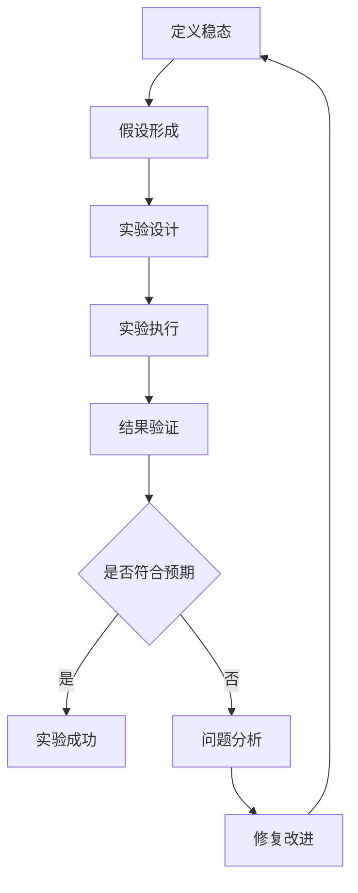

在分布式调度平台的高可用设计中，混沌工程作为一种主动验证系统韧性的方法论，正变得越来越重要。通过在生产环境中进行受控的故障注入实验，混沌工程能够帮助我们发现系统中的潜在脆弱点，验证容错机制的有效性，并持续提升系统的稳定性和可靠性。对于分布式调度平台而言，模拟Master宕机、网络分区、Worker失联等典型故障场景，可以有效验证平台的高可用设计是否真正可靠。本文将深入探讨混沌工程在分布式调度平台中的应用实践，包括核心理念、实施方法以及最佳实践。

## 混沌工程的核心价值

理解混沌工程在分布式调度平台中的重要意义是构建高韧性系统的基础。

### 实践挑战分析

在分布式调度平台中实施混沌工程面临诸多挑战：

**技术复杂性挑战：**
1. **故障模拟**：如何真实模拟复杂的分布式故障场景
2. **影响控制**：如何在实验中控制故障影响范围
3. **数据保护**：如何保护实验中的业务数据安全
4. **环境隔离**：如何确保实验环境与生产环境的隔离

**业务风险挑战：**
1. **业务影响**：实验可能对正常业务造成影响
2. **用户感知**：故障可能被用户感知到
3. **数据一致性**：故障可能影响数据一致性
4. **恢复验证**：需要验证系统能否正确恢复

**组织文化挑战：**
1. **风险意识**：团队对主动引入故障的接受度
2. **责任界定**：实验失败时的责任界定
3. **流程规范**：缺乏标准化的实验流程
4. **经验积累**：缺乏混沌工程实践经验

**工具平台挑战：**
1. **工具选择**：选择合适的混沌工程工具平台
2. **集成复杂**：与现有监控和运维系统集成
3. **自动化程度**：实验执行和验证的自动化程度
4. **报告分析**：实验结果的分析和报告生成

### 核心价值体现

混沌工程实践带来的核心价值：

**韧性验证：**
1. **故障发现**：发现系统设计中的潜在脆弱点
2. **机制验证**：验证高可用机制的有效性
3. **恢复能力**：验证系统故障恢复能力
4. **容错设计**：验证容错设计的合理性

**风险预防：**
1. **问题前置**：将潜在问题在可控环境中暴露
2. **预案验证**：验证应急预案的有效性
3. **流程优化**：优化故障处理流程
4. **团队训练**：提升团队应急响应能力

**质量提升：**
1. **架构优化**：指导系统架构的持续优化
2. **代码改进**：推动代码质量和容错能力提升
3. **监控完善**：完善系统监控和告警体系
4. **文档更新**：更新和完善运维文档

## 混沌工程方法论

建立科学的混沌工程方法论。

### 原则与流程

遵循混沌工程的核心原则和标准流程：

**核心原则：**
1. **稳态假设**：系统在正常和故障状态下应保持稳态
2. **真实环境**：在生产或类生产环境中进行实验
3. **渐进实施**：从小规模实验开始逐步扩大范围
4. **自动化执行**：实现实验的自动化执行和验证

**标准流程：**


**实验生命周期：**
```yaml
# 混沌实验生命周期
experiment_lifecycle:
  preparation:
    - scope_definition: "定义实验范围和影响边界"
    - risk_assessment: "评估实验风险和影响"
    - rollback_plan: "制定回滚和恢复计划"
    - approval_process: "获得必要的审批和授权"
  
  execution:
    - pre_check: "执行前状态检查"
    - fault_injection: "注入故障"
    - monitoring: "持续监控系统状态"
    - validation: "验证实验结果"
  
  conclusion:
    - rollback: "执行回滚操作"
    - analysis: "分析实验结果"
    - reporting: "生成实验报告"
    - improvement: "提出改进建议"
```

### 故障场景设计

设计典型的调度平台故障场景：

**Master故障场景：**
```yaml
# Master宕机故障场景
master_failure:
  scenario: "模拟Master节点宕机"
  fault_type: "process_crash"
  target_component: "scheduler-master"
  injection_method: "kill_process"
  
  pre_conditions:
    - "系统处于正常运行状态"
    - "至少有2个Master节点"
    - "选举机制已就绪"
  
  fault_injection:
    steps:
      - step: "选择目标Master节点"
        action: "random_select_active_master"
      
      - step: "停止Master进程"
        action: "kill -9 master_process_id"
        delay: "0s"
      
      - step: "验证故障注入"
        action: "check_master_status"
        expected: "master_offline"
  
  steady_state_checks:
    - check: "任务调度是否正常"
      metric: "scheduling_success_rate"
      threshold: "> 99%"
    
    - check: "新任务是否能正常提交"
      metric: "job_submission_success_rate"
      threshold: "> 99.5%"
    
    - check: "系统是否自动选主"
      metric: "leader_election_time"
      threshold: "< 30s"
  
  rollback_procedure:
    - step: "启动原Master节点"
      action: "start_master_service"
    
    - step: "验证服务恢复"
      action: "check_master_health"
```

**网络分区场景：**
```yaml
# 网络分区故障场景
network_partition:
  scenario: "模拟网络分区故障"
  fault_type: "network_partition"
  target_components: ["master", "workers", "database"]
  injection_method: "iptables/network_delay"
  
  pre_conditions:
    - "系统处于正常运行状态"
    - "网络分区工具已部署"
    - "监控告警已就绪"
  
  fault_injection:
    steps:
      - step: "创建网络延迟"
        action: "tc qdisc add dev eth0 root netem delay 500ms"
        target: "master_to_workers"
        duration: "5m"
      
      - step: "模拟网络丢包"
        action: "iptables -A INPUT -m statistic --mode random --probability 0.3 -j DROP"
        target: "workers"
        duration: "3m"
      
      - step: "验证网络异常"
        action: "ping_test_between_components"
        expected: "high_latency_or_packet_loss"
  
  steady_state_checks:
    - check: "任务执行是否受影响"
      metric: "task_execution_success_rate"
      threshold: "> 98%"
    
    - check: "心跳检测是否正常工作"
      metric: "heartbeat_detection_accuracy"
      threshold: "> 99%"
    
    - check: "数据一致性是否保持"
      metric: "data_consistency_check"
      threshold: "= 100%"
  
  rollback_procedure:
    - step: "恢复网络连接"
      action: "remove_network_delay_and_drop_rules"
    
    - step: "验证网络恢复"
      action: "network_connectivity_test"
```

**Worker失联场景：**
```yaml
# Worker失联故障场景
worker_disconnection:
  scenario: "模拟Worker节点失联"
  fault_type: "node_isolation"
  target_component: "task-worker"
  injection_method: "network_isolation"
  
  pre_conditions:
    - "系统有多个Worker节点运行"
    - "任务正在执行中"
    - "监控系统正常工作"
  
  fault_injection:
    steps:
      - step: "选择目标Worker节点"
        action: "select_worker_with_active_tasks"
      
      - step: "隔离Worker网络"
        action: "iptables -A INPUT -j DROP && iptables -A OUTPUT -j DROP"
        target: "selected_worker"
        duration: "10m"
      
      - step: "验证Worker失联"
        action: "check_worker_heartbeat"
        expected: "no_heartbeat_for_60s"
  
  steady_state_checks:
    - check: "任务是否重新调度"
      metric: "task_rescheduling_success_rate"
      threshold: "> 95%"
    
    - check: "系统是否检测到Worker失联"
      metric: "worker_failure_detection_time"
      threshold: "< 90s"
    
    - check: "其他Worker是否正常工作"
      metric: "remaining_workers_utilization"
      threshold: "< 90%"
  
  rollback_procedure:
    - step: "恢复Worker网络"
      action: "iptables -F"
    
    - step: "重启Worker服务"
      action: "systemctl restart worker-service"
    
    - step: "验证Worker恢复"
      action: "check_worker_registration"
```

## 混沌工程工具平台

选择和使用合适的混沌工程工具平台。

### 工具选型

评估和选择混沌工程工具：

**主流工具对比：**
```yaml
# 混沌工程工具对比
chaos_tools_comparison:
  chaos_monkey:
    provider: "Netflix"
    strengths:
      - "成熟的生产实践经验"
      - "丰富的故障注入类型"
      - "良好的社区支持"
    weaknesses:
      - "主要针对AWS环境"
      - "配置相对复杂"
   适用场景: "AWS云环境下的混沌实验"
  
  chaos_blade:
    provider: "阿里巴巴"
    strengths:
      - "支持多种故障类型"
      - "良好的中文文档"
      - "支持Kubernetes环境"
    weaknesses:
      - "社区相对较小"
      - "功能仍在完善中"
    适用场景: "Kubernetes环境下的混沌实验"
  
  litmus:
    provider: "MayaData"
    strengths:
      - "专为Kubernetes设计"
      - "丰富的混沌实验库"
      - "良好的可视化界面"
    weaknesses:
      - "主要针对容器环境"
      - "学习成本较高"
    适用场景: "Kubernetes容器环境混沌实验"
  
  chaos_mesh:
    provider: "PingCAP"
    strengths:
      - "专为云原生设计"
      - "支持多种故障类型"
      - "良好的可观测性"
    weaknesses:
      - "相对较新"
      - "文档有待完善"
    适用场景: "云原生环境混沌实验"
```

**平台架构：**
```yaml
# 混沌工程平台架构
chaos_platform:
  components:
    - name: "chaos-controller"
      function: "实验编排和控制"
      tech_stack: ["Go", "Kubernetes Operator"]
    
    - name: "chaos-daemon"
      function: "故障注入执行"
      tech_stack: ["C++", "eBPF", "iptables"]
    
    - name: "chaos-dashboard"
      function: "实验管理和可视化"
      tech_stack: ["React", "Node.js"]
    
    - name: "chaos-event-server"
      function: "事件收集和分析"
      tech_stack: ["Python", "Kafka", "Elasticsearch"]
  
  integrations:
    - name: "monitoring"
      tools: ["Prometheus", "Grafana"]
      purpose: "实验监控和指标收集"
    
    - name: "alerting"
      tools: ["AlertManager", "PagerDuty"]
      purpose: "异常告警和通知"
    
    - name: "logging"
      tools: ["ELK", "Loki"]
      purpose: "日志收集和分析"
```

### 实验管理

实现混沌实验的全生命周期管理：

**实验定义：**
```json
{
  "apiVersion": "chaos-mesh.org/v1alpha1",
  "kind": "PodChaos",
  "metadata": {
    "name": "master-node-failure",
    "namespace": "schedule-system"
  },
  "spec": {
    "action": "pod-failure",
    "mode": "one",
    "selector": {
      "labelSelectors": {
        "app": "scheduler-master"
      }
    },
    "duration": "5m",
    "scheduler": {
      "cron": "@every 10m"
    }
  }
}
```

**实验编排：**
```yaml
# 混沌实验工作流
chaos_workflow:
  name: "scheduler-resilience-test"
  description: "调度器高可用性验证"
  schedule: "0 2 * * *"  # 每天凌晨2点执行
  
  steps:
    - name: "pre-check"
      type: "health-check"
      config:
        endpoints: ["/health", "/metrics"]
        expected_status: 200
      
    - name: "master-failure"
      type: "pod-chaos"
      config:
        action: "pod-kill"
        selector:
          label: "app=scheduler-master"
        mode: "fixed-percent"
        value: "50"
        duration: "2m"
      
    - name: "monitoring"
      type: "monitor"
      config:
        duration: "5m"
        metrics:
          - "scheduling_success_rate"
          - "leader_election_time"
          - "api_response_time"
      
    - name: "validation"
      type: "assertion"
      config:
        conditions:
          - metric: "scheduling_success_rate"
            operator: ">="
            value: 0.99
          - metric: "leader_election_time"
            operator: "<"
            value: 30
          
    - name: "cleanup"
      type: "cleanup"
      config:
        resources: ["chaos-experiments", "temporary-data"]
```

**自动化执行：**
```python
# 混沌实验自动化执行
import time
import logging
from datetime import datetime
from kubernetes import client, config
from chaos_mesh import ChaosMeshClient

class ChaosExperimentRunner:
    def __init__(self, kube_config=None):
        if kube_config:
            config.load_kube_config(kube_config)
        else:
            config.load_incluster_config()
        
        self.core_v1 = client.CoreV1Api()
        self.chaos_client = ChaosMeshClient()
        self.logger = logging.getLogger(__name__)
    
    def run_experiment(self, experiment_config):
        """执行混沌实验"""
        experiment_name = experiment_config['name']
        self.logger.info(f"开始执行混沌实验: {experiment_name}")
        
        try:
            # 1. 预检查
            self.pre_check(experiment_config)
            
            # 2. 注入故障
            chaos_resource = self.inject_fault(experiment_config)
            
            # 3. 监控验证
            monitoring_result = self.monitor_and_validate(
                experiment_config, 
                chaos_resource
            )
            
            # 4. 清理恢复
            self.cleanup(chaos_resource)
            
            # 5. 生成报告
            report = self.generate_report(
                experiment_config, 
                monitoring_result
            )
            
            return report
            
        except Exception as e:
            self.logger.error(f"实验执行失败: {str(e)}")
            # 确保清理资源
            self.emergency_cleanup(experiment_config)
            raise
    
    def pre_check(self, config):
        """执行前检查"""
        self.logger.info("执行预检查")
        
        # 检查系统健康状态
        health_status = self.check_system_health()
        if not health_status['healthy']:
            raise Exception(f"系统不健康: {health_status['issues']}")
        
        # 检查资源充足性
        resource_status = self.check_resources(config)
        if not resource_status['sufficient']:
            raise Exception(f"资源不足: {resource_status['issues']}")
        
        self.logger.info("预检查通过")
    
    def inject_fault(self, config):
        """注入故障"""
        self.logger.info("开始注入故障")
        
        # 创建混沌资源
        chaos_resource = self.chaos_client.create_chaos(
            config['chaos_config']
        )
        
        # 等待故障生效
        time.sleep(config.get('injection_delay', 10))
        
        self.logger.info("故障注入完成")
        return chaos_resource
    
    def monitor_and_validate(self, config, chaos_resource):
        """监控和验证"""
        self.logger.info("开始监控和验证")
        
        duration = config.get('monitor_duration', 300)  # 默认5分钟
        start_time = time.time()
        metrics_data = []
        
        while time.time() - start_time < duration:
            # 收集指标
            metrics = self.collect_metrics(config['validation']['metrics'])
            metrics_data.append(metrics)
            
            # 实时验证
            validation_result = self.validate_metrics(
                metrics, 
                config['validation']['conditions']
            )
            
            if not validation_result['passed']:
                self.logger.warning(
                    f"验证失败: {validation_result['failed_conditions']}"
                )
            
            time.sleep(30)  # 每30秒检查一次
        
        self.logger.info("监控和验证完成")
        return {
            'metrics_data': metrics_data,
            'validation_results': validation_result
        }
    
    def cleanup(self, chaos_resource):
        """清理资源"""
        self.logger.info("开始清理")
        
        # 删除混沌资源
        self.chaos_client.delete_chaos(chaos_resource)
        
        # 等待系统稳定
        time.sleep(60)
        
        # 验证系统恢复
        recovery_status = self.check_system_recovery()
        if not recovery_status['recovered']:
            raise Exception("系统未能正常恢复")
        
        self.logger.info("清理完成")
```

## 故障场景实践

深入实践典型的故障场景。

### Master宕机实验

实施Master节点宕机实验：

**实验设计：**
```yaml
# Master宕机实验设计
master_failure_experiment:
  name: "master-node-crash-test"
  description: "验证Master节点宕机时的高可用性"
  target: "scheduler-master"
  duration: "10m"
  
  pre_experiment_check:
    steps:
      - check_system_health
      - verify_multi_master_setup
      - backup_critical_data
      - notify_stakeholders
  
  fault_injection:
    method: "process_kill"
    target_selection: "random_active_master"
    kill_command: "kill -9 $(pgrep -f scheduler-master)"
    verification: "check_master_process_status"
  
  monitoring_metrics:
    - name: "leader_election_time"
      description: "新Leader选举耗时"
      expected: "< 30s"
      critical: true
    
    - name: "scheduling_interruption"
      description: "调度中断时间"
      expected: "< 5s"
      critical: true
    
    - name: "api_availability"
      description: "API服务可用性"
      expected: "> 99.9%"
      critical: false
    
    - name: "data_consistency"
      description: "数据一致性检查"
      expected: "= 100%"
      critical: true
  
  rollback_procedure:
    steps:
      - restart_master_service
      - verify_cluster_health
      - validate_data_integrity
      - update_experiment_report
```

**实验执行：**
```bash
#!/bin/bash
# Master宕机实验执行脚本

set -e

EXPERIMENT_NAME="master-node-crash-test"
LOG_FILE="/var/log/chaos/${EXPERIMENT_NAME}_$(date +%Y%m%d_%H%M%S).log"

# 日志函数
log() {
    echo "[$(date '+%Y-%m-%d %H:%M:%S')] $1" | tee -a $LOG_FILE
}

# 预检查
pre_check() {
    log "执行预检查"
    
    # 检查系统健康
    if ! kubectl get pods -n schedule-system | grep scheduler-master | grep Running; then
        log "ERROR: Master节点未正常运行"
        exit 1
    fi
    
    # 检查Master节点数量
    master_count=$(kubectl get pods -n schedule-system -l app=scheduler-master | grep Running | wc -l)
    if [ $master_count -lt 2 ]; then
        log "ERROR: 至少需要2个Master节点"
        exit 1
    fi
    
    log "预检查通过"
}

# 故障注入
inject_fault() {
    log "开始注入故障"
    
    # 选择一个活跃的Master节点
    TARGET_MASTER=$(kubectl get pods -n schedule-system -l app=scheduler-master \
        | grep Running | head -1 | awk '{print $1}')
    
    log "目标Master节点: $TARGET_MASTER"
    
    # 记录故障注入时间
    INJECTION_TIME=$(date +%s)
    
    # 在目标节点上杀死Master进程
    kubectl exec -n schedule-system $TARGET_MASTER -- pkill -f scheduler-master
    
    log "故障注入完成"
    
    # 验证故障注入
    sleep 5
    if kubectl get pod -n schedule-system $TARGET_MASTER | grep Running; then
        log "WARNING: Master进程可能未被杀死"
    else
        log "故障注入验证通过"
    fi
}

# 监控验证
monitor_validation() {
    log "开始监控验证"
    
    START_TIME=$(date +%s)
    DURATION=600  # 10分钟
    
    while [ $(($(date +%s) - $START_TIME)) -lt $DURATION ]; do
        # 检查Leader选举时间
        leader_election_time=$(check_leader_election_time)
        log "Leader选举时间: ${leader_election_time}s"
        
        # 检查调度成功率
        scheduling_success=$(check_scheduling_success_rate)
        log "调度成功率: ${scheduling_success}%"
        
        # 检查API可用性
        api_availability=$(check_api_availability)
        log "API可用性: ${api_availability}%"
        
        # 判断是否满足预期
        if [ $(echo "$leader_election_time < 30" | bc) -eq 1 ] && \
           [ $(echo "$scheduling_success > 99.5" | bc) -eq 1 ] && \
           [ $(echo "$api_availability > 99.9" | bc) -eq 1 ]; then
            log "验证通过"
            return 0
        fi
        
        sleep 30
    done
    
    log "ERROR: 验证超时"
    return 1
}

# 辅助检查函数
check_leader_election_time() {
    # 这里应该从监控系统获取实际数据
    echo "15"  # 模拟值
}

check_scheduling_success_rate() {
    echo "99.8"  # 模拟值
}

check_api_availability() {
    echo "99.95"  # 模拟值
}

# 回滚恢复
rollback() {
    log "开始回滚恢复"
    
    # 重启Master服务
    kubectl delete pod -n schedule-system $TARGET_MASTER
    
    # 等待服务恢复
    sleep 60
    
    # 验证恢复
    if kubectl get pods -n schedule-system $TARGET_MASTER | grep Running; then
        log "Master节点恢复成功"
    else
        log "ERROR: Master节点恢复失败"
        exit 1
    fi
    
    log "回滚恢复完成"
}

# 主执行流程
main() {
    log "开始执行Master宕机混沌实验"
    
    # 执行预检查
    pre_check
    
    # 注入故障
    inject_fault
    
    # 监控验证
    if monitor_validation; then
        log "实验成功"
    else
        log "实验失败"
    fi
    
    # 回滚恢复
    rollback
    
    log "实验执行完成"
}

# 执行主流程
main
```

### 网络分区实验

实施网络分区故障实验：

**实验配置：**
```yaml
# 网络分区实验配置
network_partition_experiment:
  name: "network-partition-test"
  description: "验证网络分区时的系统行为"
  targets:
    - component: "master-workers"
      description: "Master与Worker之间的网络分区"
    - component: "worker-database"
      description: "Worker与数据库之间的网络分区"
  
  fault_injection:
    method: "network_delay_and_loss"
    tools: ["tc", "iptables"]
    
    scenarios:
      - name: "high_latency"
        config:
          delay: "500ms"
          jitter: "100ms"
          correlation: "25%"
          duration: "5m"
      
      - name: "packet_loss"
        config:
          loss: "30%"
          duration: "3m"
      
      - name: "complete_isolation"
        config:
          action: "iptables_drop"
          duration: "2m"
  
  monitoring_points:
    - component: "heartbeat"
      metrics: ["heartbeat_miss_rate", "detection_time"]
      expected: 
        heartbeat_miss_rate: "< 5%"
        detection_time: "< 60s"
    
    - component: "task_execution"
      metrics: ["execution_success_rate", "retry_count"]
      expected:
        execution_success_rate: "> 95%"
        retry_count: "< 3"
    
    - component: "data_consistency"
      metrics: ["consistency_check_result"]
      expected:
        consistency_check_result: "= PASS"
```

**实验工具：**
```python
# 网络分区实验工具
import subprocess
import time
import logging
from typing import Dict, List

class NetworkChaos:
    def __init__(self, target_hosts: List[str]):
        self.target_hosts = target_hosts
        self.logger = logging.getLogger(__name__)
        self.applied_rules = []
    
    def inject_network_delay(self, interface: str, delay: str, 
                           jitter: str = "0ms", correlation: str = "0%"):
        """注入网络延迟"""
        try:
            # 添加网络延迟规则
            cmd = [
                "tc", "qdisc", "add", "dev", interface, "root", 
                "netem", "delay", delay, jitter, correlation
            ]
            
            result = subprocess.run(cmd, capture_output=True, text=True)
            if result.returncode != 0:
                raise Exception(f"tc命令执行失败: {result.stderr}")
            
            self.applied_rules.append({
                'type': 'delay',
                'interface': interface,
                'cmd': ' '.join(cmd)
            })
            
            self.logger.info(f"网络延迟注入成功: {delay}±{jitter}")
            return True
            
        except Exception as e:
            self.logger.error(f"网络延迟注入失败: {str(e)}")
            return False
    
    def inject_packet_loss(self, interface: str, loss: str, 
                          correlation: str = "0%"):
        """注入网络丢包"""
        try:
            # 添加丢包规则
            cmd = [
                "tc", "qdisc", "add", "dev", interface, "root",
                "netem", "loss", loss, correlation
            ]
            
            result = subprocess.run(cmd, capture_output=True, text=True)
            if result.returncode != 0:
                raise Exception(f"tc命令执行失败: {result.stderr}")
            
            self.applied_rules.append({
                'type': 'loss',
                'interface': interface,
                'cmd': ' '.join(cmd)
            })
            
            self.logger.info(f"网络丢包注入成功: {loss}")
            return True
            
        except Exception as e:
            self.logger.error(f"网络丢包注入失败: {str(e)}")
            return False
    
    def isolate_host(self, target_host: str):
        """隔离目标主机"""
        try:
            # 使用iptables阻止与目标主机的通信
            cmd_drop_in = [
                "iptables", "-A", "INPUT", "-s", target_host, "-j", "DROP"
            ]
            
            cmd_drop_out = [
                "iptables", "-A", "OUTPUT", "-d", target_host, "-j", "DROP"
            ]
            
            # 执行入站规则
            result_in = subprocess.run(cmd_drop_in, capture_output=True, text=True)
            if result_in.returncode != 0:
                raise Exception(f"iptables入站规则执行失败: {result_in.stderr}")
            
            # 执行出站规则
            result_out = subprocess.run(cmd_drop_out, capture_output=True, text=True)
            if result_out.returncode != 0:
                raise Exception(f"iptables出站规则执行失败: {result_out.stderr}")
            
            self.applied_rules.append({
                'type': 'isolation',
                'target': target_host,
                'inbound_cmd': ' '.join(cmd_drop_in),
                'outbound_cmd': ' '.join(cmd_drop_out)
            })
            
            self.logger.info(f"主机隔离成功: {target_host}")
            return True
            
        except Exception as e:
            self.logger.error(f"主机隔离失败: {str(e)}")
            return False
    
    def recover_network(self):
        """恢复网络"""
        self.logger.info("开始恢复网络")
        
        try:
            # 清除所有tc规则
            for rule in self.applied_rules:
                if rule['type'] in ['delay', 'loss']:
                    interface = rule['interface']
                    cmd = ["tc", "qdisc", "del", "dev", interface, "root"]
                    subprocess.run(cmd, capture_output=True)
            
            # 清除iptables规则
            for rule in self.applied_rules:
                if rule['type'] == 'isolation':
                    # 删除对应的iptables规则
                    # 这里简化处理，实际应该更精确地删除特定规则
                    subprocess.run(["iptables", "-F"], capture_output=True)
            
            self.applied_rules.clear()
            self.logger.info("网络恢复完成")
            return True
            
        except Exception as e:
            self.logger.error(f"网络恢复失败: {str(e)}")
            return False
    
    def validate_network_status(self, target_host: str) -> Dict:
        """验证网络状态"""
        try:
            # 测试网络连通性
            ping_cmd = ["ping", "-c", "3", "-W", "5", target_host]
            ping_result = subprocess.run(ping_cmd, capture_output=True, text=True)
            
            # 测试端口连通性
            nc_cmd = ["nc", "-z", "-w", "5", target_host, "8080"]
            nc_result = subprocess.run(nc_cmd, capture_output=True, text=True)
            
            return {
                'ping_success': ping_result.returncode == 0,
                'port_open': nc_result.returncode == 0,
                'ping_output': ping_result.stdout,
                'nc_output': nc_result.stdout
            }
            
        except Exception as e:
            self.logger.error(f"网络状态验证失败: {str(e)}")
            return {
                'ping_success': False,
                'port_open': False,
                'error': str(e)
            }
```

### Worker失联实验

实施Worker节点失联实验：

**实验方案：**
```yaml
# Worker失联实验方案
worker_disconnection_experiment:
  name: "worker-node-disconnection"
  description: "验证Worker节点失联时的任务重新调度能力"
  target: "task-worker"
  
  fault_injection_methods:
    - method: "process_termination"
      description: "终止Worker进程"
      command: "kill -9 worker_process"
    
    - method: "network_isolation"
      description: "网络隔离Worker节点"
      tools: ["iptables", "firewall-cmd"]
    
    - method: "resource_exhaustion"
      description: "耗尽Worker资源"
      tools: ["stress", "dd"]
  
  experiment_phases:
    preparation:
      steps:
        - verify_worker_cluster_health
        - backup_task_metadata
        - configure_monitoring_alerts
        - notify_operations_team
    
    injection:
      steps:
        - select_target_worker
        - inject_disconnection_fault
        - verify_fault_injection
        - start_monitoring
    
    observation:
      duration: "15m"
      monitoring_points:
        - task_rescheduling_metrics
        - cluster_health_status
        - resource_utilization
        - error_logs_analysis
    
    recovery:
      steps:
        - restore_worker_connectivity
        - verify_worker_reintegration
        - validate_task_consistency
        - cleanup_temporary_resources
    
    validation:
      success_criteria:
        - task_rescheduling_success_rate: "> 95%"
        - rescheduling_latency: "< 60s"
        - data_consistency: "= 100%"
        - no_data_loss: "true"
```

**实验监控：**
```go
// Worker失联实验监控
package chaos

import (
    "context"
    "time"
    "log"
    "sync"
    
    "github.com/prometheus/client_golang/api"
    v1 "github.com/prometheus/client_golang/api/prometheus/v1"
    "github.com/prometheus/common/model"
)

type WorkerDisconnectionMonitor struct {
    prometheusAPI v1.API
    logger        *log.Logger
    metrics       map[string]float64
    mutex         sync.RWMutex
}

func NewWorkerDisconnectionMonitor(prometheusAddr string) (*WorkerDisconnectionMonitor, error) {
    client, err := api.NewClient(api.Config{
        Address: prometheusAddr,
    })
    if err != nil {
        return nil, err
    }
    
    return &WorkerDisconnectionMonitor{
        prometheusAPI: v1.NewAPI(client),
        logger:        log.New(os.Stdout, "[WorkerMonitor] ", log.LstdFlags),
        metrics:       make(map[string]float64),
    }, nil
}

func (m *WorkerDisconnectionMonitor) StartMonitoring(ctx context.Context, duration time.Duration) {
    ticker := time.NewTicker(30 * time.Second)
    defer ticker.Stop()
    
    timeout := time.After(duration)
    
    for {
        select {
        case <-ticker.C:
            m.collectMetrics()
            m.validateMetrics()
        case <-timeout:
            m.logger.Println("监控超时")
            return
        case <-ctx.Done():
            m.logger.Println("监控被取消")
            return
        }
    }
}

func (m *WorkerDisconnectionMonitor) collectMetrics() {
    metrics := []string{
        "task_rescheduling_success_rate",
        "rescheduling_latency_seconds",
        "worker_failure_detection_time",
        "active_worker_count",
        "task_execution_success_rate",
    }
    
    for _, metricName := range metrics {
        value, err := m.queryMetric(metricName)
        if err != nil {
            m.logger.Printf("查询指标失败 %s: %v", metricName, err)
            continue
        }
        
        m.mutex.Lock()
        m.metrics[metricName] = value
        m.mutex.Unlock()
        
        m.logger.Printf("指标 %s: %.2f", metricName, value)
    }
}

func (m *WorkerDisconnectionMonitor) queryMetric(metricName string) (float64, error) {
    query := metricName
    if metricName == "task_rescheduling_success_rate" {
        query = "sum(scheduler_task_rescheduled_total) / sum(scheduler_task_submitted_total)"
    } else if metricName == "rescheduling_latency_seconds" {
        query = "histogram_quantile(0.95, sum(rate(scheduler_rescheduling_duration_seconds_bucket[5m])) by (le))"
    }
    
    result, warnings, err := m.prometheusAPI.Query(context.Background(), query, time.Now())
    if err != nil {
        return 0, err
    }
    
    if len(warnings) > 0 {
        m.logger.Printf("查询警告: %v", warnings)
    }
    
    if vector, ok := result.(model.Vector); ok && len(vector) > 0 {
        return float64(vector[0].Value), nil
    }
    
    return 0, nil
}

func (m *WorkerDisconnectionMonitor) validateMetrics() {
    m.mutex.RLock()
    defer m.mutex.RUnlock()
    
    // 验证任务重新调度成功率
    if successRate, ok := m.metrics["task_rescheduling_success_rate"]; ok {
        if successRate < 0.95 {
            m.logger.Printf("警告: 任务重新调度成功率过低 %.2f%%", successRate*100)
        }
    }
    
    // 验证重新调度延迟
    if latency, ok := m.metrics["rescheduling_latency_seconds"]; ok {
        if latency > 60 {
            m.logger.Printf("警告: 重新调度延迟过高 %.2fs", latency)
        }
    }
    
    // 验证Worker故障检测时间
    if detectionTime, ok := m.metrics["worker_failure_detection_time"]; ok {
        if detectionTime > 90 {
            m.logger.Printf("警告: Worker故障检测时间过长 %.2fs", detectionTime)
        }
    }
}
```

## 结果分析与改进

分析实验结果并持续改进系统。

### 实验结果分析

深入分析混沌实验的结果：

**数据分析框架：**
```python
# 混沌实验结果分析
import pandas as pd
import numpy as np
from datetime import datetime
import matplotlib.pyplot as plt
import seaborn as sns

class ChaosExperimentAnalyzer:
    def __init__(self, experiment_data):
        self.experiment_data = experiment_data
        self.results = {}
    
    def analyze_failure_impact(self):
        """分析故障影响"""
        impact_analysis = {}
        
        # 分析各组件的故障影响
        for component, data in self.experiment_data.items():
            impact_analysis[component] = {
                'availability_loss': self.calculate_availability_loss(data),
                'performance_degradation': self.calculate_performance_degradation(data),
                'recovery_time': self.calculate_recovery_time(data),
                'data_consistency': self.check_data_consistency(data)
            }
        
        return impact_analysis
    
    def calculate_availability_loss(self, data):
        """计算可用性损失"""
        if 'availability' not in data:
            return 0
        
        normal_availability = np.mean(data['availability']['normal'])
        fault_availability = np.mean(data['availability']['fault'])
        
        return (normal_availability - fault_availability) / normal_availability * 100
    
    def calculate_performance_degradation(self, data):
        """计算性能下降"""
        if 'latency' not in data:
            return 0
        
        normal_latency = np.mean(data['latency']['normal'])
        fault_latency = np.mean(data['latency']['fault'])
        
        if normal_latency == 0:
            return 0
        
        return (fault_latency - normal_latency) / normal_latency * 100
    
    def calculate_recovery_time(self, data):
        """计算恢复时间"""
        if 'recovery_time' not in data:
            return 0
        
        return np.mean(data['recovery_time'])
    
    def check_data_consistency(self, data):
        """检查数据一致性"""
        if 'data_consistency' not in data:
            return True
        
        return all(data['data_consistency'])
    
    def generate_improvement_recommendations(self, impact_analysis):
        """生成改进建议"""
        recommendations = []
        
        for component, impact in impact_analysis.items():
            # 可用性问题
            if impact['availability_loss'] > 10:
                recommendations.append({
                    'component': component,
                    'priority': 'high',
                    'issue': f"可用性损失 {impact['availability_loss']:.2f}%",
                    'recommendation': '增强故障检测和自动恢复机制'
                })
            
            # 性能问题
            if impact['performance_degradation'] > 50:
                recommendations.append({
                    'component': component,
                    'priority': 'high',
                    'issue': f"性能下降 {impact['performance_degradation']:.2f}%",
                    'recommendation': '优化系统性能和资源分配'
                })
            
            # 恢复时间问题
            if impact['recovery_time'] > 120:
                recommendations.append({
                    'component': component,
                    'priority': 'medium',
                    'issue': f"恢复时间过长 {impact['recovery_time']:.2f}s",
                    'recommendation': '优化恢复流程和机制'
                })
        
        return sorted(recommendations, key=lambda x: x['priority'])
```

**问题识别：**
```yaml
# 实验问题识别
experiment_issues:
  - category: "detection"
    issues:
      - problem: "故障检测时间过长"
        impact: "影响故障恢复速度"
        root_cause: "心跳检测间隔过长或网络延迟影响"
        solution: "优化心跳检测机制，缩短检测间隔"
    
      - problem: "假阳性检测"
        impact: "导致不必要的故障转移"
        root_cause: "网络抖动被误判为节点故障"
        solution: "增加检测确认机制，避免误判"
  
  - category: "recovery"
    issues:
      - problem: "恢复时间不稳定"
        impact: "影响系统整体稳定性"
        root_cause: "恢复流程复杂或资源竞争"
        solution: "简化恢复流程，优化资源分配"
    
      - problem: "数据不一致"
        impact: "影响业务数据准确性"
        root_cause: "恢复过程中数据同步不完整"
        solution: "增强数据一致性检查和修复机制"
  
  - category: "performance"
    issues:
      - problem: "性能下降明显"
        impact: "影响用户体验"
        root_cause: "故障转移导致资源重新分配"
        solution: "优化负载均衡和资源调度算法"
    
      - problem: "资源利用率不均"
        impact: "部分节点过载，部分节点空闲"
        root_cause: "调度算法未考虑故障场景"
        solution: "增强调度算法的故障感知能力"
```

### 系统改进措施

基于实验结果实施系统改进：

**架构优化：**
```yaml
# 系统架构改进建议
architecture_improvements:
  - component: "master"
    improvements:
      - item: "增强选举机制"
        description: "优化Raft选举参数，减少选举时间"
        implementation:
          - reduce_election_timeout: "从150-300ms调整为100-200ms"
          - increase_heartbeat_frequency: "提高心跳频率以更快检测故障"
          - implement_pre_vote: "实现预投票机制避免不必要的选举"
      
      - item: "改进状态同步"
        description: "优化状态同步机制，提高数据一致性"
        implementation:
          - batch_log_replication: "批量复制日志提高效率"
          - async_apply_optimization: "异步应用优化减少延迟"
          - incremental_snapshot: "增量快照减少同步数据量"
  
  - component: "worker"
    improvements:
      - item: "增强心跳机制"
        description: "改进心跳检测机制，提高故障检测准确性"
        implementation:
          - adaptive_heartbeat: "自适应心跳间隔根据网络状况调整"
          - multi_path_heartbeat: "多路径心跳检测提高可靠性"
          - failure_confirmation: "故障确认机制避免误判"
      
      - item: "优化任务迁移"
        description: "优化任务迁移机制，减少迁移时间"
        implementation:
          - parallel_task_migration: "并行迁移多个任务"
          - incremental_state_sync: "增量同步任务状态"
          - migration_priority_queue: "优先级队列管理迁移任务"
  
  - component: "network"
    improvements:
      - item: "增强网络容错"
        description: "提高网络故障的容错能力"
        implementation:
          - connection_pooling: "连接池管理减少连接重建"
          - retry_mechanism: "增强重试机制处理临时网络问题"
          - circuit_breaker: "熔断器防止级联故障"
```

**代码改进：**
```java
// 改进的故障检测机制
@Component
public class ImprovedFailureDetector {
    
    private final Map<String, WorkerHealth> workerHealthMap = new ConcurrentHashMap<>();
    private final ScheduledExecutorService scheduler = Executors.newScheduledThreadPool(5);
    
    // 自适应心跳检测
    public void startAdaptiveHeartbeat(String workerId) {
        WorkerHealth health = workerHealthMap.computeIfAbsent(workerId, 
            k -> new WorkerHealth());
        
        // 根据网络状况动态调整心跳间隔
        long heartbeatInterval = calculateHeartbeatInterval(workerId);
        
        scheduler.scheduleAtFixedRate(() -> {
            try {
                boolean isHealthy = checkWorkerHealth(workerId);
                health.updateHealthStatus(isHealthy);
                
                // 如果检测到故障，进行确认
                if (!isHealthy && health.getFailureCount() >= 2) {
                    confirmFailure(workerId);
                }
                
                // 调整下次心跳间隔
                long nextInterval = adjustHeartbeatInterval(workerId, isHealthy);
                if (nextInterval != heartbeatInterval) {
                    restartHeartbeat(workerId, nextInterval);
                }
                
            } catch (Exception e) {
                log.error("心跳检测异常: {}", workerId, e);
            }
        }, 0, heartbeatInterval, TimeUnit.SECONDS);
    }
    
    private long calculateHeartbeatInterval(String workerId) {
        // 基于历史网络延迟计算心跳间隔
        NetworkMetrics metrics = getNetworkMetrics(workerId);
        long baseInterval = 10; // 基础间隔10秒
        
        if (metrics.getAverageLatency() > 100) {
            return baseInterval * 2; // 高延迟环境下延长间隔
        } else if (metrics.getPacketLossRate() > 0.05) {
            return baseInterval / 2; // 高丢包环境下缩短间隔
        }
        
        return baseInterval;
    }
    
    private void confirmFailure(String workerId) {
        // 多路径确认故障
        boolean confirmed = false;
        int confirmationAttempts = 3;
        
        for (int i = 0; i < confirmationAttempts && !confirmed; i++) {
            confirmed = multiPathHealthCheck(workerId);
            if (!confirmed) {
                try {
                    Thread.sleep(1000); // 等待1秒后重试
                } catch (InterruptedException e) {
                    Thread.currentThread().interrupt();
                    break;
                }
            }
        }
        
        if (confirmed) {
            handleConfirmedFailure(workerId);
        } else {
            // 可能是临时网络问题，重置故障计数
            WorkerHealth health = workerHealthMap.get(workerId);
            if (health != null) {
                health.resetFailureCount();
            }
        }
    }
    
    private boolean multiPathHealthCheck(String workerId) {
        // 多种方式检查Worker健康状态
        List<HealthCheckMethod> methods = Arrays.asList(
            new TcpHealthCheck(),
            new HttpHealthCheck(),
            new GrpcHealthCheck()
        );
        
        int successCount = 0;
        for (HealthCheckMethod method : methods) {
            if (method.check(workerId)) {
                successCount++;
            }
        }
        
        // 至少2种方式成功才算健康
        return successCount >= 2;
    }
}
```

## 最佳实践与实施建议

总结混沌工程实践的最佳实践。

### 实施原则

遵循核心实施原则：

**安全第一原则：**
1. **影响控制**：严格控制实验影响范围
2. **数据保护**：确保业务数据安全
3. **回滚机制**：建立快速回滚机制
4. **风险评估**：充分评估实验风险

**渐进实施原则：**
1. **小规模开始**：从简单场景小规模开始
2. **逐步扩大**：逐步增加实验复杂度和范围
3. **持续改进**：基于实验结果持续优化
4. **经验积累**：积累实践经验形成知识库

### 实施策略

制定科学的实施策略：

**组织建设：**
1. **团队培养**：培养混沌工程专业团队
2. **文化建设**：建立容错和学习的文化氛围
3. **流程规范**：制定标准化的实验流程
4. **工具平台**：建设统一的实验平台

**技术实践：**
1. **环境准备**：准备合适的实验环境
2. **工具选型**：选择合适的混沌工程工具
3. **监控完善**：完善系统监控和告警
4. **自动化**：提高实验执行的自动化程度

### 效果评估

建立效果评估机制：

**评估指标：**
1. **实验成功率**：成功执行的实验比例
2. **问题发现率**：通过实验发现的问题数量
3. **系统改进数**：基于实验结果的系统改进数量
4. **故障恢复时间**：系统故障平均恢复时间

**评估方法：**
1. **对比分析**：对比实验前后的系统指标
2. **趋势分析**：分析系统韧性的改善趋势
3. **成本效益**：评估混沌工程的投入产出比
4. **团队反馈**：收集团队对混沌工程的反馈

## 小结

混沌工程作为验证分布式系统韧性的重要方法，在分布式调度平台的高可用设计中发挥着关键作用。通过模拟Master宕机、网络分区、Worker失联等典型故障场景，可以有效验证平台的容错能力和恢复机制。

在实际实施过程中，需要关注技术复杂性、业务风险、组织文化、工具平台等关键挑战。通过建立科学的混沌工程方法论、选择合适的工具平台、深入实践典型故障场景、持续分析改进实验结果，可以构建出高效可靠的混沌工程体系。

随着云原生和智能化技术的发展，混沌工程也在不断演进。未来可能会出现更多智能化的混沌工程方案，如基于AI的故障预测和注入、自动化的实验设计和执行、智能化的结果分析和改进建议等。持续关注技术发展趋势，积极引入先进的理念和技术实现，将有助于构建更加智能、高效的混沌工程体系。

混沌工程不仅是一种技术实践，更是一种工程文化和方法论。通过深入理解系统特性和业务需求，可以更好地指导混沌工程的实施，为构建高韧性、高可靠的分布式调度平台奠定坚实基础。