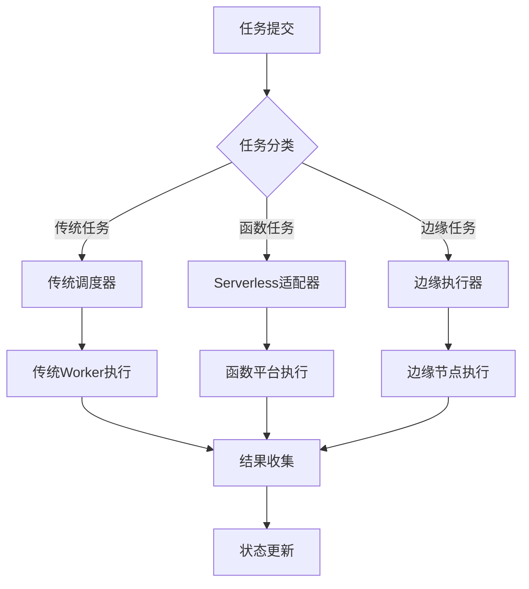

随着云计算技术的快速发展，Serverless架构作为一种新兴的计算范式，正在重塑应用开发和部署的方式。Serverless的核心理念是让开发者专注于业务逻辑的实现，而将基础设施管理、资源调度、弹性伸缩等复杂问题交给云平台处理。对于分布式调度平台而言，如何与Serverless架构深度融合，既保持传统调度平台的稳定性和可靠性，又充分利用Serverless的弹性伸缩和按需付费优势，成为了一个重要的发展方向。本文将深入探讨Serverless与调度平台融合的核心理念、技术实现以及最佳实践。

## Serverless与调度融合的核心价值

理解Serverless与调度平台融合的重要意义是构建下一代调度系统的基础。

### 融合挑战分析

在分布式调度平台中实现与Serverless的深度融合面临诸多挑战：

**架构兼容性挑战：**
1. **模型差异**：传统调度模型与Serverless函数模型的差异
2. **状态管理**：无状态函数与有状态任务的状态管理差异
3. **执行环境**：容器化环境与函数运行时环境的差异
4. **生命周期**：长周期任务与短生命周期函数的协调

**资源调度挑战：**
1. **冷启动**：函数冷启动对调度性能的影响
2. **资源分配**：函数资源的动态分配和回收
3. **并发控制**：函数并发执行的控制和优化
4. **成本优化**：在性能和成本间找到平衡点

**集成复杂性挑战：**
1. **API适配**：不同云厂商Serverless API的适配
2. **事件驱动**：事件驱动与定时调度的集成
3. **监控统一**：统一监控传统任务和函数执行
4. **日志收集**：跨平台日志的统一收集和分析

**运维管理挑战：**
1. **故障处理**：函数执行失败的处理机制
2. **版本管理**：函数版本与任务配置的统一管理
3. **权限控制**：跨平台的权限和安全控制
4. **调试诊断**：函数调试和问题诊断的复杂性

### 核心价值体现

Serverless与调度平台融合带来的核心价值：

**弹性伸缩优势：**
1. **自动扩缩**：根据负载自动扩缩函数实例
2. **资源优化**：按需使用资源，避免资源浪费
3. **成本节约**：只为实际使用的计算资源付费
4. **峰值处理**：轻松应对业务峰值和突发流量

**开发效率提升：**
1. **专注业务**：开发者专注于业务逻辑实现
2. **快速迭代**：函数部署和更新更加快速
3. **降低门槛**：降低分布式系统开发门槛
4. **生态复用**：充分利用云厂商提供的函数生态

**运维简化：**
1. **无服务器管理**：无需管理服务器基础设施
2. **自动运维**：平台自动处理运维相关工作
3. **高可用保障**：云厂商提供的高可用保障
4. **安全防护**：内置的安全防护机制

## 融合架构设计

设计Serverless与调度平台的融合架构。

### 整体架构

构建统一的任务调度架构：

**架构分层：**
```yaml
# Serverless融合架构
serverless_integration_architecture:
  layers:
    # 应用层
    application_layer:
      components:
        - name: "task_client"
          description: "任务客户端SDK"
          functions:
            - submit_task
            - query_task_status
            - cancel_task
        
        - name: "workflow_engine"
          description: "工作流引擎"
          functions:
            - define_workflow
            - execute_workflow
            - monitor_workflow
    
    # 调度层
    scheduling_layer:
      components:
        - name: "hybrid_scheduler"
          description: "混合调度器"
          functions:
            - task_classification
            - resource_routing
            - execution_dispatch
        
        - name: "serverless_adapter"
          description: "Serverless适配器"
          functions:
            - function_deployment
            - trigger_management
            - result_collection
    
    # 执行层
    execution_layer:
      components:
        - name: "traditional_worker"
          description: "传统Worker节点"
          runtime: "container/kubernetes"
        
        - name: "serverless_runtime"
          description: "Serverless运行时"
          runtime: "FaaS/function"
        
        - name: "edge_executor"
          description: "边缘执行器"
          runtime: "lightweight_container"
    
    # 管理层
    management_layer:
      components:
        - name: "unified_monitoring"
          description: "统一监控系统"
          functions:
            - metrics_collection
            - log_aggregation
            - alert_management
        
        - name: "resource_manager"
          description: "资源管理器"
          functions:
            - capacity_planning
            - cost_optimization
            - quota_management
```

**任务路由：**


### 任务分类机制

实现智能的任务分类机制：

**分类策略：**
```java
// 任务分类器实现
@Component
public class TaskClassifier {
    
    private final List<TaskClassificationRule> classificationRules;
    
    public TaskClassificationResult classifyTask(Task task) {
        // 基于任务特征进行分类
        TaskFeatures features = extractTaskFeatures(task);
        
        // 应用分类规则
        for (TaskClassificationRule rule : classificationRules) {
            if (rule.matches(features)) {
                return rule.classify(features);
            }
        }
        
        // 默认分类为传统任务
        return new TaskClassificationResult(
            ExecutionType.TRADITIONAL,
            "default_traditional_rule"
        );
    }
    
    private TaskFeatures extractTaskFeatures(Task task) {
        TaskFeatures features = new TaskFeatures();
        
        // 执行时间特征
        features.setExecutionTimeEstimate(task.getEstimatedExecutionTime());
        features.setExecutionTimeVariance(task.getExecutionTimeVariance());
        
        // 资源需求特征
        features.setCpuRequirement(task.getCpuRequirement());
        features.setMemoryRequirement(task.getMemoryRequirement());
        features.setStorageRequirement(task.getStorageRequirement());
        
        // 执行模式特征
        features.setExecutionPattern(task.getExecutionPattern());
        features.setStateful(task.isStateful());
        features.setConcurrent(task.isConcurrent());
        
        // 依赖关系特征
        features.setDependenciesCount(task.getDependencies().size());
        features.setExternalDependencies(task.hasExternalDependencies());
        
        // 触发模式特征
        features.setTriggerType(task.getTriggerType());
        features.setFrequency(task.getExecutionFrequency());
        
        return features;
    }
    
    public class TaskClassificationRule {
        private String name;
        private String description;
        private Predicate<TaskFeatures> condition;
        private Function<TaskFeatures, TaskClassificationResult> classifier;
        
        public boolean matches(TaskFeatures features) {
            return condition.test(features);
        }
        
        public TaskClassificationResult classify(TaskFeatures features) {
            return classifier.apply(features);
        }
    }
}
```

**分类规则：**
```yaml
# 任务分类规则
task_classification_rules:
  # Serverless适用任务
  - name: "serverless_suitable"
    description: "适合Serverless执行的任务"
    condition: |
      execution_time_estimate < 300s AND 
      cpu_requirement < 2_cores AND
      memory_requirement < 2GB AND
      stateful = false AND
      dependencies_count < 5 AND
      trigger_type IN ['event', 'http', 'timer']
    classification:
      type: "serverless"
      reason: "任务特征符合Serverless执行要求"
      priority: "high"
  
  # 传统调度任务
  - name: "traditional_required"
    description: "必须使用传统调度的任务"
    condition: |
      execution_time_estimate > 3600s OR
      cpu_requirement > 8_cores OR
      memory_requirement > 16GB OR
      stateful = true OR
      dependencies_count > 20
    classification:
      type: "traditional"
      reason: "任务资源需求或特性要求传统调度"
      priority: "medium"
  
  # 边缘执行任务
  - name: "edge_execution"
    description: "适合边缘执行的任务"
    condition: |
      latency_requirement < 100ms AND
      data_locality_required = true AND
      network_bandwidth_requirement < 10Mbps
    classification:
      type: "edge"
      reason: "任务对延迟敏感且需要数据本地性"
      priority: "high"
```

### 执行适配器

实现多平台执行适配器：

**适配器架构：**
```python
# Serverless适配器基类
from abc import ABC, abstractmethod
from typing import Dict, Any, List
import asyncio

class ServerlessAdapter(ABC):
    """Serverless适配器抽象基类"""
    
    def __init__(self, config: Dict[str, Any]):
        self.config = config
        self.client = self._initialize_client()
    
    @abstractmethod
    def _initialize_client(self):
        """初始化云服务商客户端"""
        pass
    
    @abstractmethod
    async def deploy_function(self, function_spec: Dict[str, Any]) -> str:
        """部署函数"""
        pass
    
    @abstractmethod
    async def invoke_function(self, function_name: str, payload: Dict[str, Any]) -> Dict[str, Any]:
        """调用函数"""
        pass
    
    @abstractmethod
    async def get_function_status(self, function_name: str) -> Dict[str, Any]:
        """获取函数状态"""
        pass
    
    @abstractmethod
    async def delete_function(self, function_name: str) -> bool:
        """删除函数"""
        pass

# AWS Lambda适配器
class AWSLambdaAdapter(ServerlessAdapter):
    def _initialize_client(self):
        import boto3
        return boto3.client('lambda', region_name=self.config.get('region', 'us-east-1'))
    
    async def deploy_function(self, function_spec: Dict[str, Any]) -> str:
        try:
            response = self.client.create_function(
                FunctionName=function_spec['name'],
                Runtime=function_spec.get('runtime', 'python3.9'),
                Role=function_spec['role'],
                Handler=function_spec.get('handler', 'main.handler'),
                Code={'ZipFile': function_spec['code']},
                Description=function_spec.get('description', ''),
                Timeout=function_spec.get('timeout', 300),
                MemorySize=function_spec.get('memory', 128),
                Environment={
                    'Variables': function_spec.get('environment', {})
                }
            )
            return response['FunctionArn']
        except Exception as e:
            raise RuntimeError(f"函数部署失败: {str(e)}")
    
    async def invoke_function(self, function_name: str, payload: Dict[str, Any]) -> Dict[str, Any]:
        import json
        try:
            response = self.client.invoke(
                FunctionName=function_name,
                InvocationType='RequestResponse',
                Payload=json.dumps(payload)
            )
            return {
                'status_code': response['StatusCode'],
                'payload': json.loads(response['Payload'].read()),
                'logs': response.get('LogResult', '')
            }
        except Exception as e:
            raise RuntimeError(f"函数调用失败: {str(e)}")
    
    async def get_function_status(self, function_name: str) -> Dict[str, Any]:
        try:
            response = self.client.get_function(FunctionName=function_name)
            return {
                'state': response['Configuration']['State'],
                'last_modified': response['Configuration']['LastModified'],
                'runtime': response['Configuration']['Runtime'],
                'timeout': response['Configuration']['Timeout'],
                'memory': response['Configuration']['MemorySize']
            }
        except Exception as e:
            raise RuntimeError(f"获取函数状态失败: {str(e)}")
    
    async def delete_function(self, function_name: str) -> bool:
        try:
            self.client.delete_function(FunctionName=function_name)
            return True
        except Exception as e:
            raise RuntimeError(f"函数删除失败: {str(e)}")

# 阿里云函数计算适配器
class AliyunFCAdapter(ServerlessAdapter):
    def _initialize_client(self):
        from aliyunsdkcore.client import AcsClient
        return AcsClient(
            self.config['access_key_id'],
            self.config['access_key_secret'],
            self.config.get('region', 'cn-hangzhou')
        )
    
    async def deploy_function(self, function_spec: Dict[str, Any]) -> str:
        # 实现阿里云函数计算部署逻辑
        pass
    
    async def invoke_function(self, function_name: str, payload: Dict[str, Any]) -> Dict[str, Any]:
        # 实现阿里云函数计算调用逻辑
        pass
    
    async def get_function_status(self, function_name: str) -> Dict[str, Any]:
        # 实现阿里云函数计算状态查询逻辑
        pass
    
    async def delete_function(self, function_name: str) -> bool:
        # 实现阿里云函数计算删除逻辑
        pass
```

## 融合实现方案

实现具体的融合方案。

### 混合调度器

实现混合任务调度器：

**调度器设计：**
```go
// 混合调度器实现
package scheduler

import (
    "context"
    "time"
    "log"
    "sync"
    
    "github.com/example/scheduler/types"
    "github.com/example/scheduler/adapters"
)

type HybridScheduler struct {
    traditionalScheduler *TraditionalScheduler
    serverlessAdapters   map[string]adapters.ServerlessAdapter
    taskClassifier       *TaskClassifier
    taskQueue            *TaskQueue
    logger               *log.Logger
    mutex                sync.RWMutex
}

func NewHybridScheduler(config *SchedulerConfig) (*HybridScheduler, error) {
    scheduler := &HybridScheduler{
        serverlessAdapters: make(map[string]adapters.ServerlessAdapter),
        taskQueue:          NewTaskQueue(),
        logger:             log.New(os.Stdout, "[HybridScheduler] ", log.LstdFlags),
    }
    
    // 初始化传统调度器
    scheduler.traditionalScheduler = NewTraditionalScheduler(config.TraditionalConfig)
    
    // 初始化Serverless适配器
    for provider, providerConfig := range config.ServerlessConfigs {
        adapter, err := adapters.NewAdapter(provider, providerConfig)
        if err != nil {
            return nil, err
        }
        scheduler.serverlessAdapters[provider] = adapter
    }
    
    // 初始化任务分类器
    scheduler.taskClassifier = NewTaskClassifier(config.ClassificationRules)
    
    return scheduler, nil
}

func (s *HybridScheduler) SubmitTask(ctx context.Context, task *types.Task) (*types.TaskInstance, error) {
    // 任务分类
    classification := s.taskClassifier.Classify(task)
    
    // 创建任务实例
    instance := &types.TaskInstance{
        ID:        generateTaskID(),
        TaskID:    task.ID,
        Status:    types.TaskStatusPending,
        CreatedAt: time.Now(),
        Type:      classification.Type,
    }
    
    // 根据分类结果选择执行方式
    switch classification.Type {
    case types.ExecutionTypeTraditional:
        return s.scheduleTraditionalTask(ctx, task, instance)
    case types.ExecutionTypeServerless:
        return s.scheduleServerlessTask(ctx, task, instance, classification)
    case types.ExecutionTypeEdge:
        return s.scheduleEdgeTask(ctx, task, instance)
    default:
        return nil, errors.New("unsupported execution type")
    }
}

func (s *HybridScheduler) scheduleTraditionalTask(ctx context.Context, task *types.Task, instance *types.TaskInstance) (*types.TaskInstance, error) {
    s.logger.Printf("调度传统任务: %s", task.ID)
    
    // 提交到传统调度器
    err := s.traditionalScheduler.Submit(instance)
    if err != nil {
        instance.Status = types.TaskStatusFailed
        instance.ErrorMessage = err.Error()
        return instance, err
    }
    
    instance.Status = types.TaskStatusScheduled
    return instance, nil
}

func (s *HybridScheduler) scheduleServerlessTask(ctx context.Context, task *types.Task, instance *types.TaskInstance, classification *TaskClassification) (*types.TaskInstance, error) {
    s.logger.Printf("调度Serverless任务: %s", task.ID)
    
    // 选择合适的Serverless适配器
    adapter, exists := s.serverlessAdapters[classification.Provider]
    if !exists {
        err := errors.New("unsupported serverless provider")
        instance.Status = types.TaskStatusFailed
        instance.ErrorMessage = err.Error()
        return instance, err
    }
    
    // 部署函数（如果需要）
    functionName, err := s.deployFunctionIfNeeded(adapter, task, classification)
    if err != nil {
        instance.Status = types.TaskStatusFailed
        instance.ErrorMessage = err.Error()
        return instance, err
    }
    
    // 异步调用函数
    go s.invokeServerlessFunction(adapter, functionName, task, instance)
    
    instance.Status = types.TaskStatusScheduled
    instance.Provider = classification.Provider
    instance.FunctionName = functionName
    
    return instance, nil
}

func (s *HybridScheduler) deployFunctionIfNeeded(adapter adapters.ServerlessAdapter, task *types.Task, classification *TaskClassification) (string, error) {
    // 检查函数是否已存在
    functionName := s.generateFunctionName(task)
    
    status, err := adapter.GetFunctionStatus(functionName)
    if err == nil && status.State == "Active" {
        // 函数已存在且活跃
        return functionName, nil
    }
    
    // 部署新函数
    functionSpec := s.buildFunctionSpec(task, classification)
    functionArn, err := adapter.DeployFunction(functionSpec)
    if err != nil {
        return "", err
    }
    
    return functionName, nil
}

func (s *HybridScheduler) invokeServerlessFunction(adapter adapters.ServerlessAdapter, functionName string, task *types.Task, instance *types.TaskInstance) {
    ctx, cancel := context.WithTimeout(context.Background(), time.Duration(task.Timeout)*time.Second)
    defer cancel()
    
    payload := map[string]interface{}{
        "task_id": instance.ID,
        "inputs":  task.Inputs,
        "config":  task.Config,
    }
    
    result, err := adapter.InvokeFunction(functionName, payload)
    if err != nil {
        instance.Status = types.TaskStatusFailed
        instance.ErrorMessage = err.Error()
        instance.FinishedAt = time.Now()
        return
    }
    
    instance.Status = types.TaskStatusSuccess
    instance.Outputs = result.Payload
    instance.FinishedAt = time.Now()
    
    // 记录执行日志
    s.logger.Printf("函数执行完成: %s, 结果: %v", functionName, result)
}
```

### 统一监控体系

构建统一的监控体系：

**监控架构：**
```yaml
# 统一监控架构
unified_monitoring:
  data_sources:
    # 传统任务监控
    - name: "traditional_task_metrics"
      type: "prometheus"
      endpoint: "http://prometheus:9090"
      metrics:
        - scheduler_task_count
        - scheduler_task_duration
        - worker_cpu_usage
        - worker_memory_usage
    
    # Serverless函数监控
    - name: "serverless_function_metrics"
      type: "cloudwatch"
      endpoint: "https://monitoring.amazonaws.com"
      metrics:
        - aws_lambda_invocations
        - aws_lambda_duration
        - aws_lambda_errors
        - aws_lambda_throttles
    
    # 日志收集
    - name: "unified_logging"
      type: "elasticsearch"
      endpoint: "http://elasticsearch:9200"
      indices:
        - traditional_task_logs
        - serverless_function_logs
        - workflow_execution_logs
  
  dashboard_templates:
    - name: "hybrid_execution_overview"
      description: "混合执行概览"
      panels:
        - title: "任务执行分布"
          type: "pie_chart"
          metrics: ["traditional_tasks", "serverless_functions", "edge_tasks"]
        
        - title: "执行成功率对比"
          type: "line_chart"
          metrics: ["traditional_success_rate", "serverless_success_rate"]
        
        - title: "成本分析"
          type: "bar_chart"
          metrics: ["traditional_cost", "serverless_cost"]
        
        - title: "性能对比"
          type: "heatmap"
          metrics: ["traditional_latency", "serverless_latency"]
  
  alerting_rules:
    - name: "mixed_execution_anomaly"
      condition: |
        (traditional_task_duration > 2 * avg(traditional_task_duration[1h])) OR
        (serverless_function_duration > 2 * avg(serverless_function_duration[1h]))
      severity: "warning"
      actions:
        - notify: ["performance_team"]
        - execute: "performance_analysis"
    
    - name: "cost_anomaly"
      condition: "serverless_cost > 1.5 * avg(serverless_cost[24h])"
      severity: "warning"
      actions:
        - notify: ["finance_team"]
        - execute: "cost_optimization"
```

**监控实现：**
```python
# 统一监控实现
import asyncio
import time
from typing import Dict, List, Any
from prometheus_client import Counter, Histogram, Gauge
import boto3

class UnifiedMonitor:
    def __init__(self, config: Dict[str, Any]):
        self.config = config
        self.metrics = {}
        self.adapters = {}
        self._initialize_metrics()
        self._initialize_adapters()
    
    def _initialize_metrics(self):
        """初始化监控指标"""
        # 任务计数器
        self.metrics['task_submitted'] = Counter(
            'scheduler_task_submitted_total',
            'Total number of tasks submitted',
            ['task_type', 'execution_type']
        )
        
        self.metrics['task_completed'] = Counter(
            'scheduler_task_completed_total',
            'Total number of tasks completed',
            ['task_type', 'execution_type', 'status']
        )
        
        # 执行时间直方图
        self.metrics['execution_duration'] = Histogram(
            'scheduler_execution_duration_seconds',
            'Task execution duration in seconds',
            ['task_type', 'execution_type'],
            buckets=[0.1, 0.5, 1, 5, 10, 30, 60, 120, 300, 600]
        )
        
        # 资源使用率
        self.metrics['resource_utilization'] = Gauge(
            'scheduler_resource_utilization_percent',
            'Resource utilization percentage',
            ['resource_type', 'execution_type']
        )
        
        # 成本指标
        self.metrics['execution_cost'] = Histogram(
            'scheduler_execution_cost_dollars',
            'Task execution cost in dollars',
            ['execution_type'],
            buckets=[0.001, 0.01, 0.1, 1, 10, 100]
        )
    
    def _initialize_adapters(self):
        """初始化云监控适配器"""
        if 'aws' in self.config:
            self.adapters['aws'] = boto3.client('cloudwatch', 
                                              region_name=self.config['aws']['region'])
    
    async def record_task_submission(self, task_type: str, execution_type: str):
        """记录任务提交"""
        self.metrics['task_submitted'].labels(
            task_type=task_type,
            execution_type=execution_type
        ).inc()
    
    async def record_task_completion(self, task_type: str, execution_type: str, 
                                   status: str, duration: float, cost: float = 0.0):
        """记录任务完成"""
        # 记录完成计数
        self.metrics['task_completed'].labels(
            task_type=task_type,
            execution_type=execution_type,
            status=status
        ).inc()
        
        # 记录执行时间
        self.metrics['execution_duration'].labels(
            task_type=task_type,
            execution_type=execution_type
        ).observe(duration)
        
        # 记录成本（如果提供）
        if cost > 0:
            self.metrics['execution_cost'].labels(
                execution_type=execution_type
            ).observe(cost)
    
    async def record_resource_utilization(self, resource_type: str, 
                                        execution_type: str, utilization: float):
        """记录资源使用率"""
        self.metrics['resource_utilization'].labels(
            resource_type=resource_type,
            execution_type=execution_type
        ).set(utilization)
    
    async def collect_cloud_metrics(self):
        """收集云平台监控指标"""
        for provider, adapter in self.adapters.items():
            if provider == 'aws':
                await self._collect_aws_metrics(adapter)
    
    async def _collect_aws_metrics(self, cloudwatch_client):
        """收集AWS CloudWatch指标"""
        # 收集Lambda函数指标
        lambda_metrics = [
            'Invocations', 'Duration', 'Errors', 'Throttles'
        ]
        
        for metric_name in lambda_metrics:
            response = cloudwatch_client.get_metric_statistics(
                Namespace='AWS/Lambda',
                MetricName=metric_name,
                StartTime=time.time() - 3600,  # 最近1小时
                EndTime=time.time(),
                Period=300,  # 5分钟间隔
                Statistics=['Average', 'Sum', 'Maximum'],
                Dimensions=[
                    {
                        'Name': 'FunctionName',
                        'Value': '*'  # 所有函数
                    }
                ]
            )
            
            # 处理指标数据
            for datapoint in response.get('Datapoints', []):
                # 将云平台指标转换为统一指标
                await self._transform_and_record_cloud_metric(
                    'aws_lambda', metric_name, datapoint
                )
    
    async def _transform_and_record_cloud_metric(self, service: str, 
                                               metric_name: str, datapoint: Dict):
        """转换并记录云平台指标"""
        # 根据云平台指标更新统一监控指标
        if service == 'aws_lambda' and metric_name == 'Duration':
            avg_duration = datapoint.get('Average', 0) / 1000  # 转换为秒
            self.metrics['execution_duration'].labels(
                task_type='function',
                execution_type='serverless'
            ).observe(avg_duration)
        
        elif service == 'aws_lambda' and metric_name == 'Invocations':
            invocation_count = datapoint.get('Sum', 0)
            self.metrics['task_submitted'].labels(
                task_type='function',
                execution_type='serverless'
            ).inc(invocation_count)
```

## 最佳实践与实施建议

总结Serverless与调度平台融合的最佳实践。

### 实施原则

遵循核心实施原则：

**渐进融合原则：**
1. **分步实施**：从简单场景开始逐步扩展
2. **兼容并蓄**：保持对传统任务的支持
3. **平滑过渡**：确保业务不受影响的平滑过渡
4. **持续优化**：基于实践持续优化融合方案

**成本效益原则：**
1. **价值导向**：以业务价值为导向选择融合方案
2. **成本控制**：合理控制融合实施成本
3. **性能平衡**：在性能和成本间找到平衡点
4. **ROI评估**：定期评估融合的投资回报率

### 实施策略

制定科学的实施策略：

**技术选型：**
1. **平台评估**：评估主流Serverless平台的适用性
2. **适配开发**：开发多平台适配器
3. **性能测试**：进行全面的性能测试和对比
4. **成本分析**：详细分析不同方案的成本结构

**业务适配：**
1. **场景识别**：识别适合Serverless的业务场景
2. **任务改造**：改造现有任务以适应Serverless
3. **流程优化**：优化业务流程以发挥融合优势
4. **监控完善**：完善统一的监控和告警体系

### 效果评估

建立效果评估机制：

**评估指标：**
1. **性能指标**：执行性能、响应时间、吞吐量等
2. **成本指标**：资源成本、运维成本、总拥有成本
3. **效率指标**：开发效率、部署效率、迭代速度
4. **稳定性指标**：系统可用性、故障率、恢复时间

**评估方法：**
1. **对比分析**：对比融合前后的各项指标
2. **A/B测试**：通过A/B测试验证融合效果
3. **用户反馈**：收集用户对融合效果的反馈
4. **持续监控**：建立持续的监控和评估机制

## 小结

Serverless与调度平台的融合是分布式调度系统发展的重要方向。通过构建混合调度架构、实现智能任务分类、开发多平台适配器、建立统一监控体系，可以充分发挥传统调度平台的稳定性和Serverless的弹性优势。

在实际实施过程中，需要关注架构兼容性、资源调度、集成复杂性、运维管理等关键挑战。通过遵循渐进融合原则、成本效益原则，采用科学的实施策略，建立完善的效果评估机制，可以构建出高效可靠的融合调度系统。

随着云原生技术的不断发展，Serverless与调度平台的融合技术也在持续演进。未来可能会出现更多创新的融合方案，如基于WebAssembly的轻量级函数运行时、边缘计算与Serverless的深度融合、AI驱动的智能任务调度等。持续关注技术发展趋势，积极引入先进的理念和技术实现，将有助于构建更加智能、高效的融合调度体系。

Serverless与调度平台的融合不仅是一种技术实现方式，更是一种云原生时代的架构理念。通过深入理解业务需求和技术特点，可以更好地指导融合方案的设计和实施，为构建下一代分布式调度系统奠定坚实基础。