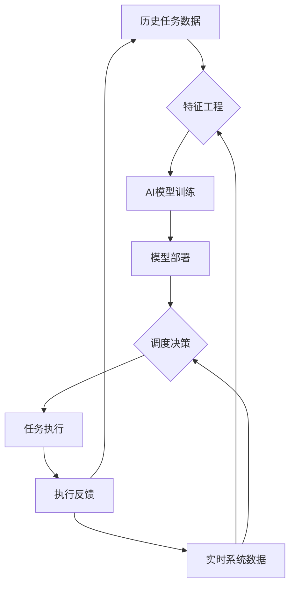

在分布式调度平台的发展历程中，从最初的简单定时调度到复杂的分布式任务编排，调度算法和策略不断演进。随着人工智能技术的快速发展，将AI能力深度集成到调度平台中，实现预测任务运行时间、智能资源推荐、故障预测等智能化功能，已成为下一代调度系统的重要特征。基于AI的智能调度不仅能够提升调度效率和资源利用率，还能显著改善用户体验和系统稳定性。本文将深入探讨基于AI的智能调度的核心理念、关键技术实现以及最佳实践。

## 智能调度的核心价值

理解AI在调度平台中的应用价值是构建智能调度系统的基础。

### 实施挑战分析

在分布式调度平台中实现基于AI的智能调度面临诸多挑战：

**数据质量挑战：**
1. **数据完整性**：历史任务数据的完整性和准确性难以保证
2. **特征工程**：如何从复杂的数据中提取有效的特征
3. **数据标注**：监督学习需要大量高质量的标注数据
4. **实时性要求**：调度决策需要实时或近实时的数据支持

**算法选择挑战：**
1. **模型复杂性**：复杂的AI模型可能影响调度性能
2. **准确性权衡**：模型准确性和计算开销的平衡
3. **可解释性**：调度决策需要具备一定的可解释性
4. **适应性**：模型需要适应不断变化的业务场景

**系统集成挑战：**
1. **实时推理**：AI模型推理需要在毫秒级完成
2. **系统耦合**：AI模块与调度核心的耦合度控制
3. **容错机制**：AI模块故障时的降级处理机制
4. **性能影响**：AI计算对系统整体性能的影响

**运维管理挑战：**
1. **模型更新**：AI模型的持续训练和更新机制
2. **监控告警**：AI模块的监控和异常检测
3. **版本管理**：AI模型的版本控制和回滚
4. **成本控制**：AI计算资源的成本控制

### 核心价值体现

基于AI的智能调度带来的核心价值：

**调度效率提升：**
1. **精准预测**：准确预测任务运行时间和资源需求
2. **智能分配**：基于预测结果智能分配资源
3. **优化编排**：优化任务执行顺序和并发策略
4. **动态调整**：根据实时情况动态调整调度策略

**资源利用率优化：**
1. **负载均衡**：智能实现负载均衡和资源调度
2. **成本控制**：优化资源使用降低成本
3. **容量规划**：基于预测进行精准的容量规划
4. **弹性伸缩**：智能触发资源的弹性伸缩

**系统稳定性增强：**
1. **故障预警**：提前预测和预警潜在故障
2. **自愈能力**：自动处理常见的系统异常
3. **风险控制**：识别和控制调度风险
4. **质量保障**：提升任务执行的成功率和质量

## AI调度架构设计

设计基于AI的智能调度架构。

### 整体架构

构建AI驱动的调度架构：

**架构分层：**
```yaml
# AI调度架构
ai_scheduling_architecture:
  layers:
    # 数据层
    data_layer:
      components:
        - name: "historical_data_store"
          description: "历史任务数据存储"
          storage: "data_warehouse"
          data_types:
            - task_metadata
            - execution_logs
            - resource_metrics
            - performance_data
        
        - name: "real_time_data_stream"
          description: "实时数据流"
          storage: "streaming_platform"
          data_types:
            - current_tasks
            - system_metrics
            - user_behavior
            - external_events
    
    # 特征工程层
    feature_engineering_layer:
      components:
        - name: "feature_extractor"
          description: "特征提取器"
          functions:
            - extract_task_features
            - extract_resource_features
            - extract_temporal_features
            - extract_contextual_features
        
        - name: "feature_store"
          description: "特征存储"
          storage: "feature_database"
          functions:
            - store_features
            - retrieve_features
            - feature_versioning
    
    # 模型层
    model_layer:
      components:
        - name: "prediction_models"
          description: "预测模型集群"
          models:
            - execution_time_predictor
            - resource_demand_predictor
            - failure_predictor
            - priority_optimizer
        
        - name: "recommendation_engine"
          description: "推荐引擎"
          functions:
            - resource_recommendation
            - scheduling_strategy
            - task_prioritization
        
        - name: "model_management"
          description: "模型管理"
          functions:
            - model_training
            - model_deployment
            - model_monitoring
            - model_versioning
    
    # 调度决策层
    scheduling_layer:
      components:
        - name: "ai_scheduler"
          description: "AI调度器"
          functions:
            - intelligent_scheduling
            - dynamic_adjustment
            - risk_assessment
            - optimization_decisions
        
        - name: "traditional_scheduler"
          description: "传统调度器"
          functions:
            - fallback_scheduling
            - rule_based_scheduling
            - emergency_handling
    
    # 执行层
    execution_layer:
      components:
        - name: "smart_executor"
          description: "智能执行器"
          functions:
            - adaptive_execution
            - resource_optimization
            - performance_monitoring
```

**数据流向：**


### 特征工程设计

设计全面的特征工程体系：

**任务特征：**
```python
# 任务特征提取
class TaskFeatureExtractor:
    def __init__(self):
        self.feature_store = FeatureStore()
    
    def extract_task_features(self, task):
        """提取任务特征"""
        features = {}
        
        # 基础特征
        features['task_type'] = task.type
        features['task_priority'] = task.priority
        features['task_complexity'] = self.calculate_complexity(task)
        features['task_size'] = self.calculate_size(task)
        
        # 历史特征
        historical_data = self.get_historical_data(task)
        features['historical_execution_time_avg'] = historical_data.avg_execution_time
        features['historical_execution_time_std'] = historical_data.std_execution_time
        features['historical_success_rate'] = historical_data.success_rate
        features['historical_resource_usage'] = historical_data.avg_resource_usage
        
        # 时间特征
        features['scheduled_time'] = task.scheduled_time
        features['day_of_week'] = task.scheduled_time.weekday()
        features['hour_of_day'] = task.scheduled_time.hour
        features['is_weekend'] = task.scheduled_time.weekday() >= 5
        
        # 依赖特征
        features['dependency_count'] = len(task.dependencies)
        features['critical_path_length'] = self.calculate_critical_path(task)
        features['upstream_task_count'] = self.count_upstream_tasks(task)
        
        # 用户特征
        features['user_id'] = task.user_id
        features['user_historical_activity'] = self.get_user_activity(task.user_id)
        features['user_priority_level'] = self.get_user_priority(task.user_id)
        
        return features
    
    def calculate_complexity(self, task):
        """计算任务复杂度"""
        # 基于代码行数、依赖关系、计算密集度等计算
        complexity_score = 0
        
        if hasattr(task, 'code_lines'):
            complexity_score += min(task.code_lines / 1000, 10)
        
        if hasattr(task, 'dependencies'):
            complexity_score += len(task.dependencies) * 0.5
        
        if hasattr(task, 'cpu_intensive'):
            complexity_score += 5 if task.cpu_intensive else 0
        
        return min(complexity_score, 20)  # 最大复杂度20
    
    def get_historical_data(self, task):
        """获取历史数据"""
        # 从特征存储中获取该任务类型的历史数据
        return self.feature_store.get_task_history(task.type)
```

**资源特征：**
```java
// 资源特征提取
@Component
public class ResourceFeatureExtractor {
    
    @Autowired
    private ResourceMetricsService metricsService;
    
    @Autowired
    private FeatureStore featureStore;
    
    public ResourceFeatures extractResourceFeatures(String resourceId) {
        ResourceFeatures features = new ResourceFeatures();
        
        // 当前资源状态
        ResourceMetrics currentMetrics = metricsService.getCurrentMetrics(resourceId);
        features.setCurrentCpuUsage(currentMetrics.getCpuUsage());
        features.setCurrentMemoryUsage(currentMetrics.getMemoryUsage());
        features.setCurrentDiskIo(currentMetrics.getDiskIo());
        features.setCurrentNetworkUsage(currentMetrics.getNetworkUsage());
        
        // 历史资源趋势
        ResourceTrendHistory trendHistory = featureStore.getResourceTrend(resourceId);
        features.setCpuUsageTrend(trendHistory.getCpuUsageTrend());
        features.setMemoryUsageTrend(trendHistory.getMemoryUsageTrend());
        features.setPerformanceStability(trendHistory.getStabilityScore());
        
        // 资源能力特征
        ResourceCapability capability = metricsService.getResourceCapability(resourceId);
        features.setCpuCores(capability.getCpuCores());
        features.setMemoryCapacity(capability.getMemoryCapacity());
        features.setDiskCapacity(capability.getDiskCapacity());
        features.setNetworkBandwidth(capability.getNetworkBandwidth());
        
        // 负载特征
        ResourceLoad load = metricsService.getCurrentLoad(resourceId);
        features.setCurrentLoad(load.getLoadAverage());
        features.setLoadVariance(load.getLoadVariance());
        features.setPeakLoadTime(load.getPeakTime());
        
        // 健康状态
        ResourceHealth health = metricsService.getHealthStatus(resourceId);
        features.setHealthScore(health.getHealthScore());
        features.setLastErrorTime(health.getLastErrorTime());
        features.setMaintenanceRequired(health.isMaintenanceRequired());
        
        return features;
    }
}
```

### 模型架构设计

设计AI模型架构：

**模型分类：**
```yaml
# AI模型分类
ai_models:
  # 预测模型
  prediction_models:
    - name: "execution_time_predictor"
      type: "regression"
      algorithm: "xgboost/nn"
      features:
        - task_complexity
        - historical_execution_time
        - resource_availability
        - system_load
        - time_features
      target: "actual_execution_time"
      evaluation_metrics:
        - mae: "< 30s"
        - rmse: "< 60s"
        - r2: "> 0.8"
    
    - name: "resource_demand_predictor"
      type: "multi_output_regression"
      algorithm: "random_forest/nn"
      features:
        - task_type
        - task_complexity
        - historical_resource_usage
        - system_state
      targets:
        - cpu_demand
        - memory_demand
        - disk_demand
      evaluation_metrics:
        - mape: "< 15%"
        - accuracy: "> 85%"
    
    - name: "failure_predictor"
      type: "classification"
      algorithm: "lstm/xgboost"
      features:
        - system_metrics
        - error_logs
        - resource_utilization
        - historical_failures
      target: "failure_probability"
      evaluation_metrics:
        - precision: "> 0.8"
        - recall: "> 0.7"
        - f1_score: "> 0.75"
  
  # 推荐模型
  recommendation_models:
    - name: "resource_recommender"
      type: "ranking"
      algorithm: "collaborative_filtering"
      features:
        - task_requirements
        - resource_capabilities
        - historical_performance
        - current_load
      target: "resource_ranking"
      evaluation_metrics:
        - ndcg: "> 0.8"
        - map: "> 0.7"
    
    - name: "scheduling_optimizer"
      type: "reinforcement_learning"
      algorithm: "ppo/actor_critic"
      features:
        - current_system_state
        - pending_tasks
        - resource_status
        - business_priority
      actions:
        - schedule_task
        - reschedule_task
        - adjust_priority
      rewards:
        - task_completion_rate
        - resource_utilization
        - deadline_meet_rate
```

## 核心功能实现

实现智能调度的核心功能。

### 任务运行时间预测

实现精准的任务运行时间预测：

**预测模型实现：**
```python
# 任务运行时间预测模型
import xgboost as xgb
import numpy as np
from sklearn.model_selection import train_test_split
from sklearn.metrics import mean_absolute_error, mean_squared_error
import joblib

class ExecutionTimePredictor:
    def __init__(self, model_path=None):
        self.model = None
        self.scaler = None
        if model_path:
            self.load_model(model_path)
    
    def prepare_features(self, tasks):
        """准备特征数据"""
        features = []
        targets = []
        
        for task in tasks:
            # 提取特征
            feature_vector = [
                task.complexity,  # 任务复杂度
                task.historical_avg_time,  # 历史平均执行时间
                task.historical_std_time,  # 历史执行时间标准差
                task.cpu_demand,  # CPU需求
                task.memory_demand,  # 内存需求
                task.system_load,  # 系统负载
                task.hour_of_day,  # 小时特征
                task.day_of_week,  # 星期特征
                len(task.dependencies),  # 依赖数量
            ]
            features.append(feature_vector)
            targets.append(task.actual_execution_time)
        
        return np.array(features), np.array(targets)
    
    def train(self, training_data, validation_data=None):
        """训练模型"""
        # 准备训练数据
        X_train, y_train = self.prepare_features(training_data)
        
        # 数据标准化
        from sklearn.preprocessing import StandardScaler
        self.scaler = StandardScaler()
        X_train_scaled = self.scaler.fit_transform(X_train)
        
        # 训练XGBoost模型
        self.model = xgb.XGBRegressor(
            n_estimators=100,
            max_depth=6,
            learning_rate=0.1,
            objective='reg:squarederror',
            random_state=42
        )
        
        self.model.fit(X_train_scaled, y_train)
        
        # 验证模型性能
        if validation_data:
            X_val, y_val = self.prepare_features(validation_data)
            X_val_scaled = self.scaler.transform(X_val)
            y_pred = self.model.predict(X_val_scaled)
            
            mae = mean_absolute_error(y_val, y_pred)
            rmse = np.sqrt(mean_squared_error(y_val, y_pred))
            
            print(f"验证集 MAE: {mae:.2f}秒")
            print(f"验证集 RMSE: {rmse:.2f}秒")
        
        return self
    
    def predict(self, task):
        """预测任务执行时间"""
        if not self.model:
            raise ValueError("模型尚未训练")
        
        # 准备特征
        feature_vector = np.array([[
            task.complexity,
            task.historical_avg_time,
            task.historical_std_time,
            task.cpu_demand,
            task.memory_demand,
            task.system_load,
            task.hour_of_day,
            task.day_of_week,
            len(task.dependencies),
        ]])
        
        # 特征标准化
        feature_scaled = self.scaler.transform(feature_vector)
        
        # 预测
        predicted_time = self.model.predict(feature_scaled)[0]
        
        # 计算置信区间
        confidence_interval = self.calculate_confidence_interval(task, predicted_time)
        
        return {
            'predicted_time': max(predicted_time, 1),  # 最小1秒
            'confidence_interval': confidence_interval,
            'confidence_score': self.calculate_confidence_score(task)
        }
    
    def calculate_confidence_interval(self, task, predicted_time):
        """计算置信区间"""
        # 基于历史数据的变异系数计算置信区间
        if task.historical_std_time > 0 and task.historical_avg_time > 0:
            cv = task.historical_std_time / task.historical_avg_time
            margin = predicted_time * cv * 1.96  # 95%置信区间
            return {
                'lower': max(predicted_time - margin, 1),
                'upper': predicted_time + margin
            }
        else:
            # 默认置信区间
            return {
                'lower': predicted_time * 0.8,
                'upper': predicted_time * 1.2
            }
    
    def calculate_confidence_score(self, task):
        """计算预测置信度"""
        score = 1.0
        
        # 历史数据量影响置信度
        if task.historical_execution_count < 10:
            score *= 0.7
        elif task.historical_execution_count < 50:
            score *= 0.9
        
        # 任务复杂度影响置信度
        if task.complexity > 15:
            score *= 0.8
        
        # 系统负载稳定性影响置信度
        if task.system_load_std > 0.3:
            score *= 0.9
        
        return max(min(score, 1.0), 0.1)
    
    def save_model(self, model_path):
        """保存模型"""
        model_data = {
            'model': self.model,
            'scaler': self.scaler
        }
        joblib.dump(model_data, model_path)
    
    def load_model(self, model_path):
        """加载模型"""
        model_data = joblib.load(model_path)
        self.model = model_data['model']
        self.scaler = model_data['scaler']
```

### 智能资源推荐

实现智能的资源推荐系统：

**推荐引擎实现：**
```go
// 智能资源推荐引擎
package recommendation

import (
    "context"
    "sort"
    "math"
    
    "github.com/example/scheduler/types"
    "github.com/example/scheduler/models"
)

type ResourceRecommender struct {
    resourceRepository ResourceRepository
    predictionModel    PredictionModel
    logger             Logger
}

type ResourceScore struct {
    ResourceID string
    Score      float64
    Reason     string
    Details    map[string]float64
}

func NewResourceRecommender(repo ResourceRepository, model PredictionModel) *ResourceRecommender {
    return &ResourceRecommender{
        resourceRepository: repo,
        predictionModel:    model,
        logger:             NewLogger("ResourceRecommender"),
    }
}

func (r *ResourceRecommender) RecommendResources(ctx context.Context, task *types.Task, 
                                                 count int) ([]ResourceScore, error) {
    // 获取可用资源
    availableResources, err := r.resourceRepository.GetAvailableResources(ctx)
    if err != nil {
        return nil, err
    }
    
    // 计算每个资源的评分
    scores := make([]ResourceScore, 0, len(availableResources))
    
    for _, resource := range availableResources {
        score, err := r.calculateResourceScore(ctx, task, resource)
        if err != nil {
            r.logger.Warn("计算资源评分失败", "resource", resource.ID, "error", err)
            continue
        }
        scores = append(scores, score)
    }
    
    // 按评分排序
    sort.Slice(scores, func(i, j int) bool {
        return scores[i].Score > scores[j].Score
    })
    
    // 返回前N个推荐
    if len(scores) > count {
        return scores[:count], nil
    }
    return scores, nil
}

func (r *ResourceRecommender) calculateResourceScore(ctx context.Context, task *types.Task, 
                                                    resource *types.Resource) (ResourceScore, error) {
    score := ResourceScore{
        ResourceID: resource.ID,
        Details:    make(map[string]float64),
    }
    
    // 1. 资源匹配度评分 (0-1)
    capabilityScore := r.calculateCapabilityScore(task, resource)
    score.Details["capability"] = capabilityScore
    
    // 2. 性能评分 (0-1)
    performanceScore := r.calculatePerformanceScore(resource)
    score.Details["performance"] = performanceScore
    
    // 3. 负载评分 (0-1)
    loadScore := r.calculateLoadScore(resource)
    score.Details["load"] = loadScore
    
    // 4. 历史表现评分 (0-1)
    historyScore := r.calculateHistoryScore(task, resource)
    score.Details["history"] = historyScore
    
    // 5. 成本评分 (0-1)
    costScore := r.calculateCostScore(resource)
    score.Details["cost"] = costScore
    
    // 加权计算总分
    totalScore := 
        capabilityScore * 0.3 +    // 能力匹配权重30%
        performanceScore * 0.25 +  // 性能权重25%
        loadScore * 0.2 +          // 负载权重20%
        historyScore * 0.15 +      // 历史权重15%
        costScore * 0.1            // 成本权重10%
    
    score.Score = totalScore
    score.Reason = r.generateScoreReason(score.Details)
    
    return score, nil
}

func (r *ResourceRecommender) calculateCapabilityScore(task *types.Task, resource *types.Resource) float64 {
    // CPU能力匹配
    cpuMatch := math.Min(float64(resource.CPUCores) / float64(task.CPURequirement), 1.0)
    
    // 内存能力匹配
    memoryMatch := math.Min(float64(resource.MemoryGB) / float64(task.MemoryRequirementGB), 1.0)
    
    // 存储能力匹配
    storageMatch := math.Min(float64(resource.StorageGB) / float64(task.StorageRequirementGB), 1.0)
    
    // 网络能力匹配
    networkMatch := 1.0
    if task.NetworkRequirementMbps > 0 {
        networkMatch = math.Min(float64(resource.NetworkMbps) / float64(task.NetworkRequirementMbps), 1.0)
    }
    
    // 综合能力匹配度
    capabilityScore := (cpuMatch + memoryMatch + storageMatch + networkMatch) / 4.0
    
    // 如果任何一项不满足最低要求，评分大幅降低
    if cpuMatch < 0.8 || memoryMatch < 0.8 {
        capabilityScore *= 0.3
    }
    
    return capabilityScore
}

func (r *ResourceRecommender) calculatePerformanceScore(resource *types.Resource) float64 {
    // 基于历史性能数据计算
    avgResponseTime := resource.Metrics.AvgResponseTimeMs
    successRate := resource.Metrics.SuccessRate
    
    // 响应时间评分 (假设目标响应时间100ms)
    timeScore := math.Max(0, 1.0 - (avgResponseTime-100)/200)
    
    // 成功率评分
    successScore := successRate
    
    return (timeScore + successScore) / 2.0
}

func (r *ResourceRecommender) calculateLoadScore(resource *types.Resource) float64 {
    // 当前负载
    currentLoad := resource.Metrics.CurrentLoad
    
    // 负载评分 (负载越低评分越高)
    loadScore := math.Max(0, 1.0 - currentLoad/100.0)
    
    // 考虑负载趋势
    loadTrend := resource.Metrics.LoadTrend
    if loadTrend > 5 {  // 负载上升趋势
        loadScore *= 0.8
    } else if loadTrend < -5 {  // 负载下降趋势
        loadScore *= 1.1  // 给予奖励
    }
    
    return math.Min(loadScore, 1.0)
}

func (r *ResourceRecommender) calculateHistoryScore(task *types.Task, resource *types.Resource) float64 {
    // 获取该资源执行类似任务的历史数据
    history := r.resourceRepository.GetTaskHistory(resource.ID, task.Type)
    if len(history) == 0 {
        // 没有历史数据，给中等评分
        return 0.7
    }
    
    // 计算历史成功率
    successCount := 0
    totalTime := 0.0
    predictedTime := 0.0
    
    for _, record := range history {
        if record.Status == "success" {
            successCount++
            totalTime += record.ActualTime
            predictedTime += record.PredictedTime
        }
    }
    
    successRate := float64(successCount) / float64(len(history))
    
    // 计算时间准确性 (预测时间与实际时间的匹配度)
    timeAccuracy := 1.0
    if predictedTime > 0 {
        timeAccuracy = 1.0 - math.Abs(totalTime-predictedTime) / predictedTime
        timeAccuracy = math.Max(0, timeAccuracy)
    }
    
    return (successRate + timeAccuracy) / 2.0
}

func (r *ResourceRecommender) calculateCostScore(resource *types.Resource) float64 {
    // 基于资源成本计算性价比
    costPerHour := resource.CostPerHour
    
    // 假设基准成本为$1/hour
    baseCost := 1.0
    costScore := math.Max(0, 1.0 - (costPerHour-baseCost)/baseCost)
    
    // 对于高性能资源，适当降低成本权重
    if resource.CPUCores > 8 || resource.MemoryGB > 32 {
        costScore = (costScore + 1.0) / 2.0  // 给予一定宽容
    }
    
    return costScore
}

func (r *ResourceRecommender) generateScoreReason(details map[string]float64) string {
    // 生成评分原因说明
    var reasons []string
    
    if details["capability"] < 0.5 {
        reasons = append(reasons, "资源能力匹配度较低")
    }
    if details["load"] < 0.3 {
        reasons = append(reasons, "当前负载较高")
    }
    if details["performance"] < 0.6 {
        reasons = append(reasons, "历史性能表现一般")
    }
    
    if len(reasons) == 0 {
        return "综合表现优秀"
    }
    
    return "原因: " + strings.Join(reasons, ", ")
}
```

### 故障预测系统

实现智能的故障预测系统：

**预测模型实现：**
```java
// 故障预测系统
@Component
public class FaultPredictor {
    
    @Autowired
    private MLModelService mlModelService;
    
    @Autowired
    private MetricsService metricsService;
    
    @Autowired
    private AlertService alertService;
    
    private ScheduledExecutorService scheduler;
    
    @PostConstruct
    public void init() {
        // 启动定期预测任务
        scheduler = Executors.newScheduledThreadPool(2);
        scheduler.scheduleAtFixedRate(this::predictAndAlert, 0, 30, TimeUnit.SECONDS);
    }
    
    public FaultPredictionResult predictFault(String resourceId) {
        try {
            // 收集特征数据
            FaultFeatures features = collectFaultFeatures(resourceId);
            
            // 使用ML模型进行预测
            MLModel model = mlModelService.getModel("fault_prediction");
            PredictionResult prediction = model.predict(features.toVector());
            
            // 构造预测结果
            FaultPredictionResult result = new FaultPredictionResult();
            result.setResourceId(resourceId);
            result.setFaultProbability(prediction.getProbability());
            result.setConfidenceScore(prediction.getConfidence());
            result.setPredictionTime(Instant.now());
            
            // 分析高风险因素
            List<RiskFactor> riskFactors = analyzeRiskFactors(features, prediction);
            result.setRiskFactors(riskFactors);
            
            // 生成建议措施
            List<Recommendation> recommendations = generateRecommendations(riskFactors);
            result.setRecommendations(recommendations);
            
            return result;
            
        } catch (Exception e) {
            log.error("故障预测失败: {}", resourceId, e);
            throw new PredictionException("故障预测失败", e);
        }
    }
    
    private FaultFeatures collectFaultFeatures(String resourceId) {
        FaultFeatures features = new FaultFeatures();
        
        // 系统指标特征
        SystemMetrics metrics = metricsService.getSystemMetrics(resourceId);
        features.setCpuUsage(metrics.getCpuUsage());
        features.setMemoryUsage(metrics.getMemoryUsage());
        features.setDiskIo(metrics.getDiskIo());
        features.setNetworkLatency(metrics.getNetworkLatency());
        features.setThreadCount(metrics.getThreadCount());
        
        // 趋势特征
        TrendAnalysis trend = metricsService.getTrendAnalysis(resourceId);
        features.setCpuUsageTrend(trend.getCpuUsageTrend());
        features.setMemoryUsageTrend(trend.getMemoryUsageTrend());
        features.setErrorRateTrend(trend.getErrorRateTrend());
        features.setResponseTimeTrend(trend.getResponseTimeTrend());
        
        // 历史故障特征
        FailureHistory history = metricsService.getFailureHistory(resourceId);
        features.setRecentFailureCount(history.getRecentFailureCount());
        features.setFailureFrequency(history.getFailureFrequency());
        features.setMeanTimeBetweenFailures(history.getMeanTimeBetweenFailures());
        
        // 日志特征
        LogAnalysis logAnalysis = metricsService.analyzeLogs(resourceId);
        features.setErrorLogCount(logAnalysis.getErrorCount());
        features.setWarningLogCount(logAnalysis.getWarningCount());
        features.setExceptionCount(logAnalysis.getExceptionCount());
        features.setSlowOperationCount(logAnalysis.getSlowOperationCount());
        
        // 时间特征
        LocalDateTime now = LocalDateTime.now();
        features.setHourOfDay(now.getHour());
        features.setDayOfWeek(now.getDayOfWeek().getValue());
        features.setIsWeekend(now.getDayOfWeek().getValue() > 5);
        
        return features;
    }
    
    private List<RiskFactor> analyzeRiskFactors(FaultFeatures features, PredictionResult prediction) {
        List<RiskFactor> riskFactors = new ArrayList<>();
        
        // CPU使用率过高风险
        if (features.getCpuUsage() > 90) {
            riskFactors.add(new RiskFactor("HIGH_CPU_USAGE", 
                "CPU使用率过高", 
                features.getCpuUsage() / 100.0,
                "当前CPU使用率: " + features.getCpuUsage() + "%"));
        }
        
        // 内存使用率过高风险
        if (features.getMemoryUsage() > 85) {
            riskFactors.add(new RiskFactor("HIGH_MEMORY_USAGE", 
                "内存使用率过高", 
                features.getMemoryUsage() / 100.0,
                "当前内存使用率: " + features.getMemoryUsage() + "%"));
        }
        
        // 错误日志激增风险
        if (features.getErrorLogCount() > 100) {
            riskFactors.add(new RiskFactor("ERROR_LOG_SPIKE", 
                "错误日志激增", 
                Math.min(features.getErrorLogCount() / 500.0, 1.0),
                "最近错误日志数: " + features.getErrorLogCount()));
        }
        
        // 响应时间恶化风险
        if (features.getResponseTimeTrend() > 20) {
            riskFactors.add(new RiskFactor("RESPONSE_TIME_DEGRADATION", 
                "响应时间恶化", 
                Math.min(features.getResponseTimeTrend() / 50.0, 1.0),
                "响应时间趋势: +" + features.getResponseTimeTrend() + "ms"));
        }
        
        return riskFactors;
    }
    
    private List<Recommendation> generateRecommendations(List<RiskFactor> riskFactors) {
        List<Recommendation> recommendations = new ArrayList<>();
        
        for (RiskFactor factor : riskFactors) {
            switch (factor.getType()) {
                case "HIGH_CPU_USAGE":
                    recommendations.add(new Recommendation(
                        "RESOURCE_SCALING", 
                        "建议扩容CPU资源", 
                        "Priority.HIGH"));
                    recommendations.add(new Recommendation(
                        "TASK_REBALANCING", 
                        "建议重新平衡任务负载", 
                        "Priority.MEDIUM"));
                    break;
                    
                case "HIGH_MEMORY_USAGE":
                    recommendations.add(new Recommendation(
                        "MEMORY_CLEANUP", 
                        "建议执行内存清理", 
                        "Priority.HIGH"));
                    recommendations.add(new Recommendation(
                        "RESOURCE_SCALING", 
                        "建议扩容内存资源", 
                        "Priority.MEDIUM"));
                    break;
                    
                case "ERROR_LOG_SPIKE":
                    recommendations.add(new Recommendation(
                        "LOG_ANALYSIS", 
                        "建议分析错误日志", 
                        "Priority.HIGH"));
                    recommendations.add(new Recommendation(
                        "HEALTH_CHECK", 
                        "建议执行健康检查", 
                        "Priority.HIGH"));
                    break;
                    
                case "RESPONSE_TIME_DEGRADATION":
                    recommendations.add(new Recommendation(
                        "PERFORMANCE_TUNING", 
                        "建议性能调优", 
                        "Priority.MEDIUM"));
                    recommendations.add(new Recommendation(
                        "TASK_OPTIMIZATION", 
                        "建议优化任务执行", 
                        "Priority.MEDIUM"));
                    break;
            }
        }
        
        return recommendations;
    }
    
    private void predictAndAlert() {
        try {
            // 获取所有监控资源
            List<String> resourceIds = metricsService.getAllResourceIds();
            
            for (String resourceId : resourceIds) {
                FaultPredictionResult result = predictFault(resourceId);
                
                // 如果故障概率超过阈值，发送告警
                if (result.getFaultProbability() > 0.7) {
                    sendFaultAlert(result);
                }
            }
            
        } catch (Exception e) {
            log.error("定期故障预测失败", e);
        }
    }
    
    private void sendFaultAlert(FaultPredictionResult result) {
        Alert alert = new Alert();
        alert.setType(AlertType.PREDICTIVE_FAULT);
        alert.setLevel(result.getFaultProbability() > 0.9 ? AlertLevel.CRITICAL : AlertLevel.WARNING);
        alert.setTitle("故障预测告警 - 资源 " + result.getResourceId());
        alert.setContent(String.format(
            "预测故障概率: %.2f%%\n置信度: %.2f%%\n高风险因素: %s",
            result.getFaultProbability() * 100,
            result.getConfidenceScore() * 100,
            result.getRiskFactors().stream()
                .map(RiskFactor::getDescription)
                .collect(Collectors.joining(", "))
        ));
        alert.setResource(result.getResourceId());
        alert.setTimestamp(result.getPredictionTime());
        
        // 添加建议措施
        alert.setRecommendations(result.getRecommendations());
        
        alertService.sendAlert(alert);
    }
}
```

## 系统集成与优化

实现AI调度系统的集成与优化。

### 调度决策引擎

实现智能调度决策引擎：

**决策流程：**
```yaml
# 智能调度决策流程
scheduling_decision_flow:
  steps:
    - step: "task_analysis"
      description: "任务分析"
      actions:
        - extract_task_features
        - predict_execution_time
        - assess_resource_requirements
        - evaluate_dependencies
    
    - step: "resource_assessment"
      description: "资源评估"
      actions:
        - get_available_resources
        - predict_resource_availability
        - calculate_resource_scores
        - identify_bottlenecks
    
    - step: "risk_evaluation"
      description: "风险评估"
      actions:
        - predict_failure_probability
        - assess_system_stability
        - evaluate_sla_impact
        - calculate_risk_score
    
    - step: "optimization_planning"
      description: "优化规划"
      actions:
        - generate_scheduling_options
        - evaluate_trade-offs
        - optimize_resource_allocation
        - plan_execution_sequence
    
    - step: "decision_making"
      description: "决策制定"
      actions:
        - apply_decision_rules
        - select_optimal_strategy
        - generate_execution_plan
        - create_contingency_plan
    
    - step: "execution_monitoring"
      description: "执行监控"
      actions:
        - track_execution_progress
        - monitor_performance_metrics
        - detect_anomalies
        - trigger_adjustments
```

**决策引擎实现：**
```python
# 智能调度决策引擎
class IntelligentScheduler:
    def __init__(self, config):
        self.config = config
        self.execution_predictor = ExecutionTimePredictor()
        self.resource_recommender = ResourceRecommender()
        self.fault_predictor = FaultPredictor()
        self.optimizer = SchedulingOptimizer()
        self.logger = logging.getLogger("IntelligentScheduler")
    
    async def schedule_task(self, task):
        """智能调度任务"""
        try:
            # 1. 任务分析
            task_analysis = await self.analyze_task(task)
            
            # 2. 资源评估
            resource_assessment = await self.assess_resources(task_analysis)
            
            # 3. 风险评估
            risk_evaluation = await self.evaluate_risks(task, resource_assessment)
            
            # 4. 优化规划
            optimization_plan = await self.optimize_scheduling(
                task_analysis, resource_assessment, risk_evaluation
            )
            
            # 5. 决策制定
            final_decision = await self.make_decision(
                task, task_analysis, resource_assessment, 
                risk_evaluation, optimization_plan
            )
            
            # 6. 执行调度
            result = await self.execute_scheduling(task, final_decision)
            
            # 7. 记录决策过程
            await self.record_decision_process(
                task, task_analysis, final_decision, result
            )
            
            return result
            
        except Exception as e:
            self.logger.error(f"智能调度失败: {task.id}, 错误: {str(e)}")
            # 降级到传统调度
            return await self.fallback_scheduling(task)
    
    async def analyze_task(self, task):
        """任务分析"""
        analysis = {
            'task_id': task.id,
            'features': self.extract_task_features(task),
            'predicted_time': self.execution_predictor.predict(task),
            'complexity': self.calculate_task_complexity(task),
            'dependencies': self.analyze_dependencies(task),
            'priority': task.priority
        }
        
        self.logger.info(f"任务分析完成: {task.id}")
        return analysis
    
    async def assess_resources(self, task_analysis):
        """资源评估"""
        # 预测资源需求
        resource_demand = await self.predict_resource_demand(task_analysis)
        
        # 获取可用资源
        available_resources = await self.get_available_resources()
        
        # 资源评分和推荐
        resource_scores = await self.resource_recommender.recommend_resources(
            task_analysis['features'], len(available_resources)
        )
        
        # 资源健康状态预测
        resource_health = {}
        for resource in available_resources:
            health_prediction = await self.fault_predictor.predict_fault(resource.id)
            resource_health[resource.id] = health_prediction
        
        assessment = {
            'demand': resource_demand,
            'available': available_resources,
            'scores': resource_scores,
            'health': resource_health
        }
        
        self.logger.info("资源评估完成")
        return assessment
    
    async def evaluate_risks(self, task, resource_assessment):
        """风险评估"""
        risks = []
        
        # 执行时间风险
        time_prediction = task.predicted_time
        if time_prediction.confidence_score < 0.7:
            risks.append({
                'type': 'TIME_PREDICTION_UNCERTAIN',
                'level': 'MEDIUM',
                'description': '执行时间预测不确定性较高'
            })
        
        # 资源风险
        for resource_id, health in resource_assessment['health'].items():
            if health.fault_probability > 0.6:
                risks.append({
                    'type': 'RESOURCE_FAILURE_RISK',
                    'level': 'HIGH' if health.fault_probability > 0.8 else 'MEDIUM',
                    'description': f'资源 {resource_id} 故障风险: {health.fault_probability:.2%}'
                })
        
        # SLA风险
        if task.deadline and self.calculate_sla_risk(task, resource_assessment) > 0.3:
            risks.append({
                'type': 'SLA_VIOLATION_RISK',
                'level': 'HIGH',
                'description': '可能无法满足SLA要求'
            })
        
        risk_evaluation = {
            'risks': risks,
            'overall_risk_score': self.calculate_overall_risk(risks),
            'recommendations': self.generate_risk_mitigation_recommendations(risks)
        }
        
        self.logger.info("风险评估完成")
        return risk_evaluation
    
    async def optimize_scheduling(self, task_analysis, resource_assessment, risk_evaluation):
        """优化调度规划"""
        # 使用强化学习优化器
        state = self.build_optimizer_state(task_analysis, resource_assessment, risk_evaluation)
        action = self.optimizer.select_action(state)
        
        # 生成优化方案
        optimization_plan = {
            'selected_resources': action.selected_resources,
            'execution_sequence': action.execution_sequence,
            'backup_plan': action.backup_plan,
            'expected_performance': action.expected_performance,
            'risk_mitigation': action.risk_mitigation
        }
        
        self.logger.info("调度优化完成")
        return optimization_plan
    
    async def make_decision(self, task, task_analysis, resource_assessment, 
                          risk_evaluation, optimization_plan):
        """制定最终决策"""
        # 应用决策规则
        if risk_evaluation['overall_risk_score'] > 0.8:
            # 高风险情况下采取保守策略
            decision = self.apply_conservative_strategy(
                task, task_analysis, resource_assessment
            )
        elif task.priority == 'HIGH':
            # 高优先级任务采取激进策略
            decision = self.apply_aggressive_strategy(
                task, optimization_plan
            )
        else:
            # 正常情况下采用平衡策略
            decision = self.apply_balanced_strategy(
                task, optimization_plan, risk_evaluation
            )
        
        # 生成应急预案
        contingency_plan = self.generate_contingency_plan(decision, risk_evaluation)
        decision['contingency_plan'] = contingency_plan
        
        self.logger.info(f"调度决策完成: {task.id}")
        return decision
    
    async def execute_scheduling(self, task, decision):
        """执行调度"""
        try:
            # 提交任务到选定的资源
            result = await self.submit_task_to_resources(task, decision['selected_resources'])
            
            # 启动监控
            await self.start_monitoring(task.id, decision)
            
            self.logger.info(f"任务调度执行成功: {task.id}")
            return result
            
        except Exception as e:
            self.logger.error(f"任务调度执行失败: {task.id}, 错误: {str(e)}")
            raise
    
    async def fallback_scheduling(self, task):
        """降级调度"""
        self.logger.warning(f"智能调度失败，降级到传统调度: {task.id}")
        
        # 使用传统调度算法
        traditional_scheduler = TraditionalScheduler()
        return await traditional_scheduler.schedule(task)
```

### 持续学习机制

实现模型的持续学习和优化：

**在线学习：**
```go
// 在线学习机制
package learning

import (
    "context"
    "time"
    "sync"
    
    "github.com/example/scheduler/types"
    "github.com/example/scheduler/models"
)

type OnlineLearner struct {
    modelRegistry    ModelRegistry
    feedbackQueue    *FeedbackQueue
    learningConfig   LearningConfig
    logger           Logger
    mutex            sync.RWMutex
}

type LearningConfig struct {
    BatchSize        int           `json:"batch_size"`
    LearningRate     float64       `json:"learning_rate"`
    UpdateInterval   time.Duration `json:"update_interval"`
    FeedbackWindow   time.Duration `json:"feedback_window"`
}

func NewOnlineLearner(registry ModelRegistry, config LearningConfig) *OnlineLearner {
    learner := &OnlineLearner{
        modelRegistry:  registry,
        feedbackQueue:  NewFeedbackQueue(),
        learningConfig: config,
        logger:         NewLogger("OnlineLearner"),
    }
    
    // 启动定期学习任务
    go learner.startLearningLoop()
    
    return learner
}

func (l *OnlineLearner) RecordFeedback(ctx context.Context, feedback *types.Feedback) error {
    // 记录反馈数据
    return l.feedbackQueue.Enqueue(feedback)
}

func (l *OnlineLearner) startLearningLoop() {
    ticker := time.NewTicker(l.learningConfig.UpdateInterval)
    defer ticker.Stop()
    
    for {
        select {
        case <-ticker.C:
            l.performOnlineLearning()
        }
    }
}

func (l *OnlineLearner) performOnlineLearning() {
    // 获取反馈数据批次
    feedbackBatch, err := l.feedbackQueue.DequeueBatch(l.learningConfig.BatchSize)
    if err != nil {
        l.logger.Error("获取反馈数据失败", "error", err)
        return
    }
    
    if len(feedbackBatch) == 0 {
        return
    }
    
    l.logger.Info("开始在线学习", "batch_size", len(feedbackBatch))
    
    // 按模型类型分组反馈数据
    modelFeedback := l.groupFeedbackByModel(feedbackBatch)
    
    // 对每个模型进行在线学习
    for modelType, feedbacks := range modelFeedback {
        err := l.updateModel(modelType, feedbacks)
        if err != nil {
            l.logger.Error("模型更新失败", "model_type", modelType, "error", err)
        }
    }
    
    l.logger.Info("在线学习完成")
}

func (l *OnlineLearner) groupFeedbackByModel(feedbacks []*types.Feedback) map[string][]*types.Feedback {
    grouped := make(map[string][]*types.Feedback)
    
    for _, feedback := range feedbacks {
        modelType := l.determineModelType(feedback)
        grouped[modelType] = append(grouped[modelType], feedback)
    }
    
    return grouped
}

func (l *OnlineLearner) determineModelType(feedback *types.Feedback) string {
    // 根据反馈类型确定对应的模型
    switch feedback.Type {
    case "execution_time":
        return "execution_time_predictor"
    case "resource_allocation":
        return "resource_recommender"
    case "failure_prediction":
        return "failure_predictor"
    default:
        return "general_optimizer"
    }
}

func (l *OnlineLearner) updateModel(modelType string, feedbacks []*types.Feedback) error {
    // 获取当前模型
    model, err := l.modelRegistry.GetModel(modelType)
    if err != nil {
        return err
    }
    
    // 准备训练数据
    trainingData := l.prepareTrainingData(feedbacks)
    
    // 在线更新模型
    updatedModel, err := model.OnlineUpdate(trainingData, l.learningConfig.LearningRate)
    if err != nil {
        return err
    }
    
    // 保存更新后的模型
    err = l.modelRegistry.UpdateModel(modelType, updatedModel)
    if err != nil {
        return err
    }
    
    // 记录学习日志
    l.logger.Info("模型更新成功", 
        "model_type", modelType, 
        "feedback_count", len(feedbacks),
        "update_time", time.Now())
    
    return nil
}

func (l *OnlineLearner) prepareTrainingData(feedbacks []*types.Feedback) *TrainingData {
    features := make([][]float64, 0, len(feedbacks))
    targets := make([]float64, 0, len(feedbacks))
    
    for _, feedback := range feedbacks {
        // 提取特征向量
        featureVector := l.extractFeatures(feedback)
        features = append(features, featureVector)
        
        // 提取目标值
        targetValue := l.extractTarget(feedback)
        targets = append(targets, targetValue)
    }
    
    return &TrainingData{
        Features: features,
        Targets:  targets,
    }
}

func (l *OnlineLearner) extractFeatures(feedback *types.Feedback) []float64 {
    // 根据反馈类型提取特征
    switch feedback.Type {
    case "execution_time":
        return []float64{
            feedback.Task.Complexity,
            feedback.Task.CPURequirement,
            feedback.Task.MemoryRequirementGB,
            float64(feedback.Task.HourOfDay),
            float64(len(feedback.Task.Dependencies)),
            feedback.SystemLoad,
        }
    case "resource_allocation":
        return []float64{
            feedback.Resource.CPUCores,
            feedback.Resource.MemoryGB,
            feedback.Resource.CurrentLoad,
            feedback.Task.CPURequirement,
            feedback.Task.MemoryRequirementGB,
        }
    default:
        return []float64{}
    }
}

func (l *OnlineLearner) extractTarget(feedback *types.Feedback) float64 {
    // 根据反馈类型提取目标值
    switch feedback.Type {
    case "execution_time":
        return feedback.ActualExecutionTime
    case "resource_allocation":
        return feedback.AllocationScore
    case "failure_prediction":
        if feedback.FailureOccurred {
            return 1.0
        }
        return 0.0
    default:
        return 0.0
    }
}

// A/B测试机制
type ABTestManager struct {
    variants       map[string]*ModelVariant
    trafficControl *TrafficController
    metricsTracker *MetricsTracker
}

type ModelVariant struct {
    Name    string
    Model   MLModel
    Weight  float64
    Enabled bool
}

func NewABTestManager() *ABTestManager {
    return &ABTestManager{
        variants:       make(map[string]*ModelVariant),
        trafficControl: NewTrafficController(),
        metricsTracker: NewMetricsTracker(),
    }
}

func (m *ABTestManager) AddVariant(name string, model MLModel, weight float64) {
    m.variants[name] = &ModelVariant{
        Name:   name,
        Model:  model,
        Weight: weight,
        Enabled: true,
    }
}

func (m *ABTestManager) SelectVariant(ctx context.Context) (*ModelVariant, error) {
    // 根据权重选择模型变体
    return m.trafficControl.SelectWeightedVariant(m.variants)
}

func (m *ABTestManager) RecordVariantResult(variantName string, result *types.PredictionResult) {
    // 记录变体结果用于评估
    m.metricsTracker.RecordResult(variantName, result)
}

func (m *ABTestManager) GetBestVariant() *ModelVariant {
    // 根据评估结果获取最佳变体
    return m.metricsTracker.GetBestPerformingVariant()
}
```

## 最佳实践与实施建议

总结基于AI的智能调度最佳实践。

### 实施原则

遵循核心实施原则：

**渐进式实施原则：**
1. **分步推进**：从单一功能开始逐步扩展
2. **小范围试点**：在小范围内验证效果
3. **持续迭代**：基于反馈持续优化改进
4. **风险控制**：建立完善的降级和容错机制

**数据驱动原则：**
1. **质量优先**：确保训练数据的质量
2. **特征工程**：重视特征工程的设计和优化
3. **持续学习**：建立在线学习和反馈机制
4. **效果评估**：建立科学的评估体系

### 实施策略

制定科学的实施策略：

**技术选型：**
1. **框架选择**：选择合适的机器学习框架
2. **算法评估**：评估不同算法的适用性
3. **性能优化**：优化模型推理性能
4. **可扩展性**：确保系统的可扩展性

**团队建设：**
1. **技能培养**：培养AI和调度领域的复合型人才
2. **流程规范**：建立标准化的开发和运维流程
3. **工具链**：建设完善的工具链支持
4. **知识管理**：建立知识管理和经验分享机制

### 效果评估

建立效果评估机制：

**评估指标：**
1. **准确性指标**：预测准确率、推荐准确率等
2. **性能指标**：调度效率、资源利用率等
3. **稳定性指标**：系统可用性、故障率等
4. **业务指标**：用户满意度、成本节约等

**评估方法：**
1. **离线评估**：使用历史数据进行离线评估
2. **在线评估**：通过A/B测试进行在线评估
3. **对比分析**：与传统调度方法进行对比分析
4. **持续监控**：建立持续的监控和评估机制

## 小结

基于AI的智能调度是分布式调度平台发展的重要方向。通过实现任务运行时间预测、智能资源推荐、故障预测等核心功能，可以显著提升调度效率、资源利用率和系统稳定性。

在实际实施过程中，需要关注数据质量、算法选择、系统集成、运维管理等关键挑战。通过遵循渐进式实施原则、数据驱动原则，采用科学的实施策略，建立完善的效果评估机制，可以构建出高效可靠的智能调度系统。

随着AI技术的不断发展，智能调度技术也在持续演进。未来可能会出现更多创新的AI调度方案，如基于深度强化学习的自适应调度、多智能体协同调度、联邦学习在调度中的应用等。持续关注技术发展趋势，积极引入先进的理念和技术实现，将有助于构建更加智能、高效的调度体系。

基于AI的智能调度不仅是一种技术实现方式，更是一种智能化运维的理念。通过深入理解业务需求和技术特点，可以更好地指导智能调度系统的设计和实施，为构建下一代分布式调度系统奠定坚实基础。