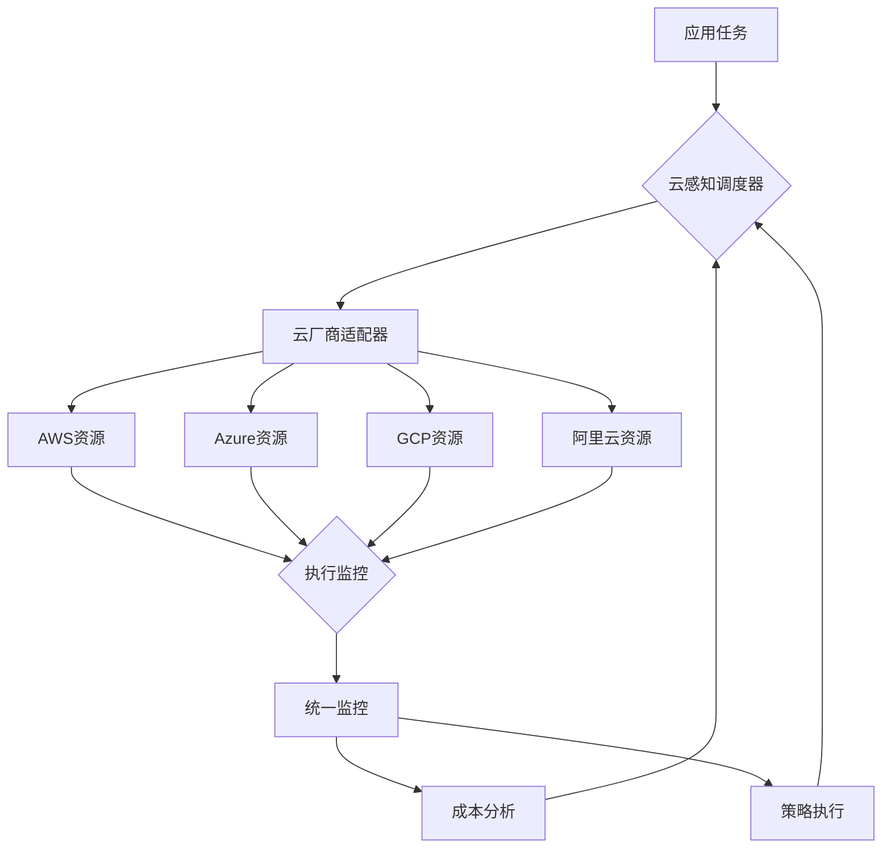

随着企业数字化转型的深入和云计算技术的成熟，越来越多的组织开始采用多云战略来避免供应商锁定、提高业务连续性、优化成本结构并满足数据主权要求。在这样的背景下，跨云多云调度成为分布式调度平台必须面对的重要挑战。如何在多个云环境间智能地分配和调度任务，实现资源的最优利用、成本的有效控制以及服务的高可用性，已成为现代调度系统的关键能力。本文将深入探讨跨云多云调度的核心理念、技术实现以及最佳实践。

## 多云调度的核心价值

理解跨云多云调度的重要意义是构建下一代调度系统的基础。

### 实施挑战分析

在分布式调度平台中实现跨云多云调度面临诸多挑战：

**资源异构性挑战：**
1. **API差异**：不同云厂商的API接口和规范差异
2. **资源模型**：计算、存储、网络资源的定义和管理方式不同
3. **定价模型**：各云厂商的计费模式和价格结构差异
4. **服务质量**：不同云环境的服务质量和服务水平协议差异

**网络复杂性挑战：**
1. **连通性**：跨云网络连接的建立和维护
2. **延迟优化**：跨云通信延迟的优化和控制
3. **安全隔离**：跨云环境的安全隔离和数据保护
4. **带宽管理**：跨云数据传输的带宽管理和成本控制

**调度策略挑战：**
1. **成本优化**：在满足性能要求的前提下优化跨云成本
2. **负载均衡**：实现跨云环境的负载均衡和资源调度
3. **容灾备份**：跨云环境的容灾和备份策略
4. **合规要求**：满足不同地区的数据合规和主权要求

**管理复杂性挑战：**
1. **统一视图**：提供跨云资源的统一管理和监控视图
2. **权限控制**：跨云环境的统一身份认证和权限管理
3. **运维复杂**：跨云环境的统一运维和故障处理
4. **成本透明**：跨云资源使用的成本透明化管理

### 核心价值体现

跨云多云调度带来的核心价值：

**业务连续性保障：**
1. **高可用性**：通过跨云部署实现业务的高可用性
2. **容灾能力**：跨云环境提供更强的容灾和恢复能力
3. **故障隔离**：单云故障不会影响整体业务运行
4. **服务保障**：确保关键业务的服务连续性

**成本优化控制：**
1. **资源优化**：根据价格和性能选择最优云资源
2. **负载调度**：根据成本动态调度工作负载
3. **竞价实例**：利用各云的竞价实例降低成本
4. **预留资源**：合理使用预留实例优化长期成本

**灵活性与创新：**
1. **避免锁定**：避免对单一云厂商的依赖
2. **技术选型**：根据不同云的优势选择合适服务
3. **快速迭代**：利用各云的创新服务加速业务发展
4. **地理分布**：根据业务需求选择最优地理位置

## 多云调度架构设计

设计支持跨云多云调度的架构。

### 整体架构

构建统一的多云调度架构：

**架构分层：**
```yaml
# 多云调度架构
multi_cloud_scheduling_architecture:
  layers:
    # 应用层
    application_layer:
      components:
        - name: "multi_cloud_client"
          description: "多云调度客户端"
          functions:
            - submit_multi_cloud_task
            - query_cross_cloud_status
            - manage_cloud_resources
        
        - name: "workflow_orchestrator"
          description: "跨云工作流编排器"
          functions:
            - define_cross_cloud_workflow
            - execute_distributed_workflow
            - monitor_multi_cloud_execution
    
    # 调度层
    scheduling_layer:
      components:
        - name: "cloud_aware_scheduler"
          description: "云感知调度器"
          functions:
            - multi_cloud_resource_discovery
            - cross_cloud_task_placement
            - cost_performance_optimization
            - compliance_aware_scheduling
        
        - name: "federation_manager"
          description: "云联邦管理器"
          functions:
            - cloud_provider_federation
            - resource_pooling
            - workload_distribution
            - policy_enforcement
    
    # 适配层
    adapter_layer:
      components:
        - name: "cloud_adapters"
          description: "云厂商适配器集群"
          adapters:
            - aws_adapter
            - azure_adapter
            - gcp_adapter
            - aliyun_adapter
            - tencent_cloud_adapter
          
        - name: "network_fabric"
          description: "跨云网络结构"
          functions:
            - cross_cloud_connectivity
            - secure_tunneling
            - traffic_optimization
            - latency_management
    
    # 资源层
    resource_layer:
      components:
        - name: "hybrid_resource_pool"
          description: "混合资源池"
          resources:
            - public_cloud_resources
            - private_cloud_resources
            - edge_resources
            - on_premise_resources
        
        - name: "cost_optimizer"
          description: "成本优化器"
          functions:
            - real_time_pricing_monitor
            - cost_analysis_engine
            - budget_management
            - optimization_recommendations
    
    # 管理层
    management_layer:
      components:
        - name: "unified_dashboard"
          description: "统一管理仪表板"
          functions:
            - cross_cloud_monitoring
            - resource_utilization_view
            - cost_transparency
            - compliance_reporting
        
        - name: "policy_engine"
          description: "策略引擎"
          functions:
            - governance_policies
            - compliance_rules
            - security_policies
            - cost_controls
```

**数据流向：**


### 云资源抽象

实现云资源的统一抽象：

**资源模型：**
```java
// 统一云资源抽象模型
public abstract class CloudResource {
    protected String id;
    protected String name;
    protected String region;
    protected String zone;
    protected CloudProvider provider;
    protected ResourceType type;
    protected ResourceStatus status;
    protected Map<String, Object> attributes;
    protected CostInfo costInfo;
    protected PerformanceInfo performanceInfo;
    
    // 抽象方法
    public abstract boolean isAvailable();
    public abstract ResourceCapabilities getCapabilities();
    public abstract ResourceMetrics getCurrentMetrics();
    public abstract double getCostPerHour();
    
    // 通用方法
    public String getId() { return id; }
    public String getName() { return name; }
    public CloudProvider getProvider() { return provider; }
    public ResourceType getType() { return type; }
    public ResourceStatus getStatus() { return status; }
    
    public void setAttribute(String key, Object value) {
        if (attributes == null) {
            attributes = new HashMap<>();
        }
        attributes.put(key, value);
    }
    
    public Object getAttribute(String key) {
        return attributes != null ? attributes.get(key) : null;
    }
}

// 计算资源实现
public class ComputeResource extends CloudResource {
    private int cpuCores;
    private int memoryGB;
    private String instanceType;
    private List<String> supportedArchitectures;
    
    @Override
    public boolean isAvailable() {
        return status == ResourceStatus.AVAILABLE && 
               getCurrentMetrics().getCPUUtilization() < 90;
    }
    
    @Override
    public ResourceCapabilities getCapabilities() {
        return new ResourceCapabilities.Builder()
            .addCapability("cpu_cores", cpuCores)
            .addCapability("memory_gb", memoryGB)
            .addCapability("instance_type", instanceType)
            .addCapability("architectures", supportedArchitectures)
            .build();
    }
    
    @Override
    public double getCostPerHour() {
        return costInfo.getHourlyRate();
    }
    
    // 特定于计算资源的方法
    public boolean supportsArchitecture(String architecture) {
        return supportedArchitectures.contains(architecture);
    }
    
    public boolean hasSufficientResources(int requiredCpu, int requiredMemory) {
        return cpuCores >= requiredCpu && memoryGB >= requiredMemory;
    }
}

// 存储资源实现
public class StorageResource extends CloudResource {
    private long capacityGB;
    private StorageType storageType;
    private String performanceTier;
    private double iops;
    
    @Override
    public boolean isAvailable() {
        return status == ResourceStatus.AVAILABLE;
    }
    
    @Override
    public ResourceCapabilities getCapabilities() {
        return new ResourceCapabilities.Builder()
            .addCapability("capacity_gb", capacityGB)
            .addCapability("storage_type", storageType.toString())
            .addCapability("performance_tier", performanceTier)
            .addCapability("iops", iops)
            .build();
    }
    
    @Override
    public double getCostPerHour() {
        return costInfo.getHourlyRate();
    }
    
    // 特定于存储资源的方法
    public boolean hasSufficientCapacity(long requiredCapacity) {
        return capacityGB >= requiredCapacity;
    }
    
    public boolean meetsPerformanceRequirement(double requiredIops) {
        return iops >= requiredIops;
    }
}
```

**资源发现机制：**
```python
# 云资源发现机制
class CloudResourceDiscovery:
    def __init__(self, cloud_adapters):
        self.cloud_adapters = cloud_adapters
        self.resource_cache = {}
        self.cache_ttl = 300  # 5分钟缓存
    
    async def discover_resources(self, cloud_providers=None, resource_types=None):
        """发现跨云资源"""
        if cloud_providers is None:
            cloud_providers = list(self.cloud_adapters.keys())
        
        all_resources = []
        
        # 并行查询各云资源
        tasks = []
        for provider in cloud_providers:
            if provider in self.cloud_adapters:
                adapter = self.cloud_adapters[provider]
                task = self._discover_provider_resources(adapter, resource_types)
                tasks.append(task)
        
        # 等待所有查询完成
        results = await asyncio.gather(*tasks, return_exceptions=True)
        
        for result in results:
            if isinstance(result, Exception):
                logger.error(f"资源发现失败: {result}")
                continue
            all_resources.extend(result)
        
        return all_resources
    
    async def _discover_provider_resources(self, adapter, resource_types):
        """发现特定云厂商的资源"""
        try:
            # 检查缓存
            cache_key = f"{adapter.provider_name}_{hash(str(resource_types))}"
            if cache_key in self.resource_cache:
                cached_data, timestamp = self.resource_cache[cache_key]
                if time.time() - timestamp < self.cache_ttl:
                    return cached_data
            
            # 调用云适配器发现资源
            resources = await adapter.list_resources(resource_types)
            
            # 缓存结果
            self.resource_cache[cache_key] = (resources, time.time())
            
            return resources
            
        except Exception as e:
            logger.error(f"发现{adapter.provider_name}资源失败: {e}")
            return []
    
    def get_resource_by_id(self, resource_id):
        """根据ID获取资源"""
        for resources in self.resource_cache.values():
            resource_list, _ = resources
            for resource in resource_list:
                if resource.id == resource_id:
                    return resource
        return None
    
    async def refresh_resource(self, resource_id):
        """刷新特定资源信息"""
        resource = self.get_resource_by_id(resource_id)
        if not resource:
            return None
        
        adapter = self.cloud_adapters[resource.provider]
        updated_resource = await adapter.get_resource(resource_id)
        
        # 更新缓存
        for cache_key, (resources, timestamp) in self.resource_cache.items():
            updated_resources = []
            for res in resources:
                if res.id == resource_id:
                    updated_resources.append(updated_resource)
                else:
                    updated_resources.append(res)
            self.resource_cache[cache_key] = (updated_resources, timestamp)
        
        return updated_resource
```

### 调度策略引擎

实现多云调度策略引擎：

**策略框架：**
```go
// 多云调度策略引擎
package scheduler

import (
    "context"
    "sort"
    "time"
    
    "github.com/example/multicloud/types"
    "github.com/example/multicloud/cloud"
)

type MultiCloudScheduler struct {
    resourceDiscovery  *cloud.ResourceDiscovery
    policyEngine       *PolicyEngine
    costOptimizer      *CostOptimizer
    complianceChecker  *ComplianceChecker
    logger             Logger
}

type SchedulingContext struct {
    Task              *types.Task
    AvailableResources []*types.CloudResource
    Constraints       *SchedulingConstraints
    Preferences       *SchedulingPreferences
}

type SchedulingConstraints struct {
    RequiredProviders  []string
    RequiredRegions    []string
    RequiredZones      []string
    MinCPU             int
    MinMemoryGB        int
    MaxCostPerHour     float64
    ComplianceRequirements []string
}

type SchedulingPreferences struct {
    CostPriority       int  // 1-10, 10表示成本优先
    PerformancePriority int // 1-10, 10表示性能优先
    AvailabilityPriority int // 1-10, 10表示可用性优先
    LatencyPriority    int  // 1-10, 10表示延迟优先
}

type SchedulingDecision struct {
    SelectedResource   *types.CloudResource
    EstimatedCost      float64
    EstimatedLatency   time.Duration
    ComplianceStatus   bool
    RiskAssessment     *RiskAssessment
    Recommendations    []string
}

func NewMultiCloudScheduler(discovery *cloud.ResourceDiscovery) *MultiCloudScheduler {
    return &MultiCloudScheduler{
        resourceDiscovery: discovery,
        policyEngine:      NewPolicyEngine(),
        costOptimizer:     NewCostOptimizer(),
        complianceChecker: NewComplianceChecker(),
        logger:            NewLogger("MultiCloudScheduler"),
    }
}

func (s *MultiCloudScheduler) ScheduleTask(ctx context.Context, task *types.Task) (*SchedulingDecision, error) {
    // 1. 构建调度上下文
    schedulingContext, err := s.buildSchedulingContext(ctx, task)
    if err != nil {
        return nil, err
    }
    
    // 2. 过滤符合约束的资源
    filteredResources, err := s.filterResources(schedulingContext)
    if err != nil {
        return nil, err
    }
    
    // 3. 评估各资源的综合得分
    resourceScores, err := s.evaluateResources(schedulingContext, filteredResources)
    if err != nil {
        return nil, err
    }
    
    // 4. 选择最优资源
    bestResource := s.selectBestResource(resourceScores)
    
    // 5. 生成调度决策
    decision, err := s.generateDecision(schedulingContext, bestResource)
    if err != nil {
        return nil, err
    }
    
    return decision, nil
}

func (s *MultiCloudScheduler) buildSchedulingContext(ctx context.Context, task *types.Task) (*SchedulingContext, error) {
    // 发现可用资源
    resources, err := s.resourceDiscovery.DiscoverResources(ctx, nil, nil)
    if err != nil {
        return nil, err
    }
    
    // 获取任务约束
    constraints := s.extractConstraints(task)
    
    // 获取调度偏好
    preferences := s.extractPreferences(task)
    
    return &SchedulingContext{
        Task:              task,
        AvailableResources: resources,
        Constraints:       constraints,
        Preferences:       preferences,
    }, nil
}

func (s *MultiCloudScheduler) filterResources(ctx *SchedulingContext) ([]*types.CloudResource, error) {
    var filtered []*types.CloudResource
    
    for _, resource := range ctx.AvailableResources {
        // 检查提供商约束
        if len(ctx.Constraints.RequiredProviders) > 0 {
            providerMatch := false
            for _, provider := range ctx.Constraints.RequiredProviders {
                if string(resource.Provider) == provider {
                    providerMatch = true
                    break
                }
            }
            if !providerMatch {
                continue
            }
        }
        
        // 检查区域约束
        if len(ctx.Constraints.RequiredRegions) > 0 {
            regionMatch := false
            for _, region := range ctx.Constraints.RequiredRegions {
                if resource.Region == region {
                    regionMatch = true
                    break
                }
            }
            if !regionMatch {
                continue
            }
        }
        
        // 检查资源能力约束
        if !s.meetsResourceRequirements(resource, ctx.Constraints) {
            continue
        }
        
        // 检查成本约束
        if ctx.Constraints.MaxCostPerHour > 0 {
            if resource.GetCostPerHour() > ctx.Constraints.MaxCostPerHour {
                continue
            }
        }
        
        // 检查合规性要求
        if len(ctx.Constraints.ComplianceRequirements) > 0 {
            compliant, err := s.complianceChecker.CheckResourceCompliance(
                resource, ctx.Constraints.ComplianceRequirements)
            if err != nil || !compliant {
                continue
            }
        }
        
        filtered = append(filtered, resource)
    }
    
    return filtered, nil
}

func (s *MultiCloudScheduler) evaluateResources(ctx *SchedulingContext, resources []*types.CloudResource) (map[string]float64, error) {
    scores := make(map[string]float64)
    
    for _, resource := range resources {
        // 计算各项评分
        costScore := s.calculateCostScore(resource, ctx.Preferences)
        performanceScore := s.calculatePerformanceScore(resource, ctx.Preferences)
        availabilityScore := s.calculateAvailabilityScore(resource, ctx.Preferences)
        latencyScore := s.calculateLatencyScore(resource, ctx.Task, ctx.Preferences)
        
        // 加权计算总分
        totalScore := 
            costScore * float64(ctx.Preferences.CostPriority) * 0.1 +
            performanceScore * float64(ctx.Preferences.PerformancePriority) * 0.1 +
            availabilityScore * float64(ctx.Preferences.AvailabilityPriority) * 0.1 +
            latencyScore * float64(ctx.Preferences.LatencyPriority) * 0.1
        
        scores[resource.ID] = totalScore
    }
    
    return scores, nil
}

func (s *MultiCloudScheduler) calculateCostScore(resource *types.CloudResource, preferences *SchedulingPreferences) float64 {
    // 获取当前市场价格
    currentPrice := resource.GetCostPerHour()
    
    // 获取历史平均价格
    avgPrice := s.costOptimizer.GetAveragePrice(resource.Type, resource.Region)
    
    // 计算价格差异评分 (价格越低评分越高)
    priceRatio := currentPrice / avgPrice
    if priceRatio > 2.0 {
        return 0.1  // 价格过高，给低分
    } else if priceRatio < 0.5 {
        return 1.0  // 价格很低，给高分
    } else {
        return 1.0 - (priceRatio - 0.5) / 1.5  // 线性映射到0.1-1.0
    }
}

func (s *MultiCloudScheduler) calculatePerformanceScore(resource *types.CloudResource, preferences *SchedulingPreferences) float64 {
    metrics := resource.GetCurrentMetrics()
    
    // CPU性能评分
    cpuScore := 1.0 - metrics.CPUUtilization/100.0
    
    // 内存性能评分
    memoryScore := 1.0 - metrics.MemoryUtilization/100.0
    
    // 网络性能评分
    networkScore := metrics.NetworkThroughput / 1000.0  // 假设满分为1000Mbps
    
    // 综合性能评分
    return (cpuScore + memoryScore + networkScore) / 3.0
}

func (s *MultiCloudScheduler) calculateAvailabilityScore(resource *types.CloudResource, preferences *SchedulingPreferences) float64 {
    // 基于历史可用性数据计算
    uptime := resource.GetUptimePercentage()
    
    // 考虑资源状态
    statusScore := 1.0
    switch resource.Status {
    case types.ResourceStatusAvailable:
        statusScore = 1.0
    case types.ResourceStatusDegraded:
        statusScore = 0.5
    case types.ResourceStatusUnavailable:
        statusScore = 0.1
    }
    
    return (uptime/100.0 + statusScore) / 2.0
}

func (s *MultiCloudScheduler) calculateLatencyScore(resource *types.CloudResource, task *types.Task, preferences *SchedulingPreferences) float64 {
    // 计算用户到资源的延迟
    latency := s.estimateLatency(task.UserLocation, resource.Region)
    
    // 延迟评分 (延迟越低评分越高)
    if latency < 50*time.Millisecond {
        return 1.0
    } else if latency < 200*time.Millisecond {
        return 0.8
    } else if latency < 500*time.Millisecond {
        return 0.6
    } else if latency < 1000*time.Millisecond {
        return 0.4
    } else {
        return 0.2
    }
}

func (s *MultiCloudScheduler) selectBestResource(scores map[string]float64) *types.CloudResource {
    if len(scores) == 0 {
        return nil
    }
    
    // 找到最高分的资源
    var bestResource *types.CloudResource
    var bestScore float64 = -1.0
    
    for resourceID, score := range scores {
        if score > bestScore {
            resource := s.resourceDiscovery.GetResourceByID(resourceID)
            if resource != nil {
                bestScore = score
                bestResource = resource
            }
        }
    }
    
    return bestResource
}

func (s *MultiCloudScheduler) generateDecision(ctx *SchedulingContext, resource *types.CloudResource) (*SchedulingDecision, error) {
    if resource == nil {
        return nil, errors.New("no suitable resource found")
    }
    
    // 估算成本
    estimatedCost := resource.GetCostPerHour() * ctx.Task.EstimatedDuration.Hours()
    
    // 估算延迟
    estimatedLatency := s.estimateLatency(ctx.Task.UserLocation, resource.Region)
    
    // 合规性检查
    compliant := true
    if len(ctx.Constraints.ComplianceRequirements) > 0 {
        var err error
        compliant, err = s.complianceChecker.CheckResourceCompliance(
            resource, ctx.Constraints.ComplianceRequirements)
        if err != nil {
            s.logger.Warn("合规性检查失败", "error", err)
        }
    }
    
    // 风险评估
    riskAssessment := s.assessRisk(ctx.Task, resource)
    
    // 生成建议
    recommendations := s.generateRecommendations(ctx, resource)
    
    return &SchedulingDecision{
        SelectedResource:   resource,
        EstimatedCost:      estimatedCost,
        EstimatedLatency:   estimatedLatency,
        ComplianceStatus:   compliant,
        RiskAssessment:     riskAssessment,
        Recommendations:    recommendations,
    }, nil
}
```

## 跨云网络优化

实现跨云网络连接和优化。

### 网络架构设计

设计高效的跨云网络架构：

**网络拓扑：**
```yaml
# 跨云网络架构
cross_cloud_network:
  connectivity_patterns:
    # 点对点连接
    - name: "direct_peering"
      description: "云厂商直连"
      providers:
        - aws_direct_connect
        - azure_express_route
        - gcp_interconnect
        - aliyun_physical_connection
      benefits:
        - low_latency
        - high_bandwidth
        - dedicated_connection
      limitations:
        - high_cost
        - limited_locations
        - complex_setup
    
    # VPN连接
    - name: "vpn_tunneling"
      description: "VPN隧道连接"
      protocols:
        - ipsec
        - ssl_vpn
        - openvpn
      benefits:
        - cost_effective
        - flexible_deployment
        - encryption_built_in
      limitations:
        - higher_latency
        - bandwidth_limited
        - potential_packet_loss
    
    # SD-WAN方案
    - name: "sdwan_fabric"
      description: "软件定义广域网"
      components:
        - sdwan_controllers
        - edge_devices
        - cloud_gateways
      benefits:
        - intelligent_routing
        - traffic_optimization
        - centralized_management
      limitations:
        - additional_infrastructure
        - complexity
        - vendor_lock_in
    
    # 专用网络方案
    - name: "dedicated_network"
      description: "专用网络连接"
      technologies:
        - mpls
        - dark_fiber
        - wavelength
      benefits:
        - highest_performance
        - deterministic_latency
        - maximum_security
      limitations:
        - very_expensive
        - long_lead_time
        - geographic_constraints

  optimization_strategies:
    # 流量优化
    - name: "traffic_engineering"
      techniques:
        - load_balancing
        - path_selection
        - qos_prioritization
        - traffic_shaping
      
    # 延迟优化
    - name: "latency_optimization"
      techniques:
        - geo_proximity_routing
        - cdn_integration
        - edge_computing
        - caching_strategies
      
    # 成本优化
    - name: "cost_optimization"
      techniques:
        - bandwidth_management
        - data_transfer_optimization
        - compression
        - deduplication
```

**网络实现：**
```python
# 跨云网络优化实现
import asyncio
import time
from typing import Dict, List, Optional
from dataclasses import dataclass

@dataclass
class NetworkPath:
    """网络路径信息"""
    source_region: str
    destination_region: str
    provider: str
    latency_ms: float
    bandwidth_mbps: float
    cost_per_gb: float
    reliability: float  # 0-1.0
    encryption: bool

class CrossCloudNetworkManager:
    def __init__(self, config: Dict):
        self.config = config
        self.network_paths: Dict[str, List[NetworkPath]] = {}
        self.path_cache: Dict[str, tuple] = {}  # (paths, timestamp)
        self.cache_ttl = 300  # 5分钟
        
    async def discover_network_paths(self, source_region: str, 
                                   destination_regions: List[str]) -> List[NetworkPath]:
        """发现网络路径"""
        cache_key = f"{source_region}_{hash(str(destination_regions))}"
        
        # 检查缓存
        if cache_key in self.path_cache:
            cached_paths, timestamp = self.path_cache[cache_key]
            if time.time() - timestamp < self.cache_ttl:
                return cached_paths
        
        # 并行探测各条路径
        tasks = []
        for dest_region in destination_regions:
            task = self._probe_path(source_region, dest_region)
            tasks.append(task)
        
        paths = await asyncio.gather(*tasks, return_exceptions=True)
        
        # 过滤异常结果
        valid_paths = [path for path in paths if not isinstance(path, Exception)]
        
        # 缓存结果
        self.path_cache[cache_key] = (valid_paths, time.time())
        
        return valid_paths
    
    async def _probe_path(self, source_region: str, dest_region: str) -> NetworkPath:
        """探测单条网络路径"""
        # 这里应该调用实际的网络探测工具
        # 为了示例，我们模拟一些结果
        
        # 模拟延迟探测
        latency = await self._measure_latency(source_region, dest_region)
        
        # 模拟带宽测试
        bandwidth = await self._measure_bandwidth(source_region, dest_region)
        
        # 获取路径信息
        path_info = self._get_path_info(source_region, dest_region)
        
        return NetworkPath(
            source_region=source_region,
            destination_region=dest_region,
            provider=path_info['provider'],
            latency_ms=latency,
            bandwidth_mbps=bandwidth,
            cost_per_gb=path_info['cost_per_gb'],
            reliability=path_info['reliability'],
            encryption=path_info['encryption']
        )
    
    async def _measure_latency(self, source_region: str, dest_region: str) -> float:
        """测量延迟"""
        # 实际实现应该使用ping、traceroute等工具
        # 这里模拟一些延迟值
        region_pairs = {
            ('us-east-1', 'us-west-1'): 60,
            ('us-east-1', 'eu-west-1'): 80,
            ('us-east-1', 'ap-southeast-1'): 200,
            ('eu-west-1', 'ap-southeast-1'): 250,
        }
        
        key = (source_region, dest_region)
        reverse_key = (dest_region, source_region)
        
        if key in region_pairs:
            return region_pairs[key]
        elif reverse_key in region_pairs:
            return region_pairs[reverse_key]
        else:
            return 150  # 默认延迟
    
    async def _measure_bandwidth(self, source_region: str, dest_region: str) -> float:
        """测量带宽"""
        # 实际实现应该使用iperf等工具
        # 这里模拟一些带宽值
        return 1000.0  # 1Gbps
    
    def _get_path_info(self, source_region: str, dest_region: str) -> Dict:
        """获取路径信息"""
        # 根据区域信息返回路径配置
        return {
            'provider': 'internet',
            'cost_per_gb': 0.09,
            'reliability': 0.99,
            'encryption': True
        }
    
    def select_optimal_path(self, paths: List[NetworkPath], 
                          optimization_criteria: Dict[str, float]) -> Optional[NetworkPath]:
        """选择最优路径"""
        if not paths:
            return None
        
        # 计算每条路径的综合得分
        path_scores = []
        
        for path in paths:
            # 计算各项指标得分
            latency_score = self._calculate_latency_score(path.latency_ms)
            bandwidth_score = self._calculate_bandwidth_score(path.bandwidth_mbps)
            cost_score = self._calculate_cost_score(path.cost_per_gb)
            reliability_score = path.reliability
            
            # 加权计算总分
            total_score = (
                latency_score * optimization_criteria.get('latency_weight', 0.3) +
                bandwidth_score * optimization_criteria.get('bandwidth_weight', 0.2) +
                cost_score * optimization_criteria.get('cost_weight', 0.3) +
                reliability_score * optimization_criteria.get('reliability_weight', 0.2)
            )
            
            path_scores.append((path, total_score))
        
        # 选择得分最高的路径
        if path_scores:
            path_scores.sort(key=lambda x: x[1], reverse=True)
            return path_scores[0][0]
        
        return None
    
    def _calculate_latency_score(self, latency_ms: float) -> float:
        """计算延迟得分"""
        if latency_ms <= 50:
            return 1.0
        elif latency_ms <= 100:
            return 0.8
        elif latency_ms <= 200:
            return 0.6
        elif latency_ms <= 500:
            return 0.4
        else:
            return 0.2
    
    def _calculate_bandwidth_score(self, bandwidth_mbps: float) -> float:
        """计算带宽得分"""
        # 假设理想带宽为1000Mbps
        return min(bandwidth_mbps / 1000.0, 1.0)
    
    def _calculate_cost_score(self, cost_per_gb: float) -> float:
        """计算成本得分"""
        # 假设理想成本为$0.05/GB
        ideal_cost = 0.05
        if cost_per_gb <= ideal_cost:
            return 1.0
        else:
            return max(0.1, ideal_cost / cost_per_gb)

# 流量优化器
class TrafficOptimizer:
    def __init__(self, network_manager: CrossCloudNetworkManager):
        self.network_manager = network_manager
        self.traffic_rules = []
    
    def add_traffic_rule(self, rule: Dict):
        """添加流量规则"""
        self.traffic_rules.append(rule)
    
    def optimize_traffic(self, traffic_data: Dict) -> Dict:
        """优化流量路由"""
        optimized_routes = {}
        
        for flow_id, flow_info in traffic_data.items():
            # 根据流量特征选择最优路径
            optimal_path = self._select_path_for_flow(flow_info)
            optimized_routes[flow_id] = {
                'original_path': flow_info.get('current_path'),
                'optimized_path': optimal_path,
                'expected_improvement': self._calculate_improvement(flow_info, optimal_path)
            }
        
        return optimized_routes
    
    def _select_path_for_flow(self, flow_info: Dict) -> Optional[NetworkPath]:
        """为流量选择路径"""
        source_region = flow_info['source_region']
        dest_region = flow_info['dest_region']
        flow_type = flow_info.get('type', 'general')
        priority = flow_info.get('priority', 'normal')
        
        # 发现可用路径
        paths = asyncio.run(
            self.network_manager.discover_network_paths(source_region, [dest_region])
        )
        
        if not paths:
            return None
        
        # 根据流量类型和优先级设置优化标准
        if flow_type == 'realtime':
            criteria = {'latency_weight': 0.6, 'reliability_weight': 0.4}
        elif priority == 'high':
            criteria = {'cost_weight': 0.4, 'reliability_weight': 0.6}
        else:
            criteria = {'latency_weight': 0.3, 'cost_weight': 0.4, 'reliability_weight': 0.3}
        
        # 选择最优路径
        return self.network_manager.select_optimal_path(paths, criteria)
    
    def _calculate_improvement(self, flow_info: Dict, optimal_path: NetworkPath) -> Dict:
        """计算预期改善"""
        current_path = flow_info.get('current_path')
        if not current_path:
            return {'improvement_type': 'new_route', 'value': 'N/A'}
        
        latency_improvement = current_path.latency_ms - optimal_path.latency_ms
        cost_improvement = (current_path.cost_per_gb - optimal_path.cost_per_gb) * flow_info.get('data_volume_gb', 1)
        
        return {
            'latency_improvement_ms': latency_improvement,
            'cost_saving_usd': cost_improvement,
            'bandwidth_improvement_mbps': optimal_path.bandwidth_mbps - current_path.bandwidth_mbps
        }
```

## 成本优化策略

实现跨云成本优化策略。

### 成本管理框架

构建成本管理框架：

**成本模型：**
```yaml
# 跨云成本模型
multi_cloud_cost_model:
  cost_components:
    # 计算成本
    - name: "compute_cost"
      description: "计算资源成本"
      factors:
        - instance_type
        - usage_duration
        - pricing_model: ["on_demand", "reserved", "spot"]
        - region
        - provider
      
    # 存储成本
    - name: "storage_cost"
      description: "存储资源成本"
      factors:
        - storage_type: ["block", "object", "file"]
        - capacity_gb
        - usage_duration
        - io_operations
        - data_transfer
      
    # 网络成本
    - name: "network_cost"
      description: "网络传输成本"
      factors:
        - data_transfer_gb
        - transfer_direction: ["inbound", "outbound", "inter_region"]
        - destination_region
        - provider
      
    # 服务成本
    - name: "service_cost"
      description: "云服务成本"
      factors:
        - service_type
        - usage_metrics
        - tier_level
        - provider
  
  pricing_models:
    # 按需计费
    - name: "on_demand"
      description: "按需付费"
      characteristics:
        - pay_per_use
        - no_upfront_cost
        - highest_hourly_rate
        - most_flexible
      
    # 预留实例
    - name: "reserved_instances"
      description: "预留实例"
      characteristics:
        - upfront_payment
        - lower_hourly_rate
        - capacity_guarantee
        - long_term_commitment
      
    # 竞价实例
    - name: "spot_instances"
      description: "竞价实例"
      characteristics:
        - lowest_cost
        - potential_interruption
        - market_driven_pricing
        - high_cost_variability
      
    # 节省计划
    - name: "savings_plans"
      description: "节省计划"
      characteristics:
        - commitment_based
        - flexible_instance_usage
        - moderate_savings
        - regional_scope

  optimization_strategies:
    # 资源优化
    - name: "resource_optimization"
      techniques:
        - right_sizing
        - auto_scaling
        - resource_scheduling
        - idle_resource_reclamation
      
    # 实例优化
    - name: "instance_optimization"
      techniques:
        - mixed_instance_types
        - spot_instance_usage
        - reserved_instance_planning
        - burstable_instances
      
    # 存储优化
    - name: "storage_optimization"
      techniques:
        - tiered_storage
        - data_lifecycle_management
        - compression_deduplication
        - intelligent_tiering
      
    # 网络优化
    - name: "network_optimization"
      techniques:
        - data_transfer_optimization
        - cdn_usage
        - peering_connections
        - regional_data_placement
```

**成本优化器实现：**
```java
// 跨云成本优化器
@Component
public class MultiCloudCostOptimizer {
    
    @Autowired
    private CloudPricingService pricingService;
    
    @Autowired
    private ResourceUsageService usageService;
    
    @Autowired
    private OptimizationRuleEngine ruleEngine;
    
    private static final Logger logger = LoggerFactory.getLogger(MultiCloudCostOptimizer.class);
    
    public CostOptimizationPlan generateOptimizationPlan(String accountId) {
        try {
            // 1. 收集当前资源使用情况
            List<CloudResource> currentResources = usageService.getCurrentResources(accountId);
            
            // 2. 分析当前成本结构
            CostAnalysis currentCostAnalysis = analyzeCurrentCosts(currentResources);
            
            // 3. 识别优化机会
            List<OptimizationOpportunity> opportunities = identifyOptimizationOpportunities(
                currentResources, currentCostAnalysis);
            
            // 4. 生成优化建议
            List<OptimizationRecommendation> recommendations = generateRecommendations(
                opportunities, currentCostAnalysis);
            
            // 5. 计算预期节省
            CostSavingsProjection savingsProjection = calculateSavingsProjection(
                recommendations, currentCostAnalysis);
            
            // 6. 构建优化计划
            CostOptimizationPlan plan = new CostOptimizationPlan();
            plan.setAccountId(accountId);
            plan.setCurrentCostAnalysis(currentCostAnalysis);
            plan.setOpportunities(opportunities);
            plan.setRecommendations(recommendations);
            plan.setSavingsProjection(savingsProjection);
            plan.setGeneratedTime(Instant.now());
            
            return plan;
            
        } catch (Exception e) {
            logger.error("生成成本优化计划失败: {}", accountId, e);
            throw new CostOptimizationException("成本优化计划生成失败", e);
        }
    }
    
    private CostAnalysis analyzeCurrentCosts(List<CloudResource> resources) {
        CostAnalysis analysis = new CostAnalysis();
        
        BigDecimal totalMonthlyCost = BigDecimal.ZERO;
        Map<CloudProvider, BigDecimal> costByProvider = new HashMap<>();
        Map<String, BigDecimal> costByService = new HashMap<>();
        Map<String, BigDecimal> costByRegion = new HashMap<>();
        
        for (CloudResource resource : resources) {
            // 获取资源的当前成本
            BigDecimal hourlyRate = pricingService.getHourlyRate(resource);
            BigDecimal monthlyCost = hourlyRate.multiply(BigDecimal.valueOf(720)); // 假设每月720小时
            
            totalMonthlyCost = totalMonthlyCost.add(monthlyCost);
            
            // 按提供商统计
            CloudProvider provider = resource.getProvider();
            costByProvider.merge(provider, monthlyCost, BigDecimal::add);
            
            // 按服务类型统计
            String serviceType = resource.getType().toString();
            costByService.merge(serviceType, monthlyCost, BigDecimal::add);
            
            // 按区域统计
            String region = resource.getRegion();
            costByRegion.merge(region, monthlyCost, BigDecimal::add);
        }
        
        analysis.setTotalMonthlyCost(totalMonthlyCost);
        analysis.setCostByProvider(costByProvider);
        analysis.setCostByService(costByService);
        analysis.setCostByRegion(costByRegion);
        
        // 分析成本趋势
        analysis.setCostTrend(analyzeCostTrend(resources));
        
        return analysis;
    }
    
    private List<OptimizationOpportunity> identifyOptimizationOpportunities(
            List<CloudResource> resources, CostAnalysis costAnalysis) {
        
        List<OptimizationOpportunity> opportunities = new ArrayList<>();
        
        // 1. 识别闲置资源
        List<CloudResource> idleResources = identifyIdleResources(resources);
        if (!idleResources.isEmpty()) {
            OptimizationOpportunity idleOpportunity = new OptimizationOpportunity();
            idleOpportunity.setType(OptimizationType.RESOURCE_RECLAMATION);
            idleOpportunity.setResources(idleResources);
            idleOpportunity.setPotentialSavings(calculateIdleResourceSavings(idleResources));
            idleOpportunity.setConfidenceScore(0.9);
            opportunities.add(idleOpportunity);
        }
        
        // 2. 识别过度配置资源
        List<CloudResource> overProvisionedResources = identifyOverProvisionedResources(resources);
        if (!overProvisionedResources.isEmpty()) {
            OptimizationOpportunity sizingOpportunity = new OptimizationOpportunity();
            sizingOpportunity.setType(OptimizationType.RIGHT_SIZING);
            sizingOpportunity.setResources(overProvisionedResources);
            sizingOpportunity.setPotentialSavings(calculateRightSizingSavings(overProvisionedResources));
            sizingOpportunity.setConfidenceScore(0.8);
            opportunities.add(sizingOpportunity);
        }
        
        // 3. 识别Spot实例使用机会
        List<CloudResource> spotEligibleResources = identifySpotEligibleResources(resources);
        if (!spotEligibleResources.isEmpty()) {
            OptimizationOpportunity spotOpportunity = new OptimizationOpportunity();
            spotOpportunity.setType(OptimizationType.SPOT_USAGE);
            spotOpportunity.setResources(spotEligibleResources);
            spotOpportunity.setPotentialSavings(calculateSpotSavings(spotEligibleResources));
            spotOpportunity.setConfidenceScore(0.7);
            opportunities.add(spotOpportunity);
        }
        
        // 4. 识别预留实例购买机会
        List<CloudResource> riEligibleResources = identifyReservedInstanceEligibleResources(resources);
        if (!riEligibleResources.isEmpty()) {
            OptimizationOpportunity riOpportunity = new OptimizationOpportunity();
            riOpportunity.setType(OptimizationType.RESERVED_INSTANCES);
            riOpportunity.setResources(riEligibleResources);
            riOpportunity.setPotentialSavings(calculateReservedInstanceSavings(riEligibleResources));
            riOpportunity.setConfidenceScore(0.85);
            opportunities.add(riOpportunity);
        }
        
        return opportunities;
    }
    
    private List<OptimizationRecommendation> generateRecommendations(
            List<OptimizationOpportunity> opportunities, CostAnalysis costAnalysis) {
        
        List<OptimizationRecommendation> recommendations = new ArrayList<>();
        
        for (OptimizationOpportunity opportunity : opportunities) {
            // 应用优化规则
            List<OptimizationRule> applicableRules = ruleEngine.getApplicableRules(opportunity);
            
            for (OptimizationRule rule : applicableRules) {
                OptimizationRecommendation recommendation = rule.apply(opportunity);
                if (recommendation != null) {
                    recommendations.add(recommendation);
                }
            }
        }
        
        // 按节省金额排序
        recommendations.sort((a, b) -> 
            b.getEstimatedMonthlySavings().compareTo(a.getEstimatedMonthlySavings()));
        
        return recommendations;
    }
    
    private CostSavingsProjection calculateSavingsProjection(
            List<OptimizationRecommendation> recommendations, CostAnalysis currentAnalysis) {
        
        CostSavingsProjection projection = new CostSavingsProjection();
        
        BigDecimal totalMonthlySavings = BigDecimal.ZERO;
        BigDecimal totalAnnualSavings = BigDecimal.ZERO;
        
        for (OptimizationRecommendation recommendation : recommendations) {
            totalMonthlySavings = totalMonthlySavings.add(recommendation.getEstimatedMonthlySavings());
            totalAnnualSavings = totalAnnualSavings.add(recommendation.getEstimatedAnnualSavings());
        }
        
        projection.setMonthlySavings(totalMonthlySavings);
        projection.setAnnualSavings(totalAnnualSavings);
        
        // 计算节省百分比
        if (currentAnalysis.getTotalMonthlyCost().compareTo(BigDecimal.ZERO) > 0) {
            BigDecimal savingsPercentage = totalMonthlySavings
                .multiply(BigDecimal.valueOf(100))
                .divide(currentAnalysis.getTotalMonthlyCost(), 2, RoundingMode.HALF_UP);
            projection.setSavingsPercentage(savingsPercentage);
        }
        
        return projection;
    }
    
    // 具体的优化识别方法
    private List<CloudResource> identifyIdleResources(List<CloudResource> resources) {
        List<CloudResource> idleResources = new ArrayList<>();
        
        for (CloudResource resource : resources) {
            ResourceMetrics metrics = usageService.getResourceMetrics(resource.getId());
            
            // 如果CPU和内存使用率都低于10%，认为是闲置资源
            if (metrics.getAverageCPUUtilization() < 10.0 && 
                metrics.getAverageMemoryUtilization() < 10.0) {
                idleResources.add(resource);
            }
        }
        
        return idleResources;
    }
    
    private List<CloudResource> identifyOverProvisionedResources(List<CloudResource> resources) {
        List<CloudResource> overProvisionedResources = new ArrayList<>();
        
        for (CloudResource resource : resources) {
            ResourceMetrics metrics = usageService.getResourceMetrics(resource.getId());
            
            // 如果资源规格远超实际使用需求，认为是过度配置
            if (isOverProvisioned(resource, metrics)) {
                overProvisionedResources.add(resource);
            }
        }
        
        return overProvisionedResources;
    }
    
    private boolean isOverProvisioned(CloudResource resource, ResourceMetrics metrics) {
        // 简化的过度配置判断逻辑
        double avgCPU = metrics.getAverageCPUUtilization();
        double avgMemory = metrics.getAverageMemoryUtilization();
        
        // 如果平均使用率低于30%，且峰值使用率低于70%，认为过度配置
        return (avgCPU < 30.0 && metrics.getPeakCPUUtilization() < 70.0) ||
               (avgMemory < 30.0 && metrics.getPeakMemoryUtilization() < 70.0);
    }
    
    // 成本计算方法
    private BigDecimal calculateIdleResourceSavings(List<CloudResource> idleResources) {
        BigDecimal totalSavings = BigDecimal.ZERO;
        
        for (CloudResource resource : idleResources) {
            BigDecimal hourlyRate = pricingService.getHourlyRate(resource);
            // 假设可以完全节省闲置资源的成本
            BigDecimal monthlySavings = hourlyRate.multiply(BigDecimal.valueOf(720));
            totalSavings = totalSavings.add(monthlySavings);
        }
        
        return totalSavings;
    }
    
    private BigDecimal calculateRightSizingSavings(List<CloudResource> overProvisionedResources) {
        BigDecimal totalSavings = BigDecimal.ZERO;
        
        for (CloudResource resource : overProvisionedResources) {
            BigDecimal currentRate = pricingService.getHourlyRate(resource);
            // 估算优化后的实例规格和价格
            BigDecimal optimizedRate = estimateOptimizedRate(resource);
            BigDecimal hourlySavings = currentRate.subtract(optimizedRate);
            BigDecimal monthlySavings = hourlySavings.multiply(BigDecimal.valueOf(720));
            totalSavings = totalSavings.add(monthlySavings);
        }
        
        return totalSavings;
    }
    
    private BigDecimal estimateOptimizedRate(CloudResource resource) {
        // 简化的优化后价格估算
        // 实际实现应该基于详细的使用模式分析
        BigDecimal currentRate = pricingService.getHourlyRate(resource);
        return currentRate.multiply(BigDecimal.valueOf(0.6)); // 假设可以节省40%
    }
}
```

## 最佳实践与实施建议

总结跨云多云调度的最佳实践。

### 实施原则

遵循核心实施原则：

**渐进式实施原则：**
1. **分阶段推进**：从简单的跨云场景开始逐步扩展
2. **小范围试点**：在可控范围内验证多云调度效果
3. **持续迭代**：基于实践反馈持续优化改进
4. **风险控制**：建立完善的降级和容错机制

**标准化原则：**
1. **接口统一**：建立统一的云资源抽象接口
2. **策略一致**：制定一致的调度策略和规则
3. **监控统一**：实现跨云环境的统一监控
4. **管理统一**：提供统一的多云管理界面

### 实施策略

制定科学的实施策略：

**技术选型：**
1. **平台评估**：评估主流多云管理平台的适用性
2. **适配开发**：开发多云厂商适配器
3. **性能测试**：进行全面的性能测试和对比
4. **安全审计**：确保跨云环境的安全性

**业务适配：**
1. **场景识别**：识别适合多云调度的业务场景
2. **架构改造**：改造现有架构以支持多云部署
3. **流程优化**：优化业务流程以发挥多云优势
4. **团队培训**：培训团队掌握多云管理技能

### 效果评估

建立效果评估机制：

**评估指标：**
1. **性能指标**：跨云调度性能、延迟、吞吐量等
2. **成本指标**：资源成本、运维成本、总拥有成本
3. **可用性指标**：服务可用性、故障恢复时间等
4. **业务指标**：业务连续性、用户体验等

**评估方法：**
1. **对比分析**：对比单云和多云环境的各项指标
2. **压力测试**：通过压力测试验证多云调度能力
3. **用户反馈**：收集用户对多云服务的反馈
4. **持续监控**：建立持续的监控和评估机制

## 小结

跨云多云调度是现代分布式调度平台必须具备的重要能力。通过构建统一的多云调度架构、实现云资源抽象、设计智能调度策略、优化跨云网络连接、实施成本优化策略，可以充分发挥多云环境的优势，实现资源的最优利用和成本的有效控制。

在实际实施过程中，需要关注资源异构性、网络复杂性、调度策略、管理复杂性等关键挑战。通过遵循渐进式实施原则、标准化原则，采用科学的实施策略，建立完善的效果评估机制，可以构建出高效可靠的多云调度系统。

随着云计算技术的不断发展，跨云多云调度技术也在持续演进。未来可能会出现更多创新的多云调度方案，如基于边缘计算的分布式调度、AI驱动的智能多云优化、区块链技术在多云调度中的应用等。持续关注技术发展趋势，积极引入先进的理念和技术实现，将有助于构建更加智能、高效的多云调度体系。

跨云多云调度不仅是一种技术实现方式，更是一种云原生时代的架构理念。通过深入理解业务需求和技术特点，可以更好地指导多云调度系统的设计和实施，为构建下一代分布式调度系统奠定坚实基础。