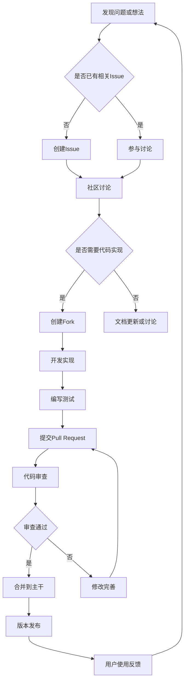

在分布式调度平台的发展历程中，开源社区和生态建设发挥着至关重要的作用。开源不仅促进了技术的快速迭代和创新，还构建了一个全球化的协作网络，使得开发者、企业和研究机构能够共同推动调度技术的发展。一个健康活跃的开源社区能够吸引优秀人才、加速产品成熟、降低开发成本，并为用户提供丰富的生态系统支持。对于分布式调度平台而言，如何建设和发展开源社区，构建完善的生态系统，已成为决定项目成功与否的关键因素。本文将深入探讨开源社区与生态建设的核心理念、实践方法以及最佳实践。

## 开源社区的核心价值

理解开源社区在分布式调度平台发展中的重要意义是构建成功开源项目的基础。

### 建设挑战分析

在分布式调度平台中建设开源社区和生态系统面临诸多挑战：

**社区建设挑战：**
1. **人才吸引**：如何吸引和留住优秀的开发者和贡献者
2. **参与门槛**：降低新用户和贡献者的参与门槛
3. **沟通协作**：建立高效的社区沟通和协作机制
4. **激励机制**：设计有效的贡献激励和认可机制

**技术发展挑战：**
1. **版本管理**：管理复杂的版本发布和兼容性
2. **质量保证**：确保开源代码的质量和稳定性
3. **文档完善**：维护全面准确的技术文档
4. **安全保障**：处理开源项目的安全漏洞和风险

**生态整合挑战：**
1. **标准统一**：与行业标准和规范保持一致
2. **兼容性**：确保与主流技术栈的兼容性
3. **集成复杂**：与其他开源项目的集成复杂度
4. **竞争合作**：在竞争与合作间找到平衡点

**商业模式挑战：**
1. **盈利模式**：探索可持续的开源商业模式
2. **知识产权**：处理复杂的知识产权和许可证问题
3. **企业参与**：平衡企业利益与社区发展
4. **长期规划**：制定长期的社区发展战略

### 核心价值体现

开源社区与生态建设带来的核心价值：

**技术创新加速：**
1. **集体智慧**：汇聚全球开发者的智慧和创意
2. **快速迭代**：通过社区协作加速产品迭代
3. **多样化需求**：满足不同用户群体的多样化需求
4. **前沿探索**：推动前沿技术的探索和应用

**成本效益优化：**
1. **开发成本**：降低产品开发和维护成本
2. **人力成本**：减少企业人力资源投入
3. **学习成本**：降低用户学习和使用成本
4. **风险分散**：分散技术和市场风险

**生态繁荣发展：**
1. **合作伙伴**：建立广泛的合作伙伴网络
2. **解决方案**：构建丰富的解决方案生态
3. **人才储备**：培养和储备专业技术人才
4. **市场拓展**：扩大产品的市场影响力

## 社区建设策略

制定有效的开源社区建设策略。

### 社区架构设计

构建健康的社区组织架构：

**社区治理结构：**
```yaml
# 开源社区治理结构
community_governance:
  governing_body:
    - name: "technical_steering_committee"
      description: "技术指导委员会"
      responsibilities:
        - technical_direction
        - architecture_decisions
        - release_planning
        - quality_standards
      members:
        - elected_by_community
        - technical_experts
        - vendor_representatives
    
    - name: "community_committee"
      description: "社区委员会"
      responsibilities:
        - community_growth
        - event_organization
        - documentation_improvement
        - contributor_onboarding
      members:
        - community_leaders
        - active_contributors
        - user_representatives
    
    - name: "working_groups"
      description: "专项工作组"
      groups:
        - name: "documentation_wg"
          focus: "文档和教程改进"
        
        - name: "outreach_wg"
          focus: "社区推广和教育"
        
        - name: "diversity_wg"
          focus: "社区多样性和包容性"
        
        - name: "security_wg"
          focus: "安全漏洞处理和防护"

  roles_and_responsibilities:
    - role: "maintainer"
      description: "项目维护者"
      responsibilities:
        - code_review
        - release_management
        - technical_leadership
        - community_mentoring
      selection_criteria:
        - proven_contributions
        - technical_expertise
        - community_leadership
    
    - role: "contributor"
      description: "项目贡献者"
      responsibilities:
        - code_contributions
        - bug_reporting
        - documentation_updates
        - community_participation
      pathways:
        - first_time_contributor
        - regular_contributor
        - core_contributor
    
    - role: "user"
      description: "项目用户"
      responsibilities:
        - feedback_provision
        - bug_reporting
        - feature_requests
        - community_engagement
      engagement_strategies:
        - user_surveys
        - feedback_channels
        - user_groups
        - case_studies

  decision_making_process:
    - type: "lazy_consensus"
      description: "懒共识决策"
     适用场景: "常规技术决策"
      process: "提出方案后等待反馈，无反对即通过"
    
    - type: "majority_vote"
      description: "多数投票决策"
      适用场景: "重要架构决策、治理变更"
      process: "正式投票，简单多数通过"
    
    - type: "super_majority"
      description: "超多数决策"
      适用场景: "许可证变更、重大方向调整"
      process: "需要2/3以上投票通过"
```

**贡献流程设计：**


### 社区运营机制

建立有效的社区运营机制：

**新人引导体系：**
```python
# 新人引导系统
class CommunityOnboarding:
    def __init__(self):
        self.onboarding_paths = {
            'developer': self.setup_developer_onboarding(),
            'user': self.setup_user_onboarding(),
            'documenter': self.setup_documenter_onboarding(),
            'translator': self.setup_translator_onboarding()
        }
        self.mentors = {}
        self.welcome_messages = {}
    
    def setup_developer_onboarding(self):
        """开发者新手引导路径"""
        return {
            'welcome': {
                'title': '欢迎加入开发者社区',
                'content': '感谢您对项目感兴趣！这里是帮助您快速上手的指南。',
                'estimated_time': '30分钟'
            },
            'step1_environment_setup': {
                'title': '环境搭建',
                'tasks': [
                    '安装必要工具',
                    '克隆代码仓库',
                    '配置开发环境',
                    '运行测试用例'
                ],
                'resources': [
                    'development_setup_guide.md',
                    'video_tutorial_setup.mp4'
                ],
                'estimated_time': '2小时'
            },
            'step2_first_contribution': {
                'title': '首次贡献',
                'tasks': [
                    '选择一个good-first-issue',
                    '理解问题需求',
                    '实现解决方案',
                    '提交Pull Request'
                ],
                'resources': [
                    'contributing_guide.md',
                    'code_review_checklist.md'
                ],
                'estimated_time': '4小时'
            },
            'step3_community_engagement': {
                'title': '社区参与',
                'tasks': [
                    '参加社区会议',
                    '加入开发者聊天群',
                    '关注项目动态',
                    '分享使用经验'
                ],
                'resources': [
                    'community_calendar.md',
                    'communication_channels.md'
                ],
                'estimated_time': '持续进行'
            }
        }
    
    def assign_mentor(self, newcomer, role):
        """为新人分配导师"""
        # 根据角色和技能匹配合适的导师
        suitable_mentors = self.find_suitable_mentors(role)
        if suitable_mentors:
            mentor = random.choice(suitable_mentors)
            self.mentors[newcomer] = mentor
            
            # 通知双方
            self.notify_mentor_assignment(mentor, newcomer, role)
            
            return mentor
        return None
    
    def create_welcome_experience(self, newcomer):
        """创建欢迎体验"""
        # 发送欢迎消息
        welcome_message = self.generate_welcome_message(newcomer)
        self.send_message(newcomer, welcome_message)
        
        # 创建个人化任务列表
        onboarding_tasks = self.create_personalized_tasks(newcomer)
        
        # 安排首次社区接触
        self.schedule_first_contact(newcomer)
        
        return onboarding_tasks
    
    def track_onboarding_progress(self, newcomer):
        """跟踪新手引导进度"""
        progress = {
            'completed_tasks': [],
            'current_task': None,
            'blocked_issues': [],
            'mentor_feedback': []
        }
        
        # 从系统中获取实际进度数据
        progress['completed_tasks'] = self.get_completed_tasks(newcomer)
        progress['current_task'] = self.get_current_task(newcomer)
        progress['blocked_issues'] = self.get_blocked_issues(newcomer)
        progress['mentor_feedback'] = self.get_mentor_feedback(newcomer)
        
        return progress
    
    def provide_assistance(self, newcomer, issue):
        """提供帮助"""
        # 根据问题类型提供相应帮助
        if issue.type == 'technical':
            # 技术问题，联系导师或技术专家
            mentor = self.mentors.get(newcomer)
            if mentor:
                self.request_technical_help(mentor, newcomer, issue)
        elif issue.type == 'process':
            # 流程问题，提供文档和指导
            self.provide_process_guidance(newcomer, issue)
        elif issue.type == 'community':
            # 社区问题，引导参与社区活动
            self.suggest_community_activities(newcomer, issue)
```

**贡献激励机制：**
```java
// 贡献激励系统
@Component
public class ContributionIncentiveSystem {
    
    @Autowired
    private ContributionTracker contributionTracker;
    
    @Autowired
    private RecognitionService recognitionService;
    
    @Autowired
    private RewardService rewardService;
    
    private static final Logger logger = LoggerFactory.getLogger(ContributionIncentiveSystem.class);
    
    public void processContribution(Contribution contribution) {
        try {
            // 1. 验证贡献质量
            if (!validateContributionQuality(contribution)) {
                logger.warn("贡献质量不达标: {}", contribution.getId());
                return;
            }
            
            // 2. 记录贡献
            ContributionRecord record = contributionTracker.recordContribution(contribution);
            
            // 3. 计算贡献积分
            int points = calculateContributionPoints(contribution);
            record.setPoints(points);
            
            // 4. 更新贡献者等级
            ContributorLevel newLevel = updateContributorLevel(record.getContributor(), points);
            
            // 5. 发放奖励
            List<Reward> rewards = rewardService.grantRewards(record);
            
            // 6. 公开表彰
            recognitionService.recognizeContribution(record, rewards);
            
            // 7. 通知贡献者
            notifyContributor(record.getContributor(), points, rewards, newLevel);
            
        } catch (Exception e) {
            logger.error("处理贡献激励失败: {}", contribution.getId(), e);
        }
    }
    
    private boolean validateContributionQuality(Contribution contribution) {
        // 检查代码质量
        if (contribution.getType() == ContributionType.CODE) {
            return validateCodeQuality(contribution);
        }
        
        // 检查文档质量
        if (contribution.getType() == ContributionType.DOCUMENTATION) {
            return validateDocumentationQuality(contribution);
        }
        
        // 其他类型贡献的质量检查
        return validateGeneralQuality(contribution);
    }
    
    private int calculateContributionPoints(Contribution contribution) {
        int basePoints = 0;
        
        // 根据贡献类型确定基础积分
        switch (contribution.getType()) {
            case CODE:
                basePoints = 100;
                break;
            case BUG_FIX:
                basePoints = 50;
                break;
            case DOCUMENTATION:
                basePoints = 30;
                break;
            case TRANSLATION:
                basePoints = 25;
                break;
            case REVIEW:
                basePoints = 20;
                break;
            case COMMUNITY_SUPPORT:
                basePoints = 15;
                break;
            default:
                basePoints = 10;
        }
        
        // 根据贡献复杂度调整积分
        ComplexityLevel complexity = assessComplexity(contribution);
        double complexityMultiplier = getComplexityMultiplier(complexity);
        
        // 根据贡献影响范围调整积分
        ImpactLevel impact = assessImpact(contribution);
        double impactMultiplier = getImpactMultiplier(impact);
        
        // 根据代码质量调整积分
        QualityLevel quality = assessQuality(contribution);
        double qualityMultiplier = getQualityMultiplier(quality);
        
        int finalPoints = (int) (basePoints * complexityMultiplier * impactMultiplier * qualityMultiplier);
        
        // 确保积分不为负数且不超过上限
        return Math.max(0, Math.min(finalPoints, 1000));
    }
    
    private ContributorLevel updateContributorLevel(String contributorId, int points) {
        // 获取贡献者当前等级和总积分
        ContributorProfile profile = contributionTracker.getContributorProfile(contributorId);
        int totalPoints = profile.getTotalPoints() + points;
        ContributorLevel currentLevel = profile.getLevel();
        
        // 根据总积分确定新等级
        ContributorLevel newLevel = determineLevel(totalPoints);
        
        // 如果等级提升，记录里程碑
        if (newLevel.getLevel() > currentLevel.getLevel()) {
            Milestone milestone = new Milestone();
            milestone.setContributorId(contributorId);
            milestone.setLevel(newLevel);
            milestone.setPoints(totalPoints);
            milestone.setAchievedTime(Instant.now());
            
            contributionTracker.recordMilestone(milestone);
            
            // 发送等级提升通知
            notifyLevelUp(contributorId, newLevel);
        }
        
        // 更新贡献者档案
        profile.setTotalPoints(totalPoints);
        profile.setLevel(newLevel);
        profile.setLastContributionTime(Instant.now());
        
        contributionTracker.updateContributorProfile(profile);
        
        return newLevel;
    }
    
    private List<Reward> grantRewards(ContributionRecord record) {
        List<Reward> rewards = new ArrayList<>();
        
        // 根据积分发放虚拟奖励
        if (record.getPoints() >= 100) {
            rewards.add(new Reward("Digital Badge", "Code Contributor"));
        }
        
        if (record.getPoints() >= 500) {
            rewards.add(new Reward("Digital Badge", "Core Contributor"));
        }
        
        // 根据贡献类型发放特殊奖励
        switch (record.getContribution().getType()) {
            case BUG_FIX:
                rewards.add(new Reward("Digital Badge", "Bug Hunter"));
                break;
            case DOCUMENTATION:
                rewards.add(new Reward("Digital Badge", "Knowledge Sharer"));
                break;
            case REVIEW:
                rewards.add(new Reward("Digital Badge", "Quality Guardian"));
                break;
        }
        
        // 根据等级发放奖励
        switch (record.getNewLevel()) {
            case BRONZE:
                rewards.add(new Reward("Swag", "Stickers Pack"));
                break;
            case SILVER:
                rewards.add(new Reward("Swag", "T-Shirt"));
                break;
            case GOLD:
                rewards.add(new Reward("Swag", "Hoodie"));
                rewards.add(new Reward("Recognition", "Featured Contributor"));
                break;
            case PLATINUM:
                rewards.add(new Reward("Swag", "Limited Edition Items"));
                rewards.add(new Reward("Recognition", "Hall of Fame"));
                break;
        }
        
        // 发放奖励
        for (Reward reward : rewards) {
            rewardService.deliverReward(record.getContributor(), reward);
        }
        
        return rewards;
    }
    
    private void recognizeContribution(ContributionRecord record, List<Reward> rewards) {
        // 在社区公告中表彰
        recognitionService.announceContribution(record);
        
        // 更新贡献者排行榜
        recognitionService.updateLeaderboard(record);
        
        // 在社交媒体上分享（如适用）
        if (shouldPublicize(record)) {
            recognitionService.publicizeContribution(record, rewards);
        }
        
        // 添加到项目贡献历史
        recognitionService.addToContributionHistory(record);
    }
    
    // 等级定义
    public enum ContributorLevel {
        NEWBIE(0, "Newbie", "刚加入社区的贡献者"),
        BRONZE(100, "Bronze", "积极参与的贡献者"),
        SILVER(500, "Silver", "有价值的贡献者"),
        GOLD(2000, "Gold", "核心贡献者"),
        PLATINUM(5000, "Platinum", "杰出贡献者");
        
        private final int minPoints;
        private final String name;
        private final String description;
        
        ContributorLevel(int minPoints, String name, String description) {
            this.minPoints = minPoints;
            this.name = name;
            this.description = description;
        }
        
        public int getMinPoints() { return minPoints; }
        public String getName() { return name; }
        public String getDescription() { return description; }
        public int getLevel() { return ordinal(); }
    }
}
```

## 生态系统构建

构建完善的开源生态系统。

### 生态伙伴网络

建立广泛的生态合作伙伴网络：

**合作伙伴分类：**
```yaml
# 生态合作伙伴分类
ecosystem_partners:
  technology_partners:
    - name: "cloud_providers"
      description: "云服务提供商"
      partners:
        - aws
        - microsoft_azure
        - google_cloud
        - aliyun
        - tencent_cloud
      collaboration_areas:
        - integration_development
        - joint_benchmarks
        - co_marketing
        - reference_architectures
    
    - name: "infrastructure_vendors"
      description: "基础设施厂商"
      partners:
        - red_hat
        - vmware
        - docker
        - kubernetes
      collaboration_areas:
        - certification_programs
        - joint_development
        - interoperability_testing
        - training_certification
    
    - name: "development_tools"
      description: "开发工具厂商"
      partners:
        - jetbrains
        - github
        - gitlab
        - jenkins
      collaboration_areas:
        - plugin_development
        - integration_support
        - developer_experience
        - workflow_optimization
  
  service_partners:
    - name: "system_integrators"
      description: "系统集成商"
      partners:
        - accenture
        - deloitte
        - ibm
        - infosys
      collaboration_areas:
        - implementation_services
        - consulting
        - training_delivery
        - support_services
    
    - name: "consulting_firms"
      description: "咨询公司"
      partners:
        - thoughtworks
        - pivotal
        - container_solutions
      collaboration_areas:
        - architecture_consulting
        - migration_services
        - best_practices
        - case_studies
  
  community_partners:
    - name: "user_groups"
      description: "用户组和社区"
      partners:
        - meetup_groups
        - professional_associations
        - academic_institutions
      collaboration_areas:
        - knowledge_sharing
        - event_organization
        - education_programs
        - research_collaboration
    
    - name: "training_organizations"
      description: "培训机构"
      partners:
        - linux_foundation
        - cloud_academy
        - acloud_guru
      collaboration_areas:
        - course_development
        - certification_programs
        - instructor_training
        - content_sharing
```

**合作伙伴计划：**
```go
// 生态合作伙伴计划
package ecosystem

import (
    "context"
    "time"
    
    "github.com/example/scheduler/types"
)

type PartnerProgram struct {
    partners       map[string]*Partner
    programTiers   map[PartnerTier]*TierBenefits
    collaborationMetrics *CollaborationMetrics
    logger         Logger
}

type Partner struct {
    ID             string
    Name           string
    Type           PartnerType
    Tier           PartnerTier
    JoinDate       time.Time
    ContactInfo    ContactInfo
    CollaborationAreas []CollaborationArea
    PerformanceMetrics *PartnerMetrics
    Benefits       []PartnerBenefit
}

type PartnerTier string

const (
    TierCommunity PartnerTier = "community"
    TierBronze    PartnerTier = "bronze"
    TierSilver    PartnerTier = "silver"
    TierGold      PartnerTier = "gold"
    TierPlatinum  PartnerTier = "platinum"
)

type TierBenefits struct {
    Recognition         bool
    TechnicalSupport    SupportLevel
    MarketingBenefits   []MarketingBenefit
    CoDevelopment       bool
    EventParticipation  bool
    TrainingResources   bool
    PriorityAccess      bool
}

type PartnerProgramManager struct {
    program *PartnerProgram
    evaluationEngine *PartnerEvaluationEngine
    benefitManager *BenefitManager
}

func NewPartnerProgramManager() *PartnerProgramManager {
    program := &PartnerProgram{
        partners: make(map[string]*Partner),
        programTiers: initializeTiers(),
        collaborationMetrics: NewCollaborationMetrics(),
    }
    
    return &PartnerProgramManager{
        program: program,
        evaluationEngine: NewPartnerEvaluationEngine(),
        benefitManager: NewBenefitManager(),
    }
}

func (pm *PartnerProgramManager) RegisterPartner(ctx context.Context, partnerInfo *PartnerRegistration) (*Partner, error) {
    // 验证合作伙伴信息
    if err := pm.validatePartnerInfo(partnerInfo); err != nil {
        return nil, err
    }
    
    // 创建合作伙伴档案
    partner := &Partner{
        ID: generatePartnerID(),
        Name: partnerInfo.Name,
        Type: partnerInfo.Type,
        Tier: TierCommunity, // 默认为社区级别
        JoinDate: time.Now(),
        ContactInfo: partnerInfo.ContactInfo,
        CollaborationAreas: partnerInfo.CollaborationAreas,
        PerformanceMetrics: &PartnerMetrics{},
    }
    
    // 初始化合作伙伴福利
    partner.Benefits = pm.benefitManager.GetTierBenefits(partner.Tier)
    
    // 保存合作伙伴信息
    pm.program.partners[partner.ID] = partner
    
    // 记录注册事件
    pm.logPartnerRegistration(partner)
    
    return partner, nil
}

func (pm *PartnerProgramManager) EvaluatePartnerTier(ctx context.Context, partnerID string) (PartnerTier, error) {
    partner, exists := pm.program.partners[partnerID]
    if !exists {
        return "", errors.New("partner not found")
    }
    
    // 收集合作伙伴表现数据
    metrics, err := pm.collectPartnerMetrics(partnerID)
    if err != nil {
        return "", err
    }
    
    // 评估合作伙伴等级
    newTier := pm.evaluationEngine.EvaluateTier(metrics)
    
    // 如果等级发生变化，更新合作伙伴信息
    if newTier != partner.Tier {
        oldTier := partner.Tier
        partner.Tier = newTier
        partner.Benefits = pm.benefitManager.GetTierBenefits(newTier)
        
        // 通知合作伙伴等级变更
        pm.notifyTierChange(partner, oldTier, newTier)
        
        // 记录等级变更
        pm.logTierChange(partner, oldTier, newTier)
    }
    
    return newTier, nil
}

func (pm *PartnerProgramManager) collectPartnerMetrics(partnerID string) (*PartnerMetrics, error) {
    partner := pm.program.partners[partnerID]
    metrics := &PartnerMetrics{}
    
    // 收集贡献指标
    contributionMetrics := pm.program.collaborationMetrics.GetPartnerContributions(partnerID)
    metrics.Contributions = contributionMetrics
    
    // 收集集成指标
    integrationMetrics := pm.program.collaborationMetrics.GetPartnerIntegrations(partnerID)
    metrics.Integrations = integrationMetrics
    
    // 收集市场指标
    marketingMetrics := pm.program.collaborationMetrics.GetPartnerMarketing(partnerID)
    metrics.MarketingImpact = marketingMetrics
    
    // 收集支持指标
    supportMetrics := pm.program.collaborationMetrics.GetPartnerSupport(partnerID)
    metrics.SupportEngagement = supportMetrics
    
    return metrics, nil
}

func (pm *PartnerProgramManager) GetPartnerDirectory(ctx context.Context, filter *PartnerFilter) ([]*Partner, error) {
    var filteredPartners []*Partner
    
    for _, partner := range pm.program.partners {
        // 应用过滤条件
        if pm.matchesFilter(partner, filter) {
            filteredPartners = append(filteredPartners, partner)
        }
    }
    
    // 按相关性排序
    pm.sortPartnersByRelevance(filteredPartners, filter)
    
    return filteredPartners, nil
}

func (pm *PartnerProgramManager) TrackCollaboration(ctx context.Context, activity *CollaborationActivity) error {
    // 记录协作活动
    err := pm.program.collaborationMetrics.RecordActivity(activity)
    if err != nil {
        return err
    }
    
    // 更新合作伙伴指标
    partner, exists := pm.program.partners[activity.PartnerID]
    if exists {
        pm.updatePartnerMetrics(partner, activity)
    }
    
    // 触发相关通知
    pm.triggerCollaborationNotifications(activity)
    
    return nil
}

func (pm *PartnerProgramManager) GenerateEcosystemReport(ctx context.Context, period time.Duration) (*EcosystemReport, error) {
    report := &EcosystemReport{
        Period: period,
        GeneratedAt: time.Now(),
    }
    
    // 统计合作伙伴数量
    report.PartnerCount = len(pm.program.partners)
    
    // 按类型统计
    typeStats := make(map[PartnerType]int)
    tierStats := make(map[PartnerTier]int)
    
    for _, partner := range pm.program.partners {
        typeStats[partner.Type]++
        tierStats[partner.Tier]++
    }
    
    report.PartnerTypeDistribution = typeStats
    report.PartnerTierDistribution = tierStats
    
    // 收集协作指标
    collaborationStats := pm.program.collaborationMetrics.GetSummaryStats(period)
    report.CollaborationMetrics = collaborationStats
    
    // 识别关键合作伙伴
    report.KeyPartners = pm.identifyKeyPartners()
    
    // 分析趋势
    report.Trends = pm.analyzeEcosystemTrends(period)
    
    return report, nil
}

// 合作伙伴门户网站
type PartnerPortal struct {
    programManager *PartnerProgramManager
    resourceManager *ResourceManager
    communicationHub *CommunicationHub
}

func (pp *PartnerPortal) GetPartnerDashboard(ctx context.Context, partnerID string) (*PartnerDashboard, error) {
    partner, err := pp.programManager.GetPartner(ctx, partnerID)
    if err != nil {
        return nil, err
    }
    
    dashboard := &PartnerDashboard{
        Partner: partner,
        CurrentTier: partner.Tier,
        TierBenefits: pp.programManager.GetPartnerBenefits(partnerID),
        PerformanceMetrics: pp.programManager.GetPartnerMetrics(partnerID),
        UpcomingOpportunities: pp.identifyOpportunities(partner),
        RecentActivities: pp.getRecentActivities(partnerID),
        SupportResources: pp.getSupportResources(partner.Tier),
    }
    
    return dashboard, nil
}

func (pp *PartnerPortal) SubmitCollaborationRequest(ctx context.Context, partnerID string, request *CollaborationRequest) error {
    // 验证请求
    if err := pp.validateCollaborationRequest(request); err != nil {
        return err
    }
    
    // 提交请求
    err := pp.programManager.SubmitCollaborationRequest(ctx, partnerID, request)
    if err != nil {
        return err
    }
    
    // 通知相关人员
    pp.notifyCollaborationRequest(partnerID, request)
    
    return nil
}
```

### 集成生态系统

构建丰富的集成生态系统：

**集成目录：**
```json
{
  "integration_ecosystem": {
    "categories": [
      {
        "name": "cloud_platforms",
        "description": "云平台集成",
        "integrations": [
          {
            "name": "aws_integration",
            "provider": "Amazon Web Services",
            "type": "official",
            "status": "stable",
            "supported_versions": ["2023", "2024", "2025"],
            "features": [
              "ec2_scheduling",
              "lambda_triggers",
              "s3_data_pipelines",
              "cloudwatch_monitoring"
            ],
            "documentation": "https://docs.example.com/aws-integration",
            "github_repo": "github.com/example/scheduler-aws"
          },
          {
            "name": "azure_integration",
            "provider": "Microsoft Azure",
            "type": "official",
            "status": "stable",
            "supported_versions": ["2023", "2024", "2025"],
            "features": [
              "vm_scheduling",
              "functions_triggers",
              "storage_integration",
              "monitoring_integration"
            ],
            "documentation": "https://docs.example.com/azure-integration",
            "github_repo": "github.com/example/scheduler-azure"
          }
        ]
      },
      {
        "name": "development_tools",
        "description": "开发工具集成",
        "integrations": [
          {
            "name": "github_actions",
            "provider": "GitHub",
            "type": "community",
            "status": "stable",
            "supported_versions": ["actions/v2", "actions/v3"],
            "features": [
              "workflow_triggers",
              "deployment_automation",
              "status_reporting"
            ],
            "documentation": "https://docs.example.com/github-actions",
            "github_repo": "github.com/example/scheduler-github-actions"
          },
          {
            "name": "jenkins_plugin",
            "provider": "Jenkins",
            "type": "community",
            "status": "beta",
            "supported_versions": ["2.300+", "2.400+"],
            "features": [
              "job_scheduling",
              "pipeline_integration",
              "build_triggers"
            ],
            "documentation": "https://docs.example.com/jenkins-plugin",
            "github_repo": "github.com/example/scheduler-jenkins"
          }
        ]
      },
      {
        "name": "monitoring_tools",
        "description": "监控工具集成",
        "integrations": [
          {
            "name": "prometheus_exporter",
            "provider": "Prometheus",
            "type": "official",
            "status": "stable",
            "supported_versions": ["2.30+", "2.40+"],
            "features": [
              "metrics_export",
              "alert_integration",
              "dashboard_templates"
            ],
            "documentation": "https://docs.example.com/prometheus-exporter",
            "github_repo": "github.com/example/scheduler-prometheus"
          },
          {
            "name": "grafana_dashboard",
            "provider": "Grafana",
            "type": "community",
            "status": "stable",
            "supported_versions": ["8.0+", "9.0+", "10.0+"],
            "features": [
              "prebuilt_dashboards",
              "alert_templates",
              "visualization_options"
            ],
            "documentation": "https://docs.example.com/grafana-dashboard",
            "github_repo": "github.com/example/scheduler-grafana"
          }
        ]
      }
    ],
    "certification_program": {
      "name": "Verified Integrations Program",
      "description": "官方认证的集成解决方案",
      "requirements": [
        "code_quality_standards",
        "security_compliance",
        "documentation_completeness",
        "testing_coverage",
        "maintenance_commitment"
      ],
      "benefits": [
        "official_listing",
        "marketing_support",
        "technical_support",
        "priority_bug_fixes"
      ]
    }
  }
}
```

## 最佳实践与实施建议

总结开源社区与生态建设的最佳实践。

### 实施原则

遵循核心实施原则：

**开放透明原则：**
1. **信息公开**：保持项目信息的公开透明
2. **决策透明**：重要决策过程公开可追溯
3. **沟通开放**：建立开放的沟通渠道
4. **贡献可见**：确保贡献者的工作被认可

**包容协作原则：**
1. **多样性**：欢迎不同背景的贡献者参与
2. **尊重平等**：尊重每位贡献者的意见和贡献
3. **协作精神**：鼓励协作而非竞争
4. **知识共享**：促进知识和经验的共享

### 实施策略

制定科学的实施策略：

**社区发展：**
1. **用户引导**：建立完善的新用户引导体系
2. **贡献激励**：设计有效的贡献激励机制
3. **活动组织**：定期组织线上线下社区活动
4. **教育培训**：提供丰富的学习和培训资源

**生态建设：**
1. **合作伙伴**：建立广泛的合作伙伴网络
2. **集成生态**：构建丰富的集成解决方案
3. **标准规范**：参与和制定行业标准规范
4. **案例分享**：推广成功应用案例

### 效果评估

建立效果评估机制：

**评估指标：**
1. **社区活跃度**：贡献者数量、提交频率、讨论活跃度
2. **项目影响力**：下载量、使用量、市场认知度
3. **生态成熟度**：合作伙伴数量、集成方案数量、认证产品数量
4. **用户满意度**：用户反馈、NPS评分、案例质量

**评估方法：**
1. **数据监控**：建立数据监控和分析体系
2. **用户调研**：定期进行用户满意度调研
3. **社区反馈**：收集社区成员的反馈意见
4. **对比分析**：与同类项目进行对比分析

## 小结

开源社区与生态建设是分布式调度平台成功的关键因素。通过构建健康的社区治理结构、建立有效的社区运营机制、发展广泛的生态合作伙伴网络、构建丰富的集成生态系统，可以充分发挥开源的优势，推动项目的快速发展和广泛应用。

在实际实施过程中，需要关注社区建设、技术发展、生态整合、商业模式等关键挑战。通过遵循开放透明原则、包容协作原则，采用科学的实施策略，建立完善的效果评估机制，可以构建出繁荣的开源社区和生态系统。

随着开源理念的深入人心和技术的不断发展，开源社区与生态建设也在持续演进。未来可能会出现更多创新的社区运营模式、更智能的贡献激励机制、更紧密的生态合作伙伴关系。持续关注技术发展趋势，积极引入先进的理念和实践，将有助于构建更加繁荣、可持续的开源社区和生态系统。

开源社区与生态建设不仅是一种技术发展模式，更是一种开放协作的文化理念。通过深入理解开源精神和社区发展规律，可以更好地指导开源项目的设计和运营，为构建成功的开源生态奠定坚实基础。