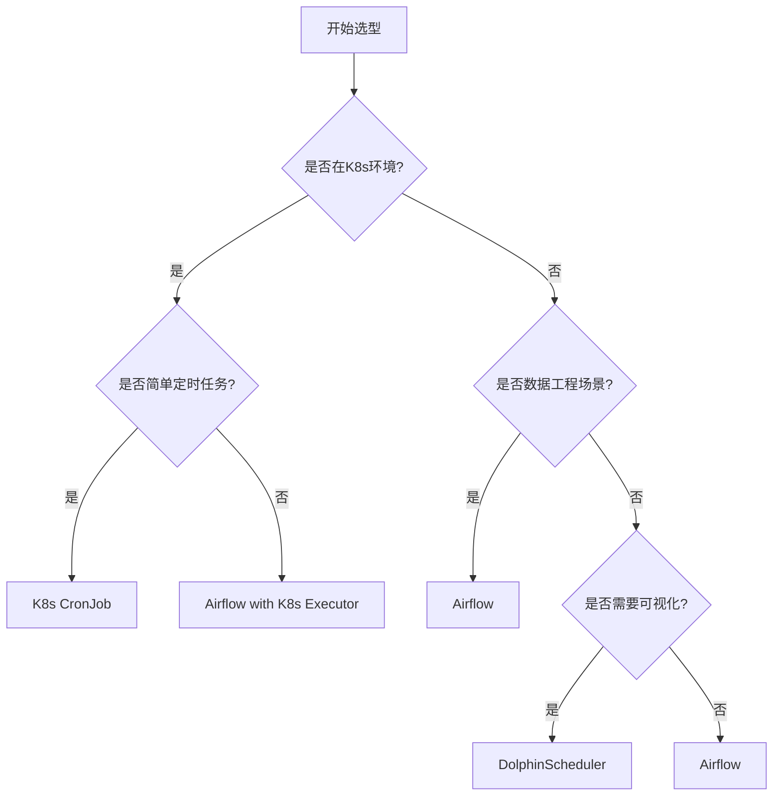

在分布式调度平台的选型过程中，了解和对比主流的开源调度系统是至关重要的。不同的调度系统在架构设计、功能特性、适用场景等方面各有特色，选择合适的系统能够显著影响项目的成功与否。本文将对当前主流的开源分布式调度系统进行全面对比分析，包括Apache Airflow、Apache DolphinScheduler、Kubernetes CronJob等，帮助读者更好地理解各系统的优劣势，为技术选型提供参考依据。

## 对比维度与方法

为了全面客观地对比各开源调度系统，我们需要建立科学的对比维度和方法。

### 对比维度定义

**功能特性维度：**
1. **任务类型支持**：支持的任务类型丰富程度
2. **工作流编排**：工作流定义和执行能力
3. **调度策略**：支持的调度策略和算法
4. **依赖管理**：任务间依赖关系处理能力
5. **监控告警**：系统监控和告警功能完善程度

**架构设计维度：**
1. **可扩展性**：系统架构的可扩展性设计
2. **高可用性**：系统的高可用保障机制
3. **资源管理**：资源分配和隔离能力
4. **部署复杂度**：系统部署和维护的复杂程度
5. **集成能力**：与其他系统的集成便利性

**运维管理维度：**
1. **用户界面**：用户界面的友好程度
2. **文档完善度**：技术文档的完整性和质量
3. **社区活跃度**：开源社区的活跃程度
4. **版本稳定性**：系统版本的稳定性和成熟度
5. **安全性**：系统的安全特性和防护能力

### 对比方法说明

采用定量与定性相结合的方法进行对比：

1. **文献调研**：查阅各系统的官方文档、技术博客、学术论文
2. **实践验证**：通过实际部署和使用验证系统特性
3. **社区调研**：分析社区讨论、用户反馈、案例分享
4. **专家访谈**：与行业专家交流获取深度见解
5. **数据统计**：收集GitHub Stars、下载量、贡献者数量等数据

## 主流系统详细对比

### Apache Airflow

**系统概述：**
Apache Airflow是由Airbnb开源的工作流调度和监控平台，使用Python编写，采用DAG（有向无环图）来定义工作流。Airflow在数据工程领域应用广泛，特别适合复杂的数据处理管道。

**架构特点：**
```yaml
# Airflow架构组件
airflow_architecture:
  core_components:
    - name: "web_server"
      description: "Web用户界面"
      technology: "Flask"
    
    - name: "scheduler"
      description: "任务调度器"
      technology: "Python"
    
    - name: "executor"
      description: "任务执行器"
      types: ["Sequential", "Local", "Celery", "Kubernetes"]
    
    - name: "metadata_database"
      description: "元数据存储"
      supported_databases: ["PostgreSQL", "MySQL", "SQLite"]
    
    - name: "worker"
      description: "任务执行节点"
      technology: "Celery/Kubernetes"
```

**功能特性对比：**

| 特性 | 支持情况 | 详细说明 |
|------|----------|----------|
| 任务类型支持 | ⭐⭐⭐⭐☆ | 支持Python、Bash、HTTP等多种任务类型，通过Operator扩展 |
| 工作流编排 | ⭐⭐⭐⭐⭐ | 强大的DAG定义能力，支持复杂的任务依赖关系 |
| 调度策略 | ⭐⭐⭐⭐ | 支持CRON表达式，可自定义调度逻辑 |
| 依赖管理 | ⭐⭐⭐⭐⭐ | 完善的任务间依赖管理，支持触发规则 |
| 监控告警 | ⭐⭐⭐⭐ | 内置监控界面，支持邮件、Slack等告警 |

**优势分析：**
1. **生态丰富**：拥有庞大的Operator生态系统
2. **灵活性高**：Python编写，易于扩展和定制
3. **社区活跃**：拥有庞大的用户群体和活跃的社区
4. **文档完善**：官方文档详细，教程丰富
5. **集成便利**：与大数据生态系统集成良好

**劣势分析：**
1. **性能瓶颈**：在大规模部署时可能遇到性能问题
2. **复杂度高**：学习曲线较陡峭
3. **资源消耗**：相对较高的资源消耗
4. **运维复杂**：需要专门的运维知识

### Apache DolphinScheduler

**系统概述：**
Apache DolphinScheduler是易观开源的分布式易扩展的可视化工作流任务调度平台。它致力于解决数据处理流程中复杂的任务依赖关系，使调度系统在数据处理流程中开箱即用。

**架构特点：**
```yaml
# DolphinScheduler架构组件
dolphinscheduler_architecture:
  core_components:
    - name: "master_server"
      description: "主服务"
      functions: ["workflow scheduling", "task distribution"]
    
    - name: "worker_server"
      description: "工作节点"
      functions: ["task execution", "resource management"]
    
    - name: "api_server"
      description: "API服务"
      functions: ["external API", "internal communication"]
    
    - name: "alert_server"
      description: "告警服务"
      functions: ["alert processing", "notification sending"]
    
    - name: "metadata_database"
      description: "元数据存储"
      supported_databases: ["PostgreSQL", "MySQL"]
```

**功能特性对比：**

| 特性 | 支持情况 | 详细说明 |
|------|----------|----------|
| 任务类型支持 | ⭐⭐⭐⭐ | 支持Shell、Python、SQL、Spark等多种任务类型 |
| 工作流编排 | ⭐⭐⭐⭐⭐ | 可视化工作流设计，拖拽式操作 |
| 调度策略 | ⭐⭐⭐⭐ | 支持多种调度策略，包括依赖调度 |
| 依赖管理 | ⭐⭐⭐⭐⭐ | 强大的任务依赖管理，支持跨工作流依赖 |
| 监控告警 | ⭐⭐⭐⭐⭐ | 完善的监控告警体系，支持多种通知方式 |

**优势分析：**
1. **可视化友好**：提供直观的可视化工作流设计界面
2. **易用性强**：操作简单，学习成本低
3. **高可用性**：支持Master和Worker的高可用部署
4. **多租户支持**：完善的多租户管理和权限控制
5. **国产化支持**：在国内有良好的技术支持和社区生态

**劣势分析：**
1. **国际化程度**：相比Airflow国际化程度较低
2. **生态规模**：生态系统规模相对较小
3. **社区规模**：国际社区相对较小
4. **定制能力**：相比Airflow定制能力稍弱

### Kubernetes CronJob

**系统概述：**
Kubernetes CronJob是Kubernetes原生的定时任务调度机制，基于CRON表达式调度Pod执行。它简单易用，适合在Kubernetes环境中运行定时任务。

**架构特点：**
```yaml
# Kubernetes CronJob架构
k8s_cronjob_architecture:
  core_components:
    - name: "cronjob_controller"
      description: "CronJob控制器"
      functions: ["schedule parsing", "job creation"]
    
    - name: "job_controller"
      description: "Job控制器"
      functions: ["pod management", "status tracking"]
    
    - name: "kube_scheduler"
      description: "Kubernetes调度器"
      functions: ["pod scheduling", "resource allocation"]
```

**功能特性对比：**

| 特性 | 支持情况 | 详细说明 |
|------|----------|----------|
| 任务类型支持 | ⭐⭐⭐ | 主要支持容器化任务 |
| 工作流编排 | ⭐⭐ | 基本的工作流支持，复杂度有限 |
| 调度策略 | ⭐⭐⭐⭐ | 支持标准CRON表达式 |
| 依赖管理 | ⭐⭐ | 依赖管理能力有限 |
| 监控告警 | ⭐⭐⭐ | 依赖Kubernetes监控体系 |

**优势分析：**
1. **原生集成**：与Kubernetes深度集成
2. **简单易用**：配置简单，易于上手
3. **资源管理**：充分利用Kubernetes的资源管理能力
4. **运维便利**：与Kubernetes运维工具链无缝衔接
5. **成本效益**：无需额外部署调度系统

**劣势分析：**
1. **功能有限**：功能相对简单，不适合复杂场景
2. **可视化缺失**：缺乏可视化界面
3. **依赖处理**：任务间依赖处理能力有限
4. **监控告警**：监控告警功能相对基础

### 其他值得关注的系统

**Apache Oozie：**
- 专为Hadoop生态系统设计
- 适合大数据处理场景
- 配置复杂，学习成本高

**Luigi：**
- 由Spotify开发
- 轻量级任务调度框架
- 适合Python开发者

**Prefect：**
- 现代化的数据工作流平台
- 强调可观察性和可靠性
- 较新的项目，生态正在发展中

## 详细对比分析

### 功能特性详细对比

**任务类型支持对比：**

| 系统 | Shell | Python | SQL | Spark | Flink | HTTP | 自定义 |
|------|-------|--------|-----|-------|-------|------|--------|
| Airflow | ⭐⭐⭐⭐ | ⭐⭐⭐⭐⭐ | ⭐⭐⭐⭐ | ⭐⭐⭐⭐ | ⭐⭐⭐ | ⭐⭐⭐⭐ | ⭐⭐⭐⭐⭐ |
| DolphinScheduler | ⭐⭐⭐⭐⭐ | ⭐⭐⭐⭐ | ⭐⭐⭐⭐⭐ | ⭐⭐⭐⭐ | ⭐⭐⭐ | ⭐⭐⭐ | ⭐⭐⭐⭐ |
| K8s CronJob | ⭐⭐⭐⭐ | ⭐⭐⭐ | ⭐⭐ | ⭐⭐⭐ | ⭐⭐ | ⭐⭐ | ⭐⭐⭐ |

**工作流编排能力对比：**

| 系统 | 可视化 | DAG复杂度 | 条件分支 | 并行执行 | 子工作流 |
|------|--------|-----------|----------|----------|----------|
| Airflow | ⭐⭐⭐ | ⭐⭐⭐⭐⭐ | ⭐⭐⭐⭐ | ⭐⭐⭐⭐⭐ | ⭐⭐⭐⭐ |
| DolphinScheduler | ⭐⭐⭐⭐⭐ | ⭐⭐⭐⭐ | ⭐⭐⭐⭐⭐ | ⭐⭐⭐⭐ | ⭐⭐⭐⭐⭐ |
| K8s CronJob | ⭐ | ⭐⭐ | ⭐ | ⭐⭐⭐ | ⭐ |

**调度策略对比：**

| 系统 | CRON表达式 | 依赖调度 | 事件触发 | 动态调度 | 优先级调度 |
|------|------------|----------|----------|----------|------------|
| Airflow | ⭐⭐⭐⭐⭐ | ⭐⭐⭐⭐ | ⭐⭐⭐⭐ | ⭐⭐⭐ | ⭐⭐⭐ |
| DolphinScheduler | ⭐⭐⭐⭐⭐ | ⭐⭐⭐⭐⭐ | ⭐⭐⭐ | ⭐⭐⭐⭐ | ⭐⭐⭐⭐ |
| K8s CronJob | ⭐⭐⭐⭐ | ⭐⭐ | ⭐ | ⭐ | ⭐ |

### 架构设计对比

**可扩展性对比：**

| 系统 | 水平扩展 | 插件机制 | 自定义Operator | 架构灵活性 |
|------|----------|----------|----------------|------------|
| Airflow | ⭐⭐⭐⭐ | ⭐⭐⭐⭐⭐ | ⭐⭐⭐⭐⭐ | ⭐⭐⭐⭐ |
| DolphinScheduler | ⭐⭐⭐⭐⭐ | ⭐⭐⭐⭐ | ⭐⭐⭐ | ⭐⭐⭐⭐ |
| K8s CronJob | ⭐⭐⭐⭐⭐ | ⭐⭐⭐ | ⭐⭐ | ⭐⭐⭐⭐⭐ |

**高可用性对比：**

| 系统 | Master高可用 | Worker高可用 | 数据持久性 | 故障恢复 |
|------|--------------|--------------|------------|----------|
| Airflow | ⭐⭐⭐ | ⭐⭐⭐⭐ | ⭐⭐⭐⭐ | ⭐⭐⭐ |
| DolphinScheduler | ⭐⭐⭐⭐⭐ | ⭐⭐⭐⭐⭐ | ⭐⭐⭐⭐⭐ | ⭐⭐⭐⭐ |
| K8s CronJob | ⭐⭐⭐⭐⭐ | ⭐⭐⭐⭐⭐ | ⭐⭐⭐⭐⭐ | ⭐⭐⭐⭐⭐ |

**部署复杂度对比：**

| 系统 | 部署难度 | 依赖组件 | 运维复杂度 | 学习成本 |
|------|----------|----------|------------|----------|
| Airflow | ⭐⭐⭐⭐ | 较多 | ⭐⭐⭐⭐ | ⭐⭐⭐⭐ |
| DolphinScheduler | ⭐⭐⭐ | 适中 | ⭐⭐⭐ | ⭐⭐ |
| K8s CronJob | ⭐ | 很少 | ⭐ | ⭐ |

### 运维管理对比

**用户界面友好度：**

| 系统 | 界面美观度 | 操作便捷性 | 功能完整性 | 响应速度 |
|------|------------|------------|------------|----------|
| Airflow | ⭐⭐⭐⭐ | ⭐⭐⭐ | ⭐⭐⭐⭐ | ⭐⭐⭐ |
| DolphinScheduler | ⭐⭐⭐⭐⭐ | ⭐⭐⭐⭐⭐ | ⭐⭐⭐⭐⭐ | ⭐⭐⭐⭐ |
| K8s CronJob | ⭐ | ⭐ | ⭐ | ⭐⭐⭐⭐⭐ |

**社区生态对比：**

| 系统 | GitHub Stars | 贡献者数量 | 发布频率 | 社区活跃度 |
|------|--------------|------------|----------|------------|
| Airflow | 30,000+ | 800+ | 高 | ⭐⭐⭐⭐⭐ |
| DolphinScheduler | 10,000+ | 200+ | 中 | ⭐⭐⭐⭐ |
| K8s CronJob | 内置于K8s | 众多 | 高 | ⭐⭐⭐⭐⭐ |

## 选型建议

### 不同场景的推荐

**数据工程场景：**
- **推荐系统**：Apache Airflow
- **理由**：Airflow在数据工程领域有丰富的生态系统，支持各种数据处理任务，有大量现成的Operator可用。

**企业级应用场景：**
- **推荐系统**：Apache DolphinScheduler
- **理由**：DolphinScheduler提供完善的可视化界面和多租户支持，适合企业级应用的复杂需求。

**Kubernetes原生环境：**
- **推荐系统**：Kubernetes CronJob
- **理由**：在纯Kubernetes环境中，CronJob提供了最简单的定时任务解决方案，无需额外部署调度系统。

**混合云环境：**
- **推荐系统**：Apache Airflow
- **理由**：Airflow具有良好的跨平台兼容性和丰富的集成能力，适合混合云环境的复杂需求。

### 选型决策矩阵



### 实施建议

**Airflow实施建议：**
1. **环境准备**：确保有足够资源部署完整的Airflow集群
2. **版本选择**：选择稳定版本，避免使用过于前沿的特性
3. **Executor选择**：根据需求选择合适的Executor（Celery/Kubernetes）
4. **监控部署**：部署完善的监控和告警体系
5. **安全配置**：配置适当的安全策略和权限控制

**DolphinScheduler实施建议：**
1. **架构规划**：合理规划Master和Worker节点数量
2. **数据库选择**：选择高性能的数据库作为元数据存储
3. **网络配置**：确保各组件间网络通信畅通
4. **权限管理**：合理配置用户权限和租户隔离
5. **备份策略**：制定完善的元数据备份策略

**K8s CronJob实施建议：**
1. **资源限制**：为CronJob设置合理的资源限制
2. **失败处理**：配置适当的失败重启策略
3. **监控集成**：与Kubernetes监控体系集成
4. **日志收集**：配置日志收集和分析机制
5. **安全策略**：应用适当的安全上下文和策略

## 发展趋势分析

### 技术发展趋势

**云原生集成：**
随着云原生技术的发展，调度系统与Kubernetes等容器编排平台的集成将更加紧密。未来的调度系统将更多地利用云原生的能力，如服务网格、无服务器计算等。

**AI驱动调度：**
人工智能技术在调度领域的应用将越来越广泛，包括任务执行时间预测、资源需求预测、智能调度决策等。

**边缘计算支持：**
随着边缘计算的兴起，调度系统需要支持边缘节点的任务调度和管理。

**多云调度：**
跨云多云调度将成为调度系统的重要能力，支持在多个云环境间智能分配任务。

### 社区发展预测

**生态整合：**
不同调度系统之间的生态将出现更多整合，形成更加丰富的插件和集成方案。

**标准化推进：**
调度领域的标准化工作将推进，出现更多通用的API和规范。

**开源商业化：**
开源调度系统的商业化模式将更加成熟，出现更多基于开源项目的商业服务。

## 小结

通过对主流开源分布式调度系统的全面对比分析，我们可以看到每个系统都有其独特的优势和适用场景：

1. **Apache Airflow**在数据工程领域具有无可比拟的优势，拥有丰富的生态系统和强大的扩展能力，适合复杂的任务调度需求。

2. **Apache DolphinScheduler**在可视化和易用性方面表现出色，特别适合企业级应用和需要直观操作界面的场景。

3. **Kubernetes CronJob**作为Kubernetes原生组件，在纯K8s环境中提供了最简单的定时任务解决方案。

在实际选型过程中，需要根据具体的业务需求、技术栈、团队能力等因素综合考虑。建议在做出最终决策前，进行小规模的POC验证，以确保所选系统能够满足实际需求。

随着技术的不断发展，开源调度系统也在持续演进。未来的调度系统将更加智能化、云原生化，并与AI、边缘计算等新兴技术深度融合。持续关注技术发展趋势，将有助于我们做出更好的技术选型决策。