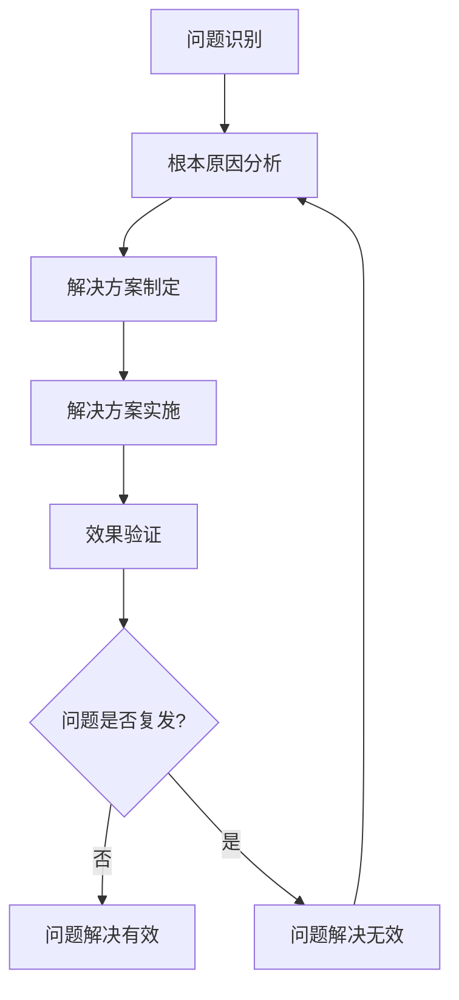

在企业级IT服务管理（ITSM）实践中，度量指标体系是评估服务质量、监控运营效率、驱动持续改进的核心工具。一个科学、全面的度量指标体系不仅能够为管理层提供决策支持，还能为一线运维团队提供明确的改进方向。基于ITIL框架的KPI设计，结合了业界最佳实践和企业实际需求，为构建有效的度量体系提供了系统性的指导。

度量指标的设计并非简单的数字堆砌，而是需要深入理解业务目标、服务价值和用户需求，通过精心选择和设计的关键绩效指标（KPI），形成能够真实反映IT服务管理水平的度量体系。这一体系应该具备可测量性、可比较性、可追踪性和可改进性，为IT服务管理的各个环节提供量化依据。

## 度量指标体系的设计原则

### 1. 战略对齐原则

#### 业务目标导向
度量指标体系的首要原则是与企业的业务战略和IT战略保持高度一致。每一个指标都应该能够反映IT服务对业务目标的贡献程度，确保IT投资能够产生预期的业务价值。

例如，如果企业的战略目标是提升客户满意度，那么度量体系就应该包含与用户体验直接相关的指标，如服务可用性、响应时间、问题解决效率等。

#### 价值驱动
指标设计应该聚焦于价值创造，而不是简单的活动计数。通过衡量价值交付的效果，能够更好地指导资源投入和优化决策。

### 2. 平衡计分原则

#### 多维度覆盖
一个有效的度量体系应该从多个维度全面评估IT服务管理水平，避免单一维度的偏颇。通常包括：
- 财务维度：成本效益、投资回报率等
- 客户维度：用户满意度、服务质量等
- 内部流程维度：流程效率、服务质量等
- 学习成长维度：员工能力、技术创新等

#### 领先与滞后指标结合
领先指标（Leading Indicators）能够预测未来趋势，帮助提前采取行动；滞后指标（Lagging Indicators）反映历史结果，用于评估效果。两者结合使用能够形成完整的反馈循环。

### 3. 可操作性原则

#### 明确性
每个指标都应该有明确的定义、计算方法和数据来源，避免歧义和误解。指标的含义应该清晰易懂，便于不同角色的理解和使用。

#### 可测量性
指标必须是可量化的，能够通过客观的数据进行测量和计算。主观评价应该尽量减少，确保指标的客观性和可比性。

#### 可控性
指标应该与被评估对象的职责和能力相匹配，确保相关人员能够通过自己的努力影响指标的表现。

## 基于ITIL的核心KPI设计

### 1. 事件管理KPI

#### 平均解决时间（MTTR - Mean Time to Resolution）
MTTR是衡量事件管理效率的核心指标，反映了从事件发生到完全解决所需的平均时间。

```sql
-- MTTR计算SQL示例
SELECT 
    AVG(DATEDIFF(resolved_time, reported_time)) AS MTTR_hours
FROM incidents 
WHERE status = 'resolved' 
AND resolved_time IS NOT NULL 
AND reported_time IS NOT NULL
AND YEAR(resolved_time) = 2023;
```

**指标意义**：
- 反映事件响应和解决的效率
- 影响用户体验和业务连续性
- 指导资源分配和流程优化

**改进策略**：
- 优化事件分类和优先级设置
- 提升一线支持团队的技能水平
- 完善知识库建设，提高自助解决率

#### 事件解决率
事件解决率反映了在规定时间内解决事件的能力，是衡量服务质量的重要指标。

```json
{
  "metric_name": "事件解决率",
  "definition": "在SLA规定时间内解决的事件数量占总事件数量的比例",
  "calculation": "(按时解决事件数 / 总事件数) × 100%",
  "target": "≥ 95%",
  "data_source": "ITSM系统事件记录",
  "frequency": "月度统计"
}
```

#### 重复事件率
重复事件率反映了问题管理和根本原因分析的有效性。

```python
def calculate_repeat_incident_rate():
    """
    计算重复事件率
    """
    # 获取所有事件
    all_incidents = get_all_incidents()
    
    # 识别重复事件
    repeat_incidents = identify_repeat_incidents(all_incidents)
    
    # 计算重复率
    repeat_rate = len(repeat_incidents) / len(all_incidents) * 100
    
    return repeat_rate

def identify_repeat_incidents(incidents):
    """
    识别重复事件
    """
    repeat_incidents = []
    incident_groups = group_incidents_by_symptom(incidents)
    
    for group in incident_groups:
        if len(group) > 1:
            # 将除第一个外的所有事件标记为重复
            repeat_incidents.extend(group[1:])
    
    return repeat_incidents
```

### 2. 问题管理KPI

#### 平均故障间隔时间（MTBF - Mean Time Between Failures）
MTBF是衡量系统可靠性的关键指标，反映了系统稳定性的水平。

```json
{
  "metric_name": "平均故障间隔时间(MTBF)",
  "definition": "系统两次故障之间的平均时间间隔",
  "calculation": "总运行时间 / 故障次数",
  "unit": "小时",
  "target": "根据业务需求设定",
  "data_source": "监控系统、事件记录",
  "frequency": "月度统计"
}
```

**影响因素**：
- 系统架构设计
- 硬件质量
- 维护保养水平
- 环境条件

#### 问题解决有效性
衡量问题管理流程在识别和解决根本原因方面的有效性。



### 3. 变更管理KPI

#### 变更成功率
变更成功率是衡量变更管理流程质量和风险控制能力的重要指标。

```json
{
  "metric_name": "变更成功率",
  "definition": "成功实施且未引发重大问题的变更数量占总变更数量的比例",
  "calculation": "(成功变更数 / 总变更数) × 100%",
  "target": "≥ 98%",
  "data_source": "变更管理系统",
  "frequency": "月度统计"
}
```

**分类统计**：
```sql
-- 按变更类型统计成功率
SELECT 
    change_type,
    COUNT(*) as total_changes,
    SUM(CASE WHEN status = 'successful' THEN 1 ELSE 0 END) as successful_changes,
    (SUM(CASE WHEN status = 'successful' THEN 1 ELSE 0 END) * 100.0 / COUNT(*)) as success_rate
FROM changes 
GROUP BY change_type
ORDER BY success_rate DESC;
```

#### 变更回滚率
变更回滚率反映了变更质量和风险控制水平。

```python
class ChangeManagementMetrics:
    def __init__(self):
        self.change_data = self.load_change_data()
    
    def calculate_rollback_rate(self):
        """
        计算变更回滚率
        """
        total_changes = len(self.change_data)
        rollback_changes = len([c for c in self.change_data if c.status == 'rolled_back'])
        
        if total_changes > 0:
            rollback_rate = (rollback_changes / total_changes) * 100
            return rollback_rate
        else:
            return 0
    
    def analyze_rollback_reasons(self):
        """
        分析回滚原因
        """
        rollback_changes = [c for c in self.change_data if c.status == 'rolled_back']
        reason_counts = {}
        
        for change in rollback_changes:
            reason = change.rollback_reason
            reason_counts[reason] = reason_counts.get(reason, 0) + 1
        
        return reason_counts
```

### 4. 服务级别管理KPI

#### SLA达成率
SLA达成率直接反映了服务提供商履行承诺的能力。

```json
{
  "metric_name": "SLA达成率",
  "definition": "在规定SLA时间内完成的服务请求数量占总请求数量的比例",
  "calculation": "(SLA内完成请求数 / 总请求数) × 100%",
  "target": "≥ 95%",
  "data_source": "服务请求系统、SLA监控系统",
  "frequency": "月度统计"
}
```

#### 服务可用性
服务可用性是衡量IT服务稳定性和可靠性的核心指标。

```python
def calculate_service_availability(downtime_minutes, total_minutes):
    """
    计算服务可用性
    """
    availability = ((total_minutes - downtime_minutes) / total_minutes) * 100
    return round(availability, 2)

# 示例计算
total_minutes_in_month = 30 * 24 * 60  # 一个月的总分钟数
downtime_minutes = 144  # 本月停机时间144分钟(2.4小时)
availability = calculate_service_availability(downtime_minutes, total_minutes_in_month)
print(f"服务可用性: {availability}%")  # 输出: 服务可用性: 99.67%
```

## 度量指标体系的实施策略

### 1. 分层指标设计

#### 战略层指标
面向高层管理者，关注业务价值和投资回报。

```json
{
  "strategic_metrics": [
    {
      "name": "IT服务投资回报率",
      "target": "≥ 15%",
      "frequency": "年度"
    },
    {
      "name": "业务连续性保障水平",
      "target": "≥ 99.9%",
      "frequency": "月度"
    },
    {
      "name": "用户满意度指数",
      "target": "≥ 4.5/5.0",
      "frequency": "季度"
    }
  ]
}
```

#### 管理层指标
面向中层管理者，关注流程效率和团队绩效。

```json
{
  "management_metrics": [
    {
      "name": "事件平均解决时间",
      "target": "≤ 4小时",
      "frequency": "月度"
    },
    {
      "name": "变更成功率",
      "target": "≥ 98%",
      "frequency": "月度"
    },
    {
      "name": "服务请求按时完成率",
      "target": "≥ 95%",
      "frequency": "月度"
    }
  ]
}
```

#### 执行层指标
面向一线员工，关注具体操作和任务完成情况。

```json
{
  "operational_metrics": [
    {
      "name": "首次响应时间",
      "target": "≤ 15分钟",
      "frequency": "实时"
    },
    {
      "name": "知识库使用率",
      "target": "≥ 80%",
      "frequency": "月度"
    },
    {
      "name": "自动化处理比例",
      "target": "≥ 70%",
      "frequency": "月度"
    }
  ]
}
```

### 2. 数据收集机制

#### 自动化数据收集
通过系统集成实现数据的自动收集，减少人工干预，提高数据准确性。

```python
class DataCollectionSystem:
    def __init__(self):
        self.data_sources = {
            'itsm_system': ITSMDataSource(),
            'monitoring_system': MonitoringDataSource(),
            'cmdb': CMDBDataSource(),
            'survey_system': SurveyDataSource()
        }
    
    def collect_metrics_data(self):
        """
        收集度量数据
        """
        collected_data = {}
        
        for source_name, source in self.data_sources.items():
            try:
                data = source.fetch_data()
                collected_data[source_name] = data
                self.log_collection_success(source_name)
            except Exception as e:
                self.log_collection_failure(source_name, str(e))
        
        return collected_data
    
    def validate_data_quality(self, data):
        """
        验证数据质量
        """
        validation_results = {}
        
        for source, source_data in data.items():
            # 检查数据完整性
            completeness = self.check_data_completeness(source_data)
            
            # 检查数据准确性
            accuracy = self.check_data_accuracy(source_data)
            
            # 检查数据时效性
            timeliness = self.check_data_timeliness(source_data)
            
            validation_results[source] = {
                'completeness': completeness,
                'accuracy': accuracy,
                'timeliness': timeliness,
                'overall_quality': (completeness + accuracy + timeliness) / 3
            }
        
        return validation_results
```

#### 人工数据补充
对于无法自动收集的数据，建立规范的人工收集流程。

### 3. 报告与分析

#### 定期报告机制
建立定期的度量报告机制，确保相关人员能够及时获得关键信息。

```json
{
  "reporting_schedule": {
    "daily": ["事件统计", "变更状态", "系统健康度"],
    "weekly": ["服务级别达成情况", "用户满意度", "资源利用率"],
    "monthly": ["KPI综合报告", "趋势分析", "改进建议"],
    "quarterly": ["业务价值评估", "投资回报分析", "战略对齐度"],
    "annual": ["年度总结报告", "长期趋势分析", "未来规划建议"]
  }
}
```

#### 异常预警机制
建立基于阈值的异常预警机制，及时发现和处理问题。

```python
class MetricAlertSystem:
    def __init__(self):
        self.alert_rules = self.load_alert_rules()
        self.notification_channels = {
            'email': EmailNotifier(),
            'sms': SMSNotifier(),
            'slack': SlackNotifier(),
            'teams': TeamsNotifier()
        }
    
    def check_metric_thresholds(self, metric_data):
        """
        检查度量阈值
        """
        alerts = []
        
        for metric_name, value in metric_data.items():
            rule = self.alert_rules.get(metric_name)
            if rule and self.is_threshold_breached(value, rule):
                alert = self.create_alert(metric_name, value, rule)
                alerts.append(alert)
        
        return alerts
    
    def is_threshold_breached(self, value, rule):
        """
        判断是否超出阈值
        """
        if rule['type'] == 'upper':
            return value > rule['threshold']
        elif rule['type'] == 'lower':
            return value < rule['threshold']
        elif rule['type'] == 'range':
            return value < rule['min_threshold'] or value > rule['max_threshold']
        return False
```

## 最佳实践案例

### 案例一：某互联网公司的KPI体系建设

某大型互联网公司在建设KPI体系时，采用了以下策略：

#### 体系建设
- 建立了三层KPI体系，覆盖战略、管理和操作层面
- 设计了100+个具体指标，全面覆盖IT服务管理各个环节
- 实现了90%以上指标的自动化收集和计算

#### 实施效果
- 事件平均解决时间缩短了30%
- 变更成功率提升至99.2%
- 用户满意度达到4.7/5.0
- 运营成本降低了15%

#### 经验总结
- KPI设计需要与业务战略紧密结合
- 自动化是提高度量效率的关键
- 持续优化是保持体系有效性的保障

### 案例二：某金融机构的合规性度量实践

某金融机构在KPI体系建设中，特别注重合规性要求：

#### 合规设计
- 所有指标都符合监管要求和行业标准
- 建立了完整的审计跟踪机制
- 实现了数据的安全保护和隐私保护

#### 实施效果
- 通过了所有监管审计
- 实现了零合规性事件
- 获得了监管机构的高度评价

#### 关键要点
- 合规性要求应该在设计阶段就充分考虑
- 数据安全是金融行业的基本要求
- 审计跟踪是合规管理的重要手段

## 实施建议

### 1. 启动阶段建议

#### 需求分析
- 深入了解业务需求和管理目标
- 识别关键成功因素和改进机会
- 确定度量体系的范围和重点

#### 基准建立
- 收集当前状态数据，建立基准线
- 识别主要问题和改进空间
- 设定合理的改进目标

#### 试点实施
- 选择关键领域进行试点
- 验证指标设计的有效性
- 积累实施经验

### 2. 实施阶段建议

#### 分步推进
- 采用分阶段实施策略
- 优先实施核心指标
- 逐步完善指标体系

#### 能力提升
- 加强团队能力建设
- 完善培训体系
- 建立激励机制

#### 持续监控
- 建立实时监控机制
- 定期评估实施效果
- 及时调整实施策略

### 3. 优化阶段建议

#### 定期评估
- 建立定期评估机制
- 持续监控指标表现
- 及时发现改进机会

#### 反馈收集
- 建立多渠道反馈机制
- 积极收集用户意见
- 重视业务部门需求

#### 技术跟进
- 关注技术发展趋势
- 及时升级工具平台
- 探索新的度量方法

## 结语

基于ITIL的KPI度量指标体系是现代IT服务管理的重要组成部分，它不仅为组织提供了量化评估的工具，更为持续改进和优化提供了科学依据。通过精心设计和有效实施，度量指标体系能够帮助组织实现从经验驱动到数据驱动的转变，提升IT服务管理的整体水平。

然而，度量指标体系的建设并非一蹴而就，它需要组织在战略规划、流程设计、技术实施、人员能力等多个方面进行系统性的考虑和投入。只有将度量理念深入到组织的各个层面，才能真正发挥其价值。

在数字化转型的大背景下，度量指标体系的重要性将进一步凸显。组织应该将度量体系建设作为IT管理的核心任务，投入必要的资源和精力，建立完善的度量体系，确保IT服务能够持续为业务发展提供强有力的支持。

通过深入理解度量指标体系的核心概念和最佳实践，结合组织的实际情况，我们可以构建出既符合ITIL标准又满足业务需求的度量体系，为组织的数字化转型奠定坚实的基础。未来，随着人工智能和大数据技术的应用，度量指标体系将变得更加智能和高效，为组织创造更大的价值。