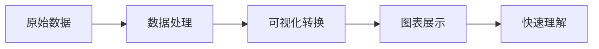
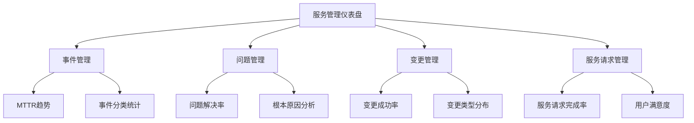
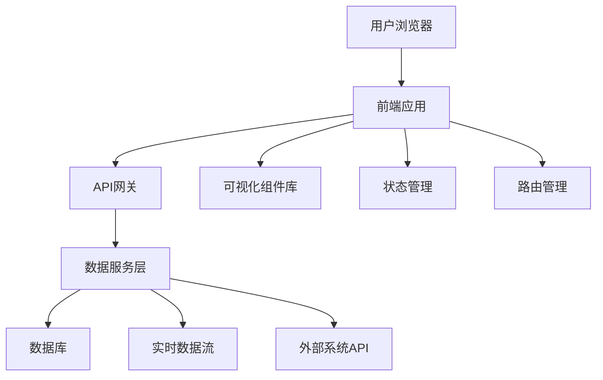

在现代企业级IT服务管理（ITSM）平台中，数据可视化已成为决策支持和运营管理不可或缺的重要工具。面对海量的IT运营数据，如何将复杂的信息转化为直观易懂的视觉元素，为不同层级和角色的用户提供有针对性的信息展示，是提升IT管理效能的关键所在。可视化报表与仪表盘不仅能够帮助管理者快速了解IT服务状态，还能为一线工程师提供实时的操作指导，实现从数据到洞察的有效转换。

不同角色的用户对信息的需求存在显著差异。高管关注战略层面的业务价值和投资回报，中层经理关注流程效率和团队绩效，一线工程师关注具体操作和任务执行。因此，构建面向不同角色的个性化可视化报表与仪表盘，是实现有效信息传递和决策支持的重要手段。

## 可视化在ITSM中的核心价值

### 1. 信息传递效率提升

#### 复杂数据简化
IT运营环境产生的数据往往具有复杂性和多样性，传统的表格和数字形式难以直观表达数据间的关系和趋势。通过可视化技术，可以将复杂的数字信息转化为图表、图形等视觉元素，大大提升信息的理解效率。



#### 模式识别增强
人类视觉系统在模式识别方面具有天然优势，可视化能够帮助用户快速识别数据中的异常、趋势和关联关系，这在传统的数据表格中往往难以发现。

#### 决策支持优化
直观的可视化展示能够帮助决策者快速获取关键信息，缩短决策时间，提高决策质量。

### 2. 用户体验改善

#### 交互性增强
现代可视化工具支持丰富的交互功能，用户可以通过点击、拖拽、缩放等操作深入探索数据，获得更加个性化的信息体验。

#### 个性化定制
根据不同用户角色的需求，可以定制个性化的视图和指标展示，提高信息的相关性和实用性。

#### 实时性保障
通过实时数据更新和动态展示，用户能够及时了解最新的运营状态，支持快速响应和处理。

### 3. 协作效率提升

#### 信息共享便利
可视化报表和仪表盘便于在团队内部共享，促进信息透明和协作沟通。

#### 问题定位加速
通过可视化的关联分析，团队成员能够更快地定位问题根源，协调资源解决问题。

#### 知识传递优化
直观的可视化展示有助于知识的传递和经验的分享，提升团队整体能力。

## 不同角色的可视化需求分析

### 1. 高管层需求

#### 战略视角
高管层关注的是IT服务对企业战略目标的支撑作用，需要从宏观角度了解IT投资的价值和效果。

**核心关注点**：
- 业务价值贡献：IT服务对业务收入、成本节约、效率提升的贡献
- 投资回报分析：IT投入与产出的对比分析
- 风险管控水平：IT服务的稳定性和安全性表现
- 创新能力体现：新技术应用和数字化转型进展

**典型可视化元素**：
```json
{
  "executive_dashboard_elements": [
    {
      "type": "KPI_summary",
      "content": "关键绩效指标概览",
      "visualization": "指标卡片+趋势图"
    },
    {
      "type": "business_impact",
      "content": "IT服务业务影响分析",
      "visualization": "价值流图+ROI分析"
    },
    {
      "type": "risk_overview",
      "content": "风险态势总览",
      "visualization": "风险热力图+趋势分析"
    },
    {
      "type": "investment_analysis",
      "content": "IT投资效益分析",
      "visualization": "投资回报率图表+成本效益分析"
    }
  ]
}
```

#### 决策支持需求
高管需要基于准确、及时的信息做出战略决策，可视化应该提供清晰的决策依据和预测分析。

### 2. 管理层需求

#### 运营视角
管理层关注的是IT服务的日常运营效率和质量，需要了解各项流程的执行情况和团队绩效。

**核心关注点**：
- 流程效率：各ITSM流程的执行效率和质量表现
- 团队绩效：各团队的工作负荷和绩效表现
- 资源配置：人力资源和系统资源的配置情况
- 服务质量：SLA达成情况和服务质量水平

**典型可视化元素**：


#### 监控预警需求
管理层需要实时监控关键指标，及时发现和处理异常情况，可视化应该提供有效的预警机制。

### 3. 执行层需求

#### 操作视角
执行层关注的是具体任务的执行和操作，需要实时了解工作状态和指导信息。

**核心关注点**：
- 工单状态：当前处理的工单状态和优先级
- 操作指导：具体操作的步骤和注意事项
- 资源信息：相关配置项和服务信息
- 协作沟通：与团队成员的协作和沟通信息

**典型可视化元素**：
```python
class EngineerDashboard:
    def __init__(self):
        self.components = {
            'work_order_panel': WorkOrderPanel(),
            'knowledge_base': KnowledgeBasePanel(),
            'ci_information': CIInfoPanel(),
            'collaboration_tools': CollaborationPanel(),
            'performance_metrics': PerformancePanel()
        }
    
    def render_dashboard(self):
        """
        渲染工程师仪表盘
        """
        dashboard_layout = """
        +---------------------------------------------------+
        | 工单处理面板         | 知识库面板                 |
        | - 待处理工单列表     | - 相关解决方案             |
        | - 工单优先级        | - 操作指导                 |
        | - 处理进度          | - 最佳实践                 |
        +---------------------+---------------------------+
        | 配置项信息面板       | 协作沟通面板               |
        | - 相关CI信息         | - 团队成员状态             |
        | - 依赖关系图         | - 实时消息                 |
        | - 历史变更记录       | - 会议安排                 |
        +---------------------+---------------------------+
        | 个人绩效面板         |                           |
        | - 今日处理量         |                           |
        | - 平均处理时间       |                           |
        | - 用户评价           |                           |
        +---------------------+---------------------------+
        """
        return dashboard_layout
```

#### 实时操作需求
执行层需要实时的操作反馈和指导，可视化应该提供即时的信息更新和操作支持。

## 可视化设计原则与方法

### 1. 设计原则

#### 用户中心设计
可视化设计应该以用户需求为中心，充分考虑不同角色的使用习惯和信息偏好。

```json
{
  "user_centered_design_principles": [
    {
      "principle": "角色导向",
      "description": "根据不同角色的需求设计相应的视图和功能"
    },
    {
      "principle": "任务驱动",
      "description": "围绕用户的核心任务设计信息展示方式"
    },
    {
      "principle": "简洁明了",
      "description": "避免信息过载，突出关键信息"
    },
    {
      "principle": "一致性",
      "description": "保持界面风格和交互方式的一致性"
    }
  ]
}
```

#### 数据驱动设计
可视化设计应该基于数据的特点和用户的需求，选择合适的图表类型和展示方式。

#### 响应式设计
考虑到用户可能使用不同的设备访问可视化界面，应该采用响应式设计，确保在各种屏幕尺寸下都能提供良好的用户体验。

### 2. 图表选择指南

#### 趋势展示
对于需要展示数据变化趋势的场景，推荐使用折线图、面积图等。

```python
import matplotlib.pyplot as plt
import numpy as np

def create_trend_chart(data, title):
    """
    创建趋势图表
    """
    fig, ax = plt.subplots(figsize=(10, 6))
    
    # 绘制趋势线
    ax.plot(data['dates'], data['values'], marker='o', linewidth=2, markersize=6)
    
    # 设置图表属性
    ax.set_title(title, fontsize=16, fontweight='bold')
    ax.set_xlabel('时间', fontsize=12)
    ax.set_ylabel('数值', fontsize=12)
    ax.grid(True, alpha=0.3)
    
    # 格式化日期显示
    ax.xaxis.set_major_formatter(plt.matplotlib.dates.DateFormatter('%m-%d'))
    
    return fig
```

#### 比较分析
对于需要进行数据比较的场景，推荐使用柱状图、条形图等。

#### 构成分析
对于需要展示组成部分和占比关系的场景，推荐使用饼图、环形图、堆叠图等。

#### 关系展示
对于需要展示数据间关系的场景，推荐使用散点图、网络图、热力图等。

### 3. 交互设计

#### 钻取分析
支持用户从汇总数据深入到详细数据的钻取分析。

```javascript
// 交互式钻取示例
function setupDrillDown(chartElement) {
    chartElement.addEventListener('click', function(event) {
        const clickedData = getClickedData(event);
        if (clickedData) {
            // 钻取到下一层级
            drillDownToDetail(clickedData);
        }
    });
}

function drillDownToDetail(dataPoint) {
    // 获取详细数据
    const detailData = fetchDetailData(dataPoint.id);
    
    // 更新图表显示
    updateChartWithDetail(detailData);
    
    // 显示返回按钮
    showBackButton();
}
```

#### 动态过滤
支持用户通过交互控件动态过滤和筛选数据。

#### 实时更新
支持数据的实时更新和动态展示。

## 仪表盘架构设计

### 1. 技术架构

#### 前端架构
现代仪表盘通常采用前后端分离的架构，前端负责数据展示和用户交互。



#### 后端架构
后端负责数据处理、业务逻辑和API提供。

```python
class DashboardBackend:
    def __init__(self):
        self.data_services = {
            'metrics_service': MetricsService(),
            'realtime_service': RealtimeService(),
            'analytics_service': AnalyticsService()
        }
    
    def get_executive_data(self, time_range):
        """
        获取高管层数据
        """
        data = {
            'kpi_summary': self.data_services['metrics_service'].get_kpi_summary(time_range),
            'business_impact': self.data_services['analytics_service'].analyze_business_impact(time_range),
            'risk_assessment': self.data_services['analytics_service'].assess_risk(time_range),
            'investment_analysis': self.data_services['analytics_service'].analyze_investment(time_range)
        }
        return data
    
    def get_management_data(self, time_range, team_filter=None):
        """
        获取管理层数据
        """
        data = {
            'process_efficiency': self.data_services['metrics_service'].get_process_metrics(time_range),
            'team_performance': self.data_services['metrics_service'].get_team_performance(time_range, team_filter),
            'resource_utilization': self.data_services['metrics_service'].get_resource_utilization(time_range),
            'service_quality': self.data_services['metrics_service'].get_service_quality(time_range)
        }
        return data
```

### 2. 数据架构

#### 数据分层
采用分层的数据架构，提高数据处理效率和可维护性。

```sql
-- 数据分层架构示例
-- ODS层：操作数据存储
CREATE TABLE ods_incidents (
    incident_id VARCHAR(50),
    reported_time TIMESTAMP,
    resolved_time TIMESTAMP,
    priority VARCHAR(20),
    status VARCHAR(20),
    assigned_team VARCHAR(50)
);

-- DW层：数据仓库
CREATE TABLE dw_incident_metrics (
    date_key DATE,
    team_key VARCHAR(50),
    priority_level VARCHAR(20),
    incident_count INT,
    avg_resolution_time DECIMAL(10,2),
    sla_breach_count INT
);

-- DM层：数据集市
CREATE TABLE dm_executive_kpis (
    kpi_date DATE,
    kpi_name VARCHAR(100),
    kpi_value DECIMAL(15,4),
    target_value DECIMAL(15,4),
    trend_direction VARCHAR(10)
);
```

#### 实时处理
对于需要实时展示的数据，采用流处理技术。

```python
from kafka import KafkaConsumer
import json

class RealtimeDataProcessor:
    def __init__(self):
        self.consumer = KafkaConsumer(
            'incident_events',
            bootstrap_servers=['localhost:9092'],
            value_deserializer=lambda x: json.loads(x.decode('utf-8'))
        )
    
    def process_realtime_data(self):
        """
        处理实时数据
        """
        for message in self.consumer:
            event_data = message.value
            
            # 处理事件数据
            processed_data = self.transform_event_data(event_data)
            
            # 更新仪表盘数据
            self.update_dashboard_cache(processed_data)
            
            # 发送WebSocket通知
            self.broadcast_update(processed_data)
```

## 最佳实践案例

### 案例一：某互联网公司的多角色仪表盘实践

某大型互联网公司在构建多角色仪表盘时，采用了以下策略：

#### 角色定制化
- 为高管层设计了战略视角的仪表盘，重点关注业务价值和投资回报
- 为管理层设计了运营视角的仪表盘，重点关注流程效率和团队绩效
- 为工程师设计了操作视角的仪表盘，重点关注工单处理和协作沟通

#### 技术实现
- 采用微前端架构，支持不同角色视图的独立开发和部署
- 使用GraphQL API，支持灵活的数据查询和聚合
- 实现了基于角色的访问控制和数据权限管理

#### 实施效果
- 高管决策效率提升40%
- 管理层监控效率提升60%
- 工程师操作效率提升30%
- 用户满意度达到4.8/5.0

#### 经验总结
- 用户需求分析是成功的关键
- 技术架构设计要支持灵活性和扩展性
- 持续优化是保持效果的重要手段

### 案例二：某金融机构的合规性可视化实践

某金融机构在可视化建设中，特别注重合规性要求：

#### 合规设计
- 所有可视化内容都符合监管要求和行业标准
- 建立了完整的数据审计和访问日志
- 实现了敏感数据的脱敏和权限控制

#### 安全保障
- 采用多层次的安全防护机制
- 实现了细粒度的访问控制
- 建立了完善的数据备份和恢复机制

#### 实施效果
- 通过了所有监管审计
- 实现了零数据安全事件
- 获得了监管机构的高度评价

#### 关键要点
- 合规性要求应该在设计阶段就充分考虑
- 安全性是金融行业的基本要求
- 用户体验和安全性需要平衡考虑

## 实施建议

### 1. 启动阶段建议

#### 需求调研
- 深入了解不同角色的用户需求
- 识别关键业务场景和使用痛点
- 确定可视化建设的优先级和范围

#### 技术选型
- 根据需求选择合适的可视化工具和框架
- 考虑系统的可扩展性和可维护性
- 评估技术方案的可行性和成本效益

#### 原型设计
- 制作可视化原型，验证设计方案
- 收集用户反馈，优化设计细节
- 确定最终的技术实现方案

### 2. 实施阶段建议

#### 分步实施
- 采用分阶段实施策略，优先实现核心功能
- 逐步扩展功能和覆盖范围
- 持续收集用户反馈，及时调整实施计划

#### 质量保障
- 建立完善的测试和验证机制
- 确保数据的准确性和及时性
- 优化系统性能，提供流畅的用户体验

#### 用户培训
- 提供详细的使用培训和指导
- 建立用户支持和帮助机制
- 收集用户反馈，持续改进系统功能

### 3. 优化阶段建议

#### 持续监控
- 建立系统使用情况的监控机制
- 定期评估可视化效果和用户满意度
- 及时发现和解决系统问题

#### 性能优化
- 持续优化数据处理和展示性能
- 改进用户体验和交互设计
- 扩展系统功能和覆盖范围

#### 技术升级
- 跟踪可视化技术的发展趋势
- 及时升级工具和平台
- 探索新的可视化方法和应用场景

## 未来发展趋势

### 1. 智能化可视化

#### AI驱动的洞察
通过人工智能技术自动发现数据中的模式和异常，提供智能化的洞察和建议。

#### 自适应界面
根据用户的使用习惯和偏好，自动调整界面布局和信息展示方式。

#### 预测性可视化
基于机器学习模型，提供未来趋势的预测和预警可视化。

### 2. 交互式体验

#### 增强现实(AR)集成
通过AR技术提供更加沉浸式的可视化体验。

#### 语音交互
支持语音命令和语音反馈，提供更加自然的交互方式。

#### 协作式可视化
支持多人协作的可视化环境，促进团队智慧的发挥。

### 3. 移动化适配

#### 响应式设计
全面支持移动设备的访问和使用。

#### 离线功能
提供离线查看和基本操作功能。

#### 推送通知
通过移动推送及时通知重要信息和预警。

## 结语

可视化报表与仪表盘作为现代IT服务管理的重要工具，不仅能够提升信息传递效率和用户体验，还能为不同角色的用户提供有针对性的决策支持。通过深入理解不同角色的需求，采用科学的设计方法和先进的技术架构，我们可以构建出既美观又实用的可视化系统。

然而，可视化建设并非一蹴而就的过程，它需要组织在需求分析、技术选型、实施部署、持续优化等多个方面进行系统性的规划和投入。只有将用户需求放在首位，采用合适的技术方案，持续优化和改进，才能真正发挥可视化在IT服务管理中的价值。

在数字化转型的大背景下，可视化的重要性将进一步凸显。组织应该将可视化建设作为IT管理现代化的重要组成部分，投入必要的资源和精力，构建完善的可视化体系，确保IT服务能够更好地支撑业务发展和创新。

通过深入理解可视化设计的核心概念和最佳实践，结合组织的实际情况，我们可以构建出既符合用户需求又具备先进技术的可视化系统，为组织的数字化转型提供强有力的支持。未来，随着人工智能、增强现实等新技术的应用，可视化将变得更加智能和高效，为组织创造更大的价值。