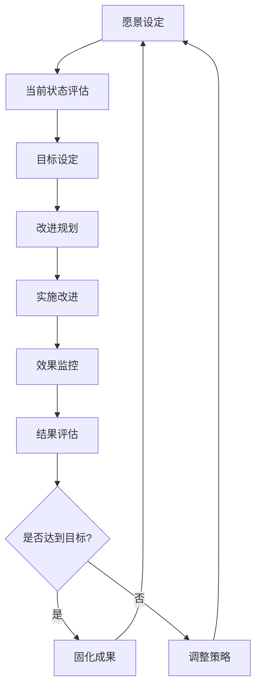
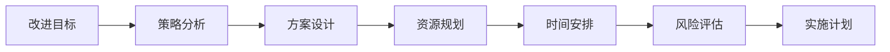

在企业级IT服务管理（ITSM）实践中，持续改进是确保服务质量不断提升、运营效率持续优化的核心机制。ITIL框架中的持续服务改进（Continual Service Improvement, CSI）模型为组织提供了一套系统性的方法论，指导如何通过数据驱动的方式识别改进机会、实施改进措施、评估改进效果，形成完整的改进循环。

持续改进不仅仅是一个理念，更是一套可执行的方法和流程。它要求组织建立完善的数据收集和分析机制，基于客观数据识别问题和机会，制定科学的改进策略，并通过有效的项目管理确保改进措施的成功实施。在数字化转型的大背景下，数据驱动的持续改进已成为组织保持竞争优势、实现业务价值最大化的关键能力。

## CSI模型的核心理念

### 1. 改进的系统性

#### 循环性特征
CSI模型强调改进是一个持续的循环过程，而不是一次性的活动。这个循环包括了从愿景设定到效果评估的完整过程，确保改进活动能够持续进行并不断优化。



#### 全面性覆盖
CSI模型覆盖了IT服务管理的各个方面，从战略层面的愿景设定到操作层面的具体实施，确保改进活动能够全面、系统地推进。

### 2. 数据驱动决策

#### 客观性保障
基于数据的决策能够减少主观判断的偏差，提高决策的科学性和准确性。通过收集和分析客观数据，组织能够更准确地识别问题、评估现状、制定策略。

#### 量化管理
数据驱动的改进强调量化管理，通过具体的指标和数据来衡量改进效果，确保改进活动能够产生可测量的价值。

### 3. 价值导向

#### 业务价值聚焦
持续改进应该始终以业务价值为导向，确保所有的改进活动都能够为业务目标的实现做出贡献。

#### 用户体验优化
改进活动应该关注用户体验的提升，通过优化服务流程和质量，提高用户满意度和忠诚度。

## CSI七步改进流程

### 1. 第一步：明确愿景

#### 战略对齐
明确改进活动与组织战略目标的对齐关系，确保改进方向与业务需求保持一致。

```json
{
  "vision_alignment": {
    "business_strategy": "数字化转型战略",
    "it_strategy": "IT服务现代化计划",
    "csi_vision": "构建卓越的IT服务能力，支撑业务创新发展",
    "key_objectives": [
      "提升服务可用性至99.9%",
      "降低平均故障恢复时间30%",
      "提高用户满意度至4.5/5.0",
      "优化IT运营成本15%"
    ]
  }
}
```

#### 利益相关者识别
识别所有与改进活动相关的利益相关者，包括内部用户、外部客户、管理层、技术团队等，确保改进活动能够满足各方需求。

### 2. 第二步：评估当前状态

#### 基准线建立
通过全面的数据收集和分析，建立当前状态的基准线，为后续的改进效果评估提供参考。

```python
class CurrentStateAssessment:
    def __init__(self):
        self.metrics_collector = MetricsCollector()
        self.benchmark_data = BenchmarkData()
    
    def assess_current_state(self):
        """
        评估当前状态
        """
        # 收集关键指标数据
        current_metrics = self.metrics_collector.collect_all_metrics()
        
        # 与行业基准对比
        benchmark_comparison = self.compare_with_benchmark(current_metrics)
        
        # 识别差距和问题
        gaps_and_issues = self.identify_gaps_and_issues(current_metrics, benchmark_comparison)
        
        # 评估改进机会
        improvement_opportunities = self.assess_improvement_opportunities(gaps_and_issues)
        
        return {
            'current_metrics': current_metrics,
            'benchmark_comparison': benchmark_comparison,
            'gaps_and_issues': gaps_and_issues,
            'improvement_opportunities': improvement_opportunities
        }
    
    def compare_with_benchmark(self, current_metrics):
        """
        与行业基准对比
        """
        benchmark_metrics = self.benchmark_data.get_industry_benchmarks()
        comparison_results = {}
        
        for metric_name, current_value in current_metrics.items():
            if metric_name in benchmark_metrics:
                benchmark_value = benchmark_metrics[metric_name]
                gap = current_value - benchmark_value
                comparison_results[metric_name] = {
                    'current': current_value,
                    'benchmark': benchmark_value,
                    'gap': gap,
                    'performance_ratio': current_value / benchmark_value if benchmark_value != 0 else 0
                }
        
        return comparison_results
```

#### SWOT分析
通过SWOT分析（优势、劣势、机会、威胁）全面评估组织的内外部环境。

### 3. 第三步：定义目标

#### SMART原则
目标设定应该遵循SMART原则（具体、可测量、可达成、相关性、时限性）。

```json
{
  "improvement_goals": [
    {
      "goal": "提升事件平均解决时间",
      "current_state": "4.2小时",
      "target_state": "3.0小时",
      "measurement": "MTTR指标",
      "timeline": "6个月内",
      "success_criteria": "达到或低于3.0小时"
    },
    {
      "goal": "提高变更成功率",
      "current_state": "92%",
      "target_state": "98%",
      "measurement": "变更成功率指标",
      "timeline": "12个月内",
      "success_criteria": "达到或超过98%"
    },
    {
      "goal": "降低重复事件率",
      "current_state": "15%",
      "target_state": "8%",
      "measurement": "重复事件率指标",
      "timeline": "9个月内",
      "success_criteria": "降低至8%或以下"
    }
  ]
}
```

#### 优先级排序
根据业务影响、实施难度、资源需求等因素对改进目标进行优先级排序。

### 4. 第四步：制定改进计划

#### 改进策略制定
基于目标要求和现状分析，制定具体的改进策略和实施方案。



#### 项目管理
采用项目管理方法推进改进计划的实施，确保按时、按质、按预算完成。

### 5. 第五步：实施改进

#### 变革管理
有效的变革管理是改进成功的关键，需要关注人员接受度、沟通协调、培训支持等方面。

```python
class ChangeManagement:
    def __init__(self):
        self.stakeholders = StakeholderManager()
        self.communication_plan = CommunicationPlan()
        self.training_program = TrainingProgram()
    
    def implement_change(self, improvement_plan):
        """
        实施改进变更
        """
        # 1. 变更准备
        self.prepare_for_change(improvement_plan)
        
        # 2. 沟通宣传
        self.communicate_change(improvement_plan)
        
        # 3. 培训支持
        self.provide_training_and_support(improvement_plan)
        
        # 4. 执行实施
        implementation_results = self.execute_change(improvement_plan)
        
        # 5. 监控反馈
        self.monitor_and_gather_feedback(implementation_results)
        
        return implementation_results
    
    def prepare_for_change(self, plan):
        """
        变更准备
        """
        # 识别关键利益相关者
        key_stakeholders = self.stakeholders.identify_key_stakeholders(plan)
        
        # 评估变更影响
        impact_assessment = self.assess_change_impact(plan, key_stakeholders)
        
        # 制定应对策略
        mitigation_strategies = self.develop_mitigation_strategies(impact_assessment)
        
        return {
            'key_stakeholders': key_stakeholders,
            'impact_assessment': impact_assessment,
            'mitigation_strategies': mitigation_strategies
        }
```

#### 质量控制
建立质量控制机制，确保改进措施按照预期要求实施。

### 6. 第六步：监控效果

#### 实时监控
建立实时监控机制，跟踪改进措施的实施进度和效果。

```python
class ImprovementMonitoring:
    def __init__(self):
        self.metrics_tracker = MetricsTracker()
        self.alert_system = AlertSystem()
        self.dashboard = Dashboard()
    
    def monitor_improvement_progress(self, improvement_goals):
        """
        监控改进进展
        """
        monitoring_results = {}
        
        for goal in improvement_goals:
            # 跟踪目标指标
            current_value = self.metrics_tracker.get_current_value(goal['measurement'])
            
            # 计算达成率
            achievement_rate = self.calculate_achievement_rate(current_value, goal)
            
            # 评估趋势
            trend = self.analyze_trend(goal['measurement'])
            
            # 检查预警
            alerts = self.check_alerts(goal, current_value)
            
            monitoring_results[goal['goal']] = {
                'current_value': current_value,
                'achievement_rate': achievement_rate,
                'trend': trend,
                'alerts': alerts
            }
            
            # 更新仪表盘
            self.dashboard.update_metric(goal['measurement'], current_value)
        
        return monitoring_results
    
    def calculate_achievement_rate(self, current_value, goal):
        """
        计算目标达成率
        """
        if goal['target_state'] > goal['current_state']:
            # 正向指标（越大越好）
            rate = (current_value - goal['current_state']) / (goal['target_state'] - goal['current_state'])
        else:
            # 负向指标（越小越好）
            rate = (goal['current_state'] - current_value) / (goal['current_state'] - goal['target_state'])
        
        return max(0, min(1, rate))  # 限制在0-1之间
```

#### 定期评估
定期进行阶段性评估，及时发现和解决实施过程中的问题。

### 7. 第七步：评估结果

#### 效果评估
全面评估改进措施的实施效果，判断是否达到预期目标。

```json
{
  "improvement_evaluation": {
    "goal_achievement": {
      "target_met": "是否达到目标",
      "actual_vs_target": "实际值与目标值对比",
      "improvement_percentage": "改进百分比"
    },
    "business_impact": {
      "cost_savings": "成本节约",
      "efficiency_gains": "效率提升",
      "user_satisfaction": "用户满意度改善",
      "risk_reduction": "风险降低"
    },
    "lessons_learned": {
      "success_factors": "成功因素",
      "challenges_faced": "面临挑战",
      "improvement_areas": "改进空间"
    }
  }
}
```

#### 知识沉淀
将改进过程中的经验和教训进行总结和沉淀，为未来的改进活动提供参考。

## 数据驱动的改进方法

### 1. 数据收集与整合

#### 多源数据融合
整合来自不同系统的数据，形成完整的数据视图。

```python
class DataIntegration:
    def __init__(self):
        self.data_sources = {
            'itsm_system': ITSMDataSource(),
            'monitoring_system': MonitoringDataSource(),
            'cmdb': CMDBDataSource(),
            'financial_system': FinancialDataSource(),
            'survey_system': SurveyDataSource()
        }
    
    def integrate_data(self, time_range):
        """
        整合多源数据
        """
        integrated_data = {}
        
        for source_name, source in self.data_sources.items():
            try:
                source_data = source.fetch_data(time_range)
                integrated_data[source_name] = source_data
                self.log_success(source_name)
            except Exception as e:
                self.log_error(source_name, str(e))
        
        # 数据关联和整合
        correlated_data = self.correlate_data(integrated_data)
        
        # 数据清洗和标准化
        cleaned_data = self.clean_and_standardize(correlated_data)
        
        return cleaned_data
    
    def correlate_data(self, data_sources):
        """
        关联不同数据源的数据
        """
        correlated_data = {}
        
        # 基于时间维度关联
        time_based_correlation = self.correlate_by_time(data_sources)
        correlated_data['time_correlation'] = time_based_correlation
        
        # 基于实体维度关联
        entity_based_correlation = self.correlate_by_entity(data_sources)
        correlated_data['entity_correlation'] = entity_based_correlation
        
        # 基于业务维度关联
        business_based_correlation = self.correlate_by_business(data_sources)
        correlated_data['business_correlation'] = business_based_correlation
        
        return correlated_data
```

#### 实时数据处理
建立实时数据处理机制，支持动态监控和快速响应。

### 2. 数据分析与洞察

#### 趋势分析
通过时间序列分析识别业务和服务的发展趋势。

```python
import pandas as pd
from sklearn.linear_model import LinearRegression
import numpy as np

class TrendAnalysis:
    def __init__(self):
        self.model = LinearRegression()
    
    def analyze_trend(self, time_series_data, metric_name):
        """
        分析时间序列趋势
        """
        # 转换为DataFrame
        df = pd.DataFrame(time_series_data)
        df['date'] = pd.to_datetime(df['date'])
        df = df.sort_values('date')
        
        # 线性趋势分析
        X = np.arange(len(df)).reshape(-1, 1)
        y = df['value'].values
        self.model.fit(X, y)
        
        trend_slope = self.model.coef_[0]
        trend_direction = "上升" if trend_slope > 0 else "下降" if trend_slope < 0 else "平稳"
        
        # 预测未来趋势
        future_predictions = self.predict_future_trend(df, periods=30)
        
        return {
            'metric': metric_name,
            'trend_slope': trend_slope,
            'trend_direction': trend_direction,
            'r_squared': self.model.score(X, y),
            'future_predictions': future_predictions,
            'confidence_interval': self.calculate_confidence_interval(df)
        }
    
    def predict_future_trend(self, df, periods=30):
        """
        预测未来趋势
        """
        last_index = len(df)
        future_indices = np.arange(last_index, last_index + periods).reshape(-1, 1)
        future_values = self.model.predict(future_indices)
        
        future_dates = pd.date_range(start=df['date'].max(), periods=periods+1, freq='D')[1:]
        
        return {
            'dates': future_dates.tolist(),
            'predicted_values': future_values.tolist()
        }
```

#### 根因分析
通过数据挖掘技术识别问题产生的根本原因。

#### 异常检测
建立异常检测机制，及时发现数据中的异常模式。

### 3. 改进机会识别

#### 差距分析
通过对比分析识别改进机会和优化空间。

```python
class GapAnalysis:
    def __init__(self):
        self.benchmark_data = BenchmarkData()
        self.historical_data = HistoricalData()
    
    def perform_gap_analysis(self, current_metrics):
        """
        执行差距分析
        """
        gaps = {}
        
        # 与行业基准对比
        benchmark_gaps = self.analyze_benchmark_gaps(current_metrics)
        gaps['benchmark_gaps'] = benchmark_gaps
        
        # 与历史数据对比
        historical_gaps = self.analyze_historical_gaps(current_metrics)
        gaps['historical_gaps'] = historical_gaps
        
        # 与最佳实践对比
        best_practice_gaps = self.analyze_best_practice_gaps(current_metrics)
        gaps['best_practice_gaps'] = best_practice_gaps
        
        # 优先级排序
        prioritized_gaps = self.prioritize_gaps(gaps)
        gaps['prioritized_gaps'] = prioritized_gaps
        
        return gaps
    
    def analyze_benchmark_gaps(self, current_metrics):
        """
        分析与行业基准的差距
        """
        benchmark_metrics = self.benchmark_data.get_latest_benchmarks()
        gaps = {}
        
        for metric_name, current_value in current_metrics.items():
            if metric_name in benchmark_metrics:
                benchmark_value = benchmark_metrics[metric_name]
                gap = abs(current_value - benchmark_value)
                gap_percentage = (gap / benchmark_value) * 100 if benchmark_value != 0 else 0
                
                gaps[metric_name] = {
                    'current_value': current_value,
                    'benchmark_value': benchmark_value,
                    'absolute_gap': gap,
                    'percentage_gap': gap_percentage,
                    'improvement_needed': benchmark_value - current_value
                }
        
        return gaps
```

#### 价值评估
评估不同改进机会的业务价值和实施成本。

## 持续改进的组织保障

### 1. 文化建设

#### 改进文化培育
建立鼓励创新和持续改进的组织文化。

```json
{
  "improvement_culture": {
    "core_values": [
      "持续学习",
      "创新驱动",
      "团队协作",
      "客户导向",
      "卓越追求"
    ],
    "behavioral_expectations": [
      "主动识别改进机会",
      "积极参与改进活动",
      "分享经验和知识",
      "接受反馈和建议",
      "勇于尝试和创新"
    ],
    "recognition_mechanisms": [
      "改进贡献奖",
      "创新实践奖",
      "团队协作奖",
      "客户满意奖"
    ]
  }
}
```

#### 学习型组织
打造学习型组织，促进知识共享和能力提升。

### 2. 能力建设

#### 技能培训
定期开展数据分析、流程优化、项目管理等方面的培训。

#### 经验分享
建立经验分享机制，促进最佳实践的传播和应用。

### 3. 激励机制

#### 绩效考核
将改进贡献纳入绩效考核体系，激励员工积极参与改进活动。

#### 奖励制度
建立完善的奖励制度，对改进成果进行及时认可和奖励。

## 最佳实践案例

### 案例一：某互联网公司的CSI实践

某大型互联网公司在实施CSI时，采用了以下策略：

#### 数据驱动方法
- 建立了完整的数据收集和分析体系
- 实现了关键指标的实时监控和预警
- 应用了机器学习技术进行趋势预测

#### 实施效果
- 事件平均解决时间缩短了35%
- 变更成功率提升至99.1%
- 用户满意度达到4.7/5.0
- IT运营成本降低了20%

#### 经验总结
- 数据质量是成功的基础
- 跨部门协作是关键
- 持续优化是保障

### 案例二：某金融机构的改进文化建设

某金融机构在CSI实施中，特别注重改进文化建设：

#### 文化培育
- 建立了鼓励创新的企业文化
- 实施了改进贡献的激励机制
- 开展了持续的学习和培训

#### 实施效果
- 员工参与度提升60%
- 改进项目成功率提高40%
- 组织创新能力显著增强

#### 关键要点
- 文化建设需要长期坚持
- 激励机制要公平透明
- 领导支持是成功关键

## 实施建议

### 1. 启动阶段建议

#### 高层支持
- 获得高层管理者的明确支持和承诺
- 确保足够的资源投入
- 建立有效的沟通机制

#### 现状评估
- 全面评估当前IT服务管理水平
- 识别主要问题和改进机会
- 制定切实可行的实施计划

#### 试点实施
- 选择关键业务领域进行试点
- 验证改进方法的有效性
- 积累实施经验

### 2. 实施阶段建议

#### 分步推进
- 采用分阶段实施策略
- 优先解决关键问题
- 逐步完善改进体系

#### 持续监控
- 建立实时监控机制
- 定期评估实施效果
- 及时调整实施策略

#### 能力提升
- 加强团队能力建设
- 完善培训体系
- 建立激励机制

### 3. 优化阶段建议

#### 定期评估
- 建立定期评估机制
- 持续监控改进效果
- 及时发现优化机会

#### 反馈收集
- 建立多渠道反馈机制
- 积极收集用户意见
- 重视业务部门需求

#### 技术跟进
- 关注技术发展趋势
- 及时升级工具平台
- 探索新的改进方法

## 未来发展趋势

### 1. 智能化改进

#### AI驱动优化
人工智能技术将在持续改进中发挥越来越重要的作用，通过机器学习算法自动识别改进机会和优化方案。

#### 自动化实施
自动化工具将支持改进措施的自动实施和效果监控，提高改进效率。

### 2. 实时化监控

#### 流式处理
实时数据处理技术将支持更及时的监控和分析，实现动态优化。

#### 预测性改进
基于预测分析的改进方法将能够提前识别和解决潜在问题。

### 3. 协作化改进

#### 群体智慧
通过协作平台汇聚群体智慧，实现更高效的改进创新。

#### 开放生态
构建开放的改进生态，与外部合作伙伴共同推进持续改进。

## 结语

持续改进循环（CSI）是现代IT服务管理的核心机制，通过数据驱动的方法实现服务质量的不断提升和运营效率的持续优化。基于ITIL框架的CSI七步改进流程为组织提供了一套系统性的方法论，指导如何科学地识别改进机会、制定改进策略、实施改进措施、评估改进效果。

然而，持续改进不是一蹴而就的过程，它需要组织在文化建设、能力建设、机制保障等多个方面进行系统性的投入和长期的坚持。只有将改进理念深入到组织的各个层面，建立完善的改进体系，才能真正实现持续的价值创造。

在数字化转型的大背景下，持续改进的重要性将进一步凸显。组织应该将CSI作为IT管理现代化的重要组成部分，投入必要的资源和精力，构建完善的持续改进体系，确保IT服务能够更好地支撑业务发展和创新。

通过深入理解CSI的核心概念和最佳实践，结合组织的实际情况，我们可以构建出既符合ITIL标准又满足业务需求的持续改进体系，为组织的数字化转型提供强有力的支持。未来，随着人工智能和大数据技术的应用，持续改进将变得更加智能和高效，为组织创造更大的价值。