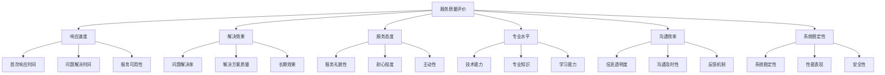

在企业级IT服务管理（ITSM）实践中，用户满意度是衡量服务质量的核心指标之一。与外部客户服务不同，IT部门主要面向内部用户（员工、部门、业务单元等）提供服务，这些内部客户既是服务的使用者，也是业务价值的创造者。因此，建立科学有效的满意度评价体系，系统性地收集和分析用户反馈，对于持续改进IT服务质量、提升用户体验、增强组织竞争力具有重要意义。

内部客户体验的衡量不仅关乎IT部门的绩效表现，更直接影响到整个组织的运营效率和业务成果。一个满意度高、体验良好的IT服务环境能够提升员工工作效率、降低沟通成本、增强团队协作，从而为组织创造更大的业务价值。反之，低满意度的IT服务可能导致工作效率下降、员工流失率上升、业务中断风险增加等负面后果。

## 内部客户体验的独特性

### 1. 用户特征差异

#### 多样化需求
内部用户群体具有高度的多样性，包括不同部门、不同职级、不同技术背景的员工，他们的需求和期望存在显著差异。

```json
{
  "user_segments": {
    "executives": {
      "characteristics": ["决策导向", "时间敏感", "关注业务影响"],
      "expectations": ["快速响应", "战略支持", "风险管控"],
      "communication_style": "简洁直接"
    },
    "managers": {
      "characteristics": ["流程导向", "团队管理", "绩效关注"],
      "expectations": ["流程透明", "团队支持", "效率提升"],
      "communication_style": "结构化沟通"
    },
    "knowledge_workers": {
      "characteristics": ["技术导向", "创新需求", "工具依赖"],
      "expectations": ["技术先进", "功能完善", "稳定可靠"],
      "communication_style": "技术细节讨论"
    },
    "general_staff": {
      "characteristics": ["操作导向", "简单易用", "及时帮助"],
      "expectations": ["界面友好", "操作简便", "快速解决"],
      "communication_style": "实用主义"
    }
  }
}
```

#### 关系复杂性
内部用户与IT部门之间存在复杂的工作关系，既有服务提供者与使用者的关系，也有合作伙伴和业务支撑的关系。

### 2. 服务场景特点

#### 全天候服务需求
现代企业运营的连续性要求IT服务具备7×24小时的可用性，用户对服务的时效性要求更高。

#### 业务紧密耦合
IT服务与业务运营紧密耦合，服务质量直接影响业务流程的顺畅程度和业务目标的达成。

#### 影响范围广泛
一次IT服务问题可能影响多个用户和业务流程，服务中断的连锁反应更为明显。

### 3. 评价标准特殊性

#### 业务价值导向
内部用户更关注IT服务对业务价值的贡献，而非单纯的技术指标。

#### 效率提升期望
用户期望IT服务能够提升工作效率，减少重复性工作和沟通成本。

#### 协作支持需求
IT服务需要与用户的工作流程深度融合，提供有效的协作支持。

## 满意度评价体系设计

### 1. 评价维度构建

#### 服务质量维度
从用户角度出发，构建全面的服务质量评价维度。



#### 业务影响维度
衡量IT服务对业务运营的实际影响。

```python
class BusinessImpactAssessment:
    def __init__(self):
        self.impact_metrics = {
            'productivity_impact': ProductivityImpact(),
            'cost_impact': CostImpact(),
            'risk_impact': RiskImpact(),
            'innovation_impact': InnovationImpact()
        }
    
    def assess_business_impact(self, service_data):
        """
        评估业务影响
        """
        impact_scores = {}
        
        for dimension, metric_calculator in self.impact_metrics.items():
            impact_score = metric_calculator.calculate(service_data)
            impact_scores[dimension] = impact_score
        
        # 综合评分
        overall_impact = self.calculate_overall_impact(impact_scores)
        impact_scores['overall'] = overall_impact
        
        return impact_scores
    
    def calculate_overall_impact(self, dimension_scores):
        """
        计算综合业务影响评分
        """
        # 加权计算（权重可根据业务重要性调整）
        weights = {
            'productivity_impact': 0.35,
            'cost_impact': 0.25,
            'risk_impact': 0.25,
            'innovation_impact': 0.15
        }
        
        weighted_sum = sum(
            score * weights.get(dimension, 0) 
            for dimension, score in dimension_scores.items()
        )
        
        return weighted_sum
```

### 2. 评价方法选择

#### 定量评价
通过标准化的问卷调查和指标测量，获取可量化的满意度数据。

```json
{
  "satisfaction_survey": {
    "overall_satisfaction": {
      "question": "您对IT服务的整体满意度如何？",
      "scale": "5分制（1-非常不满意，5-非常满意）",
      "weight": 0.3
    },
    "service_quality": {
      "questions": [
        {
          "question": "IT服务响应速度是否满足您的需求？",
          "scale": "5分制",
          "weight": 0.2
        },
        {
          "question": "IT服务解决问题的效果如何？",
          "scale": "5分制",
          "weight": 0.2
        },
        {
          "question": "IT服务人员的专业水平如何？",
          "scale": "5分制",
          "weight": 0.15
        },
        {
          "question": "IT系统的稳定性和性能表现如何？",
          "scale": "5分制",
          "weight": 0.15
        }
      ]
    },
    "net_promoter_score": {
      "question": "您向同事推荐IT服务的可能性有多大？",
      "scale": "0-10分制",
      "categories": {
        "promoters": "9-10分（推荐者）",
        "passives": "7-8分（中立者）",
        "detractors": "0-6分（批评者）"
      }
    }
  }
}
```

#### 定性评价
通过深度访谈、焦点小组、用户故事等方式，获取用户的真实感受和改进建议。

#### 行为数据分析
通过分析用户行为数据（如系统使用频率、功能使用情况、问题重复率等），间接评估用户满意度。

### 3. 评价频率规划

#### 定期调查
建立定期的满意度调查机制，如季度调查、年度调查等。

```python
class SatisfactionSurveyScheduler:
    def __init__(self):
        self.survey_schedule = {
            'quarterly_survey': {
                'frequency': '每季度',
                'target_audience': '全体内部用户',
                'survey_type': '综合满意度调查',
                'sample_size': '全覆盖'
            },
            'monthly_pulse': {
                'frequency': '每月',
                'target_audience': '关键用户群体',
                'survey_type': '快速脉搏调查',
                'sample_size': '抽样调查'
            },
            'post_service': {
                'frequency': '服务完成后',
                'target_audience': '服务使用者',
                'survey_type': '即时满意度调查',
                'sample_size': '全覆盖'
            },
            'annual_deep_dive': {
                'frequency': '每年',
                'target_audience': '分层用户样本',
                'survey_type': '深度体验调研',
                'sample_size': '分层抽样'
            }
        }
    
    def schedule_surveys(self):
        """
        安排调查计划
        """
        survey_plan = {}
        
        for survey_name, survey_config in self.survey_schedule.items():
            survey_plan[survey_name] = self.create_survey_schedule(survey_config)
        
        return survey_plan
```

#### 实时反馈
建立实时反馈机制，及时收集用户在服务使用过程中的意见和建议。

## 反馈收集机制建设

### 1. 多渠道收集

#### 数字化渠道
利用现代化的数字化工具收集用户反馈。

```python
class FeedbackCollectionSystem:
    def __init__(self):
        self.channels = {
            'web_portal': WebPortalChannel(),
            'mobile_app': MobileAppChannel(),
            'email': EmailChannel(),
            'chatbot': ChatbotChannel(),
            'social_platform': SocialPlatformChannel()
        }
    
    def collect_feedback(self):
        """
        多渠道收集反馈
        """
        all_feedback = []
        
        for channel_name, channel in self.channels.items():
            try:
                channel_feedback = channel.collect()
                all_feedback.extend(channel_feedback)
                self.log_collection_success(channel_name, len(channel_feedback))
            except Exception as e:
                self.log_collection_error(channel_name, str(e))
        
        # 反馈去重和分类
        processed_feedback = self.process_feedback(all_feedback)
        
        return processed_feedback
    
    def process_feedback(self, raw_feedback):
        """
        处理原始反馈
        """
        # 去重处理
        unique_feedback = self.deduplicate_feedback(raw_feedback)
        
        # 分类标记
        categorized_feedback = self.categorize_feedback(unique_feedback)
        
        # 优先级排序
        prioritized_feedback = self.prioritize_feedback(categorized_feedback)
        
        return prioritized_feedback
```

#### 人工渠道
通过面对面交流、电话回访、现场调研等方式收集反馈。

#### 被动收集
通过监控用户行为、分析服务数据等方式被动收集用户反馈信息。

### 2. 反馈处理流程

#### 自动化分拣
利用自然语言处理技术自动分拣和分类用户反馈。

```python
import nltk
from sklearn.feature_extraction.text import TfidfVectorizer
from sklearn.cluster import KMeans

class FeedbackProcessor:
    def __init__(self):
        self.vectorizer = TfidfVectorizer(stop_words='english', max_features=1000)
        self.clustering_model = KMeans(n_clusters=5)
    
    def process_feedback(self, feedback_list):
        """
        处理用户反馈
        """
        # 文本预处理
        processed_texts = [self.preprocess_text(feedback.text) for feedback in feedback_list]
        
        # 特征提取
        tfidf_matrix = self.vectorizer.fit_transform(processed_texts)
        
        # 聚类分析
        cluster_labels = self.clustering_model.fit_predict(tfidf_matrix)
        
        # 情感分析
        sentiment_scores = [self.analyze_sentiment(text) for text in processed_texts]
        
        # 结构化处理结果
        processed_feedback = []
        for i, feedback in enumerate(feedback_list):
            processed_item = {
                'original_feedback': feedback,
                'cluster': cluster_labels[i],
                'sentiment': sentiment_scores[i],
                'keywords': self.extract_keywords(processed_texts[i]),
                'priority': self.calculate_priority(cluster_labels[i], sentiment_scores[i])
            }
            processed_feedback.append(processed_item)
        
        return processed_feedback
    
    def preprocess_text(self, text):
        """
        文本预处理
        """
        # 转换为小写
        text = text.lower()
        
        # 移除标点符号
        import string
        text = text.translate(str.maketrans('', '', string.punctuation))
        
        # 分词
        tokens = nltk.word_tokenize(text)
        
        # 移除停用词
        from nltk.corpus import stopwords
        stop_words = set(stopwords.words('english'))
        tokens = [token for token in tokens if token not in stop_words]
        
        return ' '.join(tokens)
```

#### 人工审核
对重要反馈进行人工审核和深度分析，确保理解准确。

#### 闭环处理
建立反馈处理的闭环机制，确保用户反馈得到有效响应和处理。

### 3. 反馈激励机制

#### 正面激励
对提供有价值反馈的用户给予正面激励和认可。

```json
{
  "feedback_incentives": {
    "recognition_program": {
      "name": "优秀建议奖",
      "criteria": "提供被采纳的改进建议",
      "rewards": ["荣誉证书", "小额奖金", "公开表彰"]
    },
    "participation_rewards": {
      "name": "积极参与奖",
      "criteria": "定期参与满意度调查",
      "rewards": ["积分奖励", "小礼品", "抽奖机会"]
    },
    "innovation_contest": {
      "name": "创新想法大赛",
      "criteria": "提出创新性改进建议",
      "rewards": ["丰厚奖金", "项目实施机会", "职业发展支持"]
    }
  }
}
```

#### 反馈响应
及时响应用户反馈，让用户感受到被重视和关注。

## 数据分析与洞察

### 1. 满意度趋势分析

#### 时间序列分析
通过时间序列分析识别满意度变化趋势和周期性规律。

```python
import pandas as pd
import matplotlib.pyplot as plt
from statsmodels.tsa.seasonal import seasonal_decompose

class SatisfactionTrendAnalyzer:
    def __init__(self):
        self.satisfaction_data = pd.DataFrame()
    
    def analyze_trends(self, historical_data):
        """
        分析满意度趋势
        """
        # 创建时间序列数据
        ts_data = pd.Series(
            historical_data['satisfaction_scores'],
            index=pd.to_datetime(historical_data['dates'])
        )
        
        # 趋势分解
        decomposition = seasonal_decompose(ts_data, model='additive', period=12)
        
        # 趋势分析
        trend_analysis = {
            'overall_trend': self.calculate_overall_trend(ts_data),
            'seasonal_pattern': decomposition.seasonal,
            'trend_component': decomposition.trend,
            'residual_component': decomposition.resid,
            'forecast': self.forecast_future_trend(ts_data)
        }
        
        return trend_analysis
    
    def calculate_overall_trend(self, ts_data):
        """
        计算整体趋势
        """
        # 线性回归分析
        from sklearn.linear_model import LinearRegression
        import numpy as np
        
        X = np.arange(len(ts_data)).reshape(-1, 1)
        y = ts_data.values
        model = LinearRegression().fit(X, y)
        
        slope = model.coef_[0]
        trend_direction = "上升" if slope > 0 else "下降" if slope < 0 else "平稳"
        
        return {
            'slope': slope,
            'direction': trend_direction,
            'r_squared': model.score(X, y)
        }
```

#### 对比分析
通过横向对比分析识别不同用户群体、不同服务类型间的满意度差异。

### 2. 根因分析

#### 关联分析
分析满意度与其他运营指标间的关联关系。

```python
import numpy as np
from scipy.stats import pearsonr

class RootCauseAnalyzer:
    def __init__(self):
        self.correlation_threshold = 0.3
    
    def analyze_correlations(self, satisfaction_data, operational_data):
        """
        分析相关性
        """
        correlations = {}
        
        satisfaction_metrics = satisfaction_data.columns
        operational_metrics = operational_data.columns
        
        for sat_metric in satisfaction_metrics:
            for op_metric in operational_metrics:
                correlation, p_value = pearsonr(
                    satisfaction_data[sat_metric],
                    operational_data[op_metric]
                )
                
                if abs(correlation) > self.correlation_threshold:
                    correlations[f"{sat_metric}-{op_metric}"] = {
                        'correlation': correlation,
                        'p_value': p_value,
                        'significance': p_value < 0.05
                    }
        
        return correlations
    
    def identify_root_causes(self, correlations, feedback_data):
        """
        识别根本原因
        """
        root_causes = []
        
        # 基于相关性识别潜在原因
        for metric_pair, correlation_data in correlations.items():
            if correlation_data['significance']:
                cause_effect = self.determine_cause_effect(metric_pair, correlation_data)
                root_causes.append(cause_effect)
        
        # 基于反馈内容识别原因
        feedback_causes = self.extract_causes_from_feedback(feedback_data)
        root_causes.extend(feedback_causes)
        
        return root_causes
```

#### 文本挖掘
通过文本挖掘技术从用户反馈中提取关键问题和改进建议。

### 3. 预测分析

#### 满意度预测
基于历史数据和当前趋势预测未来满意度水平。

#### 风险预警
识别可能导致满意度下降的风险因素，提前采取预防措施。

## 改进行动实施

### 1. 改进优先级排序

#### 影响力评估
评估不同改进措施对用户满意度的潜在影响。

```python
class ImprovementPrioritization:
    def __init__(self):
        self.prioritization_criteria = {
            'impact': 0.4,      # 影响力权重
            'feasibility': 0.3, # 可行性权重
            'urgency': 0.2,     # 紧迫性权重
            'cost': 0.1         # 成本权重
        }
    
    def prioritize_improvements(self, improvement_opportunities):
        """
        优先级排序
        """
        scored_opportunities = []
        
        for opportunity in improvement_opportunities:
            # 评分计算
            impact_score = self.calculate_impact_score(opportunity)
            feasibility_score = self.calculate_feasibility_score(opportunity)
            urgency_score = self.calculate_urgency_score(opportunity)
            cost_score = self.calculate_cost_score(opportunity)
            
            # 综合评分
            overall_score = (
                impact_score * self.prioritization_criteria['impact'] +
                feasibility_score * self.prioritization_criteria['feasibility'] +
                urgency_score * self.prioritization_criteria['urgency'] +
                cost_score * self.prioritization_criteria['cost']
            )
            
            scored_opportunity = {
                'opportunity': opportunity,
                'scores': {
                    'impact': impact_score,
                    'feasibility': feasibility_score,
                    'urgency': urgency_score,
                    'cost': cost_score
                },
                'overall_score': overall_score,
                'priority_level': self.determine_priority_level(overall_score)
            }
            
            scored_opportunities.append(scored_opportunity)
        
        # 按优先级排序
        sorted_opportunities = sorted(
            scored_opportunities,
            key=lambda x: x['overall_score'],
            reverse=True
        )
        
        return sorted_opportunities
```

#### 资源配置
根据优先级合理配置改进资源，确保高价值改进措施得到充分支持。

### 2. 改进效果追踪

#### 前后对比
通过改进前后的对比分析评估改进效果。

#### 持续监控
建立持续监控机制，确保改进效果的持续性和稳定性。

### 3. 成果固化

#### 标准化流程
将成功的改进措施标准化为常规流程和操作规范。

#### 知识沉淀
将改进过程中的经验和教训进行总结和沉淀，形成组织知识资产。

## 最佳实践案例

### 案例一：某互联网公司的满意度管理体系

某大型互联网公司在构建满意度管理体系时，采用了以下策略：

#### 全渠道覆盖
- 建立了Web、移动端、邮件、即时通讯等多渠道反馈收集机制
- 实现了用户行为数据的自动收集和分析
- 建立了定期的用户访谈和焦点小组机制

#### 智能化处理
- 应用了自然语言处理技术自动分析用户反馈
- 实现了反馈的自动分类和优先级排序
- 建立了智能的反馈响应机制

#### 实施效果
- 用户满意度提升至4.6/5.0
- 问题解决效率提高40%
- 用户参与度提升60%
- IT服务成本降低15%

#### 经验总结
- 多渠道覆盖是收集全面反馈的关键
- 智能化处理能够显著提升效率
- 持续改进是保持高水平满意度的保障

### 案例二：某金融机构的客户体验优化实践

某金融机构在优化内部客户体验时，特别注重用户体验设计：

#### 体验设计
- 建立了以用户为中心的设计理念
- 实施了用户体验地图绘制和优化
- 建立了用户体验测试和验证机制

#### 文化建设
- 培育了客户至上的服务文化
- 建立了用户体验改进的激励机制
- 开展了持续的用户体验培训

#### 实施效果
- 员工满意度提升35%
- 工作效率提高25%
- 内部协作效率提升40%
- 员工流失率降低20%

#### 关键要点
- 用户体验设计需要系统性考虑
- 文化建设是长期成功的基础
- 持续优化是保持效果的关键

## 实施建议

### 1. 启动阶段建议

#### 高层支持
- 获得高层管理者的明确支持和承诺
- 确保足够的资源投入
- 建立有效的沟通机制

#### 现状评估
- 全面评估当前用户满意度水平
- 识别主要问题和改进机会
- 制定切实可行的实施计划

#### 试点实施
- 选择关键业务领域进行试点
- 验证改进方法的有效性
- 积累实施经验

### 2. 实施阶段建议

#### 分步推进
- 采用分阶段实施策略
- 优先解决关键问题
- 逐步完善改进体系

#### 持续监控
- 建立实时监控机制
- 定期评估实施效果
- 及时调整实施策略

#### 能力提升
- 加强团队能力建设
- 完善培训体系
- 建立激励机制

### 3. 优化阶段建议

#### 定期评估
- 建立定期评估机制
- 持续监控改进效果
- 及时发现优化机会

#### 反馈收集
- 建立多渠道反馈机制
- 积极收集用户意见
- 重视业务部门需求

#### 技术跟进
- 关注技术发展趋势
- 及时升级工具平台
- 探索新的改进方法

## 未来发展趋势

### 1. 智能化体验管理

#### AI驱动洞察
人工智能技术将在用户体验分析中发挥越来越重要的作用，通过机器学习算法自动识别用户体验问题和优化机会。

#### 个性化服务
基于用户行为和偏好数据，提供个性化的服务体验和改进建议。

### 2. 实时化反馈处理

#### 流式处理
实时数据处理技术将支持更及时的反馈收集和处理，实现动态优化。

#### 预测性改进
基于预测分析的改进方法将能够提前识别和解决潜在的用户体验问题。

### 3. 协作化体验优化

#### 群体智慧
通过协作平台汇聚群体智慧，实现更高效的体验优化创新。

#### 开放生态
构建开放的体验优化生态，与外部合作伙伴共同推进用户体验提升。

## 结语

满意度评价与反馈收集是现代IT服务管理不可或缺的重要组成部分，它不仅为组织提供了衡量服务质量的量化工具，更为持续改进和优化提供了科学依据。通过建立完善的满意度评价体系，构建多渠道的反馈收集机制，运用先进的数据分析技术，组织能够深入了解内部客户的真实需求和体验感受，及时发现和解决服务问题，持续提升服务质量。

然而，满意度管理并非一蹴而就的过程，它需要组织在文化建设、流程设计、技术实施、人员能力等多个方面进行系统性的规划和投入。只有将用户满意度放在首位，采用科学的方法和先进的技术，持续优化和改进，才能真正实现卓越的IT服务体验。

在数字化转型的大背景下，用户满意度管理的重要性将进一步凸显。组织应该将满意度管理作为IT管理现代化的重要组成部分，投入必要的资源和精力，构建完善的满意度管理体系，确保IT服务能够更好地支撑业务发展和创新。

通过深入理解满意度评价与反馈收集的核心概念和最佳实践，结合组织的实际情况，我们可以构建出既符合业务需求又具备先进技术的满意度管理体系，为组织的数字化转型提供强有力的支持。未来，随着人工智能和大数据技术的应用，满意度管理将变得更加智能和高效，为组织创造更大的价值。